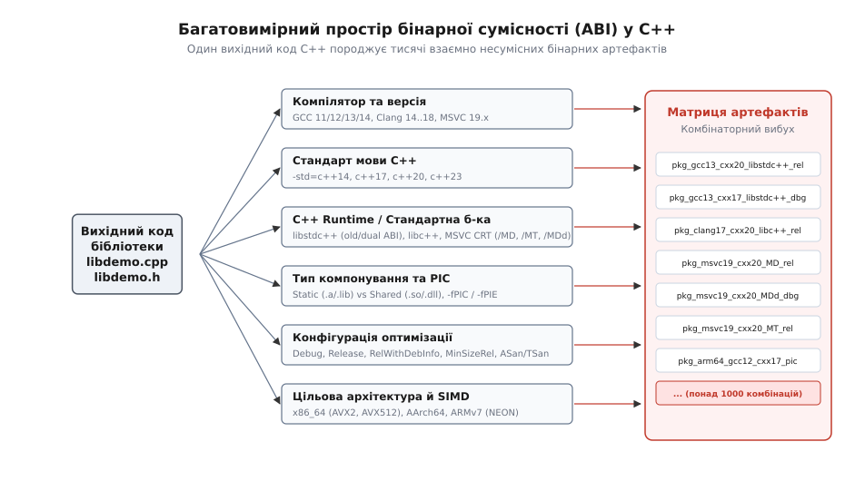
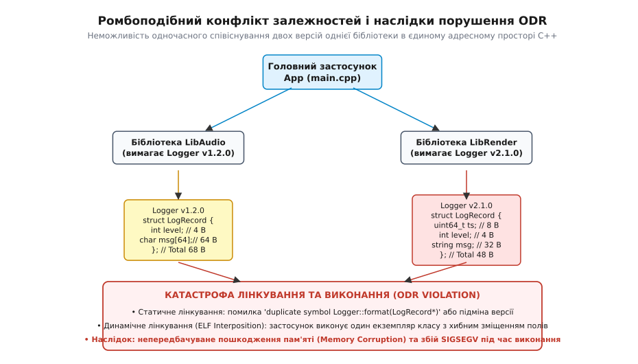
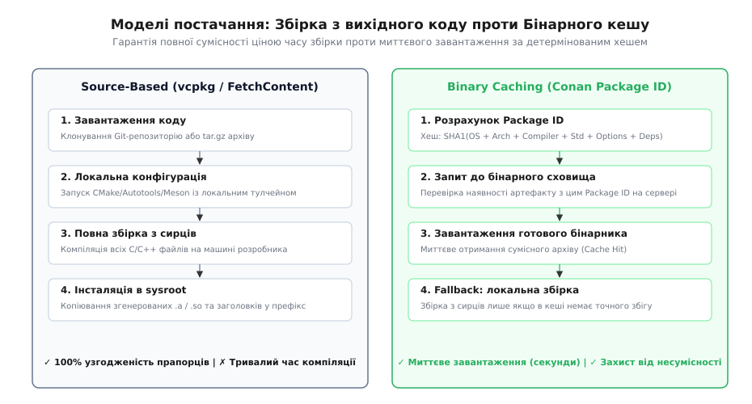
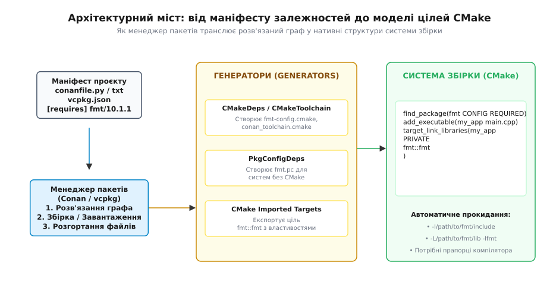

# Модель менеджера залежностей C++

<preknowlist>
- [Роль системи збірки: від дерева файлів до артефакту](topic:build-systems/build-system-role) — як система збірки керує процесом компіляції та лінкування.
- [Граф залежностей і порядок робіт](topic:build-systems/dependency-graph) — як формується орієнтований граф та обчислюється топологічний порядок збірки.
- [Правило одного визначення й зв'язування імен](topic:cpp-standards/odr-and-linkage) — чому мова C++ забороняє дублювання визначень і як працює компонувальник.
- [Цілі й властивості замість глобальних змінних](topic:build-systems/targets-and-properties) — сучасна модель CMake для передавання вимог використання (`INTERFACE`).
- [find_package: Config проти Module й імпортовані цілі](topic:build-systems/find-package) — механізм пошуку сторонніх пакетів та імпортування цілей.
</preknowlist>

Коли розробник на Rust додає бібліотеку `serde = "1.0"` у маніфест `Cargo.toml`, утиліта `cargo` завантажує вихідний код, транслює його єдиним офіційним компілятором `rustc` і бездоганно компонує фінальний виконуваний файл. У мові Python команда `pip install numpy` за секунду завантажує стандартизоване колесо (англ. *wheel*) із готовим двійковим кодом, яке миттєво підключається до інтерпретатора. Проте спроба підключити звичайну бібліотеку `libpng`, `OpenSSL` чи `Boost` до проєкту на C++ шляхом простого завантаження скомпільованого двійкового файлу `.so`, `.a` чи `.dll` із високою ймовірністю завершиться або аварійною відмовою лінкувальника через «невизначені символи» (англ. *undefined symbols*), або раптовим аварійним завершенням програми із помилкою `SIGSEGV` на першому ж зверненні до пам'яті.

Цей фундаментальний контраст виникає не через брак зручних консольних утиліт, а через глибинні властивості самого стека компіляції C та C++. У мовах зі стандартизованим середовищем виконання або єдиним офіційним компілятором пакет є завершеним двійковим артефактом або стандартизованим синтаксичним деревом. У C++ бібліотека не є автономним бінарником: це лише нескомпільований шаблон або напівфабрикат, який зобов'язаний на 100% збігтися з бінарним світом програми-споживача за десятками ортогональних вимірів — від моделі пам'яті компілятора до двійкового розташування полів у стандартних контейнерах. Керування залежностями (англ. *dependency management*, від лат. *dependere* — залежати, звисати) у C++ вимагає вирішення завдання координації несумісних двійкових інтерфейсів (ABI), розв'язання ромбоподібних конфліктів без порушення правила єдиного визначення (ODR) та побудови моста між менеджером пакетів і системою генерації збірки.

---

## 1. Стек трансляції C++: де живуть залежності

Щоб зрозуміти джерела складності керування залежностями, необхідно простежити шлях, який сторонній код проходить у процесі створення бінарного артефакту. На відміну від мов із динамічним завантаженням модулів, у C++ стороння бібліотека взаємодіє з проєктом-споживачем на трьох принципово різних стадіях трансляції:

1. **Стадія препроцесингу та компіляції (заголовочні файли `.h` / `.hpp`):**
   Компілятор зчитує вихідний файл `.cpp` і через директиви `#include` буквально вставляє вміст сторонніх заголовочних файлів у поточну одиницю трансляції (англ. *translation unit*). На цій стадії заголовок сторонньої бібліотеки компілюється з поточними налаштуваннями компілятора проєкту-споживача. Якщо бібліотека містить шаблони (шаблонні класи, функції) або вбудовані функції (`inline`), їхній машинний код генерується безпосередньо всередині об'єктного файлу `.o` / `.obj` вашого власного проєкту.
2. **Стадія статичного компонування (архіви `.a` / бібліотеки `.lib`):**
   Лінкувальник об'єднує скомпільовані об'єктні файли вашого проєкту зі скомпільованим кодом функцій сторонньої бібліотеки. Тут виконується зіставлення символьних імен (Symbol Resolution): кожен виклик зовнішньої функції отримує конкретну фізичну адресу в сегменті коду. На цьому етапі вимагається повна сумісність правил спотворення імен (Name Mangling) та конвенцій виклику функцій (Calling Conventions).
3. **Стадія динамічного завантаження та виконання (модулі `.so` / `.dll` / `.dylib`):**
   Якщо бібліотека скомпільована як динамічний модуль, операційна система (динамічний завантажувач `ld.so` у Linux або підсистема `LoadLibrary` у Windows) завантажує модуль у спільний адресний простір процесу. На цьому етапі критичними є глобальні структури пам'яті, спільні менеджери купи (Heap Managers), таблиці розкрутки стека винятків та двійкове розташування полів структур у пам'яті.

Помилка на будь-якому з цих трьох етапів повністю руйнує збірку або призводить до прихованого збою під час виконання. Історичну еволюцію того, як інженерна спільнота намагалася впорядкувати цей процес — від системних каталогів Unix до сучасних маніфестів, — детально викладено у довідці: [історію пакування C/C++](topic:build-systems/dependency-manager-model/hist-c-cpp-packaging.md).

---

## 2. Двійковий вибух: відсутність єдиного ABI та комбінаторика конфігурацій

Центральна причина складності полягає у відсутності єдиного двійкового інтерфейсу прикладного рівня (ABI — англ. *Application Binary Interface*, від лат. *applicare* — прикладати та *bini* — по двоє). Стандарт мови C++ описує виключно семантику вихідного тексту та абстрактну машину. Він навмисно не стандартизує двійкові деталі реалізації, залишаючи їх на розсуд розробників компіляторів та операційних систем.

Через це C++ не має єдиного стандарту для:
1. **Правил спотворення імен (Name Mangling):** компілятори сімейства Itanium ABI (GCC, Clang на Linux та macOS) кодують типи аргументів та простори імен за специфікацією `_ZN...`, тоді як MSVC на Windows використовує кардинально іншу схему `?func@Namespace@@...`. Навіть у межах одного компілятора різні версії можуть змінювати правила манглінгу для нових мовних конструкцій.
2. **Розташування таблиць віртуальних методів (vtable layout):** зміщення вказівників на методи, вказівники на інформацію про типи часу виконання (RTTI, `typeid`) та зміщення віртуальних базових класів різняться між компіляторами.
3. **Формату розкрутки стека винятків (Exception Unwinding):** Linux використовує таблиці `.eh_frame` стандарту DWARF, тоді як Windows спирається на структуровану обробку винятків (SEH).
4. **Двійкового розташування полів стандартної бібліотеки:** структури, розміри та зміщення полів у класах `std::string`, `std::vector`, `std::unique_ptr` та `std::map` є унікальними для кожної реалізації C++ Runtime.


*Багатовимірний простір параметрів компіляції C++: один вихідний код породжує тисячі взаємно несумісних двійкових артефактів.*

Цей простір утворюють шість головних осей несумісності:

### 1. Версія та діалект стандарту C++
Кожен новий стандарт C++ змінює властивості базових типів. Наприклад, об'єкт `std::string` у C++03 реалізовувався багатьма компіляторами через механізм підрахунку посилань із копіюванням при записі (англ. *Copy-On-Write*, COW). Стандарт C++11 прямо заборонив таку оптимізацію заради безпеки багатопотокового доступу, змусивши перейти на оптимізацію малих рядків (SSO). Клас `std::string` змінив свій розмір та внутрішні зміщення вказівників. Якщо скомпільована бібліотека передає `std::string` через межу функцій у модуль, зібраний із іншим стандартом, програма звертається до неіснуючих зміщень пам'яті й аварійно завершує роботу.

### 2. Реалізація стандартної бібліотеки (C++ Runtime)
На платформі Linux домінує `libstdc++` від проєкту GCC, на macOS та iOS — `libc++` від LLVM, а на Windows — Microsoft STL. Ці бібліотеки мають цілком різну внутрішню структуру. Передавання об'єкта `std::vector` між кодом, скомпільованим із `libstdc++`, і кодом, скомпільованим із `libc++`, є гарантованим збоєм на рівні пам'яті: `libc++` може зберігати розмір вектора як три вказівники (`begin`, `end`, `cap`), тоді як `libstdc++` може використовувати інше вирівнювання або внутрішні службові структури.

Показовим прикладом став випуск GCC 5.1 у 2015 році, де для переходу на стандарт C++11 було запроваджено подвійний двійковий інтерфейс (англ. *Dual ABI*). У бібліотеці `libstdc++` одночасно співіснували старий тип рядка в просторі імен `std::string` та новий `std::__cxx11::string`, що контролювалося макросом `_GLIBCXX_USE_CXX11_ABI=0` або `1`. Якщо проєкт намагався підключити статичну бібліотеку, зібрану зі старим ABI (`0`), до коду з новим ABI (`1`), лінкувальник видавав помилку `undefined reference to foo(std::__cxx11::string)`, хоча у вихідному коді обох модулів було написано `void foo(std::string)`.

### 3. Рантайми MSVC C/C++ на платформі Windows
На платформі Windows компанія Microsoft підтримує чотири взаємно несумісні конфігурації C Runtime (CRT):
* `/MD` — багатопотоковий динамічний рантайм для режиму Release (`msvcrt.dll` / `vcruntime140.dll`).
* `/MT` — багатопотоковий статичний рантайм Release (код CRT вшивається в кожен двійковий файл).
* `/MDd` — багатопотоковий динамічний рантайм Debug з увімкненою діагностикою пам'яті.
* `/MTd` — статичний налагоджувальний рантайм.

Змішування модулів із різними прапорцями CRT призводить до катастрофи купової пам'яті (англ. *heap corruption*). Налагоджувальний рантайм додає до кожного виділеного блоку пам'яті заголовок `_CrtMemBlockHeader` та захисні байти (`0xFD` для перевірки переповнення буфера). Якщо динамічна бібліотека, скомпільована з `/MD`, виділяє звичайний блок пам'яті через `malloc()`, а головний застосунок, зібраний із `/MDd` або `/MT`, намагається звільнити його через `free()`, менеджер купи не знаходить захисних байтів у заголовку блоку і генерує негайне аварійне переривання процесу. Більше того, у конфігурації `/MT` кожен модуль отримує власну ізольовану купу Win32 (`HeapCreate`), і спроба повернути блок пам'яті в чужу купу через `HeapFree` є фатальною помилкою операційної системи.

### 4. Рівень налагодження та діагностичні макроси
У налагоджувальному режимі (`Debug`) компілятори активують захисні структури. Наприклад, у MSVC макрос `_ITERATOR_DEBUG_LEVEL=2` додає до кожного ітератора та контейнера службові вказівники на головний контрольний вузол для виявлення виходу за межі діапазону. Через це розмір об'єкта `std::vector` у пам'яті збільшується на 8–16 байтів порівняно з режимом `Release`. Спроба передати такий контейнер у релізну бібліотеку миттєво руйнує стек або купу через невідповідність розмірів аргументів у машинному коді.

### 5. Режим компонування та позиційно-незалежний код (PIC)
Статична бібліотека (`.a` / `.lib`) є звичайним архівом об'єктних файлів, які вшиваються у фінальний бінарник на етапі лінкування. Динамічна бібліотека (`.so` / `.dll` / `.dylib`) завантажується операційною системою під час запуску програми. На 64-розрядних платформах Linux та macOS об'єктний код, призначений для включення у динамічну бібліотеку, обов'язково повинен компілюватися з прапорцем `-fPIC` (Position Independent Code) або `-fPIE` (Position Independent Executable). У цьому режимі компілятор звертається до глобальних змінних та функцій через таблицю глобальних зміщень (Global Offset Table, GOT) та процедурну таблицю зв'язування (Procedure Linkage Table, PLT). Якщо статична бібліотека зібрана без `-fPIC`, лінкувальник відмовиться вшивати її у динамічний модуль `.so` через неможливість виконання відносних переходів у пам'яті.

### 6. Апаратні інструкції цільового процесора (SIMD)
Якщо бібліотеку скомпільовано з прапорцем `-mavx2` або `-mavx512`, компілятор оптимізує математичні операції, генеруючи векторні інструкції, які вимагають суворого вирівнювання структур у пам'яті за 32-байтною або 64-байтною межею. Якщо програма-споживач скомпільована без цих прапорців і розміщує структуру на стеку зі стандартним 16-байтним вирівнюванням, передавання вказівника у векторну бібліотеку призводить до апаратного винятку процесора — General Protection Fault (`SIGSEGV`).

---

## 3. Граф залежностей, ромбоподібний конфлікт та катастрофа ODR

Будь-який нетривіальний програмний проєкт спирається на десятки прямих і непрямих (транзитивних — від лат. *transitivus*, перехідний) бібліотек. Менеджер пакетів формує орієнтований граф залежностей (англ. *Directed Acyclic Graph*, DAG), де вершинами є конкретні пакети, а ребрами — зв'язки споживання.

У багатьох екосистемах (наприклад, у Node.js із менеджером `npm` або у Rust за умови ізольованого використання через `cargo`) допускається так зване багатоверсійне співіснування (англ. *multi-version coexistence*): якщо бібліотека `A` потребує `Logger v1.0`, а бібліотека `B` потребує `Logger v2.0`, обидві версії завантажуються одночасно й ізолюються у власних просторах імен або файлових каталогах.

У мові C++ така ізоляція є принципово неможливою через базові закони компонування та **Правило одного визначення** (ODR — англ. *One Definition Rule*, [правило одного визначення](topic:cpp-standards/odr-and-linkage)).


*Ромбоподібна залежність у C++: спроба змішування різних версій однієї бібліотеки призводить до дублювання символів або прихованого пошкодження пам'яті через підміну визначень структур.*

### Анатомія ромбоподібної залежності (Diamond Dependency)

Розглянемо класичну ромбоподібну схему:
* Головний застосунок `App` залежить від аудіо-модуля `LibAudio` та рендер-модуля `LibRender`.
* `LibAudio` вимагає бібліотеку журналювання `Logger v1.2.0`.
* `LibRender` вимагає оновлену версію `Logger v2.1.0`.

У версії `Logger v1.2.0` структура запису логу мала вигляд:

```cpp
// Logger v1.2.0 (використовується в LibAudio)
struct LogRecord {
    int level;      // 4 байти (зміщення 0)
    char msg[64];   // 64 байти (зміщення 4)
}; // Загальний розмір: 68 байтів
```

У версії `Logger v2.1.0` розробники додали мітку часу та перейшли на динамічний рядок:

```cpp
// Logger v2.1.0 (використовується в LibRender)
struct LogRecord {
    uint64_t timestamp; // 8 байтів (зміщення 0)
    int level;          // 4 байти (зміщення 8)
    std::string msg;    // 32 байти (зміщення 16)
}; // Загальний розмір: 48 байтів (з урахуванням вирівнювання)
```

Що відбувається під час спроби зібрати `App` із двома версіями `Logger`?

1. **Сценарій 1: Статичне компонування.** Лінкувальник зустрічає два однакові глобальні символи для функцій бібліотеки `Logger` (наприклад, `Logger::format(LogRecord*)`). Він або аварійно зупиняє збірку з повідомленням `multiple definition of 'Logger::format()'`, або (якщо символи мають слабке зв'язування чи позначені як `inline`) випадковим чином обирає перше ліпше визначення і викидає інше (COMDAT folding).
2. **Сценарій 2: Динамічне компонування (ELF Symbol Interposition).** Якщо версії скомпільовані як спільні бібліотеки `liblogger.so.1` та `liblogger.so.2`, динамічний завантажувач Linux (`ld.so`) за замовчуванням використовує глобальний простір імен символів процесу. Перший знайдений символ перекриває (англ. *interposes*) усі однойменні символи в інших бібліотеках. Коли `LibRender` викликає метод `format()`, сподіваючись на структуру `v2.1.0`, він потрапляє у машинний код функції `v1.2.0`. Функція зчитує поле `msg` за зміщенням 4 замість 16 і записує дані повз межі виділеного блоку пам'яті. Результат — непередбачуване пошкодження пам'яті (англ. *silent memory corruption*) або миттєвий краш `SIGSEGV`.
3. **Сценарій 3: Глобальний стан.** Якщо `Logger` містить синглтон, пул потоків або статичний буфер, у пам'яті виникають два конфліктні глобальні стани, які блокують спільні ресурси або пишуть в один і той самий дескриптор файлу без синхронізації.

### Розв'язання конфліктів: вимога єдиної версії (Single-Version Constraint)

Через неможливість ізоляції версій менеджер пакетів C++ зобов'язаний гарантувати, що **в усьому графі збірки кожен пакунок представлений рівно в одному екземплярі та єдиній версії**.

Для розв'язання цієї задачі менеджери застосовують два головні підходи:
1. **Алгоритми задоволення обмежень (SAT / SMT Solvers).** Менеджер перетворює граф залежностей у систему булевих обмежень у кон'юнктивній нормальній формі (CNF), де кожне ребро задає допустимий інтервал версій (згідно з SemVer: `^1.0.0`, `>=2.0, <3.0`). Солвер (наприклад, DPLL або CDCL алгоритми) обчислює єдиний набір версій, що задовольняє вимоги всіх вузлів одночасно. Якщо перетин діапазонів порожній (наприклад, `LibAudio` жорстко вимагає `<2.0`, а `LibRender` — `>=2.0`), менеджер негайно зупиняє роботу й видає чіткий звіт про нерозв'язний конфлікт версій, вимагаючи втручання розробника (через механізм `override` або оновлення однієї з бібліотек).
2. **Вибір мінімальної версії (Minimal Version Selection, MVS).** Підхід, популярний у мові Go та адаптований деякими інструментами C++: для кожного модуля обирається найстаріша з явно дозволених версій, що гарантує максимальну стабільність і передбачуваність дерева.

---

## 4. Моделі постачання: Збірка з вихідного коду проти Бінарного кешування

Після того, як граф залежностей і точні версії визначено, менеджер пакетів повинен надати скомпільовані бібліотеки та заголовочні файли для підключення до збірки. В індустрії утвердилися дві фундаментальні моделі постачання.


*Порівняння моделі збірки з вихідного коду (Source-based) та моделі бінарного кешування (Binary Caching).*

### 1. Модель повної збірки з вихідного коду (Source-Based Model)

У цій моделі (яку за замовчуванням реалізують `vcpkg`, `FetchContent` у CMake або `ports` у FreeBSD) менеджер завантажує виключно вихідний код бібліотек (архіви `.tar.gz` або Git-репозиторії). Далі на комп'ютері розробника викликається нативна система збірки кожної залежності (CMake, Autotools, Meson тощо) з використанням активного компілятора та системних прапорців.

**Переваги моделі:**
* **Абсолютна бінарна сумісність:** Оскільки всі бібліотеки компілюються тим самим компілятором, з тими самими прапорцями оптимізації, версією стандарту C++ та налаштуваннями CRT, імовірність несумісності ABI зводиться до нуля.
* **Незалежність від сторонньої двійкової інфраструктури:** Немає потреби підтримувати гігантські сховища готових бінарників для всіх можливих операційних систем та версій процесорів.

**Недоліки моделі:**
* **Колосальні витрати часу:** Збірка великих залежностей, таких як Boost, Qt, LLVM чи OpenCV, з вихідного коду може тривати від 30 хвилин до кількох годин на машині розробника або в конвеєрі неперервної інтеграції (CI).
* **Вимоги до інструментального оточення:** Щоб скомпілювати старі бібліотеки C, на машині мають бути встановлені Perl, Python, NASM, Autotools, Bison, Flex тощо, що ускладнює налаштування робочих станцій розробників.

### 2. Модель бінарного кешування та хешування (Binary Caching Model)

Модель, реалізована в менеджері **Conan**, поєднує переваги готових бінарників із гарантіями бінарної сумісності. Вона спирається на поняття **Package ID** — детермінованого криптографічного хешу, що однозначно ідентифікує конкретну бінарну конфігурацію.

Математично розрахунок Package ID є згорткою повної множини параметрів компіляції:

```text
Package_ID = SHA1(
    os + arch + compiler + compiler.version + compiler.cppstd + compiler.runtime +
    build_type + options + transitive_dependency_package_ids
)
```

Процес отримання пакета виглядає так:
1. Клієнт аналізує поточний профіль машини (наприклад: Linux, x86_64, GCC 13, C++20, Release, libstdc++11, static).
2. За строгою специфікацією обчислюється 40-символьний або 64-символьний Package ID для потрібної бібліотеки.
3. Менеджер робить запит до локального кешу або віддаленого сховища (Artifactory, Conan Center).
4. Якщо бінарник із таким Package ID знайдено (**Cache Hit**), завантажується невеликий архів із готовими `.a`/`.so` та `.h` файлами (це займає 1–2 секунди).
5. Якщо точного збігу немає (**Cache Miss**), менеджер автоматично переходить у резервний режим (Fallback): завантажує вихідний код, компілює пакет локально з поточним профілем, зберігає згенерований бінарник у кеш під розрахованим Package ID і передає його збірці.

Детальну реалізацію обчислення та канонізації хешу наведено у проєктній довідці: [алгоритм розрахунку Package ID](topic:build-systems/dependency-manager-model/proj-package-id-hash.md).

---

## 5. Міст між менеджером пакетів і системою збірки: Генератори та Імпортовані цілі

Найважливіший архітектурний принцип сучасного C++: **менеджер пакетів не є системою збірки, а система збірки не повинна бути менеджером пакетів**.

Система збірки (CMake, Ninja, Meson, MSBuild) відповідає за компіляцію файлів поточного проєкту, відстеження змін у вихідному коді та генерацію артефактів. Менеджер пакетів (Conan, vcpkg) відповідає за пошук, завантаження та розгортання сторонніх бібліотек на диску.

Між ними існує архітектурний міст, який реалізується через патерн **Генератор (Generator)**.


*Архітектура взаємодії: менеджер пакетів транслює стан розв'язаного графа у стандартні конфігураційні файли та імпортовані цілі системи збірки.*

### Механіка генерації файлів конфігурації

Коли менеджер розгортає залежності, він не змінює системні каталоги `/usr/lib`. Замість цього він створює набір файлів-дескрипторів безпосередньо у каталозі збірки:

1. **Генерація скриптів `find_package`:**
   Менеджер генерує конфігураційні файли виду `fmt-config.cmake` або `OpenSSLConfig.cmake`. Усередині цих файлів створюються імпортовані цілі CMake (`IMPORTED TARGETS`, [цілі й властивості замість глобальних змінних](topic:build-systems/targets-and-properties)), такі як `fmt::fmt` чи `OpenSSL::Crypto`.

2. **Інкапсуляція властивостей використання (Usage Requirements):**
   На кожну імпортовану ціль навішуються властивості, які автоматично поширюються на будь-яку ціль проєкту, що підключає її через `target_link_libraries()`:
   * `INTERFACE_INCLUDE_DIRECTORIES` — шляхи до заголовків у локальному кеші менеджера.
   * `INTERFACE_COMPILE_DEFINITIONS` — макроси препроцесора, потрібні для використання бібліотеки.
   * `INTERFACE_COMPILE_OPTIONS` — спеціальні прапорці компілятора.
   * `INTERFACE_LINK_LIBRARIES` — транзитивні системні бібліотеки (наприклад, `-lpthread`, `-ldl` або `-lws2_32`).
   * `IMPORTED_LOCATION_<CONFIG>` — точний абсолютний шлях до файлу `.a`, `.so`, `.lib` для відповідної конфігурації (Release/Debug).

3. **Файл тулчейна (CMake Toolchain File):**
   Менеджер генерує файл `conan_toolchain.cmake` або надає `vcpkg.cmake`. Цей файл передається у CMake через аргумент `-DCMAKE_TOOLCHAIN_FILE=...` на стадії конфігурації. Скрипт тулчейна автоматично:
   * Додає каталоги згенерованих файлів конфігурації до списку `CMAKE_PREFIX_PATH`.
   * Налаштовує прапорці компілятора та сумісність із системним рантаймом.
   * Перехоплює стандартні виклики `find_package()`, перенаправляючи їх на пакети, надані менеджером.

4. **Динамічний пошук спільних бібліотек (`rpath` та `RUNPATH`):**
   Під час використання динамічних бібліотек генератори автоматично налаштовують прапорці `CMAKE_INSTALL_RPATH` або `$ORIGIN` (у Linux) та `@rpath` (у macOS). Завдяки цьому скомпільований виконуваний файл може завантажувати сторонні `.so` та `.dylib` модулі безпосередньо з каталогу кешу менеджера або каталогу інсталяції без необхідності глобальної зміни змінної середовища `LD_LIBRARY_PATH`.

### Код проєкту: чистий стандартний CMake

Завдяки генераторам вихідний файл `CMakeLists.txt` вашого проєкту залишається на 100% чистим і не містить жодного слова про конкретний менеджер пакетів (ні `conan`, ні `vcpkg`):

```cmake
cmake_minimum_required(VERSION 3.20)
project(ImageProcessingService LANGUAGES CXX)

# Стандартний пошук конфігурації, згенерованої менеджером
find_package(fmt CONFIG REQUIRED)
find_package(PNG CONFIG REQUIRED)

add_executable(image_processor src/main.cpp src/filter.cpp)

# Імпортовані цілі самостійно передають усі шляхи, бібліотеки та дефайни
target_link_libraries(image_processor
    PRIVATE
        fmt::fmt
        PNG::PNG
)
```

Повний опис структур, схем маніфестів `vcpkg.json`, `conanfile.py` та властивостей згенерованих цілей наведено у довідці: [специфікацію контрактів маніфестів і генераторів](topic:build-systems/dependency-manager-model/api-dependency-graph-contract.md).

---

## 6. Виклик модулів C++20 для екосистеми пакетів

Поява модулів у стандарті C++20 (англ. *C++20 Modules*) докорінно змінює взаємодію між вихідним кодом та двійковими артефактами. Традиційні заголовочні файли `#include` вимагали лише текстової підстановки під час препроцесингу. Модулі (`import foo;`) вимагають наявності попередньо скомпільованого двійкового інтерфейсу модуля (BMI — англ. *Binary Module Interface*, формат `.ifc` у MSVC, `.pcm` у Clang, `.gcm` у GCC).

Для менеджерів пакетів це створює новий фундаментальний виклик:
1. **Непридатність BMI для поширення у пребілд-пакетах:** Формат BMI є на 100% залежним від конкретного бінарника компілятора та його внутрішніх прапорців оптимізації. Навіть мінорне оновлення компілятора робить згенерований `.pcm` непридатним для використання.
2. **Динамічне сканування залежностей:** Система збірки (CMake 3.28+) повинна виконати стадію сканування коду (згідно зі стандартом P1689R5) перед запуском компіляції будь-якого об'єктного файлу, щоб визначити порядок збірки модульних інтерфейсів. Менеджер пакетів повинен надавати вихідні файли модульних інтерфейсів (`.ixx`, `.cppm`) та карти модулів (Module Maps), передаючи системі збірки повну інформацію про доступні модулі пакета.

---

## 7. Порівняння підходів: як обрати модель для проєкту

Вибір конкретної моделі керування залежностями визначається масштабом кодової бази, вимогами до швидкості збірки на CI та цільовими платформами.

| Критерій порівняння | Git Submodules / Vendoring | CMake FetchContent | vcpkg (Manifest Mode) | Conan 2.0 |
| :--- | :--- | :--- | :--- | :--- |
| **Одиниця постачання** | Сирці в репозиторії | Сирці через URL/Git | Рецепти портів (сирці/кеш) | Бінарні пакети (Package ID) / сирці |
| **Швидкість чистих збірок** | Повільна (все з нуля) | Повільна (все з нуля) | Середня / Швидка (Binary caching) | Миттєва (Prebuilt binaries) |
| **Керування ABI** | Ручне узгодження | Автоматичне (через проєкт) | Автоматичне (через триплети) | Автоматичне (через профілі й хеші) |
| **Розв'язання ромбів** | Відсутнє (ручні конфлікти) | Останній виграє / конфлікт | Декларативне (SemVer / Baseline) | SAT-солвер з перевіркою версій |
| **Складність підтримки** | Висока (ручні оновлення) | Низька (лише CMake) | Низька / Середня | Середня (потрібен Python) |
| **Крос-компіляція** | Складна | Залежить від тулчейна | Чудова (Triplets) | Ідеальна (Два профілі: Build/Host) |

---

## 8. Практичні правила надійної архітектури залежностей

> 🔧 **Навіщо це.**
> У великих промислових системах навіть дрібна зміна у транзитивній бібліотеці здатна зруйнувати бінарну сумісність або спричинити витік символів. Дотримання строгих інженерних правил захищає проєкт від невідтворюваних збірок та аварій у продуктивному середовищі.

1. **Завжди фіксуйте версії через файли блокування (Lockfiles):**
   Використання плаваючих діапазонів на кшталт `openssl/[>=3.0.0]` у маніфесті зручне під час розробки, але небезпечне на релізі. Без фіксації оновлення мінорної версії на віддаленому сервері вночі може призвести до того, що ранкова збірка на CI впаде. Менеджери генерують файли блокування (`conan.lock` або `vcpkg-lock.json`), які фіксують точні хеші та версії всіх вузлів графа.
2. **Розділяйте профіль хоста (Build Profile) та профіль цілі (Host Profile) під час крос-компіляції:**
   Якщо ви збираєте застосунок для ARM Linux на робочій станції з x86_64, вам потрібні дві категорії залежностей: інструменти кодогенерації (Protobuf compiler, NASM, CMake) мають компілюватися для архітектури збірки (x86_64), а цільові бібліотеки (OpenSSL, fmt, SQLite) — для цільового процесора (ARM). Змішування цих категорій призводить до спроби запустити бінарник ARM на комп'ютері розробника під час генерації коду.
3. **Ізолюйте двійкові межі через C-ABI або ідіому Pimpl:**
   Якщо ваша бібліотека поширюється як скомпільований SDK для сторонніх замовників, публічний заголовочний файл не повинен містити типи стандартної бібліотеки (`std::string`, `std::vector`, `std::function`). Використовуйте чистий C-інтерфейс (`extern "C"`, примітивні типи, непрозорі вказівники `void*`) або патерн Pimpl (Pointer to Implementation). Це дозволить замовнику підключати вашу бібліотеку до коду, зібраного будь-яким компілятором C++, без остраху перед розходженням ABI.
4. **Ніколи не покладайтеся на неявні системні бібліотеки в `/usr/local`:**
   Кожна бібліотека, від якої залежить код, має бути явно задекларована у маніфесті пакета. Випадкове підтягування заголовка із `/usr/include` замість ізольованого каталогу менеджера породжує ефект «на моєму комп'ютері збирається, а на CI падає».
