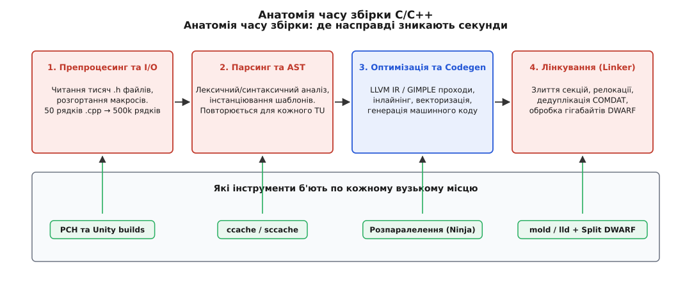
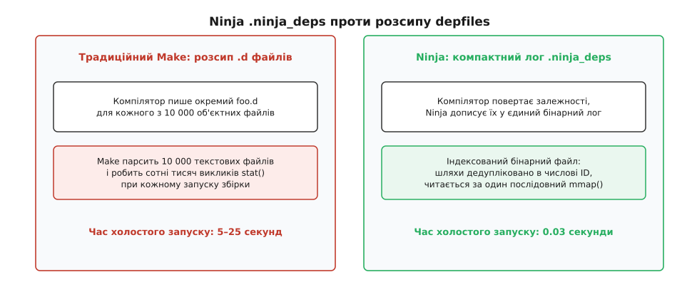
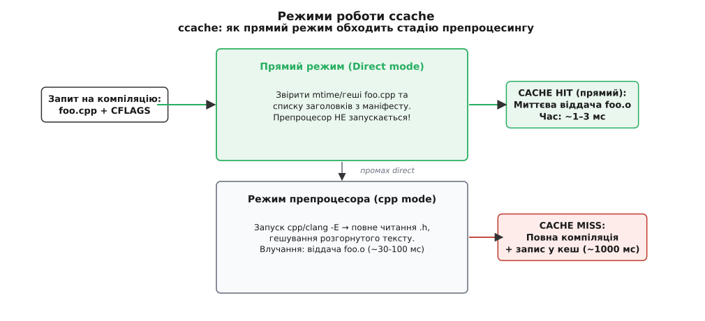
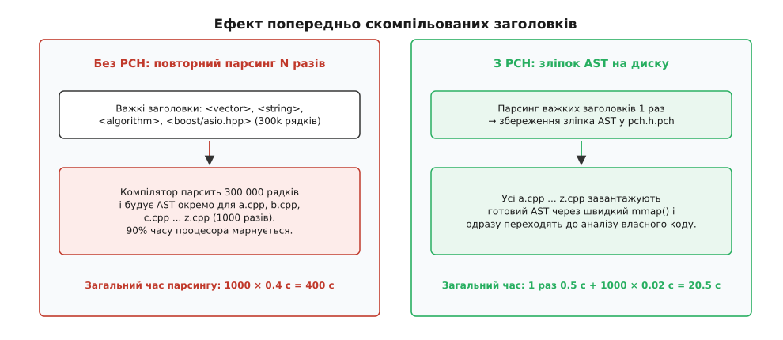
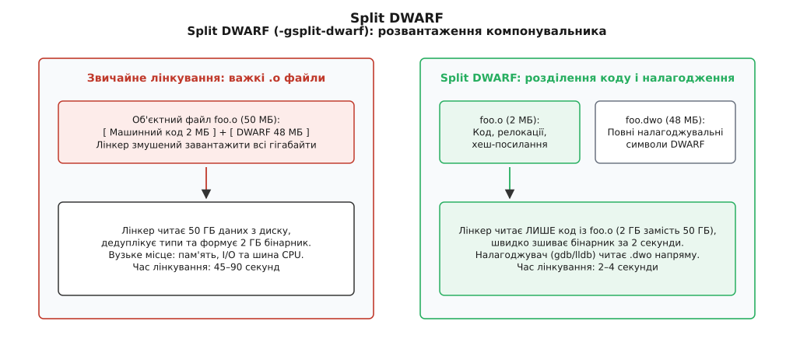

# Швидкість збірки: Ninja, ccache, PCH, unity

<preknowlist>
- [Компіляція](book:programming/compilation) — одиниці трансляції, стадії компілятора, препроцесинг і створення об'єктних файлів.
- [Лінкування](book:programming/linking) — компонування символів, релокації та об'єднання секцій у бінарний артефакт.
- [Граф залежностей і порядок робіт](book:build-systems/dependency-graph) — топологічний порядок, критичний шлях збірки та паралелізм.
- [Роль системи збірки](book:build-systems/build-system-role) — ключ задачі, актуальність артефактів і мінімізація зайвої роботи.
- [Інкрементальна збірка](book:build-systems/incremental-build) — виявлення змін за часовими мітками mtime та гешами вмісту.
</preknowlist>

Ви змінюєте визначення однієї структури в базовому заголовку `types.h` проєкту на три тисячі вихідних файлів. Натискаєте клавішу збірки на шістнадцятиядерній робочій станції: вентилятори гудуть на повну потужність сім хвилин, процесорні ядра нагріваються до межі, а після завершення з'ясовується, що результуючий машинний код для дев'яноста п'яти відсотків функцій не змінився ні на один біт. Більшість цього часу пішла не на генерацію корисних інструкцій процесора, а на монотонне, багаторазове перечитування та синтаксичний розбір одних і тих самих текстових рядків.

Час компіляції програм мовами C та C++ визначається фундаментальною моделлю мови, закладеною ще в 1970-х роках: повною ізоляцією одиниць трансляції та текстовим включенням заголовків. Щоб прискорити процес у десять чи п'ятдесят разів, інженери створили цілий арсенал спеціалізованих інструментів, кожен із яких цілить у конкретне вузьке місце: планувальник задач Ninja, компіляторні кеші ccache та sccache, зліпки абстрактних синтаксичних дерев у вигляді попередньо скомпільованих заголовків (PCH), об'єднання вихідних файлів у єдині пакети (unity builds) та паралельні компонувальники нової генерації з розділеною налагоджувальною інформацією.

## Анатомія часу збірки: де насправді зникають такти

Щоб зрозуміти, чому компіляція триває хвилинами, необхідно простежити шлях, який проходить звичайний вихідний файл через компіляторний конвеєр.

Кожна одиниця трансляції (англ. *translation unit*) починається з джерельного файлу `.cpp` або `.c`. Компілятор нічого не знає про інші файли проєкту; він бачить лише те, що потрапляє в його вхідний потік. Першим кроком запускається препроцесор (лат. *prae* — попереду, *processus* — просування). Директива `#include` буквально копіює вміст зазначеного заголовка на місце самого виклику. Якщо заголовок містить власні `#include`, процес повторюється рекурсивно.

Тут криється перше масштабне навантаження на дискову підсистему введення-виведення (I/O). Коли в коді написано `#include <vector>`, компілятор змушений послідовно перевірити кожен каталог пошуку, переданий через прапорці `-I` або `-isystem`. Якщо у великому проєкті налаштовано 50 шляхів пошуку, на кожен заголовок операційна система може виконати десятки невдалих системних викликів `stat()` або `open()`, перш ніж файл буде знайдено. Якщо 2000 одиниць трансляції включають по 500 заголовків кожна, сумарна кількість звернень до метаданих файлової системи сягає десятків мільйонів операцій.

Невеликий файл `engine.cpp` розміром у 50 рядків коду, який підключає стандартні заголовки `<vector>`, `<string>`, `<algorithm>`, `<unordered_map>` та декілька внутрішніх бібліотек, після роботи препроцесора перетворюється на монолітний текстовий потік обсягом від 400 000 до 800 000 рядків. Якщо в проєкті 2000 таких `.cpp` файлів, компілятор за час повної збірки змушений прочитати, розгорнути та перевірити близько одного мільярда рядків тексту, переважна більшість з яких є ідентичними копіями стандартної бібліотеки.

Наступна стадія — лексичний, синтаксичний та семантичний аналіз (побудова абстрактного синтаксичного дерева, AST). Компілятор перевіряє типи, розв'язує перевантаження функцій та інстанціює шаблони (лат. *instantia* — наочний приклад). Шаблони C++ (`template`) є повноцінною мовою метапрограмування періоду компіляції: розгортання складних типів, перевірка концептів (`concepts`), рекурсивні спеціалізації та обчислення виразів `constexpr` споживають гігабайти оперативної пам'яті та левову частку процесорних тактів у фронтенді компілятора.

Кожна одиниця трансляції, яка використовує `std::vector<MyStruct>`, змушена самостійно та повністю згенерувати машинний код усіх методів вектора (`push_back`, `resize`, деструктор) у своєму власному об'єктному файлі. Оскільки стандарт вимагає дотримання правила одного означення (ODR, One Definition Rule), компілятор позначає ці дубльовані функції спеціальними секціями зі слабким зв'язуванням (секції COMDAT у форматі ELF або `linkonce_odr` в LLVM IR). Це означає, що компілятор витрачає час процесора на генерацію однакового коду тисячі разів, знаючи наперед, що компонувальник викине 999 із цих копій.

Далі оптимізатор компілятора (наприклад, проходи LLVM або GCC GIMPLE) перетворює проміжне представлення: виконує вбудовування функцій (інлайнінг), векторизацію циклів, усунення мертвого коду та розподіл регістрів процесора. На фінальному етапі бекенд генерує машинний код і формує об'єктний файл `.o` (або `.obj`).

```
engine.cpp (50 рядків)
      ↓  [Препроцесор: пошук шляхів -I + копіювання <vector>, <string>...]
Текстовий потік (600 000 рядків)
      ↓  [Парсинг + семантика + інстанціювання шаблонів]
Абстрактне синтаксичне дерево (AST)
      ↓  [Оптимізація проміжного коду IR: -O2 / -O3]
Машинний код + секції COMDAT + налагоджувальні символи DWARF
      ↓
engine.o (розмір: 25 МБ, з них 23 МБ — налагоджувальна інформація)
```

Останнім бар'єром стає лінкер (компонувальник, англ. *linker*). Якщо компіляцію тисяч файлів можна легко розподілити між усіма доступними ядрами процесора, то класичне лінкування є послідовним процесом. Лінкер змушений завантажити в пам'ять усі об'єктні файли, розв'язати перехресні посилання на символи, виконати релокації, викинути дублікати коду шаблонів із секцій COMDAT і дедуплікувати (лат. *de* — скасування, *duplicare* — подвоювати) гігабайти налагоджувальної інформації.



*Стадії конвеєра збірки C/C++: від дублювання тексту препроцесором до навантаження лінкера велетенськими таблицями символів і секціями DWARF.*

Для виявлення точних джерел затримок сучасні компілятори мають вбудовані засоби профілювання. Прапорець Clang `-ftime-trace` записує детальний JSON-профіль кожної мілісекунди роботи компілятора (який відкривається у візуалізаторах `chrome://tracing` або Speedscope), показуючи, які саме заголовки розгорталися найдовше і які шаблони вимагали найбільшої глибини інстанціювання.

Кожна ділянка цього конвеєра впирається у свій фізичний ресурс: препроцесинг — у швидкість читання дрібних файлів з диска (I/O); парсинг і розгортання шаблонів — в однопотокову швидкодію процесора та розмір кешу інструкцій; оптимізація — в обчислювальну потужність усіх ядер; лінкування — у пропускну здатність шини пам'яті та однопотокову швидкість запису фінального бінарника на диск.

## Чому Make буксує на великих графах: підхід Ninja

Перш ніж оптимізувати роботу самого компілятора, необхідно звернути увагу на інструмент, який керує чергою задач — систему збірки. Протягом десятиліть стандартом де-факто була утиліта Make. Проте на проєктах масштабу Google Chromium, LLVM або рушіїв відеоігор Make починає витрачати десятки секунд лише на те, щоб з'ясувати, чи потрібно взагалі щось робити.

Причина криється в архітектурі Make. Це повноцінна інтерпретована мова зі змінними, макросами, умовами (`ifeq`), функціями пошуку файлів за маскою (`$(wildcard ...)`) та складними правилами підстановки суфіксів. Кожного разу, коли розробник запускає `make`, утиліта змушена заново інтерпретувати сотні включених файлів `Makefile`, обчислювати динамічні вирази та послідовно опитувати стан файлової системи за допомогою системних викликів `stat()`.

У 2011 році Еван Мартін (Evan Martin), працюючи над браузером Chromium, зіткнувся з тим, що холостий запуск `make` на готовому дереві збірки тривав понад двадцять секунд. У відповідь він створив **Ninja** — утиліту збірки, спроєктовану з єдиною метою: працювати настільки швидко, наскільки це фізично дозволяє апаратне забезпечення.

Головна ідея Ninja полягає в тому, що людина ніколи не повинна писати маніфести `build.ninja` вручну. Маніфест створюють генератори вищого рівня — CMake або Meson. Завдяки цьому з мови Ninja повністю прибрано все зайве: умовні оператори, цикли, вбудовані функції та пошук файлів на диску. Маніфест Ninja — це статичний опис графа залежностей (DAG, directed acyclic graph), оптимізований для миттєвого парсингу в пам'ять.

```ninja
# Фрагмент статичного маніфесту build.ninja
pool link_pool
  depth = 2

rule CXX_COMPILER
  depfile = $DEP_FILE
  deps = gcc
  command = c++ $DEFINES $INCLUDES $FLAGS -MD -MT $out -MF $DEP_FILE -o $out -c $in
  description = Building CXX object $out

rule CXX_LINKER
  command = c++ $FLAGS $LINK_LIBRARIES -o $out $in
  pool = link_pool
  description = Linking CXX executable $out

build CMakeFiles/app.dir/engine.cpp.o: CXX_COMPILER src/engine.cpp
  DEP_FILE = CMakeFiles/app.dir/engine.cpp.o.d
  FLAGS = -O3 -Wall -std=c++20
```

У внутрішній архітектурі Ninja граф представляється трьома основними класами: `Node` (файли та цілі), `Edge` (команди перетворення) та `State` (загальний пул графа). Парсер Ninja написаний на C++ вручну з використанням генератора лексерів `re2c` без проміжних виділень пам'яті для рядків, що дає змогу прочитати маніфест на 500 000 рядків за 0.03 секунди.

Крім того, Ninja надає механізм пулів ресурсів (`pool`). Оскільки паралельний запуск 16 лінкерів одночасно неминуче призведе до аварійного вичерпання оперативної пам'яті (OOM, Out Of Memory), Ninja дозволяє обмежити кількість важких операцій компонування окремим пулом з глибиною `depth = 2`, продовжуючи компілювати решту джерел на всіх інших ядрах.

Для збереження швидкості Ninja реалізує два критичні внутрішні механізми: журнал виконання `.ninja_log` та бінарний реєстр неявних залежностей `.ninja_deps`.

Журнал `.ninja_log` є плоским текстовим файлом, куди Ninja після виконання кожної команди записує час початку, час завершення, мітку часу згенерованого файлу та 64-бітний геш рядка виконаної команди. Завдяки збереженому гешу команди Ninja автоматично виявляє зміну прапорців збірки: якщо розробник змінив `-O2` на `-O3` в конфігурації, Ninja бачить невідповідність збереженого гешу команди поточному рядку і перезбирає цільовий файл навіть за незмінної мітки часу вихідного коду.

Другий механізм вирішує ще дорожчу проблему — облік неявних залежностей від заголовків. Коли компілятор обробляє `engine.cpp`, він дізнається повний перелік усіх включених `.h` файлів і зберігає його у форматі depfile (наприклад, `engine.d`). Традиційному Make доводиться відкривати, читати та парсити десятки тисяч окремих файлів `.d` на диску під час кожного запуску збірки.

Ninja натомість збирає інформацію про заголовки безпосередньо з виводу компілятора (через прапорець `/showIncludes` у MSVC або через читання `.d` одразу після виконання команди в GCC/Clang) і зберігає її в єдиному монолітному бінарному файлі `.ninja_deps`.

```
Формат запису в .ninja_deps:
[Заголовок запису: ID цільового файлу, mtime]
  → [Кількість залежностей: N]
  → [Масив 32-бітних числових ID файлів-заголовків: ID₁, ID₂, ... IDₙ]
```

Усі рядки шляхів до файлів дедуплікуються та отримують унікальний цілочисельний ідентифікатор. Під час наступного старту Ninja завантажує весь `.ninja_deps` в пам'ять за один системний виклик через відображення файлу в пам'ять (`mmap`), миттєво отримуючи повну карту залежностей усього проєкту без жодного зайвого звернення до диска.



*Традиційний розсип текстових depfiles змушує Make відкривати тисячі файлів на диску, тоді як Ninja зчитує єдиний компактний бінарний лог .ninja_deps за лічені мілісекунди.*

Завдяки такій структурі холостий запуск збірки на проєкті з 50 000 файлів у Ninja триває менше 0.05 секунди проти десятків секунд у класичному Make.

## Компіляторний кеш: ccache та sccache

Оптимізація графа збірки захищає від зайвих викликів, але що робити, коли виклик компілятора є неминучим? Розробник часто перемикається між гілками системи контролю версій (`git checkout`), робить тимчасові зміни з наступним їх скасуванням (`git stash pop`) або запускає повну збірку проєкту з нуля на сервері неперервної інтеграції (CI). У всіх цих випадках компілятор знову і знову виконує повністю ідентичну роботу над кодом, який уже колись був скомпільований.

Розв'язанням цієї проблеми є **компіляторне кешування** (фр. *cacher* — ховати), реалізоване в таких утилітах, як `ccache` та `sccache`.

Утиліта підміняє собою реальний компілятор або виступає в ролі обгортки (через властивість `CMAKE_CXX_COMPILER_LAUNCHER`). Коли система збірки передає команду компіляції, кешер обчислює криптографічний геш усіх вхідних параметрів задачі. Якщо результат із таким ключем уже лежить у локальному або мережевому сховищі, кешер миттєво повертає збережений об'єктний файл, попередження компілятора (`stderr`) та діагностику, взагалі не запускаючи реальний `g++` чи `clang++`.

Ключ кешування складається з таких компонентів:
- Геш виконуваного файлу компілятора (його розмір, дата модифікації або внутрішній геш бінарника);
- Рядок команди компіляції (прапорці оптимізації, макроси, параметри попереджень);
- Точний вміст усіх джерельних файлів та включених заголовків;
- Поточний робочий каталог (якщо використовуються абсолютні шляхи в налагоджувальній інформації).

Для коректного розділення кешу між різними робочими каталогами критично важливо усувати абсолютні шляхи з налагоджувальних символів. Прапорець компілятора `-fdebug-prefix-map=/home/user/project=.` або прапорець Clang `-ffile-prefix-map` замінює абсолютні шляхи у вихідних таблицях DWARF на відносні. Без цього об'єктний файл, зібраний на машині CI в каталозі `/builds/runner-1/`, ніколи не дасть кеш-влучання на робочій станції розробника в каталозі `/home/developer/src/`.

Для визначення вмісту вхідних даних кешери використовують два принципово різні підходи: режим препроцесора та прямий маніфестний режим.

```
Класичний режим препроцесора:
1. ccache запускає: clang++ -E engine.cpp
2. Отримує 600 000 рядків розгорнутого тексту.
3. Рахує SHA-256(текст + прапорці + компілятор).
4. Шукає ключ у кеші:
   - Влучання (Hit): копіює engine.o зі сховища (займає ~40 мс).
   - Промах (Miss): запускає повну компіляцію, записує engine.o у сховище.
```

Режим препроцесора надійний, але має суттєвий недолік: запуск окремого процесу препроцесора вимагає відкриття та читання тисяч `.h` файлів з диска, що споживає до 30–40% часу від тривалості повної компіляції.

Щоб позбутися цього навантаження, у `ccache` було впроваджено **прямий режим** (Direct Mode). Під час першої компіляції файла `engine.cpp` утиліта зберігає спеціальний маніфест, у якому перелічено імена всіх заголовків, що брали участь у трансляції, разом із їхніми гешами та мітками часу `mtime`.

При повторному запиті на збірку `ccache` спочатку перевіряє прямий режим: він робить швидкі виклики `stat()` для файлів із раніше збереженого списку заголовків. Якщо їхні розміри та дати модифікації не змінилися, `ccache` робить висновок, що розгорнутий препроцесором текст був би ідентичним минулому. Препроцесор навіть не запускається, і об'єктний файл повертається з кешу за 1–3 мілісекунди.

Окремим підводним каменем для компіляторних кешів є використання макросів поточного часу та дати (`__DATE__`, `__TIME__`). Якщо вихідний файл містить ці макроси, кожна наступна компіляція даватиме інший геш, перетворюючи кешування на марну трату ресурсів. Для боротьби з цим компілятори надають попередження `-Wdate-time`, а конфігурація `ccache` дозволяє задати директиву `sloppiness = time_macros`, яка наказує ігнорувати часові макроси під час розрахунку ключа кешування.



*Прямий режим ccache звіряє геші джерела та маніфесту заголовків, повертаючи об'єктний файл без запуску препроцесора; режим препроцесора слугує запасним шляхом.*

Сучасне розширення цієї ідеї — утиліта **sccache** (Shared Compilation Cache, створена Mozilla). Вона орієнтована на хмарні та розподілені середовища. На відміну від класичного `ccache`, який зберігає артефакти на локальному диску, `sccache` вміє асинхронно записувати та зчитувати об'єктні файли (стиснуті за допомогою алгоритму zstd) з об'єктних сховищ Amazon S3, Google Cloud Storage, Redis або власного сервера розподіленого кешування. Завдяки цьому одна машина безперервної інтеграції, яка зібрала релізний бінарник, автоматично заповнює кеш для всіх розробників команди.

## Попередньо скомпільовані заголовки (PCH)

Кеш `ccache` рятує ситуацію, коли код не змінювався. Але коли розробник активно пише код і редагує файл `engine.cpp`, кеш не спрацьовує — файл потребує повноцінної компіляції. І тут ми знову повертаємося до головної проблеми: компілятор змушений парсити 500 000 рядків коду стандартної бібліотеки та важких сторонніх фреймворків у кожній одиниці трансляції.

Якщо набір базових заголовків (`<vector>`, `<string>`, `<algorithm>`, `<memory>`, великі системні заголовки типу `<windows.h>` або `<boost/asio.hpp>`) є спільним для сотень файлів проєкту і сам по собі змінюється вкрай рідко, виникає природне прагнення: розібрати цей текст один раз, побудувати абстрактне синтаксичне дерево та зберегти готовий стан компілятора на диск.

Цей механізм називається **попередньо скомпільованими заголовками** (Precompiled Headers, PCH).

```
1. Фаза генерації PCH (один раз на початку):
   pch.h  [містить #include <vector>, <string>, <boost/...>]
     ↓
   Компілятор (g++ -x c++-header / clang++ / cl.exe /Yc)
     ↓  [Парсинг + побудова AST + створення таблиць символів]
   Зліпок внутрішнього стану пам'яті компілятора на диску:
   pch.h.gch (GCC) / pch.pch (Clang, MSVC) — розмір 100–300 МБ

2. Фаза використання PCH (для кожного a.cpp, b.cpp, ...):
   Компілятор підключає pch.h.pch через mmap() за 0.01 с
     ↓
   Компілятор одразу починає синтаксичний аналіз коду самого a.cpp!
```

Внутрішня реалізація PCH суттєво відрізняється між різними сімействами компіляторів:

У **Clang** та **GCC** попередньо скомпільований заголовок є серіалізованим представленням AST та внутрішніх структур даних компілятора (у Clang це бінарний формат біткоду AST). Під час запуску компіляції файлу `.cpp` компілятор відображає файл `.gch` або `.pch` у свій адресний простір пам'яті через виклик `mmap()`. Clang спроєктований так, що десеріалізація вузлів AST відбувається ліниво (on-demand): з диска читаються лише ті типи та оголошення, які реально використовуються в поточному файлі.

У **MSVC** (Microsoft Visual C++) реалізація історично базується на прямому зліпку сторінок віртуальної пам'яті процесу компілятора (`cl.exe`). Команда `/Yc"pch.h"` створює дамп пам'яті після розбору заголовка, а прапорець `/Yu"pch.h"` наказує компілятору відновити стан купи та таблиць символів у фіксований адресний простір на початку роботи над `.cpp` файлом.

У старіших версіях MSVC це призводило до сумнозвісної помилки виділення пам'яті `C3859`, якщо адресний простір, куди мав завантажитися PCH, виявлявся частково зайнятим системними DLL або механізмом рандомізації адресного простору (ASLR). Сучасний MSVC позбувся цієї проблеми завдяки динамічному перебазуванню внутрішніх покажчиків.



*PCH позбавляє компілятор потреби повторно розбирати сотні тисяч рядків стандартних бібліотек для кожного вихідного файлу, передаючи готовий зліпок синтаксичного дерева.*

PCH дає колосальне прискорення (час компіляції окремого джерела зменшується з 1.5–2.0 секунд до 0.1–0.2 секунди), однак накладає суворі інженерні інваріанти, порушення яких веде до помилок компіляції або інвалідації кешу:

1. **Інваріант першого включення:** PCH зобов'язаний бути першим непустим рядком у кожній одиниці трансляції. Будь-який код, оголошення або інший `#include`, поміщений перед PCH, у кращому випадку змусить компілятор відкинути PCH, а в гіршому (як у MSVC) буде проігнорований компілятором взагалі.
2. **Незмінність контексту препроцесора:** PCH компілюється з фіксованим набором прапорців макроозначень (`-D`). Якщо файл `a.cpp` визначає локальний макрос `#define USE_FAST_MATH` перед включенням PCH, цей макрос не вплине на код усередині PCH, оскільки заголовок уже скомпільовано без нього.
3. **Строга відповідність прапорців:** Прапорці компіляції (стандарт мови `-std=c++20`, рівень оптимізації, модель винятків, системні шляхи пошуку `-I`) для вихідного файлу та для PCH мають збігатися побітово. Будь-яка розбіжність призводить до неможливості завантаження файлу PCH.
4. **Критерій стабільності вмісту:** До PCH варто включати виключно ті заголовки, які не змінюються місяцями (заголовки компілятора, сторонні бібліотеки, стабільні базові структури). Якщо покласти в PCH внутрішній заголовок проєкту, над яким іде активна розробка, кожна правка одного рядка призведе до інвалідації файлу `.pch` і спричинить повне перезбирання всього проєкту з нуля.

Сучасні версії CMake (починаючи з версії 3.16) надають вбудовану команду `target_precompile_headers()`, яка автоматизує генерацію PCH, створення сумісних прапорців і автоматичне підключення заголовка через механізм `-include` (GCC/Clang) або `/FI` (MSVC) без необхідності модифікувати кожен вихідний файл вручну.

## Unity builds (Jumbo builds): об'єднання одиниць трансляції

Навіть із використанням PCH компілятор усе одно змушений виконувати запуск процесу, ініціалізацію внутрішніх структур, відкриття файлів та фінальну генерацію секцій об'єктного файлу для кожного з тисяч вихідних джерел.

Техніка **Unity builds** (яку в інженерній практиці також називають Jumbo builds або Single Compilation Units) долає ці накладні витрати радикальним шляхом: замість компіляції сотень дрібних файлів по черзі, система збірки генерує тимчасові файли-контейнери, які включають вихідні файли напряму через директиву препроцесора.

```
Замість окремої компіляції:
clang++ -c src/physics.cpp  -o physics.o
clang++ -c src/collision.cpp -o collision.o
clang++ -c src/rigidbody.cpp -o rigidbody.o

Система збірки генерує тимчасовий unity_physics_0.cpp:
#include "src/physics.cpp"
#include "src/collision.cpp"
#include "src/rigidbody.cpp"

І запускає єдину команду компілятора:
clang++ -c unity_physics_0.cpp -o unity_physics_0.o
```

Цей підхід забезпечує три потужні ефекти:

По-перше, усі спільні заголовки проєкту парсяться рівно один раз на цілу пачку файлів (batch), навіть без використання механізму PCH.

По-друге, повністю ліквідуються накладні витрати на багаторазовий запуск та ініціалізацію процесів компілятора в операційній системі.

По-третє, оптимізатор компілятора отримує можливість бачити тіла функцій з різних `.cpp` файлів одночасно. Компілятор може виконувати агресивне вбудовування функцій (inlining), усунення віртуальних викликів (devirtualization) та поширення констант між різними модулями на стадії кодогенерації без потреби вмикати повільну глобальну оптимізацію на стадії лінкування (LTO / LTCG).

Разом ці фактори часто зменшують час повної «холодної» збірки проєкту в 3–6 разів.

Однак об'єднання кількох просторів імен та областей видимості в один файл створює підступні пастки, до яких звичайний код часто не готовий. Розгляньмо типові проблеми та методи їх подолання:

:::tabs
```c
/* Проблема: static змінні та макроси з однаковими іменами у двох .c файлах */

/* file_a.c */
#define BUFFER_SIZE 1024
static int internal_counter = 0;

void process_a(void) {
    internal_counter += BUFFER_SIZE;
}

/* file_b.c */
#define BUFFER_SIZE 4096   /* Помилка: перевизначення макросу під час Unity збірки */
static int internal_counter = 0; /* Помилка: колізія імені з file_a.c */

void process_b(void) {
    internal_counter += BUFFER_SIZE;
}

/* Рішення для C: скасування макросів (#undef) та унікальні імена для static символів */
/* file_a.c (виправлено) */
#define BUFFER_SIZE_A 1024
static int counter_a = 0;

void process_a(void) {
    counter_a += BUFFER_SIZE_A;
}
#undef BUFFER_SIZE_A
```
```cpp
// Проблема: конфлікт анонімних просторів імен та локальних макросів у C++

// file_a.cpp
#define LOG_TAG "Physics"
namespace {
    struct State { float mass; };
    void reset(State& s) { s.mass = 0.0f; }
}

void update_physics() {
    State st{1.0f};
    reset(st);
}

// file_b.cpp
#define LOG_TAG "Renderer" // Попередження/помилка препроцесора: LOG_TAG вже існує
namespace {
    struct State { int texture_id; }; // Помилка: переозначення структури State
    void reset(State& s) { s.texture_id = -1; } // Помилка: переозначення функції
}

// Рішення для C++: іменовані внутрішні простори імен, RAII та прибирання макросів
// file_a.cpp (виправлено)
namespace engine::physics::detail {
    struct State { float mass; };
    inline void reset(State& s) noexcept { s.mass = 0.0f; }
}

void update_physics() {
    using namespace engine::physics::detail;
    State st{1.0f};
    reset(st);
}
```
:::

Щоб налагоджувач під час зупинки на точці показував правильні файли та номери рядків, генератори Unity збірок вставляють між джерелами спеціальні директиви препроцесора `#line 1 "src/physics.cpp"`. Це гарантує, що налагоджувальні символи DWARF будуть посилатися на оригінальні джерела, а не на тимчасовий unity-файл.

Крім колізій імен, Unity builds несуть ще дві серйозні небезпеки:

1. **Деградація інкрементальної збірки:** Якщо розробник змінює один рядок у файлі `physics.cpp`, системі збірки доводиться перекомпільовувати весь батч `unity_physics_0.cpp`, який може містити тридцять інших джерельних файлів. Це робить інкрементальну збірку під час активного налагодження повільнішою, ніж звичайна точкова компіляція.
2. **Фантомна валідність (IWYU break):** Файл `collision.cpp` може випадково забути підключити `<algorithm>`. У звичайному режимі він не скомпілюється. Але в Unity збірці цей файл розташований після `physics.cpp`, який уже підключив `<algorithm>`. Код успішно збирається в Unity режимі, але коли інший розробник вимкне Unity збірку або змінить порядок файлів, проєкт раптово вибухне помилками відсутності заголовків.

Для вирішення цих компромісів сучасні системи збірки дають змогу регулювати розмір пачки:

```cmake
# Налаштування Unity збірки в CMake
set_target_properties(my_engine PROPERTIES
    UNITY_BUILD ON
    UNITY_BUILD_MODE BATCH
    UNITY_BUILD_BATCH_SIZE 16  # Оптимальний баланс між швидкістю та інкрементальністю
)
```

Базове інженерне правило: регулярні автоматичні збірки на серверах CI запускають як у режимі Unity (для максимальної швидкості релізу), так і в класичному режимі (для перевірки принципу *Include What You Use*, IWYU).

## Оптимізація лінкування: сучасні компонувальники та Split DWARF

Коли попередні стадії оптимізовано, виникає новий парадокс: компіляція двох тисяч файлів на потужному багатоядерному процесорі забирає лише 15 секунд, після чого система «зависає» на наступні півтори хвилини на фінальному кроці створення виконуваного бінарника.

Компонування стає вузьким місцем збірки з двох головних причин: однопотоковий характер традиційних лінкерів та колосальний обсяг налагоджувальних символів DWARF або PDB.

Класичний компонувальник GNU `ld` (GNU BFD linker), створений на початку 1990-х років, проєктувався в епоху одноядерних систем з обмеженою пам'яттю. Він виконує розв'язання символів, дедуплікацію секцій COMDAT та накладання релокацій суто послідовно в один потік, утримуючи всі дані у важких складних структурах.

У відповідь на цю проблему виникло нове покоління лінкерів:

- **GNU gold** (2008 рік, автор Ієн Ленс Тейлор): перша спроба створити багатопотоковий лінкер спеціально для формату ELF. Він прискорив лінкування у 2–3 рази, але страждав від архітектурних обмежень і зараз перебуває в режимі підтримки.
- **LLVM lld** (2016 рік): сучасний, високоефективний багатопотоковий компонувальник від проєкту LLVM. `lld` використовує мінімалістичні структури даних, швидкі безблокувальні алгоритми та вміє агресивно паралелізувати роботу на всіх доступних ядрах процесора, працюючи в 3–5 разів швидше за `gold`.
- **mold** (2021 рік, автор Руї Уеяма / Rui Ueyama): революційний лінкер, спроєктований як гранично оптимізований паралельний процесор даних. `mold` спроєктований так, щоб швидкість лінкування впиралася виключно в пропускну здатність оперативної пам'яті та дискової підсистеми комп'ютера.

Архітектура `mold` використовує паралельну дедуплікацію рядків, паралельне сортування таблиць символів через radix sort, паралельне виділення зміщень віртуальної пам'яті та паралельне накладання бінарних релокацій одночасно всіма ядрами процесора безпосередньо у вихідний файл, відкритий через `mmap`. Завдяки усуненню проміжних копіювань даних `mold` лінкує велетенські проєкти (наприклад, виконуваний файл Chromium або рушій Clang) за 1.5–2.5 секунди там, де класичний `ld.bfd` працює понад хвилину.

```cmake
# Підключення швидкого лінкера в CMake
target_link_options(my_engine PRIVATE
    $<$<CXX_COMPILER_ID:GNU,Clang>:-fuse-ld=mold>
)
```

Другий потужний удар по продуктивності лінкера завдає налагоджувальна інформація. Під час збірки з прапорцем `-g` компілятор вкладає в кожен об'єктний файл докладний опис усіх типів, змінних, номерів рядків та адрес у стандартному форматі DWARF.

У великих C++ проєктах секції `.debug_info`, `.debug_line` та `.debug_loc` займають від 85% до 95% усього обсягу об'єктного файлу. Об'єктний файл `engine.o` може містити 2 мегабайти машинного коду та 40 мегабайтів інформації DWARF. Для проєкту на тисячі файлів лінкер змушений прочитати з диска 40–60 гігабайтів даних лише для того, щоб пропарсити та об'єднати налагоджувальні таблиці в один бінарник.

Щоб позбавити лінкер цієї безглуздої роботи, було розроблено технологію **розділеного DWARF** (Split DWARF, прапорець `-gsplit-dwarf`).

```
Звичайний режим (-g):
engine.cpp → engine.o [Код: 2 МБ + DWARF: 38 МБ = 40 МБ]
Лінкер читає 40 МБ, зливає DWARF у фінальний бінарник (2 ГБ).

Режим Split DWARF (-gsplit-dwarf):
engine.cpp → engine.o   [Код: 2 МБ + посилання-заглушка: 0.1 МБ]
          → engine.dwo [Повний DWARF: 38 МБ]
Лінкер читає ЛИШЕ 2.1 МБ з engine.o!
Фінальний виконуваний файл містить лише машинний код (50 МБ).
```



*Split DWARF залишає в об'єктному файлі лише машинний код та посилання, виносячи гігабайти налагоджувальних секцій у файли .dwo, які лінкер не завантажує в пам'ять.*

Під час використання `-gsplit-dwarf` компілятор створює два файли: компактний `engine.o` лише з машинним кодом і таблицею релокацій та супутній файл `engine.dwo` (DWARF Object), куди виноситься вся налагоджувальна інформація.

Компонувальник завантажує виключно `engine.o`. Обсяг даних, які обробляє лінкер, скорочується на 90%, а час компонування зменшується в 5–10 разів. Коли розробник запускає налагоджувач (GDB або LLDB), налагоджувач сам знаходить і зчитує потрібні файли `.dwo` з диска за вказаними посиланнями лише для тих модулів, де встановлено точки зупинки.

Для зручності дистрибуції налагоджувальних пакетів на серверах утиліта `dwp` (DWARF Package Tool) дозволяє об'єднати розсип файлів `.dwo` в єдиний компактний індексований архів `app.dwp`, який можна поширювати разом із бінарником без повторного запуску лінкера.

## Практичний синтез: узгоджена конфігурація системи збірки

Кожен із розглянутих інструментів вирішує ізольовану проблему, але максимальний ефект досягається лише за їхньої узгодженої комбінації. Неправильне поєднання може нівелювати переваги (наприклад, увімкнення завеликого розміру Unity батчів руйнує точність інкрементального кешу ccache).

Нижче наведено практичну матрицю впливу кожної технології на різні фази життєвого циклу розробки:

| Технологія | Холодна збірка (Clean) | Інкрементальна збірка (1 файл) | Холостий запуск (No-op) | Головне обмеження та ризики |
| :--- | :--- | :--- | :--- | :--- |
| **Ninja** | Масштабування на всі ядра | Мінімальний оверхед планувальника | **Миттєво (< 0.05 с)** | Вимагає зовнішнього генератора (CMake/Meson) |
| **ccache / sccache** | **Миттєво при HIT (95%+)** | Прискорює повернення старих гілок | Не впливає | Потребує дискового простору або мережі |
| **PCH** | Прискорення в 2–4 рази | **Прискорення в 5–10 разів** | Не впливає | Чутливість до порядку `#include` та макросів |
| **Unity builds** | **Прискорення в 3–6 разів** | Може сповільнювати (батч) | Не впливає | Колізії імен `static`, порушення IWYU |
| **mold / lld** | Прискорення лінкування в 5–15× | **Прискорення лінкування в 5–15×** | Не впливає | Вимагає сучасного тулчейна (LLVM / mold) |
| **Split DWARF** | Прискорення лінкування в 3–8× | **Прискорення лінкування в 3–8×** | Не впливає | Потрібна підтримка від налагоджувача |

Оптимальна інженерна конфігурація для робочої станції розробника будується за таким правилом:
1. Завжди використовувати **Ninja** як генератор (`cmake -G Ninja`).
2. Вмикати **ccache** як компиляторний лаунчер для всіх збірок (`-DCMAKE_CXX_COMPILER_LAUNCHER=ccache`).
3. Використовувати швидкий компонувальник **mold** або **lld** для локального налагодження (`-fuse-ld=mold`).
4. Вмикати **Split DWARF** (`-gsplit-dwarf`) у Debug-конфігураціях для усунення затримок компонування.
5. Застосовувати **PCH** для стабільних і великих зовнішніх бібліотек проєкту.
6. Вмикати **Unity builds** з помірним розміром пачки (8–16 файлів) на серверах CI для прискорення прогону тестів і випуску релізних бінарників.

Розуміння фізики кожного етапу компіляції дозволяє припинити сприймати довгу збірку як неминуче зло й перетворити повільний моноліт на швидкий, керований та масштабований конвеєр.
