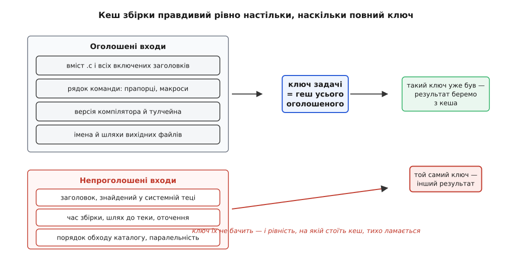
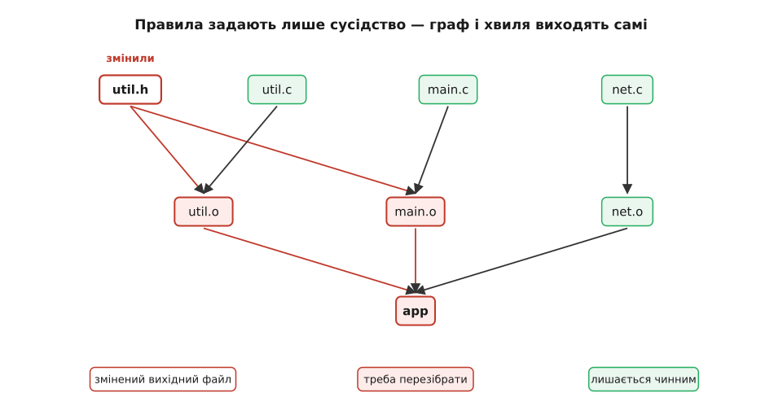
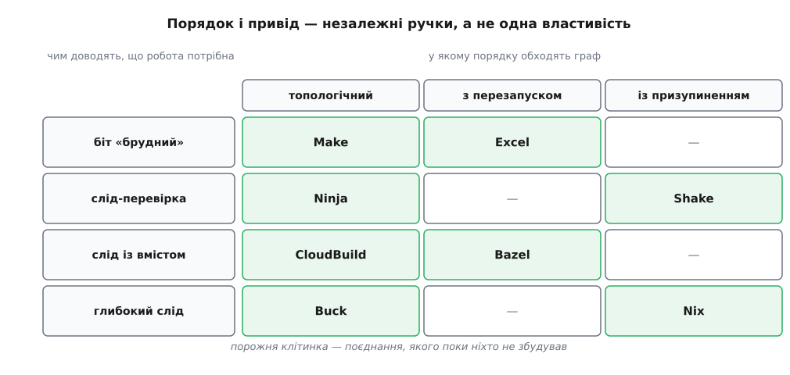

# Роль системи збірки: від дерева файлів до артефакту

<preknowlist>
- [Компіляція](book:programming/compilation) — як текст однієї одиниці трансляції перетворюється на об'єктний файл і що компілятор бачить за один запуск.
- [Лінкування](book:programming/linking) — як з об'єктних файлів і бібліотек виходить один виконуваний артефакт.
- [Теорія графів](book:math/graph-theory) — вершини, орієнтовані ребра, шлях, ациклічність.
- [Топологічне сортування](book:algorithms/topological-sort) — чому в орієнтованому ациклічному графі завжди існує лінійний порядок, узгоджений зі стрілками.
- [Криптографічні гешфункції](book:programming/cryptographic-hash) — коротка сума вмісту, до якої практично неможливо підібрати інший вміст.
- [Часові позначки файлів](book:programming/file-timestamps) — що таке mtime, яка в неї роздільність і коли файлова система її оновлює.
</preknowlist>

Візьмімо каталог із чотирьох файлів — `util.h`, `util.c`, `main.c`, `net.c` — і зробімо з них програму. Це чотири команди:

```sh
cc -c util.c -o util.o
cc -c main.c -o main.o
cc -c net.c  -o net.o
cc util.o main.o net.o -o app
```

Жодної системи збірки тут не треба. Питання з'являється на другому колі. Ви виправили один рядок у `util.h` — які з цих чотирьох команд повторити? Компілятор відповіді не має: він бачить рівно один файл за раз і не знає ні про решту каталогу, ні про те, що ви щойно редагували. Відповідь лежить у стосунках між файлами, а стосунки досі жили тільки у вашій голові.

Поки файлів чотири, голова справляється. У справжньому проєкті їх кілька тисяч, кожен тягне за собою десятки заголовків, частина файлів узагалі не написана людиною, а породжена іншими файлами, і половина цього дерева змінюється по кілька разів на годину. Питання «які команди повторити» перестає мати відповідь, яку можна пам'ятати. Але воно не перестає мати відповідь узагалі — воно однозначно випливає з того, що з чого робиться. Просто цю відповідь тепер мусить обчислювати не людина.

Ось звідки береться система збірки, і ось у чому її роль. Вона не компілює — компілює компілятор. Вона не лінкує. Вона обчислює: **які команди треба виконати, у якому порядку, і які з них можна не виконувати взагалі**. Усе інше в ній — наслідки цього обчислення.

## Правило — це локальний факт

Найменша порція знання, з якої можна щось обчислити, звучить так: *файл X виходить із файлів Y₁…Yₙ ось такою командою*. Три частини: що виходить, із чого, чим. Написати таке правило можна, дивлячись лише на один вузол дерева — тут не потрібно тримати в голові проєкт цілком.

```make
util.o: util.c util.h
	cc -c util.c -o util.o

app: util.o main.o net.o
	cc util.o main.o net.o -o app
```

У цьому описі ніде немає слова «спершу». Немає списку кроків, немає порядку, немає згадки про те, що `util.o` мусить з'явитися раніше за `app`. Є лише два локальні факти про сусідство. Але з набору таких фактів однозначно виростає глобальна структура: вершини — файли, ребро — «цей потрібен, щоб зробити той». Граф (гр. *gráphō* — пишу, креслю) ніхто не малював; він транзитивний наслідок сусідств, які оголосили окремо одне від одного. Це перша дія системи збірки: відновити ціле з локального.

І тут одразу видно, чому граф мусить бути ациклічний. Якщо `a` потрібен, щоб зробити `b`, а `b` — щоб зробити `a`, то порядку, у якому це можна виконати, просто не існує; жодного. Заборона циклів — не примха формату, а умова, за якої задача взагалі має розв'язок. А коли циклів немає, порядок існує завжди, і його дає топологічне сортування.

Причому порядок не один. Файли, між якими немає шляху по стрілках, не впорядковані одне щодо одного: `util.o` і `net.o` можна робити в будь-якій послідовності або одночасно. Паралельна збірка — не окрема можливість, яку хтось додав; це просто те, чого граф не забороняє. Система збірки нічого не «розпаралелює» — вона лише перестає вигадувати порядок там, де його немає в даних. Як саме з графа дістають порядок і чим за це платять, розібрано окремо: [Граф залежностей і порядок робіт](book:build-systems/dependency-graph).

## Що означає «актуальний»

Порядок — половина справи. Друга половина в тому, що більшість робіт у цьому порядку виконувати не треба, і вся цінність системи збірки в тому, наскільки чесно вона це визначає.

Скажімо точно, що саме треба довести. Артефакт (лат. *arte factum* — зроблене штучно) актуальний, якщо він побайтово такий самий, як той, що вийшов би, якби ми зараз виконали його команду над теперішніми входами. Перевірити це прямо можна єдиним способом — виконати команду. Але саме її ми й хочемо уникнути. Отже, потрібен замінник: дешева ознака, з якої випливає та рівність, перевіряти яку задорого.

Помилка в цій ознаці буває двох сортів, і вони зовсім не рівноцінні. Сказати «застаріло», коли насправді актуально, — коштує часу: зробимо зайву роботу й отримаємо той самий результат. Сказати «актуально», коли насправді застаріло, — коштує дня, витраченого на пошук неіснуючої помилки в коді, який давно виправлений і просто не потрапив у артефакт. Тому всі ознаки, які нижче, добирають *консервативно*: у сумнівному випадку перезбираємо.

### Ознака перша: час зміни файлу

Найдешевша ознака — час останньої зміни, який файлова система й так зберігає. Правило: якщо вихід молодший за кожен зі своїх входів, він актуальний. Одне звернення до метаданих на файл, жодного читання вмісту — на дереві з десятків тисяч файлів це частки секунди.

Ознака дешева саме тому, що непряма: з «файл новіший» не випливає «вміст інший», і навпаки. Місця, де ця непрямість прориває:

- **Час бере не файл, а годинник.** На мережевій файловій системі мітку ставить сервер, а порівнює клієнт; розходження в кілька секунд робить свіжий файл «старим».
- **Роздільність скінченна.** Файлова система записує час із певним кроком, а правило «не старіший» вважає однаковий час за актуальність.
- **Вміст може змінитися «в минуле».** Розпакований архів або відновлена копія кладе файли з їхніми давніми мітками: вміст новий, час старий, збірка нічого не помічає.
- **Мітка змінюється й тоді, коли вміст не змінився.** Кодогенератор перезаписав файл тим самим текстом — і вся хвиля вниз по графу перезбирається дарма.

**Дві правки в одну секунду** (файлова система з роздільністю 1 с):

```
12:00:00.10   зберігаємо util.h          mtime(util.h) = 12:00:00
12:00:00.30   збірка компілює util.o     mtime(util.o) = 12:00:00
12:00:00.60   зберігаємо util.h ще раз   mtime(util.h) = 12:00:00
12:00:03.00   збірка: util.o НЕ старіший за util.h → пропустити
```

Друга правка не потрапила в артефакт — і не потрапить, доки щось інше не торкнеться файлу. Сучасні файлові системи зберігають час набагато точніше, тож саме цей сценарій рідкісний; але клас помилки лишається той самий, бо роздільність скінченна завжди, а порівняння «не старіший» перетворює рівність на актуальність.

Попри все це, час зміни півстоліття був типовою відповіддю — і не через недогляд. Він з'явився разом із самою ідеєю системи збірки, у квітні 1976 року, з дуже конкретного роздратування: [як народився make](book:build-systems/build-system-role/hist-make-birth.md) — історія про змарнований ранок налагодження, вихідні за написанням інструмента й про те, чому дешева ознака виявилася достатньою для епохи, коли компіляція одного файлу тривала довше, ніж обхід усього дерева.

### Ознака друга: геш вмісту

Чесніша ознака — коротка сума самого вмісту. Однаковий геш означає однаковий вміст із точністю, яку немає сенсу оскаржувати. Ціна — прочитати кожен вхідний файл цілком, а не лише його метадані.

**Скільки це коштує на середньому проєкті** (3000 файлів, 420 МБ джерел, NVMe ~2500 МБ/с, одне звернення до метаданих ~2 мкс):

```
опитати час усіх файлів:  3000 · 2 мкс           = 0.006 с
прочитати й зігешувати:   420 МБ ÷ 2500 МБ/с     = 0.168 с
скомпілювати один .cpp:   ≈ 0.4 с
```

Геш усього дерева коштує менше, ніж одна одиниця трансляції. Тобто аргумент проти гешів — не арифметика, а холодний кеш файлової системи й мережеві диски, де «прочитати все» коштує на порядки більше, ніж «спитати час».

За цю ціну купують властивість, якої в мітки часу немає взагалі — **ранню відсічку**. Якщо перегенерований файл побайтово збігся з попереднім, хвиля перезбирання зупиняється на ньому й нижче не йде. На практиці це та різниця, через яку зміна одного коментаря у ключовому заголовку в одній системі перезбирає півпроєкту, а в іншій — три файли.

### Прихований вхід: сама команда

Тепер найпідступніше. Ви змінили не файл, а прапорець: `-O2` на `-O0`. Жоден вхідний файл не змінився, жоден час не зрушив — а всі артефакти мусять стати іншими. Система, що дивиться тільки на файли, спокійно лишить старі об'єктні файли й злінкує суміш, у якій половина модулів зібрана з однією оптимізацією, а половина з іншою; якщо серед прапорців був іще й `-DNDEBUG`, така суміш може мовчки порушувати домовленості про розміри структур і падати в місці, до якого прапорець не має жодного стосунку.

Отже, вхід задачі — не тільки файли. Це ще й рядок команди, версія компілятора (той самий текст новий компілятор перетворює на інший код), значущі змінні оточення, імена вихідних файлів. Усе це разом згортають в одне значення — **ключ задачі**. І звідси випливає єдине твердження, на якому тримається вся інкрементальна (лат. *incrementum* — приріст) збірка:

> Інкрементальна збірка правильна рівно тоді, коли ключ задачі покриває всі її входи.

Усе, що впливає на результат і не потрапило в ключ, — це діра, крізь яку колись провалиться чиясь робоча доба.



*Кеш збірки правдивий рівно настільки, наскільки повний ключ: усе, що впливає на результат повз ключ, ламає рівність «той самий ключ — той самий артефакт».*

Скільки роботи насправді дає одна правка й чому саме глибина графа, а не кількість файлів, визначає час збірки — це рахується явно: [ціна однієї зміни](book:build-systems/build-system-role/math-rebuild-cost.md). Там же видно, чому широко включений заголовок дорожчий за сотню окремих файлів і де паралельність упирається в стелю. Механіку самого рішення «застаріло чи ні» в різних системах розібрано окремо: [Інкрементальна збірка: як вирішують, що застаріло](book:build-systems/incremental-build).



*Правила описують лише сусідство, а граф і межа перезбирання виходять із них самі: перебудовують не «все після зміни», а рівно нащадків зміненої вершини.*

## Граф, якого не знають наперед

Досі ми мовчки припускали, що входи кожної задачі відомі до її запуску. Для `util.c` це неправда, і це не дрібний виняток.

Список файлів, від яких насправді залежить компіляція `util.c`, — це весь ланцюг `#include`, разом із тим, що включають включені, з умовною компіляцією, яка вмикає різні гілки залежно від макросів, і з правилами пошуку по каталогах. Дізнатися цей список можна лише прочитавши всі ці файли за тими самими правилами, за якими їх читає компілятор, — тобто фактично виконавши початок компіляції. Граф не просто великий; він **невідомий доти, доки ти його не почав будувати**.

Відповідей на це дві, і вони різні за характером.

Перша — попросити компілятор віддати список як побічний продукт роботи. Прапорці `-MMD -MF util.d` змушують GCC і Clang записати поряд із об'єктним файлом текст у форматі правила:

```
util.o: util.c util.h /usr/include/stdio.h
```

Цей файл підключають до опису збірки, і наступного разу він уже є:

```make
-include $(OBJ:.o=.d)
```

Тобто система збірки користується **слідом попереднього прогону**. Логіка тут не кругова: якщо сліду немає, немає й артефакту, тож задача однаково виконається. Але схема має гострий край: якщо заголовок видалили, у старому сліді він і далі числиться входом, і збірка зупиниться на «немає правила для цього файлу» — при тому, що ніхто його вже не потребує. Саме через це до попередніх прапорців додають `-MP`: він дописує на кожен заголовок порожнє правило, і зникнення файлу перестає бути фатальним.

Друга відповідь глибша: дозволити задачі оголошувати нові залежності просто під час виконання й мати планувальник, який уміє з цим жити. Тоді задача, дійшовши до невідомого входу, або призупиняється, поки той не буде готовий, або перезапускається з початку, коли вхід з'явиться. Це вже не латка до формату, а інша будова рушія.

## Дві незалежні ручки

У 2018 році Андрій Мохов, Ніл Мітчелл і Саймон Пейтон Джонс показали, що ця несхожість рушіїв розкладається на два **ортогональні** вибори (стаття «Build Systems à la Carte», ICFP 2018; висновок відтоді перевірений реалізаціями й розширений у журнальній версії 2020 року). Вибір перший: **у якому порядку** обходити граф. Вибір другий: **за яким приводом** вважати задачу такою, що потребує запуску. Ці два питання не пов'язані — і саме тому їхні відповіді комбінуються вільно.



*Порядок обходу і привід перезапуску — незалежні ручки: Make і Ninja однаково топологічні, але Ninja звіряє ключ, а не час; Bazel і Excel однаково перезапускають задачі, але за геть різним приводом.*

По горизонталі — порядок. **Топологічний** обхід вимагає знати граф наперед і йде по ньому один раз. **Перезапуск** дозволяє почати задачу, впертися в невідому залежність, кинути зроблене й повернутися пізніше. **Призупинення** робить те саме без утрати роботи: задача чекає, поки збудують те, що вона щойно назвала.

По вертикалі — привід. **Біт «брудний»** — найпростіше: щось змінилося, значить перебудувати (мітка часу в make — саме такий біт, обчислений порівнянням). **Слід-перевірка**: запам'ятали ключ минулого прогону й порівнюємо з теперішнім. **Слід із вмістом**: запам'ятали ще й самі результати, тому за ключем можна не будувати, а звантажити готове.

Ось де хмарна збірка перестає бути окремою технологією й стає простим наслідком. Якщо слід зберігає вміст результату, а ключ повний, то артефакт, який хтось у світі вже зібрав із таким самим ключем, можна взяти готовим — виконувати команду вдруге безглуздо. Уся «хмарність» — це один крок від локального кеша, і робить його не мережа, а повнота ключа.

Щоб побачити, як мало коду потрібно для цієї моделі, її варто написати: [власна система збірки на двісті рядків](book:build-systems/build-system-role/proj-mini-build.md) — розбір правил, граф, топологічний порядок, ключ із гешу входів і рядка команди, пул потоків і виявлення циклу.

## Відтворюваність — не чеснота, а передумова

Уся конструкція вище стоїть на припущенні, яке ми жодного разу не перевіряли: що задача — це функція. Однакові входи дають однаковий вихід. Якщо це не так, ключ ні про що не свідчить, і кеш повертає не «той самий результат», а «якийсь із результатів», що колись вийшли за схожих обставин.

Тобто система збірки — це [мемоізація](book:algorithms/memoization) обчислення: таблиця «аргументи → значення», яку ведуть замість повторного рахунку. Мемоізація правильна лише для [чистих функцій](book:programming/pure-functions-side-effects); для нечистих вона не «трохи неточна», а просто хибна. Відтворюваність — не додаткова доброчесність зрілого проєкту, а умова, за якої інкрементальна збірка взагалі має право пропускати роботу.

Що робить задачу нефункцією, у порядку підступності:

- **Час.** Макроси `__DATE__` і `__TIME__` вписують у код момент компіляції; архіватори пишуть час у заголовки записів. Два прогони з тих самих джерел дають різні байти.
- **Шляхи.** Налагоджувальні символи зберігають абсолютний шлях до джерела, тож збірка з `/home/andrij/src` і з `/build` дає різні артефакти.
- **Оточення.** Компілятор мовчки читає змінні середовища зі шляхами пошуку; вони не оголошені ніде в описі.
- **Порядок.** Розкриття `*.c` віддає файли в порядку каталогу, а лінкер складає символи в тому порядку, у якому їх отримав.
- **Паралельність.** Дві задачі пишуть у спільний файл — і те, що вийде, залежить від планувальника операційної системи.
- **Непроголошений вхід.** Заголовок, який знайшовся в системній теці. Найпідступніше саме це, бо збірка при цьому працює — рівно доти, доки на іншій машині цього файлу немає або він інший.

Проти перших п'яти є прямі засоби. Угода `SOURCE_DATE_EPOCH` задає інструментам єдиний час, який вони мають вписувати замість «зараз» — GCC підтримує її з сьомої версії, підмінюючи значення `__DATE__` і `__TIME__`. Прапорець `-ffile-prefix-map` переписує шляхи в символах на умовні. Замість глоба — явний упорядкований перелік файлів; замість «компілятор із системи» — закріплена версія тулчейна.

Проти шостого прямого засобу немає, бо це не помилка інструмента, а неповнота опису. Тут працює інший хід — **герметичність**: задачу виконують у пісочниці, де їй видно рівно те, що вона оголосила своїми входами. Тоді «ключ повний» перестає бути обіцянкою автора опису й стає властивістю, яку неможливо порушити: непроголошеного файлу для задачі фізично не існує, і збірка падає одразу й у зрозумілому місці, а не через півроку на чужій машині. Ціна теж зрозуміла: усе, чим користується збірка, доводиться перелічувати явно. Що з цього виходить на практиці й наскільки далеко це доводять дистрибутиви, розібрано окремо: [Відтворювані збірки](book:build-systems/reproducible-builds).

> 🔧 **Навіщо це.** Відповідь «у мене працює, а в CI ні» майже завжди означає рівно одне: якийсь вхід не оголошений, і на вашій машині він випадково правильний. Замість того щоб порівнювати машини навмання, порівнюйте ключі: те, що є у вас і чого немає в збірці на сервері, — це або файл поза оголошеними входами, або змінна оточення, або версія інструмента. Список підозрюваних скінченний і короткий, а розмова «чому не збирається» перетворюється з ворожіння на пошук за списком.

## Чому опис збірки живе у двох мовах

Наші правила мовчки припускали, що команда відома: `cc`. У житті вона невідома. Який компілятор є на цій машині й що він уміє; чи є тут потрібний заголовок; де лежить бібліотека і як вона зветься в цій системі; як звуть цільову платформу. Цих фактів немає в репозиторії — вони в машині, на якій збирають. І дізнатися їх можна тільки одним чесним способом: спробувати. Скомпілювати крихітну програму й подивитися, чи вийшло.

Проби коштують дорого — секунди й десятки секунд на повний набір. Робити їх перед кожною компіляцією безглуздо, бо машина за годину не змінюється. Тому їх роблять один раз, відповіді заморожують у кеші конфігурації, і вже **з цих відповідей породжують правила**.

Звідси розрив у часі, який спершу здається зайвою складністю, а насправді неминучий. **Конфігурація** — момент, коли з'ясовують факти про машину й вибір користувача та виписують із них конкретний граф. **Збірка** — момент, коли цей граф виконують. Мова, якою описують проєкт, і мова, якою рушій виконує граф, — різні, бо вирішують різні задачі: перша має вміти питати й розгалужуватися, друга має бути тупою й швидкою. Тому в сучасному C++-проєкті працюють дві системи збірки одночасно: CMake описує, ninja виконує.

Одна деталь робить цю схему коректною. Згенерований граф містить **власний опис як вхід**: правки в `CMakeLists.txt` роблять згенеровані файли застарілими, і рушій перед збіркою сам перезапускає конфігурацію. Без цього ребра заморожені відповіді жили б довше за питання. Як саме розкладається цей конвеєр і чому збирають поза деревом джерел — [Конфігурація, генерація і збірка поза деревом джерел](book:build-systems/configure-and-generate).

## Опис збірки як друге джерело правди

Побічний наслідок усього сказаного варто назвати прямо. Опис збірки — єдине місце, де проєкт існує як ціле. Компілятор бачить одну одиницю трансляції, редактор — один файл, система контролю версій — набір текстів без жодного уявлення про те, що з чого робиться. Тільки опис збірки знає, які файли входять у продукт, з якими прапорцями кожен компілюється, які межі між частинами й що назовні.

Тому ним годуються не лише компілятори. Підказки в редакторі, статичний аналіз, автоматичні правки в усьому дереві — усе це працює з тієї самої моделі (у C++ її зазвичай віддають як `compile_commands.json`, побічний продукт опису збірки). Неточний опис не просто повільно збирає — він робить сліпими всі інструменти навколо, і людина, яка редагує код, бачить не свій проєкт, а його спотворену тінь.

## Чому `clean` — це зізнання

Є коротка перевірка, яка не потребує жодного інструмента. Якщо повне очищення й збірка з нуля щось лагодять — опис збірки бреше. Не компілятор, не операційна система, не «щось заглючило»: очищення допомагає лише тоді, коли якийсь вхід не покритий ключем, і система вважала актуальним те, що вже застаріло. Очищення просто прибирає всі відповіді разом із питаннями.

Ціна цієї брехні не в загубленому часі. Вона в тому, що люди вчаться очищати про всяк випадок, і разом із помилковим «актуально» зникає єдине, заради чого будувалася вся конструкція, — можливість вірити відповіді системи збірки без перевірки. Здоровий опис пізнається просто: очищення в ньому змінює тільки час, ніколи — результат.
