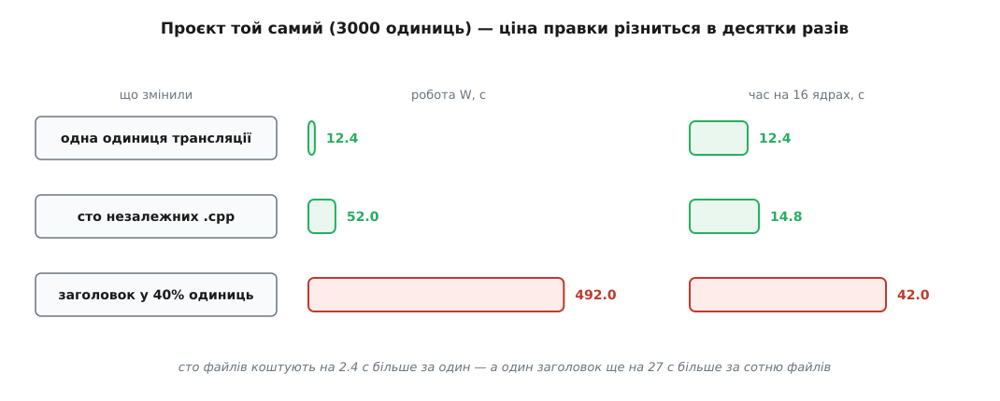
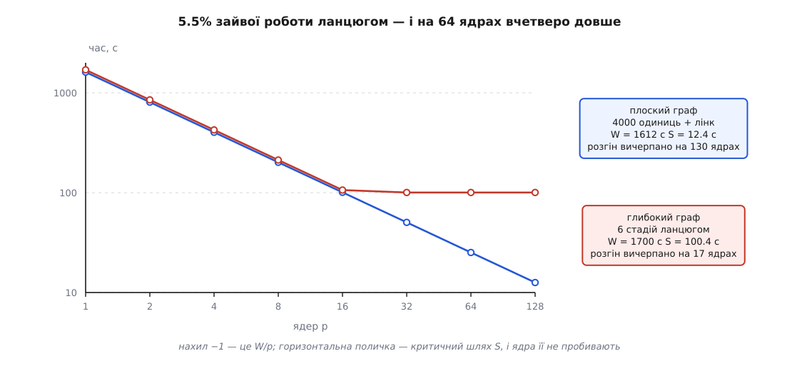
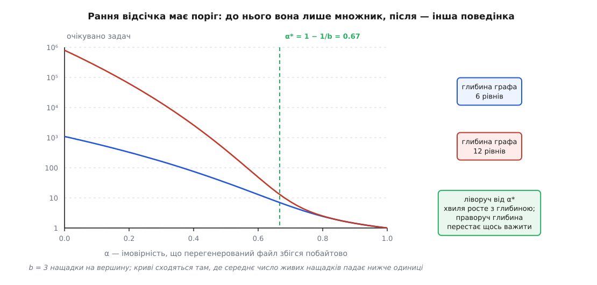

# 🧮 Ціна однієї зміни: скільки роботи насправді дає одна правка

Питання «скільки триватиме збірка після цієї правки» звучить як питання про залізо, а насправді має відповідь у графі: множина робіт визначена однозначно, її розмір не залежить від розміру проєкту, а час має нижню межу, крізь яку не пробивається жодна кількість ядер. Порахуймо це — спершу формально, далі в секундах.

## Множина робіт — це нащадки, і нічого більше

Опис збірки задає орієнтований ациклічний граф. Вершини — файли, ребро означає «цей потрібен, щоб зробити той»:

```
G = (V, E)        орієнтований ациклічний граф
u → v ∈ E         «u — оголошений вхід задачі v»
pred(v) = {u : u → v ∈ E}
u ⇝ v             існує напрямлений шлях із u у v (зокрема u ⇝ u)
t(v) ≥ 0          час виконання задачі, що робить v
```

Людина міняє якусь множину джерел Δ ⊆ V. Питання: які вершини мусять бути перераховані?

```
R(Δ) = { v ∈ V : ∃ u ∈ Δ, u ⇝ v }     нащадки Δ у транзитивному замиканні
A    = R(Δ) \ Δ                        множина робіт
```

> **Твердження.** Якщо кожна задача — функція своїх оголошених входів, то жодна вершина поза `R(Δ)` не змінює вмісту, а кожна вершина з `A` мусить бути перерахована.

Достатність доводиться індукцією за топологічним порядком. Візьмімо `v ∉ R(Δ)` і будь-який його вхід `u ∈ pred(v)`. Якби `u` належав `R(Δ)`, то з `u ⇝ v` випливало б `v ∈ R(Δ)` — суперечність. Отже, жоден вхід `v` не належить `R(Δ)`. За припущенням індукції вміст усіх входів той самий, що й був; задача — функція, тож і `v` виходить той самий. База — джерела поза `Δ`, які ніхто не чіпав. Індукція коректна саме тому, що граф ациклічний і має лінійний порядок, узгоджений зі стрілками — [топологічне сортування](book:algorithms/topological-sort) дає такий порядок для будь-якого ациклічного графа, і в ньому кожна вершина стоїть після всіх своїх входів.

Необхідність — з іншого боку. Для `v ∈ A` існує шлях `u₀ → u₁ → … → u_k = v` з `u₀ ∈ Δ`. Нічого в моделі не забороняє кожній задачі на цьому шляху бути чутливою до свого входу, тож наперед, не виконавши їх, ніхто не має права стверджувати, що `v` не змінився. Обчислення `R(Δ)` — це задача про досяжність, [транзитивне замикання графа](book:algorithms/transitive-closure): множина вершин, куди можна дійти стрілками з даної множини. Саме її, а не щось більше, зобов'язана перерахувати чесна система збірки.

Звідси формула ціни:

```
W(Δ) = Σ t(v),   v ∈ A
```

Подивіться, чого в ній немає. У формулі немає `|V|`. Немає кількості файлів проєкту, немає його розміру в мегабайтах, немає кількості цілей. Є лише сума часів по нащадках зміненого — і все.

### Розмір проєкту входить, але не туди, куди здається

`|V|` таки з'являється — в одному місці й з мізерним коефіцієнтом. Щоб знайти `R(Δ)`, треба хоч раз торкнутися кожної вершини: обхід коштує `(|V| + |E|)·μ`, де `μ` — одне звернення до метаданих файлу.

```
обхід дерева:      3000 · 2 мкс        = 0.006 с
одна одиниця:      τ                   ≈ 0.4 с
τ / μ = 0.4 с / 2·10⁻⁶ с               = 2·10⁵
```

Проєкт мусив би вирости в двісті тисяч разів, щоб самий лише обхід графа зрівнявся за ціною з однією компіляцією. Практично це означає: **розмір проєкту не впливає на час інкрементальної збірки** — впливає те, скільки роботи висить під зміненою вершиною.

### Охоплення — не те саме, що ступінь вершини

Природно назвати винною «розгалуженість» зміненого файлу — кількість тих, хто його безпосередньо вживає. Це майже правильно й тому небезпечно. Формула бере замикання, а не ступінь:

```
ρ(u) = |R({u}) \ {u}| / |V|        охоплення вершини
```

Вершина зі ступенем 1 може мати охоплення в цілий проєкт, якщо той єдиний споживач стоїть на початку довгого ланцюга. Вершина зі ступенем 50 може мати охоплення 51, якщо всі п'ятдесят споживачів — листя. Платить `ρ`, а не ступінь; ступінь — лише перший крок замикання.

Ще одна властивість формули стає в пригоді щодня. Замикання множини — це об'єднання замикань:

```
R(Δ) = ⋃ R({u}),   u ∈ Δ
W(Δ) ≤ Σ W({u})    рівність — лише коли нащадки не перетинаються
```

Ціна набору правок **субадитивна**: спільні нащадки рахуються один раз. Ось чому зібрати сто змінених файлів однією збіркою на порядок дешевше, ніж ста збірками поспіль: спільний хвіст (лінк, пакування) виконується раз, а не сто.

## Заголовок проти сотні файлів: у секундах

Візьмімо конкретний проєкт і порахуємо три правки. Параметри — ті самі, що й у решті цієї теми:

**Модель:** 3000 одиниць трансляції, компіляція однієї `τ = 0.4 с`, фінальний лінк `λ = 12 с`, машина на 16 ядер.

```
Правка 1 — один .cpp
  A = { util.o, app },  ρ = 2/3000 = 0.07%
  W = 1 · 0.4 + 12                          = 12.4 с
  T₁₆ = ⌈1/16⌉ · 0.4 + 12                   = 12.4 с

Правка 2 — сто незалежних .cpp
  A = 100 об'єктних + app,  ρ = 101/3000 = 3.4%
  W = 100 · 0.4 + 12                        = 52.0 с
  T₁₆ = ⌈100/16⌉ · 0.4 + 12 = 7·0.4 + 12    = 14.8 с

Правка 3 — заголовок, включений у 40% одиниць
  A = 1200 об'єктних + app,  ρ = 1201/3000 = 40%
  W = 1200 · 0.4 + 12                       = 492.0 с
  T₁₆ = ⌈1200/16⌉ · 0.4 + 12 = 75·0.4 + 12  = 42.0 с
```



*Один рядок у широко включеному заголовку дає вдев'ятеро більше роботи, ніж сто окремих файлів, — при тому, що людина відредагувала в 100 разів менше тексту.*

Різниця в роботі — `492 / 52 = 9.5` раза. Але цікавіші не відношення, а різниці на годиннику: сто файлів коштують на `2.4 с` більше за один файл, а один заголовок — ще на `27.2 с` більше за сотню файлів. Кількість відредагованого тексту й ціна збірки живуть у різних вимірах.

З формули видно й похідну — скільки коштує кожен відсоток охоплення заголовка:

```
W(f) = f · N · τ + λ
dW/df = N · τ = 3000 · 0.4 = 1200 с       на одиницю частки
                              12 с        на кожен відсоток
```

Дванадцять секунд роботи за відсоток. Заголовок, який ви «на всяк випадок» підключили ще у 5% одиниць, щойно подорожчав кожну свою правку на хвилину. Це і є той бухгалтерський зміст, який стоїть за порадами розтягувати заголовки й ховати реалізацію: ви зменшуєте не кількість рядків, а `ρ`.

І перевіримо субадитивність числами: сто окремих збірок коштували б `100 · 12.4 = 1240 с`, а одна спільна — `52 с`. Різниця у 24 рази — і вся вона в тому, що лінк, спільний нащадок усіх ста правок, виконався один раз замість ста.

## Стеля: критичний шлях

У попередніх числах уже сховане дещо дивне. Правка 1 і правка 2 різняться в роботі вчетверо, а на годиннику — на 2.4 секунди. Причина в тому, що робота — не єдина величина, яка керує часом.

Для множини робіт `A` визначимо дві числові характеристики:

```
W = Σ t(v),  v ∈ A                         робота: сумарний процесорний час
S = max ( Σ t(v) ),  π — напрямлений шлях у A   критичний шлях (глибина)
     π      v ∈ π
```

> **Нижня межа.** Для будь-якого розкладу на `p` процесорах `T_p ≥ max(W/p, S)`.

Перша половина очевидна: за час `T_p` машина фізично надає `p·T_p` процесорних секунд, а зробити треба `W`, тож `p·T_p ≥ W`.

Друга половина — уся суть. Нехай `f(v)` — момент завершення задачі `v`. Для ребра `u → v` задача `v` не могла стартувати, поки не закінчився `u`, тож

```
f(v) ≥ f(u) + t(v)
```

Пройдімо цією нерівністю вздовж шляху `π = v₁ → v₂ → … → v_m`:

```
f(v_m) ≥ f(v_{m−1}) + t(v_m) ≥ … ≥ t(v₁) + t(v₂) + … + t(v_m)
```

Отже, час завершення не менший за вагу будь-якого шляху; узявши найважчий, дістаємо `T_p ≥ S`. **У цьому виведенні `p` не бере участі взагалі.** Скільки б процесорів не було, задачі одного ланцюга виконуються послідовно — не тому, що планувальник поганий, а тому, що вхід другої з'являється лише після завершення першої.

Межа не просто існує — вона близька до досяжної. Ще у 1966 році Рональд Ґрем, аналізуючи аномалії багатопроцесорних розкладів (Bell System Technical Journal, 45, с. 1563–1581), показав, що будь-який жадібний розклад — той, що ніколи не тримає процесор без діла, коли є готова задача, — вкладається у

```
T_p ≤ W/p + (1 − 1/p) · S
```

Річард Брент 1974 року отримав ту саму за формою межу для паралельного обчислення виразів (Journal of the ACM, 21, с. 201–206). Разом із нижньою межею це затискає час у вилку завширшки менш ніж удвічі: жадібний розклад ніколи не гірший за вдвічі від найкращого можливого. Пара величин «робота і глибина» — стандартний спосіб міряти паралельний алгоритм: [робота і глибина](book:algorithms/work-span-model) описують, скільки всього треба порахувати й наскільки довгий найдовший ланцюг залежностей, і саме їхнє відношення, а не кількість заліза, каже, наскільки задача взагалі піддається розпаралеленню.

Перевіримо вилку на правці 3: нижня межа `max(492/16, 12.4) = 30.75 с`, верхня `30.75 + 0.9375·12.4 = 42.4 с`, справжній розклад дав `42.0 с`. Вилка тримає.

### Максимальний розгін — це `W/S`

З двох меж негайно випливає стеля прискорення:

```
розгін(p) = W / T_p ≤ W / S              за будь-якого p
```

Величину `W/S` називають паралелізмом графа. Це буквально середня ширина: скільки задач у середньому готові одночасно. Додавати ядра понад `W/S` немає сенсу — при `p = W/S` жадібний розклад уже дає `T ≤ W/(W/S) + S = 2S`, тобто гірше за абсолютну підлогу щонайбільше вдвічі.

Для правки 3: `W/S = 492 / 12.4 = 39.7`. Сорок ядер — і все, далі машина не допоможе. Для правки 2: `52 / 12.4 = 4.2`. На 16 ядрах вона не має чого їм дати; звідси й ті 2.4 секунди різниці.

### Чому глибина, а не розмір

Порівняймо два проєкти однакової ваги.

```
Плоский: 4000 одиниць трансляції → лінк
  W = 4000·0.4 + 12 = 1612 с
  S = 0.4 + 12      = 12.4 с
  паралелізм W/S    = 130

Глибокий: збірка генератора (60 с) → запуск генератора (8 с)
          → 4000 одиниць (0.4 с) → статична бібліотека (5 с)
          → лінк (12 с) → пакування (15 с)
  W = 60 + 8 + 1600 + 5 + 12 + 15 = 1700 с
  S = 60 + 8 + 0.4  + 5 + 12 + 15 = 100.4 с
  паралелізм W/S                  = 16.9
```

Ланцюг додав `88 с` роботи — 5.5% до `W`. А тепер час на 64 ядрах:

```
плоский:   T ≥ max(1612/64, 12.4)  = max(25.2, 12.4)  = 25.2 с
глибокий:  T ≥ max(1700/64, 100.4) = max(26.6, 100.4) = 100.4 с
```

Учетверо довше за 5.5% зайвої роботи. Завантаження машини у глибокому випадку — `1700 / (64·100.4) = 26%`; три чверті часу шістдесятичотириядерна машина чекає на один процес.



*Спадна пряма — це `W/p`; там, де вона впирається в критичний шлях, крива лягає на поличку, і купівля ядер перестає щось міняти.*

Ось де ховається відповідь на питання «розмір чи глибина». Подвоїти проєкт **ушир** — додати незалежних модулів: `W` подвоюється, `S` лишається, паралелізм подвоюється. Час на фіксованій машині зросте, але стеля не зрушила: докупіть ядер — і повернете все назад. Подвоїти проєкт **углиб** — додати стадію в ланцюг: `W` росте так само, але росте й `S`, а разом із ним підлога. Її не викупити нічим.

Тобто ширина — це те, що продається за гроші, а глибина — ні.

> 🔧 **Навіщо це.** Перш ніж просити швидшу машину, порахуйте `W/S` свого проєкту. Рушії збірки ведуть журнал із часом початку й кінця кожної задачі; із нього `W` — сума тривалостей, `S` — найважчий шлях у графі. Якщо `W/S` менший за кількість ядер, що вже є, нові ядра не дадуть нічого, і всі важелі — у скороченні критичного шляху: розбити моноліт-лінк, винести кодогенерацію так, щоб вона не блокувала все дерево, зменшити ланцюг «бібліотека залежить від бібліотеки». Якщо ж `W/S` у кілька разів більший за `p`, ситуація протилежна: критичний шлях чіпати марно, платить сумарна робота.

Обчислити обидві величини за журналом — прохід за топологічним порядком, який сам журнал і задає: задача не могла стартувати раніше за свої входи.

```cpp
struct Task { double t; std::vector<int> inputs; };   // час і індекси входів

// Вершини вже в топологічному порядку: кожна стоїть після всіх своїх входів.
std::pair<double, double> work_and_span(const std::vector<Task>& g) {
    std::vector<double> finish(g.size(), 0.0);
    double work = 0.0, span = 0.0;
    for (std::size_t v = 0; v < g.size(); ++v) {
        double ready = 0.0;                    // коли готові всі входи
        for (int u : g[v].inputs)
            ready = std::max(ready, finish[u]);
        finish[v] = ready + g[v].t;
        work += g[v].t;
        span = std::max(span, finish[v]);
    }
    return {work, span};
}
```

### Це той самий закон Амдала

Позначмо `f = S / W` — частку роботи, що лежить на критичному шляху. Тоді верхня межа Ґрема набуває вигляду

```
T_p ≤ W · (1/p + f)
розгін ≥ p / (1 + p·f)  →  1/f   при p → ∞
```

Це буквально форма [закону Амдала](book:algorithms/amdahls-law) — твердження, що прискорення обмежене часткою роботи, яку не можна виконувати паралельно, і за нескінченної кількості процесорів дорівнює `1/f`. Джин Амдал сформулював його 1967 року на весняній об'єднаній комп'ютерній конференції AFIPS, доводячи, що багатопроцесорний підхід не врятує задачі з великою послідовною часткою.

Різниця тільки в тому, звідки береться `f`. У класичному формулюванні це властивість програми, яку треба виміряти профілювальником. У графі збірки вона обчислюється: `f = S/W`, критичний шлях поділити на роботу. «Послідовна частка» — не таємнича характеристика коду, а довжина найдовшого ланцюга залежностей, поділена на суму всього. І звідси видно, чому вона не зменшується сама: щоб `f` падав, проєкт має рости вшир швидше, ніж углиб.

## Рання відсічка: хвиля, що згасає геометрично

Досі ми рахували найгірший випадок — той, у якому кожна перерахована задача справді дає інший вміст і хвиля йде до листя. Порівняння вмісту дозволяє зупинити її раніше: якщо перегенерований файл побайтово збігся з попереднім, нащадкам нема на що реагувати. Порахуймо, скільки це дає.

**Модель:** пошарований граф глибиною `D`, кожна вершина має `b` нащадків. Перерахована задача видає той самий байтовий вміст із імовірністю `α`; тоді хвиля на ній зупиняється. З імовірністю `β = 1 − α` вміст інший, і всі `b` нащадків потрапляють у роботу. Події вважаємо незалежними.

Позначмо `n_k` — число перерахованих задач на рівні `k`. Кожна з них передає хвилю далі з імовірністю `β`, породжуючи `b` задач:

```
E[n_{k+1}] = E[n_k] · β · b
E[n_k]     = m^k,        де m = b·β = b·(1 − α)
```

Величина `m` — середнє число «живих» нащадків однієї задачі. Очікуваний обсяг роботи — сума [геометричної прогресії](book:math/geometric-series):

```
             D
E[N] = Σ  m^k = (m^{D+1} − 1) / (m − 1),   m ≠ 1
            k=0
```

І тут — головне. Сума геометричної прогресії поводиться якісно по-різному залежно від того, більший `m` за одиницю чи менший, а `m = 1` дає точний поріг:

```
m > 1  (α < 1 − 1/b):  E[N] ≈ m^D / (m − 1)    росте експоненційно з глибиною
m = 1  (α = 1 − 1/b):  E[N] = D + 1            росте лінійно
m < 1  (α > 1 − 1/b):  E[N] ≤ 1/(1 − m)        обмежене, глибина не важить

α* = 1 − 1/b
```

Це критерій згасання [процесу розгалуження](book:math/branching-process): популяція, у якій кожен нащадок у середньому лишає менш ніж одного свого, вимирає з імовірністю одиниця, і в очікуванні за скінченну кількість поколінь.

Числа для `b = 3` (тоді `α* = 2/3 ≈ 0.67`):

```
        α = 0     α = 0.5   α = 0.67   α = 0.8   α = 0.9
D = 6    1093      32.2       7.0        2.43      1.43
D = 12  797161    387.2      13.0        2.50      1.43
```



*До порогу глибина графа множить роботу; після порогу вона перестає бути видимою — дві криві зливаються.*

Прочитайте таблицю по стовпцях, а не по рядках. При `α = 0.5` подвоєння глибини з 6 до 12 подорожчує збірку в 12 разів. При `α = 0.8` те саме подвоєння додає 3%. Порогова ймовірність не просто зменшує константу — вона змінює те, від чого взагалі залежить ціна.

У виродженому випадку `b = 1` (ланцюг) сума дає `E[N] = 1/α`, а глибина, до якої дійшла хвиля, розподілена [геометрично](book:math/geometric-distribution): імовірність дійти до рівня `k` дорівнює `β^k`. Звідси корисне: при `α = 0.9` хвиля в ланцюзі проходить у середньому `1.11` задачі — практично гасне на першому кроці.

### Розкид більший за середнє

У колонці `α = 0.8` стоїть `2.43`, але типова збірка не така. Імовірність, що хвиля вмерла одразу, дорівнює `α = 0.8`; отже, у чотирьох випадках із п'яти робота — рівно одна задача, а середнє тримається на рідкісному п'ятому, де перерахувалося три, дев'ять або більше. Саме тому досвід звучить як «зазвичай три файли, а іноді півпроєкту»: це не примха системи, а форма розподілу, у якого хвіст важить більше за тіло.

### Де `α` справді велика

Модель припускає одну `α` на весь граф, і це її головне спрощення. Насправді `α` — властивість шару:

- **Джерело → об'єктний файл.** Зазвичай `α` близька до нуля: змінили код — вийшов інший об'єктний файл. Але вона стрибає до одиниці для правок, що не міняють потік токенів: коментар, порожній рядок, перевпорядкування `#include`. Саме такі правки в широко включеному заголовку й дають ті `492 с` роботи, яка нічого не змінює.
- **Генератор → згенерований файл.** `α` висока: детермінований генератор на трохи змінених входах часто видає точнісінько той самий текст. Відсічка тут гасить хвилю на рівні 0 — тобто економить усе `W`, а не його частину.
- **Повернення до попереднього стану.** Перемикання гілок туди й назад кладе на диск байт-у-байт старий вміст із новою міткою часу. За часом усе застаріло, за вмістом не змінилося нічого; `α = 1` за побудовою.

Звідси й економіка перевірки вмісту. Хеш файлу на 4 МБ при 2500 МБ/с коштує `1.6 мс`. Під вершиною висить піддерево ціною `C`. Перевірка окупається, коли

```
α · C > h
α > h / C = 0.0016 с / 492 с = 3.3·10⁻⁶
```

Три мільйонні. Тобто на окремій вершині перевірка вмісту вигідна практично завжди — сумніви бувають не про вершину, а про дерево цілком, де «прочитати все» на холодному кеші чи мережевому диску коштує в тисячі разів більше, ніж «спитати час». Як саме різні системи роблять цей вибір і що ще, крім гешу, беруть за ознаку — [Інкрементальна збірка: як вирішують, що застаріло](book:build-systems/incremental-build).
