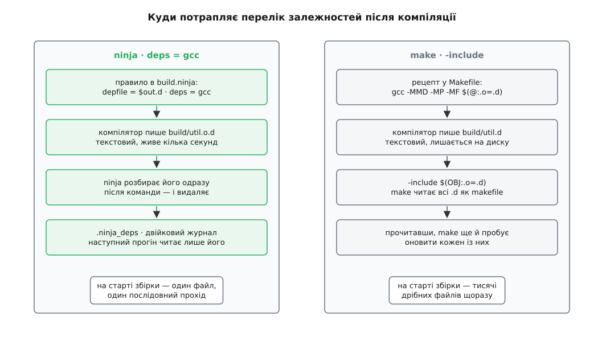

# 📋 Файли залежностей: контракт між компілятором і збіркою

Які саме файли прочитала компіляція, знає тільки компілятор — і віддає цей перелік побічним продуктом, у **файлі залежностей** (depfile). Нижче — точний формат такого файлу, прапорці GCC, Clang і MSVC, якими його замовляють, рядки в `build.ninja` і `Makefile`, якими його підключають, і місця, де контракт рветься мовчки.

Зобов'язань у контракті три. Компілятор пише перелік прочитаного у форматі, описаному нижче. Система збірки читає цей перелік **після** команди й додає його як неявні входи саме того виходу, який щойно зробила. І ніхто з двох не звіряє переліку з дійсністю: обидві сторони довіряють одна одній повністю — тому кожна дрібниця формату важить.

## Формат

Depfile — підмножина синтаксису `make`: одне правило, ціль, двокрапка, перелік прочитаних файлів, жодного рецепта.

```make
build/util.o: src/util.c src/util.h \
 include/config.h /usr/include/stdio.h
```

| Елемент | Правило |
| --- | --- |
| ціль | шлях виходу, далі `:` |
| входи | шляхи через пробіли або табуляції |
| перенос рядка | `\` останнім символом рядка |
| пробіл усередині шляху | `\ ` |
| `$` у шляху | подвоюється: `$$` |
| `#` у шляху | `\#` |
| рецепт | відсутній — правило порожнє |

Правило зворотних скісок точніше, ніж здається, і варте того, щоб знати його дослівно: **2N+1** скісок перед пробілом означають N скісок і сам пробіл усередині імені; **2N** скісок перед пробілом означають N скісок і кінець імені. Поза цим випадком скісок не чіпають — інакше `c:\src\util.h` розсипався б, і саме тому depfile із Windows читається без окремого режиму.

## GCC і Clang

Прапорці однакові в обох компіляторів; Clang свідомо повторює інтерфейс GCC.

| Прапорець | Що робить | Об'єктний файл |
| --- | --- | --- |
| `-M` | вивести правило з усіма заголовками, зокрема системними | не буде: `-M` тягне за собою `-E` |
| `-MM` | те саме, але **без** системних заголовків | не буде |
| `-MD` | те саме, що `-M -MF <файл>`, але без `-E` | буде |
| `-MMD` | як `-MD`, лише власні заголовки | буде |
| `-MF <шлях>` | куди писати перелік | — |
| `-MT <ціль>` | замінити ціль правила, дослівно | — |
| `-MQ <ціль>` | те саме, але з екрануванням спецсимволів make | — |
| `-MP` | додати порожнє правило на кожен заголовок | — |
| `-MG` | не падати на відсутньому заголовку, вважати його згенерованим | — |

Пара `-M`/`-MM` призначена для окремого прогону препроцесора, пара `-MD`/`-MMD` — для звичайної компіляції, у якій перелік виходить задарма, поза дорогою. У збірці вживають майже завжди другу.

**Куди `-MD` пише без `-MF`.** Драйвер бере аргумент `-o` і **замінює** в ньому суфікс на `.d` (`-o build/util.o` → `build/util.d`); якщо `-o` немає — бере ім'я вхідного файлу, викидає каталоги й суфікс і додає `.d` (`src/util.c` → `util.d` у поточному каталозі). Друга гілка майже завжди не те, чого хотіли, тож `-MF` пишуть явно.

**Яка ціль опиниться в правилі.** Препроцесор за замовчуванням виводить її з імені вхідного файлу без каталогів, а драйвер `gcc` при компіляції підставляє туди значення `-o`. Покладатися на це не варто: ціль у depfile мусить збігатися з тим, як система збірки називає цей вихід, символ у символ. CMake, наприклад, завжди пише `-MT $out` явно — звичка правильна. `-MQ` відрізняється від `-MT` лише екрануванням: `-MQ '$(objpfx)foo.o'` дає `$$(objpfx)foo.o: foo.c`, тобто ціль переживе розкриття змінних у make.

**Чим системний заголовок відрізняється від власного.** Системними вважаються файли з каталогів, доданих через `-isystem` і вбудованих у компілятор, усе, що включене зсередини такого файлу, і все, позначене `#pragma GCC system_header`. Різниця між `-MD` і `-MMD` — не косметична: `-MMD` дає перелік у рази коротший (без сотень заголовків стандартної бібліотеки), зате оновлення libc чи тулчейна не робить брудним нічого. Це безпечно рівно тоді, коли версію тулчейна ловить ключ задачі — рядком команди або записаною версією компілятора. Немає такого ключа — беріть `-MD` і платіть за розбір довших переліків.

**`-MP` і видалений заголовок.** Прапорець дописує на кожен заголовок правило без входів і без рецепта:

```make
build/util.o: src/util.c src/util.h

src/util.h:
```

Коли `util.h` видаляють, `make` знаходить для нього правило й не падає з «немає правила, як зробити». А оскільки файлу немає, а рецепт порожній, `make` вважає його щойно оновленим і перезбирає `util.o` — чого й треба: або джерело вже не включає цього заголовка, або компіляція чесно впаде з помилкою. Ninja `-MP` не потребує: він додає ребра так, що відсутність переліченої залежності не є помилкою.

## MSVC: /showIncludes

`cl.exe` файлу залежностей не пише взагалі. Прапорець `/showIncludes` змушує його друкувати рядок на кожен включений файл — у **стандартний вивід**, упереміш зі звичайними повідомленнями:

```
Note: including file: d:\MyDir\include\stdio.h
Note: including file:  d:\temp\2.h
```

Зайвий пробіл у другому рядку — не одруківка: вкладеність позначається відступом, один пробіл на рівень. Споживач мусить сам зрізати префікс, прибрати відступ, прибрати повтори й не пустити цих рядків на консоль користувача.

| Що врахувати | Деталь |
| --- | --- |
| префікс локалізований | у німецькій Visual Studio це `Hinweis: Einlesen der Datei:` |
| шляхи абсолютні | і в тому регістрі, який віддала файлова система |
| системні заголовки не відділені | еквівалента `-MMD` у самому `/showIncludes` немає |
| `/showIncludes:user` | документований у clang-cl як спосіб відтворити `-MMD`; на сторінці документації самого MSVC його немає — перевіряйте свою версію `cl` |

## Підключення в ninja

```ninja
rule cc
  command = gcc -MD -MT $out -MF $out.d $cflags -c $in -o $out
  depfile = $out.d
  deps = gcc
  description = CC $out

build build/util.o: cc src/util.c
```

| Змінна | Значення | Дія |
| --- | --- | --- |
| `depfile` | шлях до `.d` | ninja читає його одразу після команди й **видаляє** |
| `deps` | `gcc` | розбирати `.d` у make-синтаксисі |
| `deps` | `msvc` | `.d` немає — розбирати `/showIncludes` зі stdout |
| `msvc_deps_prefix` | рядок префікса | що саме зрізати; потрібно лише для неанглійської Visual Studio |

Для MSVC правило втрачає `depfile` і набуває префікса:

```ninja
msvc_deps_prefix = Note: including file:

rule cc_msvc
  command = cl /nologo /showIncludes $cflags /c $in /Fo$out
  deps = msvc
```

Прочитане ninja складає у власний двійковий журнал **`.ninja_deps`** (у `builddir`): послідовність записів — або рядок-шлях, або перелік залежностей у вигляді масиву 4-байтових чисел (номер виходу, дві половини його mtime, далі номери входів). Записи лише дописуються, і для одного виходу перемагає останній. Звідси дві команди:

- `ninja -t deps [ціль]` — показати, що ninja **насправді** вважає входами задачі. Перше, куди дивитися, коли «перезбирає замало».
- `ninja -t recompact` — переписати журнал начисто. Викидаються записи, чий вихід більше не має ребра або чиє ребро втратило `deps`, тобто файли, що пішли зі збірки. Ninja робить це й сам, коли записів понад 1000 і їх утричі більше за кількість унікальних виходів.



*Ninja переносить перелік у двійковий журнал і викидає текстовий файл; make лишає тисячі `.d` на диску й перечитує їх щоразу як makefile.*

## Підключення в make

```make
OBJ := $(SRC:src/%.c=build/%.o)
DEP := $(OBJ:.o=.d)

build/%.o: src/%.c
	@mkdir -p $(@D)
	$(CC) $(CFLAGS) -MMD -MP -MT $@ -MF $(@:.o=.d) -c $< -o $@

-include $(DEP)
```

Працює це на двох властивостях `make`. По-перше, `-include` мовчки пропускає файл, якого немає, тоді як `include` на цьому зупиняється помилкою. По-друге, прочитавши всі makefile, `make` пробує оновити кожен із них і перезапускається, якщо бодай один змінився. Тому на першій збірці `.d` немає, `-include` мовчить, об'єктний файл однаково компілюється — і `.d` з'являється до наступного разу.

## Пастки

**Згенерований заголовок на першій збірці.** Сліду ще немає, тож ніхто не знає, що `main.o` його потребує, і компіляція падає ще до того, як заголовок породжено. Лікується не файлом залежностей, а порядком: впорядковувальним ребром (`||` у ninja, `|` у make) від цілі, яка [генерує заголовок](topic:build-systems/custom-commands). З другої збірки справжню залежність підхопить уже слід.

**Шляхи з пробілами.** `C:\Program Files\…` у переліку системних заголовків — звичайна справа на Windows. Компілятор екранує пробіли сам; ламається зазвичай не він, а саморобний скрипт, що переписує depfile регулярним виразом.

**Кілька виходів в одному depfile.** Ninja вимагає рівно одну ціль і на кілька різних відповідає помилкою `depfile has multiple output paths`. Правило, що робить два файли за один запуск, файлом залежностей описати не вийде.

**Depfile після невдалої команди.** Компілятор міг устигнути записати неповний `.d`. Ninja його однаково видаляє; `make` — ні, і наступний прогін прочитає уламок як makefile. Класичне лікування — писати в тимчасовий файл і перейменовувати готовий, тобто [атомарна заміна](topic:programming/atomic-file-replace).

**Застарілі записи журналу.** Змінили план збірки — записи про виходи, яких більше немає, лишаються в `.ninja_deps`, поки не станеться ущільнення. Самі по собі вони не шкодять, але роздувають журнал і плутають читання `-t deps`; `-t recompact` прибирає їх одним рухом.

**Кодова сторінка й `msvc_deps_prefix`.** Локалізований префікс має бути записаний у `build.ninja` тим самим кодуванням, у якому його друкує `cl`. Консоль у UTF-8, файл збірки в ANSI — і префікс не збігається жодним байтом, тож ninja не бачить залежностей узагалі, мовчки й без помилки. Це один із небагатьох випадків, коли [кодування тексту](topic:programming/ascii-utf8) прямо визначає правильність збірки.

**Умовні включення.** Перелік описує саме ту гілку `#ifdef`, яку компілятор пройшов цього разу. Змінився макрос — змінився й набір прочитаного, тож [препроцесор](topic:programming/preprocessor-macros) і система збірки мусять бачити ту саму конфігурацію; макрос, переданий повз оголошений рядок команди, робить слід чесним, а висновок із нього — хибним.
