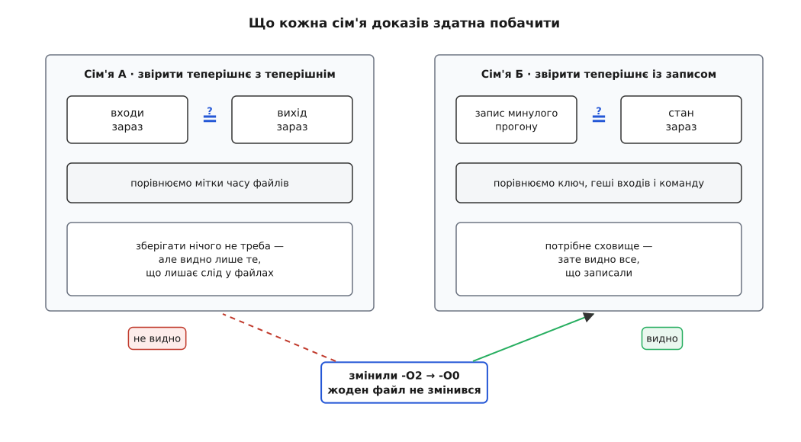
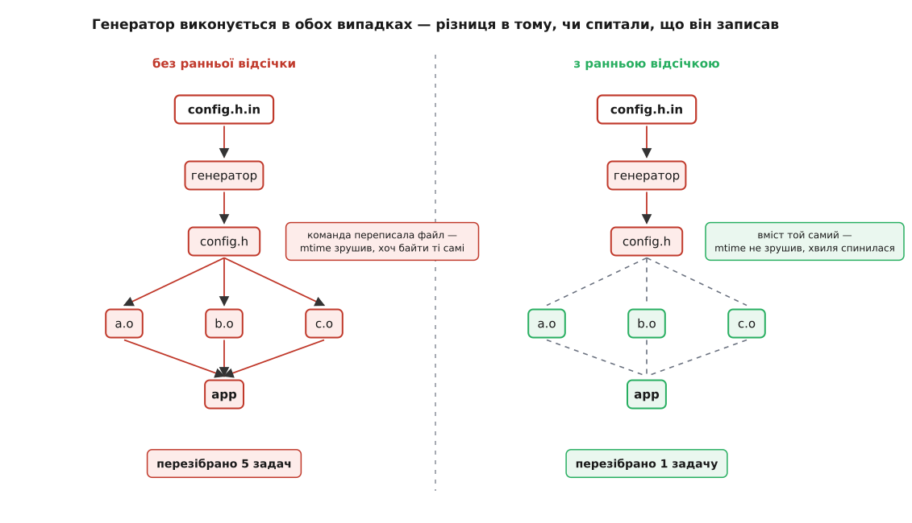
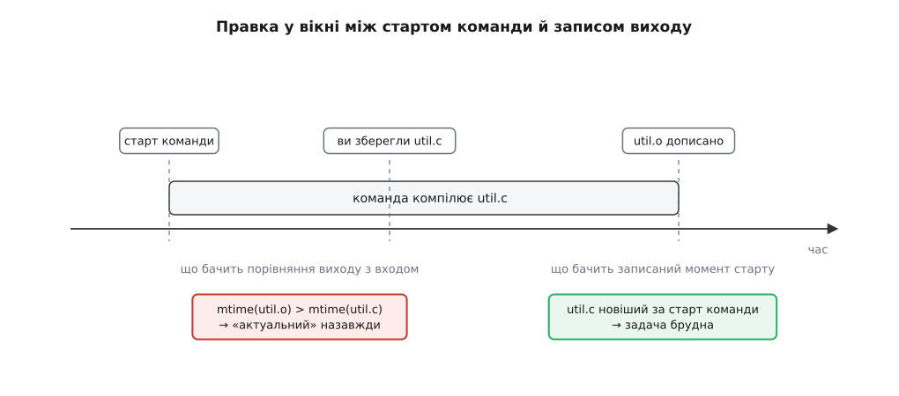

# Інкрементальна збірка: як вирішують, що застаріло

<preknowlist>
- [Компіляція](book:programming/compilation) — що таке одиниця трансляції, як `#include` втягує в неї інші файли й що компілятор бачить за один запуск.
- [Часові позначки файлів](book:programming/file-timestamps) — mtime, її роздільність і коли файлова система її оновлює.
- [Криптографічні гешфункції](book:programming/cryptographic-hash) — коротка сума вмісту, до якої практично неможливо підібрати інший вміст.
- [Граф залежностей і порядок робіт](book:build-systems/dependency-graph) — вершини-файли, ребро «цей потрібен, щоб зробити той», топологічний порядок.
- [Роль системи збірки](book:build-systems/build-system-role) — ключ задачі: згортка всього, від чого залежить результат, включно з рядком команди.
- [Чисті функції і побічні ефекти](book:programming/pure-functions-side-effects) — однакові входи дають однаковий вихід; без цього пропускати роботу не можна взагалі.
</preknowlist>

Ви виправили один рядок, натиснули «зібрати» — і в журналі промайнуло чотири команди замість трьох тисяч. Решту система пропустила. Але «пропустити» — це не бездіяльність, це твердження: файл, що лежить на диску, побайтово такий самий, як той, що вийшов би, якби команду виконали зараз. Твердження про результат обчислення, якого не було.

Таких тверджень за одну збірку — тисячі, і жодне з них ніхто не перевіряє: якби перевіряли, довелося б виконати команду, а саме її й хотіли уникнути. Уся інкрементальна (лат. *incrementum* — приріст) збірка тримається на тому, які докази система вміє зібрати замість перевірки, і рівно там, де доказ слабший, ніж здається, робочий день перетворюється на пошук помилки, якої в коді вже немає.

## Доказ мусить бути дешевшим за роботу

Пряма перевірка одна: виконати команду й порівняти байти. Вона не економить нічого, а коштує рівно стільки, скільки й сама робота. Отже, доводити доведеться не те, що потрібно, а замінник — дешеву ознаку, з якої потрібне **випливає**.

Напрям цієї імплікації задає всю конструкцію. Ознака → актуальність: якщо ознака є, файл точно чинний. Зворотного не вимагаємо й вимагати не можемо: ознака вільна мовчати там, де насправді все гаразд. Помилка «сказали застаріло, а було чинне» коштує зайвої компіляції; помилка «сказали чинне, а було застаріле» коштує дня, витраченого на пошук уже виправленого дефекту, — і саме через цю асиметрію всі ознаки нижче добирають консервативно, у сумнівному випадку перезбираючи.

Друга вимога менш очевидна й обмежує сильніше. Доказ треба збирати для **кожної** вершини графа, зокрема для тих тисяч, які не змінилися й нічого не робитимуть. Тобто його ціна множиться на розмір проєкту, а економія — лише на кількість пропущених задач. Ознака, що коштує міліметр від компіляції, з'їдає весь виграш на дереві, де 99% вершин чинні. Це не інженерна дрібниця, а те, що визначило вибір ознаки на п'ятдесят років уперед.

## Дві сім'ї доказів

Порівнювати можна лише те, що є під рукою. Під рукою є дві різні речі, і з них виростають дві структурно несхожі відповіді.

**Сім'я A — звірити теперішнє з теперішнім.** Дивимося на входи, дивимося на вихід, порівнюємо їх між собою просто зараз. Нічого зберігати не треба: усі дані вже лежать у файловій системі.

**Сім'я Б — звірити теперішнє із записом.** Коли вихід робили, запам'ятали, яким усе тоді було: ключ задачі, геші входів, рядок команди. Тепер порівнюємо теперішній стан із цим записом. Потрібне сховище, зате порівняння бачить рівно те, що ми свого часу записали.

Різниця здається технічною, поки не спитати, що кожна сім'я здатна побачити в принципі. Змініть `-O2` на `-O0`. Жоден файл не змінився: ні джерела, ні заголовки, ні виходи. Сім'я A порівнює файли з файлами — а між ними не сталося нічого. Прапорець для неї не існує не тому, що хтось не додумався його врахувати, а тому, що він не має представлення у тій єдиній речі, яку ця сім'я вміє читати. Сім'я Б бачить його одразу: рядок команди був у записі, а тепер він інший.



*Сім'я A читає лише файлову систему, тож зміна, що не лишає сліду у файлах, для неї не відбулася; сім'я Б бачить рівно те, що потрапило в запис — не більше, але й не менше.*

## Час зміни: чому найдешевша ознака взагалі працює

Ознака сім'ї A, з якою все почалося: **вихід не старіший за кожен зі своїх безпосередніх входів**. Одне звернення до метаданих на файл, жодного читання вмісту.

Тут є прихована тонкість, повз яку легко пройти. Правило локальне — воно дивиться на вершину та її сусідів. Твердження ж, яке нам потрібно, глобальне: вихід збігається з тим, що вийшло б із **теперішніх джерел**, а не з теперішніх безпосередніх входів (ті самі можуть бути застарілі). Місток між локальним і глобальним — індукція за топологічним порядком.

Обходимо граф так, що кожна вершина розглядається після всіх своїх входів. Припущення індукції: коли черга дійшла до `v`, усі його входи вже приведені до стану, який відповідає теперішнім джерелам. Якщо при цьому `v` не старіший за кожен із них, то він виготовлений уже після того, як вони набули теперішнього вигляду, — отже, він і є результатом команди над теперішніми входами. База — самі джерела, які нікого не мають за спиною.

Звідси видно, чого правило вимагає від рушія: рішення про вершину **не має сенсу до того, як розв'язана доля її входів**. Не можна порахувати всі ознаки одним проходом наперед, а потім виконати намічене — вхід, який щойно перезібрали, змінює відповідь для свого споживача. Тому обхід іде вглиб і приймає рішення на зворотному ході, вже маючи готові входи.

І тут же видно ціну. Час зміни лише зростає: будь-яке виконання команди піднімає mtime виходу вище за все, що було до нього. Отже, щойно вершину перезібрали, кожен її споживач автоматично став «старішим за свій вхід» — незалежно від того, чи змінився в тому виході бодай байт. Хвиля, що пішла від зміненого джерела, доходить до кінця конуса нащадків, і зупинити її нічим.

**Кома в широко включеному заголовку** (3000 одиниць трансляції, заголовок включений у 40% із них, компіляція однієї — 0.4 с):

```
змінили коментар у config.h        → mtime(config.h) зрушив
перезібрано об'єктних файлів       = 1200
з них дали інші байти              = 0
витрачено процесорного часу        = 1200 · 0.4 с = 480 с
```

Вісім хвилин роботи, після якої всі 1200 файлів побайтово ті самі, що й були. Решта відомих слабин мітки часу — годинники на мережевих дисках, скінченна роздільність, розпакований архів зі старими мітками — розібрана окремо в темі [Роль системи збірки](book:build-systems/build-system-role); тут важлива саме ця, структурна, бо вона не помилка реалізації, а прямий наслідок того, що час зростає монотонно.

## Рання відсічка: рішення, якого не можна прийняти заздалегідь

Щоб хвиля зупинилася на `config.h`, треба відповісти на питання «а чи змінився його **вміст**». Відповідь на нього не існує доти, доки команда, що робить `config.h`, не виконана. Тобто вона не існує на етапі планування взагалі.

Це змінює характер процедури, а не лише набір ознак. Множина робіт перестає бути планом, який обчислюють до збірки: вона уточнюється **під час** обходу, і кожна завершена задача може викреслити з неї своїх нащадків. Саме це називають **ранньою відсічкою** — здатність зупинити перезбирання на вершині, вміст якої не змінився, хоч команда й виконалася.

Системам сім'ї Б відсічка дістається задарма. Ключ задачі містить геш вмісту входу; вміст той самий — ключ той самий — запис минулого прогону збігається — задачу пропускаємо. Ніякого окремого механізму не треба, він уже є в тому, як побудований ключ.

Сім'ї A відсічку доводиться прибудовувати збоку, і ninja робить це через позначку `restat` на правилі. Керівництво описує її так: якщо позначка присутня, ninja робить `stat` виходів **після** виконання команди, і «кожен вихід, чиєї мітки часу команда не змінила, вважається таким, що ніколи не потребував збирання». Порядок дій виходить такий:

```
до запуску:      mtime(config.h) = t₀           (ninja запам'ятав)
виконати команду генератора
після запуску:   mtime(config.h) = t₀           файлу не торкалися
                 → вважати, що config.h і не треба було робити
                 → перерахувати брудність усіх, хто від нього залежить
```

Умова, за якої це працює, лежить не в системі збірки. Генератор мусить **не переписувати файл, вміст якого не змінився**: якщо він щоразу відкриває вихід на запис і виливає туди той самий текст, mtime зрушить, і відсікати буде нічого. Тому інструменти, розраховані на життя всередині збірки, порівнюють перед записом — так поводиться, скажімо, `configure_file` у CMake, який лишає наявний файл незайманим, коли вміст збігається. Рання відсічка — домовленість двох сторін, і система збірки може виконати свою половину лише тоді, коли інструмент виконав свою.



*Генератор виконується в обох випадках; уся різниця в тому, чи хтось спитав, що саме він записав.*

Скільки роботи це насправді економить і коли перестає окупатися — рахується явно: [коли рання відсічка окупається](book:build-systems/incremental-build/math-early-cutoff.md). Там модель, у якій перезібрана задача змінює свій вміст із деякою ймовірністю, очікуваний розмір множини робіт із відсічкою й без неї, і поріг, за яким гешування дорожче за ту компіляцію, від якої воно рятує.

## Команду видно лише в записі

Повернімося до прапорця. Файл із прапорцями не існує, а результат від них залежить — отже, ознака сім'ї A їх не побачить ніколи, і саме тому `make` після зміни `CFLAGS` спокійно злінкує суміш зі старих і нових об'єктних файлів.

Ninja цю діру закриває записом. У журналі `.ninja_log` для кожного побудованого файлу зберігається геш команди, якою його зробили, і керівництво формулює наслідок прямо: виходи неявно залежать від рядка команди, тож зміна, наприклад, прапорців компіляції спричиняє їх перезбирання. Одна виняткова категорія передбачена свідомо: правила, позначені `generator` (ними перезапускають саму систему, що породила опис збірки), з-під цього порівняння виведені — інакше кожне оновлення генератора тягло б за собою повну переконфігурацію.

У `make` запису немає, але його можна змайструвати руками — і вийде повчальна конструкція, у якій обидва механізми цієї теми стоять поруч:

```make
CFLAGS := -O2 -DNDEBUG -Wall

.PHONY: force
.flags: force
	@echo '$(CFLAGS)' | cmp -s - $@ || echo '$(CFLAGS)' > $@

%.o: %.c .flags
	cc $(CFLAGS) -c $< -o $@
```

Фальшива ціль `force` не існує як файл, тому `.flags` вважається застарілим завжди й рецепт виконується щоразу — але рецепт **переписує файл лише тоді, коли рядок справді інший**. Мітка часу `.flags` зрушує саме в момент зміни прапорців, і об'єктні файли, для яких `.flags` тепер став входом, застарівають рівно тоді, коли треба. Це рання відсічка, зроблена вручну: сама перевірка коштує мілісекунду й тому може виконуватися завжди, а дорога робота нижче по графу чекає на справжню зміну.

## Входи, яких не знали, поки не спробували

Список файлів, від яких залежить компіляція `util.c`, — це весь ланцюг `#include` з усіма умовними гілками; дізнатися його можна, лише прочитавши ці файли так само, як їх читає компілятор. Тому компілятор віддає список як побічний продукт, а система збірки користується списком **минулого** прогону.

Тут виникає питання, повз яке зазвичай проходять мовчки: чи законно судити про сьогоднішні входи за вчорашнім списком? Адже сьогодні `util.c` міг почати включати новий заголовок, якого у списку немає, — і цієї зміни ми не побачимо.

Побачимо, і ось чому. Набір включених файлів — не довільна річ, він однозначно визначається вмістом прочитаних файлів і шляхами пошуку. Щоб набір змінився, мусив змінитися вміст щонайменше одного файлу зі **старого** набору (або шляхи пошуку, а вони в рядку команди). Але кожен файл старого набору вже стоїть у графі як вхід — отже, задача перезапуститься, компілятор перечитає все заново й перезапише список. Старий слід не мусить бути правильним описом сьогоднішніх залежностей; йому досить бути таким, що будь-яка зміна пробиває його зсередини.

Дві практичні наслідки цієї схеми варто знати напам'ять.

**Сліду ще немає** — на першій збірці або після очищення. Тоді єдина консервативна відповідь — виконати задачу; вона однаково мусила б виконатися, бо й виходу ще немає.

**Заголовок видалили.** У сліді він далі числиться входом, а файлу вже немає. `make` на це відповідає відмовою: немає правила, як зробити відсутній файл, збірка зупиняється — при тому, що ніхто того заголовка вже не потребує. Ninja поводиться інакше за побудовою: у керівництві сказано, що при завантаженні залежностей із журналу він додає ребра так, щоб відсутність переліченої залежності не була помилкою, — саме щоб можна було видалити заголовок і зібратися. У `make` рівнозначного ефекту досягають прапорцем `-MP`, який дописує на кожен заголовок порожнє правило.

Ціна цього механізму — та сама вимога дешевизни, з якої почалася тема. Розібрати тисячі текстових файлів залежностей на старті коштує більше, ніж саме рішення про актуальність, тому ninja переносить їх у власний двійковий журнал `.ninja_deps` і читає одним шматком. Точний контракт — формат файлів залежностей, прапорці `-MD`, `-MMD`, `-MF`, `-MT`, `-MP`, режим `/showIncludes` у MSVC і те, як усе це підключається в ninja, — винесено окремо: [файли залежностей: контракт між компілятором і збіркою](book:build-systems/incremental-build/api-depfile.md).

## Ребро, що впорядковує, але не старить

Іноді потрібне рівно половина ребра. Класичних випадків два.

Каталог, у якому лежать виходи, мусить існувати до запуску команди — але його mtime змінюється щоразу, коли всередині створюють файл, тож звичайне ребро зробило б застарілим геть усе після кожної компіляції. І згенерований заголовок на **першій** збірці: сліду ще немає, система не знає, що `main.o` його потребує, і компіляція впаде, бо файл ще не породжений.

Обидва випадки закриває **впорядковувальне ребро**: `||` у ninja, `|` у `make`. Керівництво ninja описує його точно: поки такі залежності не побудовані, вихід не будують, але самі по собі зміни в них перезбирання не спричиняють. Тобто ребро бере участь у порядку й не бере участі в порівнянні.

Небезпека тут пряма й варта того, щоб назвати її прямо: це навмисно пробита діра в доказі. Впорядковувальне ребро законне рівно у двох ситуаціях — коли вміст вершини не може вплинути на результат (каталог) або коли справжню залежність від вмісту підхопить інший механізм (слід компілятора, починаючи з другої збірки). Використати його, щоб «прибрати зайве перезбирання» там, де вміст таки важить, — це домовитися з системою збірки, що вона більше не має права свідчити.

## Коли доказ правдивий, а висновок хибний

Лишається два сценарії, у яких ознака чесно виконана, а файл однаково не той.

**Команда впала на середині.** Компілятор устиг записати частину виходу й помер. Файл існує, він новіший за всі входи, ознака сім'ї A виконана — і виконуватиметься довіку. Пів файлу, який наступний прогін вважає готовим, — найдорожча з можливих помилок, бо вона тиха.

Сім'ям доводиться лікувати це по-різному, і різниця показова. Сім'я A мусить **знищити доказ**, тобто сам файл: у `make` для цього є ціль `.DELETE_ON_ERROR`, після оголошення якої `make` видаляє ціль, чий рецепт завершився помилкою. Керівництво додає промовисту деталь — це майже завжди те, чого хочуть, але не історична поведінка, тож просити доводиться явно. Від переривання сигналом `make` захищається сам: якщо мітка часу цілі змінилася, він її видаляє, і не робить цього лише для цілей, оголошених у `.PRECIOUS`. Сім'ї Б нічого нищити не треба — вона просто **не записує** факту успіху: без запису ninja не знає команди, якою зроблено файл, і вважає його брудним.

З боку інструмента правильна відповідь одна — [атомарна заміна файлу](book:programming/atomic-file-replace): писати в тимчасовий файл і перейменовувати готовий. Тоді на місці виходу завжди або старий цілий файл, або новий цілий, і напівстану не існує в принципі.

**Джерело змінили, поки команда працювала.** Компіляція триває секунду; ви за цю секунду зберегли `util.c`. Компілятор прочитав старий текст, а записав вихід уже після вашого збереження:

```
10:00:00.0   старт команди              читається старий текст util.c
10:00:00.4   ви зберегли util.c         mtime(util.c) = 10:00:00.4
10:00:01.0   команда дописала util.o    mtime(util.o) = 10:00:01.0
             util.o новіший за util.c → «актуальний»
```

Правку втрачено, і не на одну збірку, а назавжди: ознака виконана, і ніщо в дереві більше не зрушить. Лікується це зміною того, **що саме записують**: не мітку часу виходу, а момент, коли команда стартувала. Тоді вхід, збережений під час роботи команди, виявляється новішим за цей момент, і задача стає брудною. Ninja перейшов на таку поведінку у версії 1.12 (зміна з промовистою назвою «стійкість до входів, що змінюються під час збірки»). Заплатив за це помітною кількістю зайвих перезбирань із діагностикою «записана мітка часу старіша за найсвіжіший вхід» — сумнівні випадки тепер вирішуються на користь роботи, як і належить консервативній ознаці.



*Порівняння виходу з входом цю правку не побачить ніколи; побачить лише порівняння входу з моментом старту команди.*

> 🔧 **Навіщо це.** Дві скарги на збірку діагностуються протилежно, і плутати їх дорого. «Перезбирає забагато» — шукайте вершину, вміст якої змінюється щопрогону: згенерований файл, який переписують безумовно, вписаний усередину час, невпорядкований перелік файлів. `ninja -d explain` друкує причину для кожної задачі, і в довгому списку одразу видно ту єдину вершину, від якої пішла хвиля. «Перезбирає замало» — навпаки, шукайте вхід, якого немає в ключі: прапорець, версію інструмента, файл, знайдений повз оголошені шляхи; `ninja -t deps <файл>` показує, що система насправді вважає входами цієї задачі, і зазвичай різниця з дійсністю знаходиться з першого погляду.

## Скільки записав — стільки маєш права пропустити

Усе вище шикується в одну шкалу, і на ній лише одна змінна — обсяг запису про минулий прогін. Нічого не записуємо — бачимо тільки те, що відбилося у файлах, і платимо повним конусом нащадків за кожну правку. Записуємо ключ — бачимо прапорці й тулчейн. Записуємо ще й вміст результатів — можемо не будувати навіть те, що змінилося, якщо такий самий ключ хтось уже колись зібрав. Кожен щабель купує право пропустити більше й вимагає натомість чеснішого запису.

Але жоден щабель не пробиває власної стелі: перевірка ніколи не буває сильнішою за опис. Алгоритму, який знайшов би вхід, не оголошений ніде, не існує — його просто немає з чого вивести. Тому останній крок цієї шкали не обчислювальний, а адміністративний: задачу запускають у середовищі, де їй видно рівно те, що вона оголосила. Тоді повнота ключа перестає бути обіцянкою автора опису й стає властивістю, порушити яку неможливо, — про що [Відтворювані збірки](book:build-systems/reproducible-builds).
