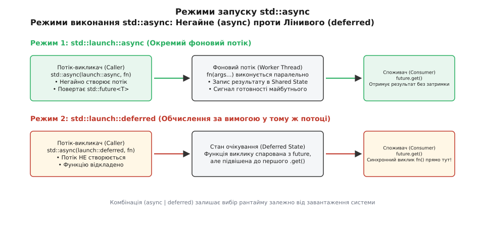
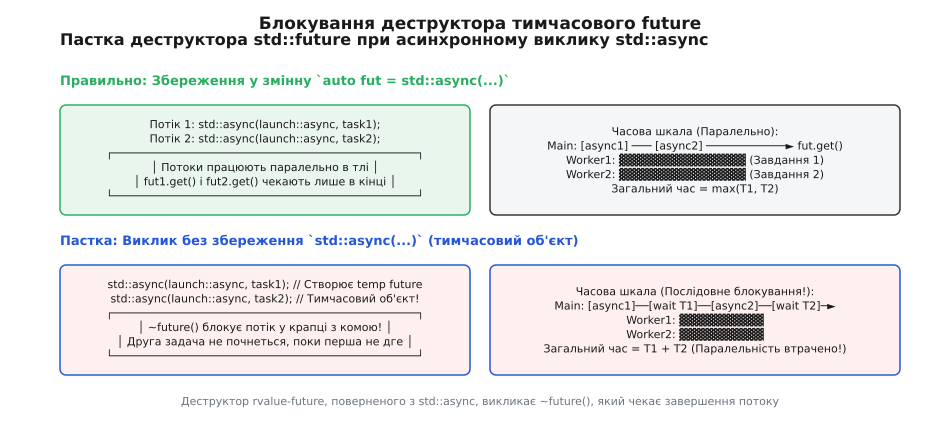
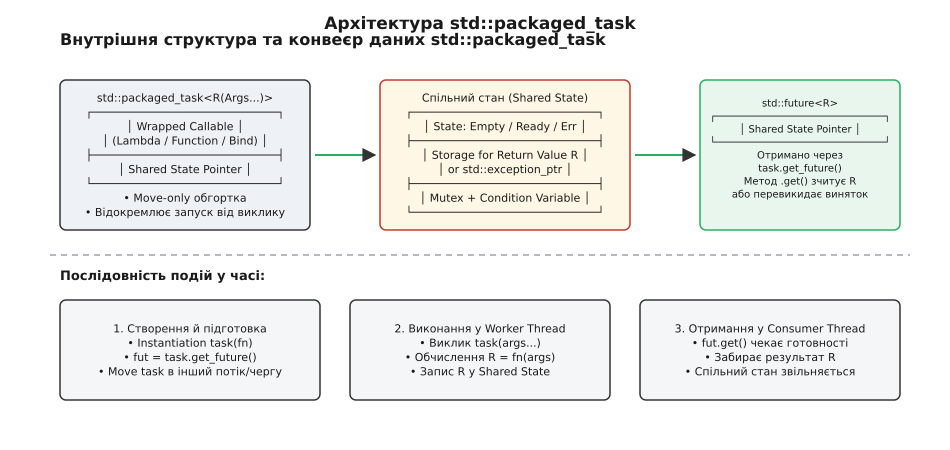
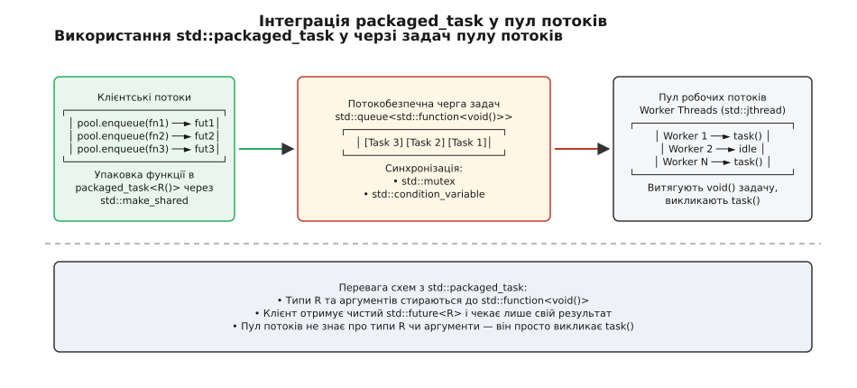

# async і packaged_task: запуск із результатом

<preknowlist>
- [thread і jthread: запуск, приєднання, скасування](book:cpp-standards/std-thread-jthread) — базове створення потоків у C++11/20, RAII та приєднання.
- [future й promise: результат з іншого потоку](book:cpp-standards/future-promise) — модель спільного стану (shared state), очікування та передача винятків.
</preknowlist>

Коли програма на C++ створює потік виконання за допомогою `std::thread`, вона запускає фонову задачу, але втрачає простий спосіб отримати результат її обчислення або дізнатися про помилку, що виникла всередині. Сирий потік `std::thread` приймає функцію з поверненим типом `void` або ігнорує повернене значення, а будь-який необроблений виняток у фоновому потоці негайно викликає `std::terminate()`, аварійно завершуючи весь процес.

Спроба передати результат через посилання або глобальну змінну вимагає ручного захисту м'ютексом, створення умовної змінної для сповіщення про готовність та складної обробки виняткових ситуацій. Для уникнення цього низькорівневого рутинного коду стандарт C++11 пропонує два високорівневих інструменти асинхронного програмування: функцію **`std::async`** для декларативного запуску обчислень у фоні та шаблон класу **`std::packaged_task`**, який зв'язує довільний callable-об'єкт із каналом передачі результату `std::future`.

---

## 1. Проблема низькорівневих потоків та архітектура Спільного Стану

Класичний підхід до багатопотоковості на основі `std::thread` спроектований навколо концепції «запусти й приєднай» (fire-and-join). Об'єкт `std::thread` є низькорівневою обгорткою над потоком операційної системи. Він керує життєвим циклом виконання, але абсолютно нічого не знає про логіку даних, які обчислюються усередині.

Розглянемо типову задачу: необхідно обчислити складну математичну функцію або завантажити файл з мережі у фоновому потоці. При використанні `std::thread` виникають три фундаментальні архітектурні бар'єри:

Перший — **відсутність прямого каналу повернення значення**. Функція, передана в `std::thread`, не може повернути результат через оператор `return`. Значення доводиться записувати у зовнішню змінну за посиланням, що вимагає виділення пам'яті у купі та явного синхронізування через `std::mutex` або атомарні прапорці.

Другий — **аварійність при винятках**. Якщо у фоновому потоці кидається виняток (наприклад, `std::bad_alloc` або `std::runtime_error`), він не може автоматично перетнути межу потоку. Стек фонового потоку згортається до верхнього рівня, після чого середовище виконання C++ викликає `std::terminate()`. Клієнтський потік навіть не дізнається, чому програма впала.

Третій — **примусове управління життєвим циклом**. Об'єкт `std::thread` у своєму деструкторі вимагає, щоб потік був або приєднаний (`.join()`), або від'єднаний (`.detach()`). Якщо розробник забуде це зробити, деструктор `std::thread` також викликає `std::terminate()`.

### Внутрішня будова Спільного Стану (Shared State)

Для вирішення цих проблем високорівневі асинхронні абстракції C++ спираються на концепцію **Спільного Стану (Shared State)**.

Спільний стан — це динамічно виділений у купі блок пам'яті, який одночасно керується продуцентом (функцією, `std::packaged_task` або `std::async`) та споживачем (`std::future`). Усередині спільного стану знаходяться:

1. **Атомарний лічильник посилань** (`std::atomic<size_t>`), який визначає момент звільнення пам'яті (коли знищені і `future`, і `packaged_task`).
2. **Буфер пам'яті під результат** `R` або об'єкт `std::exception_ptr` для збереження винятку.
3. **Прапорець стану готовності** (Empty, Ready, Exception, Broken).
4. **Примітиви синхронізації**: м'ютекс `std::mutex` та умовна змінна `std::condition_variable` (або системний футекс `futex` у реалізаціях Linux), які блокують потік-споживач при виклику `future.wait()` чи `future.get()` до моменту готовності результату.

При виклику `std::async` або конструюванні `std::packaged_task` середовище виконання створює екземпляр спільного стану у купі через `operator new`. Вказівники на цей стан зберігаються у двох протилежних кінцях каналу зв'язку. Коли виконавець закінчує розрахунок, він записує значення у буфер спільного стану і через умовну змінну розблоковує потік-споживач.

Низькорівневий примітив `std::promise` дозволяє вручну створити такий канал зв'язку, проте він вимагає написання великої кількості стереотипного коду: створення об'єкта `promise`, явного виклику `try-catch`, збереження результату через `set_value()` або винятку через `set_exception()`.

Саме для того, щоб автоматизувати цю рутинну роботу та надати нульовий за помилками інтерфейс, C++ надає `std::async` та `std::packaged_task`.

---

## 2. Декларативний запуск обчислень через `std::async`

Функція `std::async` пропонує найпростіший спосіб виконання функції у фоні. Вона приймає callable-об'єкт та його аргументи, автоматично створює внутрішній спільний стан і повертає об'єкт `std::future<T>`, який містить майбутній результат типу `T`.

### Політики виконання: `std::launch::async` проти `std::launch::deferred`

Поведінка `std::async` визначається першим параметром — політикою запуску `std::launch`. Стандарт визначає два режими:

```cpp
// 1. Примусове створення окремого потоку виконання
auto fut1 = std::async(std::launch::async, compute_data, 42);

// 2. Ліниве виконання у покликуючому потоці за вимогою
auto fut2 = std::async(std::launch::deferred, compute_data, 42);
```

Кожен режим має власні інваріанти та сферу застосування:

- **`std::launch::async`**: Гарантує, що функція `compute_data` почне виконуватися паралельно в окремому фоновому потоці негайно після виклику `std::async`. Покликуючий потік продовжує виконання без затримок. Результат зчитується пізніше викликом `fut1.get()`. У середовищах POSIX/Linux це призводить до виклику `pthread_create`, а у Windows — до використання системного пулу потоків `SubmitThreadpoolWork`.
- **`std::launch::deferred`**: Забороняє створення нового потоку. Виконання функції відкладається (lazy evaluation) до моменту, коли на поверненому `fut2` буде первинно викликано метод `.get()` або `.wait()`. У цей момент функція виконується повністю синхронно у потоці викликача. Якщо `.get()` не викликається ніколи, функція не виконається зовсім.


*Режими виконання std::async: порівняння негайного створення потоку (launch::async) та відкладеного виконання у потоці викликача (launch::deferred).*

### Комбінована політика за замовчуванням та прихована пастка

Якщо політику запуску не вказано явно, виклик `std::async(fn, args...)` використовує комбіновану політику за замовчуванням `std::launch::async | std::launch::deferred`.

Це означає, що середовище виконання (runtime) C++ має право самостійно вирішувати, чи створювати новий потік, чи відкласти обчислення. Якщо система має вільні процесорні ядра, вибирається `async`. Якщо ж система перевантажена або вичерпано ліміт потоків ОС, рантайм може без попередження переключитися на `deferred`.

Ця гнучкість приховує небезпечний підводний камінь при перевірці стану готовності через `.wait_for()`:

```cpp
auto fut = std::async(heavy_computation);

// Небезпека: якщо рантайм обрав launch::deferred, wait_for повернути статус deferred!
// Цикл увійде в нескінченний дедлок, бо функція чекає на саму себе!
while (fut.wait_for(std::chrono::seconds(0)) != std::future_status::ready) {
    // Чекаємо готовності у циклі...
}
```

Якщо рантайм обрав политику `deferred`, функція `heavy_computation` навіть не почне виконуватися, поки не буде викликано `.get()` або `.wait()`. Метод `fut.wait_for(0s)` завжди повертатиме статус `std::future_status::deferred`, створюючи нескінченний цикл.

### Реалізації у системних компиляторах (MSVC STL проти GCC libstdc++)

Поведінка `std::async` суттєво відрізняється між стандартними бібліотеками компіляторів:

- **MSVC STL (Microsoft Visual C++)**: Використовує внутрішній системний пул потоків Windows ThreadPool (`CreateThreadpoolWork` / `SubmitThreadpoolWork`). Це мінімізує оверхед на створення нових потоків операційної системи, повторно використовуючи існуючі воркери пулу.
- **GCC libstdc++ та Clang libc++ (Linux/POSIX)**: У традиційних версіях `std::async(std::launch::async, ...)` на кожен окремий виклик викликає системну функцію `pthread_create`, створюючи новий потік ОС, який знищується після завершення задачі. Це створює високе навантаження на ядерний менеджер потоків при масових запусках.

### Простеження виконання на рівні операційної системи

Якщо простежити виконання виклику `std::async(std::launch::async, ...)` у системному відлагоджувачі Linux (наприклад, через `strace` або `perf tracepoints`), можна побачити таку послідовність системних подій:

1. Системний виклик `sys_clone` (або `sys_clone3`) створює новий процес-потік із спільним простором віртуальної пам'яті (`CLONE_VM`), таблицею файлових дескрипторів (`CLONE_FILES`) та обробниками сигналів (`CLONE_SIGHAND`).
2. Операційна система виділяє стек нового потоку у віртуальній пам'яті за допомогою `mmap(MAP_ANONYMOUS | MAP_PRIVATE)`.
3. Планувальник ОС (CFS / EEVDF у Linux) додає новий потік у чергу виконання ядер (`sched_switch`).
4. Потік-викликач продовжує роботу, а фоновий потік виконує функцію, записує результат у спільний стан та сигналізує футекс `sys_futex(FUTEX_WAKE)`.

Така послідовність системних дій вимагає значного процесорного часу. Саме тому створення нового `std::async` для дрібних обчислювальних операцій створює великий оверхед і сповільнює програму.

### Передавання та модифікація аргументів у `std::async`

При передачі аргументів у `std::async` треба пам'ятати про правила згортання типів `std::decay_t`. За замовчуванням усі аргументи копіюються або переміщуються у внутрішнє сховище спільного стану:

```cpp
void update_data(std::string& data);
void process_unique(std::unique_ptr<Data> ptr);

std::string my_str = "hello";
auto my_ptr = std::make_unique<Data>();

// ПОМИЛКА КОМПІЛЯЦІЇ: async намагається передати rvalue-копію у lvalue-посилання!
// auto fut1 = std::async(std::launch::async, update_data, my_str);

// ПРАВИЛЬНО: використовуємо std::ref для явного передавання посилання
auto fut1 = std::async(std::launch::async, update_data, std::ref(my_str));

// ПРАВИЛЬНО: переміщуємо move-only об'єкти
auto fut2 = std::async(std::launch::async, process_unique, std::move(my_ptr));
```

При передачі методів класу першим аргументом передається вказівник на метод `&Class::method`, а другим — екземпляр об'єкта (або посилання чи вказівник на нього). Якщо передати сам об'єкт за значенням, `std::async` створить його повну копію у купі спільного стану.

### Очищення thread_local ресурсів у `std::async`

Коли потік створюється середовищем виконання для виклику `std::async(std::launch::async, ...)`, для нього ініціалізуються всі змінна типу `thread_local`. Після закінчення обчислень та запису результату у спільний стан цей потік завершується, викликаючи деструктори усіх потоко-локальних змінних перед безпосереднім згортанням системного стеку. Цей процес гарантує відсутність витоків пам'яті у динамічно завантажених модулях та бібліотеках.

### Скасування задач через `std::stop_token` (C++20)

У C++11/17 не існує вбудованого способу скасувати виконання `std::async`, який вже розпочав роботу. У C++20 для цього рекомендується передавати у функцію об'єкт `std::stop_token`:

```cpp
// Функція з підтримкою кооперативного скасування у C++20
int cancellable_task(std::stop_token stop_tok, int target) {
    for (int i = 0; i < target; ++i) {
        if (stop_tok.stop_requested()) {
            std::cout << "Задачу скасовано на кроці " << i << std::endl;
            return -1;
        }
        std::this_thread::sleep_for(std::chrono::milliseconds(10));
    }
    return target * 2;
}
```

### Відстеження стану готовності через таймаути (Polling vs Blocking)

Замість незручного безперервного виклику `.get()`, який блокує потік на невизначений термін, методи `.wait_for(timeout)` та `.wait_until(timepoint)` дозволяють реалізувати реактивне відстеження готовності асинхронного результату:

```cpp
auto fut = std::async(std::launch::async, heavy_job);

// Періодичне опитування стану з тайм-аутом у 50 мілісекунд
while (fut.wait_for(std::chrono::milliseconds(50)) == std::future_status::timeout) {
    // Головний потік може малювати UI або обробляти події
    render_loading_spinner();
}

// Результат гарантовано готовий!
auto result = fut.get();
```

---

## 3. Пастка блокуючого деструктора `std::future`

Одним із найбільш суперечливих моментів у специфікації `std::async` є поведінка деструктора поверненого об'єкта `std::future`.

Стандарт C++11 встановлює особливе правило для об'єктів `std::future`, створених через `std::async` із політикою `std::launch::async`:

> **Деструктор останнього об'єкта `std::future`, котрий посилається на спільний стан `std::async`, БЛОКУЄ викликаючий потік до повного завершення виконання фоного потоку.**

Це рішення було прийнято комітетом для запобігання стану гонитви (data race) та витоку ресурсів. Якби деструктор `future` не чекав завершення фонової задачі, фоновий потік міг би звернутися до знищених локальних змінних викликаючого потоку після його виходу з зони видимості.

Проте це правило створює підступний ефект при використанні тимчасових rvalue-об'єктів:

```cpp
// ПАСТКА: Тимчасові об'єкти future нищаться негайно у крапці з комою!
std::async(std::launch::async, task1);
std::async(std::launch::async, task2);
```

У наведеному коді перший виклик `std::async` повертає тимчасовий rvalue-об'єкт `std::future`. Оскільки він не присвоєний жодній змінній, його деструктор викликається негайно наприкінці першого рядка (у крапці з комою). Деструктор **блокує** потік до повного завершення `task1`. Ліше після цього програма переходить до другого рядка і запускає `task2`.

У результаті замість паралельного виконання двох задач програма виконує їх строго послідовно! Паралельність повністю втрачається.


*Вплив тимчасового rvalue-об'єкта std::future на паралельність: деструктор чекає завершення виконання у крапці з комою.*

Щоб зберегти паралельність, повернуті об'єкти `future` обов'язково слід зберігати у локальних змінних або контейнерах:

```cpp
// ПРАВИЛЬНО: Зберігаємо future у змінні, паралельне виконання збережено
auto fut1 = std::async(std::launch::async, task1);
auto fut2 = std::async(std::launch::async, task2);
// Обидва потоки працюють одночасно!
fut1.get();
fut2.get();
```

Зверніть увагу: таке блокуюче правило деструктора стосується **виключно** об'єктів `std::future`, отриманих з `std::async`. Об'єкти `std::future`, створені через `std::promise` або `std::packaged_task`, у своєму деструкторі **не блокують** потік. Вони лише зменшують лічильник посилань спільного стану.

Детальніше про історію прийняття рішення N3451 щодо деструкторів `future` та суперечки в комітеті читайте у [історичному екскурсі](book:cpp-standards/async-and-packaged-task/hist-async-task-evolution.md).

---

## 4. Розділення задачі й виконання: `std::packaged_task`

Хоча `std::async` є зручним інструментом для швидкого запуску фонових обчислень, він повністю приховує процес створення та керування потоками. У складних архітектурах виникає потреба **відокремити опис задачі від її безпосереднього виконання у часі та просторі**.

Саме для цього розроблено шаблон класу **`std::packaged_task<R(Args...)>`**.

`std::packaged_task` — це контейнер-обгортка над довільним callable-об'єктом (функцією, лямбдою, функтором), який пов'язує виконання цієї функції зі спільним станом та надає об'єкт `std::future<R>`.

```cpp
// 1. Створюємо packaged_task над лямбдою
std::packaged_task<int(int, int)> task([](int a, int b) {
    return a + b;
});

// 2. Витягуємо future для отримання результату
std::future<int> fut = task.get_future();

// 3. Виконуємо задачу (можна у поточному потоці, іншому потоці чи пулі)
task(10, 20);

// 4. Отримуємо результат
std::cout << "Результат: " << fut.get() << std::endl; // Виведе 30
```

### Реалізація паттерну Type Erasure та макет пам'яті

Всередині компілятора `std::packaged_task<R(Args...)>` реалізує концепцію **стирання типів (Type Erasure)**.

Оскільки у момент створення задача може обгортати лямбду будь-якого розміру з різними каптурами (від 8 байтів до кількох кілобайтів), `std::packaged_task` зберігає всередині поліморфний вказівник на абстрактний інтерфейс виконання:

```cpp
// Приблизна внутрішня концептуальна структура packaged_task
template<typename R, typename... Args>
class packaged_task<R(Args...)> {
    struct task_base {
        virtual ~task_base() = default;
        virtual void invoke(Args&&... args) = 0;
    };

    template<typename F>
    struct task_impl : task_base {
        F func_;
        std::promise<R> promise_;
        // ...
    };

    std::unique_ptr<task_base> ptr_;
};
```

Цей макет пояснює, чому `std::packaged_task` є move-only об'єктом: він володіє ексклюзивним поліморфним вказівником `ptr_` на створену задачу. У разі використання малих функторів реалізації компіляторів застосовують внутрішню оптимізацію Small Functor Optimization (SFO), зберігаючи об'єкти розміром до 16-32 байтів безпосередньо у внутрішньому буфері без додаткових викликів `malloc`.

### Конструктори у C++11 та вилучення custom allocators у C++17

У стандартах C++11 та C++14 шаблон `std::packaged_task` підтримував конструктори з кастомними алокаторами пам'яті через теговий параметр `std::allocator_arg_t`. Це дозволяло виділяти спільний стан у заздалегідь підготовлених пулах пам'яті (Memory Arenas).

Однак у стандарту C++17 ці конструктори були **вилучені** (deprecated & removed). Причиною стала надмірна складність підтримки алокаторів у поліморфних контейнерах стирання типів та відсутність ідіоматичного способу передачі алокатора у повернений `std::future`. У C++17/20 створення спільного стану завжди координується через стандартний `operator new`.

### Використання `std::pmr` для підготовки даних у функторах

У C++17 заміна кастомним алокаторам `packaged_task` реалізується на рівні самих обгортаних лямбд через `std::pmr::polymorphic_allocator`. Об'єкт пам'яті виділяється локально через `std::pmr::monotonic_buffer_resource`, усуваючи простої в купі:

```cpp
std::array<std::byte, 1024> buffer;
std::pmr::monotonic_buffer_resource mem_pool(buffer.data(), buffer.size());

std::packaged_task<std::size_t()> task([&mem_pool] {
    std::pmr::vector<int> vec(&mem_pool);
    vec.assign(100, 42);
    return vec.size();
});
```

### Внутрішня механіка `packaged_task::operator()`

Коли програма викликає `task(args...)`, усередині обгортки відбувається така послідовність кроків:

1. Метод перевіряє, чи має об'єкт дійсний стан (`valid() == true`). Якщо стан недійсний, кидається виняток `std::future_error` із кодом `no_state`.
2. Перевіряється прапор виконання: якщо результат вже записано, кидається виняток `std::future_error` із кодом `promise_already_satisfied`.
3. Запускається збережений callable-об'єкт у блоці `try-catch`.
4. Якщо функція повернула значення `r`, воно розміщується у буфері спільного стану, прапорець стану переводиться у `ready`, і викликається `condition_variable::notify_all()`.
5. Якщо функція кинула виняток, він перехоплюється як `std::exception_ptr` і зберігається замість результату.

### Несумісність із сигнальною системою ОС (Signal Handling)

Оператор виконання `packaged_task::operator()` виділяє пам'ять та використовує примітиви синхронізації `std::mutex`. Згідно з POSIX стандартом, ці операції **не є async-signal-safe**. Викликати `packaged_task` усередині обробника системних сигналів Linux (`sighandler_t`) суворо заборонено, оскільки це спричиняє дедлоки у критичних секціях аллокатора `malloc`.

### Спеціалізація `packaged_task<void()>` та передача аргументів через `std::apply`

Особливе місце посідає спеціалізація `std::packaged_task<void()>`. У ній буфер спільного стану не зберігає повернуте значення `R`, а використовує лише атомарні прапорці готовності. Це зменшує обсяг виділеної пам'яті у купі.

При проектуванні узагальнених обгортальних бібліотек для передачі пакета аргументів `std::tuple` у сохранену задачу застосовують метафункцію C++17 `std::apply`:

```cpp
template<typename F, typename Tuple>
auto make_tuple_task(F&& f, Tuple&& args) {
    using return_type = std::invoke_result_t<F, Tuple>;
    
    return std::packaged_task<return_type()>([f = std::forward<F>(f), 
                                              args = std::forward<Tuple>(args)]() mutable {
        return std::apply(f, std::move(args));
    });
}
```

### Робота з варіативними лямбдами у C++20

У C++20 лямбда-вирази підтримують шаблони типів у квадратних дужках `[]<typename T>(T&& arg)`. `std::packaged_task` легко обгортає такі лямбди після виявлення точного типу через `std::invoke_result_t`:

```cpp
auto generic_lambda = []<typename T>(T a, T b) { return a + b; };

// Явно вказуємо спеціалізацію типу для packaged_task
std::packaged_task<int(int, int)> task(generic_lambda);
```

### Патерн вимірювання телеметрії та обгортки задач

Завдяки стиранню типів розробник може легко додавати до `std::packaged_task` функціонал вимірювання затримок (Latency Tracing) або метрик через узагальнені обгортки з використанням `if constexpr` у C++17:

```cpp
template<typename Func>
auto make_measured_task(Func&& f) {
    using return_type = std::invoke_result_t<Func>;
    
    return std::packaged_task<return_type()>([f = std::forward<Func>(f)]() mutable {
        auto start = std::chrono::high_resolution_clock::now();
        
        if constexpr (std::is_same_v<return_type, void>) {
            f();
            auto elapsed = std::chrono::high_resolution_clock::now() - start;
            std::cout << "[Телеметрія] Час виконання: " 
                      << std::chrono::duration_cast<std::chrono::microseconds>(elapsed).count() 
                      << " мкс" << std::endl;
        } else {
            auto res = f();
            auto elapsed = std::chrono::high_resolution_clock::now() - start;
            std::cout << "[Телеметрія] Час виконання: " 
                      << std::chrono::duration_cast<std::chrono::microseconds>(elapsed).count() 
                      << " мкс" << std::endl;
            return res;
        }
    });
}
```

### Повторне використання задачі через `.reset()`

На відміну від `std::promise` чи `std::async`, об'єкт `std::packaged_task` підтримує повторне використання. Метод `.reset()` виділяє новий спільний стан, залишаючи збережену функцію незмінною:

```cpp
std::packaged_task<int()> task([] { return rand() % 100; });

auto fut1 = task.get_future();
task(); // Перший запуск
int res1 = fut1.get();

task.reset(); // Скидаємо стан і створюємо новий future!
auto fut2 = task.get_future();
task(); // Другий запуск
int res2 = fut2.get();
```


*Внутрішній конвеєр std::packaged_task: від передачі обчислювальної функції до зчитування результату через спільний стан.*

Повний список методів, конструкторів та гарантій потокобезпеки наведено у [довіднику API `std::packaged_task`](book:cpp-standards/async-and-packaged-task/api-async-packaged-task.md).

---

## 5. Передавання винятків, потокобезпека та `make_ready_at_thread_exit`

Однією з головних переваг `std::packaged_task` та `std::async` перед сирими потоками `std::thread` є прозора підтримка системи винятків C++.

### Автоматичний проброс винятків між потоками

Коли усередині обгортаної функції виникає виняток, `std::packaged_task` не дає йому перервати виконання потоку. Робочий цикл перехоплює виняток за допомогою `std::current_exception()`, упаковує його в об'єкт `std::exception_ptr` і зберігає у спільному стані.

Коли потік-споживач викликає `future.get()`, середовище виконання розпаковує `std::exception_ptr` і виконує `std::rethrow_exception()`, повторно кидаючи точно такий самий виняток у потоці споживача:

```cpp
std::packaged_task<double(double, double)> task([](double a, double b) {
    if (b == 0.0) throw std::invalid_argument("Ділення на нуль!");
    return a / b;
});

std::future<double> fut = task.get_future();
std::thread worker(std::move(task), 10.0, 0.0);
worker.detach();

try {
    double res = fut.get(); // Повторно кидає std::invalid_argument
} catch (const std::exception& e) {
    std::cout << "Перехоплено виняток з фонового потоку: " << e.what() << std::endl;
}
```

### Інтеграція з трасуванням стеку C++23 (`std::stacktrace`)

У сучасному стандарту C++23 обробку винятків у `std::packaged_task` доповнюють збереженням знімку стеку викликів через `std::stacktrace::current()`. Це дозволяє отримати точне місце виникнення помилки у фоновому потоці навіть після пробросу через `future.get()`.

### Аналіз системних кодів помилок `std::future_errc`

У разі порушення контракту викликів методи асинхронних примітивів кидають винятки `std::future_error`. Основні коди помилок включають:

1. **`broken_promise`**: Виникає, коли `packaged_task` нищиться у деструкторі без виклику `operator()`. Споживач отримує цей виняток при спробі викликати `fut.get()`.
2. **`future_already_retrieved`**: Виникає при спробі повторно викликати `.get_future()` на одному й тому самому об'єкті `packaged_task`.
3. **`promise_already_satisfied`**: Виникає при спробі повторно виконати задачу через `operator()` без використання `.reset()`.
4. **`no_state`**: Виникає при спробі звернутися до переміщеного (moved-from) об'єкта `packaged_task`.

### Розсилка результату багатьом потокам через `std::shared_future`

Звичайний об'єкт `std::future` надає лише одноразовий доступ до результату: метод `.get()` нищить внутрішній буфер результату за допомогою `std::move`. Якщо декілька потоків намагаються одночасно викликати `.get()` на один і той самий `future`, виникає undefined behavior.

Для реалізації паттерну **Один-до-багатьох (One-to-Many Notification / Broadcast)** використовується `std::shared_future`:

```cpp
std::packaged_task<int()> task([] { return 42; });
std::shared_future<int> shared_fut = task.get_future().share();

// Декілька потоків можуть безпечно викликати shared_fut.get() паралельно!
std::thread t1([shared_fut] { std::cout << "T1: " << shared_fut.get() << "\n"; });
std::thread t2([shared_fut] { std::cout << "T2: " << shared_fut.get() << "\n"; });

task();
t1.join();
t2.join();
```

### Захист потоко-локальних даних: `make_ready_at_thread_exit`

У сценаріях, коли обчислювальна задача працює з об'єктами тривалості життя `thread_local`, стандартний виклик `task()` може створити стан гонитви.

Якщо потік-виконавець запише результат у спільний стан і негайно зробить його готовим, потік-споживач вийде з `future.get()` і почне нищити ресурси. Проте потік-виконавець у цей момент ще не завершив свій вихід і не встиг викликати деструктори своїх `thread_local` змінних!

Для вирішення цієї проблеми `std::packaged_task` надає спеціальний метод:

```cpp
task.make_ready_at_thread_exit(args...);
```

Цей метод виконує задачу і зберігає результат у спільному стані, але **затримує** активацію прапора готовності `future`. Спільний стан стає готовим лише тоді, коли потік виконання повністю припинить свій існування та виконає деструктори усіх `thread_local` об'єктів.

---

## 6. Побудова асинхронних виконавицьких пулів (Task Executors) та конвеєрів

Функція `std::async` зручна для поодиноких задач, але вона не вирішує проблему масштабування. При створенні тисяч асинхронних викликів `std::async(std::launch::async, ...)` операційна система швидко вичерпує ліміт потоків і кидає виняток `std::system_error`.

Для промислових систем основним архітектурним рішенням є використання `std::packaged_task` у поєднанні з **Пулом Потоків (Thread Pool)**.


*Використання std::packaged_task у черзі пулу робочих потоків із автоматичним стиранням типів.*

Головна перевага `std::packaged_task` у пулі задач полягає у **стиранні типів (type erasure)**. Пул потоків оперує єдиною потокобезпечною чергою задач типу `std::queue<std::function<void()>>`.

Завдяки цьому:
1. Клієнт передає у метод `pool.enqueue(fn, args...)` функцію з довільною сигнатурою та типами аргументів.
2. Метод загортає її у `std::packaged_task<R()>`, витягує `std::future<R>` для клієнта і повертає його.
3. Сама задача упаковується у безпараметричну лямбду `void()` і кладеться у чергу пулу.
4. Вільний робочий потік витягує з черги об'єкт `std::function<void()>` і викликає його, навіть не знаючи, яке саме значення `R` повертає задача.

### Побудова конвеєрів паралельної обробки (Pipeline Parallelism)

У складному аналізі даних (наприклад, у візуальних графічних двигунах або фінансових розрахунках) задачі поєднуються у багатоетапні конвеєри. Об'єкт `std::packaged_task` дозволяє з'єднувати стадії розрахунку без блокування головного потоку:

- **Стадія Map**: Вхідні дані розбиваються на блоки і передаються у пул задач через `packaged_task`.
- **Стадія Transform**: Вихідні `future` від першої стадії передаються наступним задачам у конвеєрі.
- **Стадія Reduce**: Підсумковий потік чекає готовності всіх обчислень і формує агрегований результат.

### Інтеграція з акторною моделлю (Actor Model)

У фреймворках паралельного обчислення на основі акторів (наприклад, C++ Actor Framework або CAF) об'єкти `std::packaged_task` слугують універсальним форматом асинхронних повідомлень. Актор приймає загорнуту задачу з поштової скриньки (mailbox), виконує її на своєму локальному потоці і відправляє відповідь через `future` актору-запитувачу.

Повний сирцевий код виробничого пулу задач `TaskExecutor` на C++20 із детальним розбором та тестами наведено у [проєктній вставці](book:cpp-standards/async-and-packaged-task/proj-task-executor.md).

---

## 7. Порівняння з корутинами C++20 та моделями інших мов

Розуміння еволюції паралелізму дозволяє краще бачити місце `std::packaged_task` у сучасному C++:

### C++11 Futures/Tasks проти C++20 Корутин (`co_await`)

Стандарт C++20 впровадив у мову **корутини (Coroutines)**. Основна відмінність між підходами полягає у моделі використання стеку пам'яті:

- **Stackful Асинхронність (`std::async` / `std::thread`)**: Кожна задача створює власний стек пам'яті в ОС (1-8 Мегабайтів) або виділяє спільний стан у купі через `std::packaged_task`. Блокування на `fut.get()` зупиняє весь потік ОС.
- **Stackless Асинхронність (C++20 `co_await`)**: Функція-корутина призупиняє виконання без блокування потоку ОС. Фрейм корутини зберігається у купі (розміром лише кілька десятків байтів), а потік операційної системи звільняється для виконання інших задач.

### Порівняльна матриця з іншими мовами програмування

- **Go (Goroutines / Channels)**: У мові Go паралельність побудована на легких зелених потоках (Goroutines) із розширюваним стеком (починаючи з 2 Кілобайтів). На відміну від C++ `std::async`, яка створює потік ОС (1-8 МБ), у Go можна негайно запустити 100 000 горутин без вичерпання ресурсів.
- **Rust (Async/Await & Futures)**: У Rust модель асинхронності є лінивою (Lazy Futures). Машина станів комбінується під час компіляції без обов'язкового виділення пам'яті у купі, а для виконання використовується зовнішній виконавець (наприклад, Tokio executor).
- **C# / Java (Task Parallel Library & CompletableFuture)**: У C# виклик `Task.Run` автоматично намагається використати глобальний системний пул потоків CLR із підтримкою балансування задач (work-stealing queue), уникаючи створення потоків ОС на кожну задачу.

Кожен підхід вирішує проблему по-своєму, проте у C++ саме `std::packaged_task` надає фундаментальний будівельний блок для створення довільних високоефективних пулів та асинхронних виконавицьких систем.

---

## 8. Оцінка продуктивності та накладних витрат (Benchmarking Metrics)

При виборі між асинхронними примітивами важливо розуміти часові накладні витрати (Latency Overhead) на їх створення та запуск:

- **Створення сирого потоку `std::thread`**: 10–30 мікросекунд (залежно від операційної системи, через системні виклики `clone`/`mmap`).
- **Запуск `std::async(std::launch::async, ...)`**: 12–35 мікросекунд (включає створення потоку та виділення спільного стану у купі).
- **Виклик `std::async(std::launch::deferred, ...)`**: 5–10 наносекунд (лише ініціалізація структури, без створення потоків).
- **Постановка `std::packaged_task` у пул задач**: 50–100 наносекунд (включає атомарне захоплення м'ютекса черги та сигналювання `notify_one`).

При проведенні мікробенчмарків на вичитку результатів слід враховувати пропускну здатність системної шини. Передача великих об'єктів через спільний стан повинна здійснюватися виключно за допомогою семантики переміщення `std::move`, оскільки копіювання масивів або векторів у буфер спільного стану викликами `std::async` додає вимірний затримки у сотні наносекунд на кожну операцію.

### Активація оптимізацій кєшу та захист від False Sharing

При частій модифікації спільного стану декількома потоками процесорні ядра змагаються за відповідну кєш-лінію (64 байти). Це призводить до явища **False Sharing** (хибне розділення кєшу). Для мінімізації цього ефекту у паралельних структур даних застосовують макрос C++17 `alignas(std::hardware_destructive_interference_size)`.

### Обмеження системних ресурсів ядра ОС

При масовому створенні об'єктів `std::async(std::launch::async, ...)` операційна система може досягти ліміту процесів та потоків (`RLIMIT_NPROC` у Linux). У цій ситуації наступний виклик `std::async` кидає виняток `std::system_error` із кодом помилки `std::errc::resource_unavailable_try_again`. Використання пулів потоків на основі `std::packaged_task` повністю запобігає виникненню цієї помилки.

---

## 9. Практичні рекомендації та порівняльний аналіз

Для вибору оптимального асинхронного примітива користуйтеся порівняльною матрицею інструментів C++11:

| Критерій вибору | `std::thread` | `std::async` | `std::packaged_task` | `std::promise` |
| :--- | :--- | :--- | :--- | :--- |
| **Рівень абстракції** | Низький (Потік ОС) | Високий (Декларативний) | Середній (Упаковка задачі) | Середній (Канал даних) |
| **Автоматичний запуск потоку** | Так | Так (або deferred) | Ні (Вручну / у пулі) | Ні |
| **Повернення значення** | Ні | Так (`std::future`) | Так (`std::future`) | Так (`std::future`) |
| **Проброс винятків** | Ні (`terminate`) | Так | Так | Ручний (`set_exception`) |
| **Придатність для черг / пулів** | Низька | Низька | **Ідеальна** | Середня |
| **Повторне використання** | Ні | Ні | **Так** (`.reset()`) | Ні |

> 🔧 **Навіщо це у реальній розробці.**
> Зміна парадигми від низькорівневих потоків `std::thread` до асинхронних виконавицьких пулів на основі `std::packaged_task` дозволяє створювати масштабовані серверні сервіси та ігрові рушії. Ви відокремлюєте логіку обчислень від управління обчислювальними ресурсами ОС, усуваєте витоки пам'яті через винятки та запобігаєте завистанню потоків при роботі з результатами.

### Підсумкові висновки

1. Використовуйте **`std::async`** із політикою `std::launch::async` для швидкого, одноразового виконання ізольованих фонових задач, коли створення нового потоку ОС не створює проблем із продуктивністю.
2. Завжди зберігайте повернений об'єкт `std::future` у змінній, щоб уникнути синхронного блокування у деструкторі тимчасового rvalue-об'єкта.
3. Використовуйте **`std::packaged_task`**, коли вам необхідно відокремити створення задачі від її виконання, або при побудові власних пулів потоків, асинхронних виконавців (Executors) та реактивних конвеєрів.
4. Пам'ятайте, що `std::packaged_task` є move-only об'єктом, а для його збереження у `std::function` у C++11/20 використовується техніка обгортання у `std::shared_ptr`. У C++23 для цього застосовують `std::move_only_function`.
