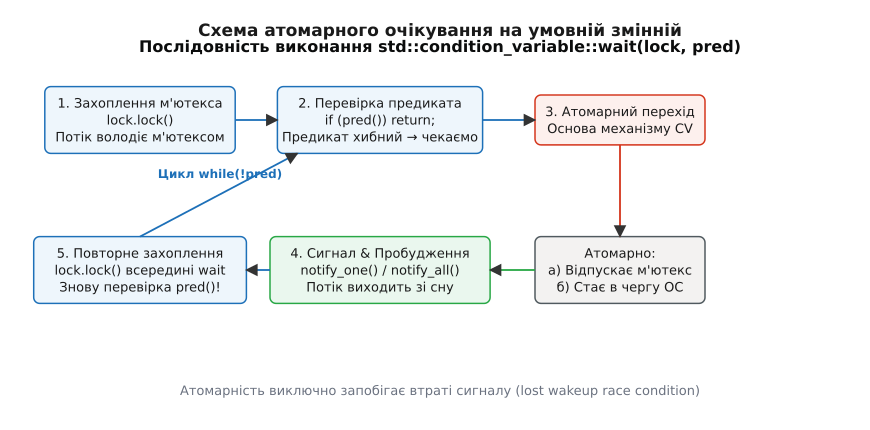
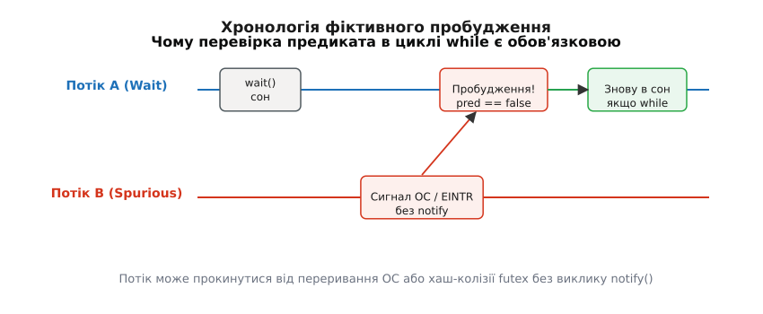
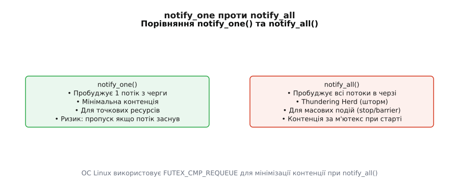
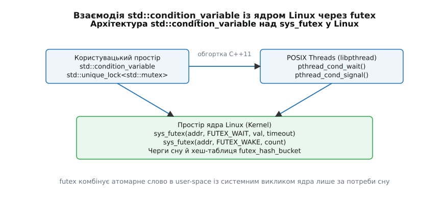

# Умовна змінна: чекати подію, а не крутитися

<preknowlist>
- [М'ютекс і RAII-замки](topic:cpp-standards/mutex-and-raii-locks) — що таке `std::mutex`, `std::unique_lock`, чому м'ютекс захищає критичну секцію та як працює RAII-звільнення замка.
- [thread і jthread](topic:cpp-standards/std-thread-jthread) — як створюються потоки виконання в C++, чим керується їхній життєвий цикл та як працює `std::join`.
- [Атомарність і гонки](topic:programming/atomicity-races) — концепція гонки даних (data race), видимості змінних між ядрами процесора та атомарних операцій.
- [Невизначена поведінка (UB)](topic:programming/undefined-behavior) — чому одночасне читання й запис незахищеної змінної руйнує виконання програми.
</preknowlist>

Уяви фоновий потік обробки завдань у мережевому сервері, який очікує нових запитів із робочої черги. Якщо черга порожня, потік не має що виконувати. У найпростішій реалізації програміст ставить активне опитування в циклі: `while (queue.empty());`. За одну секунду такий потік опитує стан прапорця понад 100 мільйонів разів. Це на 100% завантажує одне ядро процесора, викликає термальне гальмування (англ. *thermal throttling*), вибиває з L1/L2 кешів дані інших потоків та марно спалює електроенергію. Додавання штучної паузи `std::this_thread::sleep_for(1ms)` знімає навантаження з ядра, але додає до кожного запиту до 1 мілісекунди затримки й змушує систему робити 1000 марних перемикань контексту на секунду. Потрібен механізм, який зупиняє виконання потоку повністю, знімає його з опитування планувальника ОС із нульовими витратами процесора і миттєво (за одиниці мікросекунд) будить його в той момент, коли потік-виробник кладе нове завдання в чергу. Цим механізмом є **умовна змінна** (`std::condition_variable`).

## Межа можливостей м'ютекса та парадокс чекання

М'ютекс гарантує **взаємне виключення** (англ. *mutual exclusion*): він дозволяє лише одному потокові перебувати всередині критичної секції. Але м'ютекс принципово не вміє чекати *зміни стану*. Якщо потік захопив м'ютекс, зайшов у критичну секцію і виявив, що умова для роботи ще не готова (черга порожня, буфер не заповнений, файл не прочитаний), у нього виникає дилема:

1. Якщо він **залишає м'ютекс утримуваним** і лягає спати — жоден інший потік (у тому числі потік-виробник) не зможе увійти в критичну секцію, щоб покласти туди дані. Виникає гарантоване взаємне блокування (англ. *deadlock*).
2. Якщо він **відпускає м'ютекс** і засинає через звичайний `sleep()`, виникає гонка між перевіркою умови та засинанням.

Розглянемо цю гонку детальніше, бо саме вона пояснює всю складну архітектуру умовних змінних.

### Гонка втраченого сигналу (Lost Wakeup Race Condition)

Спробуємо побудувати чекання на наївній комбінації м'ютекса та атомарного прапорця без умовної змінної:

```cpp
// ✗ ПОМИЛКОВА СХЕМА: Спроба симуляції очікування без condition_variable
std::mutex mtx;
bool ready = false;

// Потік A (Споживач)
void worker() {
    std::unique_lock<std::mutex> lock(mtx);
    if (!ready) {
        lock.unlock(); // (1) Відпустили м'ютекс
        
        // ─── КРИТИЧНЕ ВІКНО ГОНКИ ───
        // Потік B може вклинитися СЮДИ!
        
        sleep_until_signaled(); // (2) Заснули
    }
}

// Потік B (Виробник)
void publisher() {
    {
        std::lock_guard<std::mutex> lock(mtx);
        ready = true; // (3) Змінили стан
    }
    send_signal(); // (4) Надіслали сигнал
}
```

Якщо Потік A перевірив `!ready` і відпустив м'ютекс у точці (1), але ще не встиг виконати виклик засинання в точці (2), операційна система може призупинити Потік A (наприклад, через закінчення його кванту часу). У цей момент Потік B захоплює м'ютекс, ставить `ready = true` і надсилає сигнал пробудження у точці (4).

Оскільки Потік A ще не заснув, сигнал іде в нікуди («повітря»). После цього Потік A відновлює виконання й переходить у точку (2) — лягає спати **навжди**, хоча стан `ready` вже давно дорівнює `true`. Це явище називається **втратою сигналу** (англ. *lost wakeup*).

Небезпека цієї гонки полягає у її надзвичайній прихованості: під час синтетичних мобільних тестів чи роботи на одноядерній системі код може виконуватися безпомилково мільйони разів. Проте на багатоядерних серверах під високим мережевим навантаженням часове вікно між `lock.unlock()` та `sleep_until_signaled()` стає регулярним джерелом зависання фонових потоків, які зупиняють обробку черги завдань.

У багатопотокових серверах обробки фінансових транзакцій втрата сигналу означає, що потік-робітник назавжди застрягає в стані очікування, а завдання накопичуються в черзі до повного вичерпання ресурсів пам'яті. Умовна змінна розв'язує цю проблему шляхом усунення часового вікна між звільненням замка та реєстрацією потоку у черзі сну операційної системи.

## Атомарний перехід: основа механізму wait()

Щоб закрити критичне вікно між перевіркою умови й засинанням, умовна змінна надає фундаментальну операцію `wait()`.

Головна властивість `std::condition_variable::wait()` полягає у **безпечному атомарному переході**: вона відпускає м'ютекс і ставить потік у чергу сну операційної системи як **єдину індивідуальну операцію** на рівні ядра.

```cpp
std::mutex mtx;
std::condition_variable cv;
bool ready = false;

// Потік A (Споживач)
void worker() {
    std::unique_lock<std::mutex> lock(mtx);
    // wait() атомарно відпускає mtx і блокує потік
    cv.wait(lock, []{ return ready; });
    // Після повернення з wait() м'ютекс mtx ЗНОВУ ЗАХОПЛЕНИЙ потоком A!
}
```

Коли Потік A викликає `cv.wait(lock)`, відбуваються такі кроки:

1. Потік перевіряє предикат. Якщо він істинний — `wait()` негайно повертає керування, не відпускаючи м'ютекс.
2. Якщо предикат хибний, `wait()` реєструє потік у внутрішній черзі очікування умовної змінної.
3. Атомарно відпускається м'ютекс `mtx`, і потік переводиться у стан сну (планувальник ОС виключає його з черги на виконання).
4. Коли інший потік викликає `cv.notify_one()` або `cv.notify_all()`, потік-споживач переводиться зі стану сну у стан очікування м'ютекса.
5. Потік повторно захоплює `mtx` (чекає у черзі до м'ютекса, якщо той зайнятий).
6. Тільки після успішного відновлення володіння м'ютексом `wait()` повторно перевіряє предикат.



*Послідовність виконання `std::condition_variable::wait(lock, pred)`: атомарне звільнення м'ютекса, сон у черзі ОС та обов'язкова повторна перевірка предиката після пробудження.*

Для глибокого розуміння того, як ця концепція еволюціонувала від теоретичних робіт 1970-х років до системного стандарту POSIX, звернися до вставки [📜 Історія виникнення умовних змінних: від моніторів Гоара до POSIX та C++11](topic:cpp-standards/condition-variable/hist-cv-origin.md).

> 🔧 **Навіщо це.** Без атомарного поєднання «відпустити замок + заснути» неможливо побудувати жодну надійну чергу повідомлень, басейни потоків (англ. *thread pools*) чи алгоритми конвеєрної обробки (англ. *pipeline processing*). Окрема спроба відпустити м'ютекс і заснути двома інструкціями неминуче призводить до рідкісних, але катастрофічних збоїв у промисловому коді.

## Апаратна взаємодія та бар'єри пам'яті (Memory Ordering)

На рівні апаратного забезпечення (Hardware Architecture) взаємодія між м'ютексом та умовною змінною спирається на строгі гарантії впорядкування пам'яті. Коли потік-виробник змінює захищений стан і викликає `notify_one()`, операційна система та процесор повинні забезпечити повну видимість цих змін для потоку-споживача.

У моделі пам'яті C++ операція звільнення м'ютекса `lock.unlock()` володіє семантиками **Release** (вивантаження всіх попередніх записів із буферів збереження процесора у спільний кеш), а повторне захоплення м'ютекса `lock.lock()` усередині `wait()` володіє семантикою **Acquire** (інвалідація старого кешу й зчитування найсвіжіших даних із загальної пам'яті).

Це означає, що всі зміни shared-станних змінних, виконані потоком-виробником до виклику `notify_one()`, гарантовано стають видимими потоку-споживачу одразу після повернення з `cv.wait()`. Без належного синхронізаційного замка навіть атомарна зміна прапорця не гарантує видимості інших пов'язаних структур даних у кешах інших ядер процесора.

Сучасні багатоядерні процесори (наприклад, Intel Xeon або AMD EPYC) використовують проміжний буфер запису (англ. *Store Buffer*). Без виклику операції синхронізації з семантикою Release нові дані можуть тривалий час залишатися у буфері запису конкретного ядра процесора, не потрапляючи у спільну оперативну пам'яті чи L3-кеш. Саме тому комбінація `std::mutex` та `std::condition_variable` гарантує апаратне виштовхування (англ. *store buffer flushing*) усіх модифікованих структур даних через інструкції бар'єрів пам'яті (такі як `sfence` або `mfence` на x86 чи `dmb` на ARM).

## Фіктивні пробудження (Spurious Wakeups) та предикатний цикл

Найпоширенішою помилкою початківців є використання `wait()` без циклу перевірки предиката:

```cpp
// ✗ СМЕРТЕЛЬНА ПОМИЛКА: Викликати wait() без циклу або предиката
std::unique_lock<std::mutex> lock(mtx);
cv.wait(lock); // Потік може прокинутися, коли ready все ще false!
process_data(); // БАГ: обробка порожніх або невалідних даних!
```

Умовна змінна має право прокинутися **без виклику `notify()`** з боку інших потоків. Це явище називається **фіктивним пробудженням** (англ. *spurious wakeup*).

### Чому виникають фіктивні пробудження?

1. **Системні переривання та сигнали (POSIX):** У Unix-подібних системах системний виклик очікування (`futex` у Linux або `pthread_cond_wait`) може бути перерваний сигналом ОС (наприклад, `SIGINT`, `SIGALRM` або `SIGUSR1`). Системний виклик повертає помилку `EINTR`, і бібліотека pthreads змушена розблокувати потік.
2. **Колізії у хеш-таблицях ядра:** У ядрі Linux системний виклик `sys_futex` утримує черги потоків у хеш-таблиці `futex_hash_bucket` фіксованого розміру. Якщо два різні примітиви синхронізації потрапляють в один хеш-бакет, будильник для одного примітива може випадково розбудити потік, що чекав на зовсім іншому примітиві.
3. **Оптимізації багатопроцесорних систем (SMP):** На архітектурах із слабким впорядкуванням пам'яті (ARM, POWER) забезпечення гарантії того, що потік прокинеться *виключно* за явним сигналом, вимагало б надто дорогих міжядерних бар'єрів пам'яті (англ. *memory barriers*). Розробники стандартів POSIX і C++ вирішили дозволити рідкісні хибні пробудження на користь колосального виграшу у швидкодії основного шляху виконання.



*Хронологія фіктивного пробудження: потік A може прокинутися через системне переривання ОС без виклику `notify()`, тому предикат `while(!pred)` є єдиним захистом.*

### Канонічна форма перевірки предиката

Щоб повністю знівелювати наслідки фіктивних пробуджень та конкурентного вклинювання інших потоків, очікування завжди обгортають у цикл `while`:

```cpp
// ✓ КАНОНІЧНИЙ ВАРІАНТ 1: Явний цикл while
std::unique_lock<std::mutex> lock(mtx);
while (!ready) {
    cv.wait(lock);
}

// ✓ КАНОНІЧНИЙ ВАРІАНТ 2: Передача лямбда-предиката в wait()
std::unique_lock<std::mutex> lock(mtx);
cv.wait(lock, []{ return ready; });
```

Обидва варіанти повністю ідентичні за згенерованим машиним кодом. Передавання лямбда-виразу в `cv.wait()` — це просто компактна синтаксична обгортка над циклом `while (!pred()) cv.wait(lock);`.

## Детальний аналіз таймаутів: wait_for() проти wait_until()

У реальних високопродуктивних системах часто виникає потреба обмежити час очікування події. Умовна змінна постачає два сімейства методів очікування з часовими обмеженнями: `wait_for()` (з відносним інтервалом) та `wait_until()` (з абсолютною часовою точкою).

```cpp
using namespace std::chrono_literals;

std::unique_lock<std::mutex> lock(mtx);

// Очікування з відносним таймаутом (100 мілісекунд)
if (cv.wait_for(lock, 100ms, []{ return ready; })) {
    std::cout << "Подія настала вчасно!\n";
} else {
    std::cout << "Таймаут вичерпано, подія не настала.\n";
}
```

### Проблема дрейфу часу при використанні wait_for() у циклах

Якщо чекання з таймаутом виконується всередині циклу повторної перевірки предиката, використання `wait_for()` спричиняє так званий **дрейф часу** (англ. *time drift*). 

При кожному фіктивному пробудженні або повторній перевірці умови виклик `wait_for(100ms)` відраховує 100 мілісекунд *наново* від поточного моменту. Якщо потік прокидався 5 разів на 10 мілісекунд, сумарний час очікування може розстягнутися далеко за початкові 100 мілісекунд.

Дієве вирішення цієї проблеми — перехід на абсолютний час через `wait_until()`:

```cpp
auto deadline = std::chrono::steady_clock::now() + 100ms;

std::unique_lock<std::mutex> lock(mtx);
// wait_until використовує фіксовану абсолютну часову точку
while (!ready) {
    if (cv.wait_until(lock, deadline) == std::cv_status::timeout) {
        if (!ready) {
            std::cout << "Точний таймаут досягнуто!\n";
            break;
        }
    }
}
```

Важливо вибирати правильний годинник: `std::chrono::steady_clock` є монотонним і захищеним від ручного корегування системного часу користувачем чи NTP-сервером, на відміну від `std::chrono::system_clock`.

Використання `std::chrono::system_clock` у методах очікування може призвести до непередбачуваних багів: якщо адміністратор сервера або служба синхронізації NTP переведе системний час на кілька годин назад під час виконання програми, виклик `wait_until()` може застрягти у сні на ці кілька годин. Монотонний годинник `steady_clock` спирається на внутрішній апаратний таймер процесора (наприклад, TSC у x86) і завжди рухається лише вперед із фікрованою частотою.

## std::condition_variable проти std::condition_variable_any

У стандартній бібліотеці C++ наявні два класи умовних змінних. Їх відмінність полягає в універсальності та накладних витратах.

```cpp
#include <condition_variable>

std::condition_variable cv_std;      // Працює ТІЛЬКИ з std::unique_lock<std::mutex>
std::condition_variable_any cv_any;  // Працює з БУДЬ-ЯКИМ типом замка (BasicLockable)
```

### 1. std::condition_variable

* **Вимога до замка:** Виключно `std::unique_lock<std::mutex>`.
* **Реалізація:** Прямо відображається на нативні системні примітиви операційної системи (`pthread_cond_t` у Linux/POSIX, `CONDITION_VARIABLE` у Windows API).
* **Продуктивність:** Нульові накладні витрати (англ. *zero-overhead abstraction*). Жодних додаткових виділень пам'яті чи віртуальних викликів.

### 2. std::condition_variable_any

* **Вимога до замка:** Будь-який тип, що реалізує інтерфейс `BasicLockable` (має методи `.lock()` та `.unlock()`).
* **Можливості:** Дозволяє чекати під `std::shared_lock<std::shared_mutex>` (очікування події під замком читача), узагальненими користувацькими спінлоками або рекурсивними м'ютексами.
* **Ціна універсальності:** Створює внутрішній допоміжний м'ютекс і додаткові атомарні обгортки для гарантії атомарного звільнення довільного замка. Це дає невеличкі накладні витрати за часом (`≈ 10–30%`) та пам'яттю.

Детальний перелік методів, часових таймаутів `wait_for` / `wait_until` та типів повертаваних значень `std::cv_status` наведено у довіднику [📋 Повна довідка API: std::condition_variable та std::condition_variable_any](topic:cpp-standards/condition-variable/api-cv-reference.md).

## Стратегії сповіщення: notify_one() проти notify_all()

Для пробудження потоків умовна змінна надає два методи:

```cpp
cv.notify_one(); // Пробудити один потік з черги
cv.notify_all(); // Пробудити всі потоки з черги
```

### Коли використовувати notify_one()?

`notify_one()` обирають тоді, коли **будь-який один потік** із черги очікування здатний обробити подію, і ця обробка є взаємовиключною. Класичний приклад — черга завдань у пулі потоків. Якщо в порожню чергу надходить одне нове завдання, його повинен взяти рівно один вільний потік-робітник.

Пробудження лише одного потоку мінімізує змагання за м'ютекс (англ. *lock contention*).

### Проблема «Шторму пробудження» (Thundering Herd Problem)

Якщо викликати `notify_all()` там, де потрібен лише один потік (наприклад, при додаванні одного елемента в чергу із 50 потоками-споживачами), виникає ефект **Thundering Herd** (укр. *шторм прокинутого стада*):

1. Операційна система одночасно будить усі 50 потоків.
2. Усі 50 потоків намагаються одночасно захопити один і той самий м'ютекс `mtx`.
3. Один потік захоплює м'ютекс, вилучає елемент із черги й відпускає м'ютекс.
4. Решта 49 потоків по черзі захоплюють м'ютекс, бачать, що черга знову порожня (`!queue.empty()` повертає `false`), і **знову лягають спати**.
5. Результат: 49 марних перемикань контексту ядра, просідання продуктивності та навантаження на автобус пам'яті.



*Порівняння notify_one() та notify_all(): notify_one мінімізує контенцію за м'ютекс, тоді як notify_all використовується для системних сигналів та завершення роботи.*

### Коли використовувати notify_all()?

`notify_all()` є обов'язковим у двох випадках:

1. **Зміна стану стосується всіх потоків:** Наприклад, бак з пальним заповнився, барьєр синхронізації досягнутий, або надійшов сигнал зупинки всієї системи (`shutdown`).
2. **Різні потоки чекають на різні умови:** Якщо на одній умовній змінній чекають потоки з різними предикатами (наприклад, читачі й письменники), виклик `notify_one()` може випадково розбудити потік, чий предикат не справдився. Цей потік прокинеться, побачить `false` і знову засне, а той потік, який міг би виконати роботу, так і залишиться спати.

> ⚠️ **Небезпека втрати сигналу при notify_one():** Якщо на одній умовній змінній висять потоки з різними умовами, виклик `notify_one()` може призвести до "поглинання" сигналу не тим потоком і вічного зависання системи. У таких випадках або розділяють умовні змінні (окрема CV для кожної умови), або використовують `notify_all()`.

## Сучасна паралельність C++20: std::stop_token та кооперативне скасування

До стандарту C++20 переривання потоку, що заснув у `cv.wait()`, було складною задачею. Доводилося вручну створювати атомарний прапорець `std::atomic<bool> should_stop`, змінювати його, а потім викликати `cv.notify_all()`.

У C++20 з'явилися класи `std::jthread` та `std::stop_token`, які інтегровані безпосередньо в `std::condition_variable_any`:

```cpp
#include <iostream>
#include <thread>
#include <condition_variable>
#include <mutex>
#include <chrono>

std::condition_variable_any cv;
std::mutex mtx;
bool data_ready = false;

void worker_thread(std::stop_token stoken) {
    std::unique_lock<std::mutex> lock(mtx);
    
    // C++20: wait приймає stop_token.
    // Якщо надходить сигнал скасування, wait() негайно розблоковується!
    bool success = cv.wait(lock, stoken, []{ return data_ready; });
    
    if (stoken.stop_requested()) {
        std::cout << "Потік отримав сигнал скасування! Вихід.\n";
        return;
    }
    
    std::cout << "Дані успішно оброблені!\n";
}

int main() {
    std::jthread worker(worker_thread);
    
    std::this_thread::sleep_for(std::chrono::milliseconds(100));
    
    // Автоматично надсилаємо сигнал скасування та будимо умовну змінну
    worker.request_stop(); 
    // При виході з main jthread автоматично зробить join()
}
```

Під капотом `cv.wait(lock, stoken, pred)` реєструє зворотний виклик (англ. *stop callback*) на об'єкті `stop_token`. Коли головний потік викликає `worker.request_stop()`, цей callback автоматично будить умовну змінну, запобігаючи вічним зависанням під час зупинки додатку.

## Інверсія пріоритетів (Priority Inversion) та умовні змінні

У системах реального часу (англ. *Real-Time Operating Systems / RTOS*) виникає небезпечне явище **інверсії пріоритетів** (англ. *Priority Inversion*). 

Розглянемо випадок, коли високопріоритетний потік H чекає на сповіщення умовної змінної від низькопріоритетного потоку L. Якщо потік L захопив м'ютекс для зміни стану, але переривається середньопріоритетним потоком M (який взагалі не використовує м'ютекс), виникає парадокс: високопріоритетний потік H змушений чекати, поки середньопріоритетний потік M повністю завершить свої довготривалі обчислення!

Для вирішення цієї проблеми операційні системи впроваджують протокол **успадкування пріоритетів** (англ. *Priority Inheritance Protocol*). У POSIX pthreads цей атрибут задається на м'ютексі через `pthread_mutexattr_setprotocol(&attr, PTHREAD_PRIO_INHERIT)`. Під час очікування на умовній змінній ядро тимчасово піднімає пріоритет потоку L до рівня потоку H, запобігаючи витисненню потоком M та усуваючи затримки реального часу.

## Особливості поведінки у NUMA-архітектурах

У сучасних багатосокетних серверах із NUMA-архітектурою (англ. *Non-Uniform Memory Access*) ядерні процесори розділені на окремі ноди (англ. *NUMA nodes*), кожна з яких володіє власною локальною оперативною пам'яттю. Доступ до пам'яті іншої NUMA-ноди через шину QPI/UPI коштує в 2–3 рази більше затримки, ніж доступ до локальної пам'яті.

Коли примітив `std::condition_variable` використовується між потоками, що виконуються на різних NUMA-нодах, виникають додаткові витрати:
1. **Інвалідація кеш-ліній між сокетами:** Зміна стану `futex_word` та м'ютекса змушує міжпроцесорну шину висилати міжпроцесорні переривання (IPI) для узгодження кешів.
2. **Перемикання нод:** Якщо потік-виробник працює на Node 0, а потік-споживач чекає на Node 1, кожен виклик `notify_one()` викликає трафік між сокетами.

У високооптимізованих системах (наприклад, мережевих роутерах DPDK або торгових двигунах) застосовують прив'язку потоків до ядер (англ. *thread affinity*) через `pthread_setaffinity_np()` та розносити умовні змінні окремо для кожної NUMA-ноди.

## Системний рівень: Як умовна змінна влаштована в ядрі Linux (Futex) та Windows (CONDITION_VARIABLE)

У системі Linux примітиви `std::condition_variable` реалізовані поверх POSIX Threads (`libpthread`), які своєю чергою спираються на системний виклик ядра `sys_futex` (англ. *Fast Userspace Mutex*).

Футекс був розроблений Расті Расселом (англ. *Rusty Russell*), Ульріхом Дреппером (нім. *Ulrich Drepper*) та Інго Молнаром (угор. *Ingo Molnar*) у 2002 році. Його головне досягнення — **відсутність системних викликів у разі відсутності контенції**.

```
Користувацький простір (User Space)
  std::condition_variable
    └── pthread_cond_wait()
          └── sys_futex(&futex_word, FUTEX_WAIT_PRIVATE, val, timeout)
──────────────────────────────────────────────────────────────────────────
Простір ядра (Kernel Space)
  sys_futex()
    └── futex_wait()
          ├── 1. Перевіряє, чи (*futex_word == val)
          ├── 2. Якщо так: додає потік у futex_hash_bucket
          └── 3. Переводить потік у TASK_INTERRUPTIBLE (сон)
```



*Архітектурний шар: транслювання викликів C++ `std::condition_variable` через `libpthread` у системний виклик ядра Linux `sys_futex`.*

У системі Windows (починаючи з Windows Vista та Windows Server 2008) реалізація спирається на нативні примітиви `CONDITION_VARIABLE` та функції Windows API `SleepConditionVariableCS` (для критичних секцій) або `SleepConditionVariableSRW` (для Slim Reader/Writer замків). Вони володіють аналогічною продуктивністю з нульовими виділеннями пам'яті в користувацькому просторі.

Коли потік викликає `wait()` у Linux:
1. Бібліотека pthreads робить атомарне зчитування 32-бітного слова `futex_word` у користувацькому просторі.
2. Якщо сповіщення ще не було, викликається `sys_futex(..., FUTEX_WAIT_PRIVATE, val, ...)`.
3. Ядро Linux **всередині спинлока хеш-бакета** перевіряє, чи значення за адресою `futex_word` все ще дорівнює `val`. Це гарантує атомарність перевірки.
4. Потік переводиться у стан `TASK_INTERRUPTIBLE` і знімається з виконання планувальником `CFS`/`EEVDF`.

Коли інший потік викликає `notify_one()`:
1. Викликається `sys_futex(..., FUTEX_WAKE_PRIVATE, 1, ...)`.
2. Ядро знаходить хеш-бакет за адресою `futex_word`, виймає один потік із черги очікування й переводить його у стан `TASK_RUNNING`.

Повний приклад проектування потокобезпечної обмеженої черги з детальним аналізом продуктивності та реалізаціями на C++ і C наведено у практичній вставці [⚙️ Практичний проєкт: Багатопотокова обмежена черга (Bounded Queue) з підтримкою скасування](topic:cpp-standards/condition-variable/proj-bounded-queue.md).

## Простеження виконання через інструменти системного трасування

Для аналізу роботи умовних змінних у реальному часі на Linux використовують інструменти трасування системних викликів `strace` та `perf trace`.

Виконання команди `strace -e futex ./my_app` показує низькорівневу взаємодію з ядром:

```bash
# Системний виклик засинання в очікуванні сигналу умовної змінної
futex(0x7fff5fbff800, FUTEX_WAIT_PRIVATE, 0, NULL) = 0

# Системний виклик пробудження одного потоку після виклику notify_one()
futex(0x7fff5fbff800, FUTEX_WAKE_PRIVATE, 1) = 1
```

Використання інструменту `perf top -e futex:futex_wait` дозволяє оцінити, який відсоток CPU витрачається на засинання та пробудження потоків під високим навантаженням.

## Взаємодія з профілюванням Linux cgroups та CFS-квотами

У хмарних середовищах (Docker, Kubernetes) процеси обмежуються через Linux cgroups за CPU-квотами (`cpu.cfs_quota_us` та `cpu.cfs_period_us`). Якщо потік-виробник перевищує свою квоту часу виконання, ядро заморожує його виконання до початку наступного періоду cgroup.

Якщо потік-виробник виявився замороженим через CFS throttling під час утримання м'ютекса, всі потоки-споживачі, що прокинулися від виклику умовної змінної, застрягають у стані очікування м'ютекса до розморожування виробника. Це викликає сплески затримки (англ. *latency spikes*) у хмарних додатках.

## Порівняння Lock-Based умовних змінних та Lock-Free черг

Часто у високопродуктивному коді постає вибір між використанням умовних змінних та беззамкових структури даних (англ. *lock-free queues*).

| Критерій порівняння | Умовна змінна (`std::condition_variable`) | Беззамкові черги (Lock-Free Queue) |
| :--- | :--- | :--- |
| **Використання CPU під час сну** | Абсолютно нульове (`0%` CPU) | Часте спинення в циклі CAS (`100%` CPU) |
| **Затримка пробудження (Latency)** | Дещо вища (`≈ 2–5 µs` через перемикання ОС) | Мінімальна (`≈ 10–50 ns`) |
| **Складність реалізації** | Проста та перевірена часом | Дуже висока (ризик багів ABA, memory leaks) |
| **Максимальна пропускна здатність** | Поміркована (до `5–10 млн опер/сек`) | Екстремальна (до `100 млн опер/сек`) |

Умовні змінні залишаються найкращим вибором тоді, коли споживачі повинні чекати відсутності даних невизначено довго без навантаження на процесор.

## Альтернативи в C++20: Семафори, Latch та Barrier

У стандарті C++20 з'явилися нові примітиви синхронізації, які в деяких сценаріях спрощують код порівняно з `std::condition_variable`:

1. `std::counting_semaphore` та `std::binary_semaphore` — реалізують лічильні семафори. Для задач типу "сигнал про наявність ресурсу" семафор не вимагає явного створення м'ютекса та прапорця стану, спрощуючи код сповіщення.
2. `std::latch` — одноразовий лічильник зворотного відліку. Потоки зменшують лічильник і чекають, поки він досягне нуля. Ідеально підходить для очікування завершення ініціалізації групи фонових задач.
3. `std::barrier` — багаторазовий фазовий бар'єр для синхронізації циклічних фаз обчислень між фіксованою кількістю потоків.

Незважаючи на появу цих примітивів, `std::condition_variable` залишається єдиним універсальним засобом для складної предикатної синхронізації з довільними умовами та обмеженими чергами.

## Статична ініціалізація та порядок знищення (Static Initialization Fiasco)

Створення глобальних або статичних об'єктів `std::condition_variable` та `std::mutex` вимагає обережності через проблему порядку статичної ініціалізації (англ. *Static Initialization Order Fiasco*).

Якщо фоновий потік намагається викликати `cv.wait()` під час деструкції статичних об'єктів при завершенні програми `main()`, глобальний м'ютекс або умовна змінна вже можуть бути знищені, що викликає важкодіагностований крах програми (Crash on Exit).

Щоб запобігти цьому, застосовують ідіому "Meyers Singleton" (локальна статична змінна всередині функції) або явно завершують усі фонові потоки до виходу з функції `main()`.

## Типові пастки та антипатерни

### 1. Утримання м'ютекса під час виклику notify()

```cpp
// Антипатерн: notify() під утримуваним замком
void signal_data() {
    std::unique_lock<std::mutex> lock(mtx);
    ready = true;
    cv.notify_one(); // ✗ Потік прокинеться й ОДРАЗУ впреться в mtx, який ми ще утримуємо!
} // Лише тут mtx звільняється
```

**Як правильно:**

```cpp
// Оптимальний варіант: notify() після звільнення замка
void signal_data() {
    {
        std::unique_lock<std::mutex> lock(mtx);
        ready = true;
    } // lock звільняється ТУТ
    cv.notify_one(); // ✓ Пробуджений потік може одразу захопити mtx без затримки!
}
```

*Примітка:* Хоча сучасні версії Linux згладжують цю проблему через `FUTEX_CMP_REQUEUE`, винесення `notify()` за межі критичної секції залишається найкращою практикою для переносності на інші ОС (Windows, macOS).

### 2. Зависання на знищенні (Dangling Wait on Destruction)

Якщо умовна змінна знищується (виходить із області видимості або видаляється через `delete`), поки хоча б один потік чекає в `cv.wait()`, виникає **невизначена поведінка (UB)**. Завжди гарантуй, що всі потоки розблоковані й завершили виклики `wait()` до виклику деструктора умовної змінної.

### 3. Забутий предикат при чеканні декількох подій

Якщо потік чекає на настання однієї з двох подій (наприклад, «надходження даних» АБО «сигнал завершення»), предикат повинен явно враховувати обидва стани:

```cpp
// Правильна перевірка складеної умови
cv.wait(lock, [this]{ return !queue.empty() || is_stopped; });
```

### 4. Некоректне використання з декількома різними м'ютексами

Стандарт C++ та специфікація POSIX вимагають, щоб усі одночасні виклики `wait()` на одній умовній змінній використовували **один і той самий м'ютекс**. Якщо потік A викликає `cv.wait(lock1)`, а потік B паралельно викликає `cv.wait(lock2)` на тій самій умовній змінній `cv`, але з іншим м'ютексом `lock2`, це призводить до фатальної невизначеної поведінки (UB). Внутрішні черги ядра не спроможні синхронізативно розблокувати потоки між двома незалежними замками.

### 5. Обробка винятків усередині предиката

Якщо предикатна функція або лямбда-вираз, переданий у `cv.wait(lock, pred)`, викидає виняток (наприклад, виняток нехватки пам'яті під час перевірки умови), умовна змінна забезпечує гарантію безпеки: м'ютекс `lock` повторно захоплюється перед тим, як виняток вилетить за межі виклику `wait()`. Це гарантує цілісність критичної секції та запобігає залишенню м'ютекса у незахопленому стані.

Правильне написання багатопотокового коду вимагає глибокого розуміння цих системних гарантій та суворого дотримання дисципліни використання RAII-обгорток. Дотримання вищезазначених правил гарантує повну відсутність дедлоків, race conditions та витоків системних ресурсів у промислових багатопотокових C++ додатках.

Умовна змінна — це фундаментальний міст між захистом даних м'ютексом та ефективним управлінням ресурсами процесора. Вона усуває марні цикли опитування, зводить накладні витрати очікування до нуля та формує основу для побудови високопродуктивних паралельних систем будь-якої складності.
