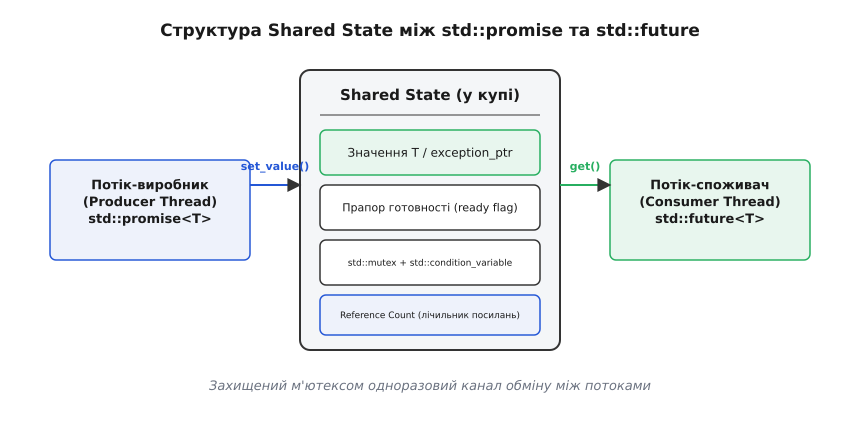
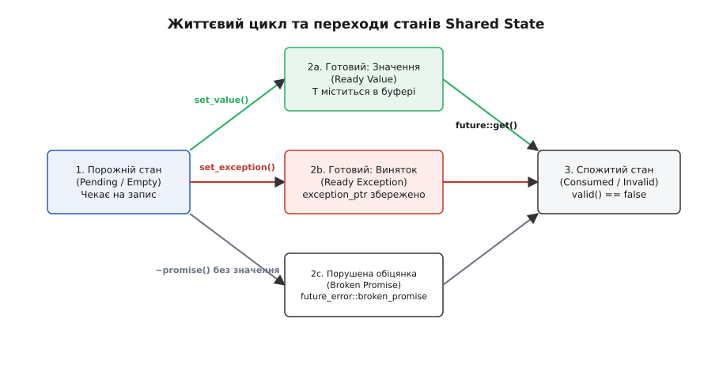

# future й promise: результат з іншого потоку

<preknowlist>
- [thread i jthread](topic:cpp-standards/std-thread-jthread) — виклики процедур у фонових потоках та керування їхнім життєвим циклом.
- [М'ютекс і RAII-замки](topic:cpp-standards/mutex-and-raii-locks) — забезпечення взаємного виключення під час доступу до спільних даних.
- [Умовна змінна](topic:cpp-standards/condition-variable) — механізм сповіщення та неблокувального очікування між потоками.
</preknowlist>

Запуск асинхронного обчислення у фоновому потоці через `std::thread` приховує фундаментальне обмеження: конструктор `std::thread` приймає довільну функцію, але її повернюване значення розсіюється у повітрі. Коли потік завершує роботу, результат обчислення не повертається викликачу, оскільки сигнатура функції потоку повертає `void` з точки зору виконавчого ядра OS.

Щоб передати результат назад у потік-викликач, розробник змушений вручну створювати спільні змінні, захищати їх за допомогою `std::mutex`, сигналізувати про готовність через `std::condition_variable` та окремо перехоплювати винятки, щоб вони не призвели до `std::terminate()` у фоновому потоці. Ручне збирання такої схеми для кожного асинхронного обчислення вимагає десятків рядків boilerplate-коду і містить масу підступних пасток: від забудькуватості при захопленні замка до гонки станів (data race) та передчасного знищення змінних на стеку.

Стандарт C++11 розв'язав цю проблему шляхом введення високорівневої абстракції одноразового асинхронного каналу "виробник — споживач", вираженого парами типів `std::promise` та `std::future`.

---

## Проблема передачі результату між потоками

Для розуміння потреби у спеціалізованих абстракціях розглянемо базове завдання: головний потік доручає фоновому потоку виконати ресурсомістке обчислення (наприклад, розрахунок хеш-суми великого файла або матричне множення) і прагне отримати повернене значення.

Спроба зробити це через сирий `std::thread` демонструє асиметрію:

```cpp
#include <thread>
#include <iostream>

int compute_payload() {
    // Важке обчислення
    return 42;
}

int main() {
    // Ззвичайний запуск: повернене значення compute_payload() ігнорується!
    std::thread t(compute_payload);
    t.join();
    // Як прочитати 42 у головному потоці?
}
```

Конструктор `std::thread` обгортає викликану функцію в системний потік, але не надає жодних засобів для перехоплення її повернюваного значення.

Традиційне розв'язання цієї проблеми без використання `<future>` вимагає побудови ручного синхронізованого буфера:

```cpp
#include <thread>
#include <mutex>
#include <condition_variable>
#include <exception>
#include <iostream>

struct ManualChannel {
    std::mutex mtx;
    std::condition_variable cv;
    bool ready = false;
    int result = 0;
    std::exception_ptr ex = nullptr;
};

void worker(ManualChannel& ch) {
    try {
        int res = compute_payload();
        {
            std::lock_guard<std::mutex> lock(ch.mtx);
            ch.result = res;
            ch.ready = true;
        }
        ch.cv.notify_one();
    } catch (...) {
        {
            std::lock_guard<std::mutex> lock(ch.mtx);
            ch.ex = std::current_exception();
            ch.ready = true;
        }
        ch.cv.notify_one();
    }
}
```

У цій ручній схемі криється одразу п'ять небезпек:
1. **Час життя пам'яті:** Об'єкт `ManualChannel` має жити доти, доки обидва потоки не завершать роботу з ним. Якщо головний потік вийде з області видимості раніше за фоновий, фоновий потік звернеться до знищеного стекового об'єкта.
2. **Перехоплення винятків:** Якщо у фоновому потоці виникне виняток, його необхідно явно піймати через `catch (...)`, зберегти у `std::exception_ptr`, а у головному потоці перевірити й повторно кинути через `std::rethrow_exception()`. Забудькуватість призведе до миттєвого аварійного завершення програми через `std::terminate()`.
3. **Хибні пробудження:** Головний потік мусить чекати у циклі `cv.wait(lock, [&]{ return ch.ready; })`, щоб не стати жертвою spurious wakeups.
4. **Одноразовість:** Схема розрахована лише на один запис, але жоден механізм на рівні комбінації типів не забороняє повторний запис або читання.
5. **Обсяг коду:** На кожен новий тип повернення розробник змушений дублювати цей синхронізаційний каркас.

Шаблони `std::promise` та `std::future` повністю інкапсулюють цю складність, перетворюючи її на безпечний та типізований інтерфейс.

---

## Концептуальна модель: Shared State та парування promise / future

Архітектурною основою обміну є несиметричне розділення ролей між джерелом даних та їхнім отримувачем.

- **`std::promise<T>` (виробник, producer):** це записувальний кінець каналу. Потік-виробник тримає `promise` і має право виконувати тільки операції запису — зберегти значення `set_value()` або передати виняток `set_exception()`.
- **`std::future<T>` (споживач, consumer):** це зчитувальний кінець каналу. Потік-споживач тримає `future` і має право виконувати тільки операції зчитування або очікування — метод `get()` чи `wait()`.

Серцем цього зв'язку є прихований динамічний об'єкт — **Shared State** (спільний стан), який виділяється у купі під час створення `std::promise`.


*Спільний керований стан (Shared State) слугує одноразовим містком між потоком-виробником (promise) та потоком-споживачем (future).*

### Внутрішня будова Shared State

Shared State не належить фізично ані класу `promise`, ані класу `future`. Це автономний керований об'єкт, який містить:
1. **Буфер для даних:** Комірку пам'яті для зберігання поверненого значення типу `T` або вказувача на виняток `std::exception_ptr`.
2. **Прапорці стану:** Атомарні значення або бітові маски, що вказують на поточний стан каналу (`Empty`, `Ready`, `Abandoned`).
3. **Примітиви синхронізації:** Внутрішній `std::mutex` та `std::condition_variable` для розблокування чекаючих потоків після запису результату.
4. **Атомарний лічильник посилань (Reference Count):** Відстежує кількість об'єктів (`promise`, `future` чи `shared_future`), які посилаються на цей стан.

### Поведінка часу життя Shared State

Завдяки лічильнику посилань Shared State гарантує відсутність витоків пам'яті та звернень за недійсними адресами:
- Коли створюється `std::promise`, лічильник посилань дорівнює 1.
- Виклик `p.get_future()` створює об'єкт `std::future` і збільшує лічильник посилань до 2.
- Якщо `std::promise` знищується після запису значення, лічильник зменшується до 1. Shared State продовжує жити у купі, бо його утримує `std::future`.
- Коли `std::future` зчитує результат і знищується, лічильник стає рівним 0, і пам'ять Shared State остаточно звільняється.

---

## Механіка та життєвий цикл std::promise

Об'єкт `std::promise<T>` конструюється у порожньому стані. Для зв'язування з об'єктом читання використовується метод `get_future()`.

```cpp
#include <future>
#include <thread>
#include <iostream>

void async_worker(std::promise<int> p) {
    try {
        // Фонове обчислення
        int result = 100 + 200;
        p.set_value(result); // Запис значення
    } catch (...) {
        p.set_exception(std::current_exception()); // Запис винятку
    }
}

int main() {
    std::promise<int> p;
    std::future<int> f = p.get_future(); // Отримання зчитувального кінця

    std::thread t(async_worker, std::move(p)); // promise є move-only!
    
    std::cout << "Результат з фонового потоку: " << f.get() << std::endl;
    t.join();
}
```

### Правило єдиного виклику get_future()

Метод `get_future()` можна викликати для одного й того самого `promise` **лише один раз**. 

Зв'язок між `promise` та `future` є строго одноразовим каналом «один до одного». Повторний виклик `get_future()` призводить до кидання винятку `std::future_error` із кодом `future_already_retrieved`:

```cpp
std::promise<int> p;
std::future<int> f1 = p.get_future(); // Успішно

try {
    std::future<int> f2 = p.get_future(); // Спроба повторного виклику
} catch (const std::future_error& e) {
    std::cout << "Помилка: " << e.what() << std::endl; // future_already_retrieved
}
```

### Передача move-only типів через set_value()

Шаблон `std::promise<T>` розрахований на роботу з будь-якими типами, включно з типу `move-only` (наприклад, `std::unique_ptr`, `std::vector`, `std::thread`):

```cpp
#include <future>
#include <memory>

struct MoveOnlyData {
    std::unique_ptr<int> ptr;
    MoveOnlyData(int val) : ptr(std::make_unique<int>(val)) {}
};

void process_move_only(std::promise<MoveOnlyData> p) {
    MoveOnlyData data(42);
    p.set_value(std::move(data)); // Обов'язкове переміщення!
}

int main() {
    std::promise<MoveOnlyData> p;
    std::future<MoveOnlyData> f = p.get_future();

    std::thread t(process_move_only, std::move(p));

    MoveOnlyData result = f.get(); // Значення переміщується з Shared State
    std::cout << "Отримано значення: " << *result.ptr << std::endl;
    t.join();
}
```

Для move-only типів метод `set_value()` приймає значення за rvalue-посиланням `T&&`, гарантуючи нуль зайвих копіювань ресурсів у купі.

### Запис результату: set_value() проти set_value_at_thread_exit()

Для запису результату `std::promise` надає два сімейства методів:

1. **`set_value(val)` / `set_exception(ex)`:**
   Атомарно зберігає значення або виняток у Shared State, переводить стан у `Ready` і негайно сигналізує умовній змінній (`notify_all()`). Чекаючий потік-споживач у той самий момент розблоковується і продовжує виконання.

2. **`set_value_at_thread_exit(val)` / `set_exception_at_thread_exit(ex)`:**
   Зберігає значення або виняток у Shared State, але **не переводить** його у стан `Ready` негайно. Перехід у стан `Ready` та сповіщення чекаючих потоків відбуваються лише після повного завершення потоку-виробника — після того, як виконано руйнування всіх об'єктів з модифікатором тривалості життя `thread_local`.

> 🔧 **Навіщо це.** Метод `set_value_at_thread_exit()` є критично важливим для запобігання станам гонки (race conditions), коли результат обчислення спирається на об'єкти з `thread_local` тривалістю життя. Якщо використати звичайний `set_value()`, потік-споживач розблокується негайно, прочитає результат і може завершити програму або знищити спільні ресурси до того, як фоновий потік встигне виконати очищення своїх `thread_local` деструкторів.

### Передавання винятків через set_exception() та розмотування стеку

Якщо під час фонового обчислення виникає виняток, його не можна кидати прямо з функції потоку, адже це призведе до виклику `std::terminate()`. Замість цього виняток перехоплюється й записується у `promise`:

```cpp
void calculate_square_root(double val, std::promise<double> p) {
    try {
        if (val < 0.0) {
            throw std::invalid_argument("Число не може бути від'ємним!");
        }
        p.set_value(std::sqrt(val));
    } catch (...) {
        // Гарантована передача поточного винятку разом зі стеком
        p.set_exception(std::current_exception());
    }
}
```

Виклик `std::current_exception()` захоплює поточний виняток під час розмотування стеку (stack unwinding), зберігаючи інформацію про його тип (RTTI) та VTable. 

Коли потік-споживач викликає `f.get()`, метод `get()` перевіряє вміст Shared State. Якщо замість значення там міститься `std::exception_ptr`, `f.get()` повторно кидає цей виняток у потоці-споживачі за допомогою виклику `std::rethrow_exception()`. Таким чином виняток проламує межу потоків і може бути перехоплений стандартним блоком `try ... catch`.

### Руйнування promise без виконання обіцянки (Broken Promise)

Якщо об'єкт `std::promise` виходить з области видимості або руйнується до того, як для нього було викликано `set_value()` або `set_exception()`, його деструктор виконує аварійні дії:

1. Записує у Shared State виняток `std::future_error` із кодом `std::future_errc::broken_promise`.
2. Переводить Shared State у стан `Ready`.
3. Сповіщає всі чекаючі потоки.

Це гарантує, що потік-споживач не застрягне у блокуючому виклику `f.get()` нанескінченно. Замість цього `f.get()` негайно кине виняток `std::future_error`:

```cpp
std::future<int> f;
{
    std::promise<int> p;
    f = p.get_future();
} // Об'єкт p знищується тут без set_value!

try {
    int val = f.get(); // Кине std::future_error
} catch (const std::future_error& e) {
    if (e.code() == std::future_errc::broken_promise) {
        std::cout << "Обіцянка порушена: виробник загинув без результату!" << std::endl;
    }
}
```

---

## Керування пам'яттю за допомогою кастомних алокаторів

У високопродуктивних системах та embedded-застосунках стандартний виклик `operator new` для виділення Shared State є джерелом небажаної затримки.

Для боротьби з цією проблемою стандарт C++11 надає специфічний конструктор `std::promise`, що приймає кастомний алокатор через тег `std::allocator_arg`:

```cpp
#include <future>
#include <memory_resource>
#include <iostream>

void pmr_allocator_example() {
    // Буфер на стеку для уникнення викликів new у купі
    std::array<std::byte, 1024> buffer;
    std::pmr::monotonic_buffer_resource pool(buffer.data(), buffer.size());
    std::pmr::polymorphic_allocator<int> alloc(&pool);

    // Конструюємо promise з використанням PMR-алокатора
    std::promise<int> p(std::allocator_arg, alloc);
    std::future<int> f = p.get_future();

    p.set_value(42);
    std::cout << "Значення з PMR promise: " << f.get() << std::endl;
}
```

Застосування `std::allocator_arg` гарантує, що вся пам'ять під Shared State виділяється у швидкому стековому або пул-алокаторі з часовою складністю `O(1)`.

---

## Споживання результату через std::future

Клас `std::future<T>` є `move-only` об'єктом, який утримує ексклюзивне право на споживання результату.

```cpp
namespace std {

template <typename R>
class future {
public:
    constexpr future() noexcept;
    future(future&&) noexcept;
    future(const future&) = delete; // Копіювання заборонено!

    R get(); // Отримання результату (одноразово!)
    bool valid() const noexcept; // Перевірка валідності стану

    void wait() const; // Блокуюче очікування
    template <class Rep, class Period>
    future_status wait_for(const chrono::duration<Rep, Period>& timeout) const;
    template <class Clock, class Duration>
    future_status wait_until(const chrono::time_point<Clock, Duration>& timeout) const;
};

}
```

### Одноразовий характер виклику get()

Метод `get()` можна викликати для даного об'єкта `future` **лише один раз**.

Причина полягає у семантиці володіння значенням: метод `get()` переміщує обчислений об'єкт `T` з внутрішнього буфера Shared State до викликача. Після повернення значення `future` анулює своє посилання на Shared State, і метод `valid()` починає повертати `false`.

Повторний виклик `f.get()` над невалідним `future` викликає Undefined Behavior або кидає виняток `std::future_error` із кодом `no_state`:

```cpp
std::promise<std::string> p;
std::future<std::string> f = p.get_future();
p.set_value("Привіт, світ!");

std::string s1 = f.get(); // Успішно, значення переміщено у s1
bool is_valid = f.valid(); // Повертає false!

// std::string s2 = f.get(); // ПОМИЛКА! valid() == false, виклик некоректний
```

### Очікування з перевіркою статусу та таймаутами

У багатьох сценаріях потік-споживач не бажає занурюватися у блокуючий сон нанескінченно. Для контрольованого очікування використовуються методи `wait_for()` та `wait_until()`, які повертають значення перелічуваного типу `std::future_status`:

```cpp
using namespace std::chrono_literals;

std::future<int> f = launch_async_computation();

// Очікуємо максимум 200 мілісекунд
std::future_status status = f.wait_for(200ms);

switch (status) {
    case std::future_status::ready:
        std::cout << "Результат готовий: " << f.get() << std::endl;
        break;
    case std::future_status::timeout:
        std::cout << "Час вичерпано, фоновий потік ще працює..." << std::endl;
        break;
    case std::future_status::deferred:
        std::cout << "Задача відкладена (lazy evaluation)" << std::endl;
        break;
}
```

Семантика трьох станів `std::future_status`:
- **`ready`:** Значення чи виняток вже записані у Shared State. Наступний виклик `get()` поверне результат миттєво без блокування.
- **`timeout`:** За вказаний інтервал часу результат ще не з'явився. Потік-споживач може виконати іншу корисну роботу й спробувати знову пізніше.
- **`deferred`:** Повідомляє, що обчислення було сформоване через `std::async` з прапором `std::launch::deferred`. При цьому фоновий потік взагалі не створювався; обчислення розпочнеться синхронно у потоці-споживачі лише тоді, коли той явно викличе `f.get()` або `f.wait()`.

### Глибокий розбір лінивих обчислень (future_status::deferred)

Стан `std::future_status::deferred` заслуговує на окрему увагу розробника. Коли `std::async` викликається з прапорцем `std::launch::deferred`, створення фонового потоку OS узагалі скасовується:

```cpp
auto f = std::async(std::launch::deferred, []() {
    std::cout << "Обчислення виконується синхронно!" << std::endl;
    return 42;
});

// Виклик wait_for поверне deferred, НЕ запускаючи обчислення!
auto status = f.wait_for(0ms); // status == std::future_status::deferred

// Лише явний виклик get() або wait() спровокує виконання у поточному потоці
int res = f.get(); // Виконується лямбда у поточному потоці
```

Це надає механізм лінивих асинхронних обчислень (Lazy Evaluation), коли обчислення виконується за вимогою лише тоді, коли споживач фізично запитує результат через `f.get()`.

### Особливості вибору годинника: steady_clock проти system_clock

При використанні часових таймаутів у виклику `wait_until()` вибір типу годинника має вирішальне значення:

- **`std::chrono::steady_clock`:** Монотонний годинник системи. Вказує час, що постійно зростає з моменту завантаження OS. Він не зазнає стрибків при коригуванні системного часу через NTP або переведенні годинника користувачем. Завжди використовуйте `steady_clock` для таймаутів асинхронних задач.
- **`std::chrono::system_clock`:** Системний календарний час. Якщо під час очікування `wait_until()` системний годинник буде переведено назад на годину, потік розробника застрягне в очікуванні на годину довше, ніж планувалося.

---

## Розгалуження результату між багатьма споживачами: std::shared_future

Оскільки `std::future` є `move-only` об'єктом і дозволяє виклик `get()` лише один раз для одного потоку, виникає питання: як реалізувати широкомовну передачу (fan-out / broadcast), коли один асинхронний результат потрібен кільком автономним потокам?

Наприклад, головний потік завантажує таблицю конфігурації з мережі, а п'ять робочих потоків чекають на готовність цієї конфігурації, щоб розпочати обробку завдань.

Для цього стандарт надає шаблон класу **`std::shared_future<T>`**.

```cpp
#include <future>
#include <vector>
#include <thread>
#include <iostream>

void worker_task(int id, std::shared_future<std::string> config_future) {
    // Усі потоки чекають на один і той самий future!
    std::string config = config_future.get(); // Повертає const std::string&
    std::cout << "Потік " << id << " отримав конфіг: " << config << std::endl;
}

int main() {
    std::promise<std::string> p;
    // Трансформуємо std::future у std::shared_future через f.share()
    std::shared_future<std::string> sf = p.get_future().share();

    std::vector<std::thread> workers;
    for (int i = 0; i < 4; ++i) {
        // Копіюємо shared_future у кожен потік!
        workers.emplace_back(worker_task, i, sf);
    }

    std::this_thread::sleep_for(std::chrono::milliseconds(100));
    p.set_value("DB_HOST=localhost;PORT=5432;"); // Сповіщаємо всі потоки одразу

    for (auto& w : workers) {
        w.join();
    }
}
```

### Ключові відмінності std::shared_future від std::future:

1. **Семантика копіювання:** `std::shared_future` підтримує конструктор копіювання та оператор копіювального присвоєння. Кілька об'єктів `shared_future` збільшують лічильник посилань у Shared State.
2. **Багаторазове зчитування:** Виклик `sf.get()` не анулює Shared State. `valid()` залишається `true`, а метод `get()` можна викликати повторно.
3. **Повернення за константним посиланням:** Для загального типу `T` метод `shared_future<T>::get()` повертає `const T&` замість `T` за значенням. Це гарантує потокобезпечність: кілька потоків можуть одночасно читати об'єкт без виникнення гонок за пам'ять (data race).

Конвертація здійснюється через виклик `f.share()` або через конструктор переміщення `std::shared_future<T> sf(std::move(f))`. Початковий об'єкт `std::future` після цього стає невалідним.

---

## Спеціалізації шаблонів: std::future<void> та std::future<T&>

Стандартна бібліотека надає дві важливі спеціалізації шаблонів `promise` та `future`:

### 1. Спеціалізація для void (std::promise<void> / std::future<void>)

Використовується тоді, коли фоновий потік не повертає значення, а виконує роль сигнального бар'єра — повідомляє, що певну дію виконано або виник виняток.

```cpp
std::promise<void> ready_promise;
std::future<void> ready_future = ready_promise.get_future();

std::thread t([p = std::move(ready_promise)]() mutable {
    // Виконання довгої ініціалізації
    p.set_value(); // Запис без аргументів
});

ready_future.wait(); // Блокуюче очікування сигналу готовності
std::cout << "Ініціалізацію завершено!" << std::endl;
t.join();
```

Для `void`:
- `promise::set_value()` не приймає аргументів.
- `future::get()` повертає `void`. Якщо під час виконання у фоновому потоці виник виняток, `get()` повторно кидає його.

### 2. Спеціалізація для посилань (std::promise<T&> / std::future<T&>)

Дозволяє передавати посилання на вже існуючий об'єкт у пам'яті без створення копій або переміщення даних:

```cpp
struct HeavyStruct { /* ... */ };

HeavyStruct global_data;

std::promise<HeavyStruct&> p;
std::future<HeavyStruct&> f = p.get_future();

std::thread t([&p]() {
    p.set_value(global_data); // Передаємо посилання
});

HeavyStruct& ref = f.get(); // Отримуємо посилання на global_data
t.join();
```

---

## Побудова конвеєрів обробки даних (Pipeline Pattern)

Примітиви `std::future` дозволяють об'єднувати послідовні асинхронні задачі у конвеєри, де вихідний `future` першого етапу служить вхідним аргументом для наступного.

```cpp
#include <future>
#include <iostream>
#include <string>

std::future<int> stage1_parse(const std::string& input) {
    return std::async(std::launch::async, [input]() {
        return std::stoi(input);
    });
}

std::future<double> stage2_compute(std::future<int> prev_future) {
    return std::async(std::launch::async, [f = std::move(prev_future)]() mutable {
        int val = f.get(); // Блокується до завершення stage 1
        return val * 3.14159;
    });
}

int main() {
    auto f1 = stage1_parse("100");
    auto f2 = stage2_compute(std::move(f1));

    std::cout << "Конвеєрний результат: " << f2.get() << std::endl;
}
```

Конвеєризація дозволяє розділити складний процес обробки даних на чіткі модульні етапи, що виконуються у різних потоках або на різних ядрах CPU.

---

## Інтеграція з асинхронним системним вводом-виводом (POSIX AIO / Linux io_uring)

У високопродуктивних мережевих серверах чекання результату вводу-виводу через нові системні виклики (наприклад, `io_uring` у Linux) поєднується з `std::promise` для передачі статусу завершення операції:

```cpp
class AsyncFileReader {
public:
    std::future<ssize_t> read_async(int fd, void* buf, size_t count) {
        auto p = std::make_shared<std::promise<ssize_t>>();
        std::future<ssize_t> f = p->get_future();

        // Подаємо замовлення в ring io_uring
        submit_io_uring_read(fd, buf, count, [p](ssize_t bytes_read) {
            if (bytes_read < 0) {
                p->set_exception(std::make_exception_ptr(
                    std::system_error(-bytes_read, std::generic_category())
                ));
            } else {
                p->set_value(bytes_read);
            }
        });

        return f;
    }
};
```

Такий підхід дозволяє об'єднати асинхронний векторний системний ввод-вивід без блокування з вишуканою типізованою моделлю `std::future` в C++.

---

## Адаптація std::future до C++20 корутин через co_await

У C++20 з'явився оператор `co_await`, який дозволяє призупиняти виконання корутини до завершення асинхронного завдання без блокування системного потоку.

Стандартний `std::future` з C++11 не містить вбудованих методів `await_ready`, `await_suspend` та `await_resume`. Для використання `std::future` у корутинах розробник створює кастомний awaiter:

```cpp
#include <future>
#include <coroutine>

template <typename T>
struct future_awaiter {
    std::future<T> fut;

    bool await_ready() const noexcept {
        return fut.wait_for(std::chrono::seconds(0)) == std::future_status::ready;
    }

    void await_suspend(std::coroutine_handle<> h) {
        std::thread([this, h]() mutable {
            fut.wait();
            h.resume(); // Відновлюємо корутину у фоновому потоці
        }).detach();
    }

    T await_resume() {
        return fut.get();
    }
};

template <typename T>
auto operator co_await(std::future<T> fut) {
    return future_awaiter<T>{std::move(fut)};
}
```

Цей адаптер демонструє мост між асинхронною моделлю C++11 (`std::future`) та реактивною моделлю корутин C++20 (`co_await`).

---

## Взаємодія з автоматичними потоками std::jthread у C++20

З появою у C++20 класу `std::jthread`, що володіє автоматичним приєднанням у деструкторі та вбудованим `std::stop_token`, взаємодія з `std::promise` стала ще більш лаконічною:

```cpp
#include <future>
#include <thread>
#include <iostream>

int main() {
    std::promise<int> p;
    std::future<int> f = p.get_future();

    // jthread автоматично зробить join() при виході з блоку!
    std::jthread worker([](std::stop_token st, std::promise<int> p) {
        if (!st.stop_requested()) {
            p.set_value(777);
        }
    }, std::move(p));

    std::cout << "Отримано значення від jthread: " << f.get() << std::endl;
} // worker.join() викликається тут автоматично без падінь!
```

Використання `std::jthread` разом із `std::promise` виключає потребу у виклику `t.join()` у нештатних ситуаціях при виході з блоку через винятки.

---

## Високорівневі абстракції над future: packaged_task та std::async

Низькорівневе парування `std::promise` та `std::future` дає максимальну гнучкість, але часто вимагає занадто багато ручного коду. Стандарт C++11 надає дві вищі абстракції, побудовані поверх Shared State:

### 1. std::packaged_task

`std::packaged_task<R(Args...)>` обгортає довільний викликний об'єкт (функцію, лямбду, функтор) та автоматично створює зв'язаний `std::promise`.

```cpp
#include <future>
#include <thread>
#include <iostream>

int calculate_sum(int a, int b) {
    return a + b;
}

int main() {
    // Обгортаємо функцію calculate_sum
    std::packaged_task<int(int, int)> task(calculate_sum);
    
    // Отримуємо future до виконання задач!
    std::future<int> res = task.get_future();

    // Запускаємо задачу в окремому потоці
    std::thread t(std::move(task), 10, 20);

    std::cout << "Результат packaged_task: " << res.get() << std::endl;
    t.join();
}
```

Використання `std::packaged_task` є ідеальним для побудови пулів потоків (thread pools) та черг задач, де потік-виконавець просто дістає `task` із черги й викликає `task()`, не знаючи деталей обчислюваної функції.

### 2. std::async

`std::async` є найвищим рівнем абстракції. Вона автоматично створює `std::promise`, запускає виконання задачі в окремому потоці (або відкладає виконання) і негайно повертає об'єкт `std::future`.

```cpp
#include <future>
#include <iostream>

int main() {
    // Негайно запускає фонову задачу
    std::future<int> f = std::async(std::launch::async, []() {
        return 7 * 6;
    });

    std::cout << "Результат std::async: " << f.get() << std::endl;
}
```

#### Підступна небезпека деструктора std::future від std::async

На відміну від звичайного `std::future`, отриманого через `std::promise::get_future()`, об'єкт `std::future`, повернутий викликом `std::async(std::launch::async, ...)`, володіє **блокуючим деструктором**.

Якщо розробник проігнорує повернене значення `std::async`:

```cpp
// Тимчасовий future знищується у тому самому рядку!
std::async(std::launch::async, []() {
    std::this_thread::sleep_for(std::chrono::seconds(5));
}); // Деструктор тимчасового future блокує потік на 5 секунд!
```

Деструктор тимчасового `future` виконає блокуюче очікування `.wait()`, перетворюючи асинхронний запуск на повністю послідовний синхронний виклик.

---

## Ієрархія помилок та винятки std::future_error

Операції з `std::promise` та `std::future` можуть викликати винятки системи категорій помилок C++11 (`std::future_error`). 

Усі коди помилок згруповано в перелічувальному типі `std::future_errc`:

| Код помилки (`std::future_errc`) | Опис та причина виникнення |
| :--- | :--- |
| `broken_promise` | Об'єкт `std::promise` знищено до виклику `set_value()` або `set_exception()`. |
| `future_already_retrieved` | Метод `promise::get_future()` викликано повторно для того самого об'єкта. |
| `promise_already_satisfied` | Метод `set_value()` або `set_exception()` викликано для вже заповненого `promise`. |
| `no_state` | Спроба виконання операції над невалідним `future` чи `promise` (`valid() == false`). |

Приклад перехоплення та аналізу коду помилки:

```cpp
try {
    std::promise<int> p;
    p.set_value(10);
    p.set_value(20); // Спроба повторного запису
} catch (const std::future_error& e) {
    if (e.code() == std::future_errc::promise_already_satisfied) {
        std::cout << "Перехоплено колізію запису: " << e.what() << std::endl;
    }
}
```

---

## Застосування в модульному тестуванні (Unit Testing)

Під час написання юніт-тестів для асинхронних компонентів системи `std::promise` слугує зручним інструментом імітації (Mocking) повільних або віддалених сервісів.

Тестовий стенд може передати `std::future` у тестувальний модуль, а сам тест контролює момент надходження даних або виклику винятку через `p.set_value()` чи `p.set_exception()` у визначений момент часу:

```cpp
void test_async_service_failure() {
    std::promise<std::string> mock_promise;
    std::future<std::string> mock_future = mock_promise.get_future();

    // Передаємо mock_future у тестувальну систему
    ServiceConsumer service(std::move(mock_future));

    // Штучно симулюємо відмову мережі
    mock_promise.set_exception(std::make_exception_ptr(
        std::runtime_error("Timeout connection failure")
    ));

    // Перевіряємо реакцію сервісу на виняток
    assert(service.has_error_state());
}
```

Це робить модульні тести детермінованими, усуваючи затримки сну та гонки часу при тестуванні багатопотокового коду.

---

## Уніфікований звід кращих практик (Best Practices)

Для забезпечення максимальної надійності під час роботи з `promise` та `future` дотримуйтеся наступних правил:

1. **Завжди передавайте `std::promise` за значенням через `std::move`:** Ніколи не передавайте `promise` за сирим посиланням або вказувачем у потік, який може пережити область видимості функції-викликача.
2. **Використовуйте `set_value_at_thread_exit()` для thread_local даних:** Якщо результат обчислень залежить від локальних об'єктів потоку, гарантуйте їхнє попереднє очищення.
3. **Завжди зберігайте повернутий `std::future` від `std::async`:** Ігнорування повернутого значення призводить до неявного блокування потоку у деструкторі тимчасового об'єкта.

---

## Реалізація асинхронних комбінаторів when_all та when_any

У C++11 для очікування масиву паралельних задач розробники змушені послідовно викликати `f.get()` для кожного `future`. Якщо одна з задач затримується, головний потік застрягає на її `get()`, навіть якщо інші вже давно готові.

У Concurrency TS було запропоновано асинхронні комбінатори `when_all()` та `when_any()`. Нижче показано, як реалізувати `when_all()` на базі стандартного `std::promise`:

```cpp
#include <future>
#include <vector>
#include <memory>

template <typename T>
std::future<std::vector<T>> when_all(std::vector<std::future<T>>& futures) {
    auto p = std::make_shared<std::promise<std::vector<T>>>();
    auto shared_futures = std::make_shared<std::vector<std::future<T>>>(std::move(futures));

    std::thread([p, shared_futures]() {
        std::vector<T> results;
        results.reserve(shared_futures->size());
        try {
            for (auto& f : *shared_futures) {
                results.push_back(f.get());
            }
            p->set_value(std::move(results));
        } catch (...) {
            p->set_exception(std::current_exception());
        }
    }).detach();

    return p->get_future();
}
```

Цей приклад ілюструє, як комбінатор очікує завершення всіх векторних `future` у фоновому потоці та згодом повертає єдиний `std::future<std::vector<T>>` споживачеві.

---

## Інтеграція з графічними інтерфейсами (GUI Event Loops)

У програмах з графічним інтерфейсом користувача (Qt, WinAPI, Cocoa) головний потік відповідає за малювання вікон та реакцію на події миші й клавіатури. Якщо викликати `future.get()` у головному потоці GUI, інтерфейс миттєво зависне (UI freeze), оскільки потік зануриться у блокуючий сон futex.

Щоб уникнути заморожування інтерфейсу, застосовують два підходи:

1. **Періодичний опит через wait_for(0ms):**
   У таймері подійного циклу GUI викликається `f.wait_for(0ms)`. Якщо результат `ready`, викликається `f.get()` для прочитання даних без блокування; якщо `timeout`, потік повертає керування подійному циклу.
2. **Сигналізація у подійний цикл (Event Post):**
   Фоновий потік після виконання `p.set_value()` надсилає системну подію (наприклад, `QCoreApplication::postEvent` у Qt) в чергу повідомлень GUI-потоку. Отримавши подію, GUI-потік безпечно викликає `f.get()`.

---

## Порівняльний аналіз трьох моделей синхронізації результатів

Для чіткого розуміння придатності кожної з трьох моделей синхронізації результатів (сирі потоки + `join()`, атомні прапорці `std::atomic` та `std::future`) нижче наведено порівняльний розбір їхніх властивостей:

| Властивість | `std::thread::join()` | `std::atomic<bool>` прапор | `std::promise` / `std::future` |
| :--- | :--- | :--- | :--- |
| **Передача повернюваного значення** | Ні (ігнорується) | Потребує додаткової змінної | Так (автоматично через `get()`) |
| **Транспортування винятків** | Ні (`std::terminate()`) | Ні (потребує `std::exception_ptr`) | Так (автоматично через `set_exception`) |
| **Очікування з таймаутом** | Ні (лише повний join) | Потребує сну/spin-wait | Так (`wait_for`, `wait_until`) |
| **Ресурсне завантаження CPU при очікуванні** | 0% (сон у ядрі OS) | 100% при spin-wait (до C++20) | 0% (сон у futex) |
| **Накладні витрати на аллокацію пам'яті** | Виділення стеку потоку | 0 (lock-free) | Виділення Shared State у купі |

Ця таблиця виразно демонструє, що `std::future` є єдиним стандартним інструментом C++11, який вичерпно поєднує передачу значення, транспортування винятків та безпеку очікування з таймаутом.

---

## Гарантії впорядкування пам'яті (Memory Ordering Guarantees)

Робота з `std::promise` та `std::future` надає суворі гарантії впорядкування операцій із пам'яттю на рівні специфікації стандарту ISO C++:

1. **Гарантія відносин Happens-Before:** Успішний виклик `set_value()` або `set_exception()` у потоці-виробнику **happens-before** розблокуванню потоку-споживача в `wait()` або `get()`.
2. **Видимість пам'яті:** Будь-які модифікації даних у несинхронізованих звичайних змінних, виконані потоком-виробником **до** виклику `set_value()`, стають повністю видимими для потоку-споживача після повернення з викликів `wait()` або `get()`.

```cpp
int shared_payload = 0; // Неатомарна змінна без м'ютекса!

std::promise<void> p;
std::future<void> f = p.get_future();

std::thread producer([&]() {
    shared_payload = 42; // Модифікація звичайного поля
    p.set_value();       // Релізний бар'єр пам'яті
});

std::thread consumer([&]() {
    f.wait();            // Аквізиційний бар'єр пам'яті
    // Гарантовано прочитає 42 без data race!
    std::cout << shared_payload << std::endl; 
});
```

Це дозволяє передавати складні структури даних через `promise` без додаткового огортання їх у мутекси в потоці-споживачі.

---

## Оптимізація розміру об'єктів та ABI-сумісність

У сучасних реалізаціях стандартної бібліотеки C++ (libstdc++, libc++, MSVC STL) класи `std::future` та `std::promise` оптимізовано за розміром та сумісністю ABI:

- **Розмір об'єкта `future`:** У більшості 64-бітних архітектур об'єкт `std::future<T>` займає всього 8 байтів — тобто розмір одного сирого вказувача на внутрішній об'єкт Shared State.
- **Розмір об'єкта `promise`:** Об'єкт `std::promise<T>` також займає 8 байтів, оскільки утримує лише один умний вказувач або сирий вказувач із лічильником посилань на Shared State.
- **Сумісність ABI:** Стандарт гарантує, що передача `std::future` та `std::promise` між різними модулями коду (динамічними бібліотеками `.so` / `.dll`) зберігає єдиний макет пам'яті та порядок виклику деструкторів Shared State.

---

## Переходження крізь ядро Linux: механіка Futex

Для розуміння того, що відбувається при виконанні виклику `future.get()`, коли результат ще не готовий, розглянемо системний шар Linux.

Під капотом `std::condition_variable` використовує системний виклик `futex` (Fast Userspace Mutex). 

Простеження через утиліти системного аналізу (`strace`) показує наступний ланцюжок:

1. **Занурення у сон:** Коли споживач викликає `f.get()`, а `ready == false`, рантайм стандартної бібліотеки робить системний виклик:
   ```text
   sys_futex(addr, FUTEX_WAIT_PRIVATE, val, NULL)
   ```
   Планувальник ядра Linux переводить потік зі стану `TASK_RUNNING` у стан `TASK_INTERRUPTIBLE` і вилучає його з черги виконання CPU. Споживач споживає 0% ресурсів процесора.
2. **Пробудження:** Коли потік-виробник викликає `p.set_value()`, він міняє `ready = true` і виконує системний виклик:
   ```text
   sys_futex(addr, FUTEX_WAKE_PRIVATE, 1)
   ```
   Ядро Linux знаходить чекаючий потік у черзі блокування futex і повертає його у стан `TASK_RUNNING`.

---

## Промислові шаблони використання (Design Patterns)

У реальній розробці високонавантажених C++ систем `std::promise` та `std::future` утворюють стійкі архітектурні шаблони:

### 1. Асинхронний мост (Async Gateway Pattern)

Служить для підключення асинхронних подій системного рівня (наприклад, обробників мережевих сокетів `epoll`, сигналів POSIX або зворотних викликів системних драйверів) до синхронного коду бізнес-логіки.

```cpp
class NetworkGateway {
public:
    std::future<std::string> request_async(const std::string& query) {
        auto p = std::make_shared<std::promise<std::string>>();
        std::future<std::string> f = p->get_future();

        // Реєструємо асинхронний зворотний виклик у мережевому рушії
        async_network_send(query, [p](std::string response, bool error) {
            if (error) {
                p->set_exception(std::make_exception_ptr(
                    std::runtime_error("Помилка мережі!")
                ));
            } else {
                p->set_value(response);
            }
        });

        return f;
    }
};
```

### 2. Прапорець скасування та скасування задач (Cancellation Tokens)

Хоча `std::future` у C++11 не надає відкритого методу для примусового скасування виконання фонового потоку, інтеграція з `std::stop_token` у C++20 надає можливість вишуканого скасування:

```cpp
void cancellable_worker(std::stop_token stop_tok, std::promise<int> p) {
    for (int i = 0; i < 100; ++i) {
        if (stop_tok.stop_requested()) {
            p.set_exception(std::make_exception_ptr(
                std::runtime_error("Операцію скасовано користувачем!")
            ));
            return;
        }
        std::this_thread::sleep_for(std::chrono::milliseconds(10));
    }
    p.set_value(42);
}
```

---

## Життєвий цикл та автомат станів Shared State

Спільний стан (Shared State) функціонує як детермінований автомат станів (State Machine), переходи якого строго регламентовані стандартом C++.


*Автомат станів Shared State: від ініціалізації через запис результату або винятку до споживання значення.*

Переходи станів можна узагальнити у наступній таблиці:

| Початковий стан | Подія / Виклик методу | Фінальний стан | Поведінка `future::get()` |
| :--- | :--- | :--- | :--- |
| **1. Empty / Pending** | `promise::set_value(val)` | **2a. Ready (Value)** | Повертає значення `val` (або `const T&`) |
| **1. Empty / Pending** | `promise::set_exception(ex)` | **2b. Ready (Exception)** | Повторно кидає виняток `ex` |
| **1. Empty / Pending** | `~promise()` без запису | **2c. Broken Promise** | Кидає `std::future_error(broken_promise)` |
| **2a / 2b / 2c** | `future::get()` | **3. Consumed / Invalid** | `valid() == false`, повторний виклик — помилка |

---

## Еволюційний контекст: від C++11 до C++20/C++26

Створені у C++11 примітиви `std::future` та `std::promise` стали величезним кроком уперед, проте подальший розвиток багатопотоковості виявив їхні обмеження.

1. **C++20 Coroutines (Корутини):**
   У C++20 з'явилися корутини (`co_await`, `co_return`), які застосовують термінологію `promise_type`. Проте `promise_type` у корутинах — це **не** `std::promise`. Корутинний `promise_type` управляє кадром корутини (coroutine frame) і не вимагає виділення Shared State у купі на кожну задачу, що робить корутини на порядок швидшими за `std::future`.
2. **C++26 Execution (Senders / Receivers — P2300):**
   Сучасна модель паралельності зміщується від блокуючих `future` до статично типізованих обчислювальних графів **Senders & Receivers**. Своїми концепціями `Sender` нагадує `future`, а `Receiver` — `promise`, але увесь ланцюжок синхронізується під час компіляції з нульовими накладними витратами на аллокації в купі.

---

## Ціна абстракції та практичні застереження

За високий рівень безпеки та зручності `std::promise` та `std::future` розплачуються певними накладними витратами, про які важливо знати під час розробки високопродуктивних систем:

1. **Аллокація в купі (Heap Allocation):** Створення `std::promise` вимагає виділення динамічної пам'яті під Shared State через виклик `operator new`. У високочастотних циклах або системах жорсткого реального часу це може створювати фрагментацію та невизначені затримки.
2. **Синхронізаційні накладні витрати:** Запис результату та його прочитання захищені внутрішнім м'ютексом та умовною змінною. Навіть якщо результат уже готовий, виклик `get()` натягує атомарні операції та перевірки станів.
3. **Одноразовість каналу:** `future` не призначений для потокової передачі даних (data streaming). Для передачі багатьох значень підходить черга задач (Lock-Free Queue) або умовні змінні.

Повну специфікацію класів та методів зведено у довідникові вставки теми:
- 📜 `hist-future-promise.md` — [Історія майбутніх результатів: від Hewitt і Liskov до C++11](topic:cpp-standards/future-promise/hist-future-promise.md).
- 📋 `api-future-promise.md` — [Повна специфікація std::future, std::shared_future, std::promise та std::packaged_task](topic:cpp-standards/future-promise/api-future-promise.md).
- ⚙️ `proj-custom-future.md` — [Реалізація власного одноразового каналу передачі результату](topic:cpp-standards/future-promise/proj-custom-future.md).

> 🔧 **Навіщо це.** Шаблони `std::promise` та `std::future` є фундаментальними цеглинками асинхронного C++. Вони звільняють розробника від ручного проектування м'ютексів та умовних змінних для поштучних фонових задач. Розуміння їхнього життєвого циклу, механіки Shared State та передачі винятків є обов'язковою передумовою для роботи з високорівневими інструментами — `std::packaged_task`, `std::async` та сучасними корутинами C++20.
