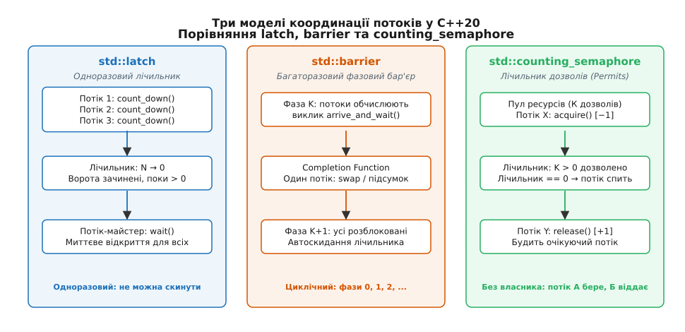
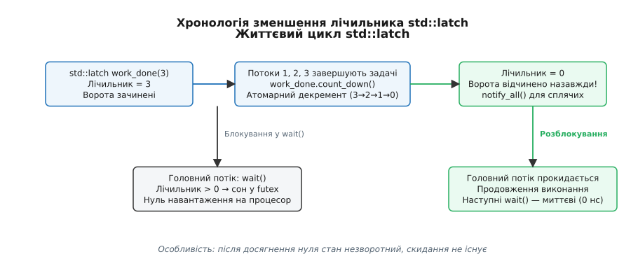
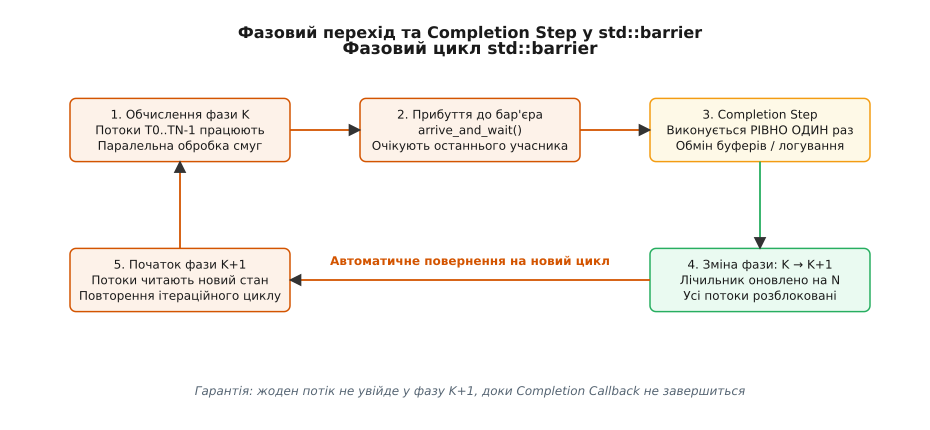
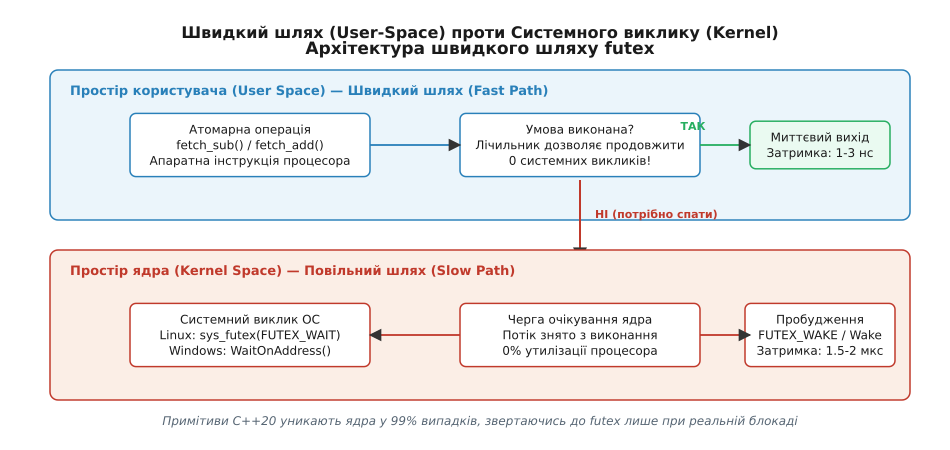

# latch, barrier і counting_semaphore: легковагова синхронізація без м'ютексів

<preknowlist>
- [М'ютекс і RAII-замки](book:cpp-standards/mutex-and-raii-locks) — як працює `std::mutex`, `std::unique_lock` і чому захоплення замка блокує конкуруючі потоки.
- [Умовна змінна](book:cpp-standards/condition-variable) — механізм сповіщення через `std::condition_variable`, атомарний перехід у сон та ціна системного виклику.
- [thread і jthread](book:cpp-standards/std-thread-jthread) — життєвий цикл потоків у C++, паралельне виконання та приєднання через `join()`.
- [Атомарність і гонки](book:programming/atomicity-races) — концепція атомарних операцій, стан гонки та синхронізація через модель пам'яті.
</preknowlist>

Уяви звуковий рушій реального часу або фізичний симулятор, де 16 потоків обробляють дискретні блоки аудіокадрів кожні 2.9 мілісекунди (128 семплів при частоті 44.1 кГц). Наприкінці кожного блоку всі 16 потоків мають відзвітувати про завершення своїх обчислень, дочекатися останнього учасника, виконати мікшування та одночасно рушити на наступний часовий крок. Якщо реалізувати цю синхронізацію класичним тандемом `std::mutex` та `std::condition_variable`, кожен потік змушений захоплювати м'ютекс лише для того, щоб зменшити спільний лічильник і викликати `notify_all()`. За високої частоти кадрів це створює жорстоку конкуренцію за спільну кеш-лінію м'ютекса (англ. *cache line ping-pong*), змушує ядра процесора виконувати сотні тисяч системних викликів на секунду та спричиняє перемикання контексту ядра (англ. *context switch*), кожне з яких забирає від 1.5 до 3 мікросекунд.

Спроба замінити м'ютекс на активне очікування атомарного прапорця у циклі `while (!ready.load());` ліквідує затримки перемикання контексту, але на 100% завантажує всі ядра процесора, викликає термальне гальмування (англ. *thermal throttling*) та марно витрачає енергію акумулятора. Програміст потрапляє у пастку між надмірною системною вагою класичних замків і руйнівною енерговитратністю безперервного опитування. Стандарт C++20 розв'язує цю дилему, вводячи у стандартну бібліотеку три легковагові примітиви координації потоків без м'ютексів: **одноразовий зворотний лічильник** (`std::latch`), **багаторазовий фазовий бар'єр** (`std::barrier`) та **семафори підрахунку** (`std::counting_semaphore`, `std::binary_semaphore`).

## Архітектурна межа м'ютекса та природа легкої координації

Класичний м'ютекс спроєктовано для однієї фундаментальної задачі: **взаємного виключення** (англ. *mutual exclusion*). Він гарантує, що лише один потік перебуває всередині критичної секції та володіє захищеними даними. Через це м'ютекс має чітку концепцію **власника** (англ. *ownership*): той самий потік, який захопив замок, зобов'язаний його відпустити.

Проте переважна більшість завдань паралельного програмування потребує не взаємного виключення, а **координації подій** (англ. *event coordination*):
1. **Зведення учасників (Rendezvous):** потік-майстер очікує, поки `N` фонових потоків завершать ініціалізацію підсистем.
2. **Фазовий крок (Phase Lock):** група з `N` обчислювальних потоків крокує паралельним циклом, синхронізуючись на межі кожної ітерації.
3. **Керування пропускною здатністю (Throttling / Pooling):** не більше `K` потоків мають одночасно звертатися до мережевого сокета чи пулу з'єднань бази даних.

Спроба виразити координацію через `std::mutex` + `std::condition_variable` накладає надлишковий системний податок. Об'єкт `std::condition_variable` вимагає обов'язкового зв'язування з `std::unique_lock<std::mutex>`, перевірки предиката у циклі `while` для захисту від хибних пробуджень (англ. *spurious wakeups*) та виділення від 80 до 128 байтів пам'яті операційної системи.


*Три моделі синхронізації C++20: одноразовий відлік (latch), циклічний фазовий бар'єр (barrier) та керування пулом дозволів без поняття власника (counting_semaphore).*

Примітиви C++20 позбавлені концепції володіння. Їхній внутрішній стан займає від 4 до 16 байтів (одне або два атомарних слова), вони не виділяють динамічної пам'яті у купі та виконують операції у просторі користувача без переходів у ядро операційної системи на швидкому шляху.

Для глибшого розуміння того, як ці примітиви еволюціонували від теоретичних семафорів 1960-х років та розширень POSIX Threads до єдиного стандарту C++20, звернися до вставки [📜 Еволюція примітивів синхронізації: від семафорів Дейкстри до C++20](book:cpp-standards/latch-barrier-semaphore/hist-sync-evolution.md).

## std::latch — одноразовий зворотний лічильник

Слово *latch* (англ. засув, клямка) описує дверний засув, який замкнений від початку, відкривається один раз при виконанні умови й залишається відкритим назавжди. У C++20 заголовок `<latch>` надає клас `std::latch` — синхронізаційний примітив зі зворотним відліком.

### Внутрішній стан та інваріанти

Об'єкт `std::latch` створюється зі стартовим значенням лічильника `ptrdiff_t expected`. Лічильник може лише зменшуватися або залишатися незмінним. Після того як лічильник досягає нуля, засув переходить у відкритий стан назавжди.

```cpp
#include <latch>

// Створюємо засув для синхронізації 4 потоків
std::latch init_gate(4);
```

Ключові операції над `std::latch`:
- `count_down(ptrdiff_t update = 1)` — атомарно зменшує лічильник на значення `update`. Якщо лічильник сягає нуля, розблоковує всі потоки, що очікують. Потік, який викликав `count_down()`, **не блокується** і негайно продовжує виконання.
- `wait()` — перевіряє стан лічильника. Якщо лічильник дорівнює нулю, негайно повертає керування (затримка 1–3 нс). Якщо лічильник більший за нуль, блокує викликаючий потік доти, доки лічильник не стане рівним нулю.
- `arrive_and_wait(ptrdiff_t update = 1)` — атомарна комбінована дія, еквівалентна виклику `count_down(update)` із наступним `wait()`.
- `try_wait() noexcept` — неблокуюча перевірка: повертає `true`, якщо лічильник уже досяг нуля, і `false`, якщо лічильник ще більший за нуль.


*Життєвий цикл `std::latch`: атомарний декремент лічильника від N до нуля з подальшим миттєвим звільненням усіх очікуючих потоків без можливості повторного скидання.*

### Правила та обмеження життєвого циклу

1. **Одноразовість (Single-use):** `std::latch` не має методів `reset()` чи `increment()`. Після відкриття його неможливо зачинити або використати повторно.
2. **Заборона від'ємних значень (Underflow UB):** виклик `count_down(update)` або `arrive_and_wait(update)` зі значенням `update`, що перевищує поточний залишок лічильника (`update > current_counter`), спричиняє **невизначену поведінку** (англ. *undefined behavior*).
3. **Коректність параметра:** значення `update` та початкового `expected` мають бути невід'ємними (`>= 0`) та не перевищувати значення `std::latch::max()`.

### Приклад: паралельне завантаження ресурсів гри

Розглянемо практичний шаблон, де головний потік рушія запускає 3 фонові потоки для зчитування текстур, звуків і геометрії рівня, після чого чекає готовності всіх підсистем.

:::tabs
```cpp
#include <iostream>
#include <latch>
#include <thread>
#include <vector>
#include <span>
#include <string_view>

void load_textures(std::latch& done) {
    // Симуляція зчитування текстур з SSD
    std::this_thread::sleep_for(std::chrono::milliseconds(80));
    std::cout << "[IO] Текстури завантажено\n";
    done.count_down(); // Декремент без блокування потоку
}

void load_audio(std::latch& done) {
    std::this_thread::sleep_for(std::chrono::milliseconds(40));
    std::cout << "[IO] Аудіобанки декодовано\n";
    done.count_down();
}

void load_geometry(std::latch& done) {
    std::this_thread::sleep_for(std::chrono::milliseconds(120));
    std::cout << "[IO] Геометрію рівнів побудовано\n";
    done.count_down();
}

int main() {
    constexpr ptrdiff_t total_tasks = 3;
    std::latch loading_latch(total_tasks);

    std::jthread t1(load_textures, std::ref(loading_latch));
    std::jthread t2(load_audio, std::ref(loading_latch));
    std::jthread t3(load_geometry, std::ref(loading_latch));

    std::cout << "[Main] Очікування завершення завантаження ресурсів...\n";
    loading_latch.wait(); // Блокується до досягнення нуля

    std::cout << "[Main] Усі підсистеми готові. Запуск ігрового циклу!\n";
    return 0;
}
```
```c
#include <stdio.h>
#include <pthread.h>
#include <unistd.h>

/* В аналогічній POSIX C реалізації доводиться створювати м'ютекс,
   умовну змінну та вручну контролювати цілочисельний лічильник */
typedef struct {
    pthread_mutex_t mtx;
    pthread_cond_t cv;
    int counter;
} posix_latch_t;

void posix_latch_init(posix_latch_t* l, int count) {
    pthread_mutex_init(&l->mtx, NULL);
    pthread_cond_init(&l->cv, NULL);
    l->counter = count;
}

void posix_latch_count_down(posix_latch_t* l) {
    pthread_mutex_lock(&l->mtx);
    l->counter--;
    if (l->counter == 0) {
        pthread_cond_broadcast(&l->cv);
    }
    pthread_mutex_unlock(&l->mtx);
}

void posix_latch_wait(posix_latch_t* l) {
    pthread_mutex_lock(&l->mtx);
    while (l->counter > 0) {
        pthread_cond_wait(&l->cv, &l->mtx);
    }
    pthread_mutex_unlock(&l->mtx);
}

void posix_latch_destroy(posix_latch_t* l) {
    pthread_mutex_destroy(&l->mtx);
    pthread_cond_destroy(&l->cv);
}
```
:::

У коді C++20 `std::latch` не потребує ручного керування замками чи очищення ресурсів у деструкторі, а за відсутності конкуренції не виконує системних викликів ядра.

> 🔧 **Навіщо це.** `std::latch` ідеально підходить для патерну «стартового пострілу» або «збору результатів». Якщо групі потоків потрібно одночасно стартувати бенчмарк після підготовки або головний потік чекає на `N` незалежних ініціалізацій, `std::latch` дає максимальну швидкість без зайвого синтаксичного шуму.

## std::barrier — багаторазовий фазовий бар'єр

Якщо обчислення повторюються циклічно (ітерація за ітерацією), одноразового `std::latch` недостатньо. Клас-шаблон `std::barrier` із заголовка `<barrier>` забезпечує багаторазову фазову синхронізацію фіксованої або динамічної групи потоків.

### Концепція фази та функція завершення (Completion Function)

Життя бар'єра складається з послідовності дискретних **фаз** (англ. *phases*): фаза 0, фаза 1, фаза 2 і так далі.

Кожна фаза бар'єра має очікувану кількість учасників (`expected count`). Коли потік доходить до межі фази, він викликає `arrive_and_wait()`. Внутрішній лічильник поточної фази атомарно декрементується. Потік зупиняється на бар'єрі, очікуючи решту учасників.

Коли **останній** потік викликає декремент і лічильник поточної фази досягає нуля, відбувається унікальний крок — **крок завершення фази** (англ. *Phase Completion Step*):
1. Усі потоки поточної фази заблоковані на бар'єрі.
2. Виконується користувацька **функція завершення** (`CompletionFunction`).
3. Після завершення цієї функції внутрішній лічильник очікуваних учасників автоматично скидається на базове значення `expected`.
4. Номер фази інкрементується.
5. Усі заблоковані потоки одночасно розблоковуються й переходять у наступну фазу.


*Фазовий перехід у `std::barrier`: накопичення потоків поточної фази, виконання єдиного Completion Callback та синхронний перехід усієї групи у наступну фазу.*

### Сигнатура шаблону та вимоги до CompletionFunction

Клас оголошено як:

```cpp
template<class CompletionFunction = /* реалізація за замовчуванням: порожня дія */>
class barrier;
```

Вимоги до функції завершення:
- Вона повинна задовольняти концепт `std::invocable<>`.
- Вона викликається **рівно один раз** на кожну фазу в контексті останнього потоку, що прибув до бар'єра.
- Вона **не повинна викидати винятків** (`noexcept`). Якщо виклик `CompletionFunction` генерує виняток, середовище виконання C++ негайно викликає `std::terminate()`.
- Усі операції запису в пам'ять, виконані потоками у фазі `K` до виклику `arrive()`, гарантовано видимі всередині `CompletionFunction`. Усі операції запису, виконані всередині `CompletionFunction`, гарантовано видимі всім потокам на початку фази `K + 1`.

### Розширені операції: arrive, wait, arrival_token та arrive_and_drop

`std::barrier` надає витончений контроль над участю потоків у фазах:

1. **Розділене прибуття (Split Arrival):**
   Потік може зафіксувати свою присутність у фазі через `arrival_token arrive(ptrdiff_t update = 1)`. Цей метод повертає непрозорий токен `arrival_token`, який представляє поточну фазу, і негайно повертає керування. Потік може виконати додаткову незалежну роботу, а згодом заблокуватися на виклику `wait(std::move(token))`.
2. **Динамічний вихід із групи (Dynamic Dropping):**
   Якщо один із потоків завершив свою роботу раніше за інших (наприклад, його сектор сітки зійшовся до потрібної точності), він викликає `arrive_and_drop()`. Цей метод декрементує лічильник поточної фази **і зменшує базову кількість учасників для всіх наступних фаз** на 1. Потік назавжди звільняється від бар'єра, а решта учасників продовжують ітерації без зависання.

Повний сигнатурний опис усіх конструкторів, методів та типів-членів наведено у вставці [📋 Повна довідка API примітивів синхронізації C++20](book:cpp-standards/latch-barrier-semaphore/api-sync-primitives.md).

### Приклад: паралельний ітераційний фільтр зображення

Розглянемо паралельне згладжування матриці пікселів (алгоритм Гаусса / розв'язання рівняння теплопровідності) з подвійною буферизацією (англ. *ping-pong buffers*):

:::tabs
```cpp
#include <iostream>
#include <barrier>
#include <vector>
#include <thread>
#include <span>
#include <numeric>

void run_simulation() {
    constexpr int num_threads = 4;
    constexpr int num_steps = 3;

    std::vector<float> buffer_a(1024, 1.0f);
    std::vector<float> buffer_b(1024, 0.0f);
    std::vector<float>* current_in = &buffer_a;
    std::vector<float>* current_out = &buffer_b;

    int current_step = 0;

    // Completion callback: викликається один раз у кінці кожної фази
    auto on_phase_complete = [&]() noexcept {
        std::swap(current_in, current_out);
        ++current_step;
        std::cout << "[Бар'єр] Фаза " << current_step << " завершена. Буфери обміняно.\n";
    };

    std::barrier sync_point(num_threads, on_phase_complete);
    std::vector<std::jthread> workers;
    workers.reserve(num_threads);

    for (int id = 0; id < num_threads; ++id) {
        workers.emplace_back([id, &sync_point, &current_in, &current_out, num_steps]() {
            for (int step = 0; step < num_steps; ++step) {
                // 1. Обчислювальна частина для потоку id
                const size_t chunk_size = 1024 / 4;
                const size_t start = id * chunk_size;
                const size_t end = start + chunk_size;

                for (size_t i = start; i < end; ++i) {
                    (*current_out)[i] = (*current_in)[i] * 0.95f;
                }

                // 2. Очікування решти потоків та виконання swap у callback
                sync_point.arrive_and_wait();
            }
        });
    }
}

int main() {
    run_simulation();
    return 0;
}
```
```c
#include <stdio.h>
#include <pthread.h>
#include <stdlib.h>

/* У стандартному C POSIX надає pthread_barrier_t,
   але він не має вбудованого completion callback */
#define NUM_THREADS 4
#define NUM_STEPS 3

pthread_barrier_t g_barrier;
float buffer_a[1024];
float buffer_b[1024];
float* current_in = buffer_a;
float* current_out = buffer_b;

void* worker(void* arg) {
    long id = (long)arg;
    size_t chunk_size = 1024 / NUM_THREADS;
    size_t start = id * chunk_size;
    size_t end = start + chunk_size;

    for (int step = 0; step < NUM_STEPS; ++step) {
        for (size_t i = start; i < end; ++i) {
            current_out[i] = current_in[i] * 0.95f;
        }

        // PTHREAD_BARRIER_SERIAL_THREAD повертається рівно одному потоку
        int rc = pthread_barrier_wait(&g_barrier);
        if (rc == PTHREAD_BARRIER_SERIAL_THREAD) {
            float* tmp = current_in;
            current_in = current_out;
            current_out = tmp;
            printf("[POSIX Barrier] Крок %d завершено.\n", step + 1);
        }
        // Потрібен ДРУГИЙ бар'єр, щоб інші потоки не почали
        // читати current_in ДО того, як серійний потік завершить swap!
    }
    return NULL;
}
```
:::

Уважно зверни увагу на пастку в коді POSIX C: оскільки `pthread_barrier_wait` розблоковує потоки паралельно з виконанням обміну буферів, у POSIX-коді без другого бар'єра виникає стан гонки (інші потоки можуть прочитати покажчик `current_in` до або під час його зміни єдиним потоком). Клас `std::barrier` у C++20 позбавлений цієї проблеми за побудовою: жоден потік не розблоковується доти, доки `CompletionFunction` повністю не завершить своє виконання.

Практичний приклад розгортання повноцінного симуляційного конвеєра на базі `std::barrier` дивись у вставці [⚙️ Практична реалізація: паралельний конвеєр симуляції сітки](book:cpp-standards/latch-barrier-semaphore/proj-parallel-pipeline.md).

## std::counting_semaphore та std::binary_semaphore

Заголовок `<semaphore>` надає примітиви для підрахунку та обмеження кількості спільних ресурсів.

### Математична модель семафора Дейкстри

Семафор (грец. *sema* — знак + *pherein* — нести) містить внутрішній невід'ємний лічильник **дозволів** (англ. *permits* / *tokens*).

- `acquire()` — атомарно намагається зменшити лічильник дозволів на 1. Якщо лічильник більший за нуль, декремент відбувається негайно, і потік продовжує рух. Якщо лічильник дорівнює нулю, потік блокується, доки інший потік не збільшить кількість дозволів.
- `release(ptrdiff_t update = 1)` — атомарно збільшує лічильник дозволів на `update`. Якщо на семафорі є заблоковані потоки, операційна система розблоковує до `update` потоків.
- `try_acquire()` — неблокуюча спроба захопити дозвіл. Повертає `true`, якщо дозвіл успішно декрементовано, або `false`, якщо лічильник був нульовим.
- `try_acquire_for(rel_time)` та `try_acquire_until(abs_time)` — спроби захоплення з таймаутом.

### counting_semaphore проти binary_semaphore

Стандарт визначає клас-шаблон:

```cpp
template<ptrdiff_t LeastMaxValue = /* залежить від платформи */>
class counting_semaphore {
public:
    static constexpr ptrdiff_t max() noexcept;
    explicit counting_semaphore(ptrdiff_t desired);
    ~counting_semaphore();

    void release(ptrdiff_t update = 1);
    void acquire();
    bool try_acquire() noexcept;
    template<class Rep, class Period>
    bool try_acquire_for(const std::chrono::duration<Rep, Period>& rel_time);
    template<class Clock, class Duration>
    bool try_acquire_until(const std::chrono::time_point<Clock, Duration>& abs_time);
};
```

Параметр шаблону `LeastMaxValue` вказує компілятору **гарантоване мінімальне максимальне значення** лічильника, яке має підтримувати реалізація. Це дозволяє компілятору оптимізувати внутрішній розмір атомарного типу: наприклад, якщо `LeastMaxValue == 1`, семафор можна розмістити в одному байті або 32-бітному слові.

Псевдонім `std::binary_semaphore` визначено як:

```cpp
using binary_semaphore = std::counting_semaphore<1>;
```

Він може набувати лише значень 0 або 1.

### Чому binary_semaphore — це НЕ м'ютекс

Початківці часто плутають двійковий семафор із м'ютексом, оскільки обидва дозволяють обмежити доступ до одиничного ресурсу. Проте їхня семантика принципово різна:

| Характеристика | `std::mutex` | `std::binary_semaphore` |
|---|---|---|
| **Володіння (Ownership)** | Має власника: потік X захопив, потік X мусить звільнити | **Немає власника**: потік X викликає `acquire()`, потік Y викликає `release()` |
| **Призначення** | Взаємне виключення (захист критичної секції) | Сигналізування між потоками (Event Signaling) |
| **Повторне захоплення** | Рекурсивне захоплення — UB (для звичайного `mutex`) | Багаторазовий `release()` збільшує лічильник до `max()` |
| **Сумісність з RAII** | Використовується з `std::lock_guard`, `std::unique_lock` | Застосовується як асинхронний передавач сигналів |

Спроба розблокувати `std::mutex` із чужого потоку є грубим порушенням стандарту й призводить до невизначеної поведінки (UB). Для `std::binary_semaphore` виклик `release()` з іншого потоку є його штатним і головним сценарієм використання.

### Приклад: пул обмеження мережевих з'єднань

Якщо сервер має 100 робочих потоків, але зовнішній API дозволяє не більше 4 одночасних з'єднань, `std::counting_semaphore` забезпечує елегантне регулювання пропускної здатності (англ. *rate limiting* / *concurrency throttling*):

:::tabs
```cpp
#include <iostream>
#include <semaphore>
#include <thread>
#include <vector>
#include <span>
#include <chrono>

class ConnectionPoolLimiter {
public:
    explicit ConnectionPoolLimiter(ptrdiff_t max_concurrent)
        : sem_(max_concurrent) {}

    void execute_transaction(int client_id) {
        // Захоплюємо 1 дозвіл із пулу (блокується, якщо всі 4 зайняті)
        sem_.acquire();

        // Критична секція обмеженого ресурсу
        std::cout << "[Клієнт " << client_id << "] Отримав з'єднання. Виконання запиту...\n";
        std::this_thread::sleep_for(std::chrono::milliseconds(50));
        std::cout << "[Клієнт " << client_id << "] Завершив роботу. Повернення з'єднання.\n";

        // Звільняємо дозвіл для наступного очікуючого клієнта
        sem_.release();
    }

private:
    std::counting_semaphore<16> sem_;
};

int main() {
    ConnectionPoolLimiter limiter(4); // Дозволено максимум 4 одночасні з'єднання
    std::vector<std::jthread> clients;
    clients.reserve(10);

    for (int i = 1; i <= 10; ++i) {
        clients.emplace_back([&limiter, i]() {
            limiter.execute_transaction(i);
        });
    }

    return 0;
}
```
```c
#include <stdio.h>
#include <pthread.h>
#include <semaphore.h>
#include <unistd.h>

/* У чистому C під POSIX використовується sem_t із <semaphore.h> */
sem_t g_posix_sem;

void* client_task(void* arg) {
    long id = (long)arg;
    
    // sem_wait() еквівалентний acquire()
    sem_wait(&g_posix_sem);
    
    printf("[POSIX Client %ld] Отримав з'єднання...\n", id);
    usleep(50000); // 50 мс
    printf("[POSIX Client %ld] Завершив роботу.\n", id);
    
    // sem_post() еквівалентний release()
    sem_post(&g_posix_sem);
    return NULL;
}
```
:::

## Апаратна реалізація, Futex та модель пам'яті

Чому примітиви C++20 настільки швидші за зв'язку `std::mutex` + `std::condition_variable`? Відповідь криється у способі їхньої трансляції на системні виклики ядра.

### Механізм Futex (Fast Userspace Mutex) та WaitOnAddress

На сучасних операційних системах (Linux, Windows, macOS) примітиви `<latch>`, `<barrier>` та `<semaphore>` реалізовано поверх системних черг адреси:
- **Linux:** системний виклик `sys_futex()` з прапорцями `FUTEX_WAIT_PRIVATE` та `FUTEX_WAKE_PRIVATE`.
- **Windows:** функції API `WaitOnAddress()`, `WakeByAddressSingle()`, `WakeByAddressAll()`.
- **macOS / iOS:** системні виклики `__ulock_wait()` та `__ulock_wake()`.
- **C++20 атомарні операції:** методи `std::atomic<T>::wait()`, `std::atomic<T>::notify_one()`, `std::atomic<T>::notify_all()`.


*Розділення на швидкий шлях у просторі користувача (атомарна зміна без системних викликів) та повільний шлях у ядрі операційної системи через черги futex.*

Робота примітива чітко розділяється на дві гілки:

1. **Швидкий шлях (Fast Path — простір користувача):**
   Коли потік викликає `count_down()`, `arrive()` або `release()`, процесор виконує одну атомарну інструкцію в пам'яті (наприклад, `LOCK XADD` або `LOCK CMPXCHG` на x86-64, чи цикл `LDREX`/`STREX` / `LDADDB` на ARM). Якщо очікування не потрібне або умова вже виконана, операція завершується за **1–3 наносекунди**. Перехід у простір ядра не виконується взагалі (0 системних викликів).
2. **Повільний шлях (Slow Path — простір ядра):**
   Лише якщо потік викликає `wait()` або `acquire()`, а лічильник вказує на необхідність блокади, потік викликає `futex(addr, FUTEX_WAIT, val)`. Ядро перевіряє, чи значення за адресою `addr` справді дорівнює `val`. Якщо так — планувальник ОС знімає потік із виконання та переводить його в стан глибокого сну (0% навантаження на процесор). Коли інший потік зменшує лічильник до нуля або звільняє дозвіл, він викликає `futex(addr, FUTEX_WAKE)`, і ядро повертає сплячий потік у чергу готовності планувальника.

### Гарантії впорядкування пам'яті (Memory Ordering)

Примітиви синхронізації C++20 забезпечують строгі гарантії відношення *synchronizes-with*:

1. **Для `std::latch`:**
   Усі виклики `count_down()` та `arrive_and_wait()` синхронізуються за моделлю `std::memory_order_release`. Успішне повернення з `wait()` чи `try_wait() == true` виконується за моделлю `std::memory_order_acquire`.
   *Наслідок:* усі модифікації пам'яті, зроблені будь-яким потоком до виклику `count_down()`, гарантовано видимі для будь-якого потоку після його виходу з `wait()`.
2. **Для `std::barrier`:**
   Виклики `arrive()` та `arrive_and_wait()` у фазі `K` синхронізуються з виконанням `CompletionFunction`. Завершення `CompletionFunction` синхронізується з розблокуванням усіх потоків на початку фази `K + 1`.
3. **Для `std::counting_semaphore`:**
   Виклик `release()` синхронізується з наступним успішним викликом `acquire()` (або `try_acquire() == true`), що спожив виділений дозвіл.

```
Потік А (Виробник):
  data = 42;                            // [1] Запис даних
  latch.count_down();                   // [2] Release-семантика

Потік Б (Споживач):
  latch.wait();                         // [3] Acquire-семантика
  assert(data == 42);                   // [4] Гарантовано бачить 42 без гонки даних!
```

## Матриця вибору інструменту та типові пастки

Щоб обрати правильний примітив для конкретної задачі, керуйся наступною інженерною матрицею:

| Інженерний сценарій | Рекомендований примітив | Чому не м'ютекс чи умовна змінна |
|---|---|---|
| **Одноразовий старт/фініш `N` потоків** | `std::latch` | Нуль накладних витрат, атомарний декремент, неможливо випадково скинути стан. |
| **Циклічні ітерації сітки / кадрів** | `std::barrier` | Вбудована безпечна функція завершення фази (swap буферів) без ризику гонки даних. |
| **Обмеження пулу ресурсів (`K` слотів)** | `std::counting_semaphore` | Природний облік дозволів, робота без власника. |
| **Асинхронний сигнал «один-до-одного»** | `std::binary_semaphore` | Не втрачає сигнал, якщо `release()` стався до виклику `acquire()`. |
| **Захист модифікації спільних структур даних** | `std::mutex` / `std::shared_mutex` | Семафори не гарантують взаємного виключення структури пам'яті під час запису. |

### Поширені помилки програмістів

1. **Переповнення знизу (Underflow) в `std::latch`:**
   Спроба викликати `count_down()` більше разів, ніж було вказано в конструкторі, є невизначеною поведінкою. Якщо в системі є динамічна кількість завдань, лічильник слід ініціалізувати точним числом або використовувати атомарну змінну.
2. **Викидання винятку з `CompletionFunction` у `std::barrier`:**
   Будь-який виняток всередині callback-функції фази негайно спричиняє аварійну зупинку процесу через `std::terminate()`. Усі операції всередині callback повинні бути загорнуті в блоки `try-catch` або позначені `noexcept`.
3. **Витік дозволів (Permit Leak) у семафорах:**
   Якщо потік захопив дозвіл через `sem.acquire()`, а потім завершився через виняток до виклику `sem.release()`, дозвіл втрачається назавжди. Для запобігання цьому рекомендується огортати виклики семафора у власні RAII-вартові (англ. *custom RAII semaphore guard*).
4. **Спроба використати `std::binary_semaphore` замість м'ютекса для захисту пам'яті:**
   Семафор не запобігає одночасному виклику `release()` кількома сторонніми потоками. Якщо лічильник помилково стане більшим за 1, кілька потоків одночасно зайдуть у критичну секцію, що спричинить стан гонки даних (англ. *data race*).

> 🔧 **Навіщо це.** Примітиви C++20 `<latch>`, `<barrier>` та `<semaphore>` закривають 90% типових шаблонів багатопотокової координації у високонавантажених системах, перетворюючи громіздкі багаторядкові конструкції на базі `std::mutex` і `std::condition_variable` на компактні, виразні та апаратно ефективні інструкції простору користувача.
