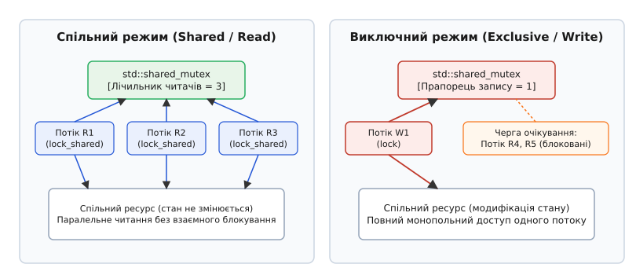
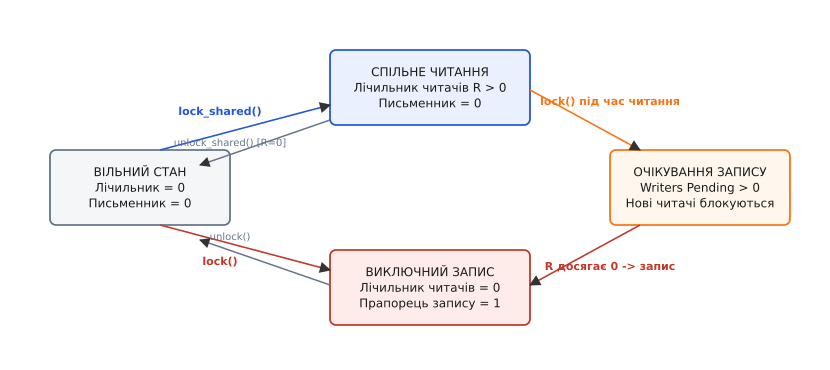
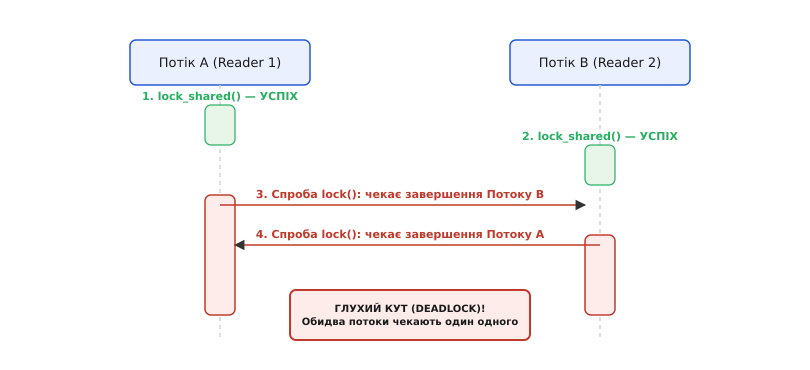

# shared_mutex: багато читачів, один письменник

<preknowlist>
- [М'ютекс і RAII-замки: lock_guard, unique_lock, scoped_lock](topic:cpp-standards/mutex-and-raii-locks) — взаємне виключення, концепція критичної секції та захоплення ресурсів під час ініціалізації.
- [Потоки у C++: std::thread і std::jthread](topic:cpp-standards/std-thread-jthread) — створення паралельних ниток виконання, виконання функцій та очікування завершення.
- [Умовна змінна: condition_variable](topic:cpp-standards/condition-variable) — очікування подій та координація потоків у паралельних алгоритмах.
- [Коректність за const](topic:cpp-standards/const-correctness) — константність методів об'єктів та використання ключевого слова mutable для м'ютексів.
</preknowlist>

Коли 32 процесорні ядра високопродуктивного сервера одночасно звертаються до таблиці маршрутизації мережевих пакетів або кешу сесій користувачів, 99% із них лише запитують наявні дані й жодне не змінює внутрішній стан пам'яті. Якщо захистити цю таблицю звичайним м'ютексом `std::mutex`, усі 32 ядра викуються у поодиноку чергу, зупиняючи виконання паралельних обчислень. Замість ефективного використання обчислювальної потужності багатоядерного процесора система витрачатиме дорогоцінний час на примусову серіалізацію читачів.

Причина цієї затримки полягає у надмірній строгості традиційного взаємного виключення. Звичайний м'ютекс не розрізняє намір потоку: для нього будь-який вхід у критичну секцію є однаково небезпечним. Проте з точки зору фізики обчислень та мовної моделі пам'яті C++ одночасне читання з тієї самої комірки пам'яті кількома ядрами є абсолютно безпечним — воно не здатне спричинити гонку даних (Data Race) або зіпсувати внутрішню структуру контейнера. Конфлікт виникає лише тоді, коли принаймні один потік виконує запис під час роботи інших.

Для вирішення цього фундаментального конфлікту між безпекою даних та пропускною здатністю паралельних систем було розроблено концепцію читацько-письменницького замка (Read-Write Lock), яка у мові C++ втілена у класі `std::shared_mutex`. [Історія появи читацько-письменницьких замків](topic:cpp-standards/shared-mutex/hist-shared-mutex.md) показує, як від теоретичних праць початку 1970-х років системне програмування прийшло до суворого мовного стандарту.

---

## 1. Вузол затримки взаємного виключення у багатоядерних системах

Щоб зрозуміти необхідність виділення окремого читацького блокування, варто простежити роботу звичайного м'ютекса `std::mutex` на рівні апаратури процесора.

У сучасних багатопроцесорних архітектурах кожне процесорне ядро володіє власними локальними кешами першого та другого рівнів (L1 та L2). Зв'язок між ядрами здійснюється через спільний кеш третього рівня (L3) та системну шину пам'яті за допомогою специфічних протоколів когерентності кешів (таких як MESI або MOESI).

Коли потік виконує метод `std::mutex::lock()`, процесор змушений виконати атомарну інструкцію зміщення або порівняння зі обміном (наприклад, `lock cmpxchg` на архітектурі x86-64 або `LDREX/STREX` на ARM64). Ця атомарна інструкція примусово захоплює системну шину пам'яті й переводить відповідну кеш-лінію з прапорцем м'ютекса у стан Modified (Модифіковано). У результаті кеш-лінія інвалідується в кешах усіх інших процесорних ядер.

Якщо програма виконує переважно читання (Read-Heavy Workload):
- Звичайний м'ютекс примусово зупиняє 31 ядро з 32, примушуючи їх чекати виходу поточного володаря з критичної секції.
- Процесорні конвеєри зупиняються (Pipeline Stall), а потоки переключаються у контексті ядра ОС (Context Switch), що вимагає тисяч тактів процесора на кожен виклик.
- Пам'ять не змінюється, проте процесорні кеші постійно скидаються через змагання за прапорець м'ютекса.

Отже, ексклюзивне взаємне виключення створює штучну вузьку шийку в архітектурі програми там, де фізичні обмеження апаратури дозволяють виконувати операції повністю паралельно.

---

## 2. Концептуальна модель роздільного блокування

Читацько-письменницький замок розділяє право доступу до критичної секції на два кардинально відмінні режими:
1. **Сумісний режим (Shared Mode / Reader)**: множинні потоки виконання можуть одночасно захоплювати замок для читання даних. Жоден читач не блокує інших читачів.
2. **Виключний режим (Exclusive Mode / Writer)**: рівно один потік володіє замком для запису чи модифікації даних. У цей час усі інші потоки (як читачі, так і письменники) блокуються й чекають у черзі.


*Спільний режим дозволяє багатьом потокам читати дані паралельно, тоді як виключний режим закриває доступ для всіх на час запису.*

### Інваріанти безпеки замка
Математично безпека роздільного замка описується двома суворими інваріантами стану:

1. **Сумісний інваріант (Shared Invariant)**:
   ```
   R >= 0  AND  W == 0
   ```
   У сумісному режимі кількість активних читачів `R` може бути більшою або рівною нулю, але кількість активних письменників `W` обов'язково дорівнює нулю.

2. **Монопольний інваріант (Exclusive Invariant)**:
   ```
   R == 0  AND  W == 1
   ```
   У монопольному режимі кількість активних читачів `R` мусить дорівнювати нулю, а кількість активних письменників `W` дорівнює точно одиниці.

Матриця сумісності режимів блокування демонструє сувору симетрію взаємодії потоків:

| Поточний стан м'ютекса | Запит на захоплення `lock_shared()` (Reader) | Запит на захоплення `lock()` (Writer) |
| :--- | :---: | :---: |
| **Вільний (Unlocked)** | Дозволено (Успіх) | Дозволено (Успіх) |
| **Захоплено для читання (Shared)** | Дозволено (Паралельне читання) | Заблоковано (Очікування) |
| **Захоплено для запису (Exclusive)** | Заблоковано (Очікування) | Заблоковано (Очікування) |

Ця матриця показує головну перевагу `std::shared_mutex`: при повній відсутності потоків запису читачі переходять у критичну секцію без зупинки виконання, виконуючи лише швидку атомарну операцію обліку в просторі користувача.

---

## 3. Внутрішній устрій та атомарна машина станів

Щоб зрозуміти, як `std::shared_mutex` досягає високої продуктивності, необхідно розглянути його внутрішню структуру на рівні атомарних операцій та системних викликів ядра.

На відміну від звичайного `std::mutex`, який у найпростішому випадку зберігає прапорець `0` або `1`, клас `std::shared_mutex` утримує у пам'яті 32-бітове атомарне ціле число, яке виконує роль автомата станів. Це число бітово розділено на три службові маски:

```
┌───────────────────────────┬───────────────────┬──────────────────────┐
│ Bit 31: Exclusive Flag    │ Bit 30: Pending   │ Bits 0–29: Reader    │
│ (1 = Захоплено на запис)  │ Writer Flag       │ Counter (0..1073M)   │
└───────────────────────────┴───────────────────┴──────────────────────┘
```

1. **Лічильник читачів (Bits 0–29)**: зберігає поточну кількість активних потоків, які виконали `lock_shared()` і перебувають у критичній секції читання.
2. **Прапорець очікування письменника (Bit 30)**: сигналізує про те, що в черзі з'явився принаймні один потік, який викликав `lock()` і чекає на завершення читачів.
3. **Прапорець монопольного запису (Bit 31)**: вказує, що один із потоків успішно захопив м'ютекс у монопольному режимі.


*Переходи між вільним станом, сумісним читанням та монопольним записом керуються атомарним лічильником та чергою очікування.*

### Шлях виконання читача (`lock_shared`)
Коли потік викликає метод `lock_shared()`, відбувається такий ланцюг дій:
1. Потік виконує атомарну операцію `fetch_add(1)` або інструкцію Compare-And-Swap (CAS) над 32-бітовим станом у пам'яті користувача.
2. Якщо старші біти (30 та 31) дорівнюють нулю (немає активного запису та немає очікуючих письменників), лічильник читачів збільшується на одиницю і потік **миттєво повертається** з функції. Виклику ядра операційної системи не відбувається зовсім!
3. Якщо ж прапорець запису встановлено, потік скасовує збільшення лічильника та виконує системний виклик ядра (Linux `sys_futex` з кодом `FUTEX_WAIT_PRIVATE` або Windows `SleepConditionVariableSRW`), переходячи у стан сплячки до розблокування.

### Шлях виконання читача при виході (`unlock_shared`)
Коли потік закінчує читання й викликає `unlock_shared()`:
1. Виконується атомарне зменшення лічильника читачів `fetch_sub(1)`.
2. Якщо новий стан лічильника стає рівним нулю і при цьому встановлено Bit 30 (є очікуючий письменник), потік виконує системний виклик розблокування `sys_futex(FUTEX_WAKE_PRIVATE)`.
3. Планувальник ядра Linux збуджує потік запису, передаючи йому монопольне право доступу.

### Шлях виконання письменника (`lock`)
Коли потік викликає метод `lock()`, ланцюг дій є монопольним:
1. Потік атомарно встановлює прапорець очікування запису (Bit 30), сигналізуючи всім наступним читачам про необхідність зупинки на вході.
2. Потім потік атомарно перевіряє лічильник читачів (Bits 0–29).
3. Якщо лічильник читачів дорівнює нулю, потік скидає прапорець очікування, встановлює прапорець запису (Bit 31) і входить у критичну секцію.
4. Якщо лічильник читачів більший за нуль, потік занурюється у сплячку ядра Linux `futex`. Останній читач, який виходитиме з критичної секції через `unlock_shared()`, побачить, що лічильник упав до нуля, і примусово розблокує письменника через системний виклик `FUTEX_WAKE`.

### Гарантії впорядкування пам'яті (Memory Barriers)
Операції захоплення та звільнення `std::shared_mutex` забезпечують сувору модель пам'яті C++ (§30.4.1.4):
- `lock_shared()` та `lock()` надають семантику **Acquire** (`std::memory_order_acquire`). Вони гарантують, що жодна інструкція читання або запису усередині критичної секції не може бути виконана спекулятивно до завершення блокування.
- `unlock_shared()` та `unlock()` надають семантику **Release** (`std::memory_order_release`). Вони гарантують, що всі модифікації пам'яті, зроблені усередині критичної секції, будуть скинуті в загальний кеш до зняття прапорця блокування.
- **Співвідношення синхронізації (Synchronizes-with)**: виклик `unlock_shared()` або `unlock()` у потоці A *синхронізується з* подальшим успішним викликом `lock()` або `lock_shared()` у потоці B. Усі записи у пам'ять, здійснені потоком A до виходу з розблокування, гарантовано стають видимими потокові B при вході.

---

## 4. Глибокий аналіз фазово-справедливого алгоритму (Phase-Fair RWLock)

Для виправлення класичної вади голодування письменників у бібліотеці `glibc` (починаючи з версії 2.25 у модулі `nptl/pthread_rwlock_common.c`) реалізовано фазово-справедливий алгоритм (Phase-Fair RWLock), розроблений Брендоном Бранденбургом та Джеймсом Андерсоном.

### Принцип роботи фаз
Алгоритм розбиває час роботи м'ютекса на чергувальні фази:
1. **Фаза читання (R-Phase)**: усі читачі, що прибули до моменту заходження письменника, об'єднуються у спільну групу й заходять у критичну секцію паралельно.
2. **Фаза запису (W-Phase)**: як тільки читачі R-фази завершують роботу, замок переходить у W-фазу, надаючи доступ першому письменнику з черги.
3. **Наступна фаза читання**: читачі, що прибули під час роботи W-фази, не чекають наступних письменників, а утворюють наступну R-фазу, яка виконується негайно після виходу поточного письменника.

### Математичний доказ обмеженого часу очікування
Нехай `τ_R` — максимальна тривалість критичної секції читання, а `τ_W` — максимальна тривалість критичної секції запису.
- Максимальний час очікування для будь-якого нового письменника обмежено величиною `O(τ_R)`: письменник чекає лише завершення поточних активних читачів.
- Максимальний час очікування для будь-якого нового читача обмежено величиною `O(τ_W)`: читач чекає лише завершення одного поточного письменника.

Це математично гарантує відсутність голодування для обидвох груп потоків навіть під гранично високим навантаженням.

---

## 5. Системний порівняльний аналіз реалізацій у різних ОС

Примітив `std::shared_mutex` є абстракцією мови C++, яка на кожній операційній системі спирається на найефективніші ядерні механізми.

### 5.1. Linux: NPTL futex та розширення futex2
У системному середовищі Linux реалізація у складі `libstdc++` (GCC) та `libc++` (LLVM) базується на розширенні NPTL (Native POSIX Thread Library):
- **Безконтенційний шлях**: обробляється повністю у просторі користувача за допомогою атомарних інструкцій CPU (`xadd` / `cmpxchg`) без переходу у ядро Linux.
- **Шлях контенції**: викликає системний виклик `sys_futex()`. Сучасні ядра Linux (версії 5.16+) впроваджують новий системний виклик `futex2` (`sys_futex_wait`, `sys_futex_wake`), який дозволяє працювати з м'ютексами різного розміру (8, 16, 32, 64 біти) та зменшує накладні витрати ядра на управління хеш-таблицею очікування.

### 5.2. Windows NT: SRWLOCK (Slim Reader/Writer Lock)
У середовищі Windows корпорація Microsoft надає системний примітив `SRWLOCK` у складі `ntdll.dll`:
- **Відсутність дескрипторів (Handle-less)**: на відміну від об'єктів `HANDLE` (Mutex, Semaphore, Event), примітив `SRWLOCK` займає рівно 8 байтів у пам'яті й не потребує закликів виділення системних ресурсів ядра.
- **Внутрішні виклики**: `RtlAcquireSRWLockShared`, `RtlReleaseSRWLockShared`, `RtlAcquireSRWLockExclusive`, `RtlReleaseSRWLockExclusive`.
- **Характеристика**: у разі виникнення контенції потік занурюється у сплячку за допомогою системного алгоритму `WaitOnAddress`, який оптимізовано під черги очікування у системному планувальнику Windows.

### 5.3. macOS та Darwin: Mach semaphores
В операційній системі macOS реалізація `std::shared_mutex` у бібліотеці `libc++` заснована на системних примітивах `ulock`:
- Виклики `ulock_wait` та `ulock_wake` забезпечують зв'язок із ядром XNU.
- Системний планувальник Darwin автоматично підвищує пріоритет (Priority Inheritance) потоків читання, щоб запобігти інверсії пріоритетів (Priority Inversion), коли високопріоритетний письменник чекає на низькопріоритетних читачів.

---

## 6. Простеження через sysfs, procfs та tracepoints ядра Linux

Для повноти розуміння роботи `std::shared_mutex` у реальних Linux-системах корисно простежити його поведінку через системні інтерфейси ядра.

### 6.1. Аналіз системних викликів futex у Linux
Коли примітив `std::shared_mutex` зустрічає контенцію (наприклад, потік читання намагається зайти під час виконання запису), утиліта `strace` або трасувальник `perf` фіксують системний виклик `futex`:

```bash
# Трасування системних викликів futex для нашого процесу
strace -e trace=futex ./my_application
```

Типовий лог системного виклику блокування читача:
```
futex(0x7ffe54a1b020, FUTEX_WAIT_PRIVATE, 1, NULL) = 0
```
- `0x7ffe54a1b020`: адреса 32-бітного атомарного цілого числа `std::shared_mutex` у просторі користувача.
- `FUTEX_WAIT_PRIVATE`: прапор виклику ядра, який занурює потік у сплячку, якщо значення за вказаною адресою все ще дорівнює `1` (контенція триває).
- `PRIVATE`: означає, що м'ютекс використовується у межах одного процесу (не міжпроцесний).

Коли потік запису завершує роботу й викликає `unlock()`, ядро реєструє розблокування:
```
futex(0x7ffe54a1b020, FUTEX_WAKE_PRIVATE, 2147483647) = 4
```
Значення `2147483647` (`INT_MAX`) розблоковує **усі** чекаючі потоки читання одночасно, дозволяючи їм миттєво відновити паралельне виконання на різних процесорних ядрах.

### 6.2. Спостереження через /proc та tracepoints
Під час перебування потоку у стані очікування блокування на `std::shared_mutex` інформація про нього відображається у файловій системі `/proc`:

1. **Файл `/proc/<pid>/status`**: стан потоку переходить у значення `State: S (sleeping)` або `D (disk sleep)`.
2. **Файл `/proc/<pid>/wchan`**: вказує точку зупинки у ядрі Linux — `futex_wait_queue_me`.
3. **Файл `/proc/<pid>/stack`**: показує повний трасувальний стек ядра:
   ```
   [<0>] futex_wait_queue_me+0xbb/0x120
   [<0>] futex_wait+0x15c/0x270
   [<0>] do_futex+0x135/0x190
   [<0>] __x64_sys_futex+0x12d/0x1c0
   ```

Використання eBPF-трасувальників (наприклад, `bpftrace`) дозволяє виміряти точний розподіл часу очікування `shared_mutex` на рівні ядра:
```bash
bpftrace -e 'tracepoint:syscalls:sys_enter_futex { @start[tid] = nsecs; } 
             tracepoint:syscalls:sys_exit_futex /@start[tid]/ { 
                 @duration = hist((nsecs - @start[tid]) / 1000); 
                 delete(@start[tid]); 
             }'
```
Цей скрипт будує гістограму затримок у мікросекундах, дозволяючи системному програмісту чітко бачити ціну блокувань під реальним навантаженням.

---

## 7. Взаємодія з системним планувальником процесів (CFS / EEVDF)

У сучасних ядрах Linux (починаючи з ядра 6.6) системний планувальник Елементарного Віртуального Дійсного Часу (EEVDF — Earliest Eligible Virtual Deadline First) керує розподілом процесорного часу між потоками, які змагаються за м'ютекси.

### 7.1. Проблема інверсії пріоритетів (Priority Inversion)
Розглянемо небезпечний сценарій:
1. Низькопріоритетний потік L захоплює `std::shared_mutex` у сумісному або монопольному режимі.
2. Високопріоритетний потік H намагається захопити м'ютекс у монопольному режимі й занурюється у сплячку ядра `futex`.
3. Середньопріоритетний потік M, який взагалі не використовує м'ютекс, витісняє потік L із процесорного ядра завдяки вищому пріоритету.
4. **Наслідок**: Високопріоритетний потік H чекає на потік M, хоча вони не мають спільних ресурсів.

Для вирішення цієї проблеми системна бібліотека `glibc` надає атрибути успадкування пріоритету (Priority Inheritance / PI futexes). Коли потік H зупиняється на замку, ядро Linux тимчасово підвищує пріоритет потоку L до рівня потоку H, дозволяючи йому швидко завершити критичну секцію й звільнити замок.

---

## 8. Асемблерний розбір інструкцій на x86-64 та ARM64

Розглянемо, у що саме компілюється виклик `lock_shared()` та `unlock_shared()` на двох пануючих процесорних архітектурах.

### 8.1. Архітектура x86-64 (GCC / Clang -O2)
На x86-64 операція швидкого захоплення читацького замка вироджується у невеликий фрагмент машинного коду:

```assembly
; Вхід: rdi = адреса std::shared_mutex
lock_shared_fastpath:
    mov         eax, 1
    lock xadd   dword ptr [rdi], eax    ; Атомарне додавання +1 до лічильника
    test        eax, 0xC0000000         ; Перевірка бітів 30 та 31 (Pending/Exclusive)
    jnz         .lock_shared_slowpath   ; Якщо є запис -> перехід на futex
    ret                                 ; Успіх, вихід за 3 такти!

.lock_shared_slowpath:
    ; Підготовка аргументів для sys_futex та перехід у ядро
    call        __glibc_shared_mutex_lock_slow
```

Операція `lock xadd` є атомарною на рівні кран-шини процесора. Якщо контенція відсутня, весь вхід у критичну секцію читання займає всього **3–5 тактів процесора**.

### 8.2. Архітектура ARM64 (ARMv8.1-A LSE)
На сучасних процесорах ARM64 (з підтримкою розширення Large System Extensions / LSE) виклик сумісного блокування використовує атомарні інструкції з вибірковим впорядкуванням пам'яті:

```assembly
; Вхід: x0 = адреса std::shared_mutex
lock_shared_arm64:
    mov         w1, #1
    ldaddal     w1, w2, [x0]            ; Атомарне додавання з семантикою Acquire/Release
    tst         w2, #0xC0000000         ; Перевірка прапорців запису
    b.ne        .L_slow_path
    ret

.L_slow_path:
    bl          __ltc_shared_mutex_wait
```

Інструкція `LDADDAL` сполучає атомарне додавання з фазою загородження пам'яті (Memory Barrier), виключаючи потребу у важкій системній інструкції `DMB ISH`.

---

## 9. C++14 та C++17: Архітектурне роздвоєння класів

Історія стандартизації C++ принесла важливе роздвоєння класів читацько-письменницьких замків.

У стандарті C++14 з'явився клас `std::shared_timed_mutex`. Він підтримував розширений інтерфейс з обмеженням часу очікування (`try_lock_for`, `try_lock_until`, `try_lock_shared_for`, `try_lock_shared_until`). Проте підтримка системних таймерів вимагала збереження додаткових полів (системних годинників та умовних змінних) усередині об'єкта м'ютекса. Це збільшувало розмір об'єкта у 2–3 рази й ускладнювало швидкодію.

У C++17 комітет прийняв рішення виділити легковажний клас `std::shared_mutex`:
- **Клас `std::shared_mutex` (C++17)**: не підтримує тайм-аути. На платформі Windows він є прямою обгорткою над вказівником `SRWLOCK` (розмір 8 байтів), а в Linux — над 32-бітним атомарним цілим числом `futex`. Він має мінімальні можливі накладні витрати.
- **Клас `std::shared_timed_mutex` (C++14)**: застосовується лише тоді, коли програма дійсно вимагає обмеження часу очікування блокування.

### RAII-обгортки: std::shared_lock проти std::unique_lock
Мова C++ забороняє викликати методи `lock_shared()` та `unlock_shared()` уручну, оскільки будь-який виняток усередині критичної секції призведе к витоку замка та вічному блокуванню програми.

Для керування життям читацького замка C++14 пропонує спеціалізовану RAII-обгортку `std::shared_lock<Mutex>`:

```cpp
#include <shared_mutex>
#include <iostream>

std::shared_mutex rw_mutex;
int shared_data = 42;

void reader_thread() {
    // RAII-захоплення сумісного замка (читання)
    std::shared_lock<std::shared_mutex> lock(rw_mutex);
    
    // Безпечна критична секція читання
    std::cout << "Data value: " << shared_data << "\n";
    
    // Деструктор lock автоматично викликає rw_mutex.unlock_shared()
}

void writer_thread(int new_value) {
    // RAII-захоплення монопольного замка (запис)
    std::unique_lock<std::shared_mutex> lock(rw_mutex);
    
    // Монопольна критична секція запису
    shared_data = new_value;
    
    // Деструктор lock автоматично викликає rw_mutex.unlock()
}
```

Об'єкт `std::shared_lock` підтримує семантику переміщення (Move Semantics), що дозволяє передавати захоплене читацьке блокування між функціями чи повертати його з методів фабрик. Копіювання об'єктів `std::shared_lock` заборонено на рівні компілятора.

### Патерн mutable у const-методах класів
У практичній розробці C++ об'єкт `std::shared_mutex` майже завжди оголошується з ключевим словом `mutable`:

```cpp
class DataRepository {
public:
    // const-метод логічно не змінює клас, але модифікує м'ютекс під час lock_shared()
    std::string fetch_data() const {
        std::shared_lock<std::shared_mutex> lock(mutex_); // Успішно компілюється завдяки mutable!
        return cached_data_;
    }

private:
    mutable std::shared_mutex mutex_; // mutable дозволяє lock_shared() у const-методах
    std::string cached_data_;
};
```
Слово `mutable` є обов'язковим, оскільки навіть сумісне блокування `lock_shared()` змінює фізичний стан лічильника усередині м'ютекса.

Детальний опис усіх методів та таблицю порівняння RAII-класів містить [інтерфейс класу std::shared_mutex та обгортки std::shared_lock](topic:cpp-standards/shared-mutex/api-shared-mutex.md).

---

## 10. Політики справедливості та загроза голодування

Під час проектирования паралельних систем із читацько-письменницькими замками виникає фундаментальна проблема черги: чий запит задовольняти першим, якщо в черзі одночасно є й читачі, й письменники?

Існує три базові політики розв'язання цього конфлікту:

1. **Перевага читачам (Reader-Preference)**: нові читачі переходять у критичну секцію негайно, навіть якщо в черзі чекає письменник.
   - *Перевага*: максимальний паралелізм читання.
   - *Вада*: **Загроза голодування письменника (Writer Starvation)**. Якщо потік читачів є безперервним (інтенсивність вхідних читань `λ_R` вища за швидкість їх обробки `1/τ_R`), лічильник читачів ніколи не впаде до нуля, і письменник чекатиме вічно.
2. **Перевага письменникам (Writer-Preference)**: як тільки письменник викликає `lock()`, усі наступні читачі блокуються на вході, поступаючись місцем письменникові.
   - *Перевага*: повністю усуває голодування запису, гарантуючи швидке оновлення даних.
   - *Вада*: знижує паралелізм читання під час частих операцій запису.
3. **Справедливе впорядкування (Fair / Phase-Fair / FIFO)**: потоки обробляються суворо в порядку їхнього приходу у вхідну чергу.

Стандарт C++ свідомо **не задає суворої політики пріоритету** для `std::shared_mutex`, залишаючи її реалізаційно-залежною (Implementation-Defined). Це зроблено для того, щоб мовний клас міг вільно відображатися на рідні примітиви конкретної операційної системи:
- На платформі Windows примітив `SRWLOCK` реалізує політику пріоритету письменників.
- У Linux реалізація `glibc` застосовує фазово-справедливий алгоритм (Phase-Fair RWLock), який почергово пропускає групи читачів і письменників, гарантуючи математично обмежений час очікування для обидвох сторін.

---

## 11. Пастки, відсутність підвищення замка та глухі кути

Більшість помилок при використанні `std::shared_mutex` пов'язані з хибними уявленнями розробників про можливості конвертації замків.

### Міф про «Підвищення блокування» (Lock Upgrade)
Багато програмістів очікують, що можна захопити замок у режимі читання (`std::shared_lock`), перевірити умову, а потім «підвищити» (upgrade) його до монопольного режиму (`std::unique_lock`) без втрати атомарності.

**У стандарті C++ клас `std::shared_mutex` НЕ ПІДТРИМУЄ операцію підвищення замка.** 

Спроба виконати підвищення через виклик `lock()` утримуючи `shared_lock` у тому самому потоці спричиняє **нездоланний глухий кут (Deadlock)**.


*Спроба двох потоків одночасно підвищити спільне блокування до виключного призводить до нездоланого взаємного блокування.*

Розглянемо механіку виникнення глухого кута на часовій діаграмі:
1. Потік A захоплює `shared_lock` (Успіх, лічильник = 1).
2. Потік B захоплює `shared_lock` (Успіх, лічильник = 2).
3. Потік A хоче зробити запис і викликає `lock()`. Він зупиняється й чекає, поки потік B вийде з читання.
4. Потік B також хоче зробити запис і викликає `lock()`. Він зупиняється й чекає, поки потік A вийде з читання.
5. **Результат**: Обидва потоки заблоковані навічно. Жоден із них не може віддати свій читацький замок, бо чекає на сусіда.

**Єдино правильне рішення**: повністю розблокувати сумісний замок (`shared_lock.unlock()`), після чого захопити монопольний замок (`unique_lock.lock()`) із **обов'язковою повторною перевіркою стану даних** (Double-Checked Pattern).

### Сценарії неозначеної поведінки (Undefined Behavior)
Паралельне програмування на C++ вимагає чіткого дотримання передумов методів:
1. **Звільнення чужого замка**: виклик `unlock_shared()` або `unlock()` з потоку, який наразі не володіє м'ютексом, викликає пошкодження внутрішнього атомарного стану й призводить к UB.
2. **Знищення заблокованого м'ютекса**: якщо об'єкт `std::shared_mutex` виходить із області видимості або знищується через `delete` під час утримання читачами, пам'ять ядра стає недійсною, спричиняючи падіння (Segmentation Fault) при наступних викликах розблокування.

### Апаратна фальшива контенція (False Sharing)
Якщо об'єкт `std::shared_mutex` розташований у пам'яті безпосередньо поруч із даними, які часто модифікуються іншими потоками (наприклад, у складі однієї 64-байтової кеш-лінії з атомарними лічильниками), виникає фальшива контенція (False Sharing).

Для запобігання інвалідації кешу рекомендується вирівнювати об'єкти м'ютекса за межею кеш-лінії:
```cpp
struct alignas(64) PaddedSharedMutex {
    std::shared_mutex mutex;
    // Падінг додається компілятором до розміру 64 байтів
};
```

---

## 12. Застосування у промислових фреймворках та проектних архітектурах

Клас `std::shared_mutex` є основою багатьох високоінтенсивних проектів у відкритому коді:

1. **Обробка AST у компіляторних фреймворках (LLVM / Clang)**: таблиці символів та кеші типів захищаються роздільними замками. Тисячі аналітичних фаз компіляції зчитають декларації типів паралельно, тоді як генерація нових спеціалізацій шаблонів періодично захоплює монопольний замок.
2. **Мережеві рушії (Boost.Asio / gRPC)**: таблиці активних сесій та SSL-сертифікатів зберігаються під `std::shared_mutex`. Читання сертифіката для кожного вхідного TLS-з'єднання відбувається без затримок у роздільному режимі.
3. **Графічні рушії та ECS (Entity Component System)**: ігрові системи обробки фізики та рендерингу виконують читання координат об'єктів у паралельних потоках під захистом `std::shared_lock`.
4. **Бази даних у пам'яті (RocksDB / Redis modules)**: метадані блокового кешу та словники індексів застосовують сумісні замки для паралельного виконання мільйонів точкових точкових запитів `GET` на секунду.

---

## 13. Парадигма RAII та безпека відносно винятків у критичних секціях

Найважливішою перевагою використання обгортки `std::shared_lock` над прямими викликами системних функцій є абсолютна гарантія вивільнення ресурсів при виникненні виняткових ситуацій.

У сучасних програмних комплексах виконання операцій усередині критичної секції (наприклад, форматування рядків, перевірка лімітів пам'яті чи звернення до елементів контейнера) може згенерувати виняток `std::bad_alloc` або `std::out_of_range`. Якщо синхронізація реалізована через сирі виклики `rw_mutex.lock_shared()` та `rw_mutex.unlock_shared()`, генерація винятку оминає рядок із розблокуванням. Замок залишається назавжди захопленим у пам'яті, що викликає повний затор усіх подальших потоків запису.

Застосування `std::shared_lock` гарантує, що під час згортання стеку (Stack Unwinding) деструктор об'єкта `shared_lock` буде автоматично викликаний середовищем виконання C++. Деструктор атомарно зменшує лічильник читачів і за потреби сповіщає чекаючих письменників. Це надає гарантію стійкості відносно винятків (Strong Exception Safety Guarantee) без потреби у важких конструкціях `try-catch`.

---

## 14. Порівняльна матриця примітивів синхронізації C++

Для допомоги системному розробникові у виборі оптимального інструменту нижче наведено порівняння всіх стандартних примітивів блокування мови C++:

| Примітив | Введена версія | Підтримувані режими | Можливість тайм-аутів | Основна ніша застосування |
| :--- | :---: | :--- | :---: | :--- |
| `std::mutex` | C++11 | Тільки монопольний | Ні | Прості критичні секції, рівний профіль 50/50 |
| `std::timed_mutex` | C++11 | Тільки монопольний | Так | Задачі реального часу з граничним часом |
| `std::recursive_mutex` | C++11 | Монопольний рекурсивний | Ні | Рекурсивні обходи структур даних |
| **`std::shared_mutex`** | **C++17** | **Сумісний + Монопольний** | **Ні** | **Read-Heavy workloads (>80% читання)** |
| `std::shared_timed_mutex` | C++14 | Сумісний + Монопольний | Так | Read-Heavy з обмеженням часу |
| `std::atomic_flag` | C++11 | Спінлок (Spinlock) | Ні | Ультракороткі секції в просторі користувача |

---

## 15. Порівняння реалізацій та практичне застосування

Нижче наведено порівняльний приклад використання сумісного блокування у C++17 та C (POSIX).

:::tabs
```cpp
#include <iostream>
#include <shared_mutex>
#include <thread>
#include <vector>
#include <unordered_map>

class ConfigurationManager {
public:
    // Потокобезпечне читання (Shared / Reader)
    std::string get_option(const std::string& key) const {
        std::shared_lock<std::shared_mutex> lock(mutex_);
        auto it = config_db_.find(key);
        return (it != config_db_.end()) ? it->second : "";
    }

    // Потокобезпечний запис (Exclusive / Writer)
    void set_option(const std::string& key, const std::string& value) {
        std::unique_lock<std::shared_mutex> lock(mutex_);
        config_db_[key] = value;
    }

private:
    mutable std::shared_mutex mutex_;
    std::unordered_map<std::string, std::string> config_db_;
};
```
```c
#include <pthread.h>
#include <stdio.h>
#include <string.h>

typedef struct {
    pthread_rwlock_t rwlock;
    char config_value[128];
} ConfigManager;

void config_init(ConfigManager* cfg) {
    pthread_rwlock_init(&cfg->rwlock, NULL);
    strcpy(cfg->config_value, "default_value");
}

void config_read(ConfigManager* cfg, char* out_val, size_t max_len) {
    pthread_rwlock_rdlock(&cfg->rwlock);
    strncpy(out_val, cfg->config_value, max_len - 1);
    out_val[max_len - 1] = '\0';
    pthread_rwlock_unlock(&cfg->rwlock);
}

void config_write(ConfigManager* cfg, const char* new_val) {
    pthread_rwlock_wrlock(&cfg->rwlock);
    strncpy(cfg->config_value, new_val, sizeof(cfg->config_value) - 1);
    pthread_rwlock_unlock(&cfg->rwlock);
}
:::

Повний приклад побудови промислового кешу з TTL та замірами продуктивності наведено у статті [практична реалізація потокобезпечного кешу даних](topic:cpp-standards/shared-mutex/proj-shared-cache.md).

У результаті застосування `std::shared_mutex` забезпечує максимальну пропускну здатність читання у багатоядерних програмах, підтримуючи гарантовану атомарність модифікації даних та захист від пошкодження пам'яті. Правильна розробка паралельних контейнерів на базі цього примітива дозволяє масштабувати програму на десятки обчислювальних ядер без створення штучних затримок у конвеєрі виконання.

---

## 16. Коли вживати std::shared_mutex: чек-лист інженера

Для остаточного вибору між `std::mutex` та `std::shared_mutex` застосовуйте суворий алгоритм оцінки:

1. **Частка операцій читання перевищує 80%?**
   - *Ні*: вживайте `std::mutex`. При співвідношенні читання/запису 50/50 клас `std::shared_mutex` працює повільніше через додаткові атомарні перевірки.
   - *Так*: переходьте до пункту 2.
2. **Тривалість критичної секції читання є достатньо великою?**
   - *Ні (читання одного int)*: накладні витрати на атомарний `fetch_add` знівелюють виграш. Вживайте `std::atomic<T>` або `std::mutex`.
   - *Так (обхід таблиць, парсинг JSON, копіювання векторів)*: застосовуйте `std::shared_mutex`.
3. **Кількість ядер вимірюється сотнями під надвисоким навантаженням?**
   - *Так*: розгляньте шардування (Sharded Mutex) або алгоритми без блокувань (RCU / Hazard Pointers).

Правильно підібраний примітив синхронізації гарантує баланс між швидкістю виконання та надійністю паралельного коду у сучасних високопродуктивних програмах.
