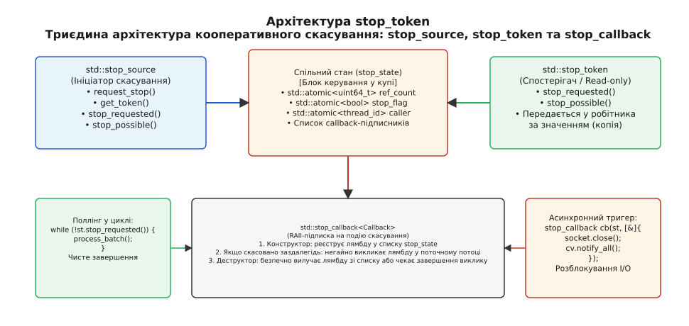
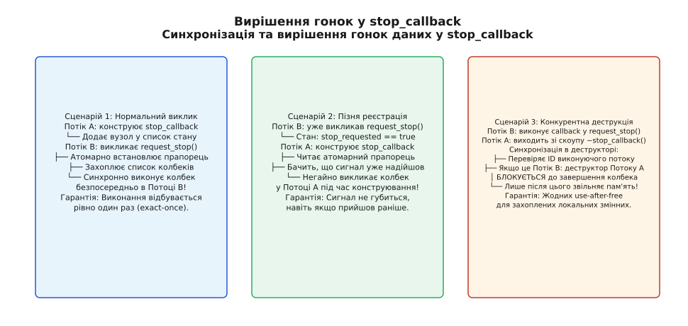
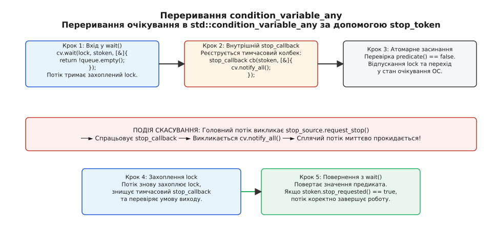

# std::stop_token: кооперативне скасування асинхронних операцій

<preknowlist>
- [thread і jthread](book:cpp-standards/concurrency/std-thread-jthread) — запуск системних потоків, життєвий цикл та автоматичне приєднання.
- [М'ютекс і RAII-замки](book:cpp-standards/concurrency/mutex-and-raii-locks) — синхронізація паралельного доступу через std::unique_lock.
- [Умовна змінна](book:cpp-standards/concurrency/condition-variable) — блокуюче очікування сигналів та стан предикатів.
</preknowlist>

Коли фоновий потік виконує тривалий числовий розрахунок, обробляє вхідний мережевий потік або спить в очікуванні повідомлення з черги, у системі неминуче виникає ситуація, коли результат цієї роботи стає непотрібним. Користувач закрив діалогове вікно, сплив встановлений мережевий таймаут, або паралельний потік уже знайшов шукану відповідь. Спроба примусово обірвати виконання такого потоку за допомогою системних викликів ядра операційної системи (як-от `pthread_cancel` у POSIX або `TerminateThread` у Win32) стає катастрофою для середовища виконання C++: внутрішні структури алокатора динамічної пам'яті залишаються розірваними, м'ютекси — назавжди замкненими в заблокованому стані, а локальні деструктори автоматичних об'єктів не викликаються взагалі, спричиняючи витік дескрипторів та пам'яті.

З іншого боку, наївна спроба вирішити проблему передаванням звичайного атомарного прапорця `std::atomic<bool>` стикається з непереборними обмеженнями. Якщо потік заблокований усередині системного виклику читання з сокета або спить на умовній змінній, він не виконує машинних інструкцій і фізично не здатний перевірити значення прапорця. Без можливості зареєструвати функцію зворотного виклику (callback), яка могла б розбудити сплячий потік або розірвати блокуючий дескриптор, атомарний прапорець залишає потік у вічному блокуванні.

Стандарт C++20 увів у заголовок `<stop_token>` уніфіковану, потокобезпечну та архітектурно збалансовану модель **кооперативного скасування** (англ. *cooperative cancellation*, від лат. *cooperari* — співпрацювати). Ця модель спирається на триєдиний поділ обов'язків між джерелом сигналу (`std::stop_source`), неволодіючим спостерігачем (`std::stop_token`) та підписником на подію (`std::stop_callback`), гарантуючи відсутність стану гонки (data race), детерміноване розгортання стека та мінімальні накладні витрати часу виконання.

---

## 1. Анатомія проблеми: чому скасування зобов'язане бути кооперативним

Щоб зрозуміти проектні рішення стандарту C++20, необхідно розглянути, чому десятиліття експериментів з іншими моделями переривання завершилися невдачею.

### Крах примусового вбивства потоків

Операційна система розглядає потік як послідовність машинних інструкцій та регістровий контекст процесора. Вона нічого не знає про високорівневі інваріанти мови програмування — таблиці віртуальних методів, ланцюжки деструкторів RAII (Resource Acquisition Is Initialization) або внутрішні блокування системних алокаторів `ptmalloc` чи `mimalloc`.

Якщо потік знищується зовні в довільний момент часу:
1. **Розірвані структури купи**: потік, який виконував оператор `new` або метод `std::vector::push_back`, може бути перерваний посеред модифікації двозв'язного списку вільних блоків пам'яті. Перша ж наступна спроба виділення пам'яті в будь-якому іншому потоці призводить до падіння процесу з помилкою сегментації (`SIGSEGV`).
2. **Вічні дедлоки**: якщо потік захопив `std::mutex` для захисту спільної структури даних і був примусово вбитий до виклику `unlock()`, м'ютекс залишається замкненим назавжди. Усі інші потоки, які намагатимуться отримати доступ до цього ресурсу, блокуються навічно.
3. **Витік зовнішніх ресурсів**: файлові дескриптори, мережеві сокети, дескриптори баз даних і відкриті графічні пайплайни залишаються відкритими, оскільки деструктори об'єктів-обгорток не викликаються.

Детальний аналіз історичного розвитку цих механізмів від стандарту POSIX 1995 року через бібліотеку Boost.Thread до сучасності наведено в історичній вставці [Еволюція скасування потоків](book:cpp-standards/concurrency/stop-token/hist-stop-token.md).

### Обмеження наївного опитування через std::atomic<bool>

Найпростіша альтернатива полягає у створенні булевого прапорця `std::atomic<bool> stop_flag{false}` та його періодичній перевірці в циклі робочого потоку:

```cpp
// Наївний підхід C++11
void worker(std::atomic<bool>& stop_flag) {
    while (!stop_flag.load(std::memory_order_relaxed)) {
        do_heavy_computation_step();
    }
}
```

Цей підхід працює лише для чистих обчислень, що не містять блокуючих операцій, і має суттєві архітектурні вади:
- **Неможливість переривання блокувань**: якщо потік викликає `condition_variable::wait()`, `std::this_thread::sleep_for()` або `recv()`, він не виконує перевірку `stop_flag`. Потік залишається заблокованим доти, доки не надійде робоче сповіщення або таймаут.
- **Розмивання часу життя (Lifetime Issues)**: викликач зобов'язаний гарантувати, що об'єкт `std::atomic<bool>` переживе робочий потік. Якщо викликач знищується раніше, потік отримує висяче посилання (dangling reference) і спричиняє невизначене поводження (Undefined Behavior).
- **Відсутність механізму композиції**: неможливо створити ієрархію скасувань, де зупинка головної задачі автоматично зупиняє дерево дочірніх підзадач без ручного прокидання десятків прапорців.

Кооперативне скасування стандарту C++20 усуває всі ці недоліки: потік сам перевіряє статус у безпечних точках свого алгоритму, а блокуючі примітиви інтегруються з механізмом зворотних викликів.

---

## 2. Триєдина архітектура C++20: розподіл обов'язків

Заголовок `<stop_token>` реалізує концептуальний патерн, у якому права на ініціацію зупинки, спостереження за станом та реакцію на подію розділені на три окремі типи:

1. **`std::stop_source` (Ініціатор)**: об'єкт, що володіє правом надіслати сигнал скасування за допомогою методу `request_stop()`. Джерело є володіючим власником спільного блоку керування.
2. **`std::stop_token` (Спостерігач)**: неволодіючий, легковажний об'єкт, призначений виключно для читання стану. Він надає методи `stop_requested()` та `stop_possible()`. Об'єкт копіюється з мінімальними накладними витратами і безпечно передається у функцію потоку за значенням.
3. **`std::stop_callback` (Підписник)**: шаблонний RAII-об'єкт, який реєструє користувацьку функцію зворотного виклику. Ця функція виконується автоматично та синхронно в момент надходження сигналу зупинки.


*Триєдина архітектура std::stop_token: розділення відповідальності між джерелом ініціації (stop_source), спостерігачем стану (stop_token) та обробником події (stop_callback) через спільний блок керування у купі.*

### Зв'язок через спільний блок керування (stop_state)

Усі три об'єкти взаємодіють через спільний стан `stop_state`, виділений у динамічній пам'яті (купі). Цей блок створюється автоматично при виклику конструктора `std::stop_source()` за замовчуванням:

```cpp
#include <iostream>
#include <stop_token>
#include <thread>

void worker(std::stop_token stoken) {
    while (!stoken.stop_requested()) {
        std::cout << "Потік працює...\n";
        std::this_thread::sleep_for(std::chrono::milliseconds(50));
    }
    std::cout << "Отримано сигнал скасування. Чистий вихід із потоку.\n";
}

int main() {
    std::stop_source ssource;
    std::stop_token stoken = ssource.get_token();

    std::jthread th(worker, stoken);

    std::this_thread::sleep_for(std::chrono::milliseconds(150));
    ssource.request_stop(); // Ініціація скасування

    th.join();
    return 0;
}
```

У цьому прикладі `std::stop_source` породжує `std::stop_token`, який передається у функцію `worker`. Головний потік володіє правом надіслати запит `request_stop()`, тоді як функція `worker` має доступ лише для читання через інтерфейс `stoken`.

---

## 3. Анатомія блоку керування (stop_state) та інваріанти пам'яті

Блок керування `stop_state` є внутрішньою структурою бібліотеки C++, яка координує роботу джерел, токенів і колбеків. Розглянемо його концептуальну будову та поля:

```
┌────────────────────────────────────────────────────────────────────────┐
│                        Shared Stop State                               │
├────────────────────────────────────────────────────────────────────────┤
│ • std::atomic<uint64_t> ref_counts (джерела + токени + колбеки)        │
│ • std::atomic<uint8_t>  state_flags (STOP_REQUESTED, LOCKED)           │
│ • std::atomic<std::thread::id> executing_thread_id                     │
│ • stop_callback_node*   callback_list_head                             │
└────────────────────────────────────────────────────────────────────────┘
```

### Складові елементи стану та їх інваріанти:

1. **Комбіновані лічильники посилань**: спільний стан відстежує кількість живих об'єктів `std::stop_source` окремо від загальної кількості посилань (`std::stop_token` + `std::stop_callback`). Це дозволяє реалізувати метод `stop_possible()`: якщо кількість активних джерел падає до нуля, а запит на зупинку так і не було надіслано, стан переходить у режим, коли зупинка стає неможливою (`stop_possible() == false`).
2. **Атомарний бітовий прапорець зупинки**: прапорець переходить зі стану `0` у стан `1` рівно один раз за весь життєвий цикл стану. Операція встановлення виконується за допомогою атомарної інструкції порівняння з обміном (CAS — Compare-And-Swap) або атомарного бітового запису.
3. **Список зворотних викликів**: двозв'язний або однозв'язний інваріантний список зареєстрованих об'єктів `std::stop_callback`.
4. **Ідентифікатор потоку-викликача (`executing_thread_id`)**: зберігає `std::thread::id` того системного потоку, який прямо зараз виконує зворотні виклики всередині `request_stop()`. Це поле є критично важливим для запобігання стану гонки під час конкурентного знищення об'єктів колбеків.

### Інваріант односпрямованого засува (One-way Latch)

Фундаментальним інженерним інваріантом стану скасування є його **необоротність**: якщо для даного `stop_state` прапорець перейшов у стан `stop_requested == true`, його **неможливо скинути назад** у стан `false`.

Ця вимога стандарту має глибоке теоретичне обґрунтування:
- **Усунення проблеми ABA**: якби прапорець міг скидатися, робочий потік міг би пропустити сигнал скасування, який було встановлено, опрацьовано частково та скинуто іншим компонентом.
- **Детермінізм підписок**: колбеки, які вже виконано, не потрібно реєструвати наново.
- **Простота міркувань**: якщо функція отримала сигнал зупинки, вона гарантовано рухається до завершення без ризику раптового відновлення задачі посеред процедури очищення ресурсів.

Якщо системі потрібно перезапустити операцію після скасування, створюється новий екземпляр `std::stop_source` із новим спільним станом у пам'яті.

### Внутрішня бітова маска та алгоритми без блокувань (Lock-free state transitions)

У сучасних реалізаціях стандартної бібліотеки (зокрема libc++ від LLVM та libstdc++ від GCC) блок керування `stop_state` оптимізовано таким чином, щоб мінімізувати використання важких м'ютексів операційної системи.

Атомарне 64-бітне слово стану `state_` розбивається на бітові поля:
- Біти `[0..30]`: кількість активних об'єктів `std::stop_source` (лічильник джерел).
- Біт `31`: прапорець `stop_requested` (чи надіслано сигнал скасування).
- Біт `32`: прапорець блокування списку колбеків `callback_list_locked` (використовується як ультрашвидкий спінлок або біт синхронізації при додаванні/видаленні вузлів).
- Біти `[33..63]`: загальна кількість посилань на стан від об'єктів `std::stop_token` та `std::stop_callback`.

Коли потік створює нову копію `std::stop_token`, бібліотека виконує один атомарний інкремент `state_.fetch_add(1ULL << 33, std::memory_order_relaxed)`. Коли знищується `std::stop_source`, лічильник джерел зменшується на одиницю. Якщо після декременту лічильник джерел став рівним нулю і прапорець `stop_requested` не встановлений, стан переходить у режим `stop_possible == false`.

### Оптимізація нульових витрат: std::nostopstate

Якщо архітектура програми вимагає інтерфейсу, що приймає `std::stop_source` або `std::stop_token`, але конкретна операція гарантовано ніколи не потребуватиме скасування, стандарт C++20 надає спеціальний теговий тип `std::nostopstate_t` та константу `std::nostopstate`:

```cpp
// Створення джерела без виділення пам'яті в купі
std::stop_source inactive_source(std::nostopstate);

std::stop_token empty_token = inactive_source.get_token();
// empty_token.stop_possible() == false
// empty_token.stop_requested() == false
```

Конструктор з `std::nostopstate` ініціалізує внутрішній вказівник значенням `nullptr`. Це повністю усуває динамічне виділення пам'яті в купі, зберігаючи повну сумісність за типами.

Вичерпний опис усіх конструкторів, методів та гарантій `noexcept` наведено в довіднику [Довідник API stop_token](book:cpp-standards/concurrency/stop-token/api-stop-token.md).

---

## 4. Модель пам'яті: упорядкування та синхронізація

Ключова перевага стандартизованого механізму скасування над саморобними рішеннями полягає у чітко визначених гарантіях синхронізації моделі пам'яті C++ (Memory Model).

### Гарантії Acquire-Release

Стандарт вимагає, щоб операції над станом скасування підпорядковувалися таким правилам упорядкування:
- Виклик `stop_source::request_stop()` виконує атомарну модифікацію з семантикою `std::memory_order_release` (або `std::memory_order_acq_rel`).
- Виклик `stop_token::stop_requested()` виконує атомарне читання з семантикою `std::memory_order_acquire`.
- Реєстрація `std::stop_callback` синхронізується з викликом `request_stop()`.

```
Ініціатор (Потік 1):
    payload_data = 42;                             // (1) Запис корисних даних
    ssource.request_stop();                        // (2) Memory Order Release
                                                          │
                                                          ▼ (Synchronizes-With)
                                                          │
Робітник (Потік 2):                                       │
    if (stoken.stop_requested()) {                 // (3) Memory Order Acquire
        std::cout << payload_data;                 // (4) Гарантовано читає 42 без Data Race!
    }
```

Завдяки встановленню відношення *synchronizes-with* між дією (2) та дією (3), усі операції запису в пам'ять, здійснені Потоком 1 до виклику `request_stop()`, стають гарантовано видимими для Потоку 2 після того, як той прочитає `stop_requested() == true` (відношення *happens-before*).

Компілятор не має права переставляти інструкції читання пам'яті або кешувати значення прапорця зупинки в регістрах CPU, що усуває потребу в ручному застосуванні бар'єрів пам'яті (`std::atomic_thread_fence`).

### Апаратна когерентність кешів і протокол MESI

На апаратному рівні сучасних процесорів (x86_64, ARM64, RISC-V) атомарний прапорець `stop_state` розміщується в одному рядку кеш-пам'яті (Cache Line, розміром 64 байти).

Протягом нормальної роботи програми, коли десятки робочих потоків періодично опитують `stoken.stop_requested()`, рядок кешу зі станом перебуває в режимі **Shared (S)** у локальних кешах L1/L2 кожного процесорного ядра за протоколом MESI/MOESI. Читання виконується миттєво з кешу L1 без виходу на загальну шину та без генерації міжядерного трафіку.

Коли ініціатор викликає `request_stop()`:
1. Ядро процесора виконує атомарну інструкцію запису (наприклад, `LOCK BTS` або `LDREX/STREX`), переводячи стан кеш-рядка в **Modified (M)**.
2. Процесор розсилає широкомовне повідомлення інвалідації (Invalidate Queue) усім іншим ядрам.
3. Усі інші ядра інвалідують свій локальний кеш-рядок (перехід у стан **Invalid (I)**) і при наступному виклику `stop_requested()` вичитують оновлений стан безпосередньо з кешу L3 або спільної когерентної шини.

Час поширення сигналу скасування між ядрами сучасного багатоядерного процесора становить лічені десятки наносекунд (зазвичай від 15 до 45 нс залежно від топології NUMA), забезпечуючи майже миттєву реакцію системи на подію скасування.

---

## 5. Механізм std::stop_callback: синхронізація та вирішення гонок

Клас `std::stop_callback` є шаблонним класом, параметризованим типом функції або лямбди: `template<class Callback> class stop_callback;`.

Головне призначення колбека — перетворити пасивний сигнал скасування на активну дію: пробудити умовну змінну, закрити сокет, перервати очікування на дескрипторі або скинути буфер.


*Гарантії синхронізації в std::stop_callback: уникнення стану гонки між паралельним виконанням колбека та знищенням локальних змінних у деструкторі.*

Розглянемо три фундаментальні сценарії взаємодії та гонок даних, які детерміновано вирішуються реалізацією `std::stop_callback`:

### Сценарій 1: Нормальна попередня реєстрація

Потік А створює об'єкт `std::stop_callback`. Оскільки сигнал скасування ще не надійшов, конструктор захоплює внутрішній замок списку колбеків і додає новий вузол у двозв'язний список стану.

Коли пізніше Потік Б викликає `request_stop()`:
1. Потік Б атомарно встановлює прапорець `stop_requested`.
2. Потік Б захоплює список колбеків.
3. Потік Б записує свій `std::this_thread::get_id()` у поле `executing_thread_id`.
4. Потік Б **послідовно та синхронно** викликає всі зареєстровані функції прямо у своєму власному контексті.

Гарантія стандарту: кожен зареєстрований колбек виконується рівно один раз (exact-once execution).

### Сценарій 2: Запізніла реєстрація (Late Registration)

Потік Б уже викликав `request_stop()`, тому в спільному стані встановлено `stop_requested == true`. Після цього Потік А намагається створити об'єкт `std::stop_callback`.

Конструктор `std::stop_callback` читає стан прапорця. Бачачи, що запит на зупинку вже зафіксовано:
1. Конструктор **не додає** вузол у список.
2. Конструктор **негайно викликає передану функцію прямо в Потоці А під час конструювання**!

Це виключає фундаментальну пастку втрати сигналу (lost wake-up): незалежно від того, коли саме надійшов сигнал скасування — до чи після створення об'єкта підписки — функція зворотного виклику гарантовано виконається.

### Сценарій 3: Конкурентна деструкція та блокування

Найбільш підступний стан гонки виникає тоді, коли Потік Б прямо зараз виконує колбек усередині `request_stop()`, а Потік А у цей самий момент виходить з області видимості, де було створено об'єкт `std::stop_callback`, і викликає деструктор `~stop_callback()`.

Якби деструктор негайно звільнив пам'ять, посилання на локальні змінні Потоку А, захоплені лямбдою, стали б висячими, спричинивши використання пам'яті після звільнення (use-after-free).

Стандарт C++20 формулює залізний інваріант деструктора:
- Якщо колбек виконується в іншому потоці (Потік Б), деструктор у Потоці А **блокується і чекає повного завершення виконання функції колбека**!
- Якщо деструктор викликається тим самим потоком, який виконує колбек (рекурсивний виклик), деструктор не блокується, запобігаючи самодедлоку.

Завдяки цьому правилу об'єкти `std::stop_callback` є абсолютно безпечними для розміщення на локальному стеку функцій.

---

## 6. Інтеграція з std::jthread: безпечне володіння потоком

Класичний клас `std::thread` зі стандарту C++11 мав критичний архітектурний недолік: якщо об'єкт `std::thread` знищувався у своєму деструкторі, залишаючись у стані, придатному для приєднання (`joinable() == true`), середовище виконання негайно викликало `std::terminate()`, аварійно вбиваючи весь процес.

Клас `std::jthread` (від англ. *Joining Thread* — приєднуваний потік) у C++20 виправляє цю проблему за допомогою автоматичної інтеграції з `std::stop_source`:

```cpp
class jthread {
public:
    // Конструктор створює внутрішній stop_source
    template<class Function, class... Args>
    explicit jthread(Function&& f, Args&&... args);

    // Деструктор: автоматичне скасування та приєднання
    ~jthread() {
        if (joinable()) {
            request_stop(); // 1. Надсилає сигнал скасування
            join();         // 2. Очікує завершення потоку
        }
    }

    [[nodiscard]] stop_source get_stop_source() noexcept;
    [[nodiscard]] stop_token get_stop_token() const noexcept;
    bool request_stop() noexcept;
};
```

### Порівняння моделей життєвого циклу потоків

| Характеристика | `std::thread` (C++11) | `std::jthread` (C++20) | `std::async` (C++11) |
| :--- | :--- | :--- | :--- |
| Поведінка в деструкторі | `std::terminate()` якщо joinable | `request_stop() + join()` | Блокуючий `get()` у деструкторі `future` |
| Вбудоване джерело скасування | Відсутнє (потрібен ручний atomic) | Вбудований `std::stop_source` | Відсутнє |
| Передавання токена у функцію | Неможливе автоматично | Автоматичне (перший аргумент) | Неможливе |
| Безпека винятків (RAII) | Низька (потрібні обгортки) | Абсолютна | Середня (неочевидне блокування) |

### Автоматичне передавання stop_token у робочу функцію

Якщо перший параметр функції або лямбди, що передається в конструктор `std::jthread`, має тип `std::stop_token`, бібліотека автоматично витягує токен із внутрішнього джерела `jthread` і передає його в потік:

```cpp
#include <iostream>
#include <stop_token>
#include <thread>

void background_worker(std::stop_token stoken, int multiplier) {
    int counter = 0;
    while (!stoken.stop_requested()) {
        std::cout << "Обчислення: " << (counter++ * multiplier) << "\n";
        std::this_thread::sleep_for(std::chrono::milliseconds(40));
    }
    std::cout << "Фоновий потік завершився за сигналом stop_token.\n";
}

void run_task() {
    // jthread автоматично передає stop_token у background_worker
    std::jthread worker_thread(background_worker, 10);

    std::this_thread::sleep_for(std::chrono::milliseconds(100));
    // При виході з run_task() деструктор worker_thread:
    // 1. Автоматично викликає request_stop()
    // 2. Автоматично викликає join()
} // Жодних падінь через std::terminate(), ресурси звільняються чисто!
```

---

## 7. Переривання блокуючих операцій: std::condition_variable_any

Стандартна умовна змінна `std::condition_variable` не підтримує роботу з `std::stop_token`, оскільки вона жорстко оптимізована для роботи виключно з `std::unique_lock<std::mutex>` на рівні нативних системних примітивів (наприклад, `pthread_cond_t`).

Для кооперативного скасування блокуючих очікувань C++20 розширив узагальнений клас `std::condition_variable_any`. Він працює з будь-якими базовими блокуваннями (включаючи `std::shared_lock`, рекурсивні замки та користувацькі спінлоки) і містить перевантаження методів очікування з підтримкою `std::stop_token`.


*Механіка переривання блокуючого стану умовного очікування: реєстрація тимчасового stop_callback для сповіщення condition_variable_any при надходженні сигналу скасування.*

### Механіка методу wait(lock, stoken, predicate)

Метод `wait` виконує такі скоординовані кроки:

```cpp
template <class Lock, class Predicate>
bool wait(Lock& lock, std::stop_token stoken, Predicate pred) {
    while (!pred()) {
        if (stoken.stop_requested()) {
            return pred(); // Якщо скасовано — негайно повертаємо стан предиката
        }

        // Реєструємо тимчасовий колбек на час сну
        std::stop_callback cb(stoken, [this] {
            notify_all(); // Сповіщаємо умовну змінну при надходженні сигналу
        });

        // Відпускаємо замок та переходимо в стан сну в ядрі ОС
        wait_internal(lock);
    }
    return true;
}
```

Якщо інший потік викликає `request_stop()`, зареєстрований `stop_callback` негайно виконує `notify_all()`. Сплячий потік прокидається, знову захоплює `lock`, перевіряє `stoken.stop_requested() == true` і виходить з очікування, повертаючи `false` (якщо черга або предикат не були задоволені).

### Патерн перериваного сну (Interruptible Sleep)

У традиційному коді C++11, якщо фоновому потоку потрібно періодично виконувати дію (наприклад, надсилати heartbeat раз на 10 секунд), виклик `std::this_thread::sleep_for(10s)` робить потік нечутливим до сигналу завершення застосунку на всі 10 секунд.

За допомогою `std::condition_variable_any` та `std::stop_token` цей патерн перетворюється на миттєво перериваний сон:

```cpp
#include <chrono>
#include <condition_variable>
#include <mutex>
#include <stop_token>

class PeriodicWorker {
public:
    void run(std::stop_token stoken) {
        std::unique_lock lock(mutex_);
        while (!stoken.stop_requested()) {
            perform_heartbeat_sync();

            // Спимо 10 секунд АБО прокидаємося негайно, якщо викликано request_stop()
            cv_.wait_for(lock, stoken, std::chrono::seconds(10), [&stoken] {
                return stoken.stop_requested();
            });
        }
    }

private:
    void perform_heartbeat_sync() { /* відправка телеметрії */ }

    std::mutex mutex_;
    std::condition_variable_any cv_;
};
```

Цей підхід дозволяє застосунку вимикатися за мілісекунди замість очікування завершення довгих таймаутів у фонових потоках.

### Переривання системних сокетів та асинхронного введення-виведення (io_uring / IOCP)

Аналогічний підхід застосовується для переривання блокуючих системних викликів введення-виведення (I/O). Оскільки дескриптори сокетів блокуються всередині ядра операційної системи, об'єкт `std::stop_callback` може виконати системне закриття каналу передачі або надіслати команду скасування в асинхронне кільце введення-виведення:

```cpp
#include <stop_token>
#include <iostream>

#if defined(_WIN32)
#include <winsock2.h>
#else
#include <sys/socket.h>
#endif

void read_from_network(int socket_fd, std::stop_token stoken) {
    // Реєструємо зворотний виклик для розриву блокуючого системного виклику
    std::stop_callback socket_canceller(stoken, [socket_fd] {
        std::cout << "Примусове розблокування сокета...\n";
#if defined(_WIN32)
        ::shutdown(static_cast<SOCKET>(socket_fd), SD_BOTH);
#else
        ::shutdown(socket_fd, SHUT_RDWR);
#endif
    });

    char buffer[1024];
    // Якщо приходить request_stop(), shutdown() змушує recv() негайно повернути помилку
    auto bytes = ::recv(socket_fd, buffer, sizeof(buffer), 0);
    if (bytes <= 0 && stoken.stop_requested()) {
        std::cout << "Читання з сокета успішно перервано сигналом скасування.\n";
    }
}
```

У сучасних асинхронних архітектурах на базі Linux `io_uring` або Windows `IOCP` (I/O Completion Ports) об'єкт `std::stop_callback` у момент спрацьовування готує спеціальний запит скасування операції — `io_uring_prep_cancel` або `CancelIoEx`. Ядро операційної системи перериває асинхронну операцію DMA та повертає статус `ECANCELED` безпосередньо у кільце завершень.

Повний практичний приклад побудови промислового тристадійного конвеєра потокової обробки з використанням черг на базі `std::condition_variable_any` та каскадного скасування стадій наведено у практичній вставці [Практичний конвеєр скасування](book:cpp-standards/concurrency/stop-token/proj-cancellation-pipeline.md).

---

## 8. Каскадне та ієрархічне скасування у складних системах

У великих архітектурах завдання часто утворюють ієрархічні дерева: коренева задача (Root Task) породжує кілька підзадач (Subtasks), кожна з яких запускає власні робочі потоки або мережеві запити.

У такій системі необхідно підтримувати два вектори керування:
1. **Зверху вниз (Top-Down)**: якщо користувач скасовує кореневу задачу, сигнал скасування повинен миттєво поширитися на всі дочірні підзадачі.
2. **Знизу вгору або локально (Local Cancellation)**: якщо одна з дочірніх підзадач падає з локальною помилкою (наприклад, таймаут одного HTTP-запиту), вона може скасувати себе, не ламаючи виконання сусідніх підзадач.

Для реалізації цієї моделі використовується патерн **транслятора джерел**:

```cpp
#include <functional>
#include <stop_token>

class HierarchicalTask {
public:
    explicit HierarchicalTask(std::stop_token parent_token)
        : parent_token_(parent_token),
          // Зв'язуємо батьківський токен із локальним джерелом:
          // якщо батьківський токен скасовується, ми автоматично скасовуємо локальне джерело
          parent_subscription_(parent_token_, [this] {
              local_source_.request_stop();
          }) {}

    // Локальне скасування лише цієї гілки
    void cancel_locally() {
        local_source_.request_stop();
    }

    [[nodiscard]] std::stop_token token() const noexcept {
        return local_source_.get_token();
    }

private:
    std::stop_token parent_token_;
    std::stop_source local_source_;
    std::stop_callback<std::function<void()>> parent_subscription_;
};
```

Ця архітектура утворює орієнтований ациклічний граф скасування: зміна стану батьківського джерела миттєво каскадує вниз по дереву завдяки синхронним викликам зареєстрованих `std::stop_callback`, не створюючи додаткових фонових потоків спостереження.

---

## 9. Композиція кількох джерел скасування: StopTokenCombiner

У практичних архітектурах часто виникає зворотна задача: об'єднати кілька незалежних джерел сигналів у єдиний результуючий `std::stop_token`. Наприклад, операція повинна бути перервана, якщо:
1. Користувач натиснув кнопку «Скасувати» в графічному інтерфейсі (UI Token).
2. Сплив абсолютний таймаут запиту (Timeout Token).
3. Батьківський робочий пул завершує роботу під час вимкнення сервера (Server Shutdown Token).

У стандарті C++20 немає вбудованого класу для об'єднання токенів, проте його легко реалізувати за допомогою `std::stop_callback`:

```cpp
#include <functional>
#include <stop_token>
#include <vector>

class StopTokenCombiner {
public:
    StopTokenCombiner() = default;

    // Додавання зовнішнього токена до композиції
    void add_token(std::stop_token stoken) {
        if (!stoken.stop_possible()) {
            return;
        }

        // Якщо токен уже скасовано — негайно активуємо наше джерело
        if (stoken.stop_requested()) {
            combined_source_.request_stop();
            return;
        }

        // Реєструємо підписку: скасування будь-якого вхідного токена
        // автоматично активує спільне вихідне джерело
        callbacks_.emplace_back(std::make_unique<std::stop_callback<std::function<void()>>>(
            stoken, 
            [this] { combined_source_.request_stop(); }
        ));
    }

    [[nodiscard]] std::stop_token get_token() const noexcept {
        return combined_source_.get_token();
    }

private:
    std::stop_source combined_source_;
    std::vector<std::unique_ptr<std::stop_callback<std::function<void()>>>> callbacks_;
};
```

Цей патерн є абсолютно потокобезпечним: незалежно від того, з якого потоку надійде перший сигнал скасування, спільне джерело `combined_source_` перейде у стан `stop_requested == true` рівно один раз, активуючи всіх підписників результуючого комбінованого токена.

---

## 10. Простеження, налагодження та системні виклики ядра

Під час налагодження високонавантажених багатопотокових систем інженерам необхідно чітко розуміти, як операції `std::stop_token` відображаються на системні виклики операційної системи та як їх відстежувати в діагностичних інструментах.

### Простеження через Linux eBPF, perf та futex

На платформі Linux умовні очікування в `std::condition_variable_any` транслюються в системний виклик `futex` (Fast Userspace Mutex):

```
# Трасування викликів futex за допомогою perf
perf trace -e futex -- ./my_async_service
```

Під час нормальної роботи робочий потік переходить у стан очікування через:
`futex(uaddr, FUTEX_WAIT_PRIVATE, val, timeout)`

Коли інший потік викликає `request_stop()`, функція зворотного виклику `std::stop_callback` виконує сповіщення `notify_all()`, що транслюється ядром Linux у:
`futex(uaddr, FUTEX_WAKE_PRIVATE, INT_MAX)`

Ядро операційної системи переводить усі сплячі нитки черги планувальника зі стану `TASK_INTERRUPTIBLE` у стан `TASK_RUNNING`.

### Налагодження в GDB та LLDB

Під час зупинки процесу в налагоджувачі GDB стан об'єктів `std::stop_token` та `std::stop_source` можна досліджувати безпосередньо через дамп внутрішнього вказівника на `stop_state`:

```gdb
(gdb) print stoken
$1 = {
  _M_state = std::shared_ptr<std::_Stop_state_t> (use count 3, weak count 0) = {
    _M_ptr = 0x55555556b2c0
  }
}
(gdb) print stoken._M_state->_M_ptr->_M_stop_requested
$2 = {<std::__atomic_base<bool>> = {static _S_alignment = 1, _M_i = true}, <No data fields>}
```

Це дозволяє миттєво визначити, чи надійшов сигнал скасування в заблоковану підсистему, скільки підписників зареєстровано в списку колбеків та який саме потік виконує обробку сигналу в даний момент.

---

## 11. Вартість, накладні витрати та типові пастки

### Накладні витрати пам'яті та тактової частоти

Механізм `std::stop_token` проектувався за фундаментальним принципом C++: «ти не платиш за те, чим не користуєшся»:

| Компонент | Розмір на 64-бітній системі | Динамічна пам'ять (Купа) | Такти CPU на перевірку |
| :--- | :--- | :--- | :--- |
| `std::stop_token` | 8 байтів (1 вказівник) | 0 байтів | 1–4 такти (`MOV` з кешу L1) |
| `std::stop_source` | 8 байтів (1 вказівник) | 1 алокація `stop_state` (≈64 байти) | 0 (лише при створенні) |
| `std::stop_callback` | 32–48 байтів (вузол списку + стан) | 0 байтів (живе на стеку) | 0 (реєстрація під замком) |

На архітектурах x86 та x86_64 операція `stoken.stop_requested()` компілюється в одну атомарну інструкцію завантаження `mov eax, dword ptr [rdi]`. Завдяки сильній апаратній моделі пам'яті TSO вона не потребує інструкцій блокування шини (`LOCK`) або бар'єрів пам'яті (`MFENCE`), тому може викликатися мільйони разів на секунду без падіння пропускної здатності обчислень.

---

### Каталог типових інженерних пасток

#### Пастка 1: Дедлок усередині std::stop_callback через захоплення м'ютекса
Оскільки зворотні виклики виконуються *синхронно* в контексті того потоку, який викликав `request_stop()`, спроба захопити в колбеку м'ютекс, який викликач уже утримує, призводить до взаємного блокування (self-deadlock):

```cpp
// ❌ ПОМИЛКА: Самодедлок
std::mutex state_mutex;

void bad_worker(std::stop_token st) {
    std::stop_callback cb(st, [&] {
        std::lock_guard lock(state_mutex); // ДЕДЛОК, якщо викликач request_stop() уже захопив state_mutex!
        cleanup();
    });

    std::lock_guard lock(state_mutex);
    // Робота з даними...
}
```

*Правило*: колбеки повинні виконувати лише мінімальні, неблокуючі атомарні дії (встановлення прапорців, системний виклик `shutdown` або `notify_all`).

#### Пастка 2: Винятки всередині функцій зворотного виклику
Якщо функція всередині `std::stop_callback` генерує виняток, який виходить за її межі, середовище виконання C++ негайно викликає `std::terminate()`. Механізм скасування не призначений для транспортування винятків. Будь-які потенційні помилки всередині колбека мають оброблятися локально через `try { ... } catch (...)`.

#### Пастка 3: Забута перевірка у важких вкладених циклах
Якщо потік виконує вкладений цикл матричного множення або обробки зображення розміром 4096×4096, перевірка `stop_requested()` лише в зовнішньому циклі призводить до неприпустимо великої затримки реакції (latency). Перевірку слід розміщувати у внутрішньому циклі або виконувати її пакетами (наприклад, кожні 1024 ітерації).

---

## 12. Майбутнє асинхронності: std::stop_token у стандарті C++26 та P2300

Модель кооперативного скасування `<stop_token>`, започаткована в C++20, виявилася настільки вдалою та універсальною, що комітет WG21 обрав її як єдиний фундамент для майбутньої стандартної моделі асинхронного виконання **P2300: std::execution (Senders/Receivers)**.

У моделі P2300 асинхронні операції компонуються в неперервні графи обчислень. Кожен приймач результату (Receiver) отримує від свого оточення (Environment) доступ до токена скасування через виклик `std::execution::get_stop_token(std::execution::get_env(receiver))`.

Коли операція `std::execution::when_all` або `std::execution::race` виявляє, що одна з паралельних гілок обчислення завершилася раніше за інші, вона автоматично надсилає сигнал `request_stop()` усім іншим активним гілкам. Завдяки стандартному протоколу `std::stop_token` усі асинхронні операції, таймери, системні виклики та фонові обчислення чисто згортаються без витоку ресурсів та без використання дорогих винятків.

---

## 13. Інженерні підсумки

1. **Кооперативність проти примусового вбивства**: скасування в C++ є виключно кооперативним. Потік сам контролює точки виходу зі свого алгоритму, забезпечуючи цілісність пам'яті купи та коректне виконання деструкторів RAII.
2. **Розподіл ролей**: тріада `std::stop_source` (право зупиняти), `std::stop_token` (право спостерігати) та `std::stop_callback` (право реагувати) забезпечує чисту архітектуру з чітким розмежуванням прав доступу між компонентами системи.
3. **Повна синхронізація без витоків**: модель пам'яті C++ гарантує відношення Acquire-Release між джерелом і спостерігачем, а деструктор `std::stop_callback` автоматично блокується у разі конкурентного виконання колбека, усуваючи будь-яку можливість виникнення стану гонки чи висячих посилань.
4. **Стандарт нового покоління**: зв'язка `std::jthread`, `std::condition_variable_any` та `<stop_token>` закрила тридцятирічну прогалину в стандартній бібліотеці C++, ставши фундаментом для сучасних паралельних конвеєрів, асинхронних корутин та майбутньої моделі виконання P2300 (std::execution).
