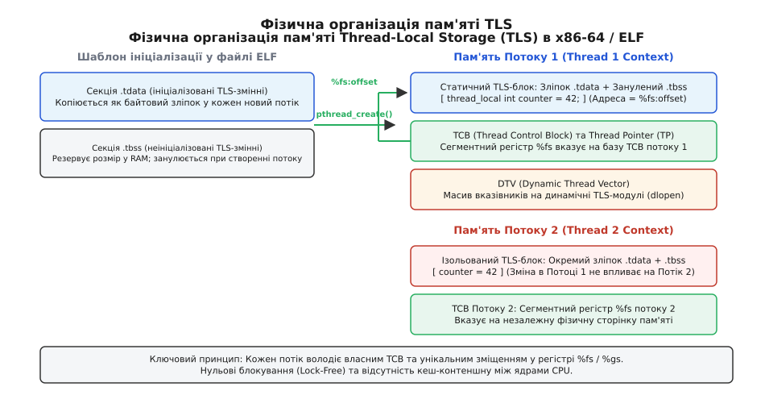
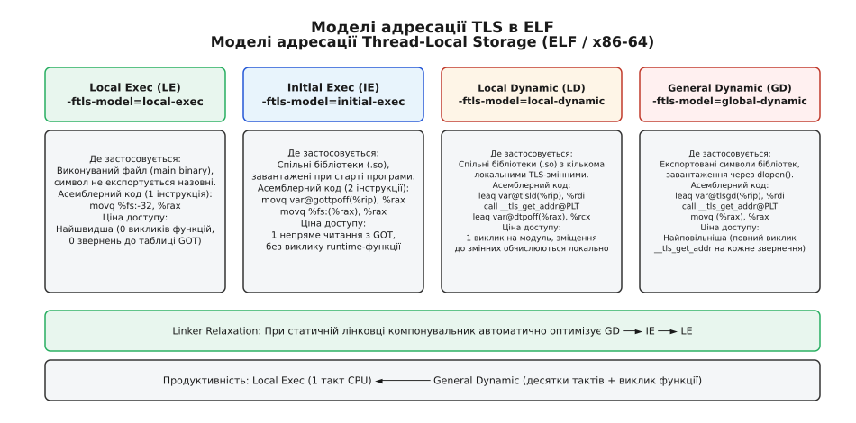
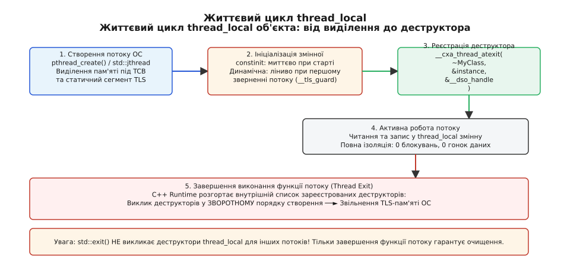

# thread_local: стан, приватний для потоку

<preknowlist>
- [thread і jthread: запуск, приєднання, скасування](book:cpp-standards/std-thread-jthread) — створення системних потоків, незалежні стеки та функція потоку.
- [М'ютекс і RAII-замки](book:cpp-standards/mutex-and-raii-locks) — синхронізація доступу до спільних даних та ціна міжядерного кеш-контеншну.
- [constinit](book:cpp-standards/constinit) — гарантія константної ініціалізації об'єктів під час компіляції.
- [object-lifetime](book:cpp-standards/object-lifetime) — життєвий цикл об'єктів, порядок виклику конструкторів і деструкторів.
</preknowlist>

Коли шістдесят чотири робочі потоки на серверному процесорі одночасно оновлюють спільну глобальну змінну лічильника або звертаються до спільного генератора випадкових чисел, пропускна здатність програми падає у десятки разів. Захист глобального об'єкта за допомогою `std::mutex` змушує ядра CPU безперервно блокуватися в очікуванні критичної секції та передавати керування планувальнику операційної системи через системні виклики `futex`. Перехід на атомарні операції `std::atomic` із протоколом когерентності кешів MESI усуває блокування операційної системи, проте спричиняє постійну інвалідацію кеш-ліній (Cache Line Bouncing): інструкція `LOCK XADD` змушує шину міжядерного зв'язку монопольно передавати кеш-лінію між L1/L2-кешами різних процесорних ядер, збільшуючи затримку кожного запису з 1 наносекунди до 60–100 наносекунд.

Спроба розв'язати проблему передачею покажчика на локальний контекст через аргументи кожної функції руйнує модульність архітектури, забруднює сигнатури бібліотечних функцій і унеможливлює інтеграцію зі сторонніми інтерфейсами зворотного виклику (callbacks), які не передбачають передачі користувацького параметра `void*`. Для забезпечення повної ізоляції даних кожного окремого потоку виконання без накладних витрат на синхронізацію стандарт C++11 ввів специфікатор тривалості зберігання `thread_local` (Thread-Local Storage — TLS).

Цей механізм гарантує, що кожен потік процесу володіє власним, фізично відокремленим екземпляром змінної. Час життя такого об'єкта неподільно прив'язаний до життєвого циклу потоку, що його породив: пам'ять виділяється під час створення нитки виконання, ініціалізується при першому зверненні або старті, а деструктори автоматично викликаються в момент виходу з функції потоку.

Для глибокого розуміння того, як індустрія перейшла від повільних динамічних ключів `pthread_getspecific` та макросів `errno` до апаратно підтримуваного специфікатора, звернися до вставки [📜 Еволюція локальної пам'яті потоку: від ручних ключів до thread_local](book:cpp-standards/thread-local/hist-tls-evolution.md).

---

## Семантика специфікатора thread_local у системі типів C++

Специфікатор `thread_local` визначає **тривалість зберігання потоку** (thread storage duration) і може комбінуватися зі специфікаторами видимості та зв'язування `static` або `extern`. На відміну від автоматичних змінних на стеку чи глобальних змінних у спільній статичній пам'яті процесу, кожна `thread_local` змінна існує у стількох незалежних екземплярах, скільки активних потоків виконує даний процес.

```cpp
#include <iostream>
#include <thread>
#include <string>

// 1. Глобальна thread_local змінна із зовнішнім зв'язуванням (External Linkage)
thread_local int per_thread_counter = 0;

// 2. Статична змінна рівня одиниці трансляції (Internal Linkage)
static thread_local std::string per_thread_tag = "unnamed";

void worker(int thread_id) {
    // 3. Блочна thread_local змінна: неявно static, ініціалізується ліниво
    thread_local int invocation_count = 0;

    per_thread_counter += 10;
    per_thread_tag = "worker-" + std::to_string(thread_id);
    invocation_count++;

    std::cout << "Thread " << thread_id 
              << ": counter=" << per_thread_counter 
              << ", tag=" << per_thread_tag 
              << ", invocations=" << invocation_count 
              << ", address=" << &per_thread_counter << '\n';
}

int main() {
    std::jthread t1(worker, 1);
    std::jthread t2(worker, 2);
    t1.join();
    t2.join();
    worker(0); // Виконання в головному потоці
}
```

У наведеному фрагменті кожен із трьох потоків (два створених через `std::jthread` та головний потік `main`) модифікує виключно власні екземпляри `per_thread_counter`, `per_thread_tag` та `invocation_count`. Жодних станів гонитви (data races) не виникає, операції не потребують м'ютексів, а виведення виразів `&per_thread_counter` демонструє унікальні адреси віртуальної пам'яті для кожного потоку.

### Правила зв'язування та області видимості

Мова C++ визначає чіткі інваріанти розміщення `thread_local` оголошень:

1. **Глобальний простір імен та простори імен**: Змінна `thread_local T x;` має тривалість зберігання потоку та зовнішнє зв'язування. Доступ до екземпляра поточного потоку з іншої одиниці трансляції можливий через `extern thread_local T x;`. Оголошення `static thread_local T y;` обмежує видимість символу межами поточного файлу `.cpp`.
2. **Блочна область видимості (всередині функцій)**: Оголошення `thread_local T z;` всередині тіла функції автоматично має статичну тривалість прив'язки (неявно вважається `static thread_local`). Змінна не знищується при виході з функції, а зберігає стан між послідовними викликами, виконаними *тим самим* потоком.
3. **Члени класів та структур**: Специфікатор `thread_local` дозволений виключно для `static`-членів класу (`static thread_local T member;`). Нестатичні поля об'єкта не можуть бути `thread_local`, оскільки екземпляр класу сам по собі розміщується на купі або в стековому кадрі конкретного виклику.
4. **Заголовкові файли та C++17 `inline`**: Оголошення `inline thread_local T shared_config;` у файлі `.hpp` дозволяє уникнути порушень правила одного визначення (One Definition Rule — ODR). Компонувальник об'єднує всі екземпляри опису в єдиний логічний символ для кожного окремого потоку.
5. **C++20 `constinit thread_local`**: Специфікатор `constinit` вимагає, щоб об'єкт був повністю ініціалізований під час компіляції константним виразом. Це запобігає прихованій генерації рантайм-обгорток і гарантує розміщення змінної в бінарному шаблоні пам'яті без потреби перевірки прапорців ініціалізації. Оголошення `constexpr thread_local` є синтаксично некоректним, оскільки `constexpr` вимагає створення константи часу компіляції для всього процесу, тоді як `constinit` гарантує константну початкову ініціалізацію для кожної змінюваної копії потоку.

Повний зведений опис синтаксичних форм, модифікаторів пам'яті, таблиць зв'язування та заборонених компілятором комбінацій наведено у [📋 Довіднику інтерфейсів та моделей TLS](book:cpp-standards/thread-local/api-tls-models.md).

### Ідентичність адрес та передача покажчиків між потоками

Вираз взяття адреси `&x` для `thread_local` змінної повертає звичайний покажчик на об'єкт `T*`, що вказує на блок пам'яті поточного потоку. Цей покажчик можна передавати в інші функції, записувати в структури та передавати іншим потокам через канали обміну повідомленнями або атомарні змінні.

Поки потік-власник активний, інші потоки можуть безпечно читати та записувати дані за цим покажчиком (за умови використання належної синхронізації або атомарних операцій). Проте щойно потік-власник завершує своє виконання і виходить із системної функції потоку, вся його пам'ять TLS вивільняється, а об'єкти знищуються. Будь-який покажчик на `thread_local` змінну цього потоку, збережений в інших нитках, миттєво стає висячим покажчиком (dangling pointer). Звернення до такої адреси є невизначеною поведінкою (Undefined Behavior), що призводить до пошкодження пам'яті або аварійного завершення процесу сигналом `SIGSEGV`.

---

## Низькорівневий фундамент TLS: секції ELF, TCB та сегментні регістри

Для досягнення максимальної швидкості апаратний процесор не може звертатися до ядра операційної системи під час кожного читання `thread_local` змінної. Механізм TLS побудований на спільній взаємодії формату бінарних файлів ELF (Executable and Linkable Format), динамічного завантажувача ОС та апаратної сегментації процесора.


*Фізична організація пам'яті Thread-Local Storage (TLS): TCB, сегментний регістр FS та незалежні копії .tdata/.tbss для кожного потоку.*

### Бінарні секції .tdata та .tbss

Під час компіляції та компонування програми всі змінні з тривалістю зберігання `thread_local` групуються у спеціальні секції всередині бінарного образу:

1. **`.tdata` (TLS Initialized Data)**: Містить початкові ненульові значення змінних. Це точний байтовий зліпок даних, який зберігається у файлі на диску та відображається в пам'ять процесу з атрибутом сегмента `PT_TLS`.
2. **`.tbss` (TLS Block Started by Symbol)**: Описує змінні, ініціалізовані нулями або значеннями за замовчуванням. Секція не займає фізичного місця у бінарному файлі на диску, але її розмір враховується при виділенні пам'яті під час запуску потоку.

Коли ядро ОС або бібліотека потоків (наприклад, NPTL у `glibc`) створює новий потік через системний виклик `clone(CLONE_VM | CLONE_FS | CLONE_FILES | CLONE_SIGHAND | CLONE_THREAD, ...)`, рантайм виділяє неперервний блок віртуальної пам'яті, який містить:
- Точну копію секції `.tdata`, завантажену з бінарного шаблону програми.
- Ділянку байтів, що відповідає розміру `.tbss`, попередньо заповнену нулями через системні сторінки або виклик `memset`.
- Керуючу структуру **TCB (Thread Control Block)**, що зберігає стан потоку, покажчик на Dynamic Thread Vector (DTV) та внутрішні службові поля бібліотеки `pthread`.

### Архітектурні моделі організації TLS: Варіант I проти Варіанта II

Специфікація системного ABI визначає два взаємно зворотні способи розташування TCB та статичного блоку TLS у віртуальній пам'яті:

- **TLS Variant I (AArch64, ARM, RISC-V, MIPS, PowerPC)**: Покажчик потоку (Thread Pointer — TP) вказує на початок структури TCB. Статичні TLS-блоки програми розміщуються безпосередньо *після* TCB за **додатними зміщеннями** (`TP + offset`). Наприклад, у 64-бітній архітектурі ARM регістр `TPIDR_EL0` зберігає адресу TCB, а зміщення до змінних завжди додаються до значення цього регістра.
- **TLS Variant II (x86, x86-64, SPARC)**: Покажчик потоку (Thread Pointer — TP) вказує на *кінець* статичного TLS-блоку програми, який одночасно є початком TCB. Дані секцій `.tdata` та `.tbss` розташовуються у віртуальній пам'яті *перед* TCB за **від'ємними зміщеннями** (`TP - offset`). Сама структура TCB містить власні службові поля (включаючи покажчик на TCB за зміщенням 0 та покажчик на DTV за зміщенням 8) за невід'ємними адресами.

Саме тому в машинному коді x86-64 звернення до статичних `thread_local` змінних головного модуля завжди транслюються в інструкції з від'ємними зміщеннями відносно регістра `%fs`.

### Апаратна сегментація x86-64: регістри FS та GS

У 64-бітній архітектурі x86-64 (AMD64 / Intel 64) більшість сегментних регістрів епохи 32-бітного захищеного режиму (CS, DS, ES, SS) зафіксовані з нульовою базою, створюючи пласку модель пам'яті (Flat Memory Model). Проте два сегментні регістри — `FS` та `GS` — зберегли здатність містити довільну 64-бітну лінійну базову адресу (Base Address).

Операційні системи використовують ці регістри як апаратний **покажчик потоку (Thread Pointer — TP)**:
- **Linux, FreeBSD, Solaris**: Регістр `%fs` вказує на базу структури TCB поточного потоку.
- **Windows (x64)**: Регістр `%gs` вказує на блок інформації потоку (Thread Information Block — TIB / TEB).
- **macOS / iOS (ARM64 / AArch64)**: Спеціальний системний регістр процесора `TPIDR_EL0` зберігає покажчик на TCB потоку.

Оскільки регістр `%fs` зберігає унікальну базову адресу для кожного ядра/потоку, апаратний блок генерації адреси CPU (Address Generation Unit — AGU) транслює інструкцію звернення до TLS:

```
movq %fs:offset, %rax
```

Процесор автоматично додає 64-бітне значення з тіньового базового регістра `FS.base` до вказаного зміщення `offset` без жодного додаткового такту виконання:

```
Ефективна_Адреса = База(FS) + Зміщення
```

Операційна система ініціалізує базову адресу регістра `%fs` під час перемикання контексту ядра або за допомогою спеціальних системних викликів `arch_prctl(ARCH_SET_FS, tcb_address)` чи процесорних інструкцій `wrfsbase %rax`. Завдяки цьому кожен потік, виконуючи абсолютно однаковий машиний код, автоматично читає власну ізольовану комірку оперативної пам'яті.

---

## Чотири моделі адресації TLS у компіляторах та ABI

Залежно від того, де визначена `thread_local` змінна (у головному виконуваному файлі чи в динамічній бібліотеці `.so`) та як вона компонується, компілятор та компонувальник обирають одну з чотирьох моделей доступу. Стандарт опису моделей TLS для архітектури ELF розробив Ульріх Дреппер (Ulrich Drepper).


*Чотири моделі доступу до TLS-змінних у форматі ELF на архітектурі x86-64 та оптимізація через Linker Relaxation.*

### 1. Local Exec (LE)

Модель Local Exec є найшвидшою та найефективнішою формою адресації. Вона застосовується тоді, коли `thread_local` змінна визначена у головному виконуваному файлі програми (Main Executable) і доступ до неї здійснюється з цього ж виконуваного файлу.

Оскільки статичний компонувальник (`ld` або `lld`) точно знає розміри всіх статичних TLS-секцій програми під час збирання, він обчислює фіксоване зміщення кожної змінної відносно базового покажчика TCB безпосередньо на етапі створення бінарного файлу.

Машинний код зводиться до єдиної інструкції:

```nasm
; Local Exec (x86-64): 1 такт CPU, 0 викликів функцій
movq %fs:-32, %rax
```

Звернення виконується за один такт процесора, не потребує таблиць непрямої адресації та не створює навантаження на конвеєр інструкцій.

### 2. Initial Exec (IE)

Модель Initial Exec застосовується тоді, коли `thread_local` змінна визначена у спільній динамічній бібліотеці (`.so`), яка гарантовано завантажується під час старту процесу (статично лінкується з бінарним файлом або входить до списку `DT_NEEDED`), або коли розробник явно вказує прапорець компілятора `-ftls-model=initial-exec`.

Під час запуску програми динамічний завантажувач (`ld.so`) резервує статичний блок пам'яті для бібліотеки, обчислює зміщення змінної відносно Thread Pointer і записує це зміщення у глобальну таблицю зміщень (Global Offset Table — GOT).

Код зчитування складається з двох інструкцій:

```nasm
; Initial Exec (x86-64): 2 інструкції, без виклику функцій
movq var@gottpoff(%rip), %rax   ; 1. Читаємо зміщення з GOT
movq %fs:(%rax), %rax           ; 2. Читаємо значення за адресою %fs + зміщення
```

Ця модель не потребує виклику рантайм-функцій і майже не поступається за швидкістю Local Exec, проте вимагає розміщення бібліотеки у так званому статичному резерві TLS (Static TLS Space).

### 3. Local Dynamic (LD)

Модель Local Dynamic використовується у динамічних бібліотеках, зібраних із позиційно-незалежним кодом (`-fPIC`), якщо змінна має приховану видимість (`hidden`) або оголошена як `static thread_local`, тобто не експортується назовні бібліотеки.

Якщо функція звертається до кількох локальних `thread_local` змінних одного модуля, замість багаторазового визначення базової адреси бібліотеки компілятор викликає системну функцію `__tls_get_addr` лише один раз, отримуючи базовий покажчик для всього TLS-блоку модуля, а зміщення до окремих змінних обчислює простим додаванням констант.

```nasm
; Local Dynamic (x86-64):
leaq var@tlsld(%rip), %rdi      ; Передаємо дескриптор модуля
call __tls_get_addr@PLT         ; Отримуємо базу TLS-блоку поточного модуля
leaq var@dtpoff(%rax), %rcx     ; Додаємо фіксоване зміщення змінної
```

### 4. General Dynamic (GD) та розширення TLSDESC

Модель General Dynamic є найбільш універсальною та водночас найповільнішою. Вона є стандартною для позиційно-незалежних спільних бібліотек (`-fPIC`), які експортують `thread_local` символи назовні або можуть завантажуватися динамічно під час роботи програми через системний виклик `dlopen()`.

Оскільки бібліотека може бути підвантажена в довільний момент часу в уже працюючий процес із сотнями активних потоків, статичне зміщення заздалегідь невідоме. Компілятор змушений генерувати повноцінний виклик диспетчера TLS:

```nasm
; General Dynamic (x86-64):
leaq var@tlsgd(%rip), %rdi      ; Покажчик на пару {Module_ID, Offset}
call __tls_get_addr@PLT         ; Динамічний пошук адреси в рантаймі
movq (%rax), %rax               ; Читання значення
```

Виклик `__tls_get_addr` вимагає збереження регістрів, переходу через таблицю процедурних зв'язків (Procedure Linkage Table — PLT) та пошуку у внутрішніх структурах динамічного вектора потоку, що коштує від 15 до 50 тактів CPU на кожне звернення.

Для усунення цього вузького місця сучасні компілятори GCC та Clang підтримують діалект **TLS Descriptors (TLSDESC, прапорець `-mtls-dialect=gnu2`)**. Замість фіксованого виклику `__tls_get_addr` компілятор генерує непрямий виклик через покажчик на функцію, збережений у спеціальному дескрипторі TLS:

```nasm
; TLSDESC модель (x86-64 GNU2 діалект):
leaq var@tlsdesc(%rip), %rax
call *var@tlscall(%rax)
movq %fs:(%rax), %rax
```

Якщо модуль був завантажений під час старту програми, динамічний завантажувач записує в дескриптор адресу надшвидкої функції-розв'язувача (Static Resolver), яка обчислює зміщення всього за 2–3 інструкції без виклику важкого диспетчера `__tls_get_addr` та без скидання регістрового контексту.

### Оптимізація послаблення компонувальника (Linker Relaxation)

Статичний компонувальник оптимізує доступ до TLS завдяки механізму **послаблення інструкцій (Linker Relaxation)**. Якщо вихідний сирцевий файл був скомпільований із прапорцем `-fPIC` (що генерує модель General Dynamic), але під час фінального компонування компонувальник об'єднує цей код безпосередньо у головний виконуваний файл, він автоматично переписує машинні інструкції прямо в бінарному коді:

```
General Dynamic (call __tls_get_addr)  ──►  Local Exec (movq %fs:offset)
```

Компонувальник замінює інструкції виклику функції на серію операцій `mov` та заповнює зайві байти інструкціями `NOP`, перетворюючи повільне динамічне звернення на миттєве однотактове читання без необхідності перекомпільовувати код.

---

## Динамічне завантаження бібліотек (`dlopen`) та вичерпання статичного TLS

Коли програма завантажує плагіни або динамічні модулі під час роботи через системний виклик `dlopen()`, обслуговування `thread_local` змінних стає складнішим через використання структури **Dynamic Thread Vector (DTV)**.

:::tabs
```c
/* Динамічне завантаження плагіна з TLS на мові C */
#include <dlfcn.h>
#include <stdio.h>

typedef void (*process_fn)(void);

void load_and_run(const char* lib_path) {
    void* handle = dlopen(lib_path, RTLD_NOW);
    if (!handle) {
        fprintf(stderr, "dlopen error: %s\n", dlerror());
        return;
    }
    process_fn fn = (process_fn)dlsym(handle, "process_event");
    if (fn) fn();
    dlclose(handle);
}
```
```cpp
// Ідіоматичне C++ RAII-завантаження динамічного модуля
#include <dlfcn.h>
#include <iostream>
#include <memory>
#include <stdexcept>

class DynamicModule {
    void* handle_{nullptr};
public:
    explicit DynamicModule(const char* path) {
        handle_ = dlopen(path, RTLD_NOW);
        if (!handle_) {
            throw std::runtime_error(dlerror());
        }
    }
    ~DynamicModule() {
        if (handle_) dlclose(handle_);
    }
    template<typename T>
    T get_symbol(const char* name) const {
        return reinterpret_cast<T>(dlsym(handle_, name));
    }
};
```
:::

### Робота Dynamic Thread Vector (DTV)

Кожен потік процесу містить у своєму TCB покажчик на DTV — динамічний масив покажчиків на блоки пам'яті TLS кожного завантаженого бінарного модуля (де індексом виступає унікальний ідентифікатор модуля `Module_ID`):

1. Коли `dlopen()` завантажує новий спільний об'єкт `.so`, динамічний завантажувач виділяє йому новий `Module_ID`.
2. Пам'ять TLS під новий модуль **не виділяється негайно для всіх уже існуючих потоків** — це було б занадто дорого і вимагало б глобального блокування всіх ниток процесу.
3. Замість цього застосовується ліниве виділення пам'яті (Lazy Allocation): коли конкретний потік вперше виконує інструкцію звернення до `thread_local` змінної нового модуля, викликається функція `__tls_get_addr()`.
4. Диспетчер `__tls_get_addr()` перевіряє розмір DTV поточного потоку. Якщо масив менший за `Module_ID`, завантажувач перевиділяє DTV через системний `realloc`, виділяє блок пам'яті під `.tdata`/`.tbss` цього модуля через `malloc`, копіює початковий шаблон і зберігає покажчик у DTV.
5. Під час виклику `dlclose()` або завершення потоку виділені динамічні блоки пам'яті вивільняються.

### Пастка вичерпання статичного пулу TLS (Static TLS Exhaustion)

Якщо розробник сторонньої бібліотеки (наприклад, фреймворків паралельних обчислень OpenMP `libgomp`/`libiomp5`, бібліотек глибокого навчання чи графічних драйверів) скомпілював свій код із прапорцем `-ftls-model=initial-exec` заради максимальної швидкодії, така бібліотека вимагає адресації через фіксований статичний пул TLS.

Під час старту процесу системний завантажувач Linux (`glibc`) резервує невеликий додатковий фіксований буфер пам'яті — **резервний статичний пул TLS (Surrogate Static TLS)**, типовий розмір якого становить від 2048 до 4096 байтів (визначається константою `TLS_STATIC_SURPLUS`).

Якщо додаток під час тривалої роботи динамічно завантажує кілька плагінів через `dlopen()`, і сумарний розмір їхніх `thread_local` змінних з моделлю Initial Exec перевищує цей резерв, виклик `dlopen()` зазнає критичного збою:

```
dlopen failed: cannot allocate memory in static TLS block
```

Ця помилка є поширеною у складних серверних архітектурах та плагінних системах. Для запобігання збою застосовують такі інженерні практики:
- Компіляція бібліотек, призначених для динамічного завантаження через `dlopen`, виключно у моделі за замовчуванням (`-fPIC` / General Dynamic або з використанням TLSDESC).
- Попереднє пряме лінкування критичних бібліотек із виконуваним файлом програми, щоб завантажувач врахував їхній обсяг під час розрахунку початкового розміру TLS.
- Налаштування змінних оточення завантажувача glibc (наприклад, параметр `GLIBC_TUNABLES=glibc.rtld.optional_static_tls=...`) для примусового збільшення розміру статичного резерву пам'яті.

---

## Життєвий цикл thread_local об'єктів: ініціалізація та деструкція

Життєвий цикл об'єктів із тривалістю зберігання `thread_local` відрізняється від звичайних глобальних або локальних змінних і залежить від того, чи є конструктор типу константним виразом, чи вимагає виконання динамічного коду.


*Життєвий цикл об'єктів із тривалістю зберігання thread_local: від виділення пам'яті до реєстрації та виклику деструкторів через __cxa_thread_atexit.*

### Статична ініціалізація проти динамічної (лінивої)

Стандарт C++ поділяє ініціалізацію локальних змінних потоку на два принципово різних механізми:

#### 1. Константна (статична) ініціалізація
Якщо змінна належить до скалярного типу (`int`, `double`, покажчики), тривіально конструйованого класу (Trivially Constructible) або має конструктор, позначений як `constexpr`, її значення формується на етапі компіляції:
- Компілятор записує байти безпосередньо у бінарну секцію `.tdata` (або резервує розмір у `.tbss`).
- Під час старту потоку пам'ять миттєво ініціалізується зліпком шаблону.
- Жодних перевірок у рантаймі не відбувається.

#### 2. Динамічна (лінива) ініціалізація
Якщо тип `T` має нетривіальний конструктор (наприклад, `std::string`, `std::vector` або користувацький клас, що відкриває мережеві сокети чи виділяє динамічну пам'ять), початковий стан не може бути записаний у статичний образ ELF.

Компілятор застосовує **ліниву ініціалізацію (Lazy Initialization)**:
- Для кожної динамічної `thread_local` змінної компілятор автоматично створює приховану статичну булеву змінну-сторож `__tls_guard` та функцію-обгортку `__tls_init()`.
- Будь-яке пряме звернення до змінної у вихідному сирцевому тексті неявно замінюється компілятором на виклик цієї функції-обгортки.
- При першому зверненні потоку функція перевіряє `__tls_guard`: якщо прапорець хибний, встановлює його в `true`, виконує конструктор об'єкта за допомогою виклику `placement new` на виділеній пам'яті TLS і реєструє деструктор.
- При наступних зверненнях того ж потоку умова розгалуження оминає конструктор.

```cpp
// Сирцевий код на C++:
thread_local std::string per_thread_buffer = initialize_buffer();

// Еквівалентний псевдокод, що генерується компілятором (Itanium ABI):
static thread_local bool __tls_guard_per_thread_buffer = false;
static thread_local alignas(std::string) std::byte __tls_storage_buffer[sizeof(std::string)];

std::string& __get_per_thread_buffer() {
    if (!__tls_guard_per_thread_buffer) {
        __tls_guard_per_thread_buffer = true;
        // 1. Виклик конструктора на попередньо виділеній TLS-пам'яті
        ::new (static_cast<void*>(__tls_storage_buffer)) std::string(initialize_buffer());
        
        // 2. Реєстрація деструктора для поточного потоку
        __cxa_thread_atexit(
            [](void* ptr) { reinterpret_cast<std::string*>(ptr)->~basic_string(); },
            __tls_storage_buffer,
            &__dso_handle
        );
    }
    return *reinterpret_cast<std::string*>(__tls_storage_buffer);
}
```

Накладною витратою динамічної ініціалізації є те, що кожне звернення до змінної вимагає виконання інструкції перевірки умови (Branch Check). Щоб гарантувати статичну ініціалізацію складних об'єктів і повністю усунути сторожові прапорці, починаючи з стандарту C++20 рекомендується використовувати специфікатор `constinit thread_local`.

### Обробка винятків під час ініціалізації

Якщо конструктор `thread_local` об'єкта під час динамічної ініціалізації генерує виняток:
- Виняток перериває конструювання і розгортає стек викликів.
- Змінна вважається **неініціалізованою**, а службовий прапорець `__tls_guard` залишається зі значенням `false`.
- Будь-яка наступна спроба потоку звернутися до цієї ж змінної знову викличе функцію-обгортку `__tls_init()` і спробує сконструювати об'єкт наново.
- Якщо виняток виникає під час ініціалізації глобального `thread_local` об'єкта до передачі керування у функцію потоку, і цей виняток не перехоплюється рантаймом, програма негайно аварійно завершується викликом `std::terminate()`.

### Реєстрація деструкторів через `__cxa_thread_atexit`

Коли функція потоку повертає керування або викликається функція `pthread_exit()`, C++ Runtime повинен гарантувати коректне звільнення всіх ресурсів, захоплених локальними об'єктами цього потоку (закриття файлових дескрипторів, вивільнення динамічної пам'яті, збереження буферів).

Для цього використовується функція системного рантайму C++ ABI:

```cpp
extern "C" int __cxa_thread_atexit(
    void (*destructor)(void*),
    void* obj,
    void* dso_handle
) noexcept;
```

Внутрішня механіка деструкції відбувається за такими правилами:
1. **Порядок знищення (LIFO)**: Деструктори `thread_local` об'єктів викликаються у порядку, строго **зворотному до завершення їхньої ініціалізації**. Об'єкт, ініціалізований першим, буде знищений останнім.
2. **Локальність списку**: Кожен потік володіє власним внутрішнім списком зареєстрованих функцій деструкції. Завдяки цьому під час завершення одного потоку системний рантайм не блокує інші потоки процесу.
3. **Ініціалізація нових об'єктів усередині деструктора**: Якщо деструктор одного `thread_local` об'єкта під час свого виконання звертається до іншого `thread_local` об'єкта, який ще не був ініціалізований або вже був знищений, стандарт C++ вимагає його повторного конструювання та повторної реєстрації деструктора. Рантайм продовжує циклічно викликати деструктори до повного спустошення списку зареєстрованих об'єктів.

### Критичні особливості завершення програми

Поведінка деструкторів `thread_local` суттєво різниться залежно від способу завершення процесу:

- **Нормальне завершення потоку (`std::jthread::join`, вихід із функції потоку)**: Деструктори всіх `thread_local` об'єктів даного потоку гарантовано викликаються.
- **Завершення через `std::exit()`**: Виклик `std::exit()` призводить до виклику деструкторів `thread_local` об'єктів **виключно для того потоку, який викликав `std::exit()`**. Для решти паралельних фонових потоків, які в цей момент продовжують виконуватися у системі, жодні деструктори `thread_local` об'єктів **не викликаються взагалі**! Пам'ять процесу просто конфіскується ядром операційної системи.
- **Аварійне завершення (`std::abort()`, `std::quick_exit()`, сигнал `SIGKILL`)**: Жодні деструктори ні локальних, ні глобальних, ні `thread_local` об'єктів не викликаються.

---

## Практичні шаблони застосування та оптимізація

Специфікатор `thread_local` є незамінним інструментом для розробки високонавантажених та низьколатентних паралельних систем.

> 🔧 **Навіщо це.**
> `thread_local` усуває потребу в блокуваннях та міжядерній синхронізації для будь-якого стану, який не вимагає глобальної узгодженості в режимі реального часу: генератори випадкових чисел, тимчасові буфери форматування рядків, локальні пули та арени виділення пам'яті, реєстратори журналів та накопичувальні метрики.

### 1. Потокобезпечний генератор випадкових чисел без блокувань

Стандартний псевдовипадковий генератор `std::mt19937` (Mersenne Twister) містить внутрішній стан розміром 2500 байтів. Одночасний виклик `std::mt19937::operator()` з різних потоків є станом гонитви. Використання м'ютекса знижує швидкість генерації чисел з 200 мільйонів операцій за секунду до 3 мільйонів. Розміщення генератора у `thread_local` забезпечує максимальну швидкість без блокувань.

```cpp
#include <random>
#include <cstdint>

uint64_t generate_random_id() {
    // Кожен потік отримує власний екземпляр генератора,
    // ініціалізований унікальним зерном при першому виклику
    thread_local std::mt19937_64 engine([]() {
        std::random_device rd;
        return (static_cast<uint64_t>(rd()) << 32) ^ rd();
    }());
    
    std::uniform_int_distribution<uint64_t> dist;
    return dist(engine);
}
```

### 2. Потоково-локальні арени виділення пам'яті

Виділення дрібних тимчасових об'єктів через глобальний `malloc` створює конкуренцію за пам'ять навіть у масштабованих аллокаторах. Створення власної потоково-локальної арени пам'яті (Bump Allocator) на основі `thread_local` дозволяє виконувати алокації за 1 процесорну інструкцію зміщення покажчика.

Детальну архітектуру виробничої арени з вирівнюванням кеш-ліній, захистом від витоків та діагностикою через AddressSanitizer розібрано у [⚙️ Практичному проєкті: потоково-локальна арена виділення пам'яті](book:cpp-standards/thread-local/proj-per-thread-arena.md).

### 3. Смугові лічильники метрик (Striped Counters)

Замість інкременту єдиної змінної `std::atomic<uint64_t>`, що викликає кеш-контеншн між ядрами, кожен потік накопичує події у локальному лічильнику. Потік моніторингу періодично зчитує суму показників.

```cpp
#include <atomic>
#include <vector>
#include <numeric>

class ThreadSafeMetric {
    struct ThreadCounter {
        std::atomic<uint64_t> value{0};
        alignas(64) char padding[56]; // Захист від False Sharing між сусідніми структурами
    };

    static inline std::vector<ThreadCounter*> registry_;
    static inline std::mutex registry_mtx_;

    static ThreadCounter& get_local_counter() {
        thread_local ThreadCounter local_counter;
        thread_local struct Registration {
            Registration(ThreadCounter* counter) {
                std::lock_guard<std::mutex> lock(registry_mtx_);
                registry_.push_back(counter);
            }
        } reg(&local_counter);
        return local_counter;
    }

public:
    void increment() {
        // Локальний інкремент без конкуренції: запис виключно у власний L1-кеш
        get_local_counter().value.fetch_add(1, std::memory_order_relaxed);
    }

    uint64_t read_total() const {
        std::lock_guard<std::mutex> lock(registry_mtx_);
        uint64_t total = 0;
        for (const auto* counter : registry_) {
            total += counter->value.load(std::memory_order_relaxed);
        }
        return total;
    }
};
```

---

## Інженерні пастки, крайові випадки та ціна пам'яті

Використання `thread_local` вимагає врахування апаратних обмежень та архітектури багатопотокових рантаймів:

### 1. Розрахунок накладних витрат на пам'ять при масштабуванні потоків

Кожна `thread_local` змінна мультиплікує споживання оперативної пам'яті на кількість активних ниток у системі.

Якщо бібліотека містить статичний масив розміром 64 КБ:

```cpp
thread_local char scratchpad[64 * 1024];
```

При запуску пулу на 1024 потоки для обробки мережевих з'єднань сумарні витрати лише на цей буфер складуть:

```
Загальна_пам'ять = 64 КБ · 1024 = 64 МБ
```

Якщо додати до цього стандартний системний розмір стеку потоку (від 2 МБ до 8 МБ за замовчуванням у Linux NPTL), базові витрати пам'яті на створення потоків починають домінувати над корисним навантаженням. У системах із тисячами легковагих завдань використання великих `thread_local` об'єктів повинно замінюватися на динамічне виділення пам'яті або спільні пули завдань із фіксованою кількістю виконавців.

### 2. Роздування пам'яті у пулах потоків (Thread Pool Memory Bloat)

У серверних застосунках робочі потоки часто створюються один раз при старті пулу потоків (Thread Pool) і ніколи не знищуються, обробляючи мільйони різноманітних завдань.

Якщо потік пулу виконав задачу, яка звернулася до `thread_local std::vector<char> buffer` і розширила його до 200 МБ, цей буфер **не звільниться після завершення задачі**, оскільки потік продовжує жити. Якщо пул містить 64 потоки, невикористаний буфер заблокує понад 12 ГБ оперативної пам'яті процесу.

*Рішення*: Забезпечувати явне скидання (`shrink_to_fit` або виклик `clear()`) великих локальних буферів після закінчення обробки конкретного запиту.

### 3. Співпрограми C++20 (Coroutines) та зміна потоку виконання

Співпрограми C++20 вводять кооперативну багатозадачність: виконання функції може бути призупинено за допомогою оператора `co_await` і відновлено пізніше.

Якщо співпрограма призупиняється в потоці `A`, а планувальник асинхронного рушія відновлює її виконання в потоці `B`:
- Звернення до `thread_local` змінної **до `co_await`** відбудеться з пам'яті потоку `A`.
- Звернення до тієї ж `thread_local` змінної **після `co_await`** відбудеться з пам'яті потоку `B`!

```cpp
#include <coroutine>

Task process_coroutine() {
    // Звернення до пам'яті Потоку 1
    thread_local_buffer.push_back("Data Part 1");

    co_await async_io_operation(); // Призупинення. Відновлення у Потоці 2!

    // НЕБЕЗПЕКА: Тепер ми читаємо буфер Потоку 2, де наших даних немає!
    send_data(thread_local_buffer);
}
```

*Правило*: Ніколи не зберігайте між точками призупинення `co_await` стан, прив'язаний до `thread_local`, або покажчики на нього.

### Порівняльний аналіз механізмів управління ізольованим станом

| Механізм ізоляції | Затримка доступу | Потреба в синхронізації | Підтримка нетривіальних типів (RAII) | Перенесення між компіляторами |
| :--- | :--- | :--- | :--- | :--- |
| **Глобальна змінна + `std::mutex`** | 25–100 нс | Повна критична секція | Так | Повна сумісність |
| **Атомарні змінні `std::atomic`** | 5–40 нс | Lock-free (апаратна шина) | Лише TriviallyCopyable типи | Повна сумісність |
| **POSIX TSD (`pthread_getspecific`)** | 10–25 нс | Без блокувань (виклик функції) | Потребує ручних обгорток `void*` | Стандарт POSIX |
| **`thread_local` (Initial Exec / Local Exec)** | **0.3–1.0 нс (1 такт)** | **0 синхронізацій (апаратна)** | **Повна підтримка конструкторів і деструкторів** | **Стандарт C++11 / C++20** |
| **`thread_local` (General Dynamic / `dlopen`)** | 5–15 нс | Без блокувань (DTV Lookup) | **Повна підтримка конструкторів і деструкторів** | **Стандарт C++11 / C++20** |

Специфікатор `thread_local` поєднує абсолютну швидкість апаратної адресації з повною підтримкою ідіоми RAII, дозволяючи будувати паралельні алгоритми з нульовою конкуренцією між процесорними ядрами.
