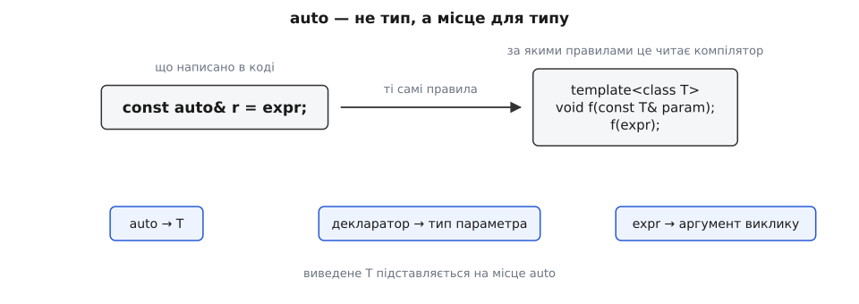
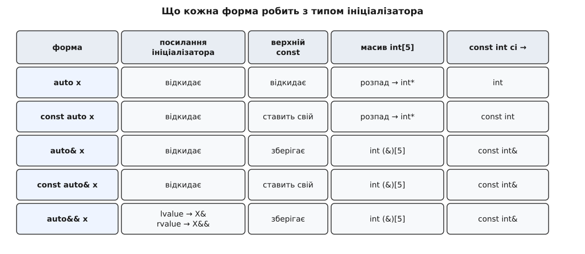
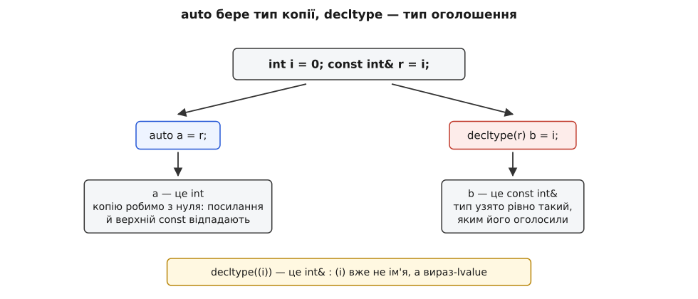

# auto й виведення типу

<preknowlist>
- [Категорії значень: lvalue, prvalue, xvalue](book:cpp-standards/value-categories) — вираз має не лише тип, а й категорію: чи має він ім'я і чи можна забрати його нутрощі.
- [Посилання і правила зв'язування](book:cpp-standards/references-binding) — чим `T&` відрізняється від `T&&`, до чого кожне зв'язується і як працює згортання посилань.
- [Коректність за const](book:cpp-standards/const-correctness) — різниця між `const` верхнього рівня (сам об'єкт незмінний) і `const` під вказівником чи посиланням.
- [Шаблони: параметризація типом](book:cpp-standards/templates-basics) — що таке параметр-тип шаблону і як компілятор добирає його з аргументів виклику.
- [Статична й динамічна типізація](book:programming/static-vs-dynamic-typing) — чому в C++ тип кожного виразу мусить бути відомий ще до запуску програми.
</preknowlist>

Тип змінної в C++ мусить бути відомий компіляторові до запуску програми: без нього не порахувати, скільки байтів відвести під об'єкт, і не вибрати, яку з перевантажених функцій викликати. Але «компілятор мусить знати тип» і «людина мусить його надрукувати» — зовсім різні вимоги. Коли ви пишете

```cpp
std::map<std::string, std::vector<int>> index;
std::map<std::string, std::vector<int>>::const_iterator it = index.find("ключ");
```

ви не повідомляєте компіляторові нічого нового. Він і так знає, що повертає `find` у цього конкретного `index`. Тип зліва — це переписаний уручну висновок, який машина вже зробила.

Переписаний висновок має три вади, і кожна з них серйозніша за багатослів'я.

Перша: він **розсинхронюється**. Змініть `std::vector<int>` на `std::deque<int>` в оголошенні контейнера — і всі місця, де тип ітератора виписано руками, доведеться правити теж, інакше вони перестануть компілюватися.

Друга, значно підступніша: коли записаний тип **не збігається** з типом виразу, компілятор часто не лається, а мовчки конвертує. Класика:

```cpp
std::map<std::string, int> counts = load();

for (const std::pair<std::string, int>& p : counts) {
    use(p.first, p.second);
}
```

Виглядає бездоганно: посилання, ще й константне, жодних копій. Насправді елемент `std::map<std::string, int>` має тип `std::pair<const std::string, int>` — з `const` усередині пари. Це **інший тип**, ніж `std::pair<std::string, int>`, тож на кожній ітерації створюється тимчасова пара, до неї копіюється рядок, і вже до цієї тимчасової прив'язується посилання. Цикл, написаний «щоб не копіювати», копіює кожен ключ. Помилки немає — є неявне перетворення, яке зробило точно те, що ви попросили.

Третя: деякі типи **неможливо назвати**. Тип лямбди — унікальний клас, згенерований компілятором; імені в нього немає взагалі, і жодного способу написати його в оголошенні не існує.

Усі три вади мають одне джерело: тип уже визначений виразом-ініціалізатором, а ми змушені його дублювати. Отже потрібен спосіб сказати компіляторові «тип візьми звідти, я його повторювати не буду». Цим способом і є `auto`.

Ключове слово тут із давньою і зовсім іншою біографією: до C++11 `auto` означало «змінна з автоматичною тривалістю зберігання» — специфікатор, успадкований від C, який ніхто ніколи не писав, бо він і так стояв за замовчуванням. Комітет забрав у нього старе значення й віддав слово під виведення типу. [Як це сталося](book:cpp-standards/auto-type-deduction/hist-auto-decltype.md) — окрема історія: пропозиція 2003 року народилася не з бажання менше друкувати, а з неможливості записати тип результату шаблонної функції; `decltype` і `auto` придумали разом, однією парою, і ця спорідненість досі пояснює половину їхньої поведінки.

## auto — це не тип, а місце для типу

Найпоширеніша хиба в розумінні `auto` — вважати його «типом, що підлаштовується». Насправді `auto` — **заповнювач** (англ. *placeholder*): позначка в оголошенні, на місце якої компілятор підставить справжній тип, вирахуваний з ініціалізатора. Сам по собі `auto` типом не є, і саме тому він вільно поєднується з рештою декларатора — з `const`, `&`, `&&`, `*`.

Декларатор (лат. *declarare* — оголошувати) — це та частина оголошення, що обгортає ім'я: зірочки, амперсанди, дужки, кваліфікатори. У `const auto& r = expr;` заповнювач — лише слово `auto`, а `const … &` — це декларатор навколо нього. Різниця між `auto x` і `const auto& x` — не в тому, «як сильно» виводиться тип, а в тому, у яку форму цей виведений тип потім вставляють.

А тепер найважливіше твердження всієї теми, з якого випливає решта. Правила, за якими компілятор знаходить тип для `auto`, — **це правила виведення аргументів шаблону**. Не схожі на них, не натхнені ними — буквально вони. Стандарт описує виведення для `auto` через уявний шаблон функції: оголошення перетворюють на шаблон з одним параметром-типом `T`, декларатор змінної стає типом параметра, а ініціалізатор — аргументом уявного виклику.



*`auto` не має власних правил: компілятор бере ті самі, за якими добирає аргументи шаблону.*

Тобто `const auto& r = expr;` компілятор обробляє так, ніби існує

```cpp
template<class T>
void f(const T& param);

f(expr);   // яким вийде T — таким буде й auto
```

Ця відповідність — не деталь для законників стандарту, а робочий інструмент. Щойно виникає питання «а що тут виведеться», його треба переписати як виклик уявного шаблону — і відповідь стає механічною. [Виведення аргументів шаблону](book:cpp-standards/template-argument-deduction) розібране окремо; для роботи з `auto` досить пам'ятати головне: виведення зіставляє тип параметра з типом аргументу і шукає таке `T`, щоб вони зійшлися, причому деякі властивості аргументу при цьому свідомо ігноруються.

Які саме ігноруються — залежить від однієї-єдиної обставини: чи є параметр посиланням.

## Три випадки, і всі три випливають з однієї причини

**Випадок перший: декларатор не посилання (`auto x`, `const auto x`, `auto* p`).**

Параметр за значенням — це новий, окремий об'єкт, зроблений копіюванням аргументу. Раз він новий, то властивості *сховища* аргументу до нього не переходять. Тому виведення відкидає дві речі: посилальність (посилання на об'єкт і сам об'єкт копіюються однаково) і `const`/`volatile` **верхнього рівня** — тобто ті, що стосуються самого аргументу як цілого.

```cpp
const int  ci = 42;
const int& cr = ci;

auto a = ci;   // int  — не const int
auto b = cr;   // int  — ні посилання, ні const
```

Логіка тут не формальна, а змістовна: `ci` не можна змінювати, але `a` — це **інший об'єкт**, у якого власна доля. Заборона писати в `ci` нічого не каже про `a`.

А от `const`, який стосується не самого об'єкта, а того, на що він вказує, нікуди не дівається — інакше копіювання вказівника давало б право писати в чужу константу:

```cpp
const char* p = "текст";
auto q = p;    // const char*  — копіюється вказівник, а не рядок
```

Сюди ж належить ще одне успадковане від C правило: параметр за значенням не може мати тип масиву чи функції, тому при виведенні вони **розпадаються** до вказівника.

```cpp
int arr[5] = {};
auto  m = arr;          // int*   — довжина 5 загублена назавжди
void  g(int);
auto  h = g;            // void(*)(int)
auto  s = "текст";      // const char*  — а не const char[7]
```

**Випадок другий: декларатор — звичайне посилання (`auto&`, `const auto&`).**

Посилання не створює нового об'єкта, воно стає **другим іменем того самого**. Отже властивості сховища тепер критичні: якщо відкинути `const`, ми отримаємо неконстантне ім'я для константного об'єкта — і зможемо в нього писати. Тому `const` зберігається, а розпаду масиву не відбувається: посилатися можна й на масив цілком.

```cpp
const int ci = 42;
auto& r = ci;           // const int&  — const обов'язково лишається

int arr[5] = {};
auto& ar = arr;         // int (&)[5]  — довжина збережена
```

Посилальність самого ініціалізатора при цьому відкидається так само, як і в першому випадку: посилання на посилання в C++ не існує, `auto&`, прив'язане до `int&`, дає просто `int&`.

**Випадок третій: декларатор — `auto&&`.**

Тут вмикається окреме правило виведення, задля якого воно, власне, і придумане. Якщо параметр має форму «посилання на rvalue від параметра-типу», то для аргументу-lvalue виведення підставляє замість `T` не тип об'єкта, а **посилання** на нього: `T = X&`. Далі спрацьовує згортання посилань — `X& &&` перетворюється на `X&` — і параметр виявляється звичайним lvalue-посиланням. Для аргументу-rvalue нічого особливого не відбувається: `T = X`, тип параметра — `X&&`.

```cpp
int  i = 0;
const int ci = 42;

auto&& u1 = i;    // int&        — lvalue
auto&& u2 = ci;   // const int&  — lvalue, ще й константний
auto&& u3 = 42;   // int&&       — prvalue
```

Одна форма, що прив'язується до всього і при цьому **запам'ятовує категорію значення** свого ініціалізатора у власному типі, називається переспрямовувальним посиланням (англ. *forwarding reference*). Здатність запам'ятати категорію — не самоціль: вона дозволяє передати аргумент далі точнісінько таким, яким його отримали, чим і займається [ідеальне передавання](book:cpp-standards/perfect-forwarding) — механізм, що вирішує проблему обгорток: обгортка не має права ні втратити константність аргументу, ні перетворити чужий тимчасовий об'єкт на іменований і тим заборонити його переміщення.



*Уся механіка виведення для `auto` вміщається в одну таблицю: колонка «верхній const» — це `const` верхнього рівня, тобто константність самого ініціалізатора як об'єкта.*

## Наслідок, з якого починається більшість несподіванок

З таблиці випливає правило, варте того, щоб його запам'ятати окремо: **`auto` сам ніколи не виводить посилання**. Посилання з'являється тільки тоді, коли ви написали `&` або `&&` руками. Тому

```cpp
auto element = container[i];   // копія
auto& element = container[i];  // те саме сховище
```

— і перший рядок мовчки копіює, хай яким дорогим був би елемент.

Найчастіше це вилазить у циклі за діапазоном. [Цикл `for` за діапазоном](book:cpp-standards/range-based-for) компілятор розгортає в звичайний цикл з ітераторами, і оголошення з вашого циклу перетворюється на **копійну ініціалізацію** з розіменованого ітератора: `for (auto x : v)` стає `auto x = *__begin;` на кожному кроці. Звідси чотири форми з чітко різними значеннями:

```cpp
for (auto x : v)        // власна копія кожного елемента
for (auto& x : v)       // сам елемент, можна змінювати
for (const auto& x : v) // сам елемент, лише читання
for (auto&& x : v)      // сам елемент, категорію збережено
```

Остання форма потрібна не завжди, але рятує там, де `*it` повертає не посилання на елемент, а тимчасовий об'єкт — тоді `auto&` просто не скомпілюється, бо неконстантне lvalue-посилання не прив'язується до тимчасового.

Порахувати ціну неправильної форми можна прямо: досить типу, який рахує власні копіювання й переміщення. [Невеличка лабораторія на такому типі](book:cpp-standards/auto-type-deduction/proj-deduction-lab.md) показує в цифрах, скільки копій дає `auto` проти `const auto&` на реальному контейнері, і заразом друкує, що саме вивелося в кожному оголошенні — без цього про виведення доводиться здогадуватися.

> 🔧 **Навіщо це.** Різниця між `auto` і `const auto&` у циклі за діапазоном — це різниця між O(n) виділень пам'яті й нулем. На контейнері рядків або векторів вона видна у профілювальнику одразу; на контейнері `int` — не варта згадки. Правило просте: копію беруть свідомо, коли елемент справді треба змінювати незалежно від контейнера, а не за замовчуванням.

## Коли справжній тип виразу — не той, що ви бачите

`auto` бере **справжній** тип виразу. Зазвичай це саме те, чого ви й хочете, — але не тоді, коли бібліотека повертає об'єкт-посередник (англ. *proxy*), розрахований на негайне неявне перетворення.

Найвідоміший приклад — `std::vector<bool>`. Він зберігає біти упаковано, по вісім на байт, тому посилання на окремий елемент у нього не існує: адресувати біт неможливо. Щоб `flags[3] = true` усе-таки працювало, `operator[]` повертає маленький клас `std::vector<bool>::reference`, який пам'ятає слово й номер біта і має перетворення на `bool` та присвоєння.

Поки ви пишете тип руками, посередник живе рівно один вираз і непомітно зникає. Варто написати `auto` — і він лишається:

```cpp
std::vector<bool> load_flags();

auto bit = load_flags()[3];   // std::vector<bool>::reference, а не bool
bool ok  = bit;               // невизначена поведінка
```

Тимчасовий вектор помирає в кінці першого рядка, а посередник, що пам'ятає адресу слова всередині нього, лишається жити. Читання через нього — звернення до звільненої пам'яті, класичне [висяче посилання](book:cpp-standards/dangling-references), тільки заховане в типі, якого ви ніде не писали. Компілятор мовчить: з його погляду ви скопіювали цілком коректний об'єкт.

Лікується це не відмовою від `auto`, а **ідіомою явно типізованого ініціалізатора**: тип пишуть не в оголошенні, а в самому виразі, і `auto` виводить уже з нього.

```cpp
auto ok = static_cast<bool>(load_flags()[3]);   // bool, посередник помер вчасно
```

Такі посередники трапляються не лише у `vector<bool>`: їх повертають бібліотеки матричних обчислень з відкладеним обчисленням виразів і ліниві види з `ranges`. Ознака одна: тип, який автор бібліотеки не збирався показувати користувачеві. [Вибір контейнера під задачу](book:cpp-standards/stl-containers-choice) окремо пояснює, чому `std::vector<bool>` узагалі влаштований інакше за всі інші вектори і в яких випадках його краще обійти.

## Єдиний виняток з правила «як у шаблонах»

Відповідність «`auto` = виведення шаблону» має рівно одне відхилення, і воно стосується фігурних дужок. Список в дужках — `{1, 2, 3}` — сам по собі **не має типу**, це синтаксична конструкція, а не вираз. Виведення аргументів шаблону з нею тому й не працює:

```cpp
template<class T> void f(T param);
f({1, 2, 3});                       // помилка: нема з чого виводити T

template<class T> void g(std::initializer_list<T> param);
g({1, 2, 3});                       // працює: T = int
```

А `auto` для такого випадку має особливе правило: список у дужках він виводить як `std::initializer_list`.

```cpp
auto a = {1, 2, 3};   // std::initializer_list<int>
auto b = {1};         // std::initializer_list<int>  — теж список!
```

Через це `auto x = {1};` довго був джерелом здивування: людина писала «змінна зі значенням 1», а отримувала список з одного елемента. C++17 розділив дві форми запису: при ініціалізації **через знак рівності** список лишається списком, а при **прямій** ініціалізації дужками один елемент дає тип цього елемента, а кілька — помилку.

```cpp
auto c{1};      // int        (C++17)
auto d{1, 2};   // помилка: у прямій формі більше одного елемента не можна
```

Правило ухвалили як виправлення (документ N3922, 2014 рік), і провідні компілятори застосували його й до старіших режимів мови, тож на практиці `auto x{1}` дає `int` навіть з прапорцем `-std=c++11`. Це рідкісний випадок, коли той самий код мовчки міняє тип залежно від компілятора й року — у старому коді на нього варто дивитися уважно. Ширший розбір того, чим форми запису ініціалізації відрізняються між собою, — у темі [форм ініціалізації](book:cpp-standards/initialization-forms): дужки, знак рівності й круглі дужки в C++ не взаємозамінні, і вибір між ними змінює не лише виведення типу, а й те, яку функцію буде викликано.

## decltype: тип, як його оголосили

`auto` відповідає на питання «якого типу буде **копія** цього виразу». Часто потрібне інше питання: «якого типу цей вираз **сам по собі**, з усіма посиланнями й константністю». На нього відповідає `decltype` (від *declared type* — оголошений тип).

Правила в нього два, і різниця між ними — джерело найвідомішої пастки мови.

Якщо аргумент — **ім'я** (змінної, члена класу, функції), `decltype` дає тип точно таким, як його записали в оголошенні: посилання лишається посиланням, `const` лишається `const`.

Якщо аргумент — будь-який інший **вираз**, `decltype` дає тип, доповнений категорією значення цього виразу: для lvalue — `T&`, для xvalue — `T&&`, для prvalue — просто `T`.

```cpp
int i = 0;
const int& r = i;

decltype(i)   a = i;             // int
decltype(r)   b = i;            // const int&   — ім'я, тип як оголошено
decltype(i + 1) c = 0;          // int          — вираз, prvalue
decltype(std::move(i)) d = std::move(i);  // int&&  — вираз, xvalue
```

І пастка:

```cpp
decltype((i)) e = i;   // int&  — зайві дужки перетворили ім'я на вираз
```

Круглі дужки нічого не роблять зі значенням, але `(i)` — це вже не ім'я, а вираз, до того ж lvalue. Тому спрацьовує друге правило, а не перше, і замість `int` виходить `int&`.



*Два інструменти відповідають на різні питання, тому й дають різні відповіді на тому самому ініціалізаторі.*

## decltype(auto): взяти джерело від auto, а правила від decltype

Дві потреби легко уявити окремо: «тип бери з ініціалізатора, я його не писатиму» (це `auto`) і «тип не спрощуй, лиши посилання й константність» (це `decltype`). Довго їх не можна було поєднати: у `decltype(expr)` вираз доводилося писати повністю, а він міг бути довжелезним і повторював ініціалізатор слово в слово.

C++14 дав форму `decltype(auto)`: заповнювач, який виводиться з ініціалізатора, як `auto`, але за правилами `decltype`. Найважливіше вона важить у типі повернення обгорток.

```cpp
template<class Container, class Index>
auto at_copy(Container& c, Index i) { return c[i]; }         // завжди копія

template<class Container, class Index>
decltype(auto) at(Container& c, Index i) { return c[i]; }    // рівно те, що c[i]
```

Перша функція — не просто повільніша, вона **інша**: `at_copy(v, 0) = 42;` не скомпілюється, бо повертається prvalue, тимчасовий об'єкт. Друга поводиться як сам `c[i]`: повертає посилання, крізь яке можна писати, або значення, якщо контейнер повертає значення. Обгортка, яка не хоче нічого змінювати в поведінці обгорнутого, мусить оголошуватися саме так.

> 🔧 **Навіщо це.** Будь-який шар, що прозоро пропускає крізь себе чужий виклик — логування, вимірювання часу, кешування, посередник у бібліотеці, — має повертати `decltype(auto)`. Інакше він тихо перетворить посилання на копію, і код, який досі присвоював крізь виклик, зламається, а код, який лише читав, просто почне копіювати.

Ціна за точність — та сама пастка з дужками, тепер уже небезпечна:

```cpp
decltype(auto) f() {
    int x = 0;
    return (x);   // decltype((x)) — це int&: посилання на мертву локальну змінну
}
```

Прибрати дужки — і функція повертає `int`. Залишити — і вона повертає посилання на змінну, яка припиняє існувати на цьому ж рядку. У функції з `decltype(auto)` кожні дужки навколо повернення варті окремого погляду.

## Виведення типу повернення функцій

`auto` замість типу повернення (C++14) означає «візьми тип з інструкції `return`» і працює за правилами `auto` — тобто **відкидає посилання**, з усіма наслідками, показаними вище.

```cpp
auto make() { return std::string("готово"); }   // std::string
```

Три обмеження випливають з того, як це влаштовано.

Якщо інструкцій `return` кілька, усі мусять давати **однаковий** тип — компілятор виводить тип один раз і потім лише перевіряє збіг, ніякого спільного знаменника він не шукає:

```cpp
auto pick(bool b) {
    if (b) return 1;
    return 2.0;    // помилка: спершу вивелося int, тепер double
}
```

Рекурсія дозволена, але тільки після того, як тип уже став відомий з попереднього `return`:

```cpp
auto fact(int n) {
    if (n <= 1) return 1;      // тут тип уже визначено як int
    return n * fact(n - 1);    // тому рекурсивний виклик коректний
}
```

І головне: щоб дізнатися тип, компіляторові потрібне **тіло** функції. Оголошення з `auto` без визначення нічого не дає — тіло доводиться тримати в заголовку, разом з усіма залежностями, які воно тягне. Для внутрішнього коду це дрібниця, для публічного інтерфейсу бібліотеки — свідомий компроміс, який б'є і по [часу перезбірки](book:cpp-standards/header-hygiene), і по стабільності інтерфейсу.

Окремо стоїть форма з типом повернення в кінці — `auto f(параметри) -> Тип`. Тут `auto` нічого не виводить: це просто синтаксичний маркер, що справжній тип буде записаний після стрілки. Форма з'явилася в C++11 саме тому, що до параметрів у звичайному записі ще не можна дотягнутися — вони оголошені **правіше** від типу повернення:

```cpp
template<class A, class B>
auto add(A a, B b) -> decltype(a + b) { return a + b; }
```

Ім'я `a` в `decltype(a + b)` видиме тільки після стрілки. Саме ця незручність, а не бажання скоротити код, і породила колись усю пару `decltype`/`auto`.

## Інші місця, де стоїть той самий заповнювач

Механізм один, тож усі решта застосувань `auto` читаються тими самими правилами.

**Параметри лямбди** (C++14). `auto` в списку параметрів перетворює лямбду на шаблон: у згенерованого класу `operator()` стає шаблонним, і виведення відбувається на кожному виклику окремо.

```cpp
auto plus = [](auto a, auto b) { return a + b; };
```

Наслідки такої лямбди — і те, що вона нічого не знає про свої аргументи до виклику, і те, що її захоплення живуть за власними правилами, — розібрані в темі [лямбд і захоплень](book:cpp-standards/lambdas-and-captures).

**Параметри звичайних функцій** (C++20). `void log(auto value)` — скорочений запис шаблону, повністю рівносильний `template<class T> void log(T value)`. Разом з [концептами](book:cpp-standards/concepts-constraints) — механізмом, що дозволяє поставити виведеному типу вимоги й дістати зрозумілу помилку замість простирадла з нутрощів шаблону, — це дає читабельний запис на кшталт `void log(std::integral auto value)`.

**Нетипові параметри шаблону** (C++17). `template<auto N>` каже: значення параметра задасть користувач, а його тип виведеться зі вжитого аргументу — `Fixed<5>` дає `int`, `Fixed<'x'>` дає `char`.

**Структуровані зв'язування** (C++17). У `auto [key, count] = pair;` заповнювач стосується **не імен у дужках**, а прихованого об'єкта, у який спершу ініціалізують усе ціле; імена — лише назви для його частин. Тому `auto [a, b]` копіює всю пару, а `auto& [a, b]` — ні, і тому в циклі за словником пишуть `const auto& [key, count]`. Механіка цих імен розібрана в темі [структурованих зв'язувань](book:cpp-standards/structured-bindings).

Заповнювач комбінується і з іншими специфікаторами — `constexpr auto`, `static auto`, `const auto*` — саме тому, що сам він не тип, а місце для типу.

Обмеження ж походять з того, що виводити треба з чогось конкретного й однозначного:

```cpp
struct S {
    auto x = 0;                    // помилка: нестатичний член так оголосити не можна
    static constexpr auto n = 64;  // а так можна: є ініціалізатор у самому оголошенні
};

auto a = 1, b = 2.0;   // помилка: один auto не може стати водночас int і double
auto z;                // помилка: виводити нема з чого
```

## Де auto виграє, а де шкодить

Найсильніший аргумент за `auto` — не стислість, а **неможливість написати неправильний тип**. Оголошення без явного типу не може розсинхронізуватися з виразом і не може мовчки викликати перетворення:

```cpp
int  n = v.size();   // std::size_t → int: на 64 бітах мовчазне звуження
auto n = v.size();   // std::size_t, рівно те, що повернув контейнер
```

Друга сильна сторона — типи, які просто не запишеш: лямбди, результати `std::bind`, ліниві види з `ranges`, довгі вкладені імена ітераторів. Третя — стійкість до змін: заміна контейнера в одному місці не тягне за собою правок у десятках оголошень.

Розплата теж реальна. Тип, записаний явно, — це документація й перевірка водночас: він каже читачеві, з чим той має справу, і ловить помилку, якщо вираз повернув щось не те. Там, де тип несе сенс для читача — на межі модуля, у публічній структурі, у місці, де саме тип є суттю рішення, — його краще написати. І там, де вираз може повернути посередника, `auto` без явного перетворення небезпечний.

Практичний компроміс склався такий: `auto` за замовчуванням у локальних оголошеннях, свідома форма (`auto&`, `const auto&`, `auto&&`) там, де йдеться про копію, і явний тип у самому виразі — через `static_cast` — там, де тип виразу треба зафіксувати.

> 🔧 **Навіщо це.** У ревʼю коду `auto` найчастіше критикують за «неможливо зрозуміти тип». Аргумент майже завжди підмінює тему: тип видно з ініціалізатора, а от неявне перетворення в оголошенні з явним типом не видно **ніде**. Тому корисно питати не «чи видно тут тип», а «що станеться, якщо тип виразу зміниться» — і саме на це питання `auto` дає найкращу відповідь.

Уся поведінка `auto`, з усіма її несподіванками, розкладається на два питання, які варто ставити щоразу: **який справжній тип виразу праворуч** — і **чи є мій декларатор посиланням**. Перше питання ловить посередників і випадкові тимчасові об'єкти; друге вирішує, копіюємо ми чи даємо об'єктові друге ім'я, і чи виживе при цьому `const`. Все інше — `decltype`, `decltype(auto)`, виведення типу повернення, структуровані зв'язування — це той самий механізм, приставлений до іншого місця в оголошенні.
