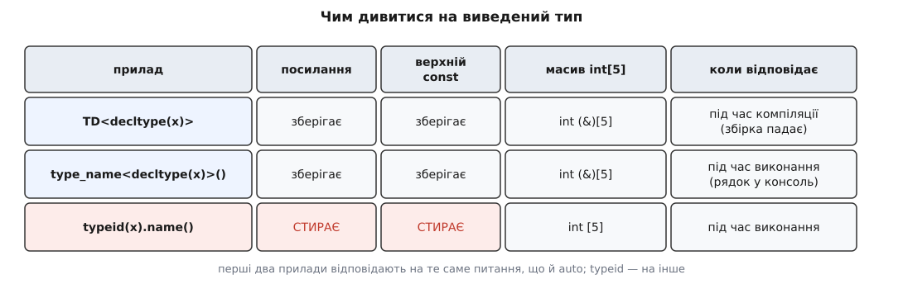

# 🔬 Лабораторія виведення: порахувати копії й побачити, що саме вивелося

Про виведення типу зручно розповідати таблицями, але перевірити таблицю в голові неможливо: компілятор нікому не показує, який тип він вивів, а зайва копія не падає з помилкою — вона просто тихо їсть час і пам'ять. Нижче зібрано три прилади, які роблять це видимим: тип, що доносить на кожне власне копіювання й переміщення; спосіб змусити компілятор назвати виведений тип уголос; і батарея оголошень, прогнана крізь обидва прилади на константі, масиві й посереднику з `std::vector<bool>`. Усе — робочий C++17 в одному файлі, без жодної зовнішньої залежності.

## Прилад перший: тип, який доносить на себе

Ідея прямолінійна. Копія — це виклик копійного конструктора, переміщення — виклик переміщувального. Отже досить типу, у якого обидва конструктори написані вручну й лишають слід у лічильнику. Тоді питання «скільки копій дає ця форма циклу» перестає бути питанням віри.

Другий лічильник потрібен тому, що копія копії не рівня. Копіювання об'єкта, який тримає дані в купі, означає ще й виділення пам'яті — а це на два порядки дорожче за перенесення кількох байтів. Виділення ловимо заміною глобального `operator new`: стандарт дозволяє програмі підмінити його своїм, і тоді через нашу функцію проходить кожен `new` у програмі, включно з тими, що робить усередині себе `std::string`.

```cpp
#include <cstddef>
#include <cstdlib>
#include <iostream>
#include <map>
#include <new>
#include <string>
#include <vector>

struct Counters {
    std::size_t ctor = 0, copy = 0, move = 0, dtor = 0;
    void reset() { ctor = copy = move = dtor = 0; }
};
inline Counters g_probe;

// Лічильник справжніх виділень: заміна глобального operator new.
inline std::size_t g_allocs = 0;

void* operator new(std::size_t n) {
    ++g_allocs;
    if (void* p = std::malloc(n)) return p;
    throw std::bad_alloc{};
}
void operator delete(void* p) noexcept              { std::free(p); }
void operator delete(void* p, std::size_t) noexcept { std::free(p); }

struct Probe {
    std::string id;                       // навмисно довгий рядок — див. «Пастки»

    explicit Probe(std::string s) : id(std::move(s))   { ++g_probe.ctor; }
    Probe(const Probe& o)         : id(o.id)           { ++g_probe.copy; }
    Probe(Probe&& o) noexcept     : id(std::move(o.id)) { ++g_probe.move; }

    Probe& operator=(const Probe& o) { id = o.id;            ++g_probe.copy; return *this; }
    Probe& operator=(Probe&& o) noexcept { id = std::move(o.id); ++g_probe.move; return *this; }

    ~Probe() { ++g_probe.dtor; }
};
```

Написавши п'ять функцій вручну, ми свідомо вимкнули [правило нуля](topic:cpp-standards/rule-of-five-zero) — домовленість, за якою клас без власних ресурсів не оголошує жодної з цих операцій і дістає їх від компілятора. Тут ресурсів теж немає, але нам потрібні саме побічні дії, тож пишемо всі п'ять. Переміщувальні операції позначені `noexcept` не для краси: [семантика переміщення](topic:cpp-standards/move-semantics) — це передавання нутрощів об'єкта замість їх дублювання, і `std::vector` при перерозподілі погоджується переміщувати елементи лише тоді, коли переміщення обіцяє не кидати винятків, інакше він мовчки копіює.

Далі — вимірювальний джгут. Він скидає лічильники, запам'ятовує кількість виділень, виконує передане тіло й друкує різницю.

```cpp
inline std::size_t g_sink = 0;   // щоб цикл не викинули як марний

template <class Body>
void measure(const char* label, Body&& body) {
    g_probe.reset();
    const std::size_t before = g_allocs;
    body();
    const std::size_t allocs = g_allocs - before;
    std::cout << label
              << "  копій: "      << g_probe.copy
              << "\tпереміщень: " << g_probe.move
              << "\tвиділень: "   << allocs << '\n';
}
```

## Що показує цикл

Тепер власне дослід: тисяча об'єктів у векторі й три форми циклу за діапазоном.

```cpp
int main() {
    std::vector<Probe> v;
    v.reserve(1000);
    for (int i = 0; i < 1000; ++i)
        v.emplace_back("елемент-номер-" + std::to_string(i) + "-із-довгим-хвостом");

    measure("for (auto x : v)       ", [&] {
        for (auto x : v)        g_sink += x.id.size();
    });
    measure("for (const auto& x : v)", [&] {
        for (const auto& x : v) g_sink += x.id.size();
    });
    measure("for (auto&& x : v)     ", [&] {
        for (auto&& x : v)      g_sink += x.id.size();
    });
}
```

Вивід (g++ 13, `-std=c++17`, однаковий і на `-O0`, і на `-O2`):

```text
for (auto x : v)         копій: 1000    переміщень: 0    виділень: 1000
for (const auto& x : v)  копій: 0       переміщень: 0    виділень: 0
for (auto&& x : v)       копій: 0       переміщень: 0    виділень: 0
```

Тисяча зайвих викликів `malloc` і тисяча `free` — за один прохід контейнером, за одну втрачену `&` в оголошенні. Числа не «приблизно тисяча», а рівно тисяча: перша форма розгортається в `auto x = *__begin;` на кожному кроці, а це копійна ініціалізація з lvalue.

Тут варто зупинитися на слові «однаковий на `-O2`». Спокуса пояснити нуль копій оптимізатором природна, але помилкова: компілятор не має права викинути цей виклик. [Усунення копій](topic:cpp-standards/copy-elision) дозволене лише в перелічених стандартом місцях — при поверненні з функції та при ініціалізації з тимчасового об'єкта, — і копіювання іменованого елемента контейнера до цього переліку не належить. Навіть якби належало: наш копійний конструктор змінює глобальний лічильник, який потім друкується, тож дія спостережна й «правило ніби» її не прибирає. Тисяча — це не артефакт налаштувань збірки, це те, що просили в коді.

> 🔧 **Навіщо це.** Лічильник копій — найдешевший спосіб довести чи спростувати здогад про продуктивність, і на відміну від [профілювальника](topic:programming/profiling), який показує, де програма проводить час, він відповідає на питання «звідки взялася робота». Дві хвилини на такий тип у тестовому файлі часто економлять годину суперечок у ревʼю.

Другий дослід — той самий словник, що й у класичній помилці з парою. Елемент `std::map<int, Probe>` має тип `std::pair<const int, Probe>`, а не `std::pair<int, Probe>`, тож посилання на «майже той самий» тип змушує створювати тимчасову пару на кожній ітерації:

```cpp
    std::map<int, Probe> m;
    for (int i = 0; i < 1000; ++i)
        m.emplace(i, Probe("ключ-" + std::to_string(i) + "-із-довгим-хвостом"));

    measure("const std::pair<int, Probe>& e", [&] {
        for (const std::pair<int, Probe>& e : m) g_sink += e.second.id.size();
    });
    measure("const auto& e                 ", [&] {
        for (const auto& e : m)                  g_sink += e.second.id.size();
    });
```

```text
const std::pair<int, Probe>& e   копій: 1000    переміщень: 0    виділень: 1000
const auto& e                    копій: 0       переміщень: 0    виділень: 0
```

Обидва рядки написані «правильно»: константне посилання, жодного `auto`, тип видно очима. І саме той, у якому тип виписано руками, копіює тисячу разів. Це найкращий аргумент проти гасла «явний тип завжди зрозуміліший»: явний тип показує, що написав автор, а не те, що поверне вираз.

## Прилад другий: змусити компілятор назвати тип

Лічильник каже, скільки копій, але не каже, що саме вивелося. А компілятор цей висновок має — просто не показує. Витягти його можна двома способами, і обидва варті місця в записнику.

Перший — трюк з незавершеним типом, який Скотт Маєрс описав як Item 4 в «Effective Modern C++» (2014) і показав у доповіді «C++ Type Deduction and Why You Care» на CppCon 2014. Оголошуємо шаблон класу й **не даємо йому визначення**. Спроба створити змінну такого типу — помилка компіляції, а в тексті помилки компілятор мусить назвати тип повністю:

```cpp
template <class T> class TD;   // оголошено — і навмисно не визначено

const int ci = 42;
auto&& x = ci;

TD<decltype(x)> show;          // навмисна помилка: тип буде в діагностиці
```

Що друкують компілятори:

```text
g++    error: aggregate 'TD<const int&> show' has incomplete type and cannot be defined
clang  error: implicit instantiation of undefined template 'TD<const int &>'
MSVC   error C2079: 'show' uses undefined class 'TD<const int&>'
```

Формулювання різні, суть одна: `const int&` — саме те, що вивелося для `auto&&` на константному lvalue. Цінність трюку в тому, що він працює **до** запуску й нічого не спрощує: ні посилання, ні `const` не губляться, бо це не значення, а справжній аргумент шаблону.

Другий спосіб потрібен тоді, коли типів багато й зупиняти збірку на кожному незручно. Тут у пригоді стає розширення `__PRETTY_FUNCTION__` (у GCC та Clang) і `__FUNCSIG__` (у MSVC): усередині шаблонної функції ці макроси розгортаються в рядок із її сигнатурою, а сигнатура містить підставлений аргумент шаблону. Лишається вирізати з рядка потрібний шматок.

Вирізати можна й «за прапорцем компілятора», рахуючи довжину префікса вручну, але надійніше зробити це самим рядком. Проганяємо шаблон крізь **мітку** — тип, назва якого в сигнатурі трапляється рівно один раз, — і дивимося, скільки символів опинилося ліворуч і праворуч від неї. Ці два числа й будуть межами вирізання для будь-якого іншого типу:

```cpp
#include <string_view>

template <class T>
constexpr const char* raw_name() {
#if defined(__clang__) || defined(__GNUC__)
    return __PRETTY_FUNCTION__;
#elif defined(_MSC_VER)
    return __FUNCSIG__;
#else
    return "?";
#endif
}

// g++ дає:   constexpr const char* raw_name() [with T = double]
// clang дає: const char *raw_name() [T = double]
// MSVC дає:  const char *__cdecl raw_name<double>(void)
inline constexpr std::string_view kMark   = "double";
inline constexpr std::string_view kSample = raw_name<double>();
inline constexpr std::size_t      kHead   = kSample.find(kMark);
inline constexpr std::size_t      kTail   = kSample.size() - kHead - kMark.size();

template <class T>
constexpr std::string_view type_name() {
    const std::string_view s = raw_name<T>();
    return s.substr(kHead, s.size() - kHead - kTail);
}
```

Функція повертає саме `const char*`, а не `std::string_view`, і це не дрібниця: GCC розкриває в сигнатурі кожен ужитий псевдонім, тож із типом повернення `std::string_view` до квадратних дужок додалося б іще `; std::string_view = std::basic_string_view<char>`. Рядок став би довшим, а головне — залежним від того, які саме псевдоніми в ньому трапилися. З голим `const char*` сигнатура коротка й однакової будови для будь-якого `T`. Тип `double` узятий за мітку теж не випадково: жодне зі слів `constexpr`, `const char*`, `raw_name`, `__cdecl`, `void` його в собі не містить, тож `find` натрапить саме на аргумент шаблону.

Друкувати зручно макросом, бо потрібне не значення змінної, а її ім'я в тексті поруч із типом:

```cpp
#include <iomanip>
#define SHOW(x) std::cout << std::left << std::setw(30) << #x \
                          << " →  " << type_name<decltype(x)>() << '\n'
```

Ключове тут — `decltype(x)`, а не сам `x`. Для імені змінної `decltype` віддає тип рівно таким, як його оголошено, з посиланням і константністю; отже те, що надрукується, і є результат виведення. Одна пересторога: `decltype((x))` з подвійними дужками — уже інше правило й інша відповідь, тому в макросі аргумент береться без зайвого обгортання.



*Два перших прилади відповідають на те саме питання, що ставить `auto`; `typeid` відповідає на інше — і саме тому не годиться як інструмент виведення.*

## Чому `typeid` тут не помічник

Найперше, до чого тягнеться рука, — `typeid(x).name()`. Це найгірший з можливих виборів, і його провал варто побачити на власні очі:

```cpp
const int  ci = 42;
const int& cr = ci;

std::cout << (typeid(cr) == typeid(int) ? "однакові" : "різні") << '\n';  // однакові
```

`typeid` каже, що `const int&` та `int` — це один тип. Так вимагає стандарт: у результаті `typeid` посилання відкидається, а `const` і `volatile` верхнього рівня ігноруються, тому `typeid(T)` і `typeid(const T)` дають той самий об'єкт `type_info`. Для рідної задачі `typeid` це правильно. Його задача — [динамічна ідентифікація типу](topic:cpp-standards/rtti-and-dynamic-cast): спитати вже під час виконання, який насправді клас ховається за посиланням на базу, і за потреби безпечно опуститися до нього через `dynamic_cast`. У такому питанні константність джерела не важить узагалі. Але саме дві речі, які ми хочемо побачити у виведенні, `typeid` і викидає.

Плутанини додає й те, що масив `typeid` при цьому **зберігає**: перетворення масиву на вказівник тут не виконується, тож `typeid(arr)` для `int[5]` дає тип масиву. Виходить прилад, що на посиланні поводиться як `auto` за значенням, а на масиві — як `auto&`. Жодного з двох питань — ні «яким вийде тип копії», ні «яким тип оголошено» — він не відтворює.

Останній цвях — `name()`. Стандарт про його вміст не каже нічого, крім того, що це рядок, який визначає реалізація. GCC і Clang повертають закодоване ім'я (англ. *mangled name*) — `i` для `int`, `PKc` для `const char*`: рівно те, яким тип записаний у символах об'єктного файла. Правила цього кодування — частина [ABI](topic:cpp-standards/abi-stability-cpp), домовленості про двійковий вигляд програми, яку однаково читають компілятор і компонувальник. Розкодувати можна нестандартною `abi::__cxa_demangle` з `<cxxabi.h>` — ще один шматок коду, прив'язаний до конкретного компілятора. MSVC натомість друкує людський запис одразу. Тобто інструмент і бреше по суті, і виглядає по-різному всюди.

> 🔧 **Навіщо це.** Порада «просто надрукуй `typeid`» досі ходить по форумах і відповідях, тому вміти пояснити, чому вона хибна, корисніше, ніж просто знати кращий спосіб. Правило коротке: `typeid` — прилад про динамічний тип під час виконання, а не про виведений тип при компіляції.

## Батарея оголошень

Тепер зберемо все й проженемо п'ять форм оголошення крізь три різні ініціалізатори. Це і є основна дослідна установка: одна й та сама п'ятірка, три різні джерела.

```cpp
void battery() {
    // ── 1. Константний об'єкт ────────────────────────────────
    const int ci = 42;
    auto        a1 = ci;   SHOW(a1);
    const auto  a2 = ci;   SHOW(a2);
    auto&       a3 = ci;   SHOW(a3);
    const auto& a4 = ci;   SHOW(a4);
    auto&&      a5 = ci;   SHOW(a5);

    // ── 2. Масив ─────────────────────────────────────────────
    int arr[5] = {};
    auto        b1 = arr;  SHOW(b1);
    const auto  b2 = arr;  SHOW(b2);
    auto&       b3 = arr;  SHOW(b3);
    const auto& b4 = arr;  SHOW(b4);
    auto&&      b5 = arr;  SHOW(b5);

    // ── 3. Посередник із vector<bool> ────────────────────────
    std::vector<bool> vb{true, false, true};
    auto        c1 = vb[0];  SHOW(c1);
    const auto  c2 = vb[0];  SHOW(c2);
 // auto&       c3 = vb[0];              // не компілюється, див. нижче
    const auto& c4 = vb[0];  SHOW(c4);
    auto&&      c5 = vb[0];  SHOW(c5);
    auto        c6 = static_cast<bool>(vb[0]);  SHOW(c6);
}
```

Вивід (g++ 13 з libstdc++; Clang друкує те саме з пробілом перед `&`):

```text
a1                              →  int
a2                              →  const int
a3                              →  const int&
a4                              →  const int&
a5                              →  const int&

b1                              →  int*
b2                              →  int* const
b3                              →  int (&)[5]
b4                              →  const int (&)[5]
b5                              →  int (&)[5]

c1                              →  std::_Bit_reference
c2                              →  const std::_Bit_reference
c4                              →  const std::_Bit_reference&
c5                              →  std::_Bit_reference&&
c6                              →  bool
```

Читаємо рядок за рядком.

**`a1` — `int`.** Копія — новий об'єкт із власною долею, тому заборона писати в `ci` на нього не поширюється, і `const` верхнього рівня зникає.

**`a2` — `const int`.** Той самий механізм, що й у `a1`, але `const` тепер не вцілів, а **написаний нами** в деклараторі. Різниця в походженні, не в результаті.

**`a3` — `const int&`.** Посилання не створює об'єкта, а стає другим іменем для `ci`. Якби `const` тут відкинувся, ми дістали б неконстантне ім'я для константи й змогли б у неї писати, тому виведення зобов'язане його зберегти.

**`a4` — `const int&`, той самий рядок, що й `a3`.** Збіг не означає, що форми рівносильні: у `a4` константність нав'язана декларатором і буде там завжди, у `a3` вона прийшла від ініціалізатора й на неконстантному `int` зникне.

**`a5` — `const int&`.** `ci` — lvalue, отже переспрямовувальне посилання згортається в звичайне lvalue-посилання й приносить із собою константність джерела.

**`b1` — `int*`, довжина 5 загублена.** Параметр за значенням не може мати тип масиву — правило, успадковане ще від C, — тому масив розпадається до вказівника на перший елемент.

**`b2` — `int* const`.** Розпад стався так само, а наш `const` ліг на вказівник, а не на те, куди він указує. Отже змінити `b2` не можна, а от писати крізь нього в `arr` — можна.

**`b3` — `int (&)[5]`.** Посиланню розпадатися нема потреби: воно нічого не створює, а посилатися можна й на масив цілком. Довжина в типі збережена, і `std::size(b3)` дасть 5.

**`b4` — `const int (&)[5]`.** Те саме, плюс дописаний нами `const` на елементах.

**`b5` — `int (&)[5]`.** `arr` — lvalue, тож `auto&&` знову згорнулося до звичайного посилання.

**`c1` — `std::_Bit_reference`, а зовсім не `bool`.** `std::vector<bool>` пакує біти по вісім у байт, посилання на окремий біт не існує, тому `operator[]` повертає маленький клас-посередник, що пам'ятає слово й номер біта. Найкрасномовніше тут саме надруковане ім'я: підкреслення на початку — це зарезервоване ім'я реалізації, тобто тип, який автор бібліотеки не збирався нікому показувати. З libc++ і MSVC надрукується інше ім'я — сам факт від цього не міняється. Чому `std::vector<bool>` узагалі влаштований інакше за решту векторів, розібрано у [виборі контейнера](topic:cpp-standards/stl-containers-choice).

**`c2` — `const std::_Bit_reference`.** Посередник скопійовано й заморожено, і `c2 = true;` у C++17 не збереться: `operator=` посередника тоді не був константним. Тут заховано ще й розбіжність між версіями мови — з C++23 (папір P2321R2, ухвалений разом із `views::zip`) стандарт вимагає, щоб посередницькі посилання — `vector<bool>::reference`, `pair<K&, V&>`, `tuple<Ts&...>` — мали `operator=` з кваліфікатором `const`. Тобто той самий рядок, зібраний за новішим стандартом, скомпілюється й поміняє біт у векторі. Константність посередника ніколи не означала константності того, на що він дивиться; змінилося лише те, наскільки відверто мова це визнає.

**`c3` — у виводі його немає, бо рядок закоментовано.** Розкоментуйте — і компілятор скаже щось на кшталт `cannot bind non-const lvalue reference of type 'std::_Bit_reference&' to an rvalue`. Причина: `vb[0]` повертає значення, тимчасовий об'єкт, а неконстантне lvalue-посилання до тимчасового не прив'язується. Це і є пряма відповідь на питання «навіщо в циклі за діапазоном узагалі потрібен `auto&&`»: `for (auto& b : vb)` не збереться, `for (auto&& b : vb)` — збереться.

**`c4` — `const std::_Bit_reference&`.** Константне посилання прив'язалося й подовжило життя тимчасового посередника до кінця блоку.

**`c5` — `std::_Bit_reference&&`.** Категорію збережено: ініціалізатор був prvalue, тож `auto&&` лишилося rvalue-посиланням, і крізь нього біт можна міняти.

**`c6` — `bool`.** Тип написано в самому виразі, а не в оголошенні; посередник помер у кінці рядка, як йому й належить. Ця форма — єдиний правильний спосіб узяти `auto` від виразу з посередником.

## Пастки лабораторії

**Короткий рядок не покаже виділень.** Реалізації `std::string` тримають короткі рядки в самому об'єкті, без купи; у libstdc++ поріг — 15 байтів. Візьміть `Probe("ok")` — і копії будуть, а виділень буде нуль, тому висновок «копіювання безкоштовне» напросився б сам. У досліді рядки навмисно довгі; про сам механізм — у [`string` і `string_view`](topic:cpp-standards/string-and-string-view).

**Заміна `operator new` глобальна.** Через ваш лічильник іде вся програма, а не лише дослід. `std::cout` виділяє свої буфери при першому виведенні, `std::map` виділяє вузол на кожну вставку. Тому вимірювати треба різницю навколо самого циклу (як робить `measure`) і нічого не друкувати всередині тіла, інакше в число потрапить робота потоку виводу.

**Трюк із `TD` зупиняє збірку.** Одна перевірка за один прогін компілятора: рядок з `TD<...>` — це помилка, і після неї трансляційна одиниця не збереться. Для десятка оголошень поспіль підходить лише `type_name`.

**`type_name` друкує імена реалізації, а не стандарту.** `std::_Bit_reference`, `std::__cxx11::basic_string<char>` і подібне — це те, як тип називається всередині цієї бібліотеки. Порівнювати такі рядки між компіляторами марно; читати їх як відповідь на питання «посилання чи ні, `const` чи ні» — можна, і саме для цього прилад і потрібен.

**Формат `__PRETTY_FUNCTION__` ніхто не гарантує.** Це розширення, а не частина мови, і його вигляд змінювався між версіями компіляторів. Вирізання за міткою робить код стійким до зсуву префікса, але не до принципової зміни формату; якщо `type_name` раптом почав друкувати сміття — надрукуйте спершу `raw_name<double>()` цілком і подивіться, що змінилося.

**`decltype(x)` проти `decltype((x))`.** У макросі `SHOW` аргумент передається без дужок навколо імені. Якщо викликати `SHOW((a1))`, підставиться `decltype((a1))`, спрацює правило для виразів замість правила для імен, і замість `int` надрукується `int&` — прилад покаже правильну відповідь на питання, якого ви не ставили.

**Лічильники — не таймер.** Копій нуль ще не означає, що код швидкий, а тисяча копій `int` не варта згадки. Прилад показує **обсяг зробленої роботи**, і саме тому він точний і відтворюваний; переводити цю роботу в мілісекунди треба вже вимірюванням часу на своїй машині, зі своїми даними й своїми налаштуваннями збірки.
