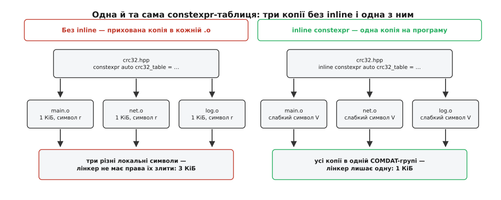

# ⚙️ Таблиця й перевірка, зроблені компілятором

Дві звичні задачі — згенерувати таблицю CRC-32 і звірити рядок формату з переліком аргументів — тут виконує сам компілятор; нижче видно рівно те, скільки байтів кожна з них лишає по собі в об'єктному файлі.

## Таблиця, якої ніхто не набирав руками

Побайтний CRC-32 тримається на таблиці з 256 записів по чотири байти: кожен запис — залишок від ділення одного байта на твірний многочлен. Звідки береться саме такий вигляд, пояснює [алгоритм CRC](topic:algorithms/crc-algorithm); тут важить лише те, що таблиця повністю визначена многочленом, а порахувати її — це вісім зсувів на кожен із 256 входів.

Здобути її можна трьома звичними способами, і кожен має ваду. Скрипт-генератор кладе в репозиторій заголовок із тисячею цифр, яких неможливо перевірити очима і які треба перегенеровувати щоразу, коли міняється многочлен. Побудова на старті додає роботу перед `main` — дрібницю на сервері й помітну затримку в прошивці, що має прокидатися за мілісекунди. Набирати руками нема чого й обговорювати.

Четвертий спосіб — написати генератор звичайним C++ і зажадати, щоб він відпрацював під час компіляції.

```cpp
#include <array>
#include <cstdint>
#include <string_view>

consteval std::array<std::uint32_t, 256> make_crc32_table() {
    std::array<std::uint32_t, 256> t{};
    for (std::uint32_t i = 0; i < 256; ++i) {
        std::uint32_t c = i;
        for (int bit = 0; bit < 8; ++bit)
            c = (c & 1u) ? (0xEDB88320u ^ (c >> 1)) : (c >> 1);
        t[i] = c;
    }
    return t;
}

inline constexpr std::array<std::uint32_t, 256> crc32_table = make_crc32_table();

constexpr std::uint32_t crc32(std::string_view data) {
    std::uint32_t crc = 0xFFFFFFFFu;
    for (unsigned char b : data)
        crc = crc32_table[(crc ^ b) & 0xFFu] ^ (crc >> 8);
    return crc ^ 0xFFFFFFFFu;
}

static_assert(crc32("123456789") == 0xCBF43926u);
```

Кожне слово тут вибране навмисно. `consteval` на генераторі: якби таблиця з якоїсь причини не порахувалася, потрібна помилка збірки, а не тихе перенесення роботи на старт програми — мовчазний відкат і є та вада, від якої ми тікаємо. `constexpr` на змінній вимагає, щоб значення існувало до запуску. `crc32` натомість лише `constexpr`, і це не недогляд: та сама функція рахує контрольну суму мережевого пакета в час виконання й контрольну суму літерала під час компіляції.

Останній рядок — самоперевірка. Число `0xCBF43926` — узаконене контрольне значення CRC-32/ISO-HDLC для рядка `123456789`, тобто того самого варіанта, що в zip, gzip і PNG. Помилиться хтось цифрою в многочлені чи переплутає напрямок зсуву — збірка впаде саме на цьому рядку.

> 🔧 **Навіщо це.** `static_assert` тут працює як тест, який не треба запускати: він відпрацьовує на кожній збірці, на кожній машині, ще до того, як з'явиться виконуваний файл, і не додає до нього жодного байта. Ні тестового каркаса, ні окремої цілі складання, ні прогону для нього не існує.

## Що з цього лягає в об'єктний файл

Покладімо весь наведений код у заголовок `crc32.hpp`, а поруч заведімо одну-єдину одиницю трансляції, яка цим кодом користується в час виконання:

```
$ cat crc32.cpp
#include "crc32.hpp"
std::uint32_t checksum(std::string_view s) { return crc32(s); }

$ g++ -std=c++23 -O2 -c crc32.cpp -o crc32.o
$ nm -C --defined-only --print-size crc32.o | grep crc32_table
0000000000000000 0000000000000400 V crc32_table
```

Розмір `0x400` — це 1024 байти, рівно 256 × 4. Таблиця лежить у секції даних лише для читання: у файлі вона вже готова, а коду, який її заповнює, не існує ніде. Як секції розкладені всередині файлу — [ELF: сегменти, секції, точка входу](topic:unix-linux/elf-structure).

Цікавіше те, чого в переліку символів немає. Крім цього рядка, у файлі лишився єдиний символ — наша власна `checksum`; усе інше, що брало участь у появі таблиці, зникло без сліду.

Символа `make_crc32_table` немає взагалі. Це не наслідок оптимізації, а обіцянка мови: негайна функція не має тіла в бінарнику, бо в час виконання її не існує. Немає й сліду від `static_assert` — перевірка відбулася й пішла разом із компілятором.

Не видно й `crc32`, хоч її кличуть по-справжньому: `constexpr` робить функцію неявно `inline`, тож окремої копії з власною адресою вона не потребує — оптимізатор уклав її тіло просто всередину `checksum`.

Ця сама команда — найдешевший спосіб упевнитися, що обчислення справді відбулося до запуску. Небезпека тут не гіпотетична. Напишіть на змінній `const` замість `constexpr` — і жодної вимоги рахувати зараз більше немає: доки ініціалізатор лишається сталим виразом, усе працює як раніше, а щойно хтось зніме `constexpr` із генератора або додасть у нього щось, чого обчислювач сталих не подужає, компілятор мовчки перенесе побудову таблиці на старт програми. Код збереться, тести пройдуть, вимірювання часу запуску здивує. Слід підміни видно відразу:

```
$ nm -C --defined-only crc32.o | grep GLOBAL__sub_I
0000000000000000 t _GLOBAL__sub_I_crc32.cpp
```

Цей символ — згенерована компілятором функція, чию адресу лінкер покладе в масив ініціалізаторів, які виконуються до `main`. Якщо ви розраховували на нульову вартість старту, поява `_GLOBAL__sub_I_` означає, що розрахунок не справдився. Із `consteval` на генераторі такої тихої підміни статися не може: невдале стале обчислення там — помилка збірки.

## Літера V у третій колонці

`V` означає слабкий символ. Компілятор поклав таблицю в окрему COMDAT-групу, і коли той самий `crc32.hpp` увімкнуть двадцять різних `.cpp`, лінкер лишить у програмі одну копію з двадцяти.

Тримає це слово `inline`. Приберіть його — і зміниться не швидкість, а розмір. `constexpr` на змінній має на увазі `const`, а `const`-змінна на рівні простору імен дістає внутрішнє зв'язування: у кожній одиниці трансляції з'являється власна, нікому не видима таблиця (`nm` покаже її малою `r`), і злити їх лінкер не має права — формально це різні об'єкти. Двадцять одиниць трансляції — двадцять кілобайтів замість одного. Чому `const` за межами функції поводиться саме так, розписано в [правилі одного визначення й зв'язуванні імен](topic:cpp-standards/odr-and-linkage).



*Слово `inline` не змінює жодного обчислення — воно вирішує лише те, скільки копій готової таблиці доживе до бінарника.*

Уточнення, без якого перший же вимір здивує: копія з'являється лише там, де таблицю справді читають у час виконання. Одиниця трансляції, у якій усе згорнулося до сталої, невживану внутрішню таблицю просто викине.

## Кілобайт на стеку

Ще одна пастка того самого роду — але вже не про розмір файлу, а про кожен виклик:

```cpp
std::uint32_t checksum(std::string_view s) {
    constexpr auto t = make_crc32_table();   // локальний об'єкт: 1 КіБ на кадр стека
    ...
}
```

`constexpr` на локальній змінній каже, **коли** обчислити значення, і нічого не каже про те, **де** воно житиме. Змінна лишається автоматичною, тож компілятор має право матеріалізувати цей кілобайт на стеку при кожному вході у функцію — і часто так і робить. Ліки — `static`: тоді таблиця лежить у тій самій незмінній секції, а її адреса та сама назавжди. До C++23 всередині `constexpr`-функції `static` було заборонене без вагомої причини; заборону зняв папір P2647R1 Баррі Ревзіна й Джонатана Вейклі, реалізований у GCC 13 і Clang 16.

## Перевірка, яка мусить упасти на збірці

Друга задача — рядок формату. Виклик `log("порт {} зайнято процесом {}", 8080)` має бути помилкою компіляції, а не порожнім місцем у виводі.

Прямий підхід не працює, і причина повчальна. Усередині `log` її параметр — звичайна змінна, а не стала: обчислювач сталих не може її прочитати, хоч би яким літералом її наповнили на місці виклику. Отже перевіряти треба раніше — у мить, коли літерал іще літерал, тобто **під час перетворення аргументу на тип параметра**.

```cpp
#include <format>
#include <iostream>
#include <string_view>
#include <type_traits>

consteval std::size_t count_slots(std::string_view s) {
    std::size_t n = 0;
    for (std::size_t i = 0; i < s.size(); ++i) {
        if (s[i] != '{') continue;
        if (i + 1 < s.size() && s[i + 1] == '{') { ++i; continue; }   // «{{» — екранована дужка
        if (i + 1 >= s.size() || s[i + 1] != '}')
            throw "у рядку формату є '{' без пари";
        ++n; ++i;
    }
    return n;
}

template <class... Args>
struct fmt_string {
    std::string_view text;
    consteval fmt_string(const char* s) : text(s) {
        if (count_slots(text) != sizeof...(Args))
            throw "кількість {} не збігається з кількістю аргументів";
    }
};

template <class... Args>
void log(fmt_string<std::type_identity_t<Args>...> f, Args&&... args) {
    std::cout << std::vformat(f.text, std::make_format_args(args...)) << '\n';
}

log("порт {} зайнято процесом {}", 8080, "nginx");   // добре
log("порт {} зайнято процесом {}", 8080);            // помилка компіляції
log("порт {", 8080);                                 // помилка компіляції
```

Робочим це роблять три деталі.

Конструктор `fmt_string` — негайний, тож кожне його вживання зобов'язане саме бути сталим виразом. Літерал ним є; `const char*`, прочитаний із конфігурації, — ні, і компілятор скаже про це на рядку виклику, а не десь у нетрях бібліотеки.

`throw` тут не обробляє помилку, а зупиняє обчислювач. Тексту повідомлення в бінарнику не буде: у час виконання цього конструктора не існує, тож рядок нікуди не потрапляє — компілятор лише покаже його в діагностиці разом із місцем виклику.

`std::type_identity_t` робить перший параметр невивідним контекстом. Без нього `Args` намагалися б виводитися ще й із самого рядка формату, і `sizeof...(Args)` рахував би не те. Це не навчальна вигадка: рівно так влаштований перший параметр `std::format` — тип `std::format_string<Args...>` із негайним конструктором, який звіряє рядок з аргументами ([format і print](topic:cpp-standards/format-and-print)).

Ціна всієї перевірки в готовій програмі — нуль: ні коду, ні рядків повідомлень.

## Скільки це коштує збірці

Обчислювач сталих не безмежний: у кожного компілятора є лічильники, які рвуть надто довге обчислення.

```
GCC     -fconstexpr-ops-limit=33554432   -fconstexpr-loop-limit=262144   -fconstexpr-depth=512
Clang   -fconstexpr-steps=1048576                                        -fconstexpr-depth=512
MSVC    /constexpr:steps100000                                           /constexpr:depth512
```

Наша таблиця — це 256 × 8 = 2048 обертів циклу, дрібниця за будь-яким із цих порогів. А от таблиця на 65536 записів або розбір конфігурації під час компіляції впираються насамперед у стелю MSVC, і діагностика при цьому говорить про вичерпаний ліміт кроків, а не про хибу в алгоритмі — упізнати причину з першого разу важко. Підняти межу прапорцем цілком законно, але платить за це кожна збірка, і саме тут вирішується, чи вартий обмін.
