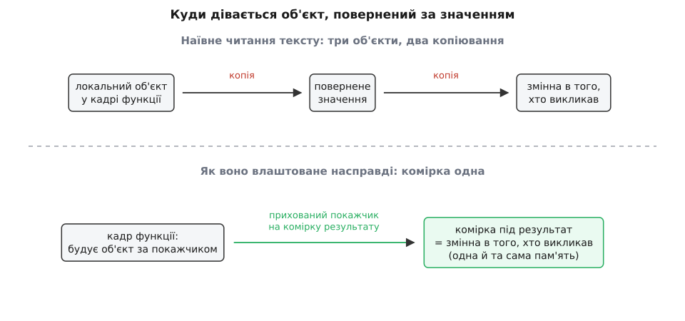
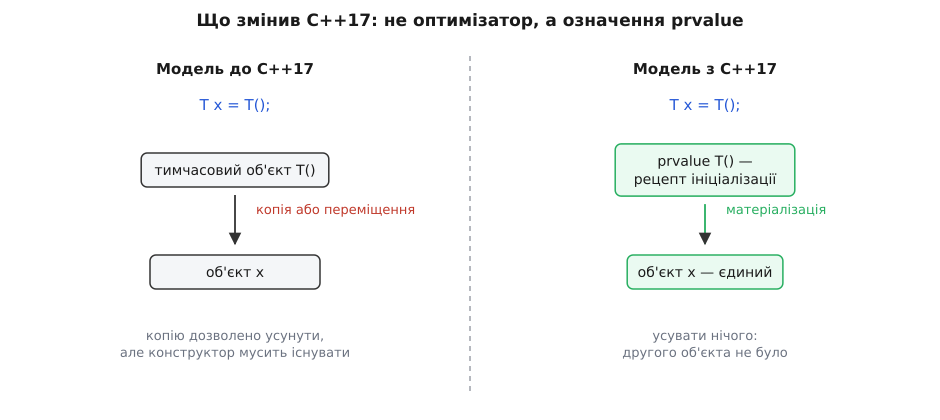
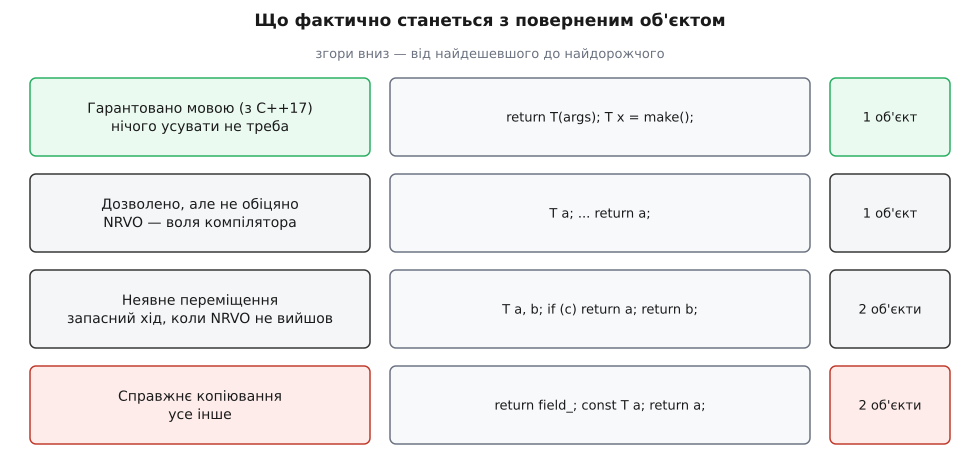

# Усунення копій і гарантований RVO

<preknowlist>
- [Категорії значень: lvalue, prvalue, xvalue](topic:cpp-standards/value-categories) — чим вираз, що позначає наявний об'єкт, відрізняється від виразу, що лише описує майбутнє значення.
- [Семантика переміщення і rvalue-посилання](topic:cpp-standards/move-semantics) — що робить конструктор переміщення й чому він дешевший за копіювання.
- [Правило п'яти й правило нуля](topic:cpp-standards/rule-of-five-zero) — конструктор копіювання, конструктор переміщення, деструктор і коли вони з'являються самі.
- [Час життя об'єкта](topic:cpp-standards/object-lifetime) — коли об'єкт починає існувати, коли перестає й хто його руйнує.
- [Правило «ніби» (as-if rule)](topic:programming/as-if-rule) — компіляторові вільно переписувати код, доки збігається спостережувана поведінка.
- [ABI та calling convention](topic:programming/abi-calling-convention) — як фізично передаються аргументи й повернене значення на рівні машинного коду.
</preknowlist>

Напишімо найзвичайнішу фабричну функцію — таку, яких у будь-якому C++-проєкті сотні:

```cpp
std::vector<double> read_samples(std::istream& in) {
    std::vector<double> data;
    for (double x; in >> x; )
        data.push_back(x);
    return data;
}

std::vector<double> v = read_samples(file);
```

Прочитаймо це буквально, за текстом мови. Усередині функції народжується вектор `data` — це справжній об'єкт із власною ділянкою в купі. Далі `return` **ініціалізує повернене значення** функції — а ініціалізувати об'єкт класу з іншого об'єкта того самого класу означає покликати конструктор. Тобто друга ділянка й побайтове перенесення мільйона чисел. Потім із цього поверненого значення ініціалізується змінна `v` у того, хто викликав, — третя ділянка й ще одне перенесення. Виходить: три об'єкти, два повні копіювання, і все це — щоб віддати назовні один-єдиний результат.

Якщо запустити цей код і подивитися лічильниками виділень пам'яті, побачите **одне** виділення й **нуль** копіювань. Ані з увімкненою оптимізацією, ані без неї зайвих об'єктів не буде. Питання, на яке варто відповісти до кінця: чому це законно, у яких саме випадках на це можна покластися як на обіцянку мови, а в яких — лише сподіватися на добрий настрій компілятора. Бо різниця між «зазвичай працює» і «гарантовано стандартом» тут не академічна: від неї залежить, чи можна взагалі повернути з функції об'єкт, який не вміє копіюватися.

### Чому це не могло бути «просто оптимізацією»

Перша спокуса — сказати: та це ж очевидна оптимізація, компілятор бачить, що копія нікому не потрібна, і викидає її. [Правило «ніби»](topic:programming/as-if-rule) дозволяє переписувати програму як завгодно, аби зберігалася спостережувана поведінка — от нехай і перепише.

Так не вийде, і на це є точна причина. Конструктор копіювання — це **звичайна функція, яку написали ви**. Ніщо не забороняє їй друкувати рядок у консоль, збільшувати глобальний лічильник, писати в журнал, реєструвати новий об'єкт у списку живих. Усе це — спостережувана поведінка в найточнішому сенсі стандарту. А отже, викинувши виклик такого конструктора, компілятор змінив би те, що видно ззовні, і правило «ніби» цього **не дозволяє**.

```cpp
struct Probe {
    Probe()             { std::puts("створено"); }
    Probe(const Probe&) { std::puts("скопійовано"); }
    ~Probe()            { std::puts("знищено"); }
};

Probe make() { Probe p; return p; }
int main()   { Probe q = make(); }
```

Скільки рядків має надрукувати ця програма? За буквою — «створено», два «скопійовано» і три «знищено». Правило «ніби» тут безсиле: кожен рядок — це справжній ввід-вивід, недоторканний.

Звідси й береться потреба в **окремому дозволі**. Мова мусила прямо сказати: у таких-от випадках копіювання вільно **не виконувати, навіть якщо конструктор має побічні дії**. Це записано в розділі стандарту `[class.copy.elision]` — «усунення копіювання» (англ. *elision*, від лат. *elidere* — виштовхувати, вилучати). Це єдиний виняток такого роду: єдине місце, де мова прямо дозволяє змінити видиму поведінку програми. І з'явився цей дозвіл ще в першому стандарті 1998 року — задовго до того, як у мові взагалі виникло переміщення.

> 🔧 **Навіщо це.** Розуміння, що усунення копій — **виняток із правила «ніби», а не оптимізація в його межах**, одразу пояснює дві практичні речі. Перше: не пишіть у конструкторі копіювання нічого, крім копіювання, — лічильники, журнали й реєстрації там дадуть різний результат на різних компіляторах, і це не буде помилкою компілятора. Друге: не будуйте тести на кількості викликів конструкторів; кількість об'єктів — не та величина, яку мова вам обіцяє.

### Де насправді живе повернене значення

Дозвіл дозволом, але як усунути копію фізично? Щоб об'єкт не переїжджав із місця на місце, його треба **одразу побудувати там, де він потрібен наприкінці**. Тож питання зводиться до: а де це — «там»?

Відповідь дає [домовленість про виклик](topic:programming/abi-calling-convention). Об'єкт класу зі змістовним конструктором чи деструктором не влізає в регістри й не може передаватися як число. Панівна на Linux, macOS і в світі ARM домовленість — Itanium C++ ABI — каже так: якщо тип «нетривіальний з погляду викликів» (має нетривіальний конструктор копіювання, конструктор переміщення чи деструктор, або всі його копіювальні й переміщувальні конструктори видалені), то повернене значення передається **через пам'ять**. Місце під нього виділяє **той, хто викликає**, а функція отримує на цю ділянку прихований покажчик — зайвий, невидимий у сигнатурі перший параметр. Функція будує результат прямо за цією адресою, а деструктор для нього потім кличе знову ж таки той, хто викликав.

Оце й є вся механіка. Комірка під результат існує **до** входу у функцію й належить тому, хто викликав. Тому «локальний об'єкт», «повернене значення» й «змінна на боці виклику» — це не обов'язково три різні ділянки: компіляторові вільно дати їм **одну спільну адресу**, і тоді копіювати просто нічого й нікуди.


*Наївне читання тексту дає три окремі об'єкти. Насправді комірку під результат виділяє той, хто викликає, і передає на неї прихований покажчик; функція будує свій локальний об'єкт прямо в ній. Три «різні» об'єкти отримують одну адресу — переносити між ними нічого.*

Зверніть увагу на межу цієї картини: вона стосується лише типів, що повертаються через пам'ять. Маленька структура з двох `int` без власного деструктора повертається в регістрах, і вся розмова про усунення копій до неї просто не застосовна — там немає ні комірки, ні покажчика на неї, а є два регістри, які ніхто й не думав «копіювати двічі».

### Дві різні речі під однією назвою

У жаргоні це все звуть RVO — *return value optimization*, оптимізація поверненого значення. Стандарт таких слів не вживає жодного разу; це традиційна назва з практики компіляторобудування. І під нею ховаються два випадки, що відрізняються так сильно, що плутати їх шкідливо.

**Перший — повернення тимчасового.** Функція повертає вираз, який позначає не наявний об'єкт, а рецепт нового:

```cpp
std::string make() { return std::string(64, '-'); }
```

Тут об'єктові нема звідки взятися заздалегідь: `std::string(64, '-')` — це [prvalue](topic:cpp-standards/value-categories), «чисте значення». Йому не потрібна власна адреса, у нього немає імені, ніхто не може взяти на нього покажчик. Тож компіляторові нічого не заважає збудувати рядок одразу в комірці результату. У жаргоні це URVO — *unnamed* RVO, для безіменного.

**Другий — повернення іменованої локальної змінної**, той самий випадок із вектором на початку:

```cpp
std::vector<double> make() {
    std::vector<double> data;
    data.push_back(1.0);
    return data;
}
```

Це NRVO — *named* RVO. І тут ситуація принципово інша: `data` — це справжній об'єкт із іменем, який живе весь час до `return`, має адресу, і на нього можна взяти покажчик. Щоб копії не сталося, компілятор мусить ухвалити рішення **наперед**: розмістити `data` не в кадрі функції, а прямо в комірці результату, ще до першого `push_back`. Це не «викидання копії наприкінці», це **інший вибір розкладки пам'яті на початку**.

Умови, за яких така підміна взагалі дозволена, стандарт перелічує вузько: повертається **ім'я** об'єкта (не поле, не результат виразу), об'єкт має автоматичну тривалість зберігання (звичайна локальна змінна, не `static`, не глобальна), не є `volatile`, не є параметром функції чи параметром `catch`, і тип у нього **той самий**, що й тип повернення, з точністю до `const`.

### Де NRVO зривається

Умови вище — необхідні, але не достатні: навіть коли все сходиться, компілятор **не зобов'язаний**. І є типові конструкції, на яких він майже напевно відступить.

**Дві змінні на двох гілках.** Комірка результату одна, а кандидатів на неї двоє:

```cpp
std::vector<int> choose(bool cond) {
    std::vector<int> a(1000), b(1000);
    if (cond) return a;
    return b;
}
```

Обидві змінні живуть одночасно й мусять мати різні адреси. Компілятор може віддати комірку щонайбільше одній із них — і на практиці здебільшого не бере жодної, бо не знає, яка гілка виконається. Друга піде переміщенням. Лікується не хитрощами, а перебудовою: одна змінна, одна точка `return`.

**Повернення поля.** `return buffer_;` — це не ім'я локального об'єкта, а звернення до члена, який переживе виклик. Об'єкт нікуди не подінеться після повернення, отже його треба справді копіювати.

**Повернення параметра.** Параметр, переданий за значенням, теж лежить у пам'яті, яку виділив той, хто викликав, — але **в іншому місці**, за домовленістю про виклик. Перенести його в комірку результату компілятор не може, бо розкладку параметрів диктує ABI, а не він.

**Локальна змінна з `const`.** Усунення копії тут ще дозволене — але якщо воно не вийде, запасний хід теж не спрацює: із `const`-об'єкта не можна переміщувати. Буде повноцінна копія.

Практичний висновок з усього переліку один і він простий: **NRVO — це не обіцянка, а сприятливий збіг**, і код варто писати так, щоб цей збіг траплявся сам. Одна локальна змінна потрібного типу, одна точка виходу — і компілятори всі як один спрацьовують.

### Ціна необов'язковості

Поки усунення копії лишалося **дозволеним, але не обов'язковим**, з цього випливав наслідок, що болів значно сильніше за зайве копіювання.

Дозвіл не виконувати копіювання не скасовував вимоги, щоб копіювання було **можливим**. Компілятор мусив, як завжди, вибрати конструктор, перевірити його доступність і те, що він не видалений, — і аж потім не кликати його. Це означало просту, але дуже неприємну річ: **функція не могла повернути за значенням тип, який не вміє копіюватися чи переміщуватися**. Ніякої фабрики для `std::mutex`, для `std::atomic<int>`, для власного типу з видаленими копіюванням і переміщенням — хоч копії насправді б і не було, код просто не компілювався.

Другий наслідок — розбіжність між збірками. У GCC й Clang є прапорець `-fno-elide-constructors`, який вимикає необов'язкові усунення; та й без нього на `-O0` компілятор часто не морочився з NRVO. Тож той самий текст давав різну кількість викликів конструкторів у debug і release — і код, що на це спирався, розсипався саме тоді, коли до нього доходили руки.

### Запасний хід: неявне переміщення

Коли в мові з'явилося [переміщення](topic:cpp-standards/move-semantics), напрошувалося очевидне пом'якшення: якщо усунути копію не вдалося, нехай замість копіювання буде принаймні переміщення. Логіка залізна: об'єкт, що ось-ось загине наприкінці функції, вже нікому не потрібен, тож розібрати його на запчастини безпечно.

Саме так і зробили — у C++11, разом із самим переміщенням. У первісному формулюванні правило звучало так: якщо умови для усунення копії виконані — **або були б виконані, якби не те, що джерело є параметром функції**, — то компілятор спершу добирає конструктор так, **ніби локальний об'єкт був rvalue**. Знайшовся конструктор переміщення — буде переміщення; ні — тоді копіювання.

Тому `return data;` ніколи не робить дорогої копії вектора: у найгіршому разі це переміщення покажчика. Але «найгірший випадок» тут не безкоштовний: об'єкт усе одно **конструюється двічі й руйнується двічі**, просто дешево. Для вектора це кілька наносекунд, для типу з десятком полів-рядків — вже помітно.

І тут ховається класична пастка, яку варто запам'ятати назавжди:

```cpp
std::vector<int> bad() {
    std::vector<int> data(1000);
    return std::move(data);   // ← гірше, ніж без std::move
}

std::vector<int> good() {
    std::vector<int> data(1000);
    return data;              // ← NRVO можливий
}
```

Причина точна й механічна. Умова усунення вимагає, щоб операндом `return` було **ім'я об'єкта**. `std::move(data)` — це вже не ім'я, а виклик функції. Умова не виконана — усунення заборонене, і замість «нуль конструкторів» ви гарантовано отримуєте один конструктор переміщення й один зайвий деструктор. Написавши `std::move`, ви не допомогли компіляторові, а забрали в нього єдиний варіант, кращий за переміщення.

> 🔧 **Навіщо це.** Правило для щоденного письма коротке: **не пишіть `std::move` у `return` для локальної змінної**. Ані потреби, ані користі — лише зіпсований NRVO. Виняток один, і він теж механічний: якщо повертається параметр, переданий за значенням, NRVO неможливий у принципі, а неявне переміщення там і так застосується — тож `std::move` знову зайвий. `std::move` у `return` доречний, по суті, лише коли ви повертаєте поле об'єкта, який свідомо руйнуєте, або елемент контейнера, з якого забираєте вміст.

### C++17: змінили не оптимізатор, а модель

Усі три болячки — зайві конструктори там, де об'єкт і так один; неможливість фабрики для типу, що не рухається; різниця між debug і release — впиралися в один спільний корінь. Мова описувала `T()` як **тимчасовий об'єкт**, а потім довго й марудно пояснювала, за яких умов його можна не створювати. Спроби просто дописати «а тут копіювання обов'язково усувається» щоразу спотикалися: доводилося окремо казати, що конструктор при цьому не потрібен, що адреси збігаються, що деструктор не викликається двічі.

Річард Сміт у папері P0135, ухваленому до C++17, зайшов з іншого боку: не додавати нових дозволів, а **перевизначити, що таке prvalue**. У новій моделі prvalue — це вже **не об'єкт, а рецепт ініціалізації**: опис того, як створити об'єкт, коли й де він знадобиться. Справжній об'єкт постає лише в момент, коли він комусь потрібен як об'єкт — це називають **матеріалізацією тимчасового** (англ. *temporary materialization*). А якщо ви ініціалізуєте prvalue'ом змінну того самого типу, матеріалізація відбувається **прямо в цій змінній**.

Наслідок формулюють так: гарантоване усунення копій нічого не усуває. Немає другого об'єкта, який можна було б усунути; він і не з'являвся.


*До C++17 `T x = T();` описували як створення тимчасового об'єкта й наступне копіювання, яке дозволено — але не обов'язково — усунути; конструктор копіювання при цьому мусив існувати. З C++17 prvalue взагалі не позначає об'єкта: об'єкт матеріалізується один раз, одразу в `x`. Усувати нема чого, конструктор не потрібен.*

Що саме гарантовано: **ініціалізація об'єкта з prvalue того самого типу** (з точністю до `const`/`volatile`) не створює й не знищує жодного проміжного об'єкта. Це покриває всі щоденні випадки:

```cpp
T x = T(args);            // ← жодного проміжного об'єкта
T y = make();             // ← якщо make() повертає T за значенням
T make() { return T(a); } // ← результат будується в комірці виклику
take(T(a));               // ← параметр за значенням будується на місці
```

Гарантія не залежить від рівня оптимізації: вона діє на `-O0`, у налагоджувальній збірці, і `-fno-elide-constructors` її не вимикає — цей прапорець впливає лише на випадки, що лишилися необов'язковими.

Найважливіше практичне наслідування — те, чого не було раніше. Оскільки копіювання **не відбувається за визначенням**, конструктор копіювання чи переміщення більше не потрібен навіть як формальність. Тому це працює:

```cpp
std::mutex make_mutex() { return std::mutex(); }
std::mutex m = make_mutex();     // ← коректно з C++17
```

`std::mutex` не копіюється й не переміщується — і все одно повертається за значенням із фабричної функції. Так само можна повертати `std::atomic`, обгортки над операційними ресурсами, будь-які типи, прив'язані до власної адреси. Ціла категорія API, яка раніше змушувала повертати `std::unique_ptr` замість значення, перестала бути потрібною.

Про те, як мова йшла до цього рішення — від першого дозволу 1998 року до відкриття, що prvalue взагалі не мусить бути об'єктом, — оповідає [окрема історія цього повороту](topic:cpp-standards/copy-elision/hist-guaranteed-elision.md): там і причини, чому попередні підходи не працювали, і те, чого комітет свідомо не став гарантувати.

### Чому іменовану змінну не зробили гарантованою

Природне питання: якщо prvalue вдалося переописати так, що копія зникла сама, чому те саме не зробили з NRVO?

Бо різниця між ними не термінологічна, а фізична. Prvalue не має адреси, поки не матеріалізується, — тому переописати його як «рецепт» нічого не ламає. Іменована локальна змінна **має адресу від першого рядка**: її можна віддати в чужу функцію, зберегти в списку, порівняти з іншим покажчиком. Гарантувати, що ця адреса збігається з коміркою результату, означає гарантувати конкретну **розкладку пам'яті** — а це вже зобов'язання перед ABI, а не перед семантикою мови. І гарантувати треба було б у всіх випадках, включно з двома змінними на двох гілках, де це просто неможливо: комірка одна.

Спроба таки це зробити була. Антон Жилін подавав папір P2025, який пропонував зробити NRVO обов'язковим у чітко окресленому наборі випадків; папір пройшов кілька редакцій, отримав від комітету статус «потребує доопрацювання» і в стандарт не ввійшов. Тож станом на сьогодні поділ такий: **безіменне — обіцянка мови, іменоване — добра воля компілятора**.

### Решта дозволених усунень

Крім двох головних випадків, стандарт дозволяє (не гарантуючи) не робити копії ще в трьох місцях. Усі три пов'язані з тим, що об'єкт і так має бути перенесений кудись, звідки його потім заберуть.

**Кидання винятка.** У `throw x;`, де `x` — локальна змінна, чия область видимості не виходить за найближчий `try`, компіляторові вільно збудувати об'єкт винятка одразу на місці `x`, без копіювання. Це має сенс: [об'єкт винятка](topic:cpp-standards/exceptions-mechanism) все одно живе в окремій ділянці, яку виділяє рантайм, — то нехай локальна змінна від початку буде саме там.

**Перехоплення за значенням.** Якщо обробник оголошений як `catch (Error e)`, то замість копіювання об'єкта винятка в `e` компілятор може зробити `e` **просто іншим іменем** для самого об'єкта винятка. Копії не буде — але покладатися на це не варто: якщо обробник змінює `e`, то чи побачить ці зміни повторне кидання через `throw;`, залежить від компілятора. Саме тому виняток ловлять за посиланням на константу.

**Параметр корутини.** [Корутина](topic:cpp-standards/coroutines) за правилами робить власні копії своїх параметрів у кадрі, який живе в купі; стандарт дозволяє ці копії не робити, а посилатися на оригінальні параметри — там, де компілятор може довести, що це безпечно.

### Доточування: C++20 і C++23

Дві останні редакції стандарту нічого не змінили в самому усуненні копій, зате прибрали дірки в **запасному ході** — неявному переміщенні. Дірки були дрібні на вигляд, але кожна виявлялася в реальному коді як несподівана дорога копія.

C++20 прийняв папір P1825, що об'єднав дві пропозиції: P0527 Девіда Стоуна й P1155 Артура О'Двайєра. Разом вони розширили коло того, що вважається «неявно переміщуваним»: тепер сюди належать і локальні змінні типу rvalue-посилання (раніше `return r;` для `T&& r` робило копію — прикрий і зовсім не очевидний випадок), і випадки, коли тип повернення **не збігається** з типом змінної. Останнє важливе для звичайнісіньких речей на кшталт функції, оголошеної як `std::optional<std::string>`, у якій повертають локальний `std::string`, — до C++20 там була копія.

C++23 прийняв P2266 того ж Артура О'Двайєра — «простіше неявне переміщення». Річ у тім, що доти правило описували через **два послідовні добори перевантажень**: спершу спробувати, ніби операнд rvalue, а якщо не вийшло — ще раз, ніби lvalue. Це було єдине місце в мові з таким подвійним добором, і воно ж породжувало дефект: до функцій, що повертають посилання, неявне переміщення не застосовувалося зовсім. P2266 замінив усе це одним твердженням: **ім'я, придатне до переміщення, у `return` завжди є xvalue**. Один добір замість двох, дефект закритий. Ціна — невелика зміна поведінки в кількох рідкісних конструкціях; польова перевірка на великих кодових базах, яку автор провів перед ухваленням, знайшла одиничні місця.

### Що станеться з вашим `return`

Складімо все в одну картину — драбину, якою скочується конкретний `return`, доки не знайде найдешевший дозволений варіант.


*Що фактично відбувається з поверненим об'єктом, згори вниз — від найдешевшого до найдорожчого. Перший щабель обіцяє мова, другий залежить від компілятора, третій і четвертий — те, що лишається, коли перші два не спрацювали.*

**Верхній щабель** — повернення prvalue: `return T(args);` або передавання результату однієї функції прямо в іншу. Проміжних об'єктів немає за визначенням, конструктора копіювання може взагалі не існувати. Це обіцянка мови.

**Другий** — NRVO для іменованої локальної змінної. Здебільшого спрацьовує, але не обіцяний; конструктор переміщення мусить бути доступний.

**Третій** — неявне переміщення, коли NRVO не вийшов: об'єкт таки конструюється двічі, зате дешево.

**Четвертий** — справжня копія. Сюди потрапляють повернення поля, повернення `const`-локальної змінної й повернення `volatile`-об'єкта.

Звідси й правила письма, які не треба запам'ятовувати окремо — вони випливають із драбини самі. Повертайте за значенням і не бійтеся: тип, що повертається дорого, — це або поле, або `const`, і те й те видно оком. Тримайте **одну** локальну змінну потрібного типу й **одну** точку виходу — це те єдине, чим ви реально допомагаєте NRVO. Не пишіть `std::move` у `return` локальної змінної. І якщо фабрика має віддавати щось, прив'язане до власної адреси, — просто поверніть це за значенням як prvalue, бо з C++17 це працює.

Побачити всю драбину на власні очі — з точними лічильниками конструкторів на різних стандартах і прапорцях — можна на невеликому [піддослідному типі, що звітує про кожен свій крок](topic:cpp-standards/copy-elision/proj-copy-probe.md): це найшвидший спосіб перевірити, що робить саме ваш компілятор, а не «компілятор узагалі».
