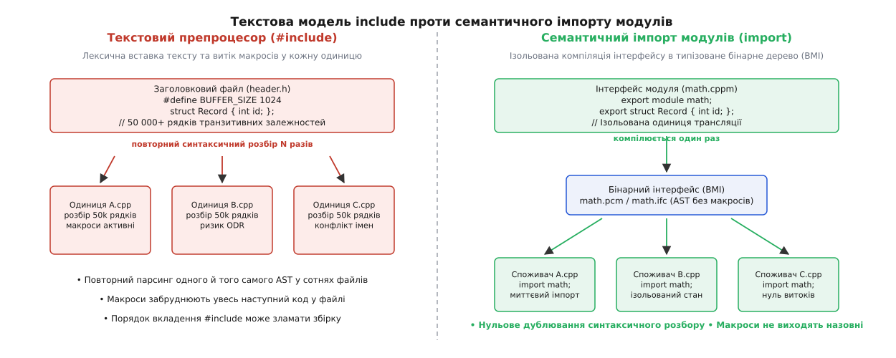
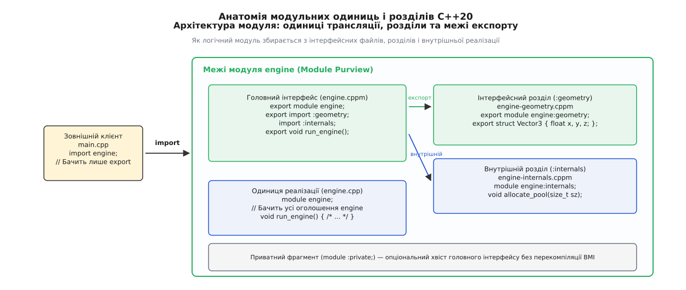
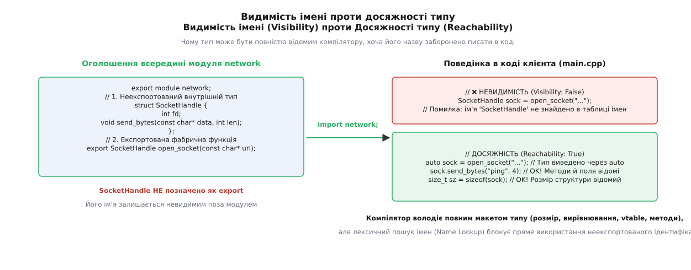
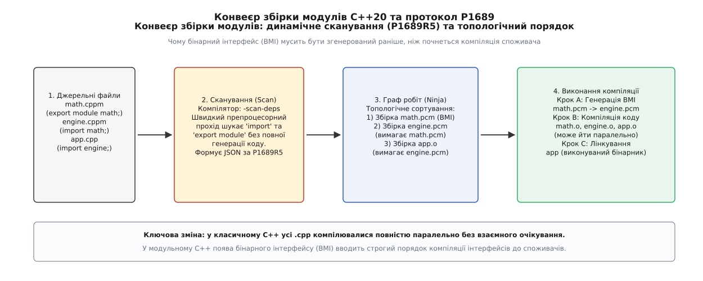

# Модулі C++20: інтерфейс замість заголовка

<preknowlist>
- [Одиниці трансляції та ODR](topic:cpp-standards/odr-and-linkage) — як компілятор транслює кожен .cpp окремо й де виникає дублювання символів.
- [Простори імен та ADL](topic:cpp-standards/namespaces-and-adl) — пошук імен, залежний від аргументів, та ізоляція ідентифікаторів.
- [Шаблони C++](topic:cpp-standards/templates-basics) — чому інстанціація шаблонів вимагає визначення типу у кожній точці виклику.
- [Паттерн Pimpl](topic:cpp-standards/pimpl) — спроби приховати деталі реалізації за покажчиком для скорочення часу збірки.
- [Граф залежностей системи збірки](topic:build-systems/dependency-graph) — топологічний порядок компіляції файлів та артефактів.
</preknowlist>

Компілятор C++ починає збірку проєкту на кілька сотень тисяч рядків коду, і перше, що він робить у кожному з тисячі джерельних файлів `.cpp`, — розгортає препроцесорну директиву `#include <vector>` у 25 000 рядків внутрішнього тексту. Якщо додати сюди `<iostream>`, `<algorithm>`, Boost та внутрішні заголовки проєкту, один скромний файл джерела на тридцять рядків логіки перед початком власне компіляції перетворюється на велетенське полотно з 400 000 рядків сирого тексту. Компілятор змушений тисячу разів поспіль виконувати лексичний аналіз тих самих шаблонів, будувати для них ідентичні абстрактні синтаксичні дерева в оперативній пам'яті, знову й знову перевіряти типи та шукати перевантаження операторів.

Ця модель текстового включення з'явилася в мові C у 1972 році як вимушений інженерний компроміс для машин із пам'яттю у кілька десятків кілобайтів. Вона не знає внутрішньої структури мови: препроцесор працює зі сліпими послідовностями символів до початку семантичного аналізу. Головна плата за такий підхід — повна відсутність ізоляції просторів імен від макросів, постійний ризик порушення правила єдиного визначення (ODR) та вибухове зростання часу компіляції.

Модулі C++20 замінюють лексичне копіювання тексту **семантичним імпортом типізованих одиниць трансляції**. Замість повторного синтаксичного розбору тексту джерела компілятор транслює інтерфейс модуля один раз у структуроване бінарне представлення, а всі споживачі завантажують готові символи за мікросекунди без жодного ризику витоку макросів.

## Механізм текстового препроцесора та його вади

Щоб зрозуміти архітектуру модульної системи, необхідно детально розібрати внутрішній конвеєр компіляції класичного C++ та з'ясувати, де саме виникають нездоланні вузькі місця. 

Класичний конвеєр трансляції складається з чотирьох послідовних фаз: препроцесор → лексичний і синтаксичний аналізатор (парсер абстрактного синтаксичного дерева AST) → семантичний аналіз, зв'язування імен і перевірка типів → оптимізація та кодогенерація машинного коду. Директива `#include "header.h"` виконується на найпершій фазі: препроцесор відкриває файл на диску, зчитує його байти й лексично підставляє їх у поточну позицію джерела, створюючи єдиний гігантський проміжний потік лексем. Оскільки препроцесор не має уявлення про семантику мови, будь-який макрос із підключеного файлу автоматично стає активним для всього наступного коду цієї одиниці трансляції.



*Текстовий препроцесор копіює синтаксичний шум і макроси в кожну одиницю трансляції, тоді як модуль компілює типізоване дерево інтерфейсу один раз.*

З такої примітивної текстової заміни випливають чотири фундаментальні проблеми, які ускладнювали розробку на C++ упродовж десятиліть:

### 1. Колосальне дублювання синтаксичного розбору (AST Parsing Overhead)
Якщо заголовковий файл `types.h` підключається у 500 джерельних файлах `.cpp`, компілятор змушений 500 разів викликати лексер, 500 разів будувати синтаксичні дерева класів і методів та 500 разів проводити перевірку відповідності типів. Якщо заголовок містить важкі шаблони STL, обсяг повторно розібраного тексту в проекті вимірюється гігабайтами на кожну збірку.

### 2. Токсичність макросів та відсутність ізоляції (Macro Leakage)
Макроси препроцесора (`#define`) не підкоряються жодним правилам областей видимості чи просторів імен. Макрос, визначений в одному сторонньому заголовку, протікає в усі наступні заголовки та джерела цієї одиниці трансляції. Сумнозвісний заголовок `windows.h` визначав макроси `min` і `max`, які руйнували виклики стандартних функцій `std::min`, `std::max` та числових трейтів `std::numeric_limits<T>::max()`. Інженери були змушені застосовувати захисні хаки: писати `#define NOMINMAX` або брати виклики методів у додаткові круглі дужки: `(std::max)(a, b)`.

### 3. Залежність від порядку підключення (Include Order Dependency)
Якщо заголовок `A.h` містить неявну залежність від типу, оголошеного в `B.h`, але забув зробити прямий `#include "B.h"`, успішність збірки залежатиме виключно від випадкового порядку рядків у файлі споживача. Рядок `#include "B.h"` перед `#include "A.h"` компілюється, тоді як протилежний порядок видає загадкову помилку компіляції. Це породжує крихкі кодові бази, де будь-яка зміна порядку сортування заголовків ламає компіляцію всього проекту.

### 4. Приховані ODR-катастрофи (One Definition Rule Violations)
Якщо один заголовковий файл підключається в одному `.cpp` з активним макросом `#define _DEBUG`, а в іншому `.cpp` — без нього, компілятор створює дві версії структури з різним розташуванням полів у пам'яті (layout). Компілятор не бачить помилки, лінкер сліпо об'єднує однакові назви символів, а програма падає у продакшені через пошкодження пам'яті під час передачі об'єкта між цими модулями.

Програмісти намагалися пом'якшити ці проблеми за допомогою прекомпільованих заголовків (PCH), патерну Pimpl або єдиних файлів збірки (Unity builds), проте це були тимчасові інженерні милиці. Повний історичний шлях від ранніх модульних пропозицій до об'єднаного стандарту описано в [хроніці еволюції модулів у C++](topic:cpp-standards/cpp-modules/hist-modules-evolution.md).

## Семантичний імпорт: нова модель одиниці трансляції

Модуль у C++20 — це самодостатня, **ізольована одиниця трансляції** (Module Translation Unit). Коли компілятор обробляє інтерфейс модуля, він компілює його у внутрішній бінарний артефакт — **бінарний інтерфейс модуля (BMI / Built Module Interface)**. 

BMI зберігає повністю типізоване, семантично перевірене синтаксичне дерево (AST), таблиці символів, макети класів, сигнатури функцій та визначення шаблонів у попередньо розібраному стані. У сучасних компіляторах Clang та MSVC бінарний інтерфейс організовано як відображуваний у пам'ять (memory-mapped) блок серіалізованих вузлів AST. Коли інший джерельний файл виконує інструкцію `import my_module;`, компілятор не відкриває вихідний текст, не викликає лексер і не запускає препроцесор. Він миттєво підключає сторінки пам'яті з готовим типізованим деревом символів у свою внутрішню таблицю імен за мікросекунди без жодних накладних витрат на синтаксичний розбір.

Головні фундаментальні інваріанти модульної моделі:

- **Повна ізоляція препроцесора на виході**: жоден `#define`, оголошений всередині модуля, не виходить за його межі й не може вплинути на споживача, який виконав `import`.
- **Повна ізоляція препроцесора на вході**: якщо споживач оголосив `#define BUFFER_SIZE 512` перед рядком `import my_module;`, цей макрос жодним чином не змінить внутрішніх констант чи коду всередині модуля `my_module`.
- **Комутативність та імунітет до порядку**: інструкції `import A; import B;` та `import B; import A;` дають абсолютно однаковий результат за будь-яких умов.

## Анатомія модульного файлу та його зони

Джерельний файл модульного інтерфейсу має чітко структуровану анатомію. Розглянемо базовий синтаксис інтерфейсної одиниці:

```cpp
// 1. Глобальний фрагмент модуля (Global Module Fragment) — опціональний
module;

#include <cstdlib>
#include <sys/types.h>

// 2. Оголошення преамбули модуля (Module Preamble)
export module math.geometry;

// 3. Секція імпорту залежностей
import <cmath>;
import <vector>;

// 4. Сфера дії модуля (Module Purview)
export namespace math {

struct Point {
    double x{0.0};
    double y{0.0};
};

[[nodiscard]] export double distance(Point a, Point b) noexcept {
    const double dx = a.x - b.x;
    const double dy = a.y - b.y;
    return std::sqrt(dx * dx + dy * dy);
}

} // namespace math
```

Розберемо послідовно призначення кожного з чотирьох структурних блоків:

### 1. Глобальний фрагмент модуля (`module;`)
Якщо модуль використовує класичні C-бібліотеки або системні заголовки операційної системи (наприклад, `<unistd.h>`, `<fcntl.h>`, `<windows.h>`), їх не можна підключати через `#include` всередині сфери модуля, бо тоді системні функції стануть частиною вашого модуля.

Для цього існує **глобальний фрагмент модуля**: він відкривається ключовим словом `module;` на першому рядку файлу перед декларацією самого модуля. Усередині нього дозволені **виключно директиви препроцесора** (`#include`, `#define`, `#ifdef`). Компілятор обробляє ці заголовки у традиційному глобальному просторі імен, використовує їх для компіляції поточного файлу, але під час генерації фінального BMI **повністю очищає всі макроси**. Клієнти, які напишуть `import math.geometry;`, не отримають жодного побічного макросу із системних файлів.

### 2. Декларація модуля (`export module <name>;`)
Цей рядок встановлює офіційну межу: файл стає головною інтерфейсною одиницею модуля (Primary Module Interface Unit) з логічним іменем `math.geometry`.

Крапка в назві модуля не створює простору імен у мові й не прив'язана до структури папок на диску. Це єдиний монолітний ідентифікатор для системи компіляції.

### 3. Секція імпорту
Усі інструкції `import` мають бути згруповані на початку файлу одразу після преамбули. Модуль декларує свої прямі залежності від інших модулів або заголовкових одиниць.

### 4. Сфера дії модуля (Module Purview)
Усе, що знаходиться від рядка `export module` до кінця файлу, належить до сфери модуля. 

Сутності всередині цієї сфери мають два рівні доступу:
- **Експортовані (`export`)**: публічний контракт модуля. Вони потрапляють до BMI та стають доступними зовнішнім клієнтам через `import`.
- **Неекспортовані (без `export`)**: отримують спеціальний вид компонування — **модульне компонування (Module Linkage)**. Вони доступні всім файлам цього модуля (включаючи одиниці реалізації та розділи), але надійно сховані від зовнішнього світу.

Повний синтаксичний довідник усіх дозволених форм ключових слів наведено в [довідці синтаксису оголошень модулів](topic:cpp-standards/cpp-modules/api-module-declarations.md).

## Інтерфейсні одиниці проти одиниць реалізації

У великих промислових проектах розміщення всього вихідного коду в одному файлі інтерфейсу суперечить принципам швидкої інкрементальної збірки. Якщо ви зміните тіло приватної функції всередині файлу `.cppm`, компілятор змушений згенерувати новий бінарний інтерфейс (BMI), що викличе ланцюгову перекомпіляцію всіх залежних клієнтських файлів.

Для розв'язання цієї проблеми C++20 пропонує розділяти модуль на **інтерфейсні одиниці** та **одиниці реалізації**:



*Модуль декомпозується на головний інтерфейс, відкриті та закриті розділи і файли реалізації, контролюючи доступність символів на рівні компілятора.*

### 1. Головна інтерфейсна одиниця (Primary Interface Unit, `.cppm` / `.ixx`)
Містить декларацію `export module <name>;`, оголошення структур, класів, концептів, констант і прототипів функцій:

```cpp
// Файл: network.cppm
export module network;

export namespace net {

class TcpSocket {
public:
    TcpSocket();
    ~TcpSocket();
    void connect(const char* host, int port);
    void send(const char* data, int len);
private:
    int m_native_handle{-1};
};

} // namespace net
```

### 2. Одиниця реалізації модуля (Module Implementation Unit, `.cpp`)
Починається декларацією `module <name>;` без ключового слова `export`. Вона належить до сфери модуля `network`, автоматично бачить усі його типи та внутрішні змінні, але **не генерує нового бінарного інтерфейсу (BMI)**:

```cpp
// Файл: network.cpp
module network;

#include <sys/socket.h>
#include <unistd.h>

namespace net {

TcpSocket::TcpSocket() = default;

TcpSocket::~TcpSocket() {
    if (m_native_handle >= 0) {
        ::close(m_native_handle);
    }
}

void TcpSocket::connect(const char* host, int port) {
    // Низькорівневий виклик операційної системи
}

void TcpSocket::send(const char* data, int len) {
    // Логіка відправлення мережевих пакетів
}

} // namespace net
```

Коли розробник змінює алгоритм у `network.cpp`, система збірки перекомпілює виключно об'єктний файл `network.o` і запускає компонувальник. Усі клієнтські файли, які використовують `import network;`, залишаються недоторканими, оскільки файл `network.pcm` (BMI) не зазнав жодних змін.

> 🔧 **Навіщо це.** Це пряма інженерна заміна класичного патерну Pimpl (Pointer to Implementation). Раніше для приховування деталей реалізації доводилося виносити внутрішній стан у структуру `Impl`, виділяти для неї пам'ять у купі через `std::unique_ptr` та втрачати кеш-локальність процесора під час кожного розіменування. Одиниці реалізації модулів дозволяють зберігати приватні поля прямо всередині класу без розкриття деталей їхньої обробки споживачам.

## Розділи модулів (Module Partitions)

Коли модуль масштабується до сотень функцій і типів, зберігати його інтерфейс в одному файлі стає незручно. Якщо ж розбити його на кілька незалежних модулів (наприклад, `math.types`, `math.ops`), споживач бібліотеки буде змушений самостійно вивчати та імпортувати десятки дрібних модулів.

Для елегантної внутрішньої декомпозиції C++20 запроваджує **розділи модулів (Module Partitions)**. Розділ — це внутрішній підфайл, який належить конкретному модулю та позначається двокрапкою: `<module_name>:<partition_name>`.

Розділи бувають двох видів:

### 1. Інтерфейсні розділи (Interface Partitions)
Оголошуються директивою `export module <module>:<partition>;`. Вони можуть містити сутності зі специфікатором `export`. Головна інтерфейсна одиниця модуля зобов'язана реекспортувати інтерфейсний розділ за допомогою інструкції `export import :<partition>;`:

```cpp
// Файл: math_geometry.cppm
export module math:geometry;

export namespace math {
struct Vector3 { float x, y, z; };
}
```

```cpp
// Файл: math.cppm (Головний інтерфейс)
export module math;

// Реекспорт інтерфейсного розділу: споживачі 'import math;' автоматично бачать Vector3
export import :geometry;

export namespace math {
Vector3 add(Vector3 a, Vector3 b);
}
```

### 2. Внутрішні розділи реалізації (Internal Partitions)
Оголошуються як `module <module>:<partition>;` без префікса `export`. Вони слугують для обміну допоміжними алгоритмами та типами між різними джерельними файлами самого модуля і ніколи не потрапляють до публічного API:

```cpp
// Файл: math_internals.cppm
module math:internals;

namespace math::detail {
inline constexpr float EPSILON = 1e-6f;
bool is_nearly_zero(float val);
}
```

```cpp
// Файл: math.cpp (Одиниця реалізації)
module math;

// Імпорт внутрішнього розділу для внутрішніх потреб
import :internals;

namespace math {
Vector3 add(Vector3 a, Vector3 b) {
    if (detail::is_nearly_zero(a.x)) { /* ... */ }
    return {a.x + b.x, a.y + b.y, a.z + b.z};
}
}
```

Клієнтський код не має права імпортувати розділи напряму (рядки на зразок `import math:geometry;` викликають помилку). Споживач завжди бачить єдиний стабільний інтерфейс `import math;`.

## Приватний фрагмент модуля (`module :private;`)

Для невеликих та середніх модулів поділ на два окремі файли (`.cppm` та `.cpp`) іноді створює зайвий шум у структурі папок. C++20 пропонує компроміс: **приватний фрагмент модуля (Private Module Fragment)**.

Він дозволяє розмістити оголошення інтерфейсу та його повну реалізацію в одному джерельному файлі, але на рівні компілятора гарантує, що тіла функцій не потраплять у відкритий BMI:

```cpp
export module crypto.aes;

export class AesEncryptor {
public:
    AesEncryptor();
    void set_key(const char* key, int len);
    void encrypt_block(const void* in, void* out);
private:
    void expand_key_schedule();
};

// Межа приватного фрагмента: усе нижче цього рядка не потрапляє у відкритий BMI
module :private;

AesEncryptor::AesEncryptor() = default;

void AesEncryptor::set_key(const char* key, int len) {
    expand_key_schedule();
}

void AesEncryptor::expand_key_schedule() {
    // Внутрішня важка криптографічна математика
}

void AesEncryptor::encrypt_block(const void* in, void* out) {
    // Операції над байтами
}
```

### Механічні інваріанти приватного фрагмента:
1. **Ізоляція хешу BMI**: зміна коду нижче `module :private;` змінює лише фінальний машинний код об'єкта, але залишає незмінним синтаксичний хеш інтерфейсу BMI. Клієнти, які імпортують `crypto.aes`, не перекомпілюються.
2. **Єдиність файлу**: модуль, який використовує `module :private;`, зобов'язаний бути **єдиною одиницею трансляції** цього модуля. Він не може мати розділів чи додаткових файлів реалізації.

## Вбудовані функції (Inline Functions) та ODR в модульній моделі

У традиційній заголовковій моделі C++ визначення функції всередині заголовка вимагало обов'язкового специфікатора `inline`. Без `inline` кожен файл `.cpp`, який підключав заголовок, породжував сильний символ у своєму об'єктному файлі, і лінкер видавав фатальну помилку `duplicate symbol` (порушення One Definition Rule). Специфікатор `inline` перетворював символ на слабкий (weak symbol / COMDAT), змушуючи лінкер сліпо викидати дублікати під час компонування.

У модулях C++20 семантика ODR зазнає докорінної зміни:

1. **Функція з тілом в інтерфейсі модуля без `inline`**: має сильне зовнішнє компонування (External Linkage). Компілятор транслює її машинний код **рівно в один** об'єктний файл модуля. Вона не породжує слабких символів COMDAT і не дублюється в об'єктних файлах споживачів.
2. **Функція зі специфікатором `inline`**: повідомляє компілятору, що її тіло має бути серіалізоване в BMI для можливості безпосереднього вбудовування інструкцій (inlining) у точці виклику в коді клієнта.
3. **Віртуальні таблиці та методи класів (vtables)**: компілятор генерує таблицю віртуальних методів класу `vtable` та інформацію RTTI безпосередньо в об'єктному файлі головного інтерфейсу модуля, запобігаючи генерації десятків однакових vtable-таблиць у кожному споживачі.

## Модульне компонування та спотворення імен (Name Mangling)

C++20 додає до системи зв'язування символів новий тип — **модульне компонування (Module Linkage)**. Раніше розробники мали вибір між `static` (внутрішнє компонування, доступне лише в цьому файлі) та глобальними функціями (зовнішнє компонування, доступне всій програмі).

Модульне компонування заповнює фундаментальну прогалину: сутність доступна всім файлам одного й того ж іменованого модуля, але повністю захищена від колізій із сутностями з інших модулів.

```cpp
export module storage.engine;

// Має модульне компонування (Module Linkage):
// Доступна для storage.engine:partitions та одиниць реалізації,
// але символ у машинному коді не конфліктуватиме з іншим compact_database()
void compact_database(int level);
```

### Як це реалізовано в бінарному коді ABI
Щоб забезпечити ізоляцію символів із модульним компонуванням на рівні компонувальника (лінкера), компілятори використовують оновлені специфікації спотворення імен (Name Mangling):
- **Itanium C++ ABI (GCC, Clang)**: ім'я модуля додається до мангленого символу за допомогою префікса `_ZW`. Наприклад, функція `void helper()` у модулі `math` отримує символ `_ZW4math6helperv`.
- **MSVC ABI**: Microsoft додає тег модуля у внутрішню сигнатуру символу: `?helper@@YAXPEAU?$module@math@@@Z`.

Завдяки цьому дві різні бібліотеки можуть мати неекспортовані внутрішні функції з ідентичними іменами без будь-якого ризику викликати помилку подвійного визначення символу (ODR / Multiply Defined Symbol) на стадії лінкування.

## Видимість проти Досяжності (Visibility vs Reachability)

Розмежування **видимості імені (Name Visibility)** та **досяжності типу (Type Reachability)** є найбільш тонким і важливим семантичним принципом модулів C++20.

У традиційній мові із заголовками ці дві властивості завжди збігалися: якщо файл `#include "header.h"` підключено, тип був і видимим (його ім'я можна було написати в коді), і досяжним (компілятор знав його поля та розмір). Якщо заголовок не було підключено, тип був повністю недоступним.

У модулях C++20 ці поняття розділені на рівні мовного стандарту:



*Тип може бути повністю досяжним для визначення розміру та виклику методів через auto, навіть якщо його власна назва прихована від лексичного пошуку.*

Формальні правила мови:

- **Видимість імені (Name Visibility)**: ідентифікатор є видимим у точці виклику, якщо прямий або кваліфікований пошук імен (Name Lookup) знаходить його в поточній таблиці символів. Неекспортовані типи модуля або типи з модулів, які не були імпортовані, є **невидимими**.
- **Досяжність типу (Type Reachability)**: семантичний опис типу (розмір у байтах, таблиця віртуальних методів, зміщення полів, конструктори й деструктори) є повністю доступним компілятору під час генерації машинного коду. Якщо експортована функція повертає об'єкт неекспортованого типу, цей тип стає **досяжним**.

Простежимо це на живому прикладі:

```cpp
// --- Файл: session_manager.cppm ---
export module session_manager;

// Неекспортований тип: його назва UserSession відсутня в публічній таблиці імен
struct UserSession {
    uint64_t session_id{0};
    void terminate() { session_id = 0; }
    [[nodiscard]] bool is_valid() const { return session_id != 0; }
};

// Публічна експортована функція повертає неекспортований тип
export UserSession create_session(uint64_t user_id) {
    return UserSession{user_id};
}
```

Тепер подивимося на код клієнтського файлу:

```cpp
// --- Файл: main.cpp ---
import session_manager;

int main() {
    // 1. Спроба прямого оголошення за назвою типу:
    // UserSession s; // ❌ ПОМИЛКА: ідентифікатор 'UserSession' не знайдено (Not Visible)

    // 2. Отримання через фабрику за допомогою auto:
    auto session = create_session(42); // ✅ ПРАЦЮЄ: тип UserSession досяжний (Reachable)

    // 3. Виклик методів об'єкта:
    if (session.is_valid()) {          // ✅ ПРАЦЮЄ: зміщення методу відоме компілятору з BMI
        session.terminate();
    }

    // 4. Обчислення розміру об'єкта:
    constexpr size_t sz = sizeof(session); // ✅ ПРАЦЮЄ: точний розмір типу зафіксовано в BMI
}
```

### Чому механізм досяжності критично важливий

Досяжність дозволяє створювати надійну інкапсуляцію: бібліотека може вільно передавати назовні повноцінні стекові типи даних без використання динамічної пам'яті (купи), гарантуючи при цьому, що клієнт не зможе створити об'єкт в обхід фабрики або самовільно оголосити змінну цього типу.

Крім того, пошук функцій, залежний від аргументів (Argument-Dependent Lookup / ADL), продовжує знаходити оператори та дружні функції для досяжного типу в його асоційованому просторі імен, навіть якщо ім'я самого типу є невидимим.

## Шаблони у модульній архітектурі

Шаблони у C++ завжди створювали особливе навантаження на систему збірки через необхідність доступу до повного визначення в момент інстанціації. У модулях C++20 шаблони підпорядковуються таким інженерним правилам:

1. **Визначення шаблонів мають бути експортовані в інтерфейсі**: якщо шаблонний клас чи функція експортується, її визначення має знаходитися у сфері інтерфейсної одиниці модуля. Компілятор серіалізує AST шаблону у файл BMI.
2. **Двоетапний пошук імен (Two-Phase Lookup)**: 
   - Незалежні імена (імена, які не залежать від параметрів шаблону `T`) зв'язуються в точці оголошення шаблону всередині модуля. Вони бачать лише ті сутності, які були імпортовані або оголошені в модулі.
   - Залежні імена (імена, що залежать від `T`) зв'язуються в точці інстанціації у клієнтському коді через ADL.

Це гарантує, що сторонній макрос або функція споживача не зможе випадково перехопити внутрішній виклик усередині вашого експортованого шаблону.

## Заголовкові модульні одиниці (Header Units)

Перехід великих промислових бібліотек на нову модульну граматику вимагає значного часу. Щоб надати прискорення кодовим базам, які все ще використовують класичні заголовки, C++20 запроваджує механізм **Header Units**:

```cpp
import <vector>;
import <string>;
import "legacy_config.h";
```

### Порівняння `import <header>;` та `#include <header>`

1. **Одноразова компіляція в BMI**: системний заголовок `<vector>` компілюється в бінарний артефакт `vector.pcm` один раз. Усі джерела проекту, які виконують `import <vector>;`, завантажують готовий BMI без синтаксичного розбору.
2. **Експорт макросів**: на відміну від іменованих модулів (`import my_module;`), які принципово блокують вихід макросів, Header Units **експортують усі макроси**, оголошені всередині цього заголовка (наприклад, `assert`, `NULL`, `SEEK_SET`).
3. **Ізоляція від контексту споживача**: зовнішні макроси, визначені в коді клієнта перед інструкцією `import <vector>;`, не можуть вплинути на вміст скомпільованого BMI заголовка.

Header Units виступають високоефективним перехідним містком між застарілою препроцесорною моделлю та чистими іменованими модулями.

## Модулі стандартної бібліотеки C++23 (`std` та `std.compat`)

Стандарт C++23 зробив останній вирішальний крок — модуляризував усю стандартну бібліотеку мови. Замість підключення десятків заголовків програмісти отримали два стандартні модулі:

### 1. Модуль `import std;`
Експортує абсолютно всі класи, функції, алгоритми та концепції C++ (вектори, рядки, потоки, діапазони Ranges, корутини, паралельні алгоритми) у простір імен `std`. Цей модуль **не експортує** жодних C-функцій у глобальний простір імен.

### 2. Модуль `import std.compat;`
Містить усе з `std`, але додатково експортує глобальні функції та типи мови C у глобальний простір імен (`::printf`, `::memcpy`, `::size_t`, `::uint32_t`) для сумісності з легасі-кодом.

Час компіляції файлу з `import std;` зменшується у 5–10 разів порівняно з еквівалентним набором `#include <iostream>`, `<vector>`, `<algorithm>`, `<ranges>`.

## Бінарне представлення (BMI) та конвеєр систем збірки

Бінарний інтерфейс модуля (BMI) — це платформозалежний оптимізований артефакт:
- **Clang**: генерує файли `.pcm` (Precompiled Module), що містять серіалізоване синтаксичне дерево та біткод Clang.
- **MSVC**: компілює у відкритий двійковий формат `.ifc` (Intermediate Format for Modules).
- **GCC**: використовує каталог кешу `gcm.cache` та бінарні файли `.gcm`.

BMI завжди суворо прив'язаний до поточної версії компілятора, набору прапорців оптимізації (`-O2`, `-O3`), цільової платформи та параметрів ABI. Його не можна поширювати як фінальний бінарний реліз: бібліотеки C++20 мусять постачатися у вихідному коді для збірки на машині споживача.

### Парадокс порядку збірки та стандарт P1689R5

У класичній моделі компілятор міг компілювати всі файли `.cpp` одночасно й повністю паралельно:

```text
a.cpp ──> a.o ┐
b.cpp ──> b.o ┼──> Лінкування (app)
c.cpp ──> c.o ┘
```

У модульній системі, якщо файл `main.cpp` виконує `import math;`, компілятор не може навіть розпочати синтаксичний аналіз `main.cpp`, доки файл `math.pcm` не буде фізично створений на диску:

```text
math.cppm ──> math.pcm (BMI) ──> main.cpp ──> main.o ──> Лінкування
```

Виникає фундаментальний парадокс: система збірки (CMake чи Ninja) не знає, що `main.cpp` залежить від `math.pcm`, доки не розбере вихідний код `main.cpp`.



*Двоетапний конвеєр збірки: сканування P1689 формує динамічні ребра для генерації бінарних інтерфейсів (BMI) перед компіляцією споживачів.*

Для розв'язання цього парадоксу комітет ISO стандартизував протокол **P1689R5**. Конвеєр збірки виконується у три чіткі фази:

1. **Фаза сканування (Scanning)**: компілятор запускається у надшвидкому режимі токенізації джерел (`-scan-deps`). Він аналізує лише інструкції `export module` та `import`, видаючи JSON-звіт про логічні залежності.
2. **Динамічна побудова графа (Dynamic Graph Generation)**: генератор Ninja через механізм `dyndep` підхоплює згенеровані JSON-файли й динамічно добудовує ребра топологічного порядку збірки.
3. **Виконання компіляції**: спочатку компілюються інтерфейсні розділи та головні BMI, після чого повністю паралельно збираються об'єктні файли реалізації `.o` та клієнтський код.

Повний покроковий приклад налаштування CMake 3.28+, файлових наборів `FILE_SET CXX_MODULES` та викликів Ninja наведено у [практичному проєкті збірки модульної бібліотеки](topic:cpp-standards/cpp-modules/proj-cmake-modular-library.md).

## Практична стратегія міграції кодової бази

Переведення великого проєкту на модулі C++20 найкраще виконувати у чотири послідовні фази:

1. **Фаза 1: Очищення макросів та нормалізація заголовків**. Перевірте, щоб у заголовках не було неізольованих макросів конфігурації. Усі утилітарні макроси замінюйте на константи `constexpr`, вбудовані функції (`inline`) та строгі переліки `enum class`. Забезпечте, щоб кожен заголовок був самодостатнім і містив усі необхідні типи без неявного розрахунку на чужі підключення.
2. **Фаза 2: Впровадження Header Units**. Замініть важкі стандартні заголовки (`<vector>`, `<string>`, `<algorithm>`) на `import <vector>;`. Це дасть миттєвий приріст швидкості компіляції без зміни файлової структури проєкту та дозволить перевірити готовність системи збірки до обробки бінарних інтерфейсів (BMI).
3. **Фаза 3: Перетворення нижнього шару бібліотек на іменовані модулі**. Почніть з базових бібліотек утиліт і математики, які не мають залежностей від інших частин проєкту. Створіть інтерфейсні одиниці `.cppm` та налаштуйте CMake 3.28+ з блоком `FILE_SET CXX_MODULES`. На цьому етапі критично важливо виявити та усунути будь-які приховані циклічні залежності між класами, розбиваючи їх на незалежні інтерфейсні розділи (`:partitions`).
4. **Фаза 4: Повний перехід на `import std;` у C++23**. Замініть усі залишкові заголовки стандартної бібліотеки на єдиний монолітний модуль `std`, вивільняючи ресурси компілятора для оптимізації коду.

Модулі C++20 — це найважливіша фундаментальна революція в архітектурі C++ з часів створення мови. Вони назавжди усувають вади текстового препроцесора 1970-х років, замінюючи її надійним, типізованим та масштабованим контрактом між джерельними одиницями трансляції.
