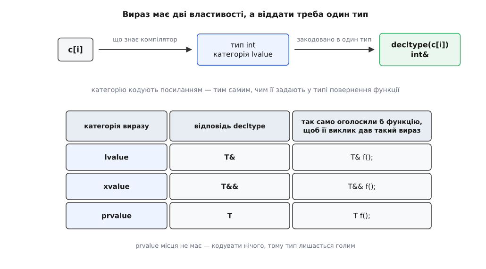
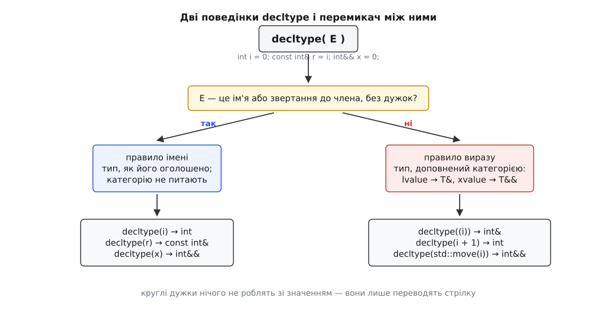
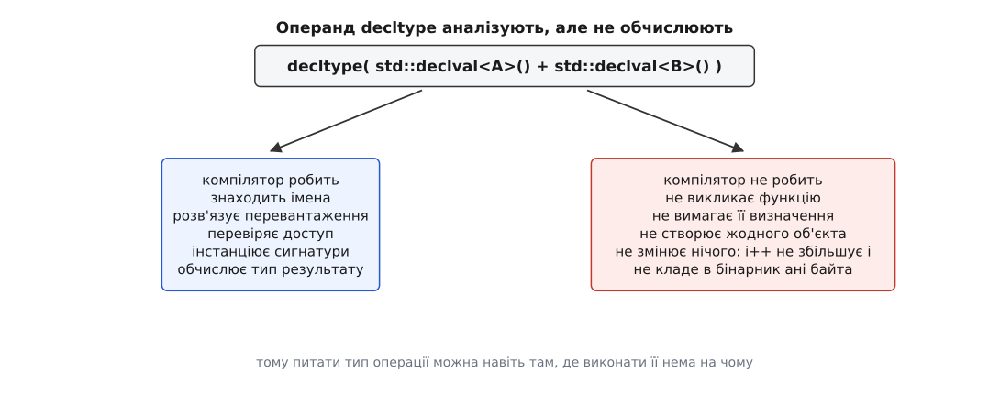

# decltype: тип виразу разом із його категорією

<preknowlist>
- [Категорії значень: lvalue, prvalue, xvalue](topic:cpp-standards/value-categories) — крім типу, кожен вираз має категорію: чи стоїть за ним місце в пам'яті і чи вільно забрати його нутрощі.
- [Посилання і правила зв'язування](topic:cpp-standards/references-binding) — чим `T&` відрізняється від `T&&`, до чого прив'язується кожне і як згортаються посилання на посилання.
- [auto й виведення типу](topic:cpp-standards/auto-type-deduction) — заповнювач, що бере тип з ініціалізатора за правилами шаблонів, відкидаючи посилання й `const` верхнього рівня.
- [Шаблони: параметризація типом](topic:cpp-standards/templates-basics) — як з одного тексту функції постає багато різних функцій і чому тип результату в такому тексті не відомий наперед.
- [Коректність за const](topic:cpp-standards/const-correctness) — різниця між `const` самого об'єкта і `const` того, на що він посилається.
</preknowlist>

Обгортка, яка нічого не змінює, — задача, на якій мова довго спотикалася.

```cpp
template <class C, class I>
??? element(C& c, I i) { return c[i]; }
```

Ця функція має віддати рівно те, що віддав би сам вираз `c[i]`. Для `std::vector<int>` це `int&` — посилання, крізь яке пишуть у контейнер. Для `const std::map<std::string, int>` — `const int&`. Для `std::vector<bool>` — маленький об'єкт-посередник, який узагалі не посилання. Тип, що має стояти замість `???`, залежить від аргументів, а в загальному випадку ще й не має імені, яке можна написати: компілятор його знає, автор шаблону — ні.

Та «не має імені» — навіть не головна біда. Припустімо, тип відомий, і це `int`. Пишемо `int element(...)` — і обгортка ламається:

```cpp
element(v, 0) = 42;   // не компілюється
```

Функція, оголошена повертати `int`, віддає значення, а не місце; присвоювати такому виразу нічого. Обгортка, що поставила `int` замість `int&`, збирається без єдиного попередження, працює — і мовчки міняє сенс усього, що крізь неї проходить.

Отже потрібен запит, який віддає про вираз **усе**: і тип, і те, чим цей вираз є — місцем у пам'яті чи щойно обчисленим значенням. Цей запит зветься `decltype` (від англ. *declared type* — оголошений тип).

## Дві властивості, які треба вмістити в один тип

Запит мусить відповідати типом і нічим іншим: відповідь підставляють в оголошення, а в оголошенні стоять типи. Але властивостей у виразу дві, і друга — категорія значення — у звичайну назву типу не влазить. Її треба **закодувати**.

Вигадувати кодування не довелося: у мові вже є конструкція, що означає «це не значення, а місце», і це посилання. Ба більше, є готовий словник — те, як тип повернення функції задає категорію її виклику. Функція, оголошена як `int f();`, дає prvalue; `int& f();` — lvalue; `int&& f();` — xvalue. Досить прочитати цей словник у зворотний бік, і кодування виходить саме собою.

Саме так `decltype` і влаштований: він відповідає на питання «як треба було б оголосити функцію, щоб її виклик дав точнісінько такий вираз». Для lvalue відповідь `T&`, для xvalue — `T&&`, для prvalue — просто `T`.



*Кодування не довільне: це та сама відповідність між типом повернення й категорією виклику, тільки прочитана навпаки.*

Ця симетрія має практичний наслідок: відповідь `decltype` можна вставляти в сигнатуру просто як є, нічого не переробляючи.

```cpp
template <class C, class I>
auto element(C& c, I i) -> decltype(c[i]) { return c[i]; }
```

Запис з типом повернення в кінці потрібен тут не для краси. У звичайній формі тип повернення стоїть **лівіше** за список параметрів, а імена `c` та `i` з'являються тільки в цьому списку — до них ще нема як дотягнутися. Стрілка переносить тип праворуч від параметрів, у ту точку, де їхні імена вже видимі. Слово `auto` в такому записі нічого не виводить, воно лише тримає місце, поки не дійде черга до справжнього типу.

> 🔧 **Навіщо це.** Кожен прошарок, що прозоро пропускає крізь себе чужий виклик — логування, вимірювання часу, кеш, посередник у бібліотеці, — мусить повертати те саме, що й обгорнутий вираз. Помилитися тут дешево й непомітно: код, який раніше присвоював крізь виклик, перестане компілюватися, а код, що лише читав, почне копіювати на кожному зверненні. Різниця між `int` і `int&` у сигнатурі обгортки — це різниця між «нічого не змінилося» і «зламався весь шар».

## Виняток, заради якого запит і назвали «оголошеним типом»

У `decltype` є друге вживання, старше й простіше за обгортки: «дай мені змінну такого самого типу, як ота». Записується воно очевидно:

```cpp
int i = 0;
decltype(i) copy = i;   // хочемо int
```

І тут кодування категорією дало б геть не те. Ім'я змінної — це вираз-lvalue, отже загальне правило видало б `int&`, і `copy` став би другим іменем для `i` замість окремої змінної. Гірше: з голого імені не можна було б дістати звичайний тип **узагалі ніяк**.

Тому стандарт вирізає окремий випадок. Якщо операнд — це просто ім'я (змінної, члена класу, функції) або звертання до члена, і воно **не взяте в дужки**, то це не вираз, який класифікують, а ім'я, яке шукають: відповіддю буде тип тієї сутності, як його записали в оголошенні. Звідси й назва: *declared type*, оголошений тип. Категорію в цьому випадку взагалі не питають.

```cpp
int i = 0;
const int& r = i;
int&&      x = 0;

decltype(i)              // int         — ім'я
decltype(r)              // const int&  — ім'я, оголошене посиланням
decltype(x)              // int&&       — ім'я; тип оголошення, а не категорія
decltype(i + 1)          // int         — вираз, prvalue
decltype(std::move(i))   // int&&       — вираз, xvalue
decltype(*&i)            // int&        — вираз, lvalue
```

Третій рядок найгостріший. Змінна `x` оголошена як посилання на rvalue, але вираз `x` — це lvalue: у нього є ім'я, до нього повернуться, грабувати його не можна. Загальне правило дало б `int&`. Спрацьовує правило імені — і виходить `int&&`, тобто тип оголошення. Тип змінної й категорія виразу з її іменем — різні речі, і `decltype` — те місце в мові, де обидві видно поруч.

Перемикачем між двома правилами служать круглі дужки. `(i)` — уже не ім'я, а вираз у дужках; зі значенням дужки не роблять нічого, а от правило перемикають.

```cpp
decltype((i))   // int&  — правило виразу: lvalue
```



*Одна перевірка на вході визначає все подальше; дужки — єдиний спосіб сказати «трактуй це ім'я як вираз».*

Дужки тут не примха синтаксису, а потрібний інструмент: без них не спитаєш, якої категорії набуває ім'я в конкретному місці. На цьому і збудований [вимірювач категорій](topic:cpp-standards/value-categories/proj-category-probe.md) — макрос, що з `decltype((вираз))` дістає `T&`, `T&&` чи `T` і за формою типу друкує назву категорії; там же розібрано, чому функція для такої задачі не годиться, а макрос неминучий.

## Куди дивитися, коли відповідь дивує

Кожен несподіваний результат означає одне: спрацювало не те правило, на яке ви розраховували. Питання завжди одне — операнд це ім'я без дужок чи все ж вираз?

| операнд | відповідь | чому саме така |
|---|---|---|
| `arr`, де `int arr[5]` | `int[5]` | ім'я; ніхто не копіює, тому й розпадатися до вказівника нема причини |
| `g`, де `void g(int)` | `void(int)` | ім'я функції означає саму функцію, а не вказівник на неї |
| `f`, де `f` перевантажена | помилка компіляції | за іменем стоїть не одна сутність, а набір; вибирати нема з чого |
| `f(1)` | тип обраного варіанта | тут вибір є: розв'язання перевантажень уже відпрацювало |
| `Point::x` | тип члена | ім'я члена шукають в оголошенні класу, об'єкт для цього не потрібен |
| `p.x`, де `p` — `const Point` | тип члена, без `const` | правило імені дивиться на оголошення члена, а не на константність `p` |
| `(p.x)`, той самий `p` | `const int&` | правило виразу: lvalue, і константність `p` тепер важить |
| `*this` | `Class&` | вираз-lvalue; у константному методі — `const Class&` |
| `this` | `Class*` | prvalue: адреса — це значення, місця в неї немає |

Пара рядків про `p.x` — джерело найприкріших помилок у шаблонному коді: різняться вони єдиною парою дужок, а дають типи з різною змінністю. А в рядках про `f` видно, що [розв'язання перевантажень](topic:cpp-standards/overload-resolution) — механізм, який з набору однойменних функцій обирає одну за типами аргументів, — усередині `decltype` працює звичайним чином: без виклику вибрати можна, без аргументів — ні.

Два випадки не вкладаються в цю просту двійку правил, і про них варто знати окремо. Ім'я зі [структурованого зв'язування](topic:cpp-standards/structured-bindings) — механізму, що розкладає пару чи структуру на кілька імен одним оголошенням, — має власне правило: `decltype` віддає тип, на який зв'язування посилається, а не тип прихованого об'єкта, у який усе спершу склали. Це навмисно: імена мають поводитися так, ніби ви звернулися до поля напряму, і внутрішня механіка не повинна протікати назовні. А ім'я [бітового поля](topic:programming/c-bitfields) віддає його оголошений тип без ширини: `int b : 3` дає просто `int`, бо ширина живе в оголошенні члена, а не в системі типів.

## Операнд аналізують, але не обчислюють

Вираз `decltype(c[i])` стоїть в **оголошенні** функції. Там нічого не виконується, жодного контейнера ще немає, а сам шаблон, можливо, ніколи й не розгорнеться в жодну функцію. Отже операнд не можна обчислювати — його можна тільки розібрати.

Так стандарт і каже: операнд `decltype` — необчислюваний. Компілятор проводить над ним увесь свій аналіз: шукає імена, розв'язує перевантаження, перевіряє доступ, інстанціює потрібні сигнатури, виводить тип результату. І не породжує при цьому жодної інструкції.



*Необчислюваний операнд — це питання до мови, а не дія в програмі.*

«Не обчислює» не означає «не перевіряє»: вимкнено виконання, а не контроль. Звертання до закритого члена всередині `decltype` — така сама помилка, як і будь-де; вираз, який не складається за типами, теж лишається помилкою — з єдиним винятком у сигнатурі шаблонної функції, де такий вираз просто прибирає кандидата з розгляду.

Решта наслідків помітні одразу. `decltype(f())` потребує лише **оголошення** `f` — визначення може не існувати взагалі, компонувальник про такий виклик ніколи не дізнається. Побічні ефекти не стаються: `decltype(i++)` дає `int`, а `i` лишається незмінним. Prvalue-операнд не матеріалізує тимчасового об'єкта, тому питати тип можна навіть про абстрактний чи ще не визначений тип. У тій самій родині необчислюваних контекстів живуть `sizeof`, `noexcept(вираз)`, `typeid` і `requires` — усі вони питають про програму, а не виконують її.

З цієї властивості виростає окремий інструмент. Щоб спитати «якого типу буде `a + b`», потрібні вирази типів `A` і `B` — а побудувати їх часто нема як: у типу може не бути конструктора за замовчуванням, він може бути абстрактним або взагалі бути посиланням. Але ж виконувати нічого не збираються. Отже досить **пообіцяти** такий вираз, не виконуючи обіцянки. Саме це робить `std::declval`:

```cpp
template <class A, class B>
using sum_t = decltype(std::declval<A>() + std::declval<B>());
```

`std::declval<T>()` оголошено як функцію, що повертає `T&&`, і не визначено ніде — навмисно, бо викликати її не можна й не треба. Тип повернення обрано не випадково: `T&&` робить вираз xvalue потрібного типу, а для `T`, що вже є посиланням `U&`, згортання посилань дає `U&`, тобто lvalue. Одна форма покриває обидва випадки. Спроба вжити `declval` там, де код справді виконується, обертається діагностикою при збірці — у типовій реалізації це `static_assert` просто в тілі шаблону.

Звідси ж видно, чому `auto` не витіснив `decltype`, хоч обидва й позбавляють від ручного виписування типів. `auto` виводить тип з **ініціалізатора** — отже потребує, щоб ініціалізатор був. `decltype` потребує лише виразу, і виконувати той вираз ніхто не збирається. Тому в оголошенні поля, де ініціалізатора немає взагалі, працює тільки другий:

```cpp
template <class F>
struct Memo {
    F fn;
    decltype(fn(0)) cached;   // тип результату fn — назвати неможливо, вивести з чогось нема чого
};
```

> 🔧 **Навіщо це.** Пара «необчислюваний операнд + `declval`» — фундамент усіх [рис типів](topic:cpp-standards/type-traits), тобто шаблонів, що відповідають на питання про тип під час компіляції. Питання на кшталт «чи можна цей тип скопіювати», «що вийде від додавання цих двох», «чи є в нього метод `size()`» формулюють як вираз, який ніхто не збирається виконувати, і питають про нього `decltype`.

## decltype(auto): джерело від auto, правила від decltype

У формі `-> decltype(c[i])` є прикра надлишковість: вираз доводиться писати двічі — один раз у сигнатурі, другий у тілі. Для довгого виразу це не тільки багатослівно, а й небезпечно: правлять зазвичай одну з двох копій.

Потрібне поєднання двох речей, які досі були нарізно: джерело з `auto` (тип бери з ініціалізатора, я його не повторюватиму) і правила з `decltype` (нічого не спрощуй, посилання й `const` лиши на місці). C++14 дав таку форму — `decltype(auto)`. Тип виводять з ініціалізатора чи з інструкції `return`, але виводять так, наче цей вираз був операндом `decltype`.

```cpp
template <class C, class I>
decltype(auto) element(C& c, I i) { return c[i]; }
```

Тепер обгортка справді прозора, а вираз записано один раз. Варто перевірити її на трьох контейнерах із початкового прикладу. Для `std::vector<int>` виводиться `int&`, і присвоєння крізь обгортку працює. Для константного `std::map` — `const int&`, і компілятор далі забороняє писати. Для `std::vector<bool>` — об'єкт-посередник за значенням, бо саме його `operator[]` і повертає. Жодна інша форма так не вміє: `auto` в усіх трьох випадках зробив би копію, а `auto&` не скомпілювався б на посереднику, бо неконстантне посилання не прив'язується до тимчасового.

Та сама потреба виникає й усередині функції. Коли між викликом і поверненням треба щось зробити — зупинити секундомір, залогувати, перевірити результат, — проміжне ім'я не має права загубити посилання:

```cpp
decltype(auto) result = c[i];   // int& лишається int&, посередник лишається посередником
```

Три обмеження цієї форми випливають прямо з її будови.

Заповнювач мусить бути **сам по собі**: `const decltype(auto)&` — помилка. Це не примха, а неминучість: виведений тип уже містить і посилальність, і константність, тож незрозуміло, що означала б іще одна обгортка навколо нього.

Якщо інструкцій `return` кілька, усі мусять дати **однаковий** тип — компілятор виводить його один раз і далі лише перевіряє збіг, спільного знаменника він не шукає.

І найдорожче: та сама пара дужок, що перемикала правила, тут перемикає час життя.

```cpp
decltype(auto) f() {
    int x = 0;
    return (x);   // int& — посилання на змінну, яка вмирає на цьому ж рядку
}
```

Без дужок функція повертає `int` і все гаразд. З дужками — `decltype((x))` дає `int&`, і назовні йде [висяче посилання](topic:cpp-standards/dangling-references) на знищену локальну змінну. У функції з `decltype(auto)` кожні дужки навколо повернення варті окремого погляду.

Повноцінна прозора обгортка потребує ще двох речей, крім типу повернення: передати аргументи, не втративши їхніх категорій, і не збрехати про винятки. [Робочий приклад такої обгортки](topic:cpp-standards/decltype/proj-transparent-wrapper.md) складає все докупи — `decltype(auto)`, [ідеальне передавання](topic:cpp-standards/perfect-forwarding), успадкування `noexcept` через `noexcept(noexcept(вираз))` — і перевіряє на тестах, що крізь обгортку так само можна присвоювати й що жодної зайвої копії не з'явилося.

## Коли decltype у сигнатурі вирішує, чи існує функція

`decltype(auto)` ховається в тілі функції, а `-> decltype(вираз)` стоїть у **сигнатурі** — і саме тому запис зі стрілкою нікуди не зник після появи `decltype(auto)`. Різниця не косметична: усе, що записане в сигнатурі, компілятор перевіряє ще до вибору функції.

Якщо вираз у `decltype` виявиться некоректним для конкретних аргументів, це не помилка компіляції — кандидат просто мовчки вибуває з розгляду.

```cpp
template <class C>
auto reserve_if_possible(C& c, std::size_t n) -> decltype(c.reserve(n)) { c.reserve(n); }

template <class C>
void reserve_if_possible(C&, ...) { }   // запасний варіант: підходить завжди
```

Для `std::vector` перший варіант коректний і виграє як точніший. Для `std::list`, у якого `reserve` немає, вираз `c.reserve(n)` не складається, перший кандидат зникає — і виклик спокійно потрапляє в запасний. Так `decltype` перетворює питання «чи є в цього типу така операція» на питання «чи існує ця перевантажена функція», а на друге компілятор уміє відповідати сам.

[Як з цього виростає перевірка будь-якої властивості типу](topic:cpp-standards/decltype/proj-expression-detection.md) — від наївної спроби до готового детектора: чому потрібен трюк із комою, як влаштований `void_t`, і як усе це записується одним рядком через `requires`. Загальний механізм такого відбору — [SFINAE](topic:cpp-standards/sfinae-and-enable-if), правило «невдала підстановка не є помилкою», а сучасна заміна цьому запису — [концепти](topic:cpp-standards/concepts-constraints), які роблять ту саму перевірку читабельною і дають зрозумілу діагностику замість простирадла з нутрощів шаблону.

## Одне питання, з якого все виводиться

`decltype` — єдине місце в C++, де категорія значення стає типом, який можна написати. Через це він потрібен саме там, де тип не можна ні вгадати, ні спростити: у сигнатурі обгортки, в оголошенні псевдоніма, у рисі типу, у перевірці «чи складається цей вираз».

Щоб не вгадувати відповідь, досить щоразу ставити те питання, з якого починає сам компілятор: **операнд — це ім'я без дужок чи вираз?** Ім'я віддасть тип, як його оголосили, і жодних сюрпризів. Вираз віддасть тип разом із закодованою категорією — і посилання в ньому з'явиться тоді й тільки тоді, коли за виразом стоїть справжнє місце в пам'яті.

У щоденному коді голий `decltype` потрібен рідко: там, де тип нікуди не записують, вистачає `auto&&` для локальних імен і `decltype(auto)` для повернення. Голий `decltype` беруть тоді, коли тип треба **назвати** — і назвати точно.

Чому цей запит увійшов у мову не сам, а в парі з `auto`, і чому його не назвали `typeof`, як однойменні розширення компіляторів, — [окрема історія](topic:cpp-standards/auto-type-deduction/hist-auto-decltype.md), що починається пропозицією 2003 року й пояснює половину поведінки обох конструкцій.
