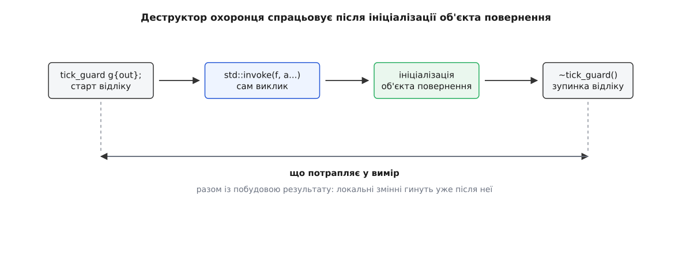

# ⚙️ Прозора обгортка: секундомір, крізь який нічого не змінюється

Обгортка прозора тоді, коли заміна виклику `f(a)` на `timed(t, f, a)` не міняє **нічого**: ні типу результату, ні його категорії, ні кількості копій, ні обіцянки про винятки, ні самого набору типів, для яких виклик узагалі збирається. Тут — робочий C++-секундомір, що витримує всі п'ять умов, і тести, які перевіряють кожну з них окремо.

## Задача: п'ять місць, де обгортка бреше

Наївний варіант виглядає безневинно:

```cpp
template <class F, class... A>
auto timed(F f, A... a) {
    auto t0 = std::chrono::steady_clock::now();
    auto r = f(a...);
    report(std::chrono::steady_clock::now() - t0);
    return r;
}
```

І бреше п'ятьма способами одразу.

`auto` в типі повернення відкидає посилання й `const` верхнього рівня: те, що віддавали як `int&`, назовні виходить копією, і присвоєння крізь обгортку або не збереться, або мовчки запише в тимчасовий об'єкт.

Параметри `A... a` беруться за значенням: кожен аргумент копіюється — а секундомір щиро зараховує ці копії до часу виклику.

Про винятки не сказано нічого, тож `noexcept`-функція крізь обгортку перестає бути `noexcept`. З C++17 це не косметика: специфікація винятків стала частиною **типу** функції (пропозиція P0012R1 Єнса Маурера), тож вказівник `void(*)() noexcept` уже не ініціалізується з обгортки, яка обіцянку загубила.

Тіло не має обмежень: для непридатних аргументів помилка вилізе з нутрощів шаблону, а сама обгортка при цьому вважатиметься цілком придатним кандидатом.

І нарешті `auto r = f(a...)` просто не компілюється, коли `f` повертає `void`.

## Ідея: чотири зобов'язання, і всі — в сигнатурі

**Тип** — `decltype(auto)`. Тип повернення виводиться з виразу в `return` за правилами `decltype`, тож посилання, `const` і об'єкти-посередники доходять до викликача цілими. Випадок `void` покривається сам собою: виводиться `void`, а `return` з виразом типу `void` — законна інструкція.

**Аргументи** — переспрямовувальні посилання `A&&...` і `std::forward`. Це [ідеальне передавання](topic:cpp-standards/perfect-forwarding): параметр `A&&` у шаблоні виводиться в `T&` для lvalue-аргумента і в `T` для rvalue, а `std::forward<A>(a)` повертає аргументові його первісну категорію перед тим, як віддати далі. Копій не виникає ні на вході, ні при передаванні.

**Винятки** — `noexcept(noexcept(вираз))`. Подвоєне слово не описка: зовнішнє — специфікація «ця функція не кидає, якщо константа в дужках істинна», внутрішнє — оператор, що обчислює цю константу з виразу, не виконуючи його. Обгортка обіцяє рівно стільки, скільки обіцяє загорнутий виклик, і жодним рядком більше.

**Існування** — `requires`. Обмеження, записане в сигнатурі, означає, що для непридатних аргументів обгортка тихо вибуває з розгляду замість ламатися всередині. [Концепт](topic:cpp-standards/concepts-constraints) `std::invocable<F, A...>` — іменована вимога до типів, яку компілятор перевіряє ще до вибору функції, — уже ставить потрібне питання: чи можна це викликати з такими аргументами.

Лишається дрібниця, від якої залежить решта. Секундомір мусить зупинитися **після** виклику — а будь-яка інструкція між викликом і `return` змушує завести проміжну змінну, і саме на ній обгортки перестають бути прозорими. Вихід — покласти зупинку в деструктор невеликого [охоронця області](topic:cpp-standards/scope-guard), тобто об'єкта, який виконує свою дію на виході з блоку хай там що. Тоді між викликом і поверненням у тілі не лишається нічого.

## Код

```cpp
#include <chrono>
#include <concepts>
#include <functional>
#include <utility>

// Зупиняє відлік у деструкторі — тому в тілі обгортки
// між викликом і `return` не буде жодної інструкції.
class tick_guard {
    std::chrono::steady_clock::time_point start_;
    std::chrono::nanoseconds& out_;
public:
    explicit tick_guard(std::chrono::nanoseconds& out) noexcept
        : start_(std::chrono::steady_clock::now()), out_(out) {}
    ~tick_guard() { out_ = std::chrono::steady_clock::now() - start_; }

    tick_guard(const tick_guard&) = delete;
    tick_guard& operator=(const tick_guard&) = delete;
};

template <class F, class... A>
    requires std::invocable<F, A...>
decltype(auto) timed(std::chrono::nanoseconds& out, F&& f, A&&... a)
    noexcept(noexcept(std::invoke(std::forward<F>(f), std::forward<A>(a)...)))
{
    tick_guard g{out};
    return std::invoke(std::forward<F>(f), std::forward<A>(a)...);
}
```

`std::invoke` замість прямого `f(a...)` узято не для краси: він однаково викликає функції, лямбди, функтори — і **вказівники на члени**, у яких синтаксис виклику зовсім інший. Обгортка на голому `f(a...)` для `&Point::x` просто не збереться. Своєї поведінки `std::invoke` не додає й тут: його власна специфікація — `noexcept(is_nothrow_invocable_v<F, Args...>)`.

Секундомір може чесно успадкувати `noexcept`, бо `steady_clock::now()` за стандартом оголошений `noexcept`, а віднімання моментів часу — арифметика на цілих.

До C++20 те саме пишеться так, і різниця повчальна:

```cpp
template <class F, class... A>
auto timed(std::chrono::nanoseconds& out, F&& f, A&&... a)
    noexcept(noexcept(std::invoke(std::forward<F>(f), std::forward<A>(a)...)))
    -> decltype(std::invoke(std::forward<F>(f), std::forward<A>(a)...))
{
    tick_guard g{out};
    return std::invoke(std::forward<F>(f), std::forward<A>(a)...);
}
```

Той самий вираз доводиться виписати **тричі**, і кожен примірник робить свою роботу: у `noexcept` — успадковує обіцянку, у `-> decltype` — і задає тип, і водночас слугує обмеженням (некоректний вираз у сигнатурі прибирає кандидата мовчки), у тілі — власне викликає. Три копії одного виразу — три місця, де правку забудуть.

## Тести, що доводять прозорість

```cpp
#include <cassert>
#include <map>
#include <string>
#include <type_traits>
#include <vector>

// Один узагальнений доступ, що віддає рівно те, що віддав контейнер.
constexpr auto lookup = [](auto&& c, auto&& k) -> decltype(auto) {
    return c.at(k);
};

// Лічильник копій і переміщень.
struct probe {
    static inline int copies = 0, moves = 0;
    probe() = default;
    probe(const probe&)     { ++copies; }
    probe(probe&&) noexcept { ++moves; }
};
probe  by_value()     { return probe{}; }
probe& by_reference() { static probe p; return p; }

int main() {
    std::chrono::nanoseconds t{};
    std::vector<int>  vi{1, 2, 3};
    std::vector<bool> vb{true, false};
    const std::map<std::string, int> mi{{"a", 1}};

    // 1. Категорія й константність доходять неушкодженими.
    static_assert(std::is_same_v<decltype(timed(t, lookup, vi, 0)),  int&>);
    static_assert(std::is_same_v<decltype(timed(t, lookup, mi, "a")), const int&>);
    static_assert(std::is_same_v<decltype(timed(t, lookup, vb, 0)),
                                 std::vector<bool>::reference>);

    // 2. Крізь обгортку так само пишуть — і в звичайний контейнер, і в посередник.
    timed(t, lookup, vi, 0) = 42;
    timed(t, lookup, vb, 1) = true;
    assert(vi[0] == 42 && vb[1]);

    // 3. Жодної зайвої копії й жодного зайвого переміщення.
    probe::copies = probe::moves = 0;

    probe made = timed(t, by_value);
    assert(probe::copies == 0 && probe::moves == 0);

    probe& same = timed(t, by_reference);
    assert(&same == &by_reference());
    assert(probe::copies == 0 && probe::moves == 0);

    // 4. Обіцянка про винятки — рівно та сама.
    auto quiet = []() noexcept { return 1; };
    auto loud  = []()          { return 1; };
    static_assert( noexcept(timed(t, quiet)));
    static_assert(!noexcept(timed(t, loud)));

    // 5. Для непридатних аргументів обгортка не ламається — вона зникає.
    static_assert(!requires { timed(t, quiet, 1, 2, 3); });

    // 6. Аргументи проходять наскрізь зі своєю категорією.
    auto sink = [](probe) { };   // бере за значенням
    probe src;

    probe::copies = probe::moves = 0;
    timed(t, sink, src);         // lvalue → одна копія, і та вже в самому sink
    assert(probe::copies == 1 && probe::moves == 0);

    probe::copies = probe::moves = 0;
    timed(t, sink, probe{});     // rvalue → жодної копії, одне переміщення
    assert(probe::copies == 0 && probe::moves == 1);
}
```

Третій тест варто прочитати уважно: нуль там не через щедрість оптимізатора. `by_value()` віддає prvalue, `std::invoke` повертає його як prvalue, `timed` — теж, і `probe made = timed(...)` ініціалізується ним же. Кожна ланка цього ланцюга — `return` prvalue того самого типу, а таке з C++17 усувається **обов'язково**: об'єкт від початку будується на своєму кінцевому місці. Що саме гарантовано, а що лишилося доброю волею компілятора, показує [стенд, який рахує копії](topic:cpp-standards/copy-elision/proj-copy-probe.md) — однофайлова програма, де кожне народження друкує свій номер.

П'ятий тест доводить те, чого не видно в жодному з попередніх: обгортка прозора й для **розв'язання перевантажень**. Прибрати `requires` — і цей `static_assert` перестане компілюватися, бо помилка виникне вже в тілі, куди `requires`-вираз не заглядає.

А шостий показує єдине місце, де прозорість усе-таки має межу. Для lvalue числа збігаються з прямим викликом `sink(src)` до останньої операції. Для rvalue — ні: `sink(probe{})` напряму коштує **нуль** операцій, бо prvalue ініціалізує параметр `sink` просто на місці, а крізь обгортку виходить одне переміщення. Причина не в `decltype` і не лікується жодною його формою: prvalue, прив'язавшись до параметра `A&&`, стає іменованим об'єктом, і далі його можна тільки перемістити. Обгортка з параметрами за значенням на цьому ж місці робить дві операції замість однієї, тож переспрямовувальні посилання ціну таки збивають — просто не до нуля.

## Пастки

**Зайві дужки навколо `return`.** Якщо між викликом і поверненням усе ж завелася проміжна змінна, кожна пара дужок стає питанням життя і смерті:

```cpp
decltype(auto) r = std::invoke(std::forward<F>(f), std::forward<A>(a)...);
report(r);
return (r);          // ← ці дужки
```

Без дужок операнд — ім'я, і `decltype` віддає оголошений тип `r`. З дужками операнд — вираз, і відповідь завжди `T&`, бо `r` — lvalue. Коли `r` уже було `probe&`, різниці немає й тести на `vector<int>` проходять; коли `r` — самостійний об'єкт, назовні йде [висяче посилання](topic:cpp-standards/dangling-references) на локальну змінну, яка гине на виході з функції. Помилка не проявиться, доки хтось не загорне функцію, яка повертає за значенням.

**Сама проміжна змінна теж коштує.** Навіть без дужок ланцюг обов'язкової елізії на ній рветься: `r` — повноцінний об'єкт, і `return r;` спирається вже на NRVO, оптимізацію **необов'язкову**. Не застосує компілятор — з'явиться зайве переміщення, і лічильник покаже `moves == 1`. Охоронець у коді вище стоїть саме заради того, щоб це число лишалося нулем.

**Чому `auto` й `auto&` тут не годяться.** Три контейнери дають три різні відповіді, і жоден сталий тип повернення не покриває всіх трьох:

| тип повернення | `vector<int>` → `int&` | конст. `map` → `const int&` | `vector<bool>` → посередник |
|---|---|---|---|
| `auto` | `int` — копія, писати крізь обгортку нікуди | `int` — копія | працює: копія посередника вказує на той самий біт |
| `auto&` | `int&` | `const int&` | **не збереться**: неконстантне посилання не зв'яжеться з тимчасовим |
| `auto&&` | `int&` | `const int&` | **висяче** посилання на тимчасовий, що вже помер |
| `decltype(auto)` | `int&` | `const int&` | посередник за значенням |

`auto` й `auto&` провалюються на **різних** випадках — тож ніякий вибір наперед не рятує. `auto&&` тримає два з трьох і мовчки віддає висяче посилання на третьому: тимчасовий об'єкт-посередник, до якого прив'язалося повернуте посилання, живе лише доти, доки функція не вийшла — саме до того моменту, з якого посиланням почне користуватися викликач.

**Не обіцяй того, чого не тримаєш.** Секундомір успадковує `noexcept` чесно, бо його власна робота не кидає. Логер — не може: запис у потік і форматування рядка кидають цілком законно. Обгортка з `noexcept(noexcept(std::invoke(...)))` навколо логування бреше, і платня за брехню — `std::terminate` замість винятку. Або логування загортають у власний `try`/`catch`, і тоді воно справді не кидає, або обіцянку не переносять узагалі; чому цю обіцянку не можна порушити «трошки» — [noexcept](topic:cpp-standards/noexcept).

**У вимір потрапляє й побудова результату.** Стандарт упорядковує події `return` так: спершу ініціалізується об'єкт результату, потім гинуть тимчасові об'єкти повного виразу, і аж тоді — локальні змінні блоку. Отже деструктор охоронця спрацьовує **після** того, як результат уже побудовано.



*Для `int&` це нуль зайвої роботи; для великого об'єкта за значенням — уже ні, хоча завдяки обов'язковій елізії це побудова на місці, а не копія.*

Той самий порядок дає й приємний побічний наслідок: якщо загорнутий виклик кинув виняток, охоронець спрацює під час розкручування стека — і невдала спроба теж потрапить у вимір.
