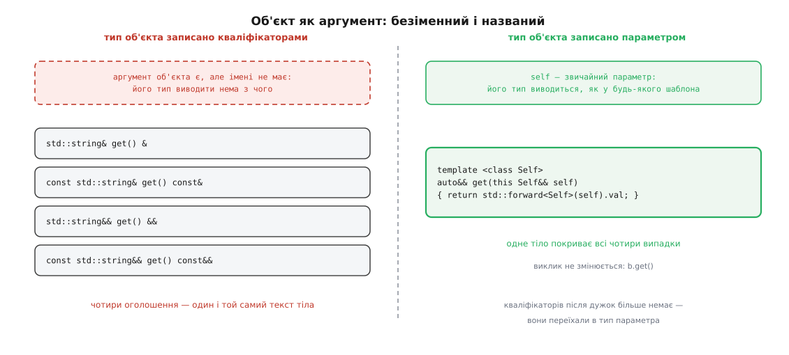
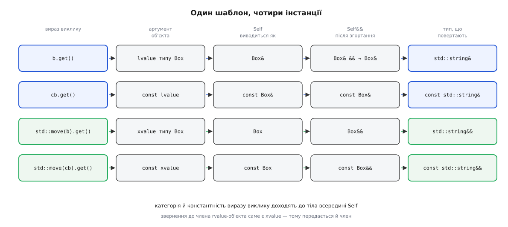
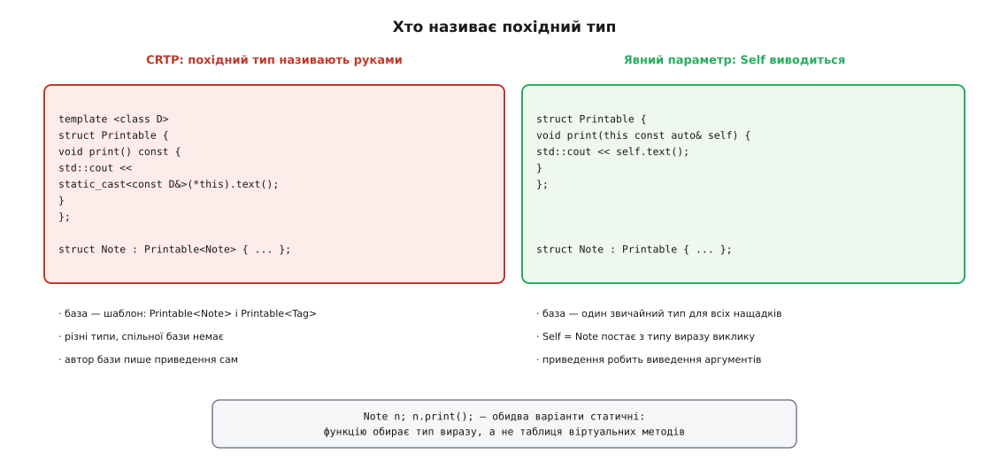

# Явний параметр об'єкта (deducing this)

<preknowlist>
- [Категорії значень](topic:cpp-standards/value-categories) — чим lvalue відрізняється від prvalue і xvalue; категорія належить виразові, а не типові.
- [Посилання і правила зв'язування](topic:cpp-standards/references-binding) — до чого прив'язується `T&`, `const T&` і `T&&`.
- [Коректність за const](topic:cpp-standards/const-correctness) — що обіцяє `const` у сигнатурі функції-члена.
- [Виведення аргументів шаблону](topic:cpp-standards/template-argument-deduction) — як компілятор добуває параметр шаблона з фактичного аргументу.
- [Ідеальне передавання](topic:cpp-standards/perfect-forwarding) — передавальне посилання `T&&`, згортання посилань і що робить `std::forward`.
- [Розв'язання перевантажень](topic:cpp-standards/overload-resolution) — як із кількох однойменних функцій обирається одна.
- [CRTP](topic:cpp-standards/crtp) — база, параметризована власним нащадком, і статичний поліморфізм на ній.
- [Лямбди й захоплення](topic:cpp-standards/lambdas-and-captures) — замикання як окремий тип і де живуть захоплені змінні.
</preknowlist>

Клас тримає значення й дає до нього доступ. Найкоротший спосіб — одна функція:

```cpp
class Box {
    std::string val;
public:
    std::string& get() { return val; }
};
```

Але константний `Box` через таку функцію нічого не віддасть, тож поруч з'являється другий рядок — `const std::string& get() const`, з дослівно тим самим тілом. А коли `Box` виявляється тимчасовим (`make_box().get()`), обидві версії віддають посилання на член об'єкта, що от-от помре; щоб дозволити викликачеві забрати рядок собі, треба ще дві:

```cpp
    std::string&        get() &       { return val; }
    const std::string&  get() const&  { return val; }
    std::string&&       get() &&      { return std::move(val); }
    const std::string&& get() const&& { return std::move(val); }
```

Чотири оголошення на одну думку. У стандартній бібліотеці це видно неозброєним оком: [`std::optional`](topic:cpp-standards/optional) має рівно чотири `value()` і рівно чотири `operator*` — з однаковими тілами. Поки тіло — один `return`, дублювання дратує; коли в ньому тридцять рядків перевірок, чотири копії починають розповзатися, і виправлену помилку в одній забувають перенести в решту.

Питання не в тому, як це терпіти, а в тому, чому компілятор узагалі змушує так писати.

## Об'єкт — це аргумент, просто безіменний

Виклик `b.get()` передає функції сам об'єкт `b`. Це не метафора: у машинному коді об'єкт приїжджає першим аргументом, а всередині тіла звертання до `val` — насправді звертання до `this->val`. Об'єкт — звичайний аргумент, який доводиться до функції звичайним способом.

Функції треба знати про нього дві речі, і обидві впливають на те, що вона має право робити. Чи можна об'єкт змінювати — це `const`. Чи належить об'єкт комусь іншому, чи він тимчасовий і його вміст можна забрати — це категорія значення. Разом ці дві властивості дають чотири можливі типи аргументу: `Box&`, `const Box&`, `Box&&`, `const Box&&`.

Для будь-якого іншого параметра мова давно вміє не переписувати функцію під кожен із цих типів: параметр оголошують передавальним посиланням, тип виводиться з аргументу, і одного тексту вистачає на всі випадки. Але з об'єктом цей механізм не працює — не тому, що заборонено, а тому, що об'єктові немає де оголосити тип. У списку параметрів його немає взагалі. Його тип записують **кваліфікаторами після дужок**: `const` каже, що аргумент буде `const Box&`, `&&` — що `Box&&`, порожнє місце — що `Box&`.

А кваліфікатор — це буквально написане слово. Виводити з нього нема чого: немає імені, яке компілятор міг би пов'язати з типом аргументу. Один текст функції — один жорстко записаний тип об'єкта. Звідси й арифметика: скільки типів об'єкта треба обслужити, стільки й тіл.



*Кваліфікатори після дужок і названий параметр описують той самий аргумент, але лише другий спосіб можна вивести.*

Отже, розв'язок напрошується сам: дати об'єктові звичайне місце у списку параметрів. Тоді на нього поширяться всі правила, що вже є для звичайних параметрів, — і виведення типу серед них.

## Як це записують

Саме це й додали в C++23. Перед оголошенням першого параметра ставлять ключове слово `this`:

```cpp
class Box {
    std::string val;
public:
    template <class Self>
    auto&& get(this Self&& self) { return std::forward<Self>(self).val; }
};
```

Такий параметр звуть **явним параметром об'єкта** (англ. *explicit object parameter*), а функцію-член із ним — функцією-членом із явним об'єктом. Кваліфікаторів після дужок більше немає: вони переїхали в тип параметра. Місце виклику не змінилося ні на символ — це так само `b.get()`.

Пропозицію написали Ґашпер Ажман, Сай Бренд, Бен Дін і Баррі Ревзін; сьома редакція паперу P0847 датована 12 липня 2021 року, і саме її заголовок «Deducing this» прижився як розмовна назва риси. [Як задача про чотири перевантаження перетворилася на зміну в мові](topic:cpp-standards/deducing-this/hist-deducing-this.md) — окрема історія: від R0 до R7 — вісім редакцій, які зачепили формулювання про пошук імен, лямбди й покажчики на функції.

Риса ввімкнена режимом `-std=c++23` (у MSVC — `/std:c++latest` або `/std:c++23`). З підтримкою в компіляторах вийшло незвично: першим її випустив MSVC — Visual Studio 2022 версії 17.2, ще у 2022 році, задовго до того, як стандарт вийшов; GCC і Clang дочекалися своїх чотирнадцятого й вісімнадцятого випусків відповідно, обидва у 2024-му. Тож перевіряти доступність риси варто через `__cpp_explicit_this_parameter`, а не за роком стандарту.

Дві речі тут незалежні одна від одної, і плутати їх не варто. Перша — об'єкт **названо**. Друга — його тип **виведено**. Друга не обов'язкова: параметр можна оголосити конкретним типом.

```cpp
    void dump(this const Box& self) { std::cout << self.val; }
```

Це вже не шаблон. Одне оголошення, одна сигнатура, ніякого виведення — просто те саме, що `void dump() const`, записане інакше. Виведення з'являється рівно тоді, коли типом параметра пишуть параметр шаблона.

## Що саме виводиться

Коли параметр оголошено як `Self&&`, працює звичайне передавальне посилання: з lvalue-аргументу `Self` виводиться як тип-посилання і згортання дає `Box&`, з rvalue — як тип-значення, і лишається `Box&&`. Константність аргументу входить у виведений тип.



*Категорія й константність виразу виклику доходять до тіла всередині `Self` — і звідти розгортаються назад у тип результату.*

**Дано: `const Box cb;` і виклик `std::move(cb).get();`**

```
вираз об'єкта        std::move(cb)              → xvalue типу const Box
параметр             this Self&& self           → P = Self&&,  A = const Box
A — rvalue           виведення дає              Self = const Box
підстановка          Self&&                     = const Box&&   (згортати нічого)
у тілі               std::forward<Self>(self)   → const Box&&
звернення до члена   (const Box&&).val          → xvalue типу const std::string
тип результату       auto&&                     = const std::string&&
```

Та сама `const&&`-версія, яку інакше писали б руками, тут просто одна з інстанцій — і з'явилася вона не з окремого оголошення, а з категорії виразу в місці виклику.

Тіло користається цим так само, як будь-яка передавальна обгортка. `std::forward<Self>(self)` повертає об'єктові його первісну категорію, а звертання до члена rvalue-об'єкта саме є xvalue — тому `std::forward<Self>(self).val` для тимчасового `Box` дає `std::string&&`, і `auto&&` у типі результату підхоплює саме його. Чотири різні типи результату виникають з одного рядка не тому, що там написано чотири випадки, а тому, що інстанцій шаблона теж чотири.

> 🔧 **Навіщо це.** Вигода не в кількості рядків, а в кількості місць, де живе логіка. Аксесор із перевіркою («порожньо — кинути виняток») у чотирьох копіях — це чотири місця, де перевірку можна забути оновити, і жоден тест не покаже, що розійшлася саме `const&&`-версія, бо її викликають раз на рік. Один шаблон розходитися не вміє.

Одне залишається на совісті автора. `Box{}.get()` віддає посилання на член тимчасового об'єкта, і воно висне наприкінці повного виразу — так само, як і в написаній руками `&&`-версії. Явний параметр об'єкта нічого не додає до [часу життя](topic:cpp-standards/dangling-references) і нічого не рятує.

Окремий випадок — коли віддають не власний член, а щось за вказівником. `*self.impl` має тип `Impl&` незалежно від того, яким був `Self`: розіменування вказівника не пам'ятає, звідки взявся вказівник. Тоді категорію переносять уручну — `std::forward_like<Self>(*self.impl)` (та сама редакція стандарту, заголовок `<utility>`) накладає константність і категорію `Self` на будь-який вираз, а не лише на прямий член.

## Self — це тип нащадка

Досі виведення давало чотири варіанти того самого `Box`. Але виведення не знає, що аргумент має бути саме `Box`. Воно бере тип **виразу виклику**. А якщо `get` успадкували, тип виразу виклику — це тип нащадка.

```cpp
struct Printable {
    void print(this const auto& self) { std::cout << self.text() << '\n'; }
};

struct Note : Printable {
    std::string body;
    std::string text() const { return body; }
};
```

`Note n; n.print();` — пошук імені знаходить `print` у базі, а виведення дає `self` типу `const Note&`. Тому `self.text()` бачить `Note::text`, якого база не оголошувала й знати не могла. База дістає доступ до нащадка, не будучи шаблоном від нього.

Саме це раніше робив [CRTP](topic:cpp-standards/crtp): базу параметризували типом нащадка й усередині писали `static_cast<const D&>(*this)`. Різниця не косметична.



*Обов'язок назвати похідний тип наперед зникає — його називає виведення аргументів.*

У CRTP `Printable<Note>` і `Printable<Tag>` — два незв'язані типи, тож спільної бази для всіх «друкованих» просто не існує, і замкнути спадкування на себе мусить кожен нащадок. З явним параметром об'єкта база — звичайний клас; його можна успадкувати без жодних параметрів, а домішки складати одну на одну.

Другий бік тієї самої властивості — можливість **повернути** нащадка. Базі-будівникові досі бракувало саме цього: віддавши `*this`, вона віддавала посилання на базу, і ланцюжок викликів обривався на першому ж методі нащадка. Тепер повертати можна сам `self` — а він уже потрібного типу:

```cpp
struct Tagged {
    auto&& with_tag(this auto&& self, std::string t) {
        self.tag = std::move(t);            // tag оголошує нащадок
        return std::forward<decltype(self)>(self);
    }
};
```

Якщо `Note` успадкує `Tagged` і додасть власний `with_body`, ланцюжок `n.with_tag("dev").with_body("…")` складеться: `with_tag` повернув `Note&`, а не `Tagged&`.

Межа тут та сама, що й у CRTP, і про неї треба сказати прямо: це **статичний** поліморфізм. Функцію обирає тип виразу в місці виклику. Якщо `Note` тримати за `Printable*`, ніякого `Note::text` не буде — для [динамічної диспетчеризації](topic:programming/virtual-dispatch-cpp) потрібна таблиця віртуальних методів, а явний параметр об'єкта її не створює. І пастка CRTP теж нікуди не поділася: якщо нащадок оголосить власний член з іменем, що є й у базі, `self.x` у базі побачить член нащадка — бо `self` має тип нащадка.

## Лямбда, що знає себе

Замикання не має імені всередині власного тіла. Це заважає рівно там, де без рекурсії не обійтися: обхід дерева, розбір вкладеної структури, [`std::variant`](topic:cpp-standards/variant-and-visit) із рекурсивним варіантом. Раніше доводилося або заводити окрему функцію, або загортати лямбду в [`std::function`](topic:cpp-standards/std-function-type-erasure) і кликати змінну, — а це стирання типу, ймовірне виділення пам'яті та висяче посилання, щойно змінну скопіюють.

Явний параметр об'єкта дозволений і в лямбді, а об'єкт лямбди — це саме замикання:

```cpp
auto sum = [](this auto&& self, const Node* n) -> long {
    return n ? n->value + self(n->left) + self(n->right) : 0;
};
```

`self` — те саме замикання, тож `self(...)` — рекурсивний виклик напряму: ні стирання типу, ні виділення пам'яті, ні окремої змінної, яку можна загубити.

Тут є дві тонкості, обидві прямо випливають із того, що `self` — звичайний параметр. Перша: `mutable` і `static` разом із явним параметром об'єкта заборонені, бо константність тепер задає тип параметра — за замовчуванням оператор виклику вже не константний. Друга серйозніша: `this auto self` **за значенням** щоразу копіює замикання разом із захопленнями, тож зміна захопленої змінної всередині торкнеться копії, а не оригіналу. Для рекурсії пишуть `this auto&&`. І тип параметра має бути самим замиканням або базою від нього — стороннього типу туди не поставити, бо інакше до захоплень не дістатися.

## Об'єкт за значенням

Явний параметр об'єкта — перша нагода взяти об'єкт **за значенням**, а не за посиланням чи вказівником. Для дрібного об'єкта-обгортки (дескриптор, ітератор, `string_view`) це передавання в регістрі замість звертання через вказівник:

```cpp
struct Handle {
    std::uint32_t id;
    bool valid(this Handle h) { return h.id != 0; }
};
```

Другий, менш очевидний випадок — [корутини](topic:cpp-standards/coroutines). Функція-член із неявним об'єктом зберігає в кадрі корутини лише `this`; якщо корутину запустили на тимчасовому об'єкті, кадр переживе об'єкт, і вказівник зависне. Явний параметр за значенням переміщує об'єкт **у сам кадр**, і кадр володіє ним стільки, скільки живе. Ціна чесна: для великого об'єкта це справжня копія або переміщення, тож за значенням беруть тоді, коли або об'єкт дрібний, або володіння в кадрі — саме те, що потрібно.

## Огорожі й звідки вони взялися

Кожне обмеження тут — наслідок того, що об'єкт став звичайним параметром, а не окремий каприз.

**Ні `const`, ні `&`, ні `&&` після дужок.** Вони описують той самий аргумент, що й параметр; два описи одного аргументу суперечили б один одному.

**Ні `static`.** Статична функція-член об'єкта не отримує взагалі — оголошувати для нього параметр немає сенсу.

**Ні `virtual`, і перевизначити віртуальну функцію такою не можна.** У слоті таблиці віртуальних методів має стояти одна фіксована сигнатура, а виведений `Self` — це ціла родина функцій. Ця риса не заміняє віртуальність; вона заміняє CRTP.

**Не конструктор і не деструктор.** Під час побудови об'єкта ще немає — передавати нема чого.

**Усередині тіла немає ні `this`, ні неявного пошуку членів.** Тип параметра може бути не тим класом, у якому написана функція: нащадком, копією, чимось похідним. Голе `val` не мало б однозначного значення, тож пишуть `self.val`. На практиці це радше сторож: забуте `self.` дає помилку компіляції, а не тихо інший сенс.

**Параметр має бути першим, не може бути пакетом і не має аргументу за замовчуванням.** Об'єкт при виклику стоїть завжди й рівно один — місце для нього не обговорюється.

**`&Box::dump` — це покажчик на функцію, а не на член:** `void(*)(const Box&)`. Об'єкт же — звичайний параметр. Кликати при цьому все одно доводиться по-членськи (`b.dump()`), бо це залишається нестатичною функцією-членом. Наслідок для чужого коду болючий: перевести існуючу функцію-член на явний об'єкт означає змінити тип `&C::f` і зламати [сумісність двійкового інтерфейсу](topic:cpp-standards/abi-stability-cpp) — саме тому стандартна бібліотека здебільшого не переписала на цю рису вже наявні аксесори.

**Неявна й явна версії «того самого» не перевантажуються.** Ось це — помилка повторного оголошення, а не два варіанти:

```cpp
struct S {
    void f() const;             // неявний об'єкт типу const S&
    void f(this const S& self); // те саме оголошення
};
```

Стандарт вважає такі оголошення відповідними, якщо неявна версія не має ref-кваліфікатора, а типи об'єкта після зняття посилання збігаються. Варто неявній версії стати `void f() &` — і вони вже перевантажуються нормально.

## Чим за це платять

Виведений `Self` робить функцію шаблоном з усіма наслідками: означення живе в заголовку, а тіло інстанціюється окремо на кожен `Self` — на кожну категорію виклику й на кожного нащадка. Там, де руками написали б дві версії, компілятор може згенерувати шість, і [ціна інстанціювання](topic:cpp-standards/instantiation-cost) лягає на час збірки та розмір бінарника. Родину звужують [обмеженням](topic:cpp-standards/concepts-constraints) на `Self` або просто беруть конкретний тип, коли виведення не потрібне.

Тому критерій вибору простий і не має нічого спільного з новизною риси. Тіло має існувати в кількох кваліфікаційних варіантах — беріть шаблонний `Self` і пишіть його раз. Базі потрібен тип нащадка — беріть `Self` замість CRTP. Лямбді потрібна рекурсія — беріть `this auto&&`. Звичайній функції-члену, що існує в одному варіанті, явний параметр об'єкта дає лише зайве слово в сигнатурі й зайвий шаблон у заголовку. [Робочий приклад із домішкою-базою, аксесором на `forward_like` та рекурсивною лямбдою](topic:cpp-standards/deducing-this/proj-self-deduced-mixin.md) показує всі три випадки в одному невеликому коді — разом із тим, що ламається, коли нащадок затінює ім'я з бази.
