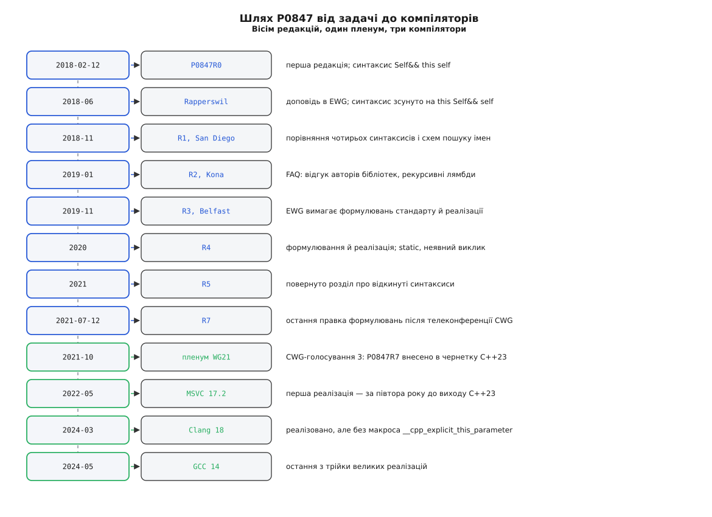

# 📜 Як чотири перевантаження стали зміною в мові

Явний параметр об'єкта народився не з бажання прикрасити синтаксис, а з бухгалтерії: у 2011 році мова додала членам-функціям ще одну вісь спеціалізації, і кількість тіл, які автор бібліотеки мусив писати вручну, підскочила з двох до чотирьох. Далі три з половиною роки й вісім редакцій паперу пішли на те, щоб цю бухгалтерію прибрати — і виявилося, що та сама зміна закриває ще дві давні болячки, які до неї ніхто не пов'язував між собою.

## Множення на два, яке зробив C++11

Доки члени-функції розрізнялися лише за `const`, дублікатів було два — і з цим мирилися. Ref-кваліфікатори C++11 додали другу незалежну вісь, і папір формулює наслідок прямо: замість потенційно двох перевантажень одної функції їх може знадобитися чотири — `&`, `const&`, `&&`, `const&&`.

Показовий приклад автори взяли з бібліотеки — [`optional<T>`](book:cpp-standards/optional) і його `value()`. Тіло скрізь одне й те саме: «якщо значення є — віддай його, ні — кинь виняток». Різниця між чотирма варіантами не в тому, **що** робиться, а в тому, **звідки** взявся об'єкт і чи можна з нього красти. Виходи були відомі й усі погані: чотири рази скопіювати тіло; написати одне справжнє, а три зробити перенаправленням на нього; винести роботу в приватну статичну функцію-шаблон і викликати її звідусюди. Останній варіант і є явний параметр об'єкта — тільки зроблений руками, з окремою назвою, зайвим членом класу й обов'язком не забути передати `*this` з правильною категорією.

Ключове спостереження, з якого виросла пропозиція: аргумент об'єкта завжди був аргументом — просто безіменним. Його тип записували не як тип параметра, а кваліфікаторами після дужок, а кваліфікатор не бере участі у виведенні шаблонних аргументів. Тож ідея паперу зводиться до одного речення: дати цьому аргументу ім'я в списку параметрів — і виведення запрацює саме собою, без жодних нових правил.

## Дві болячки, які виявилися тією самою

Коли аргумент об'єкта став звичайним параметром, з'ясувалося, що це задарма вирішує ще дві задачі.

Перша — [рекурсивна лямбда](book:cpp-standards/lambdas-and-captures). Замикання не має імені, доки не завершилося оголошення змінної, тож усередині тіла воно себе не бачить; обхідні шляхи — комбінатор нерухомої точки або `std::function` із захопленням посилання на саму змінну — коштували або читабельності, або непрямого виклику через купу. Явний параметр дає лямбді посилання на себе так само, як і будь-якій іншій функції-члену: `[](this auto self, int n){ … return self(n-1) + self(n-2); }`.

Друга — [CRTP](book:cpp-standards/crtp). Схема, у якій база — шаблон, параметризований власним нащадком, існувала рівно заради того, щоб база знала точний тип об'єкта, на якому її викликали. Виведений `Self` дає той самий тип напряму, з виразу виклику, і робить базу звичайним класом.

Три різні на вигляд проблеми — дублювання за кваліфікаторами, рекурсія в лямбді, статичний поліморфізм — виявилися трьома проявами одного дефіциту: тіло не знало типу власного об'єкта. Саме це об'єднання й зробило пропозицію переконливою для комітету.

## Чотири синтаксиси й порада EWG

Редакція R5 повернула в папір розділ, який автори були прибрали: історію відкинутих синтаксисів. Розглядали чотири.

```cpp
int get(this A const& a) { return a.i; }   // #1 — обрано
int get(A const& this)   { return this.i; } // #2
int get() A const& self  { return self.i; } // #3
int get() A const&       { return this->i; } // #4
```

Варіант #2 робив `this` іменем параметра — тобто надавав імені параметра особливого значення й погано вкладався в лямбди. Варіант #3 ставив тип об'єкта туди, де сьогодні стоять кваліфікатори; крім проблем із розбором, він не давав узяти об'єкт за значенням і не працював для лямбд. Варіант #4 зберігав звичне `this->`, але з тієї ж причини був непридатний для лямбд і для передавання об'єкта за значенням.

Показово, як мінявся навіть переможець. Перша редакція від 12 лютого 2018 року писала `Self&& this self` — з ключовим словом усередині оголошення параметра. До доповіді в Rapperswil у червні 2018-го його зсунули вперед, до `this Self&& self`, і саме ця форма дожила до стандарту. Порада EWG була в тому, щоб ідентифікатор для типу об'єкта стояв там, де стоять кваліфікатори, і щоб вибір між іменем і традиційним `this` був взаємовиключним — звідси й правило, що всередині такої функції `this` просто немає.

## Вісім редакцій



*Хронологія за власним розділом «Revision History» паперу P0847R7, звітом редактора N4902 і примітками до випусків компіляторів.*

Редакції розпадаються на дві половини. R0–R2 (Rapperswil, San Diego, Kona) — це пошук форми: перебір синтаксисів, схеми пошуку імен, FAQ із відповідями авторам бібліотек і розбір того, чи взагалі реалізовна рекурсивна лямбда. У Belfast на R3 EWG сказала те, що каже кожній серйозній мовній пропозиції: приносьте формулювання стандарту й робочу реалізацію. Далі R3–R7 — уже інша робота: текст стандарту, взаємодія зі `static`, `virtual` і корутинами, і рішення переставити такі функції з категорії статичних членів назад у нестатичні. R6 і R7 — самі лише правки формулювань після телеконференцій CWG; сьома редакція датована 12 липня 2021 року. Пленум WG21 у жовтні 2021-го вніс P0847R7 у робочу чернетку C++23 (звіт редактора N4902 від 22 жовтня 2021 року, голосування CWG № 3).

Дрібниця, яку варто зафіксувати правильно: у R0 співавтор підписаний як Simon Brand, у R7 — як Sy Brand, з адресою Microsoft; це одна людина, і саме її блог у Microsoft став першим широким поясненням риси (27 червня 2022 року). Решта складу — Ґашпер Ажман, Бен Дін, Баррі Ревзін — незмінна від першої редакції до останньої.

## Чому стандартна бібліотека лишилася зі старим `this`

Найцікавіше обмеження риси видно не в мові, а в тому, що з нею **не** зробили. Здавалося б, `optional::value` — приклад із мотивації — мав першим переписатися на новий лад. Не переписався, і причина в типах.

```
&Y::f   →   int (Y::*)(int, int) const&     звичайний член
&Y::g   →   int (*)(Y const&, int, int)     явний параметр об'єкта
```

Це вже не покажчик на член, а звичайний покажчик на функцію. Вираз `(y.*pf)(1, 2)` для нього не компілюється: синтаксис виклику через покажчик на член до нього не застосовний. Тобто перевести наявний член бібліотеки на явний параметр — значить змінити тип `&C::f` у всьому коді, що на нього спирався: у прив'язках, у таблицях покажчиків, у чужих обгортках. Це злам і вихідної сумісності, і [ABI](book:cpp-standards/abi-stability-cpp) — саме та ціна, якої стандартна бібліотека не платить майже ніколи.

Друга причина — з відгуку самих авторів реалізацій, зафіксованого у FAQ паперу: інтерес до риси висловили Кейсі Картер і Джонатан Вейклі, але на питання, чи піде вона в **інтерфейси** стандартної бібліотеки, відповідь була — «не без можливості обмежувати виведений тип». Шаблонний `Self` виводиться і в тип нащадка, а публічний інтерфейс на таке не розрахований. Тож риса пішла у внутрішні реалізації, а не в оголошення.

## Компілятори випередили стандарт, макрос відстав від компіляторів

Звичайний порядок — стандарт виходить, реалізації підтягуються роками. Тут вийшло навпаки: MSVC у складі Visual Studio 2022 версії 17.2 випустив підтримку в травні 2022-го — за півтора року до затвердження C++23. Clang дійшов до неї у 18-му випуску (2024), GCC — у 14-му (2024).

І остання деталь, яка коштувала людям часу: перевірка `#ifdef __cpp_explicit_this_parameter` на ранніх реалізаціях не спрацьовувала. MSVC 17.2 і 17.3 риси мали, а макроса не визначали; Clang 18 вважав підтримку експериментальною й теж макроса не виставляв — наявність риси там перевіряли через `__has_extension(cxx_explicit_this_parameter)`. Це типова фаза життя нової риси, і вона добре пояснює, чому «є в компіляторі» і «є за макросом» — два різні твердження, які збігаються не одразу.
