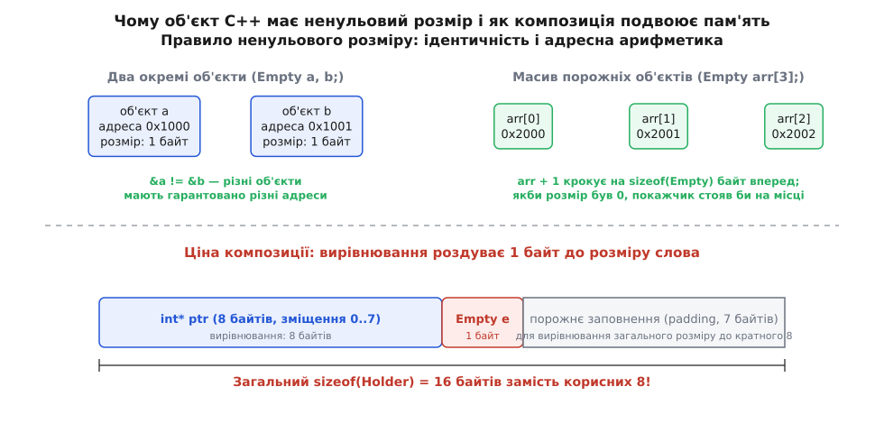
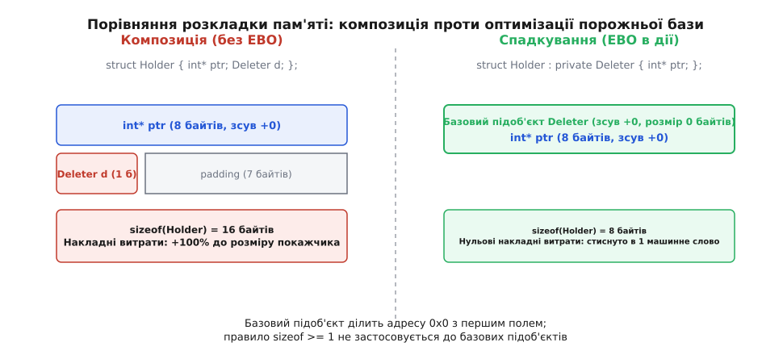

# Оптимізація порожньої бази й [[no_unique_address]]

<preknowlist>
- [Час життя об'єкта](topic:cpp-standards/object-lifetime) — створення, ідентичність і адреса об'єкта в пам'яті.
- [Вирівнювання й placement new](topic:cpp-standards/alignment-placement-new) — правила вирівнювання типів, розмір структури й заповнення (padding).
- [std::unique_ptr і семантика володіння](topic:cpp-standards/unique-ptr) — чому розмір розумного покажчика критичний для нульових накладних витрат.
- [Множинне й віртуальне спадкування](topic:cpp-standards/multiple-and-virtual-inheritance) — як компілятор розташовує базові підоб'єкти в пам'яті.
</preknowlist>

Оголосімо найпростіший клас, у якому немає жодного поля даних:

```cpp
struct Empty {};
```

Якщо запитати оператор `sizeof(Empty)`, компілятор C++ поверне не нуль, а щонайменше `1`. Цей одиничний байт видається незначною дрібницею, доки такий безстанний клас не стає полем іншої структури поруч зі звичайним 8-байтовим покажчиком. У той самий момент вмикаються апаратні правила вирівнювання адрес: фіктивний байт обростає сімома байтами порожнього заповнення (*padding*), і розмір структури подвоюється — з 8 байтів до 16.

Для системної мови, головною обіцянкою якої є принцип нульових накладних витрат (*zero-overhead principle* — «ви платите лише за те, чим користуєтеся»), подвоєння розміру кожного розумного покажчика, ітератора чи вузла дерева через збереження порожнього типу є неприпустимим марнотратством. Розгляньмо, чому мова C++ спочатку заборонила нульовий розмір об'єктів, як вимушена оптимізація порожньої бази (Empty Base Optimization, EBO) дозволила обійти це обмеження через спадкування і як стандарт C++20 нарешті розв'язав проблему на рівні полів за допомогою атрибута `[[no_unique_address]]`.

---

### Чому об'єкт не може мати розмір нуль

У повсякденній інтуїції відсутність стану асоціюється з відсутністю обсягу. Якщо об'єкт не містить чисел, символів чи вказівників, логічно очікувати, що він займає нуль байтів оперативної пам'яті. Проте у фізичній моделі пам'яті C++ кожен об'єкт — це не просто набір бітів, а сутність з унікальною **ідентичністю** (*identity*).

Ідентичність об'єкта в машинному коді виражається його адресою: покажчик `&obj` вказує на конкретну комірку в адресному просторі процесу. Якщо два об'єкти існують одночасно і є незалежними сутностями, їхні адреси зобов'язані різнитися:

```cpp
Empty a;
Empty b;
// Стандарт C++ гарантує: &a != &b
```

Якби `sizeof(Empty)` дорівнював 0, два розташовані поспіль у стеку об'єкти `a` та `b` отримали б однакове числове значення адреси. Порівняння `&a == &b` повернуло б `true`, що означало б, що `a` і `b` — це один і той самий об'єкт. Це зламало б асоціативні контейнери, алгоритми порівняння адрес, логіку блокувань та механізми відстеження часу життя.

Друга, ще жорсткіша причина криється в **адресній арифметиці масивів**. Згідно з фундаментальними правилами мов C та C++, зсув покажчика на наступний елемент масиву виконується за формулою:

```text
адреса(arr[i]) = адреса(arr[0]) + i · sizeof(T)
```

Створимо масив із трьох порожніх елементів:

```cpp
Empty arr[3];
Empty* p0 = &arr[0];
Empty* p1 = &arr[1];
```

Вираз `p0 + 1` пересуває покажчик рівно на `sizeof(Empty)` байтів уперед. Якби розмір дорівнював нулю, додавання одиниці не змінювало б адресу взагалі: покажчики `&arr[0]`, `&arr[1]` та `&arr[2]` вказували б на той самий початковий байт. Будь-який цикл обходу масиву `for (Empty* p = arr; p != arr + 3; ++p)` перетворився б на нескінченний цикл, оскільки умова `p != arr + 3` ніколи б не змінилася, а різниця покажчиків `std::distance(p0, p1)` завжди повертала б 0 або призводила до ділення на нуль.

Крім того, виділення динамічної пам'яті через вираз `new Empty[100]` вимагає повернення ста унікальних покажчиків, які згодом можна передати у відповідні індивідуальні деструктори.


*Зверху: два окремі об'єкти та елементи масиву зобов'язані мати унікальні адреси, тому sizeof(Empty) >= 1. Знизу: при наївній композиції 1 фіктивний байт через 8-байтове вирівнювання покажчика роздуває розмір структури з 8 до 16 байтів.*

Саме тому розділ стандарту `[intro.object]` містить категоричну норму: розмір будь-якого **повного об'єкта** (*complete object*), включно з класами без нестатичних полів даних, не може дорівнювати нулю і становить щонайменше 1 байт. Компілятор неявно виділяє для такого класу 1 фіктивний байт (*dummy byte*).

---

### Ієрархія сутностей у моделі пам'яті C++

Щоб чітко розібратися, де правило ненульового розміру діє безумовно, а де мова дозволяє винятки, необхідно розмежувати чотири фундаментальні категорії об'єктів у стандарті C++:

1. **Повний об'єкт (*complete object*)**: об'єкт, який не є підоб'єктом іншого об'єкта. Це локальні змінні на стеку, глобальні та статичні змінні або об'єкти, створені безпосередньо через `new`. Повний об'єкт **завжди** має розмір `sizeof >= 1` та ненульову область пам'яті.
2. **Підоб'єкт-член (*member subobject*)**: нестатичне поле даних, оголошене всередині класу чи структури. За замовчуванням кожне поле є самостійним підоб'єктом і займає щонайменше 1 байт.
3. **Елемент масиву (*array element subobject*)**: кожен елемент масиву розглядається як окремий підоб'єкт, що вимагає власної адреси для збереження коректності індексації.
4. **Базовий підоб'єкт (*base class subobject*)**: частина об'єкта похідного класу, що відповідає успадкованому базовому класу.

Ключове відкриття полягає в тому, що базовий підоб'єкт не є повним об'єктом. Він становить невіддільну частину більшого агрегата (похідного класу), і його час життя жорстко прив'язаний до часу життя цього похідного класу. Саме для базових підоб'єктів стандарт мови зробив фундаментальний виняток.

---

### Розбіжність між C та C++ щодо порожніх структур

Цікаво зіставити модель пам'яті C++ із мовою C.

У чистому стандарті C (ISO/IEC 9899) структури без полів даних формально заборонені граматикою мови: оголошення `struct Empty {};` є синтаксичною помилкою. Популярний компілятор GNU GCC підтримує порожні структури в C як нестандартне розширення (*GNU extension*), де `sizeof(struct Empty)` у режимі C дорівнює `0`.

Проте в мові C++ через наявність конструкторів, деструкторів, перевантаження операторів та поліморфізму порожні класи є повноправними громадянами мови, для яких розмір строго зафіксовано як `sizeof >= 1`. Ця фундаментальна різниця вимагає особливої уваги при проектуванні спільних заголовних файлів для сумісності між C та C++.

---

### Прихована ціна порожнього поля: композиція проти вирівнювання

У сучасному C++ класи без стану зустрічаються на кожному кроці:
- алокатори пам'яті за замовчуванням (`std::allocator<T>`);
- функції та функтори вилучення пам'яті (`std::default_delete<T>`);
- предикати впорядкування (`std::less<T>`, `std::greater<T>`);
- функції хешування (`std::hash<T>`);
- класи характеристик типів (*traits*) і теги категорій ітераторів.

Усі ці класи містять лише функції-члени або визначення типів (`using`, `typedef`) і не зберігають жодного байта внутрішнього стану.

Спробуймо написати компактний клас-обгортку, що інкапсулює сирий покажчик на ресурс і функтор вилучення:

```cpp
template <typename T, typename Deleter>
struct Holder {
    T* ptr;         // 8 байтів на 64-бітній платформі
    Deleter deleter; // Безстанний функтор (1 байт)
};
```

Порахуймо фізичний розмір `Holder<int, std::default_delete<int>>` на 64-бітній платформі:

```text
Зсув 0..7:   int* ptr                  — 8 байтів
Зсув 8:      default_delete deleter    — 1 байт
Зсув 9..15:  порожнє заповнення (pad)  — 7 байтів
--------------------------------------------------
Разом sizeof(Holder)                  — 16 байтів
```

Чому виникло 7 байтів заповнення? Оскільки поле `ptr` є 8-байтовим покажчиком, тип `Holder` вимагає вирівнювання за адресою, кратною 8 байтам (`alignof(Holder) == 8`). Щоб у масиві `Holder arr[2]` другий елемент `arr[1]` також починався за адресою, кратною 8, компілятор зобов'язаний доповнити розмір структури до кратного 8.

Навіть якщо змінити порядок полів:

```cpp
template <typename T, typename Deleter>
struct ReorderedHolder {
    Deleter deleter; // 1 байт на зсуві 0
    // 7 байтів padding між полями для вирівнювання ptr на адресу, кратну 8
    T* ptr;          // 8 байтів на зсуві 8
};
```

Загальний розмір структури все одно залишається рівним 16 байтам: тепер 7 байтів заповнення розміщуються не наприкінці, а між полем `deleter` та полем `ptr`.

У результаті через 1 фіктивний байт безстанного делітера розмір структури зріс рівно вдвічі. Якщо у вашій програмі мільйон таких об'єктів (наприклад, вузлів дерева чи елементів графа), ви витрачаєте 8 мегабайтів оперативної пам'яті суто на невидиме заповнення. Це вдвічі знижує ефективність використання процесорного кешу L1/L2 і збільшує навантаження на шину пам'яті.

> 🔧 **Навіщо це.** Розуміння ціни заповнення пояснює, чому бібліотечні типи `std::unique_ptr`, `std::vector` та `std::function` не зберігають алокатори й делітери як звичайні поля. Без спеціальної оптимізації кожен `std::unique_ptr` важив би 16 байтів замість 8, втрачаючи пряму сумісність із сирими машинними покажчиками.

---

### Механізм Empty Base Optimization (EBO)

Шукаючи вихід із цієї суперечності під час підготовки стандарту C++98, комітет WG21 звернув увагу на точне формулювання правила ненульового розміру. Вимога `sizeof >= 1` стосується **повних об'єктів** і **полів-членів**, але її не поширено на **базові класи** (*base class subobjects*).

Базовий клас не є окремим самостійним об'єктом у пам'яті: він існує лише як складова частина похідного класу (*derived class*). Компілятору дозволено розміщувати базовий підоб'єкт за тим самим зміщенням, що й перше поле похідного класу — тобто за зміщенням 0.

Цей дозвіл стандарту отримав назву **Оптимізація порожньої бази** (*Empty Base Optimization*, EBO).

Замість прямої композиції оголосимо, що похідний клас приватно спадкує від порожнього типу:

```cpp
template <typename T, typename Deleter>
struct OptimizedHolder : private Deleter {
    T* ptr; // Поле розташовується за зміщенням 0
};
```

Погляньмо на розкладку пам'яті `OptimizedHolder<int, std::default_delete<int>>`:

```text
Зсув 0:     базовий підоб'єкт Deleter — 0 корисних байтів у похідному класі
Зсув 0..7:  int* ptr                  — 8 байтів
--------------------------------------------------------------------------
Разом sizeof(OptimizedHolder)         — 8 байтів!
```

Базовий клас `Deleter` ділить фізичну адресу з полем `ptr` та самим об'єктом `OptimizedHolder`. Правило унікальності адрес не порушується: `OptimizedHolder` і його базова частина `Deleter` — це частини однієї об'єктної ієрархії, а не два окремі непов'язані об'єкти.


*При композиції делітер займає 1 байт на зсуві +8 і вимагає 7 байтів padding. При EBO базовий підоб'єкт має розмір 0 всередині похідного класу і ділить початкову адресу з полем ptr, скорочуючи розмір до 8 байтів.*

Детальну історію того, як формувалося це правило від перших трансляторів Б'ярна Страуструпа до публікацій Натана Маєрса й Андрея Александреску, викладено у вставці [Від заборони нульового розміру до [[no_unique_address]]](topic:cpp-standards/empty-base-optimization/hist-ebo-evolution.md).

---

### Низькорівневий аналіз: що генерує транслятор у машинному коді

Дослідимо, як компілятор транслює операції з порожніми базовими класами в інструкції x86-64 ассемблера.

Коли ми викликаємо метод або функтор базового класу:

```cpp
template <typename T, typename Deleter>
void destroy(OptimizedHolder<T, Deleter>& h) {
    static_cast<Deleter&>(h)(h.ptr);
}
```

У звичайній ситуації приведення `static_cast<Base&>(derived)` для непустих типів вимагає додавання числового зміщення до покажчика (`lea rax, [rdi + offset]`). Але у випадку EBO зміщення базового класу дорівнює нулю. Тому операція приведення типу `static_cast` є абсолютно безкоштовною під час виконання: компілятор не генерує жодної асемблерної інструкції, а покажчик на базовий клас збігається з покажчиком на похідний об'єкт.

Якщо метод `operator()` базового класу оголошено як `inline`, оптимізатор повністю вилучає виклик функції та вбудовує інструкції безпосередньо в тіло `destroy`. У результаті весь об'єкт функціонує з такою ж продуктивністю, як звичайний сирий машинний покажчик, без жодного байта зайвої пам'яті та без жодної зайвої інструкції процесора.

---

### EBO при множинному та віртуальному спадкуванні

Механізм EBO поширюється не лише на одиночне спадкування, а й на множинні базові класи, якщо вони є різними типами:

```cpp
struct AllocatorTag {};
struct ComparatorTag {};
struct LoggerPolicy {};

struct MultiOptimized : private AllocatorTag,
                        private ComparatorTag,
                        private LoggerPolicy {
    int* data;
};

static_assert(sizeof(MultiOptimized) == sizeof(int*)); // Рівно 8 байтів!
```

Усі три порожні базові класи отримують зміщення 0 і ділять початкову адресу з полем `data`. Оскільки їхні типи різняться (`AllocatorTag`, `ComparatorTag`, `LoggerPolicy`), компілятор розрізняє їх за типом вказівника, тому колізії ідентичності не виникає.

Проте ситуація кардинально змінюється, якщо до порожньої бази додати ключове слово `virtual`:

```cpp
struct VirtualBaseEmpty {};

struct BrokenOptimization : public virtual VirtualBaseEmpty {
    int* data;
};

static_assert(sizeof(BrokenOptimization) == 16); // Розмір зріс до 16 байтів!
```

Чому віртуальне спадкування руйнує оптимізацію?
Для реалізації динамічного зв'язування віртуальних базових класів компілятор змушений вставити в об'єкт прихований покажчик на таблицю віртуальних баз (*vbtbl pointer* або *vptr*). Цей покажчик займає 8 байтів на 64-бітній платформі. У результаті замість нульових накладних витрат об'єкт отримує додаткове машинне слово та непряму адресацію.

---

### Чому спадкування — погана заміна композиції

Незважаючи на блискучий результат у скороченні розміру, використання спадкування суто заради оптимізації пам'яті порушує базові принципи об'єктно-орієнтованого проектування (*Inheritance vs Composition*). Спадкування моделює відношення «є різновидом» (*is-a*), тоді як наявність алокатора чи делітера — це відношення «містить у собі» (*has-a*).

Цей архітектурний компроміс призвів до чотирьох практичних проблем:

**1. Неможливість оптимізувати `final`-класи.**
Починаючи з C++11, класи можна позначати ключовим словом `final`, що прямо забороняє спадкування від них. Якщо користувач передасть у вашу структуру stateless-делітер, оголошений як `struct MyDeleter final { ... };`, спроба успадкувати його в стилі EBO призведе до жорсткої помилки компіляції.

**2. Несумісність із фундаментальними типами й покажчиками.**
Від примітивних типів (`int`, `double`), покажчиків на функції (`void(*)(int*)`), посилань чи масивів неможливо успадкуватися синтаксично. Щоб узагальнена структура підтримувала як класи, так і покажчики на функції, доводилося писати громіздкі метапрограми з десятками спеціалізацій шаблонів.

**3. Колізії імен і витік інтерфейсу.**
Навіть приватне спадкування впливає на пошук імен (*name lookup*). Якщо базовий порожній клас містить метод або тип із тим самим ім'ям, що й похідний клас (наприклад, `allocate` або `value_type`), виникає неоднозначність (*ambiguity*), яку доводиться розв'язувати явними операторами `using`.

**4. Заборона однакових базових класів.**
Клас не може двічі успадкувати один і той самий тип. Якщо вам потрібно зберегти пару однакових порожніх об'єктів `Pair<Empty, Empty>`, пряме множинне спадкування `class Pair : Empty, Empty` не скомпілюється. Авторам бібліотек доводилося вигадовувати штучні проміжні типи з числовими тегами-дискримінаторами.

**5. Руйнування стандартного макета (*standard-layout*).**
У стандарті C++ тип вважається типом стандартного макета лише тоді, коли всі нестатичні поля даних оголошені в одному класі ієрархії, або всі базові класи не містять полів даних. Складні ієрархії спадкування часто позбавляли класи статусу `std::is_standard_layout_v`, що унеможливлювало їх використання в низькорівневих C-сумісних інтерфейсах (`memcpy`, двійкова серіалізація).

Повну реалізацію стисненої пари через класичний EBO та аналіз обхідних шляхів наведено у практичній вставці [Реалізація compressed_pair: EBO проти [[no_unique_address]]](topic:cpp-standards/empty-base-optimization/proj-compressed-pair.md).

---

### Атрибут C++20 `[[no_unique_address]]`

Щоб назавжди позбутися спадкування там, де потрібна звичайна композиція, стандарт C++20 ввів атрибут `[[no_unique_address]]`.

Цей атрибут застосовується безпосередньо до нестатичних полів-членів класу. Він прямо вказує компілятору: **цьому полю не потрібна унікальна адреса в пам'яті, якщо його тип є порожнім**.

```cpp
template <typename T, typename Deleter>
struct ModernHolder {
    T* ptr;
    [[no_unique_address]] Deleter deleter; // Чиста композиція!
};
```

Погляньмо на розмір `ModernHolder<int, std::default_delete<int>>` у C++20:

```cpp
static_assert(sizeof(ModernHolder<int, std::default_delete<int>>) == 8);
```

Компілятор розглядає поле `deleter` аналогічно до базового підоб'єкта: воно отримує зміщення 0 і фізично ділить адресу з першим полем `ptr`.


*Атрибут [[no_unique_address]] дозволяє полю deleter ділити початкову адресу 0x1000 з полем ptr. Розмір структури становить рівно 8 байтів без жодного спадкування чи спеціалізацій.*

Переваги `[[no_unique_address]]` над старим EBO:
1. **Підтримка `final`-класів**: атрибут працює з класами, поміченими як `final`, оскільки спадкування не відбувається.
2. **Чистий синтаксис**: не потрібні базові класи, проміжні вузли чи приватні ієрархії.
3. **Збереження стандартного макета (*standard-layout*)**: структура залишається звичайною послідовною структурою без побічних ефектів пошуку імен.
4. **Універсальність**: якщо тип поля містить стан (не є порожнім), атрибут автоматично ігнорується, і поле займає свій звичайний розмір без помилок компіляції.
5. **Повна сумісність із constexpr**: атрибут не накладає жодних обмежень на обчислення під час компіляції.

---

### Безстанні лямбда-вирази у C++20 та `[[no_unique_address]]`

У стандарті C++20 лямбда-вирази без захоплення контексту (*stateless lambdas*) отримали фундаментальне оновлення: вони стали конструктовними за замовчуванням (*default constructible*) та присвоюваними (*copy/move assignable*).

У поєднанні з `[[no_unique_address]]` це відкрило неймовірні можливості для створення кастомних структур:

```cpp
// Оголошуємо унікальний тип лямбди без збереження екземпляра
auto custom_deleter = [](int* p) noexcept {
    std::cout << "Вилучення ресурсу\n";
    delete p;
};

template <typename T, typename Callback>
struct EventListener {
    T* target;
    [[no_unique_address]] Callback on_event;
};

// Екземпляр структури зі stateless-функтором:
EventListener<int, decltype(custom_deleter)> listener{nullptr, {}};
static_assert(sizeof(listener) == sizeof(int*)); // Рівно 8 байтів!
```

До C++20 використання таких лямбд у шаблонних класах вимагало обов'язкової передачі екземпляра в конструктор або зберігання покажчика на функцію (`void(*)(int*)`), що неминуче додавало 8 байтів фізичного розміру. Тепер компілятор зберігає лише тип лямбди, а обсяг пам'яті залишається рівним нулю.

---

### Повторне використання проміжного заповнення (*tail padding reuse*)

Ще одна потужна, але маловідома можливість атрибута `[[no_unique_address]]` та правил розкладки Itanium C++ ABI — це повторне використання кінцевого заповнення (*tail padding reuse*) для непустих типів.

Розгляньмо структуру, що містить покажчик і символ:

```cpp
struct Header {
    void* ptr;  // 8 байтів на зсуві 0
    char flag;  // 1 байт на зсуві 8
    // 7 байтів tail padding до повного розміру 16 байтів
};
static_assert(sizeof(Header) == 16);
```

Якщо ми вбудуємо `Header` як звичайне поле в іншу структуру поруч із полем `int`:

```cpp
struct NaivePacket {
    Header header; // 16 байтів (зсув 0..15)
    int payload;   // 4 байти (зсув 16..19) + 4 байти padding
};
static_assert(sizeof(NaivePacket) == 24);
```

Поле `payload` розташовується на зсуві 16, оскільки `sizeof(Header) == 16`. 7 байтів заповнення всередині `Header` залишаються невикористаними.

Якщо ж ми застосуємо `[[no_unique_address]]`:

```cpp
struct OptimizedPacket {
    [[no_unique_address]] Header header;
    int payload;
};
static_assert(sizeof(OptimizedPacket) == 16); // Розмір зменшився з 24 до 16 байтів!
```

Оскільки атрибут `[[no_unique_address]]` дозволяє іншим полям ділити невикористаний простір, компілятор розміщує поле `int payload` безпосередньо всередині 7 байтів tail padding структури `Header` (на зсуві 12). У результаті весь пакет вміщується в 16 байтів замість 24!

---

### Взаємодія з явним вирівнюванням `alignas`

Цікавий крайовий випадок виникає, коли порожній клас містить директиву явного вирівнювання пам'яті:

```cpp
struct alignas(16) AlignedEmpty {};
static_assert(sizeof(AlignedEmpty) == 16); // Розмір дорівнює вирівнюванню
```

Повний об'єкт `AlignedEmpty` займає 16 байтів через вимогу `alignas(16)`. Але що станеться, якщо застосувати `[[no_unique_address]]` усередині структури?

```cpp
struct AlignedHolder {
    [[no_unique_address]] AlignedEmpty tag;
    int* ptr;
};
```

У цьому випадку:
- поле `tag` не містить корисних даних, тому його розмір становить 0 байтів;
- проте вимога вирівнювання `alignas(16)` **зберігається** і поширюється на всю структуру `AlignedHolder`;
- початкова адреса `AlignedHolder` та покажчика `ptr` вирівнюється за межею 16 байтів, а загальний розмір структури доповнюється до 16 байтів.

Таким чином, `[[no_unique_address]]` усуває збереження фіктивних байтів стану, але завжди шанує апаратні обмеження вирівнювання адрес.

---

### Реальні структури: `std::unique_ptr` та `std::tuple`

Щоб оцінити практичну міць цієї оптимізації, дослідимо дві фундаментальні структури стандартної бібліотеки.

#### 1. Стиснення в `std::unique_ptr`

Розумний покажчик `std::unique_ptr<T, Deleter>` приймає два параметри шаблона: тип об'єкта `T` та тип функції очищення `Deleter`.

```cpp
// 1. Звичайне використання зі стандартним безстанним делітером:
std::unique_ptr<int> p1 = std::make_unique<int>(42);
static_assert(sizeof(p1) == sizeof(int*)); // Рівно 8 байтів!

// 2. Використання зі stateless лямбда-функцією (C++20):
auto stateless_del = [](int* p) noexcept { delete p; };
std::unique_ptr<int, decltype(stateless_del)> p2(new int(10), stateless_del);
static_assert(sizeof(p2) == 8); // Стискається в 1 машинне слово!

// 3. Використання зі stateful делітером (наприклад, захоплює контекст арени):
struct ArenaDeleter {
    void* arena_context; // 8 байтів стану
    void operator()(int* p) const noexcept { /* звільнення в арену */ }
};
std::unique_ptr<int, ArenaDeleter> p3(new int(20), ArenaDeleter{nullptr});
static_assert(sizeof(p3) == 16); // Природно зростає до 16 байтів
```

Завдяки оптимізації порожньої бази (у C++11/17 через EBO-обгортки на кшталт `__compressed_pair`, а в C++20 через `[[no_unique_address]]`) покажчик `std::unique_ptr` із безстанним делітером має **абсолютно ідентичну розкладку в пам'яті та двійковий інтерфейс ABI**, що й сирий покажчик `int*`.

Згідно з угодою виклику System V AMD64 ABI, 8-байтова структура `std::unique_ptr<int>` повертається з функцій безпосередньо в регістрі процесора `rax`. Натомість неоптимізована 16-байтова структура вимагала б передачі через два регістри або через стек пам'яті.

#### 2. Ієрархічне стиснення в `std::tuple`

Кортеж `std::tuple<Types...>` повинен зберігати довільний набір типів. Якщо серед елементів кортежу є порожні типи-теги або алокатори, наївне збереження полів призвело б до катастрофічного роздування структури:

```cpp
struct TagA {};
struct TagB {};
struct TagC {};

std::tuple<TagA, TagB, TagC, int> t(TagA{}, TagB{}, TagC{}, 100);
// Без оптимізації: 1б + 1б + 1б + 1б(пад) + 4б(int) = 8 байтів
// З оптимізацією tuple: рівно 4 байти!
static_assert(sizeof(t) == sizeof(int));
```

Стандартні бібліотеки будують `std::tuple` як композицію вузлів з `[[no_unique_address]]` або рекурсивну ієрархію базових класів. Усі порожні типи `TagA`, `TagB`, `TagC` отримують зміщення 0, а поле `int` також розташовується на початку структури. У результаті розмір кортежу визначається виключно розміром його непустих елементів.

---

### Вплив на оптимізацію стандартних контейнерів `std::vector` та `std::string`

Оптимізація порожньої бази визначає внутрішній устрій усіх динамічних контейнерів STL. Розгляньмо структуру динамічного масиву `std::vector<T, Allocator>`.

Вектор керує трьома покажчиками пам'яті:
- `begin_` — початок виділеного буфера;
- `end_` — кінець зайнятих елементів;
- `end_capacity_` — кінець виділеної ємності.

Крім покажчиків, вектор зобов'язаний зберігати екземпляр алокатора `Allocator`. Стандартний алокатор `std::allocator<T>` є порожнім класом.

У бібліотеках GNU libstdc++ та LLVM libc++ алокатор упаковується разом із покажчиками за допомогою EBO або `[[no_unique_address]]`. У результаті:
- розмір `sizeof(std::vector<T>)` становить рівно 24 байти (3 машинних слова по 8 байтів);
- якби алокатор зберігався як звичайне поле, 1 фіктивний байт спричинив би додавання 7 байтів padding, і розмір вектора зріс би до 32 байтів (+33% накладних витрат на кожен вектор у програмі!).

Аналогічно короткий оптимізований рядок `std::string` (Small String Optimization, SSO) використовує EBO для збереження алокатора всередині спільного об'єднання (*union*), що дозволяє вмістити до 15 або 22 символів тексту прямо в тілі рядка без виділення динамічної пам'яті.

---

### Крайові випадки та пастки розкладки пам'яті

Оптимізація порожніх об'єктів підпорядковується суворим математичним правилам і має три неочевидні крайові випадки, які здатні збити з пантелику навіть досвідченого інженера.

#### Пастка 1: Два порожні члени однакового типу

Що станеться, якщо ми створимо структуру з двома порожніми членами **одного й того самого типу**?

```cpp
struct EmptyTag {};

struct CollisionStruct {
    [[no_unique_address]] EmptyTag first;
    [[no_unique_address]] EmptyTag second;
    int payload;
};
```

Здавалося б, компілятор повинен дати зміщення 0 обом полям `first` та `second`, і розмір структури дорівнюватиме `sizeof(int) == 4` байти.

Проте перевірка дає несподіваний результат:

```cpp
static_assert(sizeof(CollisionStruct) == 8); // Чому 8, а не 4?!
```


*Ліворуч: два РІЗНІ порожні типи можуть мати однакову адресу 0x0. Праворуч: два ОДНАКОВІ типи зобов'язані мати різні адреси, тому поле second зміщується на +1 байт, що через вирівнювання роздуває розмір структури до 8 байтів.*

Причина полягає у базовій аксіомі ідентичності C++: **два різні підоб'єкти одного типу в межах одного повного об'єкта не можуть мати однакову адресу**.

Якби `&first == &second`, то виклик методу через покажчик на `EmptyTag` не міг би розрізнити, до якого саме члена структури звертається програма. Тому компілятор зобов'язаний призначити:
- `first` — зміщення 0;
- `second` — зміщення 1 (для гарантії `&first != &second`);
- після зміщення 1 з'являється 2 байти заповнення, щоб поле `int payload` почалося за адресою, кратною 4 (зміщення 4);
- сумарний розмір структури зростає до 8 байтів!

Якщо ж типи порожніх членів є різними (`EmptyTagA` та `EmptyTagB`), їхні адреси **можуть збігатися**, оскільки система типів C++ розрізняє їх за типом покажчика. Тоді розмір становитиме рівно 4 байти.

#### Пастка 2: Збіг типу поля з базовим класом

Аналогічне обмеження діє при комбінації спадкування та полів:

```cpp
struct BaseEmpty {};

struct Derived : BaseEmpty {
    [[no_unique_address]] BaseEmpty member_empty;
    int value;
};
```

Оскільки базовий клас `BaseEmpty` уже займає зміщення 0 як базовий підоб'єкт, поле `member_empty` того самого типу `BaseEmpty` **не може бути розташоване за зміщенням 0**. Компілятор вимушено зсуває його на зміщення 1, додає заповнення і роздуває структуру `Derived` до 8 байтів.

#### Пастка 3: Особливість Microsoft Visual C++ (MSVC) та `[[msvc::no_unique_address]]`

Розробники, які пишуть кросплатформний код під Windows, стикаються з неприємним сюрпризом: у компіляторі MSVC стандартний атрибут `[[no_unique_address]]` за замовчуванням **ігнорується**.

Причина криється у двійковій сумісності (ABI). У MSVC правила розташування структур зафіксовані у двійковому форматі Windows ABI. Якби увімкнення стандарту C++20 неявно змінило розміри структур у заголовних файлах бібліотек, це зламало б двійкову сумісність між DLL, зібраними різними версіями компілятора.

Щоб оптимізація спрацювала в MSVC, необхідно використовувати вендорний атрибут `[[msvc::no_unique_address]]`:

```cpp
// Кросплатформний шаблон макроса
#if defined(_MSC_VER) && !defined(__clang__)
    #define COURSES_NO_UNIQUE_ADDRESS [[msvc::no_unique_address]]
#else
    #define COURSES_NO_UNIQUE_ADDRESS [[no_unique_address]]
#endif

struct PortableHolder {
    int* ptr;
    COURSES_NO_UNIQUE_ADDRESS Empty deleter;
};
```

#### 4. Діагностика компіляторів та інтроспекція типів

Під час розробки високоефективних узагальнених бібліотек критично важливо програмно перевіряти, чи спрацювала оптимізація розміру для конкретного набору типів. Для цього стандарт C++ надає набір метафункцій у заголовному файлі `<type_traits>`:

- `std::is_empty_v<T>`: повертає `true`, якщо тип `T` є класом без нестатичних полів даних (крім бітових полів нульової довжини), без віртуальних функцій і без віртуальних базових класів;
- `std::is_standard_layout_v<T>`: підтверджує, що структура має передбачувану розкладку пам'яті, сумісну з мовою C;
- `std::is_final_v<T>`: сигналізує про неможливість застосування класичного EBO через спадкування.

Сучасні компілятори Clang та GCC видають попередження `-Wattributes`, якщо атрибут `[[no_unique_address]]` застосовано до статичного члена, посилання або невідповідної сутності. Компілятор MSVC у разі відсутності префікса `msvc::` безшумно ігнорує атрибут, що робить перевірки розмірів через `static_assert(sizeof(...) == ...)` обов'язковою практикою тестування кросплатформного коду.

---

### Порівняльний синтез: вибір інструменту

Зведемо правила вибору між підходами до єдиної інженерної матриці рішень:

| Ситуація / Вимога | Звичайна композиція | EBO (C++11/17) | `[[no_unique_address]]` (C++20) |
| :--- | :--- | :--- | :--- |
| **Розмір зі stateless-типом** | Роздувається через padding | 0 додаткових байтів | 0 додаткових байтів |
| **Синтаксична простота** | Висока (`T field;`) | Низька (ієрархія спадкування) | Висока (`[[no_unique_address]] T field;`) |
| **Робота з `final`-класами** | Так | Ні (помилка компіляції) | Так |
| **Робота зі скалярами / покажчиками** | Так | Ні (потрібні спеціалізації) | Так (ігнорується без помилок) |
| **Пошук імен та інкапсуляція** | Ідеальна | Ризик колізій імен бази | Ідеальна |
| **Збереження standard-layout** | Так | Часто втрачається | Повністю зберігається |
| **Повторне використання tail padding** | Ні | Лише для базових класів | Повне для членів |
| **Підтримка у стандартах** | Усі версії C++ | C++98 / C++11 / C++14 / C++17 | C++20 і новіші |

Оптимізація порожньої бази та атрибут `[[no_unique_address]]` демонструють, як глибинні вимоги двійкового представлення даних і адресної ідентичності перетворюються на висококласні засоби оптимізації. Завдяки їм узагальнені абстракції C++ — від розумних покажчиків до складних кортежів — зберігають безкомпромісну нульову ціну абстракції.
