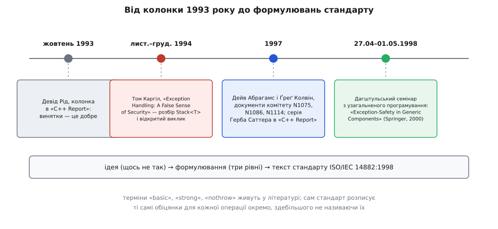

# 📜 Виклик Каргіла: як із однієї сердитої статті виросли три гарантії

Слова «базова», «сильна» і «nothrow» не з'явилися разом із винятками — вони народилися майже через десять років після них, із публічного визнання того, що спільнота C++ не вміє писати стійкий до винятків код, і з відкритого виклику, який чотири роки лишався неприйнятим. Ця вставка — про те, хто, коли й у якому порядку пройшов шлях від «щось тут не так» до формулювань, що лежать у тексті стандарту.

*Ідея, формалізація й текст стандарту — три різні події, розтягнуті на п'ять років.*

## Колонка, на яку не було чим відповісти

У жовтні 1993 року в журналі «C++ Report» вийшла колонка Девіда Ріда (David Reed) на захист винятків: механізм молодий, але корисний, і код із ним виходить чистіший, ніж код із перевіркою кодів помилок після кожного виклику. Аргумент був звичний і на вигляд незаперечний: винятки прибирають шум обробки помилок із головної лінії алгоритму.

Через рік, у здвоєному листопадово-грудневому числі «C++ Report» за 1994 рік, Том Каргіл (Tom Cargill) відповів статтею «Exception Handling: A False Sense of Security» — «Обробка винятків: облудне відчуття безпеки». Починалася вона фразою, яку відтоді цитують частіше, ніж усе решта: він підозрює, що більшість спільноти C++ дуже недооцінює навички, потрібні, щоб програмувати з винятками, а отже недооцінює й справжню ціну їх використання.

Каргіл узяв не надуманий приклад, а той, що був у самій колонці Ріда: шаблон `Stack<T>` — простий стек із масивом у купі, конструктором копіювання, деструктором, `push`, `pop`, `count` і оператором присвоєння. Кілька десятків рядків, які будь-хто написав би на дошці за хвилину.

## Що саме він побачив

Розбір ішов метод за методом, і кожна знахідка була не про синтаксис `try`/`catch`, а про звичайний код між ними.

У `pop` значення знімалося зі стеку виразом, де постдекремент вершини стояв усередині аргумента конструктора копіювання `T`. Отже, вершина вже зсунулася, коли копіювання почалося. Якщо копіювання кине виняток, елемент утрачено назавжди: стек уже вважає його знятим, а той, хто викликав, значення не отримав і повторити спробу не може.

В `operator=` старий масив звільнявся до того, як новий було успішно виділено. Виняток із виділення пам'яті лишав об'єкт із покажчиком на звільнену пам'ять — і потім деструктор чесно звільняв її вдруге. Самоприсвоєння теж не оброблялося, тобто той самий шлях вів до читання вже вилученої пам'яті.

У циклах копіювання елементів у конструкторі копіювання виняток із присвоєння `T` означав витік щойно виділеного масиву: конструктор не завершився, тож деструктор об'єкта не викличеться ніколи.

Спільне в усіх чотирьох знахідках одне: `Stack<T>` не знає нічого про `T`. Будь-яка операція над елементом — копіювання, присвоєння — може кинути виняток, і автор шаблону не має права припускати протилежне. Саме звідси головна теза статті: важка частина роботи з винятками — не явні `throw` і `catch`, а весь проміжний код, написаний так, щоб довільний виняток міг долетіти від місця кидання до обробника, не пошкодивши дорогою решту програми.

> 🔧 **Навіщо це.** Теза Каргіла пояснює, чому «безпека винятків» узагалі стала окремою темою, а не приміткою до опису механізму. Механізм розкручування стека сам собою простий і давно описаний — гляньте [як виняток шукає обробник і що робить із локальними об'єктами](book:cpp-standards/exceptions-mechanism). Складність лежить не в ньому, а в тому, що кожен виклик у вашому коді — це потенційна точка виходу з функції, про яку в тексті нічого не написано.

## Виклик, який чотири роки лишався відкритим

Найцікавіше в статті — її кінець. Каргіл не подав виправленої версії. Він запросив Ріда — або будь-кого іншого — опублікувати `Stack`, коректний щодо винятків, і чесно зізнався, що не певен, чи зумів би написати таку версію сам. Він навмисно лишив аналіз незавершеним, щоб змусити читачів самостійно пройти всі шляхи.

Через це статтю почали переказувати сильніше, ніж вона твердила. З «я не знаю, як це зробити» виріс міф «написати узагальнений контейнер, безпечний щодо винятків, неможливо» — саме в такому вигляді тезу згодом і спростовували. Доказовий статус тут варто розділити: те, що Каргіл поставив питання й не дав відповіді, — факт із самого тексту; те, що він оголосив задачу нерозв'язною, — перебільшення переказу, у статті сказано обережніше.

Виклик виявився продуктивним саме тому, що лишався відкритим. Він перетворив розмову «винятки — це добре чи погано» на конкретну інженерну задачу з опублікованим прикладом, який кожен міг узяти й спробувати полагодити.

## Хто відповів

Відповідь визрівала кілька років і в двох різних середовищах — журнальному й комітетському.

У журналах. У 1997 році Герб Саттер (Herb Sutter) вів у «C++ Report» рубрику задач «Guru of the Week» і присвятив безпеці винятків цілу серію випусків, побудованих навколо того самого сюжету: узагальнений контейнер, який мусить лишатися цілим, коли операції над елементом кидають. Серія розв'язувала задачу Каргіла явно — з переробленим інтерфейсом, розділеним `pop`, ідіомою обміну — і згодом склала десятичастинний розділ «Exception Safety» у книзі «Exceptional C++» (Addison-Wesley, 1999), позиції 8–17. Роки й книжка перевірені; точні номери журнальних чисел 1997 року я тут не наводжу — вони в мене не підтверджені первинним джерелом.

У комітеті. Паралельно Дейв Абрагамс (Dave Abrahams) писав робочі документи для WG21 — комітету зі стандартизації C++. У 1997 році до комітету надійшли N1075 «STL Exception Handling Contract» за його авторством і N1086 «Making the C++ Standard Library Exception-Safe» разом із Ґреґом Колвіном (Greg Colvin), а трохи згодом N1114 «Making the C++ Standard Library More Exception Safe». Тут була вже не задача про один стек, а спроба сказати для **кожної** операції стандартної бібліотеки, що саме вона обіцяє, коли всередині кинуто виняток.

Ці документи важливі тим, що фіксують точку переходу від прикладу до системи. Каргіл показав, що з `Stack<T>` щось не так. Абрагамс і Колвін мусили сказати те саме про сотні операцій контейнерів та алгоритмів — і зробити це так, щоб формулювання були перевірними й не суперечили одне одному. Про те, як узагалі влаштований цей шлях від документа до тексту норми, є окрема тема — [хто такий WG21, що таке N-документи й що з ними відбувається](book:cpp-standards/standardization-process).

Перевіркою на реальність стала реалізація: Абрагамс написав контейнери з обіцяними гарантіями та набір тестів, який штучно кидає винятки в кожній точці виділення пам'яті й перевіряє, що інваріанти вціліли. Цим набором потім ганяли різні реалізації STL — зокрема SGI STL та її похідну STLport. Це і є доказ, якого бракувало 1994 року: не «я вважаю, що можна», а «ось код, ось тести, ось результати».

## Дагштуль, квітень 1998

Формулювання, у якому три рівні остаточно склалися в систему, було виголошене на семінарі з узагальненого програмування в замку Дагштуль (Schloss Dagstuhl, Німеччина) — семінар 98171, 27 квітня — 1 травня 1998 року, організатори Александр Степанов, Девід Мюссер, Мехді Джазаєрі та Рюдіґер Лоос. Праця Абрагамса «Exception-Safety in Generic Components» із підзаголовком «Lessons Learned from Specifying Exception-Safety for the C++ Standard Library» увійшла до збірника, який Springer видав 2000 року в серії Lecture Notes in Computer Science, том 1766, сторінки 69–79.

Саме там три обіцянки названі й розведені так, як їх вживають дотепер: базова — інваріанти компонента збережено й нічого не витекло; сильна — операція або завершилася успішно, або кинула виняток, лишивши стан програми точно таким, яким він був до її початку; nothrow — операція не кине винятку взагалі. Там-таки прямо розібрано випадок Каргіла: він поставив корисні питання, але не дав розв'язку й припустив, що розв'язку може не бути; головною перешкодою була невдала комбінація його власних рішень — обраний інтерфейс контейнера не поєднувався з тими вимогами безпеки, яких він від нього хотів.

## Що з цього справді потрапило в стандарт

Тут потрібне розрізнення, яке губиться в переказах.

**Ідея** — 1994, Каргіл: проміжний код і є задача.

**Формалізація** — 1997–1998, Абрагамс і Колвін: три рівні як словник, яким можна описати кожну операцію бібліотеки, плюс реалізація й тести.

**Текст норми** — ISO/IEC 14882:1998. І ось тут несподіванка: стандарт не вводить розділу «три гарантії безпеки винятків» із цими назвами. Зміни вносилися пізно в процесі стандартизації, і Колвін виконав ту частину роботи, що полягала в мінімальному переписуванні тексту — обіцянки розписані для конкретних операцій конкретних контейнерів, здебільшого без загальних імен. Слова «basic», «strong», «nothrow» як стала термінологія живуть у літературі й у робочих документах; у самому стандарті вони закріплювалися поступово й частково, а не однією таблицею. Тому чесне формулювання таке: стандарт 1998 року дав **зобов'язання**, література дала **назви** для них.

Ця різниця досі відчутна на практиці. Коли ви читаєте, що `vector::push_back` дає сильну гарантію, ви читаєте не цитату з норми — ви читаєте зручний переказ кількох окремих речень стандарту про те, що станеться з вектором, якщо виділення пам'яті або переміщення елемента кине. Що саме обіцяють різні контейнери й чому їхні обіцянки відрізняються, розібрано там, де порівнюють [самі контейнери та їхні компроміси](book:cpp-standards/stl-containers-choice).

## Доказовий статус коротко

Перевірено первинними джерелами: колонка Ріда — жовтень 1993, «C++ Report»; стаття Каргіла з наведеною назвою — листопад-грудень 1994, там-таки, разом із розбором `Stack<T>`, цитованою тезою про проміжний код і фінальним запрошенням опублікувати коректну версію; документи WG21 N1075, N1086, N1114 за 1997 рік у списку паперів комітету; Дагштульський семінар 98171 із зазначеними датами й організаторами; праця Абрагамса в LNCS 1766, с. 69–79; книга Саттера «Exceptional C++» 1999 року з десятичастинним розділом про безпеку винятків.

Установлений із вторинних джерел, але надійно: роль Колвіна в редагуванні тексту стандарту; використання тестового набору Абрагамса для перевірки реалізацій STL, зокрема SGI STL та STLport.

Не перевірено тут і подано з застереженням: точні місяці журнальних публікацій Саттера 1997 року.

Міф, який варто називати міфом: «Каргіл довів, що безпечний узагальнений контейнер написати неможливо». Він цього не доводив і не стверджував — він сказав, що не знає як, і попросив показати. Показали через три роки.
