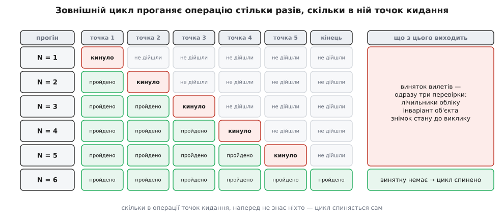
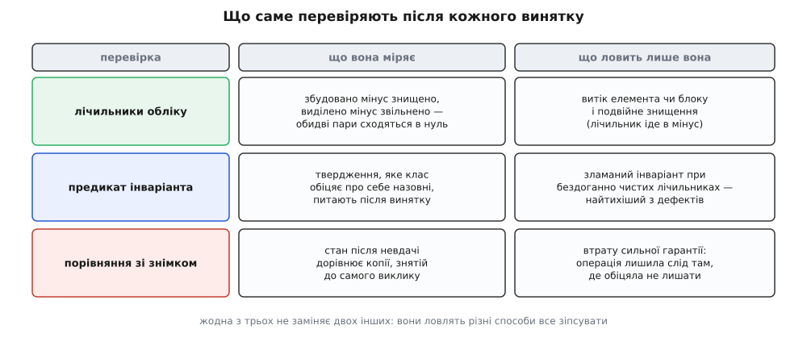

# ⚙️ Довести гарантію тестом: розтяжка, що кидає на N-й операції

Фраза «ця операція дає сильну гарантію» лишається словом честі доти, доки її не перевірили на кожному шляху винятку, — а звичайний тест туди не заходить, бо не вміє змусити `new` провалитися. Знаряддя, яким туди заходять, будується з трьох деталей і вкладається в сотню рядків.

## Задача: тест не має доступу до того, що перевіряє

Напишіть найретельніший тест на метод, що додає елемент у контейнер. Він подасть різні входи, перевірить розмір, вміст, порядок — і жодного разу не побачить, що станеться, коли посеред цього методу закінчиться пам'ять. Не тому, що тест поганий, а тому, що на машині з вісьмома гігабайтами `new` не провалюється на замовлення.

Припустімо навіть, що пам'ять таки закінчилася. Виняток вилетить з **однієї** точки — тієї, до якої дійшло виконання, коли скінчилася купа. А в методі таких точок може бути десяток: виділення буфера, перенесення кожного наявного елемента, побудова нового, зростання другого контейнера. Гарантія — це твердження про **всі** ці точки одразу. Один випадковий збій доводить рівно одну з них.

Отже, задача формулюється так. Нехай в операції є K місць, з яких керування здатне піти назовні. Треба прогнати операцію так, щоб кожне з K по черзі спрацювало рівно один раз, і після кожного спрацювання поставити об'єктові три питання: чи нічого не втрачено, чи тримається [інваріант класу](topic:programming/invariants) — твердження, яке клас обіцяє про себе кожному, хто на нього дивиться, — і (для сильної гарантії) чи стан збігається з тим, що був до виклику. Число K наперед не знає ніхто: воно залежить від реалізації контейнера, від поточної ємності, від того, чи помічений конструктор переміщення як `noexcept`. Знаряддя мусить обійтися без цього числа.

## Ідея: не чекати збою, а призначити його

Замість чекати збою його **призначають**. Заводять один глобальний лічильник і домовляються: кожна операція, здатна кинути в справжньому коді, спершу питає в лічильника дозволу. Лічильник відлічує вниз і на нулі кидає `std::bad_alloc`.

Далі — зовнішній цикл. Прогін з лічильником, зведеним на 1, обриває операцію в першій же точці. Прогін з 2 — у другій. І так доти, доки операція нарешті **не пройде ціла**: це означає, що точок у ній менше, ніж поточне N, тобто всі вони вже були відвідані. Цикл спиняється сам, а останнє N, на якому виняток ще вилітав, і є тим самим K.


*Кожен рядок — окремий прогін операції на свіжому піддослідному об'єкті. Критерій зупинки не потребує знати наперед, скільки в операції ризикових місць.*

Прийом не належить C++ і навіть не належить тестуванню пам'яті: це окремий випадок [інжекції збоїв](topic:programming/fault-injection) — навмисного псування середовища, щоб побачити код на шляхах, куди він у нормальному житті не заходить. Особливість тут у критерії вичерпності: збої не випадкові, а перелічені по одному, тож наприкінці відомо, що жодного не пропущено.

## Деталь перша: розтяжка

```cpp
#include <cstddef>
#include <new>

// Розтяжка: рівно один виняток на прогін, рівно на N-й події.
class Tripwire {
    long long left_  = 0;
    bool      armed_ = false;
public:
    void arm(long long n) { left_ = n; armed_ = true; }
    void disarm()         { armed_ = false; }

    void tick() {
        if (!armed_) return;
        if (--left_ == 0) { armed_ = false; throw std::bad_alloc{}; }
    }
};

inline Tripwire& wire() { static Tripwire w; return w; }
```

Назва — від англ. *tripwire*, натягнутого дроту, що спускає пастку: дріт можна нап'ясти й зняти, і поки він знятий, ходити повз безпечно.

Найважливіший рядок тут — `armed_ = false` **перед** `throw`. Розтяжка мусить спрацювати за прогін один-єдиний раз. Інакше під час розкрутки стека код відкату, якому теж треба щось виділити, наштовхнеться на другий виняток — і замість зрозумілого провалу тесту ви отримаєте `std::terminate` десь у чужому деструкторі. Та сама обачність зашита в libc++: його лічильник, дійшовши до нуля, повертає себе в стан «ніколи не кидати» тим самим рухом, яким кидає.

## Деталь друга: облік і зонд

```cpp
// Чотири числа, а не одне — про це нижче.
struct Ledger {
    long long built = 0, killed = 0;   // конструкції й деструкції елементів
    long long taken = 0, given = 0;    // виділені й звільнені блоки пам'яті
    long long live()   const { return built - killed; }
    long long blocks() const { return taken - given; }
};

inline Ledger& tally() { static Ledger l; return l; }

// Елемент-зонд: кожна дія, здатна кинути в справжньому типі,
// проходить через розтяжку. Деструктор — ніколи.
template <bool NothrowMove>
class Probe {
    int v_;
public:
    explicit Probe(int v = 0) : v_(v)    { wire().tick(); ++tally().built; }
    Probe(const Probe& o)     : v_(o.v_) { wire().tick(); ++tally().built; }

    Probe(Probe&& o) noexcept(NothrowMove) : v_(o.v_) {
        if constexpr (!NothrowMove) wire().tick();
        ++tally().built;
    }

    Probe& operator=(const Probe& o) { wire().tick(); v_ = o.v_; return *this; }

    Probe& operator=(Probe&& o) noexcept(NothrowMove) {
        if constexpr (!NothrowMove) wire().tick();
        v_ = o.v_;
        return *this;
    }

    ~Probe() { ++tally().killed; }

    // Порівняння без побічних дій і без тику — ним звірятимуть знімок.
    friend bool operator==(const Probe& a, const Probe& b) { return a.v_ == b.v_; }
    friend bool operator!=(const Probe& a, const Probe& b) { return !(a == b); }
};
```

Порядок усередині конструкторів не декоративний: `tick()` стоїть **до** `++tally().built`. Якщо розтяжка спрацювала, об'єкт так і не народився, і облік не має його зараховувати. Переставте два рядки місцями — і тест почне бачити витік там, де його немає.

Деструктор не тикає ніколи й ні за яких налаштувань. Деструктор, з якого вилітає виняток, у C++ не дає помилки тесту — він дає негайну смерть процесу, бо з C++11 у деструктора неявна специфікація [`noexcept`](topic:cpp-standards/noexcept), і виняток, що спробує з нього вийти, приводить до `std::terminate`.

Параметр `NothrowMove` — не забаганка. Вектор питає в типу, чи його конструктор переміщення помічений `noexcept`, і залежно від відповіді при зростанні або переносить елементи [переміщенням](topic:cpp-standards/move-semantics), або копіює їх, лишаючи старий буфер цілим як точку відкату. Це два різні шляхи коду з різними наборами точок кидання й різними гарантіями — тож прочісувати треба обидва, підставивши `Probe<true>` і `Probe<false>`.

## Деталь третя: алокатор

```cpp
template <class T>
struct Probing {
    using value_type = T;
    Probing() = default;
    template <class U> Probing(const Probing<U>&) noexcept {}

    T* allocate(std::size_t n) {
        wire().tick();                      // ось тут «пам'ять закінчилася»
        void* p = ::operator new(n * sizeof(T));
        ++tally().taken;
        return static_cast<T*>(p);
    }
    void deallocate(T* p, std::size_t) noexcept {
        ++tally().given;
        ::operator delete(p);
    }
};

template <class A, class B>
bool operator==(const Probing<A>&, const Probing<B>&) noexcept { return true; }
template <class A, class B>
bool operator!=(const Probing<A>&, const Probing<B>&) noexcept { return false; }
```

Алокатор навмисно **порожній і без стану**. Порожність тут не економія, а вимога: `is_always_equal` для такого типу виводиться істинним, а від цього залежить, чи буде `swap` двох векторів позначений `noexcept`. Далі саме на цьому `swap` стоятиме фіксація сильної гарантії — тож алокатор зі станом мовчки вибив би з-під неї опору. Решта вимог до типу алокатора й те, як `allocator_traits` добудовує все, чого ви не написали, — у темі про [власні алокатори](topic:cpp-standards/custom-allocators).

Разом зонд і алокатор — це звичайні [дублери](topic:programming/test-doubles), тільки в незвичній ролі: вони не підміняють залежність заглушкою, а зберігають повну поведінку справжньої й додають до неї керовану здатність провалитися.

## Прочісування

```cpp
#include <cstdio>
#include <cstdlib>

// Перевірка, що не зникає під NDEBUG: assert тут був би пасткою.
inline void require(bool ok, const char* what, long long n) {
    if (ok) return;
    std::fprintf(stderr, "ПРОВАЛ на N = %lld: %s\n", n, what);
    std::exit(1);
}

// make   — будує свіжий піддослідний об'єкт
// op     — операція, гарантію якої перевіряють
// holds  — предикат інваріанта класу
// strong — чи вимагаємо ще й рівності зі знімком
template <class Make, class Op, class Holds>
long long sweep(Make make, Op op, Holds holds, bool strong) {
    constexpr long long kCap = 1000000;        // запобіжник від вічного циклу

    for (long long n = 1; n <= kCap; ++n) {
        const long long live0   = tally().live();
        const long long blocks0 = tally().blocks();
        bool threw = false;
        {
            wire().disarm();                   // збирання й знімок — поза грою
            auto subject = make();
            auto before  = subject;            // копія теж уміє кинути: не тут

            wire().arm(n);
            try { op(subject); }
            catch (const std::bad_alloc&) { threw = true; }
            wire().disarm();                   // перевіряти — уже без пастки

            if (threw) {
                require(holds(subject), "інваріант зламано", n);
                if (strong)
                    require(subject == before, "стан змінився попри сильну гарантію", n);
            }
        }                                      // ← тут гинуть subject і before
        require(tally().live()   == live0,   "лишилися живі елементи", n);
        require(tally().blocks() == blocks0, "лишився невивільнений блок", n);

        if (!threw) return n - 1;              // точки скінчилися: стільки їх було
    }
    require(false, "операція так і не пройшла цілою — чи не ковтає вона виняток?", kCap);
    return -1;
}
```

Три рішення в цьому коді варті окремого погляду.

**Розтяжка знята на час збирання й на час перевірки.** Побудова піддослідного об'єкта, зняття знімка й порівняння самі виділяють пам'ять; якби дріт був нап'ятий, тест кидав би у власних риштованнях і рахував би не ті точки.

**Облік звіряють після того, як `subject` і `before` вийшли з області видимості.** Витік — це не «щось лишилося одразу після винятку» (після винятку об'єкт цілком законно може тримати елементи), а «щось лишилося після того, як усе, що мало померти, померло».

**Успішний прогін перевіряють на облік нарівні з аварійними.** Останній, той що пройшов цілим, проходить крізь ті самі дві перевірки, перш ніж повернути K. Витік на щасливому шляху трапляється не рідше, ніж на аварійному.

## Що воно ловить: зламаний інваріант, а не витік

Ось клас, у якому нема ані витоку, ані подвійного звільнення, ані жодної помилки на щасливому шляху:

```cpp
#include <vector>

using Item = Probe</*NothrowMove=*/true>;
template <class T> using Vec = std::vector<T, Probing<T>>;

class Roster {
    Vec<Item> people_;
    Vec<Item> badges_;
public:
    // Інваріант класу: у кожної людини рівно один жетон.
    bool invariant() const { return people_.size() == badges_.size(); }

    void enroll(const Item& person, const Item& badge) {
        people_.push_back(person);
        badges_.push_back(badge);   // ← кине тут — і людина лишиться без жетона
    }

    friend bool operator==(const Roster& a, const Roster& b) {
        return a.people_ == b.people_ && a.badges_ == b.badges_;
    }
};
```

Обидва виклики `push_back` бездоганні: кожен окремо дає сильну гарантію, кожен сам прибирає за собою, `std::vector` не втрачає ані байта. Витоку тут не буде за жодного N. А інваріант ламається.

```cpp
int main() {
    const Item alice{7}, badge{8};

    auto make  = []  { Roster r; r.enroll(Item{1}, Item{2});
                                 r.enroll(Item{3}, Item{4}); return r; };
    auto op    = [&](Roster& r) { r.enroll(alice, badge); };
    auto holds = [] (const Roster& r) { return r.invariant(); };

    long long k = sweep(make, op, holds, /*strong=*/false);
    std::printf("точок кидання в enroll: %lld\n", k);
}
```

Прогін уривається повідомленням `ПРОВАЛ на N = …: інваріант зламано` — на тому N, що припадає на друге `push_back`. Обидва лічильники при цьому чисті до останньої одиниці: збудовано рівно стільки, скільки знищено, виділено рівно стільки, скільки звільнено. Санітайзери пам'яті, які стережуть саме блоки, тут не скажуть нічого — і будуть праві, бо з пам'яттю все гаразд.


*Лічильники бачать втрачені ресурси, предикат — брехню класу про себе, знімок — порушену обіцянку «або все, або нічого».*

> 🔧 **Навіщо це.** Витік пам'яті колись помітять: пам'ять скінчиться, [санітайзер](topic:programming/address-sanitizer) покаже стек виділення, процес упаде в тому ж місці, де набрехав. Зламаний інваріант не помітить ніхто. Об'єкт житиме далі, віддаватиме на запити узгоджені на вигляд відповіді й падатиме через дві години в чужому методі, який просто повірив тому, що клас про себе обіцяв. Предикат інваріанта в тесті — єдине місце, де цей дефект видно в момент, коли він стається.

## Сильна гарантія: знімок і його ціна

Щоб перевірити «або все, або нічого», лічильників і предиката замало: обидва пройдуть і тоді, коли операція лишила по собі акуратний, цілком узгоджений — але **інший** стан. Треба звіряти зі знімком.

Знімок — це повна незалежна копія об'єкта, знята до виклику, а звіряння — `operator==`. Обидва накладають вимоги, які легко пропустити.

**Знімок мусить бути справжньою копією, знятою поза грою.** Копіювання `Roster` виділяє пам'ять і будує зонди; якби воно відбувалося з нап'ятою розтяжкою, тест міряв би точки кидання конструктора копії замість точок операції.

**`operator==` мусить бути без побічних дій.** Найгостріший випадок — інструментоване порівняння: у libstdc++ тестові знаряддя тикають не лише на виділенні, а й на копіюванні, присвоєнні, **порівнянні**, інкременті та обміні. Порівняння, яке саме смикає розтяжку, перетворює перевірку на ще одну точку кидання й псує рахунок. Звідси й `wire().disarm()` перед перевірками, і `operator==` зонда, що не робить нічого, крім читання поля.

**`operator==` мусить порівнювати все спостережне.** Якби `Roster` мав ще й прапорець «список замкнено», а порівняння його не бачило, тест радісно підтвердив би сильну гарантію на операції, яка цей прапорець переставляє. Знімок доводить рівно стільки, скільки описує рівність — тож питання, що саме входить у [рівність значень](topic:programming/value-equality-identity), тут перестає бути академічним.

Тепер зробімо `enroll` справді транзакційним:

```cpp
    void enroll(const Item& person, const Item& badge) {
        Vec<Item> p = people_;      // копія — може кинути
        Vec<Item> b = badges_;      // копія — може кинути
        p.push_back(person);        // може кинути
        b.push_back(badge);         // може кинути
        people_.swap(p);            // кинути нема чому
        badges_.swap(b);            // кинути нема чому
    }
```

Прогін `sweep(make, op, holds, /*strong=*/true)` тепер проходить до кінця. Ціна видна прямо в тексті: дві повні копії на кожен виклик, тобто O(n) роботи там, де було O(1). Це чесна ціна сильної гарантії, а не недогляд.

Дешевша відповідь тут не в коді, а в будові класу: інваріант «два контейнери однакової довжини» ламається саме тому, що контейнери два. Один `Vec<std::pair<Item, Item>>` робить цей інваріант непорушним за побудовою — ламати нема чого, бо однієї довжини не існує окремо від другої. Тест, який знаходить дефект, і тут виявляється тестом, який показує на дизайн.

## Скільки це коштує

Прочісування виконує операцію багато разів, і рахунок простий.

**Вставка в `Vec<Probe<false>>` з вісьмома елементами й без запасу ємності.** Переміщення зонда тут здатне кинути, тож вектор переносить старий вміст копіюванням — і кожна копія тикає:

```
точок кидання K ≈ 1 (виділення нового буфера)
              + 8 (копії наявних елементів)
              + 1 (побудова нового елемента)
              = 10

повних прогонів операції        K + 1 = 11
елементарних кроків усього      1 + 2 + … + K  +  K
                              = K·(K+1)/2 + K
                              = 55 + 10 = 65
```

Шістдесят п'ять кроків — ніщо. Але зростання квадратичне: для вектора на 10 000 елементів той самий рахунок дає K ≈ 10 002 і близько 5·10⁷ кроків, тобто секунди замість мікросекунд. (З `Probe<true>` те саме прочісування коротшає до п'яти кроків: перенесення переміщенням не тикає взагалі, лишаються виділення буфера й копія нового елемента, тож K = 2. Різниця в довжині прогону сама по собі показує, який шлях коду ви щойно перевіряли.)

Практичний висновок: прочісувати треба **маленькі** піддослідні об'єкти, зате багато різних. Цікаві не розміри, а форми — порожній контейнер, один елемент, рівно на межі ємності, на одиницю за межею. Кожна форма веде операцію іншим шляхом коду, і кожна потребує свого прочісування.

## Пастки

**Тест бачить не всі точки кидання — лише ті, куди дійшов на цьому вході.** Прочісування вичерпне щодо **одного** початкового стану, а не щодо операції взагалі. Вставка у вектор із запасом ємності не викликає перенесення й не має відповідних точок; та сама вставка на межі ємності має їх стільки, скільки елементів. Ілюзія повноти тут найнебезпечніша: цикл чесно дійшов до кінця, і легко подумати, що доведено все. Доведено рівно один сценарій.

**Точки, яких інструмент не бачить, лишаються невидимими назавжди.** Зонд ловить події свого типу, алокатор — виділення того контейнера, у який його підставили. Але `std::string` усередині вашого класу виділяє пам'ять через `std::allocator`, повз ваш алокатор, і кинути звідти може будь-коли. Радикальний вихід — підмінити глобальне [виділення пам'яті](topic:cpp-standards/new-delete-allocation):

```cpp
void* operator new(std::size_t n) {
    wire().tick();
    void* p = std::malloc(n ? n : 1);
    if (!p) throw std::bad_alloc{};
    ++tally().taken;
    return p;
}
void operator delete(void* p) noexcept {
    if (!p) return;
    ++tally().given;
    std::free(p);
}
void operator delete(void* p, std::size_t) noexcept { ::operator delete(p); }
```

Саме так побудований лічильник у тестовій обв'язці libc++: він перехоплює всі виділення й кидає, коли поле `throw_after` дорахує до нуля. Ціна — розтяжка тепер стереже й ваші власні риштовання: будь-який рядок тесту, що виділяє пам'ять із нап'ятим дротом, зіпсує вимір. Тому весь допоміжний код — друк, збирання знімка, реєстри — мусить жити при знятому дроті.

**Одного лічильника живих об'єктів мало.** `built − killed` дорівнює нулю не лише тоді, коли все гаразд: витік одного елемента й подвійне знищення іншого дають у сумі той самий нуль. Тримати число зі знаком обов'язково (беззнакове при подвійному знищенні обгорнеться у величезне додатне й обвинуватить не той дефект), але точну відповідь дає не число, а реєстр адрес:

```cpp
#include <set>
inline std::set<const void*>& alive() { static std::set<const void*> s; return s; }

// у конструкторі Probe, поруч із ++tally().built:
//     if (!alive().insert(this).second) std::abort();   // народився двічі
// у деструкторі Probe, поруч із ++tally().killed:
//     if (alive().erase(this) != 1)     std::abort();   // знищено двічі
```

Реєстр показує дефект у момент події й називає конкретний об'єкт, а не факт розбіжності в кінці прогону. Одне застереження: під підміненим глобальним `operator new` реєстр сам виділяє пам'ять із нап'ятої розтяжки — тож або віддайте йому алокатор в обхід інструмента, або тримайте ці дві техніки нарізно.

**Зовнішній цикл може не спинитися.** Якщо операція всередині ловить `bad_alloc` і повторює спробу, вона пройде ціла за будь-якого N — і критерій зупинки не спрацює ніколи. Тому в циклі є стеля з голосним повідомленням, а не тихе `while (true)`.

**Очікуване K не можна вписувати в тест.** Скільки саме разів вектор виділить пам'ять і скільки елементів перенесе, залежить від коефіцієнта зростання конкретної реалізації, а не від стандарту. Тест, який стверджує «точок має бути десять», зламається на іншому компіляторі, нічого не довівши. Число K — це вихід прочісування, а не його очікування.

**`assert` тут недоречний.** Зібраний з `NDEBUG` тест із `assert` перетворюється на дуже старанний спосіб нічого не перевірити. Перевірки прочісування мусять жити в релізній збірці так само, як у зневаджувальній.

## Чим це відрізняється від фаззингу

Розтяжка із зовнішнім циклом і [тестування властивостями](topic:programming/property-based-testing) чи фаззинг рухаються назустріч одне одному, але не збігаються. Генератори випадкових входів шукають, **на яких даних** усе ламається, і покриття тут імовірнісне: чим довше крутиш, тим більше бачив. Прочісування бере дані як задані й перебирає **точки відмови** — вичерпно, з формальним критерієм «більше немає».

Тому їх складають: генератор дає форми піддослідного об'єкта, прочісування вичерпує кожну форму зсередини. Ця пара і працює в стандартних бібліотеках: у libstdc++ тестовий каркас має інструменти обох різновидів — алокатор, що кидає на заданій за лічильником події, і алокатор, що кидає випадково, — а самі перевірки поділені на ті, що звіряють стан контейнера після винятку, ті, що доводять відсутність винятків там, де їх не має бути, і ті, що перевіряють відкіт до відомого стану.

## Джерела

- [The GNU C++ Library Manual — Test](https://gcc.gnu.org/onlinedocs/libstdc++/manual/test.html) — опис каркаса перевірки безпеки винятків у libstdc++: інструменти `__gnu_cxx::throw_allocator_limit` і `__gnu_cxx::throw_allocator_random`, цикл із умовним киданням в усіх інструментованих місцях, три групи перевірок у `testsuite/util/exception/safety.h`.
- [libcxx/test/support/count_new.h](https://raw.githubusercontent.com/llvm/llvm-project/main/libcxx/test/support/count_new.h) — лічильник виділень у тестовій обв'язці libc++: поле `throw_after`, що відлічує вниз і на нулі кидає `std::bad_alloc`, повернувши себе в стан «більше не кидати».
