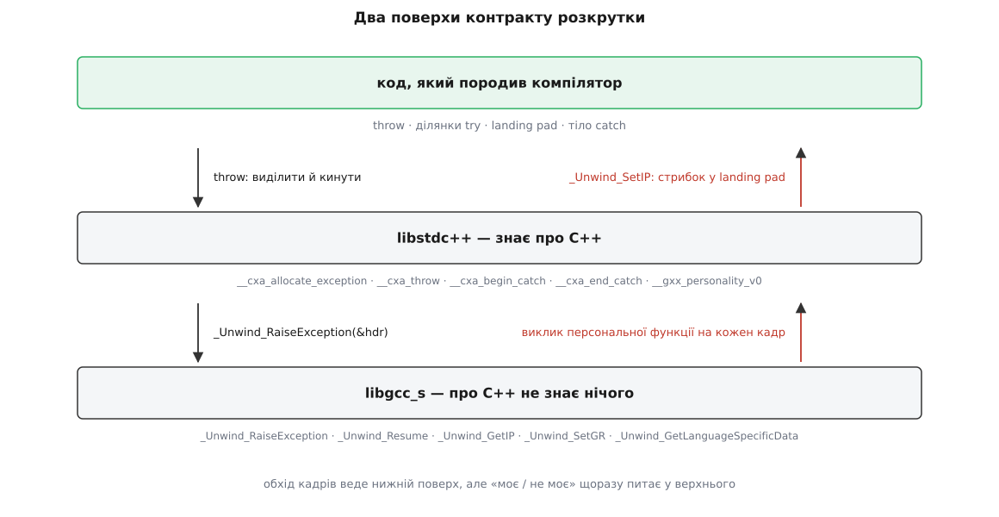
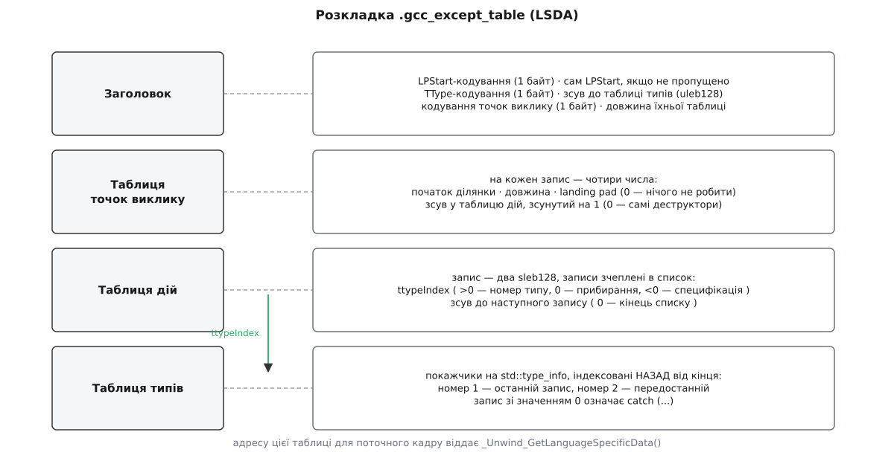

# 📋 Контракт розкрутки: `__cxa_*`, `_Unwind_*` і таблиці LSDA

Це довідник по фактичному контракту, за яким `throw` працює на ELF-системах: імена символів, сигнатури, поля структур і байтова розкладка таблиць, які компілятор кладе поруч із кодом. Зазирають сюди тоді, коли мовних понять уже не досить і треба говорити іменами: розбираєш аварію в дизасемблері, переносиш рантайм на голе залізо, пишеш власну персональну функцію або з'ясовуєш, чому `catch` мовчки не спрацював.

<preknowlist>
- [Угода про виклик (ABI)](topic:programming/calling-convention) — які регістри везуть аргументи, хто зобов'язаний їх зберегти, звідки береться адреса повернення.
- [ELF-формат](topic:programming/elf-format) — виконуваний файл поділено на іменовані секції, і не всі з них містять код.
- [Розмотування стека: frame pointer і DWARF](topic:programming/stack-walking) — як за адресою повернення відновити попередній кадр, коли кадрового покажчика немає.
</preknowlist>

Усе далі — про **Itanium C++ ABI**. Назва історична: документ народився наприкінці 1990-х як C++-надбудова до платформового ABI архітектури IA-64, але процесори Itanium давно поховані, а документ став де-факто спільним C++-ABI усіх ELF-платформ і macOS. Ним живуть GCC (від 3.0) і Clang на x86-64, aarch64, riscv64 та решті архітектур поза світом MSVC. Специфікацію підтримують у відкритому репозиторії [itanium-cxx-abi.github.io/cxx-abi](https://itanium-cxx-abi.github.io/cxx-abi/abi-eh.html) — розділ про винятки зветься «Exception Handling».

## Два поверхи й хто що постачає

Механізм навмисно розрізано надвоє: **базовий розкручувач** уміє ходити по кадрах і нічого не знає про типи, `catch` чи деструктори; **мовний рівень** знає про C++ усе, але сам по кадрах не ходить. Розділ потрібен, щоб один стек могли розкручувати кілька мов одночасно — C++, Ada, Objective-C, Go-cgo, — не знаючи одна про одну.

| поверх | що знає | символи | GCC | LLVM |
|---|---|---|---|---|
| код програми | де починається й закінчується кожна ділянка `try`, які деструктори кликати | `__gxx_personality_v0` як посилання в таблиці | генерує компілятор | генерує компілятор |
| мовний | типи, `std::type_info`, час життя об'єкта винятка, `terminate` | `__cxa_*`, `__gxx_personality_v0` | `libstdc++` (частина `libsupc++`) | `libc++abi` |
| базовий розкручувач | кадри, регістри, CFI; **про C++ нічого** | `_Unwind_*` | `libgcc_s.so.1` | `libunwind` (LLVM-ний, не той, що з nongnu.org) |



*Ключова несиметрія: обхід кадрів веде нижній поверх, але рішення «цей виняток мій?» він щоразу питає у верхнього — через зворотний виклик персональної функції, адресу якої знаходить у таблиці поточного кадру.*

## Поверх 1: базовий розкручувач (`unwind.h`)

Єдина структура, яку бачать обидва поверхи, — заголовок винятка. Мовний рівень вбудовує його у свій більший об'єкт (у C++ — останнім полем), а розкручувач працює тільки з цими чотирма словами:

```c
typedef void (*_Unwind_Exception_Cleanup_Fn)(_Unwind_Reason_Code reason,
                                             struct _Unwind_Exception *exc);

struct _Unwind_Exception {
    _Unwind_Exception_Class      exception_class;    // 8 байтів: хто це кинув
    _Unwind_Exception_Cleanup_Fn exception_cleanup;  // як звільнити
    _Unwind_Word                 private_1;          // стан розкручувача
    _Unwind_Word                 private_2;          // між фазами
} __attribute__((__aligned__));
```

Поля `private_1`/`private_2` належать **розкручувачеві**: між першою і другою фазами він тримає там, де саме знайшовся обробник. Мовний рівень їх не чіпає — а «останнім полем» заголовок стоїть саме тому, що розкручувач отримує адресу цього поля й нічого не знає про те, що лежить перед ним; від адреси заголовка до свого об'єкта мовний рівень доходить простим відніманням зсуву.

**Запуск і завершення розкрутки:**

| функція | що робить |
|---|---|
| `_Unwind_Reason_Code _Unwind_RaiseException(struct _Unwind_Exception *)` | повний двофазний цикл; за успіху **не повертається** — керування йде в landing pad |
| `void _Unwind_Resume(struct _Unwind_Exception *)` | продовжити другу фазу з поточного кадру; цим закінчується landing pad, що робив лише прибирання |
| `_Unwind_Reason_Code _Unwind_Resume_or_Rethrow(struct _Unwind_Exception *)` | розширення GCC: або продовжити другу фазу, або почати заново — потрібне для `throw;` |
| `void _Unwind_DeleteException(struct _Unwind_Exception *)` | викликати `exception_cleanup`; так чужий рантайм прибирає за собою |
| `_Unwind_Reason_Code _Unwind_ForcedUnwind(struct _Unwind_Exception *, _Unwind_Stop_Fn, void *)` | однофазна примусова розкрутка без пошуку обробника — цим працює скасування потоку в pthread |
| `_Unwind_Reason_Code _Unwind_Backtrace(_Unwind_Trace_Fn, void *)` | обхід кадрів без будь-якої розкрутки; ним живуть трасувальники стека |

**Коди відповіді** (`_Unwind_Reason_Code`) — той самий перелік і для персональної функції, і для самих `_Unwind_*`:

| значення | номер | коли |
|---|---|---|
| `_URC_NO_REASON` | 0 | нейтральне «продовжуй» (зокрема з функції обходу в `_Unwind_Backtrace`) |
| `_URC_FOREIGN_EXCEPTION_CAUGHT` | 1 | розкрутку перервав чужий рантайм |
| `_URC_FATAL_PHASE2_ERROR` | 2 | зламалося у другій фазі — назад дороги немає |
| `_URC_FATAL_PHASE1_ERROR` | 3 | зламалося в першій фазі |
| `_URC_NORMAL_STOP` | 4 | зупинкова функція `_Unwind_ForcedUnwind` сказала «досить» |
| `_URC_END_OF_STACK` | 5 | кадри скінчилися |
| `_URC_HANDLER_FOUND` | 6 | **відповідь персональної функції у фазі 1**: обробник тут |
| `_URC_INSTALL_CONTEXT` | 7 | **відповідь персональної функції у фазі 2**: став контекст і стрибай у landing pad |
| `_URC_CONTINUE_UNWIND` | 8 | **відповідь персональної функції**: у цьому кадрі мені нічого, іди далі |

**Прапорці фази** (`_Unwind_Action`, бітова маска — приходить персональній функції другим аргументом):

| прапорець | значення | сенс |
|---|---|---|
| `_UA_SEARCH_PHASE` | 1 | фаза пошуку: **нічого не змінювати**, тільки відповісти |
| `_UA_CLEANUP_PHASE` | 2 | фаза розкрутки: кликати деструктори |
| `_UA_HANDLER_FRAME` | 4 | лише разом із `_UA_CLEANUP_PHASE`: це той самий кадр, який ти сам позначив у фазі 1 |
| `_UA_FORCE_UNWIND` | 8 | примусова розкрутка — **ловити заборонено**, тільки прибирати |
| `_UA_END_OF_STACK` | 16 | розширення GCC: кадри скінчилися |

**Читання й правка контексту кадру** — усе, що персональна функція має право спитати або змінити:

| функція | віддає / робить |
|---|---|
| `_Unwind_Ptr _Unwind_GetIP(struct _Unwind_Context *)` | адресу, куди кадр повернеться (для не-верхнього кадру це адреса **після** виклику) |
| `_Unwind_Ptr _Unwind_GetIPInfo(struct _Unwind_Context *, int *ip_before_insn)` | те саме, але ще й каже, чи адреса вказує на саму команду, чи вже за неї |
| `void _Unwind_SetIP(struct _Unwind_Context *, _Unwind_Ptr)` | куди стрибнути після встановлення контексту — сюди кладуть адресу landing pad |
| `_Unwind_Word _Unwind_GetGR(struct _Unwind_Context *, int)` | значення регістра за номером у нумерації DWARF |
| `void _Unwind_SetGR(struct _Unwind_Context *, int, _Unwind_Word)` | покласти значення в регістр landing pad |
| `void *_Unwind_GetLanguageSpecificData(struct _Unwind_Context *)` | адресу LSDA поточного кадру |
| `_Unwind_Ptr _Unwind_GetRegionStart(struct _Unwind_Context *)` | адресу початку функції — база, від якої в LSDA відлічено всі зсуви |
| `_Unwind_Word _Unwind_GetCFA(struct _Unwind_Context *)` | канонічну адресу кадру |

Різниця між `_Unwind_GetIP` і `_Unwind_GetIPInfo` не косметична. У проміжному кадрі збережена адреса повернення показує на **наступну** команду після `call`; якщо `call` — остання команда ділянки `try`, то наївний пошук за цією адресою потрапить уже за межі ділянки й обробника не знайде. Тому персональна функція віднімає одиницю — а `_Unwind_GetIPInfo` каже, чи потрібно віднімати саме зараз.

## Персональна функція

Це єдина точка, де мовний рівень отримує керування посеред чужого обходу. Її адреса лежить у таблиці CFI кожної функції, і розкручувач кличе її **на кожному кадрі, у кожній фазі**:

```c
typedef _Unwind_Reason_Code (*_Unwind_Personality_Fn)(
    int                       version,          // завжди 1
    _Unwind_Action            actions,          // маска _UA_*
    _Unwind_Exception_Class   exception_class,  // хто кинув
    struct _Unwind_Exception *exception_object,
    struct _Unwind_Context   *context);
```

У C++ це `__gxx_personality_v0` з libstdc++ (у libc++abi — `__gxx_personality_v0` теж, імена навмисно збігаються). Контракт відповідей:

| ситуація | що повертає |
|---|---|
| `_UA_SEARCH_PHASE`, у кадрі є підхожий `catch` | `_URC_HANDLER_FOUND` — і **нічого не змінює** |
| `_UA_SEARCH_PHASE`, підхожого немає (навіть якщо є деструктори) | `_URC_CONTINUE_UNWIND` |
| `_UA_CLEANUP_PHASE` без `_UA_HANDLER_FRAME` | викликає прибирання й повертає `_URC_CONTINUE_UNWIND` |
| `_UA_CLEANUP_PHASE` разом із `_UA_HANDLER_FRAME` | ставить регістри й IP, повертає `_URC_INSTALL_CONTEXT` |
| `exception_class` чужий (не `C++\0` у молодших чотирьох байтах) | `_URC_CONTINUE_UNWIND` в **обох** фазах; прибирання зробити можна, ловити — ні |
| прийшов `_UA_FORCE_UNWIND` | ловити заборонено навіть свій виняток: тільки прибирання й `_URC_CONTINUE_UNWIND` |
| `version != 1` | `_URC_FATAL_PHASE1_ERROR` |

Передача керування в landing pad — це три виклики:

```c
_Unwind_SetGR(context, __builtin_eh_return_data_regno(0), (_Unwind_Ptr)exception_object);
_Unwind_SetGR(context, __builtin_eh_return_data_regno(1), (_Unwind_Word)switch_value);
_Unwind_SetIP(context, landing_pad);
return _URC_INSTALL_CONTEXT;
```

Два «регістри обміну» задає платформа: `__builtin_eh_return_data_regno(0)` везе адресу заголовка винятка, `(1)` — **селектор**, ціле число, за яким код landing pad розуміє, котра саме `catch`-гілка спрацювала. На x86-64 це `rax` і `rdx`. Селектор — це та сама величина, що прийшла з таблиці дій; нуль означає «обробника немає, це лише прибирання».

> 🔧 **Навіщо це.** Із контракту прямо випливає правило, чому виняток не можна пускати крізь межу мови. Чужа персональна функція побачить незнайомий `exception_class` і поверне `_URC_CONTINUE_UNWIND` — тобто просто пропустить виняток крізь свої кадри. Але коли між вашими кадрами лежить C-код, скомпільований **без** `-fexceptions`, у нього немає ні таблиць, ні персональної функції взагалі: розкручувач не знайде FDE для такого кадру й обірве розкрутку `_URC_FATAL_PHASE2_ERROR`, а з другої фази виходу немає — програма падає. Саме тому мовну межу загортають у `catch (...)` і перетворюють на код помилки: [`extern "C"` і взаємодія з C](topic:cpp-standards/extern-c-interop).

## Поверх 2: `__cxa_*` — мовний рівень

Ці функції не викликають руками — їх генерує компілятор. Але саме їхні імена видно в дизасемблері, у `perf`, у трасі падіння, і саме за ними впізнають, що робить незнайомий фрагмент коду.

| функція | що робить |
|---|---|
| `void *__cxa_allocate_exception(size_t thrown_size)` | видає пам'ять під об'єкт винятка (плюс службовий заголовок перед ним) і повертає адресу **самого об'єкта** |
| `void __cxa_free_exception(void *)` | звільнити її, якщо кидок не відбувся (наприклад, конструктор кинув) |
| `void __cxa_throw(void *obj, std::type_info *tinfo, void (*dest)(void *))` | заповнює заголовок, збільшує лічильник неспійманих, кличе `_Unwind_RaiseException`; **не повертається** — якщо розкручувач усе-таки повернувся, кличе `std::terminate` |
| `void *__cxa_begin_catch(void *exc)` | збільшує `handlerCount`, кладе виняток на стек спійманих, зменшує лічильник неспійманих; повертає **скоригований** покажчик, з яким зв'яжеться параметр `catch` |
| `void __cxa_end_catch()` | зменшує `handlerCount`; коли той упав до нуля — знімає зі стека, кличе деструктор об'єкта й звільняє пам'ять |
| `void *__cxa_get_exception_ptr(void *exc)` | той самий скоригований покажчик, але **без** зміни лічильників: потрібен, коли копію для параметра `catch` роблять до `__cxa_begin_catch` |
| `void __cxa_rethrow()` | позначає верхній виняток стека спійманих як перекинутий і запускає розкрутку знову тим самим об'єктом; стек спійманих порожній — `std::terminate` |
| `std::type_info *__cxa_current_exception_type()` | тип винятка, що летить зараз (або `nullptr`) — оголошений у `<cxxabi.h>` як `abi::__cxa_current_exception_type` |
| `__cxa_eh_globals *__cxa_get_globals()` | стан винятків **поточного потоку**, з ініціалізацією за потреби |
| `__cxa_eh_globals *__cxa_get_globals_fast()` | те саме без ініціалізації — можна, якщо `__cxa_get_globals` у цьому потоці вже кликали |
| `void __cxa_call_terminate(_Unwind_Exception *)` | хвіст, який GCC ставить у `noexcept`-функціях: спіймати й померти; Clang для того самого породжує `__clang_call_terminate` |
| `void __cxa_call_unexpected(void *)` | спадщина динамічних специфікацій `throw(A, B)`, прибраних у C++17; у новому коді не з'являється |

Об'єкт винятка в пам'яті — це не тільки те, що кинули. Перед ним лежать службові поля, і саме вони роблять можливими лічильник обробників, стек спійманих і `exception_ptr`:

```c
struct __cxa_exception {
    std::type_info       *exceptionType;         // статичний тип кинутого
    void                (*exceptionDestructor)(void *);
    std::terminate_handler unexpectedHandler;    // знімки обробників на
    std::terminate_handler terminateHandler;     // момент кидка
    __cxa_exception       *nextException;        // стек спійманих потоку
    int                    handlerCount;         // від'ємне = перекинутий
    int                    handlerSwitchValue;   // ↓ кеш розбору LSDA
    const unsigned char   *actionRecord;         //   з фази 1,
    const unsigned char   *languageSpecificData; //   щоб не читати
    _Unwind_Ptr            catchTemp;            //   таблиці двічі
    void                  *adjustedPtr;
    _Unwind_Exception      unwindHeader;         // ОБОВ'ЯЗКОВО останнє
};
```

П'ять полів посередині — кеш. У фазі пошуку персональна функція вже розібрала таблиці й знайшла і гілку, і зсув; у фазі розкрутки вона дістає результат звідси, замість читати LSDA вдруге. Це половина всієї оптимізації двофазної схеми.

У libstdc++ структура загорнута ще в одну — саме її адресу віддає алокатор, а `__cxa_allocate_exception` повертає покажчик уже за нею:

```c
struct __cxa_refcounted_exception {
    _Atomic_word    referenceCount;   // ним живе exception_ptr
    __cxa_exception exc;              // мусить бути останнім, без вирівнювального хвоста
};

struct __cxa_dependent_exception {    // те, що кидає rethrow_exception
    void *primaryException;           // ← справжній об'єкт, спільний для всіх копій
    /* далі — поле в поле як у __cxa_exception, включно з unwindHeader */
};

struct __cxa_eh_globals {             // по одній на потік
    __cxa_exception *caughtExceptions;    // стек спійманих, найновіший перший
    unsigned int     uncaughtExceptions;  // ← це і є std::uncaught_exceptions()
};
```

Лічильник `referenceCount` атомарний, бо копію `exception_ptr` можна віддати в інший потік ([`std::atomic` і порядок пам'яті](topic:programming/std-atomic)); а `__cxa_eh_globals` — стан, приватний для потоку ([`thread_local`](topic:cpp-standards/thread-local)), інакше два потоки, що кидають одночасно, топтали б один стек спійманих.

**Вісім байтів `exception_class`** — це два ASCII-слова: старші чотири називають постачальника рантайму, молодші — мову, а найменший байт відрізняє звичайний виняток від залежного.

```
постачальник   мова        разом           значення
  "GNUC"     + "C++\0"  =  "GNUCC++\0"   = 0x474E5543432B2B00   libstdc++, звичайний
  "GNUC"     + "C++\1"  =  "GNUCC++\x01" = 0x474E5543432B2B01   libstdc++, залежний
  "CLNG"     + "C++\0"  =  "CLNGC++\0"   = 0x434C4E47432B2B00   libc++abi, звичайний
  "CLNG"     + "C++\1"  =  "CLNGC++\x01" = 0x434C4E47432B2B01   libc++abi, залежний
```

Молодші чотири байти `C++\0` — це вимога Itanium ABI до будь-якої C++-реалізації, і саме вони кажуть чужій персональній функції «це не твоє, пропусти». Але **свій** виняток кожен рантайм упізнає по всіх восьми байтах, крім найменшого: libstdc++ звіряється з `GNUC…`, libc++abi — з `CLNG…`. Звідси практичний наслідок, на який регулярно наступають: якщо в один процес затягнути обидві бібліотеки — скажімо, програма на libstdc++ підвантажує плагін, злінкований із libc++abi, — то виняток, кинутий по один бік, по другий бік виглядатиме чужим, `catch (...)` його ще спіймає, а `catch (const std::exception&)` — уже ні. Два C++-рантайми в одному процесі не змішують.

## Що компілятор розгортає з `throw` і `catch`

Один кидок перетворюється на три кроки, і порядок тут важливий: пам'ять беруть **до** конструювання, бо конструктор може кинути сам.

```cpp
throw ParseError{n};
```

```c
void *e = __cxa_allocate_exception(sizeof(ParseError));
/* конструювання просто в цій пам'яті; якщо кине — __cxa_free_exception(e)
   і далі летить уже той, інший виняток */
ParseError::ParseError((ParseError *)e, n);
__cxa_throw(e, &typeid(ParseError), (void (*)(void *))ParseError::~ParseError);
/* сюди керування не повернеться */
```

Ловіння розгортається у landing pad, куди стрибнув `_Unwind_SetIP`:

```c
/* на вході: регістр 0 = адреса заголовка, регістр 1 = селектор */
if (selector == 1) {                       /* гілка catch (const ParseError&) */
    const ParseError *p = (const ParseError *)__cxa_begin_catch(exc);
    ... тіло catch ...
    __cxa_end_catch();
}
```

А порожній `throw;` усередині обробника — це не новий кидок, а два виклики поспіль:

```c
__cxa_rethrow();        /* позначає й запускає розкрутку тим самим об'єктом */
__cxa_end_catch();      /* спрацює вже як прибирання: нормальним шляхом сюди не доходять */
```

Кадр, у якому `catch` немає, а деструктори є, теж має landing pad — і закінчується він так:

```c
... виклики деструкторів ...
_Unwind_Resume(exc);    /* назад у другу фазу, до наступного кадру */
```

## Таблиці поруч із кодом

Компілятор кладе дві різні речі в дві різні секції.

**`.eh_frame`** — це CFI, той самий формат записів CIE/FDE, що й у `.debug_frame` DWARF, але завантажуваний у пам'ять. Він відповідає на питання «як із цього кадру дістатися попереднього»: де збережений кожен регістр, як зсунути вказівник стека. Мова тут ні до чого — цією ж секцією користуються трасувальники й профайлери.

Мовне доліплено через **рядок доповнення (augmentation)** в CIE. Літери в ньому читають по черзі:

| літера | що йде далі в даних доповнення |
|---|---|
| `z` | довжина даних доповнення (uleb128); мусить бути першою |
| `P` | кодування, а за ним — адреса персональної функції |
| `L` | кодування адреси LSDA (сама адреса — у кожному FDE окремо) |
| `R` | кодування адрес у FDE |

Отже, типовий рядок `zPLR` означає: тут є персональна функція, і в кожного FDE є своя LSDA. У межах асемблера це директиви `.cfi_personality` і `.cfi_lsda`; у позиційно-незалежному коді кодування зазвичай `DW_EH_PE_pcrel | DW_EH_PE_indirect`, щоб не тягнути за собою релокацій під час завантаження.

**`.gcc_except_table`** — власне LSDA, дані для персональної функції. Її адресу для поточного кадру віддає `_Unwind_GetLanguageSpecificData()`.



*Чотири частини йдуть підряд одним потоком байтів; заголовок каже, де закінчується таблиця точок виклику й де починається таблиця типів, а зв'язок між ними — числовий: запис точки виклику вказує на запис дії, запис дії — на номер у таблиці типів.*

**Заголовок:**

| поле | розмір | сенс |
|---|---|---|
| LPStart-кодування | 1 байт | `DW_EH_PE_omit` (0xFF) — база landing pad збігається з початком функції |
| LPStart | за кодуванням | інша база, якщо кодування не «пропущено» |
| TType-кодування | 1 байт | як закодовано записи таблиці типів (типово `DW_EH_PE_indirect` разом із `pcrel` і `sdata4`) |
| зсув до таблиці типів | uleb128 | від кінця цього поля |
| кодування точок виклику | 1 байт | типово `DW_EH_PE_uleb128` |
| довжина таблиці точок виклику | uleb128 | у байтах |

**Запис точки виклику** — чотири числа, і кожна ділянка коду, звідки може вилетіти виняток, має свій:

| поле | сенс |
|---|---|
| початок ділянки | зсув від початку функції (`_Unwind_GetRegionStart()`) |
| довжина ділянки | у байтах |
| landing pad | зсув від LPStart; **0 — у цьому кадрі робити нічого**, продовжуй розкрутку |
| зсув у таблицю дій | **зсунутий на 1**; 0 означає «дій немає, самий лише landing pad із деструкторами» |

Ділянки впорядковані за адресами, тож персональна функція шукає по них двійковим пошуком: бере `_Unwind_GetIP()`, віднімає `_Unwind_GetRegionStart()`, віднімає одиницю (див. вище про адресу повернення) і знаходить, у якій ділянці вона перебуває. Адреса, що не потрапила в жоден запис, означає «у цій функції розкрутка нічого не робить».

**Запис дії** — два sleb128, і записи зчеплені в однобічний список, бо одна ділянка може мати кілька `catch`-гілок:

| поле | сенс |
|---|---|
| `ttypeIndex` | **>0** — номер у таблиці типів (це й буде селектор); **0** — прибирання; **<0** — номер у таблиці специфікацій винятків |
| зсув до наступного запису | відносний; **0 — кінець списку** |

Саме цей список персональна функція проходить згори вниз, і саме тому перемагає перша підхожа гілка, а не найточніша: порядок записів — це порядок написання `catch` у тексті.

**Таблиця типів** — масив закодованих покажчиків на `std::type_info`, індексований **назад**: номер 1 — останній запис масиву, номер 2 — передостанній. Причина суто технічна: сама таблиця росте вгору від кінця LSDA, тож нумерація від кінця дозволяє дописувати типи, не зсуваючи вже написані номери. Запис зі значенням 0 — це `catch (...)`. Від'ємні номери адресують окрему табличку списків типів — залишок динамічних специфікацій `throw(A, B)`, прибраних у C++17.

## Як подивитися це в справжньому бінарнику

| завдання | команда |
|---|---|
| чи є таблиці взагалі | `readelf -S a.out` — шукати рядки `.eh_frame` і `.gcc_except_table` |
| CIE/FDE з рядком доповнення й персональною функцією | `readelf --debug-dump=frames a.out` або `llvm-dwarfdump --eh-frame a.out` |
| CFI, вже розтлумачені в таблицю «регістр → де лежить» | `readelf --debug-dump=frames-interp a.out` |
| сирі байти LSDA | `objdump -s -j .gcc_except_table a.out` |
| **LSDA з коментарями** — найпростіший спосіб її прочитати | `g++ -S -O2 file.cpp` і дивитися директиви `.uleb128` під міткою `.LLSDA…`: GCC сам підписує «Call-site table», «Action record table» |
| які символи розкрутки тягне бінарник | `nm -D --undefined-only a.out` — шукати `_Unwind_` і `__cxa_` |
| зупинитися на кидку, поки стек іще цілий | у gdb: `catch throw`, `catch rethrow`, `catch catch` |

Що з цього буде в файлі, вирішують прапорці компіляції:

| прапорці | `.eh_frame` | `.gcc_except_table` |
|---|---|---|
| `-fexceptions` (типово для C++) | так | так |
| `-fno-exceptions -fasynchronous-unwind-tables` | так | ні |
| `-fno-exceptions -fno-asynchronous-unwind-tables` | ні | ні |
| `-fexceptions` для **C** | так | так — і деструктори через `__attribute__((cleanup))` спрацюють |

На x86-64 Linux `-fasynchronous-unwind-tables` увімкнено типово навіть для C: без `.eh_frame` профайлер не побудує стек, тож секція лишається, навіть коли винятків у програмі немає.

## Мінімальний робочий виклик

Базовим розкручувачем можна користуватися прямо, не кидаючи нічого. Ось повний робочий обхід кадрів — він друкує для кожного адресу повернення, початок функції й адресу LSDA, тобто фактично показує, чи має цей кадр що робити при розкрутці:

```cpp
#include <unwind.h>
#include <cxxabi.h>
#include <cstdio>

static _Unwind_Reason_Code on_frame(_Unwind_Context* ctx, void* arg) {
    int* left = static_cast<int*>(arg);
    int before = 0;
    _Unwind_Ptr ip   = _Unwind_GetIPInfo(ctx, &before);
    _Unwind_Ptr fn   = _Unwind_GetRegionStart(ctx);
    void*       lsda = _Unwind_GetLanguageSpecificData(ctx);

    std::printf("ip=%p  функція=%p  зсув=%#lx  LSDA=%s  %s\n",
                (void*)ip, (void*)fn, (unsigned long)(ip - fn),
                lsda ? "є" : "немає",
                before ? "ip на самій команді" : "ip уже за call");

    return (--*left == 0) ? _URC_END_OF_STACK : _URC_NO_REASON;
}

void dump_frames() {
    int left = 16;
    _Unwind_Backtrace(&on_frame, &left);
}

// у власному обробнику аварії стане в пригоді й тип того, що зараз летить:
void my_terminate() {
    if (const std::type_info* t = abi::__cxa_current_exception_type())
        std::printf("невиловлений виняток типу %s\n", t->name());  // ім'я понівечене,
    std::abort();                        // людське дає abi::__cxa_demangle з того ж заголовка
}
```

Збирається без жодних додаткових бібліотек — `libgcc_s` уже прилінковано: `g++ -g -O2 frames.cpp`. Функція обходу повертає `_URC_NO_REASON`, щоб продовжити, і `_URC_END_OF_STACK`, щоб зупинитися.

## Заголовок `<exception>`

Верхівка того самого механізму, доступна портативно.

| сутність | сигнатура | версія |
|---|---|---|
| `std::exception` | `virtual const char *what() const noexcept;` | C++98 |
| `std::bad_exception` | похідний від `exception` | C++98 |
| `std::terminate_handler` | `using terminate_handler = void (*)();` | C++98 |
| `std::terminate` | `[[noreturn]] void terminate() noexcept;` | C++98 |
| `std::set_terminate` | `terminate_handler set_terminate(terminate_handler) noexcept;` | C++98 |
| `std::get_terminate` | `terminate_handler get_terminate() noexcept;` | C++11 |
| `std::exception_ptr` | тип не вказано стандартом; розділюване володіння | C++11 |
| `std::current_exception` | `exception_ptr current_exception() noexcept;` | C++11 |
| `std::rethrow_exception` | `[[noreturn]] void rethrow_exception(exception_ptr);` | C++11 |
| `std::make_exception_ptr` | `template<class E> exception_ptr make_exception_ptr(E) noexcept;` | C++11 |
| `std::nested_exception` | `void rethrow_nested() const;` · `exception_ptr nested_ptr() const noexcept;` | C++11 |
| `std::throw_with_nested` | `template<class T> [[noreturn]] void throw_with_nested(T&&);` | C++11 |
| `std::rethrow_if_nested` | `template<class E> void rethrow_if_nested(const E&);` | C++11 |
| `std::uncaught_exceptions` | `int uncaught_exceptions() noexcept;` | C++17 |
| ~~`std::uncaught_exception`~~ | `bool uncaught_exception();` | C++98, застаріла C++17, **прибрана C++20** |
| ~~`std::unexpected`~~, ~~`set_unexpected`~~, ~~`get_unexpected`~~, ~~`unexpected_handler`~~ | до динамічних специфікацій | C++98, застарілі C++11, **прибрані C++17** |
| `std::exception_ptr_cast` | `template<class E> constexpr optional<const E&> exception_ptr_cast(const exception_ptr&) noexcept;` | чернетка C++26, папір P2927 (Артур О'Двайєр, Гор Нішанов) |

Дві останні речі варті пояснення, бо змінюють практику.

`exception_ptr_cast` дозволяє **зазирнути** в `exception_ptr`, не кидаючи його. Донині єдиним способом дізнатися тип було `try { rethrow_exception(p); } catch (const E&) {…}` — тобто повний двофазний цикл заради однієї перевірки типу; автори паперу міряють різницю приблизно у сто разів. У тій самій чернетці C++26 `rethrow_exception` і `make_exception_ptr` стали `constexpr` — наслідок паперу P3068 Гани Дусікової, який дозволив кидати й ловити винятки під час сталого обчислення (виняток при цьому не має права «витекти» з обчислення в рантайм).

`uncaught_exceptions()` — це буквально поле `uncaught_exceptions` зі структури `__cxa_eh_globals`, і з цього видно, чому воно рахує саме те, що рахує: `__cxa_throw` його збільшує, `__cxa_begin_catch` — зменшує. Порівнявши число в конструкторі й у деструкторі, вартовий блока точно знає, чи додався виняток **за час його життя**:

```cpp
class Transaction {
    int depth_ = std::uncaught_exceptions();
public:
    ~Transaction() {
        if (std::uncaught_exceptions() > depth_) rollback();
        else                                     commit();
    }
};
```

Стара `uncaught_exception()` (в однині) питала «чи йде зараз розкрутка» й тому казала «так» усередині будь-якого `catch` — а транзакція, створена й закрита в обробнику, відкочувалася без причини.

Механіка `exception_ptr` теж читається з таблиць вище. `current_exception()` бере верхівку `caughtExceptions`, перевіряє, що клас винятка свій, і збільшує `referenceCount` — об'єкт лишається живим після виходу з `catch`. `rethrow_exception(p)` **не кидає той самий заголовок повторно**: він бере окремий `__cxa_dependent_exception`, кладе в його `primaryException` адресу справжнього об'єкта, ставить клас `"GNUCC++\x01"` і кидає вже цю обгортку. Тому той самий `exception_ptr` можна кидати з кількох потоків одночасно: летять різні залежні заголовки, а об'єкт-причина спільний і живе за лічильником. Саме цим механізмом [`std::promise` і `std::future`](topic:cpp-standards/future-promise) переносять відмову між потоками.

## Куди цей контракт не сягає

| платформа | кидок | таблиці | персональна функція |
|---|---|---|---|
| Itanium C++ ABI: Linux і *BSD (ELF), macOS (Mach-O); x86-64, aarch64, riscv64 | `__cxa_throw` → `_Unwind_RaiseException` | `.eh_frame` + `.gcc_except_table`, у Mach-O — `__TEXT,__eh_frame` і `__TEXT,__gcc_except_tab` | `__gxx_personality_v0` |
| ARM 32 біти (EHABI) | ті самі імена, інший протокол: регістри через `_Unwind_VRS_Get/Set/Pop`, прибирання завершує `__cxa_end_cleanup` | `.ARM.exidx` + `.ARM.extab` | рутини з індексами 0–2, у GCC/Clang — `__aeabi_unwind_cpp_pr0…pr2` |
| MSVC, Windows x64 | `_CxxThrowException` | `.pdata` / `.xdata` + `FuncInfo` | `__CxxFrameHandler3`, `__CxxFrameHandler4` |
| MinGW-w64 (SEH) | `_Unwind_RaiseException` поверх SEH | `.pdata` / `.xdata` + `.gcc_except_table` | `__gxx_personality_seh0` |
| збірки на `setjmp`/`longjmp` | реєстрація кадру на вході в `try` | таблиць немає, є списки в рантаймі | `__gxx_personality_sj0` |
| C з `-fexceptions` | не кидає, лише прибирає | `.eh_frame` + `.gcc_except_table` | `__gcc_personality_v0` |

ARM EHABI відрізняється не косметично: таблиця `.ARM.exidx` — це відсортований масив пар «адреса функції → опис», і сам опис часто вміщається в одне слово, бо розрахований на компактність прошивок. Windows-гілка не має до Itanium ABI жодного стосунку взагалі — там і формат таблиць, і модель кадру належать SEH, спільному для C++ і структурних винятків самої системи. Тому код, що покладається на `__cxa_*` чи на розкладку `__cxa_exception`, не портується: це [межа ABI](topic:cpp-standards/abi-stability-cpp) у найгострішому вигляді.
