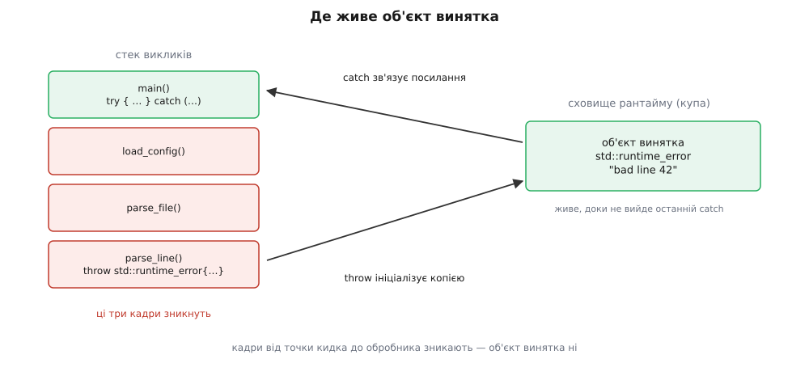
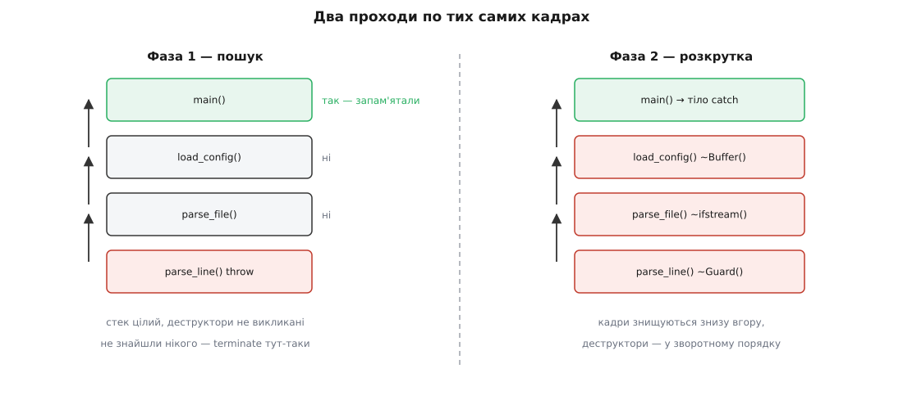
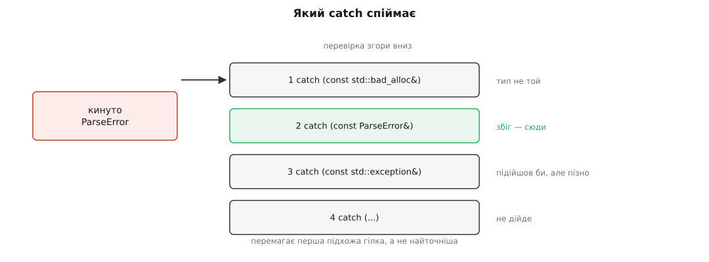

# Винятки: кидання, розкрутка стека, перехоплення

<preknowlist>
- [Стек](book:programming/stack-lifo) — виклики укладаються один на одного; кадр функції живе рівно доти, доки функція не повернулася.
- [RAII: ресурс прив'язаний до часу життя](book:programming/raii) — деструктор автоматичного об'єкта звільняє захоплений ресурс рівно один раз.
- [Купа](book:programming/heap-dynamic-memory) — динамічна пам'ять, яку видає й забирає алокатор, а не кадр стека.
- [Спадкування](book:programming/inheritance) — похідний тип є різновидом базового, і посилання на базу здатне вказувати на похідний об'єкт.
- [Час життя об'єкта](book:cpp-standards/object-lifetime) — коли об'єкт починає й перестає існувати, і коли саме викликається його деструктор.
- [Жодна помилка не мовчить](book:programming/error-handling) — що взагалі означає «повідомити про відмову» і чому мовчазна відмова найгірша.
</preknowlist>

## Канал, який не питає дозволу в проміжних функцій

Функція розбирає конфігураційний файл, десь на п'ятому рівні вкладеності натрапляє на зіпсований рядок і не може зробити нічого осмисленого. Про це має дізнатися той, хто запускав розбір, — а між ними чотири проміжні функції, яким до формату рядка немає жодного діла.

Код повернення тут працює, але ціною: кожна з чотирьох проміжних функцій мусить перевірити результат, а потім повернути помилку вище — тобто мусить **знати** про існування відмови, яка її не стосується. Забуде хоч одна — ланцюг обірвано, і помилка зникає.

Гірше того, є місця, звідки код повернення повернути просто нема куди. Конструктор не має значення, що повертається. Перевантажений `operator+` зобов'язаний віддати суму, а не статус. Деструктор нікуди не повертає результат за визначенням. Ці місця в C++ не декоративні — саме на них тримається RAII: якщо конструктор не може повідомити про невдачу, то може постати об'єкт, який ніби існує, а насправді нічим не володіє.

Отже, потрібен другий канал — такий, що доправляє відомість про відмову зверху вниз по стеку **без співпраці проміжних кадрів**. І щойно ми сформулювали цю вимогу, з неї одразу випливають три зобов'язання, які механізм мусить виконати:

1. значення, що описує відмову, має **пережити смерть кадру**, який його створив, — інакше воно зникне разом із першим же кроком угору;
2. хтось має **у час виконання знайти** того, хто погоджується обробити саме таку відмову, — статично це невідомо, бо та сама функція викликається з різних місць;
3. усе, що лежить між точкою кидка й знайденим обробником, треба **розібрати по-людськи** — з викликом деструкторів, бо інакше кожна помилка означала б витік.

Ці три зобов'язання й визначають усе, що робить `throw`. Зокрема вони означають, що `throw` — **не стрибок**: це пошук із подальшим упорядкованим руйнуванням, і саме тому він коштує стільки, скільки коштує.

## Куди лягає об'єкт винятка

Візьмімо найпростіше кидання:

```cpp
throw std::runtime_error("bad line " + std::to_string(n));
```

Тимчасовий об'єкт `std::runtime_error`, здавалося б, належить поточному виразу в поточній функції. Але поточна функція за мить перестане існувати, а обробник читатиме цей об'єкт уже після її смерті. Тому мова каже інакше: `throw` **ініціалізує копією окремий об'єкт винятка** у сховищі, час життя якого визначає рантайм, а не кадр стека. Де саме — стандарт не приписує; в реалізаціях за Itanium C++ ABI (це GCC, Clang та все, що з ними сумісне) це виглядає так: `__cxa_allocate_exception` бере пам'ять через `malloc`, туди конструюється об'єкт, і далі `__cxa_throw` запускає механізм.

З «бере пам'ять через `malloc`» одразу випливає незручне питання: а що кидати, коли пам'ять і скінчилася? Виняток `std::bad_alloc` потрібен саме тоді, коли купа вже не дає нічого. Тому в libstdc++ на старті програми резервується **аварійний буфер** — у типовій 64-бітній збірці це десятки кілобайтів (близько 70 КіБ), розрахованих на кілька десятків невеликих об'єктів винятка. Не спрацював `malloc` — беремо звідти; вичерпався й буфер — викликається `std::terminate`, бо повідомити про відмову вже фізично нема чим.

Тип об'єкта винятка береться **статично** — це тип виразу після `throw`, а не динамічний тип того, на що він, можливо, посилається. Звідси перша класична пастка:

```cpp
catch (const std::exception& e) {
    throw e;      // ← кидається КОПІЯ типу std::exception: текст і тип загублено
}
```

Тут статичний тип `e` — `std::exception`, тож копіюється лише базовий підоб'єкт, а `runtime_error` із його повідомленням зрізається. Правильний спосіб продовжити той самий виняток — порожній `throw;`, і про нього мова піде далі.

Із «ініціалізує копією» випливає й вимога до типу: він мусить бути повним і придатним до копіювання або переміщення. Якщо кидають іменовану локальну змінну, компілятор має право (а починаючи з C++11 — зобов'язаний спершу спробувати) переміщення замість копіювання; це той самий механізм, що й в [усуненні копій](book:cpp-standards/copy-elision), лише застосований до сховища винятка.



*Об'єкт винятка не належить жодному кадру: кадри від точки кидка до обробника зникають, а він лишається живим, і `catch` зв'язує з ним посилання.*

## Дві фази: спершу питаємо, потім руйнуємо

Найочевидніша реалізація виглядала б так: іди вгору по кадрах, у кожному виклич деструктори локальних об'єктів і подивись, чи є тут `catch` потрібного типу; дійшов до `main` і не знайшов — програма падає.

Ця схема має ваду, яку видно лише тоді, коли обробника **немає**. На момент падіння стек уже розібрано: кадри знищено, локальні змінні знищено, і налагоджувач, під'єднаний до аварії, побачить порожнечу замість ланцюга викликів, що привів до біди. А це найцінніше, що взагалі буває в момент аварії.

Тому стандарт формулює правило так: якщо жоден обробник не знайшовся, викликається `std::terminate`, і **чи буде перед тим розкручено стек — визначає реалізація**. Слово «визначає реалізація» тут не недбалість, а свідомо залишений люфт: реалізації дозволено померти рівно в точці кидка, з цілим стеком.

Виконати таку обіцянку можна лише одним способом — **спершу дізнатися, чи є куди йти, і тільки потім щось руйнувати**. Звідси й дві фази розкрутки.

**Фаза пошуку.** Рантайм (`_Unwind_RaiseException`) іде по кадрах угору, нічого не змінюючи. Для кожного кадру він за адресою повернення знаходить власника коду й викликає його *персональну функцію* (в C++ це `__gxx_personality_v0`) з питанням: «цей виняток твій?». Персональна функція дивиться в таблицю, згенеровану компілятором для цієї функції, знаходить діапазон адрес, у якому зараз перебуває виконання, і перевіряє типи `catch`-гілок, які цей діапазон покривають. Знайшлося збігання — фаза закінчується успіхом, і рантайм **запам'ятовує**, у якому кадрі та в якій гілці ховається обробник. Дійшли до дна стека без збігання — `__cxa_throw` викликає `std::terminate`, і стек досі цілий.

**Фаза розкрутки.** Тільки тепер рантайм проходить ті самі кадри вдруге, і цього разу для кожного виконує *дії очищення*: викликає деструктори автоматичних об'єктів, які встигли повністю сконструюватися в цьому кадрі. Дійшовши до кадру, позначеного у першій фазі, він відновлює регістри та вказівник стека на потрібний кадр і передає керування в тіло `catch`.



*Перший прохід лише питає кожен кадр, чи є в ньому підхожий `catch`, і нічого не чіпає; другий проходить ті самі кадри й викликає деструктори — аж до кадру, знайденого першим проходом.*

Той факт, що фаза пошуку не змінює нічого, дає ще один наслідок, про який рідко думають: у момент, коли персональна функція каже «так», стек іще повний. Тому налагоджувач може поставити точку зупину на кидку (`catch throw` у gdb) і побачити всю картину — не тільки того, хто ловитиме, а й усіх, кого зараз буде знищено.

Механіка таблиць, персональних функцій і `__cxa_*`-викликів — це окремий шар, що стирчить назовні і яким користуються, коли пишуть рантайм для голого заліза або розбирають аварію в дизасемблері. [Контракт розкрутки: `__cxa_throw`, персональна функція, таблиці LSDA](book:cpp-standards/exceptions-mechanism/api-unwind-abi.md) — довідка про фактичні сигнатури й формат таблиць Itanium C++ ABI, плюс API заголовка `<exception>`.

## Нуль у гарячому шляху, дорого в холодному

Звернімо увагу на те, чого в описі **немає**. Функція, яка нічого не кидає, не виконує жодної додаткової інструкції: у ній немає ні прапорця «ми в try», ні реєстрації обробника, ні перевірок після викликів. Уся інформація про те, що робити при розкрутці, лежить у **статичних таблицях** поруч із кодом (секції `.eh_frame` і `.gcc_except_table`), і рантайм читає їх лише тоді, коли виняток справді полетів. Ця модель зветься табличною, або «безкоштовною» (англ. *zero-cost*), і саме її має на увазі принцип C++ «не платиш за те, чого не вживаєш».

Так було не завжди. Перші реалізації йшли шляхом `setjmp`/`longjmp`: вхід у `try` записував контекст, кожен об'єкт із деструктором реєструвався у списку, і за все це платив **звичайний, безпомилковий** шлях виконання. Таблична схема прибрала цю плату повністю — але не безкоштовно, а переклавши її на два інші рахунки.

Перший рахунок — **розмір бінарника**: таблиці треба десь тримати, і на великій C++-базі вони дають помітні відсотки. Саме тому в прошивках і ядрах часто вживають `-fno-exceptions`, свідомо відмовляючись від механізму цілком; про цей вибір і його наслідки — [Коди помилок проти винятків](root:embedded/error-codes-vs-exceptions).

Другий рахунок — **ціна самого кидка**. Порахуймо, з чого вона складається.

**Що відбувається на одному кидку, який пролітає п'ять кадрів:**

```
виділення об'єкта винятка через malloc        ~1 виклик алокатора
фаза 1: 5 кадрів × (пошук FDE + розбір CFI + звірення типів RTTI)
фаза 2: 5 кадрів × (розбір CFI + відновлення регістрів + деструктори)
разом                                          одиниці мікросекунд
```

Порівняння з альтернативою жорстке: повернення коду помилки — це одиниці **наносекунд**. Різниця в три-чотири порядки і є причиною правила «винятки — для виняткового»: не тому, що вони «повільні» самі по собі, а тому, що кожен кидок оплачується пошуком і розбором таблиць.

Є й гірший бік, який виявився аж у 2020-х, коли ядер стало багато. Розбираючи таблиці, рантайм має знати список завантажених модулів, а той список традиційно захищений глобальним замком. У папері P2544R0 (2022) Томас Нойман (TU München) показав вимірами, що при 10 % відмов програма на 128-ядерному EPYC уповільнюється з 31 мс до 6425 мс — тобто винятки перестають масштабуватися саме тоді, коли потоків багато. Відтоді ситуацію в GCC/glibc виправили — пошук таблиць зробили без замка́ (Флоріан Ваймер у glibc, безблокувальне B-дерево в libgcc), — але це властивість конкретних реалізацій, а не мови, і в інших наборах інструментів вузьке місце ще лишається.

> 🔧 **Навіщо це.** Із цього виходить цілком практичне правило проєктування: винятками не керують потоком виконання. «Не знайшли ключ у кеші» — це не виняток, це звичайний результат, і в гарячому циклі він мусить бути значенням, а не кидком. Виняток доречний там, де відмова справді рідкісна й де вона ламає передумови роботи. Альтернатива для «очікуваних відмов» — [`expected`: помилка як значення](book:cpp-standards/expected-error-handling).

## Що саме знищується під час розкрутки

Друга фаза — це не «звільнення пам'яті кадру». Це виклик деструкторів, і правила тут дуже конкретні.

Знищуються **повністю сконструйовані автоматичні об'єкти** кожного кадру, у порядку, зворотному до конструювання, — точнісінько так, як при звичайному поверненні з функції. Тимчасові об'єкти поточного виразу — теж.

Окремий випадок — об'єкт, який **не встиг** сконструюватися до кінця. Якщо конструктор кинув, то знищуються ті члени й базові підоб'єкти, що вже побудовані (у зворотному порядку), а **деструктор самого об'єкта не викликається**: об'єкт так і не почав існувати, і кликати його деструктор було б викликом методу неіснуючого об'єкта. Це правило пояснює половину правил проєктування конструкторів:

```cpp
struct Session {
    Connection conn;          // сконструйовано → буде знищено
    std::vector<Row> cache;   // конструктор кинув → тут ми й зупинилися
    char* raw = nullptr;      // ще навіть не дійшли
};
```

Якщо кинув конструктор `cache`, то `conn` знищиться правильно, а `~Session` не виконається — і жодного рядка ручного прибирання з нього не спрацює.

Для `new` мова додає окреме правило: якщо конструктор в новому виразі кинув, рантайм сам викликає парний `operator delete` для щойно виділеної пам'яті. Інакше кожне невдале конструювання в купі гарантовано текло б.

А тепер найважливіше — **що НЕ знищується**. Розкрутка не знає нічого про змістовні дії; вона вміє рівно одне — кликати деструктори. Тому:

```cpp
void load(const char* path) {
    FILE* f = fopen(path, "rb");
    Buffer* b = new Buffer(size_of(f));
    parse(f, b);              // ← кинуло
    delete b;                 // ← ці два рядки НЕ виконаються
    fclose(f);                // ←
}
```

Дескриптор файла лишиться відкритим, буфер — витече. Ніхто не обійде сирі вказівники, не закриє `FILE*`, не відпустить захоплений м'ютекс. Отже, RAII в C++ — не стильова вподоба: це **єдиний спосіб узагалі мати прибирання при винятках**, бо деструктор — єдиний гачок, за який розкрутка вміє смикати. Той самий код із власниками:

```cpp
void load(const std::filesystem::path& path) {
    std::ifstream f(path, std::ios::binary);   // ~ifstream закриє
    auto b = std::make_unique<Buffer>(size_of(f));
    parse(f, *b);                              // кинуло — обидва прибрані
}
```

Тут нічого не змінилося в логіці — змінилося тільки те, що обидва ресурси тепер мають деструктори, і другій фазі є за що вхопитися.

Конструктор має ще й особливу форму `try`-блока — на всю функцію, разом зі списком ініціалізації:

```cpp
Session::Session() try : conn(make_conn()), cache(load_cache()) {
    // тіло
} catch (const std::exception&) {
    // сюди можна дописати діагностику — але вихід звідси
    // АВТОМАТИЧНО кидає той самий виняток далі
}
```

Обробник тут не здатний «проковтнути» відмову: після нього виняток кидається повторно завжди, бо об'єкт усе одно не побудований і віддавати викликачеві нічого. Ця форма годиться для запису в журнал чи для загортання винятка в інший тип — не для приховування.

## Кого рантайм вважає обробником

Персональна функція звіряє тип не так, як компілятор звіряє аргументи виклику. Правила навмисно вужчі.

`catch`-гілки перебираються **в порядку написання**, і перемагає **перша, що підходить**, — не найточніша. Це протилежність розв'язанню перевантажень і найчастіша причина того, що спеціалізований обробник ніколи не спрацьовує:

```cpp
try { parse(); }
catch (const std::exception& e)   { log(e.what()); }        // ловить УСЕ
catch (const ParseError& e)       { show_line(e.line()); }  // мертвий код
```

Компілятор попередить (`-Wexceptions` у GCC), але правило саме таке: спершу похідні типи, потім базові.

Гілка підходить, якщо тип винятка і тип `catch` збігаються з точністю до `const`/`volatile`, або якщо тип `catch` — **відкрита, однозначна й доступна база** типу винятка, або якщо це перетворення вказівників (зокрема до `void*`), або якщо це `catch (...)`. Жодних інших перетворень немає: `catch (long)` не спіймає кинутий `int`, а `catch (std::string)` не спіймає кинутий `const char*`. Той, хто звик до неявних перетворень при виклику функцій, вважає це помилкою — а це навмисна риса: збігання типів має бути передбачуваним у час виконання, без пошуку «найкращого» кандидата.



*Кинуто `ParseError`; перевірка йде згори вниз і зупиняється на першій гілці, тип якої збігається або є відкритою базою — тому базова гілка, поставлена вище за похідну, робить похідну недосяжною.*

Ловити треба **посиланням на константу**. Ловити за значенням означає ще одну копію (об'єкт винятка вже існує — копія зайва) і, що гірше, зрізання: `catch (std::exception e)` перетворить `ParseError` на голий `std::exception`, і разом із типом зникне і його `what()`, і номер рядка. Ловити за неконстантним посиланням має сенс лише тоді, коли обробник **дописує** щось в об'єкт перед тим, як кинути його далі: зміни збережуться, бо об'єкт один і той самий.

Порівняння типів у час виконання спирається на ту саму інформацію, що й `typeid` та `dynamic_cast`, — [ідентифікацію типу під час виконання](book:cpp-standards/rtti-and-dynamic-cast). Дрібниця з практичними наслідками: якщо тип винятка визначений у спільній бібліотеці, а ловлять його в іншій, то збігання перевіряється за іменем типу, і невидимість символів (`-fvisibility=hidden` без явного експорту) призводить до того, що `catch` мовчки не спрацьовує. Це, мабуть, найпідступніша з проблем [стабільності ABI](book:cpp-standards/abi-stability-cpp).

Стандартна ієрархія типів винятків із `std::exception` на вершині — окрема тема з власними правилами про те, що успадковувати й що класти в свій тип відмови: [ієрархія `std::exception`](book:cpp-standards/std-exception-hierarchy).

## Життя об'єкта винятка та повторне кидання

Об'єкт винятка живе доти, доки не завершиться **останній** обробник, що його спіймав, і рантайм рахує посилання на нього. Це не деталь реалізації, а те, на чому стоять дві важливі можливості.

Перша — **повторне кидання**. Порожній `throw;` усередині обробника продовжує політ **того самого** об'єкта: нічого не копіюється, динамічний тип зберігається, зміни, зроблені через неконстантне посилання, лишаються. Саме тому `throw;` і `throw e;` — це різні дії, а не два написання одного (перша не втрачає тип, друга зрізає).

Друга — **винесення винятка за межі стека**. Виклик `std::current_exception()` усередині обробника повертає `std::exception_ptr` — розділюваний власник того самого об'єкта, який утримує його живим і після виходу з `catch`. Отриманий покажчик можна покласти в чергу, передати в інший потік і там оживити через `std::rethrow_exception`:

```cpp
std::exception_ptr failure;
try { parse(); }
catch (...) { failure = std::current_exception(); }   // об'єкт лишається жити

// пізніше, можливо в іншому потоці:
if (failure) std::rethrow_exception(failure);
```

Саме на цьому механізмі тримаються `std::promise::set_exception` і `std::future::get`: відмова, що сталася в робочому потоці, доїжджає до того, хто чекає на результат, і кидається вже в **його** стеку. Без розділюваного часу життя об'єкта винятка такого перенесення не було б.

Є ще `std::throw_with_nested` і `std::nested_exception` — спосіб загорнути спійманий виняток у новий, зберігши початковий усередині, щоб на межі шарів не втрачати первинну причину.

## Коли механізм здається: std::terminate

Розкрутка тримається на одному припущенні: **під час неї нічого не має відмовляти**. Це припущення не з примхи — воно вимушене. Якщо під час перенесення першого винятка полетить другий, рантайм отримає два незалежні пошуки обробників в одному стеку й жодного розумного правила, який із них важливіший. Мова не вигадує такого правила, а зупиняє програму.

Практично це реалізовано через те, що **деструктор від C++11 неявно `noexcept`**. Виняток, який вибирається з деструктора, порушує цю обіцянку — і викликається `std::terminate` незалежно від того, чи йшла розкрутка. Тому деструктор, який робить щось здатне відмовити (закриває сокет, скидає буфер на диск), мусить ловити все сам:

```cpp
~Writer() {
    try { flush(); }
    catch (...) { /* журнал — і не далі */ }
}
```

Повний перелік того, що веде до `terminate`, короткий: обробника не знайдено (фаза пошуку дійшла до дна); виняток намагається покинути функцію, позначену `noexcept`; виняток покидає деструктор; виняток покидає стартову функцію потоку або `main`; виняток летить із конструктора чи деструктора глобального об'єкта. У всіх цих випадках стек може не розкручуватися взагалі. Обробник аварії ставиться через `std::set_terminate`, і в реальних програмах це те місце, де варто вивести діагностику перед смертю.

Із «нічого не має відмовляти під час розкрутки» виростає й окрема задача: як **об'єктові дізнатися**, чи він знищується нормально, чи в ході розкрутки. Наївна відповідь — стара функція `std::uncaught_exception()`, що казала «зараз іде розкрутка». Вона зламана в непомітний спосіб: усередині `catch` виняток уже спійманий, але ще активний, тож об'єкт, створений і знищений усередині обробника, отримував «так» і поводився неправильно. Герб Саттер у папері N4152 (2014) запропонував заміну — `std::uncaught_exceptions()` (у множині), що повертає **кількість** активних винятків. Порівнявши це число в конструкторі й у деструкторі, вартовий блока точно знає, чи додався виняток саме за час його життя. Стару функцію оголосили застарілою в C++17 і прибрали в C++20.

## Що змінювалося від версії до версії

Одна частина механізму від початку виявилася невдалою — **динамічні специфікації винятків** виду `void f() throw(A, B);`. Ідея була така: оголошуємо перелік того, що функція може кинути, і компілятор допоможе. Насправді перевірка виявилася не статичною, а виконавчою: кинула щось інше — рантайм кличе `std::unexpected` і зрештою `terminate`. Тобто замість запобігання помилці мова додавала ще одну точку падіння, ще й змушувала перевіряти на кожному виході з функції. Такі специфікації оголосили застарілими в C++11, а в C++17 прибрали остаточно (папір P0003R5); з усього набору лишили `throw()` як синонім `noexcept(true)` — і те прибрали в C++20.

Замінив їх бінарний `noexcept`: не перелік типів, а одна обіцянка «звідси виняток не вилетить». Обіцянка вигідна тим, що компілятор може не генерувати таблиць розкрутки для цієї функції, а бібліотеки — вибирати швидший шлях (класика — `std::vector` при зростанні переміщує елементи лише тоді, коли їхній конструктор переміщення `noexcept`, інакше змушений копіювати). Наслідки цієї обіцянки — окрема тема: [`noexcept`: обіцянка й наслідки](book:cpp-standards/noexcept).

Решта змін коротко: C++11 додав `std::exception_ptr`, `std::nested_exception` і неявний `noexcept` деструкторів; C++17 зробив `noexcept` частиною **типу функції** (P0012R1) — тепер `void()` і `void() noexcept` різні типи, і вказівник на другу можна присвоїти вказівникові на першу, але не навпаки; C++17 же приніс `uncaught_exceptions()`.

Народжувався механізм довго й не в тій формі, у якій його спершу задумували: у первинній дискусії всерйоз розглядали *відновлювальну* модель, за якою обробник міг би полагодити ситуацію й повернути керування назад у точку кидка. [Як винятки потрапили в C++](book:cpp-standards/exceptions-mechanism/hist-exceptions-birth.md) — про папір Ендрю Кеніга й Б'ярне Страуструпа 1989–1990 років, про суперечку «відновлення проти завершення» і про те, який досвід Cedar/Mesa та Ada схилив комітет до нинішньої моделі; корисно, бо пояснює, чому `throw` не має «повернутися назад».

## Межа механізму

Варто чітко бачити, що саме механізм обіцяє, а що ні. Він обіцяє рівно одне: **деструктори всіх повністю сконструйованих автоматичних об'єктів між точкою кидка й обробником будуть викликані рівно один раз**. Це багато — саме цього бракує кодам повернення, які нікого не прибирають.

Але з цього не випливає, що після спійманого винятка програма в осмисленому стані. Розкрутка знищила половину роботи посеред неї; що саме лишилося в спільній структурі даних, у файлі, у базі — механізм не знає й знати не може. Чи буде контейнер після невдалого `insert` придатним до вжитку, чи буде він таким самим, як до виклику, — це не властивість `throw`, а **обіцянка конкретної функції**, і формулюється вона окремою мовою: [гарантії безпеки винятків — базова, сильна, nothrow](book:cpp-standards/exception-safety-guarantees).

Практичний бік цієї межі — код, який стоїть між двома світами: усередині винятки є, зовні (у C-API, у межі динамічної бібліотеки, у стартовій функції потоку) їх бути не сміє, бо там немає ні таблиць, ні того, хто зловить. [Межа винятків: як загорнути C++-код у C-інтерфейс](book:cpp-standards/exceptions-mechanism/proj-exception-boundary.md) — робочий приклад такої обгортки з `catch (...)`, перетворенням у код помилки, збереженням деталей через `exception_ptr` і вартовим блока на `uncaught_exceptions()`.
