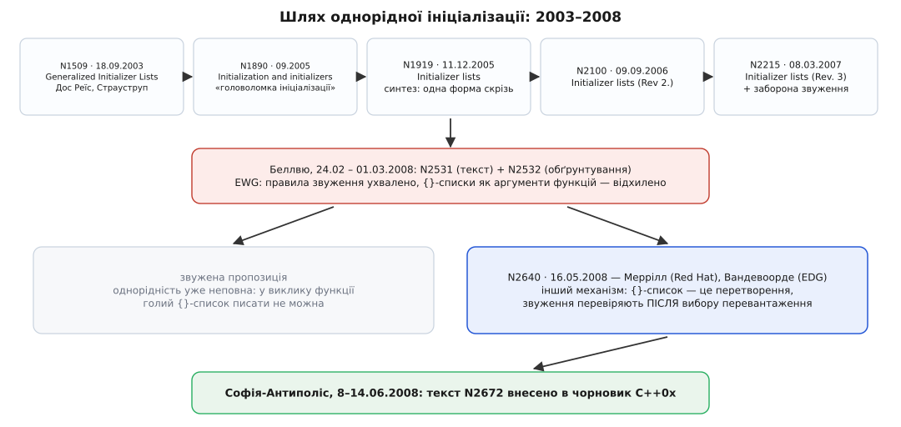

# 📜 Як фігурні дужки мали стати єдиною формою — і чому не стали

П'ять років двоє авторів вели через комітет ідею, що звучить майже банально: нехай буде **одна** форма запису ініціалізації, слушна для будь-якого типу. Ідею ухвалили — але механізм, яким вона працює в живій мові, комітет узяв з іншого папера, написаного двома іншими людьми за місяць до вирішального голосування. Саме тому «однорідна ініціалізація» сьогодні однорідна не до кінця: фігурні дужки не витіснили решту форм, а стали ще однією — з власними правилами, які іноді дивують. Ця історія пояснює, звідки взялася кожна з тих дивовиж.

Усі папери, про які тут ідеться, — публічні документи робочої групи WG21, з номерами й датами в шапці; посилання на них [www.open-std.org](https://www.open-std.org/jtc1/sc22/wg21/docs/papers/). Дати нижче взяті просто з цих шапок. Те, що відбувалося **в залі засідань**, документами не зафіксовано — про це відомо лише зі спогадів учасників, і там, де йдеться про мотиви й настрої, це окремо позначено. Як узагалі влаштований цей потік паперів, засідань і голосувань, описано в [Як робиться стандарт C++](book:cpp-standards/standardization-process).

## Що дратувало 2003 року

Причина була не в естетиці, а в порушенні власного правила C++: вбудовані типи не повинні мати переваг перед типами користувача. А вони мали.

```cpp
int a[] = { 1, 2, 3, 4, 5 };   // просто й прямо
std::vector<int> v = { 1, 2, 3, 4, 5 };   // 2003 рік: так не можна
std::vector<int> v2(a, a + 5);            // доводилося отак
```

Масив, тобто найнебезпечніший інструмент у мові, наповнювався зручно й одним рядком. Вектор, тобто той інструмент, яким мали б користуватися замість масиву, — не наповнювався ніяк, і людину змушували спершу створити масив, а тоді ще й правильно порахувати його довжину. У папері **N1509 «Generalized Initializer Lists»** від 18 вересня 2003 року Ґабріель Дос Реїс (Gabriel Dos Reis) і Б'ярне Страуструп (Bjarne Stroustrup) наводять саме цей приклад — і чесно зізнаються в тексті, що самі помилилися з довжиною, коли писали `a + 5` замість `a + 6`. Приклад помилки виявився промовистішим за будь-який аргумент.

Механізм, який вони тоді запропонували, звався **послідовним конструктором** (sequence constructor) і виглядав так: конструктор, що бере пару вказівників — на перший елемент і за останній.

```cpp
template<class T> class vector {
    vector(const T* first, const T* last);   // послідовний конструктор
};

vector<int> vi = { 1, 2, 3, 4, 5 };   // компілятор сам створить масив і передасть межі
```

І вже тут, у першому ж папері 2003 року, з'явилося правило, яке через вісім років стане найчастішою причиною здивування: спершу пробують послідовний конструктор, а якщо його немає або він не підходить — тоді решту. Пріоритет списочного конструктора не був пізнішим компромісом; він був у задумі від самого початку.

## Як задум розрісся до «однієї форми для всіх»

Далі йде рівна лінія ревізій, і в кожній намір робиться амбітнішим. **N1890 «Initialization and initializers»** (вересень 2005) описує вже не одну ваду, а цілу «головоломку ініціалізації»: у C++ чотири різні синтаксиси для того самого, і який із них можна вжити, залежить від типу. **N1919** (11 грудня 2005), **N2100 (Rev 2.)** (9 вересня 2006) і **N2215 (Rev. 3)** (8 березня 2007) несуть уже спільну тезу: дозволити список у фігурних дужках **скрізь**, де взагалі буває ініціалізація, — і щоб семантика при цьому була **однакова** в усіх випадках.

«Скрізь» тут буквальне: оголошення змінної, аргумент функції, значення `return`, ініціалізатор бази й члена, об'єкт, створений через `new`, явне перетворення типу. У тих самих ревізіях народилося й те, що ми бачимо в мові сьогодні: тип `std::initializer_list` як явний тип параметра для списочного конструктора; запис із назвою типу `X{1,2,3}` для зняття неоднозначності; і — окремою побічною пропозицією — **заборона звужувальних перетворень** усередині фігурних дужок.

Ключове речення всієї конструкції, однак, було інше, і воно в тексті N2215 стоїть у переліку основних пунктів: ініціалізація зі списком, зокрема й у формі `X x = { y };`, — це **пряма** ініціалізація, а не копіювальна. Тобто автори хотіли стерти саму межу між `X x{y}` і `X x = {y}`. Це й була справжня однорідність: не просто «дужки працюють усюди», а «дужки всюди означають одне й те саме». Форма запису мала перестати впливати на сенс.



*П'ять років одна лінія паперів вела до «однієї форми для всіх типів»; у лютому 2008-го комітет обрізав пропозицію, і остаточний механізм прийшов з альтернативного папера.*

## Беллвю, лютий 2008: пропозицію обрізали

На засіданні WG21 у Беллвю (штат Вашингтон), що тривало з 24 лютого до 1 березня 2008 року, на розгляд лягли два документи: **N2531** з текстом формулювань для робочого проєкту (Дж. Стівен Адамчик, Дос Реїс, Страуструп) і **N2532 «Uniform initialization design choices»** — папір Страуструпа, де він сам перелічив спірні місця свого дизайну.

Спірними вони й виявилися. Два закиди прозвучали найгучніше, і обидва — про те, що фігурні дужки в ролі аргументу функції роблять забагато мовчки.

```cpp
struct Array  { explicit Array(int); };
struct Number { Number(long long); };

void print(Array);    // (1)
void print(Number);   // (2)

print({100});   // за N2531 вигравала (1) — попри explicit
```

Позначку `explicit` ставлять саме для того, щоб конструктор не спрацьовував сам собою. А тут він спрацьовував — бо в задумі N2531 будь-який список у дужках був **прямою** ініціалізацією, а пряма розглядає й `explicit`-конструктори.

Другий закид тонший:

```cpp
struct BCD { BCD(int); };

void f(char);   // (1), char 8-бітний
void f(BCD);    // (2)

f({1000});      // за N2531 вигравала (2)
```

Перетворення `1000 → char` звужувальне, отже заборонене всередині дужок; тож кандидат `(1)` вибував, і перемагав `(2)` — перетворення, визначене користувачем. Тобто заборона звуження не просто відхиляла негодящий рядок, а **мовчки перекидала виклик на інше перевантаження**. Це вже виглядало як пастка.

Підсумок засідання був половинчастий: правила про звуження EWG (робоча група з розвитку мови) ухвалила — неохоче, — а от можливість передавати нетипізований `{}`-список як аргумент функції **відхилила**. Разом із нею відпадала більша частина того, заради чого все й починалося: `f({1,2,3})` знову ставало не можна. Автори альтернативного папера, який з'явиться за два місяці, опишуть цей результат сухо: компроміс, який у кращому разі не сподобався нікому.

Вони ж указали на дірку, що лишалася в самій логіці такого компромісу. Рядок `A x = вираз;` завжди можна переписати як `A x(вираз);` — за одним-єдиним винятком: коли вираз має вигляд `{ … }`. Правило, з якого стирчить один виняток, — ознака, що модель обрано не ту.

## N2640: інший спосіб думати про ініціалізацію

16 травня 2008 року, у розсиланні паперів перед наступним засіданням, з'явився папір **N2640 «Initializer Lists — Alternative Mechanism and Rationale»**. Автори — Джейсон Меррілл (Jason Merrill) з Red Hat, супровідник C++-фронтенду GCC, і Давід Вандевоорде (Daveed Vandevoorde) з EDG, компанії, чий фронтенд лежить в основі багатьох комерційних компіляторів. Люди, які самі пишуть компілятори, тобто читають правила з боку того, кому їх виконувати.

Перше, що вони зробили, — відмовилися від словника стандарту. Терміни «копіювальна» й «пряма» ініціалізація, кажуть автори, — це стандартеза, якою програміст не має перейматися; до того ж досвідчені люди регулярно думають, ніби копіювальна повільніша (вона не повільніша). Замість цього вони пропонують дві людські категорії:

- **виклик конструктора** (ctor-call) — це схоже на виклик: список аргументів, з яких будують об'єкт;
- **перетворення** (conversion) — це передавання одного готового значення в інший тип.

І тоді все розкладається само. `X x{a, b}` — виклик конструктора: `explicit` доречний, бо конструктор названо. `X x = {a, b}` — перетворення: тут `{a, b}` виступає **єдиним значенням**, а `explicit` означає рівно те, що завжди означав, — «це значення не є значенням мого типу, само собою не перетворюється». Отже, у формі зі знаком рівності `explicit`-конструктори до діла не беруть.

> 🔧 **Навіщо це.** Ця пара категорій — досі найкоротший спосіб пояснити, чому `Array z{10}` компілюється, а `Array z = {10}` для того самого класу з `explicit Array(int)` — ні. Перше — виклик конструктора з аргументом 10; друге — спроба сказати, що число 10 **і є** масивом. Коли треба швидко зрозуміти незнайомий рядок ініціалізації, питання «це виклик чи перетворення?» дає відповідь швидше, ніж перечитування правил перевантаження.

Друге рішення N2640 — про звуження. Автори запропонували перевіряти звужувальні перетворення **після** того, як виведення типів і вибір перевантаження вже завершено; знайшли звуження — програма неправильна, і крапка. Це прибирало другий беллвюський закид одним рухом: правила вибору перевантаження звуження більше не чіпає, отже й перекинути виклик на інше перевантаження воно не може. Приклад із `f({1000})` тепер просто помилка компіляції — замість тихого виклику `f(BCD)`.

Третє — те, що зробило `{}`-списки нарешті придатними для аргументів. Кожна пара дужок, кажуть автори, відкриває **нову** ініціалізацію, тож ланцюжок перетворень, визначених користувачем, дозволено — за умови, що ланки розділені дужками. Тому вкладені списки читаються природно:

```cpp
h.insert_entries({ { "США",       "Вашингтон"  },
                   { "Бельгія",   "Брюссель"   },
                   { "Гватемала", "Гватемала"  } });
```

А коли дужок немає, обмеження «щонайбільше одне перетворення користувача» лишається чинним — і читач коду може визначити ціль виклику, дивлячись лише на типи параметрів кандидатів, не шукаючи, через які проміжні типи ще можна дійти.

Ціна цього рішення — та сама, яку задум 2005 року хотів прибрати. Якщо `X x = {a}` — перетворення, а `X x{a}` — виклик конструктора, то це **різні речі**, і межа між копіювальною й прямою ініціалізацією не стирається, а лише переходить із круглих дужок на фігурні. Автори N2640 це прямо підкреслюють: на відміну від N2531, у них ці два записи не рівносильні. Так у мові й лишилося дві списочні форми замість однієї.

*(Остаточне формулювання, ухвалене з текстом N2672, тут трохи інше, ніж у N2640: `explicit`-конструктор у копіювальному контексті таки потрапляє в список кандидатів, але якщо він переміг — програма неправильна. Практична різниця лише в діагностиці: компілятор скаже «обрано explicit», а не «немає придатного перетворення».)*

## Чому «жадібність» списочного конструктора лишили

Один пункт N2640 варто розібрати окремо, бо саме він щодня плутає людей: якщо клас має і звичайний конструктор, і конструктор від `initializer_list`, фігурні дужки віддають перевагу другому.

Автори не успадкували це правило бездумно — вони описують, що розглядали протилежний порядок: хай короткі списки обслуговують багатопараметрові конструктори, а списочний бере на себе довільно довгі. І відкинули, бо результат виходив непередбачуваним:

```cpp
struct Vec {
    Vec(std::initializer_list<int>);
    explicit Vec(unsigned size);
};

Vec v1{1, 2};   // очевидно: вектор із двох елементів
Vec v2{10};     // а це? один елемент 10 — чи десять елементів?
```

За зворотного правила `v2` став би вектором на десять елементів — тобто сенс запису `{…}` стрибав би залежно від того, скільки значень у дужках і які конструктори випадково є в класу. Тому лишили просте правило: конструктор від `initializer_list` виграє завжди, коли отримує список у фігурних дужках.

Страуструп у своєму огляді історії мови для конференції HOPL (2020) пояснює той самий вибір з іншого боку: мільйони рядків коду вже містили `vector<int> v(10)` у значенні «десять елементів», і скасувати це прочитання було неможливо; тож вирішили дати перевагу списочному тлумаченню — і, як він сам додає, це змушує вживати круглі дужки, коли конструктора від `initializer_list` треба **уникнути**. Одним реченням: саме тут однорідність і зламалася. Форма, задумана як універсальна, стала формою, що обирає конкретний конструктор, — а отже, окремою формою серед інших. Механіку цього вибору описано в [Розв'язанні перевантаження](book:cpp-standards/overload-resolution).

## Червень 2008 і те, що з цього вийшло

12 червня 2008 року з'явився **N2672 «Initializer List proposed wording»** тих самих Меррілла й Вандевоорде — текст формулювань за механізмом N2640, з деякими частинами, взятими просто з N2531. На засіданні в Софії-Антиполісі (Франція), 8–14 червня 2008 року, ініціалізаційні списки внесли в чорновик C++0x. Від першого папера до голосування минуло чотири роки й дев'ять місяців.

Оцінку результату дав сам автор задуму. У тому ж огляді 2020 року Страуструп пише, що ідеал було наближено лише неповно, і мова має схему, яка «only almost uniform» — майже однорідна; а дорогою, за його словами, було багато гарячих суперечок і багато змін, не всі з яких він вважає покращеннями. Це — оцінка учасника, не документ комітету; але оскільки учасник тут — автор початкової пропозиції, вага в неї чимала.

Що з цього лишилося на практиці: `{}` справді працює для всіх типів і в усіх контекстах, де буває ініціалізація; звуження справді заборонене; `X{…}` справді знімає неоднозначності розбору. Але «одна форма замість чотирьох» не сталася: форм стало п'ять, і вибір між ними досі щось означає.

## Ім'я для пастки з'явилося раніше за ліки

Остання нитка цієї історії тягнеться з іншого боку — не з комітету, а з книжкової полиці.

**«Найприкріший розбір»** (most vexing parse) — назва, яку ввів Скотт Маєрс (Scott Meyers) у книжці *Effective STL* (2001), у пункті 6: «Стережіться найприкрішого розбору C++». Ішлося про те, що рядок `Widget w();` оголошує функцію, а не змінну, і що спроба прочитати вміст файлу одним рядком через пару ітераторів перетворюється на оголошення функції з двома параметрами. Назва прижилася й пішла в загальний ужиток — випадок, коли влучний термін з'явився за сім років до того, як мова дістала засіб від самої хвороби.

Цікаво, що ім'я Маєрса замкнуло коло: у N2640 «найприкріший розбір» згадано серед аргументів **за** те, щоб зберегти запис `X var{1, "Hello"}` як пряму ініціалізацію. Логіка проста й остаточна: список параметрів функції фігурними дужками не записують ніде, отже прочитати такий рядок як оголошення функції граматично неможливо. Пастка, названа 2001 року, стала одним із доводів у папері, що визначив вигляд ініціалізації в C++11.
