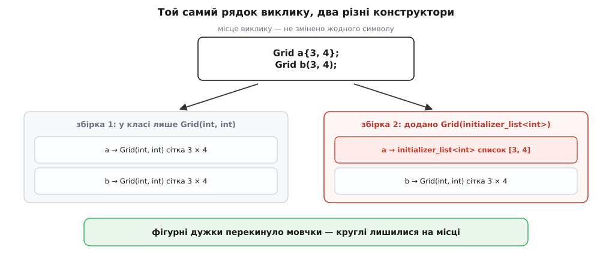

# ⚙️ Стенд: клас, що називає конструктор, який його створив

Це однофайлова програма без залежностей, у якій кожен конструктор друкує власний підпис, — на виході постає готова таблиця «форма запису → хто справді спрацював». Відповідати словами на питання «а який конструктор тут викликається» марно: надто багато правильних відповідей суперечать першому враженню. Один запуск закриває питання остаточно, ще й на вашому компіляторі, а не на чужому.

## Задача

Вибір конструктора мова робить мовчки. У тексті програми його не видно — видно самі дужки; у налагоджувачі видно вже наслідок, коли розбиратися пізно. Треба зробити сам **вибір** спостережуваним і за один запуск відповісти на шість питань:

1. Чи справді `T x{}` і `T x({})` — різні операції, і що дає кожна.
2. Кого обирає `T x{10, true}`, коли в класі є і конструктор `(int, bool)`, і конструктор від `initializer_list<int>`.
3. Де саме проходить межа, за якою фігурні дужки перестають чіплятися до списочного конструктора й пускають у гру решту.
4. Що робить перевірка звуження — і чи однаково поводяться тут GCC та Clang.
5. Що змінює в житті агрегату один перемикач `-std=c++20`.
6. Скільки чужого коду мовчки змінить сенс, якщо додати до класу один-єдиний конструктор.

## Ідея

Піддослідний клас має рівно ті п'ять конструкторів, які між собою конкурують: типовий, `(int, bool)`, від `initializer_list<int>`, `explicit` від `double` і копіювальний. Кожен друкує свій підпис і те, що отримав, — кількість значень у списку, значення аргументів. Більше нічого клас не робить: він не зберігає стану, не має полів і не претендує на осмисленість. Це вимірювальний прилад, а не тип із програми.

`explicit`-конструктор від `double` тут не для повноти набору. Саме він показує розвилку в найчистішому вигляді: одне число в круглих дужках потрапляє до нього, те саме число у фігурних — до списочного. Без нього довелося б будувати два класи, щоб побачити одну різницю.

Обслуга стенду друкує **текст рядка** перед тим, як його виконати, тож вивід сам себе підписує: ліворуч те, що написано в коді, праворуч те, що з цього вийшло. Жодних перевірок і жодних `assert` — стенд нічого не стверджує, він показує.

Друкувати варто через `std::printf`, а не `std::cout`: потоки виводу тягнуть за собою статичну ініціалізацію, і якщо ви колись зробите піддослідний об'єкт глобальним, стенд почне брехати саме там, де вимірює найтонше. Розмір списку виводимо через `(unsigned)` і `%u`, а не `%zu`, — специфікатора `z` старі бібліотеки виконання на Windows не розуміють.

## Код

```cpp
// which_ctor.cpp — хто саме викликається за кожної форми запису
// g++ -std=c++17 -Wall -Wextra which_ctor.cpp -o which_ctor
#include <cstdio>
#include <initializer_list>

struct Probe {
    Probe() {
        std::puts("Probe()                       типовий");
    }
    Probe(int n, bool flag) {
        std::printf("Probe(int, bool)              n=%d flag=%s\n",
                    n, flag ? "true" : "false");
    }
    Probe(std::initializer_list<int> xs) {
        std::printf("Probe(initializer_list<int>)  список (%u):", (unsigned)xs.size());
        for (int v : xs) std::printf(" %d", v);
        std::putchar('\n');
    }
    explicit Probe(double v) {
        std::printf("explicit Probe(double)        v=%g\n", v);
    }
    Probe(const Probe&) {
        std::puts("Probe(const Probe&)           копія");
    }
};

// друкує текст рядка й лишає курсор на місці — далі допише сам конструктор
static void form(const char* code) { std::printf("%-24s│ ", code); }

int main() {
    form("Probe a;");              Probe a;
    form("Probe b{};");            Probe b{};
    form("Probe c = {};");         Probe c = {};
    form("Probe d({});");          Probe d({});
    form("Probe e{{}};");          Probe e{{}};
    form("Probe f(1);");           Probe f(1);
    form("Probe g{1};");           Probe g{1};
    form("Probe h(10, true);");    Probe h(10, true);
    form("Probe i{10, true};");    Probe i{10, true};
    form("Probe j = {10, true};"); Probe j = {10, true};
    form("Probe k(2.5);");         Probe k(2.5);
    form("Probe l{1, 2, 3};");     Probe l{1, 2, 3};
    form("Probe m(a);");           Probe m(a);
    form("Probe n = a;");          Probe n = a;
    form("Probe o{a};");           Probe o{a};

    form("Probe w();");            Probe w();
    std::puts("(нічого — це оголошення функції)");
}
```

Останній рядок навмисно лишений без пояснень у коді: він **нічого не друкує**, бо `Probe w();` не створює об'єкта. Компілятори це вже ловлять і без нас — Clang давно, GCC від одинадцятої версії: обидва скажуть, що порожні дужки розв'язано на користь оголошення функції.

## Що друкує

```
Probe a;                │ Probe()                       типовий
Probe b{};              │ Probe()                       типовий
Probe c = {};           │ Probe()                       типовий
Probe d({});            │ Probe(initializer_list<int>)  список (0):
Probe e{{}};            │ Probe(initializer_list<int>)  список (1): 0
Probe f(1);             │ explicit Probe(double)        v=1
Probe g{1};             │ Probe(initializer_list<int>)  список (1): 1
Probe h(10, true);      │ Probe(int, bool)              n=10 flag=true
Probe i{10, true};      │ Probe(initializer_list<int>)  список (2): 10 1
Probe j = {10, true};   │ Probe(initializer_list<int>)  список (2): 10 1
Probe k(2.5);           │ explicit Probe(double)        v=2.5
Probe l{1, 2, 3};       │ Probe(initializer_list<int>)  список (3): 1 2 3
Probe m(a);             │ Probe(const Probe&)           копія
Probe n = a;            │ Probe(const Probe&)           копія
Probe o{a};             │ Probe(const Probe&)           копія
Probe w();              │ (нічого — це оголошення функції)
```

Ця таблиця, на відміну від вимірювань швидкості чи кількості копій, **не є знімком компілятора**. Кожен рядок тут наказаний стандартом; якби ваш компілятор дав інший результат, це була б його помилка, а не варіант реалізації. Від компілятора залежать лише діагностики, до яких ми дійдемо далі, та наявність можливостей C++20.

**Порожнеча (рядки 1–3).** Три різні форми — і той самий типовий конструктор. Це власне те правило, заради якого фігурні дужки взагалі можна рекомендувати як усталений вибір: `T x{}` не пробує зібрати порожній список, а йде до типового конструктора. Для класу без написаного конструктора між `T x;` і `T x{}` різниця була б колосальна, тут — жодної.

**Порожній список (рядки 4–5).** Ось де форма важить. `Probe d({})` — це вже не списочна ініціалізація, а звичайна пряма з одним аргументом `{}`, і саме тут списочний конструктор отримує **порожній** список. Тонкість, яку варто побачити: аргумент `{}` однаково добре підходить і до `initializer_list<int>`, і до `explicit Probe(double)` — обидва перетворення мова оцінює як тотожні. Нічия розв'язується окремим правилом переваги: з двох однаково добрих кандидатів виграє той, чий параметр — `std::initializer_list`. Це не спеціальний випадок для порожніх дужок, а частина загального механізму: компілятор перебирає всі однойменні функції, відсіює непридатні й порівнює решту за якістю перетворень аргументів, маючи набір тонких правил для нічиїх ([розв'язання перевантаження](book:cpp-standards/overload-resolution)).

А `Probe e{{}}` дає список **з одного** елемента, а не порожній. Логіка проста, щойно її побачити: зовнішні дужки — це списочна ініціалізація, всередині неї перелічено один елемент, і цей елемент — `{}`, тобто нуль. Народний рецепт «щоб дістати порожній список, подвой дужки» не працює; працює лише `T x({})`.

**Одне число (рядки 6–7).** Найкоротша пара в таблиці й найрізкіша. `Probe f(1)` йде до `explicit Probe(double)` — списочний конструктор у круглих дужках навіть не кандидат, бо `int` не перетворюється на `initializer_list<int>` сам собою. `Probe g{1}` йде до списочного, бо у фігурних дужках його розглядають першим. Наслідок жорсткіший, ніж здається: поки в класі є конструктор від `initializer_list<int>`, конструктор `Probe(double)` фігурними дужками **недосяжний у принципі**. Спроба написати `Probe{1.0}` не поверне вибір назад — вона впаде на звуженні.

**Два аргументи (рядки 8–10).** Класика. `Probe h(10, true)` викликає `(int, bool)`; `Probe i{10, true}` — списочний, і `true` дорогою стає одиницею. Помилки тут немає й бути не може: `bool` → `int` — це підвищення, а не звуження, тож список цілком коректний. Форма `Probe j = {10, true}` поводиться так само, як `i`: знак рівності міняє долю `explicit`-конструкторів, а не пріоритет списочного.

**Копія і друга фаза (рядки 13–15).** `Probe o{a}` цікавий саме тим, що ніякої несподіванки не дає. Фігурні дужки чесно спробували списочний конструктор, але `Probe` у `int` не перетворюється — придатних списочних немає, і в гру вступають усі решта. Виграє копіювальний. Це і є та межа з третього питання: фігурні дужки не «завжди беруть список», вони беруть список, **коли список узагалі можливо зібрати**.

## Ті самі правила на `std::vector`

Той самий дослід на готовому типі зі стандартної бібліотеки — щоб переконатися, що `vector` не має жодної магії, а лише два конкурентні конструктори ([вибір контейнера](book:cpp-standards/stl-containers-choice)).

```cpp
// vectors.cpp
#include <cstdio>
#include <string>
#include <vector>

static void show(const char* code, const std::vector<int>& v) {
    std::printf("%-28s│ розмір %u:", code, (unsigned)v.size());
    for (int x : v) std::printf(" %d", x);
    std::putchar('\n');
}
static void show(const char* code, const std::vector<std::string>& v) {
    std::printf("%-28s│ розмір %u", code, (unsigned)v.size());
    if (!v.empty()) std::printf(", [0] = \"%s\"", v[0].c_str());
    std::putchar('\n');
}

int main() {
    show("vector<int> v(3, 0)",      std::vector<int>(3, 0));
    show("vector<int> v{3, 0}",      std::vector<int>{3, 0});
    show("vector<int> v(3)",         std::vector<int>(3));
    show("vector<int> v{3}",         std::vector<int>{3});
    show("vector<int> v{}",          std::vector<int>{});
    show("vector<int> v({})",        std::vector<int>({}));
    show("vector<int> v{{}}",        std::vector<int>{{}});
    show("vector<string> v(10, \"hi\")", std::vector<std::string>(10, "hi"));
    show("vector<string> v{10, \"hi\"}", std::vector<std::string>{10, "hi"});
}
```

```
vector<int> v(3, 0)         │ розмір 3: 0 0 0
vector<int> v{3, 0}         │ розмір 2: 3 0
vector<int> v(3)            │ розмір 3: 0 0 0
vector<int> v{3}            │ розмір 1: 3
vector<int> v{}             │ розмір 0:
vector<int> v({})           │ розмір 0:
vector<int> v{{}}           │ розмір 1: 0
vector<string> v(10, "hi")  │ розмір 10, [0] = "hi"
vector<string> v{10, "hi"}  │ розмір 10, [0] = "hi"
```

Два останні рядки — найважливіші в усьому стенді. Той самий запис, той самий контейнер, різні дужки — і **однаковий** результат, хоча для `vector<int>` та сама пара дужок давала протилежне. Причина не в дужках, а в типі елемента: число `10` у `std::string` не перетворюється жодним чином, тому списочний конструктор непридатний і працюють звичайні правила. Змініть у власному коді `std::vector<std::string>` на `std::vector<int>` — і рядок `{10, "hi"}`, звісно, перестане компілюватися; а от заміна `int` на щось, що з числа будується, тихо переверне сенс.

## Що не компілюється

Половина правил ініціалізації проявляється тільки через помилки, тому їх варто зібрати окремо й дивитися по одній. Кожен випадок вмикається своїм `-DERR=n`.

```cpp
// errors.cpp — по одному спірному рядку на прогін (останній випадок правильний)
// g++ -std=c++17 -DERR=1 -c errors.cpp
#include <initializer_list>
#include <string>
#include <vector>

struct Probe {
    Probe();
    Probe(int, bool);
    Probe(std::initializer_list<int>);
    explicit Probe(double);
    Probe(const Probe&);
};

#if   ERR == 1
Probe p{2.5};                            // списочний обрано → звуження double → int
#elif ERR == 2
Probe p = 2.5;                           // explicit не потрапив у кандидати
#elif ERR == 3
double d = 2.5;
Probe p{d};                              // те саме звуження, але джерело — НЕ константа
#elif ERR == 4
int n = 10;
std::vector<std::string> v{n, "hi"};     // int → size_type, джерело — не константа
#elif ERR == 5
const int n = 10;
std::vector<std::string> v{n, "hi"};     // те саме, але константа — і все чисто
#elif ERR == 6
struct Rect { int w; int h; };
Rect r(3, 4);                            // круглі дужки для агрегату
#endif
```

Перші два випадки — те, заради чого стенд узагалі має `explicit`-конструктор. Повідомлення GCC (тут і далі — g++ 13, скорочено; формулювання різняться від версії до версії):

```
ERR=1 → error: narrowing conversion of '2.5e+0' from 'double' to 'int' [-Wnarrowing]
ERR=2 → error: conversion from 'double' to non-scalar type 'Probe' requested
```

Два повідомлення про той самий рядок коду з різними дужками — і жодне не каже «ти вибрав не той конструктор». Перше означає: списочний конструктор **уже обрано**, і аж потім перевірка звуження зарубала аргумент. Друге означає: у копіювальному контексті `explicit`-конструктора не існує, тож перетворювати `double` на `Probe` немає чим.

А ось де починаються розбіжності між компіляторами. Випадок `ERR=3` — те саме звуження, тільки джерелом не літерал, а змінна. Стандарт каже, що звуження всередині фігурних дужок робить програму неправильною завжди, з єдиним винятком: константний вираз, значення якого точно вміщається в цільовий тип. Змінна `d` — не константний вираз, отже, це помилка. Clang так і каже. GCC — ні:

```
ERR=3, g++   → warning: narrowing conversion of 'd' from 'double' to 'int' [-Wnarrowing]
ERR=3, clang → error: type 'double' cannot be narrowed to 'int' in initializer list
```

GCC свідомо пом'якшив діагностику заради старого коду: у його документації записано прямо — звуження з константи дає помилку, звуження з неконстанти дає попередження. Тобто найнебезпечніший різновид — той, де компілятор не може перевірити значення й тому мав би заборонити перетворення напевно, — на GCC **збирається**. Практичний висновок один: `-Werror=narrowing` у налаштуваннях збірки обов'язковий, інакше половина захисту, за яку ми терпимо фігурні дужки, просто вимкнена.

Пара `ERR=4` / `ERR=5` показує ту саму межу на живому контейнері. `int n = 10` у списку `{n, "hi"}` мусить стати `size_type` (беззнаковим), а це звуження — GCC попереджає, Clang зупиняє. Досить дописати `const`, і рядок стає бездоганним: для цілого типу `const`-змінна, ініціалізована літералом, і є константним виразом, тож виняток спрацьовує. Одне слово в оголошенні за сотні рядків звідси вирішує, чи буде тут діагностика.

Останній випадок, `ERR=6`, не про дужки й не про звуження, а про версію стандарту — і саме на ньому стенд переходить до наступного досліду.

## Агрегат і круглі дужки: до й після `-std=c++20`

Останній перемикач у стенді — версія стандарту. Ця частина, на відміну від решти, свідомо друкує різне під різними прапорцями.

```cpp
// agg.cpp — g++ -std=c++17 agg.cpp && g++ -std=c++20 agg.cpp
#include <cstdio>
#include <type_traits>

struct Rect { int w; int h = 10; };        // агрегат
struct Tag  { Tag() = default; int v; };   // агрегат у C++17, НЕ агрегат у C++20

int main() {
    std::printf("__cplusplus = %ld\n", (long)__cplusplus);

#ifdef __cpp_aggregate_paren_init
    std::printf("__cpp_aggregate_paren_init = %ld\n", (long)__cpp_aggregate_paren_init);
    Rect a(3, 4);
    Rect b(3);
    Rect c(3.9, 4);                        // звуження круглими ДОЗВОЛЕНЕ
    std::printf("Rect a(3, 4)   → %d × %d\n", a.w, a.h);
    std::printf("Rect b(3)      → %d × %d\n", b.w, b.h);
    std::printf("Rect c(3.9, 4) → %d × %d\n", c.w, c.h);
#else
    std::puts("круглі дужки для агрегату недоступні");
#endif

    Rect d{3, 4};
    std::printf("Rect d{3, 4}   → %d × %d\n", d.w, d.h);

#if __cplusplus < 202002L
    Tag t{7};
    std::printf("Tag t{7}       → v = %d  (Tag ще агрегат)\n", t.v);
#else
    std::puts("Tag t{7}       → не компілюється: Tag більше не агрегат");
#endif

    std::printf("is_constructible<Rect, int, int> = %d\n",
                (int)std::is_constructible<Rect, int, int>::value);
}
```

```
── -std=c++17
__cplusplus = 201703
круглі дужки для агрегату недоступні
Rect d{3, 4}   → 3 × 4
Tag t{7}       → v = 7  (Tag ще агрегат)
is_constructible<Rect, int, int> = 0

── -std=c++20
__cplusplus = 202002
__cpp_aggregate_paren_init = 201902
Rect a(3, 4)   → 3 × 4
Rect b(3)      → 3 × 10
Rect c(3.9, 4) → 3 × 4
Rect d{3, 4}   → 3 × 4
Tag t{7}       → не компілюється: Tag більше не агрегат
is_constructible<Rect, int, int> = 1
```

Три речі варто прочитати уважно.

`Rect c(3.9, 4)` дає `3` — і **мовчки**. Круглий перелік для агрегату працює за правилами круглих дужок, тобто звуження в ньому дозволене; той самий `Rect c{3.9, 4}` не компілюється. Дві форми, які тепер обидві законні для одного типу, мають різну суворість — тож звичка «пишу як зручно» саме тут коштує дорого.

`Tag t{7}` перестав компілюватися. Причина не в дужках, а у визначенні агрегату: C++20 дискваліфікує тип із **будь-яким** оголошеним користувачем конструктором, навіть таким, що написаний як `= default`. Рядок `Tag() = default;`, доданий колись «щоб було явно», у C++20 забирає в типу право на агрегатну ініціалізацію. Це чи не найпоширеніша поодинока причина, чому робочий код ламається на переході стандарту ([перехід між стандартами](book:cpp-standards/migrating-standards)).

Останній рядок — найтихіший і найнеприємніший. `std::is_constructible<Rect, int, int>` перевертається з `false` на `true`, бо круглі дужки для агрегату стали законними. Якщо цією ознакою керується вибір перевантаження або якийсь `if constexpr`, то програма після зміни `-std` піде іншою гілкою, нічого при цьому не сказавши.

Підтримка тут молодша за сам стандарт, і різниця між реалізаціями досі відчутна: круглий перелік для агрегатів (папір P0960R3) з'явився у GCC 10, MSVC 19.28 (Visual Studio 2019 16.8) і аж у Clang 16; уточнення формулювань P1975R0 GCC доробив в одинадцятій версії, тож для цих дослідів варто брати GCC 11 і новіший. Правило «оголошений конструктор скасовує агрегат» (P1008R1) вміють значно довше — від GCC 9 і Clang 8, — а призначені ініціалізатори `Rect{.w = 3}` (P0329R4) є від GCC 8 і Clang 10. Свіжу картину по всіх можливостях зручно тримати перед очима ([підтримка стандартів компіляторами](book:cpp-standards/compiler-support)); решта нововведень випуску — у [C++20](book:cpp-standards/cpp20-features).

## Пастка: один доданий конструктор

Тепер найдорожчий дослід стенду. Він показує не те, як мова обирає конструктор, а те, що станеться з чужим кодом, коли ви як автор класу зробите нібито безневинне доповнення.

```cpp
// hijack.cpp
// g++ -std=c++17 hijack.cpp -o h1
// g++ -std=c++17 -DWITH_LIST_CTOR hijack.cpp -o h2
#include <cstdio>
#include <initializer_list>

struct Grid {
    Grid(int r, int c) {
        std::printf("  Grid(int, int)               сітка %d × %d = %d клітинок\n",
                    r, c, r * c);
    }
#ifdef WITH_LIST_CTOR
    Grid(std::initializer_list<int> cells) {
        std::printf("  Grid(initializer_list<int>)  список (%u):", (unsigned)cells.size());
        for (int v : cells) std::printf(" %d", v);
        std::putchar('\n');
    }
#endif
};

int main() {
    std::puts("Grid a{3, 4};");  Grid a{3, 4};
    std::puts("Grid b(3, 4);");  Grid b(3, 4);
}
```

```
── ./h1
Grid a{3, 4};
  Grid(int, int)               сітка 3 × 4 = 12 клітинок
Grid b(3, 4);
  Grid(int, int)               сітка 3 × 4 = 12 клітинок

── ./h2
Grid a{3, 4};
  Grid(initializer_list<int>)  список (2): 3 4
Grid b(3, 4);
  Grid(int, int)               сітка 3 × 4 = 12 клітинок
```



*Місце виклику не змінено жодним символом; у класі додано один конструктор. Рядок із фігурними дужками почав викликати інший конструктор — і жодної діагностики при цьому не буде.*

Функція `main` між двома збірками не змінилася ані на символ. Змінився лише клас — і рядок `Grid a{3, 4}` замість сітки три на чотири зробив щось інше. Компілятор мовчить, бо помилки й немає: код коректний в обох випадках, просто означає різне.

Це і є справжня ціна правила «списочний конструктор розглядають першим». Воно перетворює додавання конструктора від `initializer_list` на **зміну поведінки всього наявного коду**, який ініціалізував ваш тип фігурними дужками. Для контейнера це прийнятно: там перелік однотипних значень і є природним сенсом типу, а `initializer_list`-конструктор існував від першого дня. Для типу, який дожив до версії 2.0 без нього, це прихована зміна значення, якої не помітить ані огляд коду, ані збірка, ані тести — доки хтось не гляне на самі дані.

> 🔧 **Навіщо це.** Якщо конструктор від `initializer_list` таки треба додати, є дешевий спосіб знайти всі місця, які він перехопить. Оголосіть його — і одразу видаліть:
>
> ```cpp
> Grid(std::initializer_list<int>) = delete;
> ```
>
> Видалена функція бере повноцінну участь у розв'язанні перевантаження: її буде **обрано**, і аж потім програма стане неправильною. Тож кожен виклик із фігурними дужками, який після додавання пішов би до списочного конструктора, на цій пробній збірці засвітиться помилкою `use of deleted function`. Виклики з круглими дужками ця пробна збірка не зачепить узагалі. Пробіжіться по списку, вирішіть по кожному місцю окремо — і лише тоді замініть `= delete` на справжнє тіло.

## Підводні камені

**Стенд відповідає на «хто», а не на «скільки».** Тут ніде не рахують копії й переміщення, і не варто добудовувати такий лічильник у `Probe`: усунення копій зробить числа залежними від компілятора, і чистий вивід «одна форма — один конструктор» замулиться. Для підрахунку об'єктів потрібен інший прилад, з іншими правилами читання.

**Не сплутати правила мови з поведінкою компілятора.** Головна таблиця цього стенду — це мова, і всюди вона однакова. Від компілятора залежать лише три речі: суворість діагностики звуження, наявність можливостей C++20 і формулювання повідомлень. Переносячи звідси будь-який висновок на іншу збірку, спершу спитайте, до котрої з цих двох категорій він належить.

**`-Werror=narrowing` — не смак, а необхідність.** Без нього GCC пропускає звуження з неконстанти як попередження, і найтихіший різновид втрати даних лишається в збірці. Той самий рядок на Clang не збереться взагалі — гарантована несподіванка при переході між компіляторами.

**Windows потребує трьох окремих домовленостей.** Консоль треба перевести на UTF-8 (`chcp 65001`, а файл збирати з `/utf-8`), інакше кириличні написи в `printf` перетворяться на сміття. Макрос `__cplusplus` MSVC повідомляє чесно лише під `/Zc:__cplusplus` — без нього там завжди `199711L`, і перевірка `#if __cplusplus < 202002L` у `agg.cpp` збреше: під `/std:c++20` вона пропустить у збірку рядок, який під цим самим прапорцем уже не компілюється. Сам `/std:c++20` доступний від Visual Studio 2019 16.11; раніші версії ховали ці можливості за `/std:c++latest`.

**Не додавайте до `Probe` шаблонного конструктора «про всяк випадок».** Конструктор вигляду `template <class... A> Probe(A&&...)` збігається з будь-яким набором аргументів у круглих дужках точно, без жодного перетворення, — і починає вигравати в усіх звичайних конструкторів. Це окрема пастка з власними правилами, і в стенді про вибір між п'ятьма конструкторами вона лише знищить вивід.
