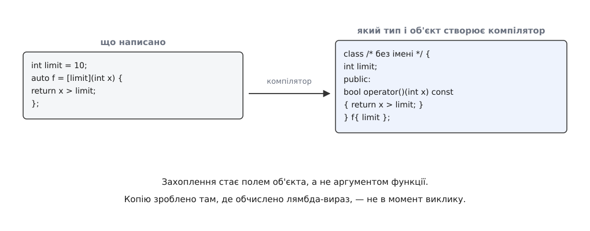
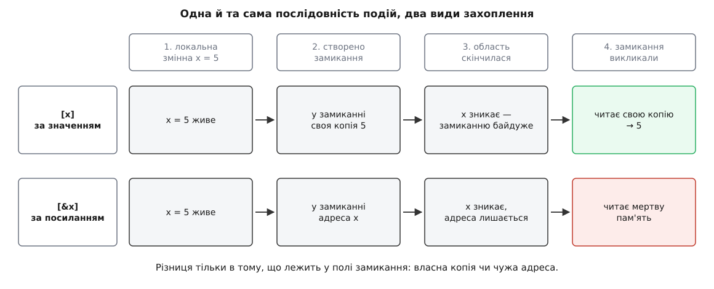
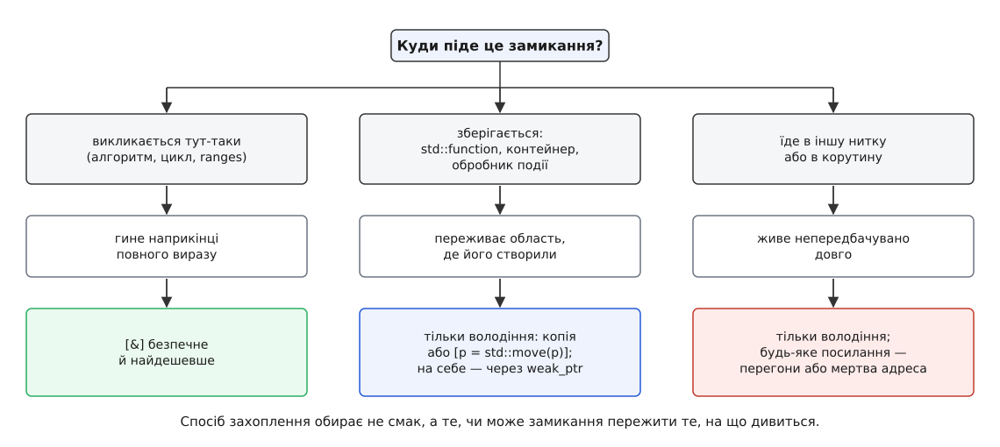

# Лямбди й захоплення: що живе скільки

<preknowlist>
- [Категорії значень](topic:cpp-standards/value-categories) — що таке lvalue й rvalue і звідки компілятор знає, копіювати чи переміщувати.
- [Посилання і правила зв'язування](topic:cpp-standards/references-binding) — посилання не володіє об'єктом, воно лише називає чужий.
- [Час життя об'єкта](topic:cpp-standards/object-lifetime) — коли об'єкт народжується й коли гине, зокрема локальний у блоці.
- [Семантика переміщення](topic:cpp-standards/move-semantics) — що робить `std::move` і чим переміщення відрізняється від копії.
- [Функції як значення](topic:programming/first-class-functions) — ідея передавати поведінку аргументом, а не викликати її на місці.
- [Шаблони: параметризація типом](topic:cpp-standards/templates-basics) — як одна й та сама функція працює з різними типами.
</preknowlist>

Порахуймо в масиві числа, більші за поріг, який щойно обчислили поруч:

```cpp
int limit = threshold(data);
auto n = std::count_if(v.begin(), v.end(), /* «більше за limit» */);
```

Алгоритм візьме предикат і сам покличе його для кожного елемента. Найпростіше передати туди звичайну функцію — і саме тут усе спиняється. Вказівник на функцію — це адреса коду, і більше нічого; покласти в нього `limit` нема куди. Функція, на яку він указує, побачить лише свої параметри й глобальні змінні:

```cpp
bool above(int x) { return x > /* ??? звідки тут limit */; }
```

Проблема не в незручному синтаксисі, а в тому, що в адресі коду немає місця для даних. Отже, потрібна сутність, у якої місце для даних є, — об'єкт. Досить оголосити тип із полем і оператором виклику:

```cpp
struct Above {
    int limit;
    bool operator()(int x) const { return x > limit; }
};

auto n = std::count_if(v.begin(), v.end(), Above{limit});
```

Це працює, і працювало задовго до появи лямбд. `std::count_if` приймає предикат шаблонним параметром, тобто його влаштовує будь-який тип, до якого можна дописати круглі дужки, — хоч вказівник на функцію, хоч `Above`. Об'єкт `Above{limit}` несе всередині копію потрібного числа, а виклик `pred(x)` розкривається у виклик його оператора.

Незручність тут одна, зате помітна: щоб передати три рядки поведінки, доводиться вийти з функції, оголосити клас, придумати йому ім'я, повернутися назад. Лямбда-вираз прибирає рівно цю незручність:

```cpp
auto n = std::count_if(v.begin(), v.end(), [limit](int x) { return x > limit; });
```

Це не нова мовна сутність поруч зі старою — це той самий клас із полем, який тепер пише компілятор. Історія тут пряма: спершу такі об'єкти-предикати збирали шаблонними бібліотеками (Boost.Lambda), а вже з того досвіду виросла мовна конструкція — [як лямбди потрапили в стандарт](topic:cpp-standards/lambdas-and-captures/hist-lambda-birth.md).

Із того, що лямбда-вираз створює **об'єкт**, випливає геть усе інше в цій темі. Об'єкт має тип, має розмір, має місце в пам'яті — і має час життя. А поля цього об'єкта — це і є захоплення. Питання «що живе скільки» перестає бути метафорою: воно перетворюється на звичайне питання про час життя полів і про те, на що ті поля дивляться.

## Що насправді пише компілятор

Лямбда-вираз породжує **тип замикання** (англ. *closure* — «замикання»: функція «замикає» в собі шматок оточення) і одразу створює об'єкт цього типу. Тип безіменний і унікальний: два текстово однакові лямбда-вирази в різних місцях програми дають два різні типи, і ніякий `decltype` одного не збігається з другим.



*Захоплення стають полями, тіло лямбди — тілом оператора виклику, а сама лямбда-вираз — створенням об'єкта цього типу.*

Три деталі цього перетворення варті окремої уваги, бо саме з них ростуть усі подальші наслідки.

**Оператор виклику за замовчуванням `const`.** Замикання поводиться як значення, а не як прихована змінна: викликати його двічі й дістати різні відповіді «просто так» не можна, бо всередині оператора всі захоплені поля константні.

**Об'єкт створюється там, де обчислено вираз.** Лямбда-вираз — не оголошення, яке компілятор кудись відносить. Це такий самий вираз, як `Above{limit}`: досягли цього рядка — сконструювали об'єкт, скопіювавши в нього все, що треба скопіювати.

**Порядок і склад полів вирішує компілятор.** Стандарт не обіцяє ані порядку полів, ані того, що поле взагалі буде: якщо захоплена змінна в тілі фактично не потрібна, компілятор має право нічого не зберігати. Покладатися на `sizeof` замикання чи на розкладку його полів не можна — а от на семантику копіювання можна цілком.

## Момент захоплення — це момент створення

Найчастіша хиба в лямбдах — читати `[limit]` як «підставити сюди значення `limit` під час виклику». Ні: `[limit]` означає «сконструювати поле `limit` копією тієї змінної **зараз**».

**Одна змінна, два замикання, одна зміна між створенням і викликом:**

```cpp
#include <cstdio>

int main() {
    int n = 1;
    auto byValue = [n]  { return n; };   // поле-копія: 1
    auto byRef   = [&n] { return n; };   // поле-посилання на n

    n = 42;

    std::printf("%d %d\n", byValue(), byRef());   // 1 42
}
```

`byValue` відповідає одиницею, бо його поле сконструювали до присвоєння, і воно вже не має жодного стосунку до змінної `n`. `byRef` відповідає сорок двома, бо в його полі лежить не число, а спосіб дістатися до `n`, і читання відбувається на момент виклику.

Звідси перший чіткий висновок: **захоплення за значенням — це копія, зроблена один раз, у точці лямбда-виразу**. Замикання після цього самодостатнє, воно нікуди не дивиться назовні й може пережити все, що завгодно.

## `mutable`: коли замиканню потрібен власний стан

Константність оператора виклику — не примха, а наслідок того, що замикання задумане як значення. Але іноді власний стан, який зберігається між викликами, — це саме те, що треба: лічильник викликів, накопичувач, «пам'ять» про минулий елемент. Тоді ставлять `mutable`, і оператор виклику перестає бути `const`.

```cpp
auto counter = [count = 0]() mutable { return ++count; };

counter();            // 1
counter();            // 2

auto copy = counter;  // копія замикання — з копією стану (count == 2)
copy();               // 3
counter();            // 3
```

Останні два рядки показують суть: стан живе **в об'єкті**, а не «в лямбді як у функції». Скопіювали об'єкт — дістали другий, незалежний лічильник. Це та сама поведінка, що й у звичайної структури з полем, — і саме тому передавати таке замикання за значенням у чужий код треба свідомо: там працюватиме копія стану, а не той екземпляр, який ви бачите в себе.

`mutable` знімає `const` з усього оператора виклику, а не з окремого поля. Дрібніше налаштування зробити не можна, тож замикання зі станом варто тримати маленькими.

## Захоплення за посиланням: обіцянка, а не оптимізація

`[&n]` не кладе в об'єкт число — воно кладе спосіб дістатися до чужого об'єкта (на практиці компілятор зберігає адресу). Копіювання не відбувається, розмір замикання не залежить від розміру захопленого, а кожен виклик бачить актуальне значення. Ціна за це одна, і вона не в тактах.

Захопивши за посиланням, ви дали обіцянку: **об'єкт, на який ви послалися, буде живий у момент кожного виклику замикання**. Компілятор цю обіцянку не перевіряє. Порушення обіцянки — не помилка часу виконання і не виняток, а [невизначена поведінка](topic:programming/undefined-behavior): звернення за адресою, за якою вже нікого немає. Найгірший різновид такого порушення — той, що «працює» на тестах, бо стек ще не встигли перезаписати.



*Різниця тільки в тому, що лежить у полі замикання: власна копія чи чужа адреса.*

Ось як обіцянку порушують у три рядки:

```cpp
std::function<int()> makeCounter() {
    int local = 7;
    return [&local] { return local; };   // посилання на змінну, яка загине тут-таки
}
```

Функція завершується, `local` знищується, а повернене замикання досі носить його адресу. Це класичне [висяче посилання](topic:cpp-standards/dangling-references) — просто заховане в полі об'єкта, куди ніхто не заглядає.

Тут доречно назвати відмінність, через яку помиляються ті, хто прийшов з інших мов. У мовах зі збиранням сміття [замикання](topic:programming/closures) продовжує життя захопленого: сама наявність посилання з живого замикання не дає об'єкту зникнути. У C++ замикання нічого не продовжує — воно лише зберігає адресу, а хто і коли знищить об'єкт за нею, вирішують звичайні правила часу життя.

## Куди піде замикання — те й вирішує спосіб захоплення

Отже, вибір між `[x]` і `[&x]` — це не вибір між «повільно й безпечно» та «швидко й ризиковано». Це порівняння двох тривалостей: скільки живе замикання і скільки живе те, на що воно дивиться. Відповідь на перше питання дає адресат — місце, куди замикання поїде.



*Спосіб захоплення обирає не смак, а те, чи може замикання пережити те, на що дивиться.*

**Негайний виклик.** Замикання, передане в `std::sort`, `std::count_if`, у конвеєр [ranges](topic:cpp-standards/ranges-pipelines) чи в цикл поруч, живе до кінця повного виразу — і за цей час жодна локальна змінна навколо померти не встигає. Тут `[&]` не просто дозволене, а бажане: воно нічого не копіює й дає найкоротший шлях до змінних.

**Збереження.** Щойно замикання лягає в поле класу, у контейнер обробників, у `std::function` чи в чергу задач, воно відв'язується від області, де народилося. Тепер посилальне захоплення тримає адресу чогось, чий кінець життя ви більше не контролюєте. Про те, як така підписка стає висячою й у якому вигляді це виявляється в реальному коді, докладно — у [розборі реєстру обробників подій](topic:cpp-standards/lambdas-and-captures/proj-callback-registry.md): там і сама пастка, і робочий спосіб її позбутися.

**Інша нитка або корутина.** Тут до питання часу життя додається питання одночасності. Замикання, віддане в `std::thread`, `std::async` чи в пул, виконається невідомо коли; посилання на локальну змінну функції, яка вже повернулася, гарантовано мертве, а посилання на живий спільний об'єкт — це ще й [перегони даних](topic:programming/data-races-locks), якщо його ніхто не захищає.

Правило, яке з цього випливає, формулюється однією фразою: **посилальне захоплення — тільки тоді, коли ви бачите і місце створення, і місце останнього виклику замикання, і вони в одній області**. У всіх інших випадках замикання має **володіти** тим, чим користується.

## Що робить `[=]` і `[&]` — і чого вони не роблять

Замість переліку імен можна поставити типовий спосіб захоплення: `[=]` — «усе, що знадобиться, за значенням», `[&]` — «усе, що знадобиться, за посиланням». Обидва можна уточнити винятком: `[=, &out]` копіює все, крім `out`, а `[&, size]` посилається на все, крім `size`.

Слова «усе, що знадобиться» тут точні. Захоплюється не все, що видно, а лише те, що в тілі справді використано. Тому типове захоплення не робить замикання важчим за іменоване: якщо з десятка локальних змінних тіло чіпає одну, поле буде одне.

Дві категорії імен не захоплюються взагалі, і це не обмеження, а наслідок: захоплювати треба лише те, до чого інакше не дістатися.

**Глобальні, статичні й `thread_local` змінні.** Вони живуть не в кадрі стека, тому оператор виклику бачить їх безпосередньо, за іменем. Їх не можна вписати у список захоплень — та й нема потреби. Наслідок для часу життя приємний: замикання, яке користується лише статичним станом, не залежить від жодної області.

**Константи, значення яких відоме на етапі компіляції.** Якщо `constexpr int kMax = 100;` використано так, що потрібне лише значення, у замиканні нічого не зберігається — компілятор підставляє число.

І одна пастка, яка виглядає як виняток, а насправді точно за правилом. Захоплення за значенням змінної, яка сама є посиланням, копіює **об'єкт, на який вона посилається**:

```cpp
void keep(const Config& cfg) {
    auto task = [cfg] { use(cfg); };   // повноцінна копія Config, а не копія посилання
    schedule(std::move(task));
}
```

Це рятує від висячої адреси, але може виявитися дорогим копіюванням там, де ви його не планували. Правило просте: `[cfg]` копіює те, що ви бачите під іменем `cfg`, а не сам спосіб доступу.

Повний перелік форм захоплення — з тим, яке поле кожна створює, що саме копіює і з якого стандарту доступна, — зібрано окремо: [таблиця форм захоплення](topic:cpp-standards/lambdas-and-captures/api-capture-forms.md).

## `this`: посилання, яке не схоже на посилання

Найдорожча пастка теми ховається в лямбді всередині методу класу. Виглядає вона так:

```cpp
class Sampler {
    std::vector<double> buf_;
public:
    std::function<size_t()> snapshot() const {
        return [=] { return buf_.size(); };   // ← що саме тут захоплено?
    }
};
```

Око читає `[=]` як «усе за значенням» і робить висновок, що `buf_` скопійовано. Насправді `buf_` — не змінна в області видимості, а поле; звертання до нього в тілі методу означає `this->buf_`. Захопити можна лише те, що є ім'ям у цій області, — а таким ім'ям є `this`. Тому `[=]` кладе в замикання **копію вказівника** `this`, і `buf_.size()` під час виклику полізе за цим вказівником у об'єкт, який до того часу може вже не існувати.

Іншими словами, `[=]` всередині методу — це посилальне захоплення в костюмі значення. Саме за цю оманливість комітет її й покарав: у C++20 неявне захоплення `this` через `[=]` оголошено застарілим, натомість з'явилася явна форма `[=, this]`, якої в C++17 ще не було (папери P0806R2 і P0409R2). Компілятори на це попереджають — і попередження варте того, щоб бути помилкою збірки.

Виходів із ситуації три, і вони різні по суті.

**Скопіювати об'єкт цілком** — `[*this]`, доступне з C++17. У замиканні з'явиться повноцінна копія об'єкта, і всередині оператора `this` вказуватиме на неї. Це відв'язує замикання від оригіналу остаточно, але означає копію всього об'єкта й окремий стан.

**Скопіювати те, що справді треба.** Часто замиканню потрібне не володіння об'єктом, а одне число чи один рядок:

```cpp
return [n = buf_.size()] { return n; };
```

Замикання перестає знати про клас узагалі, а отже й переживати за його долю.

**Взяти слабке посилання, якщо об'єктом володіє `shared_ptr`.** Це стандартний спосіб для асинхронних обробників:

```cpp
class Session : public std::enable_shared_from_this<Session> {
public:
    void start(Timer& timer) {
        std::weak_ptr<Session> weak = weak_from_this();
        timer.every(std::chrono::seconds(1), [weak] {
            if (auto self = weak.lock()) self->tick();   // об'єкт живий — працюємо
        });                                              // помер — тихо нічого не робимо
    }
private:
    void tick();
};
```

Тут замикання не володіє об'єктом (інакше таймер тримав би сесію живою вічно) і не тримає голої адреси. Воно тримає [слабке посилання](topic:cpp-standards/shared-weak-ptr) — квиток, за яким можна спробувати отримати володіння й дізнатися, чи є ще кого тримати. Захоплення `[self = shared_from_this()]` теж має сенс, але означає протилежне рішення: «поки задача не виконана, об'єкт не має права померти».

> 🔧 **Навіщо це.** Асинхронний обробник, який пережив свій об'єкт, — одна з найпоширеніших причин падінь у мережевому й інтерфейсному коді, і найгірша з погляду діагностики: падає не там, де помилка, а через сотні мілісекунд, у чужій нитці, з нечитним стеком. Звичка ставити собі питання «чи може цей таймер спрацювати після смерті `this`?» кожного разу, коли лямбда з `this` кудись зберігається, ловить цей клас помилок ще на етапі написання.

## Захоплення з ініціалізатором: замикання як власник

Захоплення за значенням копіює. А що робити з тим, що копіювати не можна або не варто, — з `unique_ptr`, з відкритим сокетом, з великим буфером? Простий список захоплень тут безсилий: він уміє лише «копію того, що видно» або «адресу того, що видно».

C++14 додав форму, яка знімає це обмеження: у списку захоплень можна оголосити **нове поле** й задати йому ініціалізатор — довільний вираз.

```cpp
auto task = [conn = std::move(conn)] {
    conn->send("ping");
};
```

Це вже не копія й не адреса: поле `conn` замикання **сконструйовано переміщенням**, і замикання стало власником з'єднання. Час життя з'єднання відтепер дорівнює часу життя замикання, хай куди воно поїде. Те саме працює для чого завгодно: `[buf = std::vector<char>(4096)]`, `[start = std::chrono::steady_clock::now()]`, `[n = buf_.size()]`.

Дзеркальна форма `[&r = someExpression]` створює поле-посилання на результат виразу — корисно, щоб скоротити довге ім'я, і рівно так само зобов'язує стежити за часом життя.

Одна деталь, про яку легко забути: ім'я ліворуч і ім'я праворуч живуть у різних областях. У `[conn = std::move(conn)]` ліве `conn` — нове поле замикання, праве — зовнішня змінна, і після переміщення вона лишається в порожньому стані. Тому писати `[x = x]` цілком законно й означає «поле `x`, скопійоване із зовнішнього `x`».

C++20 дозволив розкривати в такому захопленні пакети параметрів (папір P0780R2) — без цього загорнути аргументи змінної арності в задачу можна було хіба через `std::tuple`:

```cpp
template <class F, class... Args>
auto defer(F f, Args&&... args) {
    return [f = std::move(f), ...args = std::forward<Args>(args)]() mutable {
        return f(std::move(args)...);
    };
}
```

> 🔧 **Навіщо це.** Черга задач, пул потоків, відкладене виконання — усе це впирається в одне: задача мусить бути самодостатньою, бо виконуватиметься тоді, коли контексту її створення давно немає. Захоплення з ініціалізатором — рівно той інструмент, який перетворює «замикання, що дивиться назовні» на «замикання, що всім потрібним володіє». Практичне правило: якщо замикання кудись **зберігають**, у його списку захоплень не має бути жодного `&`.

## Тип замикання: чому доводиться писати `auto`

Тип замикання безіменний, тож записати його вручну неможливо — ім'я оголошує компілятор і нікому не показує. Звідси три способи мати з ним справу, і вони відрізняються ціною.

**`auto` — коли замикання лишається на місці.** [Виведення типу](topic:cpp-standards/auto-type-deduction) дає змінній справжній тип замикання, без жодних обгорток, і виклик через неї компілятор бачить наскрізь: оператор виклику інлайниться так само, як тіло звичайного циклу.

**Шаблонний параметр — коли замикання передають у чужу функцію.** Саме так влаштовані алгоритми стандартної бібліотеки: `std::count_if` приймає предикат окремим типом і інстанціюється під нього. Ціна виклику нульова, ціна — окрема інстанціація коду на кожен переданий тип.

**`std::function` — коли тип треба сховати.** Поле класу, вектор обробників, віртуальний інтерфейс: усе це вимагає одного фіксованого типу для замикань з різних місць. `std::function` цю роль виконує через [стирання типу](topic:cpp-standards/std-function-type-erasure), і за це доводиться платити непрямим викликом, а часто й виділенням пам'яті.

Для часу життя тут важлива одна обставина: **`std::function` зберігає копію замикання**. Скопіювали замикання — скопіювали його поля; поля-копії стали новими самостійними об'єктами, а поля-посилання лишилися посиланнями на ті самі зовнішні об'єкти. Копіювання замикання не рятує від висячої адреси — воно її розмножує.

Дрібниця, яка часом рятує шаблонний код: до C++20 тип замикання не мав ані конструктора за замовчуванням, ані присвоєння, тож покласти замикання, наприклад, у поле, яке треба перевизначати, було незручно. C++20 повернув беззахопним замиканням і те, і те (папір P0624R2) — заразом дозволивши писати лямбди в невизначуваних контекстах, наприклад як компаратор у типі контейнера.

## Беззахопна лямбда й світ C

Коли захоплень немає, замиканню нема чого носити із собою — і тоді воно еквівалентне звичайній функції. Мова це визнає прямо: беззахопне замикання неявно перетворюється на [вказівник на функцію](topic:programming/function-pointers) з відповідною сигнатурою.

Ця властивість — єдиний місток між лямбдами й інтерфейсами C, які приймають лише вказівник. Але сам місток вузький: щойно з'явилося хоч одне захоплення, перетворення зникає, бо вказівник не має куди подіти стан. Тому C-інтерфейси майже завжди мають другий параметр — «користувацькі дані»:

```cpp
using Callback = void (*)(int code, void* user);
void subscribe(Callback cb, void* user);

Logger logger;                     // мусить пережити підписку
subscribe([](int code, void* user) {
    static_cast<Logger*>(user)->write(code);
}, &logger);
```

Тут видно, що прийом нічого не змінює по суті: `void*` — це та сама гола адреса, тільки пронесена повз систему типів. Питання часу життя нікуди не поділося, воно лише перестало бути видимим компіляторові. Хто відповідає за те, щоб `logger` пережив підписку, — тепер знаєте тільки ви, і жоден санітайзер не підкаже цього до першого пострілу.

> 🔧 **Навіщо це.** Через цей місток лямбди потрапляють у драйвери, у бібліотеки на C, в обробники сигналів, у зворотні виклики графічних і мережевих API. Практична порада проста: тримайте таку лямбду беззахопною **навмисно** — це змушує весь потрібний стан пройти через `void*` явно, і питання «а хто ним володіє» ставиться в момент написання, а не в момент падіння.

## Узагальнені лямбди, рекурсія й корутини

Три сюжети примикають до теми збоку, і кожен варто знати рівно настільки, щоб не помилитися з часом життя.

**Параметр `auto`** робить оператор виклику шаблонним: `[](auto a, auto b) { return a + b; }` — це клас із шаблонним `operator()`, який інстанціюється під кожну пару типів аргументів. C++20 додав явний список параметрів — `[]<class T>(std::vector<T>& v) { … }`, коли тип треба назвати. На захоплення це не впливає ніяк: поля залишаються звичайними полями звичайного класу, шаблонний тільки виклик.

**Рекурсія.** Замикання не може покликати себе за іменем змінної: усередині тіла ця змінна ще не сконструйована, а її тип на момент розбору тіла невідомий. Історичний обхід — `std::function`, який коштує непрямого виклику й легко дає цикл володіння, якщо замикання захоплює саму цю `std::function`. Сучасний спосіб — явний параметр-об'єкт із C++23 (папір P0847R7):

```cpp
auto fib = [](this auto&& self, int n) -> int {
    return n < 2 ? n : self(n - 1) + self(n - 2);
};
```

Тут `self` — саме замикання, передане як параметр; ніякого додаткового поля й ніякого володіння собою.

**Корутини.** Лямбда-корутина — це місце, де питання «що живе скільки» стає найгострішим, бо тіло переживає власний виклик:

```cpp
auto t = [x = 0]() -> Task {
    co_await delay(std::chrono::seconds(1));
    use(x);                     // ← замикання може бути вже знищене
}();
```

Тимчасовий об'єкт-замикання знищується наприкінці повного виразу, тобто відразу після виклику. Кадр [корутини](topic:cpp-standards/coroutines) при цьому живий і після відновлення звертається до `x` — а `x` є полем того самого мертвого замикання. Правильно тут тримати замикання в іменованій змінній, яка гарантовано живе довше за корутину, або взагалі не захоплювати нічого, передавши все параметрами.

## Як вирішувати щоразу

Питання «за значенням чи за посиланням» не має відповіді за замовчуванням — воно кожного разу зводиться до порівняння двох тривалостей. Порядок міркування вміщається у два кроки.

Перший: **де це замикання востаннє викличуть**. Не «де воно написане», а де відпрацює остання його копія — після повернення з функції, після перемикання нитки, після спрацювання таймера через хвилину.

Другий: **чи доживе туди все, на що воно дивиться**. Локальна змінна не доживе за межі своєї області. Об'єкт під `shared_ptr` доживе, поки його хтось тримає, — і слабке посилання дозволить це перевірити. Поле класу доживе рівно стільки, скільки живе сам об'єкт, а вказівник `this` про його смерть не попередить.

Якщо відповідь на друге питання не «безумовно так», замикання має володіти тим, чим користується: копією, переміщеним значенням у захопленні з ініціалізатором або сильним посиланням. Ця перевірка займає секунди й ловить цілий клас помилок, які інакше проявляться далеко від місця, де їх зробили.
