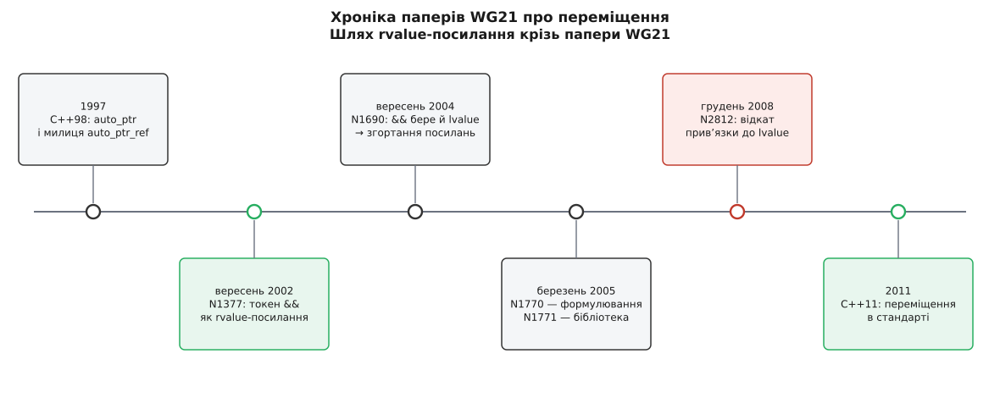

# 📜 Як народилося rvalue-посилання

Токен `&&` не вигадали як прикрасу синтаксису — його запропонували 10 вересня 2002 року в папері WG21 N1377 троє людей, які до того кілька років билися об одну й ту саму стіну: бібліотека C++98 не мала способу сказати компіляторові «це джерело помре, забирай у нього нутрощі». Ця історія варта переказу, бо кожне дивакувате правило нинішнього переміщення — це слід від конкретної невдачі, і, побачивши невдачу, правило перестаєш зубрити.

## Стіна перша: auto_ptr, що не вмів прийняти тимчасове

У C++98 єдиним розумним власником динамічного об'єкта в стандартній бібліотеці був `std::auto_ptr`. Його задум був простий: при копіюванні джерело віддає свій вказівник і само стає порожнім — бо власник мусить бути один. Але задум упирався в систему типів.

Конструктор копіювання, що псує джерело, не може взяти джерело як `const auto_ptr&`: у константи нічого не забереш. Отже, лишається `auto_ptr(auto_ptr& a)` — неконстантне посилання. І тут вилазить правило C++98: неконстантне посилання **не зв'язується з тимчасовим значенням**. Тобто типова конструкція

```cpp
std::auto_ptr<Widget> make();
std::auto_ptr<Widget> p = make();   // C++98: не компілюється «в лоба»
```

не проходила саме в тому випадку, де забрати нутрощі було б цілком безпечно. Джерело — безіменний тимчасовий об'єкт, він помре в кінці виразу, до нього ніхто вже не звернеться; але мова про це не знала, бо той самий тип параметра `auto_ptr&` вживається і для звичайного «вихідного» параметра, який функція змінює, а викликач потім читає.

Комітет вирішив цю задачу не зміною мови, а хитрістю в бібліотеці. У C++98 з'явився допоміжний тип `auto_ptr_ref` — реалізаційно визначена обгортка над посиланням на `auto_ptr`. `auto_ptr` дістав оператор перетворення в `auto_ptr_ref` і конструктор із `auto_ptr_ref` **за значенням**. Ланцюжок виходив такий: тимчасовий `auto_ptr` неявно перетворюється на `auto_ptr_ref` (у цей момент джерело віддає вказівник), а далі спрацьовує конструктор, який бере `auto_ptr_ref` за значенням — а значенню тимчасовість аргументу байдужа. Правило «неконстантне посилання не бере тимчасове» обійдено через два кроки перетворення. *(Механізм задокументований у самому стандарті C++98, розділ про `auto_ptr`; опис ланцюжка перетворень наведений і в довідниках на кшталт cppreference.)*

Милиця працювала, але ціна виявилася непомірною. По-перше, `auto_ptr` лишався **копійовним на вигляд**: `auto_ptr<T> b = a;` для іменованої змінної `a` компілювалося й тихо спорожняло `a`. Це не помилка реалізації, це прямий наслідок того, що переміщення мусили вдавати копіюванням — розрізнити «джерело приречене» і «джерело ще потрібне» не було чим. По-друге, саме через це `auto_ptr` не можна було класти в контейнери: узагальнені алгоритми й `vector` вважають, що копія лишає джерело цілим, і перше ж переміщення елементів усередині контейнера перетворювало половину масиву на порожні вказівники.

> 🔧 **Навіщо це.** Ось звідки в C++11 узялася вимога, що переміщувальний конструктор мусить мати **окрему сигнатуру**, а не бути «копіюванням із побічним ефектом». `auto_ptr` — жива демонстрація того, що буває, коли ці дві операції ділять один вхід. Його наступник, [unique_ptr](topic:cpp-standards/unique-ptr) — той самий одноосібний власник, але копіювання в нього **заборонене явно**, а переміщення дозволене окремою перевантагою; тому він безпечно живе в контейнерах.

## Стіна друга: swap і vector платили за копії, які нікому не потрібні

Другий біль був масовішим. Узагальнений обмін значеннями в C++98 виглядав так:

```cpp
template <class T>
void swap(T& a, T& b) {
    T tmp(a);   // копія №1
    a = b;      // копія №2
    b = tmp;    // копія №3
}
```

Для рядка на кілька мегабайтів це три виділення в купі й три побайтові переписування — при тому, що по суті треба переставити три вказівники. Автори могли писати спеціалізовані `swap` для власних типів, і писали; але узагальнений код (сортування, алгоритми, перерозподіл контейнера) усе одно мусив спиратися на загальний випадок.

Той самий рахунок виставляв `vector`, коли йому бракувало місця: він виділяє більший буфер і **копіює** туди кожен елемент, а потім знищує оригінали. Кожен елемент дублюється й одразу викидається. Так само дорого коштували `insert` та `erase` посередині вектора — усі елементи праворуч зсуваються копіюванням.

Обійти це в межах C++98 було нічим. Копія лишає джерело цілим — на цьому стоять [гарантії безпеки винятків](topic:cpp-standards/exception-safety-guarantees): якщо під час перерозподілу щось кинуло, старий буфер ще цілий і його можна лишити на місці. Забрати нутрощі в елементів «на свій розсуд» бібліотека не мала права, бо не знала, чи має вона на це дозвіл.

## Вересень 2002: папір N1377 і токен `&&`

Обидві стіни впираються в одне: бракує способу **позначити в типі параметра**, що аргумент — приречене значення. Саме це й запропонували Говард Гіннант (Howard E. Hinnant), Петер Дімов (Peter Dimov) і Дейв Абрагамс (Dave Abrahams) у папері **N1377=02-0035 «A Proposal to Add Move Semantics Support to the C++ Language»**, датованому 10 вересня 2002 року. *(Документ доступний в архіві WG21 на open-std.org; дата, номер і склад авторів — з самого паперу.)*

Мотивацію автори сформулювали в першому ж реченні розділу: переміщення — це насамперед оптимізація швидкодії, здатність перенести дорогий об'єкт з однієї адреси в іншу, обібравши ресурси джерела, щоб зібрати ціль із мінімальними витратами. І далі — власне пропозиція: новий різновид посилання, який зв'язується з rvalue, а токен `&&` відрізняє його від наявного синтаксису посилання. Приклад у папері записаний рівно так, як ми пишемо його сьогодні:

```cpp
struct A { /* ... */ };
void foo(A&& i);
```

Правила зв'язування автори сформулювали як надбудову над розв'язанням перевантажень, а не як окремий механізм: rvalue віддають перевагу rvalue-посиланням, lvalue — lvalue-посиланням; rvalue все ще може зв'язатися з `const A&`, але лише якщо поруч немає привабливішого rvalue-посилання. Там-таки з'явилося й правило, яке досі спантеличує на першому знайомстві: **іменоване** rvalue-посилання поводиться як lvalue, а безіменне — як rvalue. Без нього переміщення було б небезпечним: усередині функції параметр має ім'я, до нього можна звернутися двічі, тож автоматично «розбирати» його не можна.

Узагальнений `swap` у папері вже виглядає по-сучасному — з явним приведенням до rvalue замість копій:

```cpp
template <class T>
void swap(T& a, T& b) {
    T tmp(static_cast<T&&>(a));
    a = static_cast<T&&>(b);
    b = static_cast<T&&>(tmp);
}
```

Пізніше це приведення сховали за іменем `std::move`, але механізм лишився дослівно той самий: `std::move` нічого не переміщує, він лише позначає аргумент як приречений.

### Заміри, які переконали комітет

Пропозиція «дайте нам новий токен у мові» без чисел не проходить. N1377 наводить заміри на `vector<string>::insert` — тій самій операції, що зсуває хвіст вектора:

```
розмір вектора      прискорення з переміщенням
       10           на 60 %
      100           у 3 рази
     1000           у 9 разів
рядки по 1000 символів, 1000 елементів   ≈ у 80 разів
```

*(Цифри — прямі твердження паперу N1377; це заміри авторів на їхньому стенді 2002 року, а не незалежно відтворений бенчмарк.)*

Логіка зростання читається просто. Зі зростанням вектора росте кількість елементів, які треба зсунути; зі зростанням рядків росте ціна кожної окремої копії. Копіювання коштує «кількість елементів × довжина рядка», переміщення — лише «кількість елементів», бо кожен окремий перенос звівся до перестановки кількох вказівників. Тому найбільша різниця вилазить там, де обидва множники великі: тисяча елементів по тисячі символів.



*Від милиці в бібліотеці C++98 до правила в мові пройшло чотирнадцять років і щонайменше десяток паперів; зелені вузли — кроки вперед, червоний — свідомий відкат уже прийнятого рішення.*

## Сусідній папір того ж місяця: задача передавання

Того ж вересня 2002 року ті самі троє авторів подали до WG21 папір **N1385 «The Forwarding Problem: Arguments»**. Він про іншу біду: неможливо написати узагальнену функцію `f(a1, …, an)`, яка була б рівносильна виразу `E(a1, …, an)` — тобто пропустила б аргументи крізь себе, нічого в них не змінивши. Це проблема фабрик об'єктів, `bind` і всіх адаптерів: скільки б перевантаг із `T&` і `const T&` не написати, їхня кількість росте як 2ⁿ від числа параметрів, і константність та «тимчасовість» усе одно губляться.

На той момент це виглядало як окрема, паралельна задача. Розв'язали її потім тим самим інструментом — і це найцікавіший поворот у всій історії.

## 2004: посилання, яке взяло й lvalue

За два роки Гіннант, Абрагамс і Дімов подали **N1690 «rvalue reference»** (7 вересня 2004). Вступ починається з речення, що змінює правила проти N1377: пропонується новий різновид посилання, який зв'язується **і з rvalue, і з lvalue**, навіть неконстантними.

Навіщо було послаблювати те, що самі ж придумали? Бо саме це послаблення разом зі **згортанням посилань** дало розв'язок задачі передавання. Згортання — правило, що каже, у що перетворюється посилання на посилання, коли воно постає під час виведення аргументів шаблону; воно існувало ще до переміщення й у самому папері згадується як розширення правила з ядрового питання CWG №106 «Creating references to references during template deduction/instantiation». N1690 звів це докупи: якщо в шаблоні параметр записаний як `T&&`, то для lvalue-аргументу `T` виводиться як посилання, і `T&&` **згортається** назад у lvalue-посилання; для rvalue-аргументу лишається rvalue-посилання. Один запис — і категорія аргументу доходить до функції неушкодженою. Так із механізму, придуманого заради дешевого переміщення, виросло [ідеальне передавання](topic:cpp-standards/perfect-forwarding) — одна перевантага замість 2ⁿ.

## 2005: формулювання й ревізія бібліотеки

Далі йде звичайна робота комітету: ідея перетворюється на текст стандарту. У березні 2005-го подано одразу пару паперів.

**N1770=05-0030 «Proposed wording for rvalue reference»** (5 березня 2005; Дейв Абрагамс, Стівен Адамчик, Петер Дімов, Говард Гіннант, Андреас Гоммель) — це вже не пропозиція, а готове формулювання правок до розділів стандарту: як згортаються посилання в `typedef`-ах, в аргументах шаблонів і під час виведення аргументів функційного шаблону. Зверніть увагу на розширення авторського складу: до трійці додалися люди з боку реалізаторів компіляторів — папір із формулюваннями мусить бути придатним до втілення.

**N1771=05-0031 «Impact of the rvalue reference on the Standard Library»** (3 березня 2005) написали вже шестеро — Абрагамс, Дімов, Даг Ґреґор, Гіннант, Гоммель, Алісдер Мередіт. Це інвентаризація: що саме зміниться в бібліотеці, якщо rvalue-посилання ввійде в мову. З'являються поняття `MoveConstructible` та `MoveAssignable` на противагу наявним `CopyConstructible` й `Assignable`; переміщувальні конструктори й присвоєння дістають усі контейнери, рядки, потоки вводу-виводу, компоненти TR1. І там-таки — розв'язка сюжету, з якого все почалося: `auto_ptr` пропонується оголосити застарілим, а замість нього ввести `unique_ptr`, який, на відміну від попередника, **відмовляється копіюватися з lvalue**, зате переміщується — і тому його можна безпечно класти в контейнери.

## 2008: свідомий відкат

Історія не закінчилася прийняттям. У грудні 2008-го з'явився папір **N2812 «A Safety Problem with RValue References (and what to do about it)»**: та сама поступка з N1690 — дозвіл rvalue-посиланню зв'язуватися з lvalue — виявилася діркою в безпеці типів. Функція, оголошена як «беру лише приречене», мовчки приймала живу іменовану змінну й розбирала її на частини. Комітет пішов на відкат уже прийнятого рішення: rvalue-посилання більше не зв'язується з lvalue напряму. Формулювання правок дали папери N2831 і N2844 (2009).

Ідеальне передавання при цьому вціліло — бо воно ніколи не спиралося на пряме зв'язування. Воно спирається на **виведення аргументів шаблону плюс згортання**: `T&&` у шаблоні — це не rvalue-посилання, а заготовка, з якої після виведення постає або lvalue-, або rvalue-посилання. Тому заборона на пряме зв'язування зачепила звичайні функції й не зачепила шаблони. Саме через це розділення `void f(std::string&&)` не бере іменовану змінну, а `template<class T> void f(T&&)` бере все — і саме тому друге записують окремим ім'ям «передавальне посилання», щоб не плутати з першим.

Через два роки все це ввійшло до C++11. Від милиці `auto_ptr_ref`, зліпленої 1997 року, щоб хоч якось повернути тимчасовий об'єкт із функції, до правила в мові минуло чотирнадцять років — і майже весь цей час ішла робота не над «як зробити швидше», а над «як сказати компіляторові те, що програміст і так знає». Про те, як улаштований цей шлях від паперу до стандарту загалом, — [Як робиться стандарт C++](topic:cpp-standards/standardization-process).
