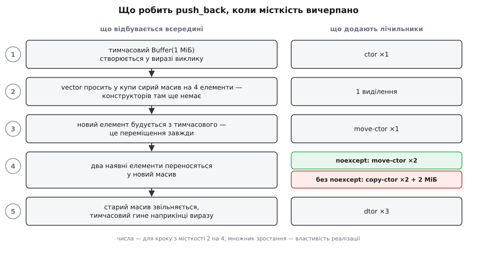

# ⚙️ `Buffer`: власний тип із переміщенням і лічильником на кожній операції

Нижче зібрано робочий клас, який володіє блоком пам'яті в купі, з усіма п'ятьма спеціальними функціями — і з лічильником усередині кожної. Лічильники тут не прикраса: переміщення — це операція, якої **не видно в тексті програми**. Рядок `v.push_back(x)` виглядає однаково, скільки б конструкторів за ним не стояло, і саме тому помилки цього роду коштують дорого й довго лишаються непоміченими. Ми змусимо клас звітувати про себе сам і подивимося на надрукований журнал: скільки викликів робить `std::vector` на кожному `push_back`, що змінює одне слово `noexcept`, чим карає викинутий рядок `if (this == &other)` і чому `return std::move(local)` коштує дорожче за `return local`.

Усе, що далі, — один файл, який збирається так:

```
g++ -std=c++17 -O2 -Wall -Wextra buffer.cpp -o demo && ./demo
```

## Дошка лічильників

Щоб побачити операції, спершу треба вміти їх рахувати. Найпростіше — одна глобальна структура з лічильниками й функція, яка друкує не абсолютні значення, а **приріст** між двома замірами.

Приріст, а не журнал окремих рядків, — свідомий вибір. Друкувати кожен виклик у момент, коли він стається, спокусливо, але порядок дій усередині `std::vector` — деталь реалізації: одна бібліотека спершу будує новий елемент, потім переносить старі, інша може зробити навпаки. Приріст за операцію відтворюється однаково скрізь, тож саме на нього можна спиратися у висновках.

```cpp
#include <cstddef>
#include <cstring>
#include <iostream>
#include <type_traits>
#include <utility>
#include <vector>

struct Stats {
    long ctor = 0, dtor = 0;
    long copy_ctor = 0, copy_assign = 0;
    long move_ctor = 0, move_assign = 0;
    long long bytes_copied = 0;
};

inline Stats g;                       // inline-змінна: одна на всю програму (C++17)

void report(const char* what, const Stats& before) {
    std::cout << what << " |";
    auto item = [](const char* name, long long delta) {
        if (delta) std::cout << "  " << name << ' ' << delta;
    };
    item("ctor",      g.ctor        - before.ctor);
    item("copy-ctor", g.copy_ctor   - before.copy_ctor);
    item("move-ctor", g.move_ctor   - before.move_ctor);
    item("copy-asg",  g.copy_assign - before.copy_assign);
    item("move-asg",  g.move_assign - before.move_assign);
    item("dtor",      g.dtor        - before.dtor);
    item("MiB",      (g.bytes_copied - before.bytes_copied) >> 20);
    std::cout << '\n';
}
```

`item` друкує лише ненульове — інакше кожен рядок звіту перетворювався б на стіну нулів, серед якої губиться те єдине число, заради якого все й затіяно.

## Клас

Тепер сам тип. Він робить рівно одну річ — володіє масивом байтів у купі, — і саме через це володіння йому потрібні всі п'ять спеціальних функцій: деструктор, дві копіювальні й дві переміщувальні. Клас, у якого немає власного ресурсу, не потребує жодної з них; клас, у якого ресурс є, потребує всіх — [правило п'яти й правило нуля](topic:cpp-standards/rule-of-five-zero) про те, чому проміжних варіантів практично не буває.

Одне місце в лістингу зроблено перемикачем: `MOVE_NOEXCEPT` дає змогу зібрати ту саму програму без `noexcept` у конструкторі переміщення й порівняти журнали. У справжньому коді такого макроса, звісно, нема — там просто стоїть `noexcept`.

```cpp
#ifdef EXPERIMENT_NO_NOEXCEPT          // -DEXPERIMENT_NO_NOEXCEPT для другого прогону
#  define MOVE_NOEXCEPT
#else
#  define MOVE_NOEXCEPT noexcept
#endif

class Buffer {
    std::byte*  data_ = nullptr;
    std::size_t size_ = 0;

public:
    explicit Buffer(std::size_t n)
        : data_(n ? new std::byte[n] : nullptr), size_(n) {
        ++g.ctor;
    }

    ~Buffer() {                                            // 1. деструктор
        ++g.dtor;
        delete[] data_;                                    // на nullptr — законний нуль-ефект
    }

    Buffer(const Buffer& other)                            // 2. копіювання
        : data_(other.size_ ? new std::byte[other.size_] : nullptr),
          size_(other.size_) {
        if (size_) std::memcpy(data_, other.data_, size_);
        ++g.copy_ctor;
        g.bytes_copied += size_;
    }

    Buffer& operator=(const Buffer& other) {               // 3. копіювальне присвоєння
        std::byte* fresh = other.size_ ? new std::byte[other.size_] : nullptr;
        if (other.size_) std::memcpy(fresh, other.data_, other.size_);
        delete[] data_;                     // своє звільняємо ПІСЛЯ вдалого виділення
        data_ = fresh;
        size_ = other.size_;
        ++g.copy_assign;
        g.bytes_copied += size_;
        return *this;
    }

    Buffer(Buffer&& other) MOVE_NOEXCEPT                   // 4. переміщення
        : data_(std::exchange(other.data_, nullptr)),
          size_(std::exchange(other.size_, 0)) {
        ++g.move_ctor;
    }

    Buffer& operator=(Buffer&& other) noexcept {           // 5. переміщувальне присвоєння
        if (this == &other) return *this;   // без цього рядка — звільнений вказівник
        delete[] data_;
        data_ = std::exchange(other.data_, nullptr);
        size_ = std::exchange(other.size_, 0);
        ++g.move_assign;
        return *this;
    }

    void swap(Buffer& other) noexcept {
        std::swap(data_, other.data_);
        std::swap(size_, other.size_);
    }

    std::size_t size() const noexcept { return size_; }
};

#ifndef EXPERIMENT_NO_NOEXCEPT
static_assert(std::is_nothrow_move_constructible_v<Buffer>,
              "тип із ресурсом мусить переміщуватися без винятків");
#endif
```

Чотири рішення в цьому лістингу варто пояснити окремо, бо кожне з них — відповідь на конкретну аварію.

**Порядок у копіювальному присвоєнні.** Спокусливо написати «звільнити своє, потім виділити нове» — так коротше. Але `new` може кинути `std::bad_alloc`, і тоді об'єкт лишиться зі звільненим вказівником у полі: ресурс уже втрачено, а нового немає. Порядок «спершу виділити в тимчасову змінну, і лише коли це вдалося — звільнити старе» дає **сильну гарантію**: або присвоєння відбулося цілком, або об'єкт лишився точно таким, яким був. Той самий порядок задарма робить безпечним самоприсвоєння `a = a`: ми копіюємо чуже (тобто своє) в новий блок ще до того, як щось звільнили. Про рівні обіцянок, які код може давати щодо винятків, — [гарантії безпеки винятків](topic:cpp-standards/exception-safety-guarantees).

**`std::exchange` у конструкторі переміщення.** Переміщення завжди складається з двох половин: забрати ресурс і лишити джерело в стані, який переживе його власний деструктор. Написані вручну ці половини стоять у різних рядках, і друга регулярно губиться. `std::exchange(other.data_, nullptr)` присвоює змінній нове значення й повертає старе — обидві половини стають одним виразом, і забути одну з них уже неможливо.

**Перевірка `this == &other`** у переміщувальному присвоєнні. Тут порядок урятувати не може: звільнити старе перед тим, як забрати нове, доводиться, бо нічого нового не виділяється. Що станеться без перевірки — розібрано нижче окремо, з покроковим трасуванням.

**`static_assert` одразу під класом.** Це найдешевший запобіжник у всьому файлі. Він коштує нуль часу виконання й ловить цілий клас помилок, які інакше не проявляються ніяк, окрім тихого падіння швидкості.

## Замір перший: скільки коштує `push_back`

Три заміри нижче — три окремі функції; `main` викликає їх одна за одною. Ось перша:

```cpp
void demo_vector() {
    std::vector<Buffer> v;
    for (int i = 1; i <= 4; ++i) {
        Stats before = g;
        std::size_t cap = v.capacity();
        v.push_back(Buffer(1u << 20));          // тимчасовий на 1 МіБ
        std::cout << "push_back #" << i << "  cap " << cap << " -> " << v.capacity();
        report("", before);
    }
}
```

Журнал (libstdc++ і libc++ подвоюють місткість; у MSVC множник 1.5, тож моменти перерозподілу інші, а картина та сама):

```
push_back #1  cap 0 -> 1 |  ctor 1  move-ctor 1  dtor 1
push_back #2  cap 1 -> 2 |  ctor 1  move-ctor 2  dtor 2
push_back #3  cap 2 -> 4 |  ctor 1  move-ctor 3  dtor 3
push_back #4  cap 4 -> 4 |  ctor 1  move-ctor 1  dtor 1
```

Читати цей журнал треба знизу. Рядок `#4` — це «нормальний» `push_back`, коли місткості вистачає: один конструктор на тимчасовий об'єкт, одне переміщення тимчасового в комірку вектора, один деструктор тимчасового наприкінці виразу. Три виклики — і жодного зайвого байта.

Рядки `#2` і `#3` дорожчі рівно на кількість елементів, які вже лежали у векторі: щоб перейти в більший масив, кожен наявний елемент треба **перенести**, а старий — знищити. Звідси зростання `1 → 2 → 3`.



*Порядок кроків 3 і 4 залежить від реалізації, кількість викликів — ні. Розгалуження в кроці 4 — єдине місце, де на рішення впливає `noexcept`.*

Зверніть увагу на крок 3: **новий елемент будується з тимчасового переміщенням завжди**. Перевантага `push_back(T&&)` отримала rvalue й конструює з нього — тут вибирати нема з чого. Умова з `noexcept` стосується виключно кроку 4, тобто перенесення тих елементів, що вже лежали в масиві. Ця відмінність зараз стане в пригоді, бо саме вона пояснює, чому в наступному журналі `move-ctor` не зникає повністю.

Разом за чотири `push_back`: 4 конструктори, 7 переміщень, 7 деструкторів і сім звернень до купи по пам'ять (чотири буфери по мегабайту та три масиви вектора). Якщо перед циклом дописати `v.reserve(4)`, зникнуть усі перенесення: 4 конструктори, 4 переміщення, 4 деструктори, п'ять виділень. Три переміщення з семи — це та ціна, яку платять за незнання наперед, скільки буде елементів.

## Замір другий: що робить одне слово `noexcept`

Той самий файл, зібраний із `-DEXPERIMENT_NO_NOEXCEPT`:

```
push_back #1  cap 0 -> 1 |  ctor 1  move-ctor 1  dtor 1
push_back #2  cap 1 -> 2 |  ctor 1  copy-ctor 1  move-ctor 1  dtor 2  MiB 1
push_back #3  cap 2 -> 4 |  ctor 1  copy-ctor 2  move-ctor 1  dtor 3  MiB 2
push_back #4  cap 4 -> 4 |  ctor 1  move-ctor 1  dtor 1
```

Три мегабайти побайтового копіювання й три зайві звернення до купи — там, де щойно було нуль. Жодного рядка коду ми не змінили: пропало одне слово в оголошенні.

Причина в тому, що `push_back` зобов'язаний дати сильну гарантію: якщо десь усередині вилетить виняток, вектор має лишитися рівно таким, яким був. Із копіюванням це можливо — старі елементи цілі, тож при аварії досить знищити вже зроблені копії й звільнити новий масив. Із переміщенням відкату не існує: якщо виняток вилетів на п'ятому елементі з десяти, перші чотири вже випотрошені, і зібрати їх назад нізвідки. Тому вектор питає в типу, чи обіцяє його конструктор переміщення не кидати, — і без обіцянки чесно повертається до копіювання. Обіцянка ця перевіряється в час компіляції й записується словом `noexcept`; що саме воно означає і чим карає за порушення — [noexcept: обіцянка й наслідки](topic:cpp-standards/noexcept).

Найгірше тут те, що обидві програми **правильні**. Компілятор не має підстав ані для помилки, ані для попередження: різниця лише в ціні, а ціна його не обходить. Єдине, що ловить цю помилку автоматично, — той самий `static_assert` під класом. Без нього тип із забутим `noexcept` спокійно доживе до продуктивного середовища й проявиться як «щось у нас вектори повільні».

## Замір третій: `return local` проти `return std::move(local)`

```cpp
Buffer make_plain() { Buffer b(1u << 20); return b; }
Buffer make_moved() { Buffer b(1u << 20); return std::move(b); }   // «оптимізація»

void demo_return() {
    { Stats m = g; Buffer x = make_plain(); report("return local           ", m); }
    { Stats m = g; Buffer x = make_moved(); report("return std::move(local)", m); }
}
```

```
return local            |  ctor 1
return std::move(local) |  ctor 1  move-ctor 1  dtor 1
```

У першому випадку переміщення немає взагалі. Компілятор бачить, що `b` — локальна змінна, яку функція повертає, і будує її **одразу в пам'яті викликача**: конструктор виконується один раз, і об'єкт від народження лежить там, де має лежати. Ніякого проміжного об'єкта не існує, тож і переносити нічого.

У другому випадку `std::move(b)` перетворює операнд із імені змінної на виклик функції — а умова цієї оптимізації вимагає саме імені локальної змінної. Оптимізація вимикається, і код чесно платить конструктор переміщення плюс деструктор випотрошеного `b`. Для `Buffer` це кілька присвоєнь; для типу, чиє переміщення дорожче, — відповідно більше. Явний `std::move` у `return` не пришвидшує ніколи: у найкращому разі він зайвий (компілятор і без нього трактує операнд як приречений), у гіршому — заважає усунути об'єкт цілком. Механізм цього усунення й межі його застосовності — [усунення копій і гарантований RVO](topic:cpp-standards/copy-elision).

На цю помилку є прапорець: `-Wpessimizing-move` входить у `-Wall` і в GCC, і в Clang, а формулювання попередження прямо називає причину — переміщення локального об'єкта в `return` заважає усуненню копії. Заради нього варто збирати з `-Wall -Wextra` навіть навчальні файли.

Побічний висновок із того самого журналу: усунення копії — **дозвіл**, а не обов'язок (обов'язковим воно є лише для безіменних тимчасових, починаючи з C++17). GCC і Clang застосовують його й без оптимізацій; вимкнути можна прапорцем `-fno-elide-constructors` — тоді в першому рядку журналу з'являться виклики переміщення, яких там щойно не було.

## Що ламається, якщо викинути «зайві» рядки

Дві помилки нижче — найтиповіші в написаних вручну переміщувальних функціях. Обидві дають [невизначену поведінку](topic:programming/undefined-behavior): програма може впасти одразу, може впасти за годину в іншому місці, а може тихо працювати, поки ви не зміните версію компілятора.

### Не обнулили джерело

```cpp
struct Leaky {
    std::byte* data_;
    explicit Leaky(std::size_t n) : data_(new std::byte[n]) {}
    ~Leaky() { delete[] data_; }
    Leaky(Leaky&& other) noexcept : data_(other.data_) {}   // ← джерело не чіпали
};

Leaky a(1024);
Leaky b = std::move(a);       // тепер a.data_ і b.data_ — той самий блок
```

Джерело після переміщення не зникає: `a` — звичайний об'єкт зі своїм часом життя, і його деструктор виконається так само, як деструктор `b`. Отже, `delete[]` спрацює двічі на одному блоці. Перший звільнить його, другий поверне в купу пам'ять, яка вже там лежить, — і зруйнує внутрішні структури розподільника.

Симптом залежить від розподільника, а не від вашого коду. glibc помічає повторне звільнення в кеші дрібних блоків і навмисно валить програму з повідомленням про подвійне звільнення; інший розподільник може мовчки зіпсувати купу, і аварія станеться пізніше й деінде. Надійно ловить це `-fsanitize=address`: санітайзер друкує `attempting double-free`, показує обидва стеки — де блок виділили і хто звільняв його першим, — і зупиняє програму рівно в момент помилки. Про цей інструмент і про те, що він бачить, а що ні, — [ASan: санітайзер адрес](topic:programming/address-sanitizer).

Порятунок — той самий `std::exchange`, який неможливо застосувати наполовину: він фізично не дає забрати вказівник, не поклавши в джерело нове значення.

### Викинули перевірку самоприсвоєння

```cpp
Buffer& operator=(Buffer&& other) noexcept {
    // if (this == &other) return *this;   ← прибрали
    delete[] data_;
    data_ = std::exchange(other.data_, nullptr);
    size_ = std::exchange(other.size_, 0);
    return *this;
}
```

Простежмо `b = std::move(b);` крок за кроком, пам'ятаючи, що `other` — це той самий об'єкт, що й `*this`:

```
delete[] data_;                        блок повернуто купі; data_ і далі показує на нього
std::exchange(other.data_, nullptr):
    старе = data_                      старе — вказівник на щойно звільнений блок
    other.data_ = nullptr              other — це ми, отже data_ = nullptr
data_ = старе                          data_ знову показує на звільнений блок
```

Об'єкт лишається з правильним `size_` і з вказівником на пам'ять, яка вже не наша: будь-яке читання даних читає чуже, а деструктор наприкінці області видимості звільнить цей блок удруге. Показово, що `std::exchange` тут не рятує: він захищає від забутого обнулення, а не від самоприсвоєння — це різні помилки.

Пряме `b = std::move(b)` в живому коді пишуть рідко, зате опосередковане утворюється легко: `v[i] = std::move(v[j])` всередині перестановки чи сортування, де індекси іноді збігаються, — і помилка проявиться лише на тих даних, де це станеться.

Є й спосіб не думати про цей випадок узагалі:

```cpp
Buffer& operator=(Buffer&& other) noexcept {
    Buffer tmp(std::move(other));   // забрали чуже
    swap(tmp);                      // віддали своє тимчасовому
    return *this;                   // деструктор tmp прибере старий ресурс
}
```

При самоприсвоєнні `tmp` забирає нутрощі `b`, `swap` повертає їх назад, і вмирає порожній тимчасовий — об'єкт цілий без жодної перевірки. Ціна — одна зайва пара обмінів і те, що старий ресурс звільняється не одразу, а наприкінці виразу. У гарячому коді частіше пишуть явну перевірку, у решті — цей варіант, бо його неможливо написати неправильно.

## Ціна операцій

```
Buffer на n байтів:
  ctor(n)         1 виділення                          O(1) звернень до купи
  копіювання      1 виділення + n байтів memcpy        O(n) часу
  переміщення     0 виділень + 4 присвоєння полів      O(1), від n не залежить
  знищення        1 звільнення

vector<Buffer>, 4 × push_back(1 МіБ):
  з noexcept      ctor 4 · move-ctor 7 · dtor 7 · купа: 7 виділень
  без noexcept    ctor 4 · move-ctor 4 · copy-ctor 3 · dtor 7 · купа: 10 виділень · 3 МіБ memcpy
  з reserve(4)    ctor 4 · move-ctor 4 · dtor 4 · купа: 5 виділень
```

Головне число тут — не сім і не десять, а нуль у рядку «переміщення»: воно не звертається до купи. Саме тому переміщення виграє тим більше, чим більший буфер, і саме тому воно нічого не дає типам без зовнішнього ресурсу.

## Дві пастки, які лічильники показують одразу

Обидві виглядають нешкідливо, обидві мовчки перетворюють переміщення на копіювання. Додамо до файлу три структури-піддослідні:

```cpp
struct Plain  { Buffer buf; };                       // нічого зайвого
struct Frame  { const Buffer buf; int id = 0; };     // константне поле
struct Holder { Buffer buf; ~Holder() {} };          // власний деструктор

static_assert( std::is_nothrow_move_constructible_v<Plain>);
static_assert( std::is_move_constructible_v<Holder>);          // «так» — але це копіювання
static_assert(!std::is_nothrow_move_constructible_v<Holder>);  // ось де правда
static_assert(!std::is_nothrow_move_constructible_v<Frame>);

void demo_traps() {
    { Plain  a{Buffer(1u << 20)}; Stats m = g; Plain  b = std::move(a); report("Plain                ", m); }
    { Frame  a{Buffer(1u << 20)}; Stats m = g; Frame  b = std::move(a); report("Frame  (const-поле)  ", m); }
    { Holder a{Buffer(1u << 20)}; Stats m = g; Holder b = std::move(a); report("Holder (свій ~Holder)", m); }
}
```

```
Plain                 |  move-ctor 1
Frame  (const-поле)   |  copy-ctor 1  MiB 1
Holder (свій ~Holder) |  copy-ctor 1  MiB 1
```

**Константне поле.** У `Frame` згенерований конструктор переміщення існує й навіть викликається — але поле `buf` він мусить ініціалізувати з виразу типу `const Buffer&&`. Конструктор переміщення таку категорію не бере: він зобов'язаний псувати джерело, а джерело оголошене константним. Лишається конструктор копіювання — і мегабайт іде через `memcpy`. Слово `const` на полі коштує рівно стільки, скільки важить це поле, і жодного попередження при цьому не буде.

**Оголошений деструктор.** Компілятор генерує конструктор переміщення лише тоді, коли клас не оголошує нічого з переліку: деструктора, конструктора копіювання, копіювального чи переміщувального присвоєння. Порожній `~Holder() {}` — оголошення деструктора, тож згенерований конструктор переміщення просто не з'являється. Копіювальний при цьому лишається (стандарт позначає цей його випадок як застарілий, але генерувати не перестає), тому код компілюється, `std::move` пишеться, а виконується копіювання. GCC світить на цю ситуацію окремим прапорцем `-Wdeprecated-copy-dtor`, який не входить ні в `-Wall`, ні в `-Wextra`; у Clang є його аналог.

Обидві пастки об'єднує ще одна деталь, помітна в `static_assert`-ах: `std::is_move_constructible_v<Holder>` дає `true`. Ця ознака відповідає на питання «чи можна побудувати об'єкт із rvalue», а не «чи буде це переміщенням» — конструктор копіювання приймає rvalue незгірш. Питати треба інакше: `std::is_nothrow_move_constructible_v`. Конструктор копіювання, який виділяє пам'ять, обіцянки `noexcept` дати не може, тож саме ця ознака відрізняє справжнє переміщення від тихої підміни — і саме її варто ставити під кожним типом, який володіє ресурсом.
