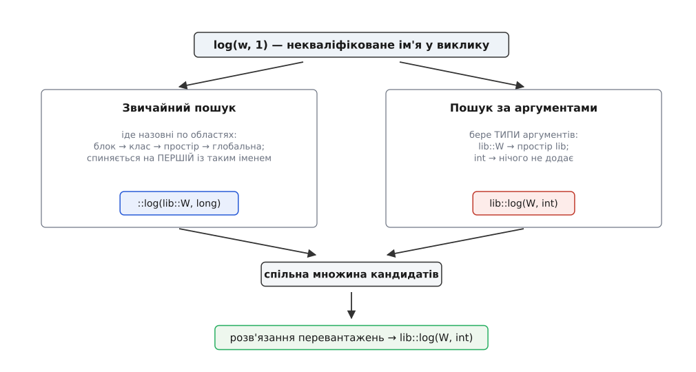
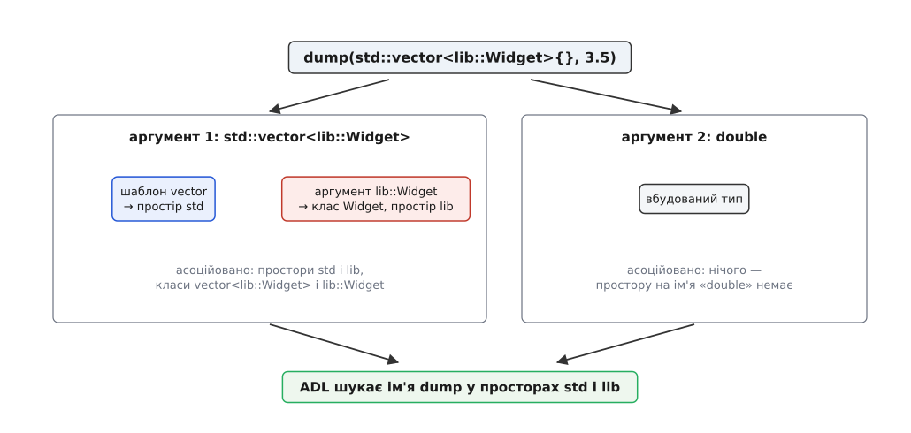

# Простори імен і пошук, залежний від аргументів

<preknowlist>
- [Одиниця трансляції та зв'язування: static, extern, inline](book:programming/translation-unit) — що компілятор бачить за один раз і як окремі одиниці зшиваються в програму за іменами символів.
- [Область видимості змінної: де ім'я має значення](book:programming/variable-scope) — вкладені області й правило «внутрішнє ім'я перекриває зовнішнє».
- [Лінкування](book:programming/linking) — чому два однакові символи в різних об'єктних файлах зупиняють складання програми.
- [Перевантаження операторів](book:programming/operator-overloading) — що `a + b` для власного типу є звичайним викликом функції, записаним інфіксно.
- [Розв'язання перевантажень: як обирається функція](book:cpp-standards/overload-resolution) — як із кількох кандидатів з однаковим іменем компілятор обирає один.
</preknowlist>

## Ім'я на всю програму

Дві незалежні бібліотеки потрапляють в один проєкт. У кожній є функція `init()` і клас `Buffer` — назви очевидні, і саме тому їх обрали обидва автори. Доки бібліотеки жили нарізно, це нікому не заважало; разом вони не збираються. Компілятор бачить два різні класи з одним іменем, компонувальник — два символи `init`. Ніхто не помилився. Проблема в тому, що імена лежать в одному спільному мішку на всю програму, і мішок тим тісніший, чим більше стороннього коду ти береш.

Роками рятувалися префіксом: `png_read_image`, `SDL_Init`, `curl_easy_perform`. Прийом працює, але це домовленість, а не механізм. Префікс приклеєний до імені назавжди — його не можна прибрати навіть там, де двозначності немає й близько; два префікси теж можуть збігтися; компілятор про них нічого не знає й нічим не допоможе. Тобто потрібне не правило іменування, а сама можливість сказати: «ці імена належать ось цьому шматку світу, і поза ним їх треба називати повністю».

## Область, у якої є ім'я

```cpp
namespace img {
    struct Buffer { /* ... */ };
    void init();
}
```

Тепер повне ім'я класу — `img::Buffer`, а `net::Buffer` із сусідньої бібліотеки є іншим ім'ям, а тому й іншим типом. Це **простір імен** (англ. *namespace*): область видимості, яку назвали, щоб на неї можна було послатися ззовні через `::`.

Кілька властивостей випливають прямо з призначення. Простір **відкритий**: його можна оголошувати шматками в різних заголовках і файлах, дописуючи в ту саму назву, — бо бібліотека природно розкладена на десятки файлів, і жоден із них не мусить знати про решту. Простори **вкладаються**, і з C++17 вкладення пишеться одним рядком: `namespace img::detail { ... }`. Довге ім'я можна скоротити псевдонімом — `namespace fs = std::filesystem;` — і це псевдонім саме області, а не типу.

Простір **імен не є класом**, і різниця тут суттєва: у нього немає ні `private`, ні примірників, ні `this`. Він нічого не ховає — він лише **розрізняє**. Вкладений `detail`, у який заведено внутрішні деталі реалізації, — це попередження читачеві, а не захист від нього.

Найважливіше для складання програми: ім'я простору стає частиною **скаліченого імені** символу (англ. *mangled name*), яке бачить компонувальник. Саме тому два `init` із двох бібліотек перестають конфліктувати не «за домовленістю», а фізично — це різні символи в об'єктному файлі. Окрема й корисна межа — **безіменний простір** `namespace { ... }`: усе в ньому має внутрішнє зв'язування й видиме лише у своїй одиниці трансляції, тобто це сучасна заміна файлового `static` — докладніше про це в [правилі одного визначення й видах зв'язування](book:cpp-standards/odr-and-linkage).

> 🔧 **Навіщо це.** Практична межа проста: один зовнішній простір на бібліотеку (`img`, а не `img_utils`, `img_codecs`, `img_io` окремо) — інакше користувач змушений писати три `using` замість одного. Усередині — вкладений `detail` для того, що ви не обіцяєте тримати сталим. Це не косметика: усе, що лежить у зовнішньому просторі, стає частиною публічного інтерфейсу, бо чужий код може на нього послатися, а ви після цього не маєте права його прибрати.

## Як компілятор шукає некваліфіковане ім'я

Коли ім'я записане повністю — `img::init()` — компілятор іде рівно в названу область і шукає лише в ній: у самому просторі, у просторах, які той у себе впустив директивою `using`, а для класу — ще й у його базах. Назовні кваліфікований пошук не виходить ніколи, і цим користуються: якщо локальне ім'я перекрило глобальне, порожній кваліфікатор `::init()` дістає саме глобальне.

Цікавим є другий випадок, некваліфікований, бо саме ним написано майже весь код.

Звичайний пошук іде **назовні по областях**: блок, у якому стоїть виклик, потім охопні блоки, потім тіло класу з його базами, потім простір, у якому цей клас оголошено, далі охопні простори — і нарешті глобальна область. Ключове правило: пошук **зупиняється на першій області, де таке ім'я взагалі оголошено**, і далі не йде. Усе, що знайдено саме там, стає множиною кандидатів; серед них уже розв'язується перевантаження.

З цього випливає наслідок, на якому спотикаються: перекриття працює **за іменем, а не за сигнатурою**.

```cpp
void draw(int);

namespace ui {
    void draw(double);
    void go() { draw(7); }   // → ui::draw(double); ::draw(int) навіть не розглядається
}
```

Всередині `ui` перше ж влучання — `ui::draw`, і глобальний `draw(int)` для цього виклику не існує, хоча підходив би точно. Це не помилка компілятора, а плата за передбачуваність: інакше додавання функції в далекий заголовок мовчки міняло б зміст давно написаного коду.

## Проблема, яку простори імен створили самі

Тепер два рядки, які пише кожен:

```cpp
std::string s = "привіт";
std::cout << s;
```

`operator<<` для рядка — не метод потоку, а **вільна функція**, оголошена в просторі `std`. Виклик записаний інфіксно, і кваліфікувати його ніде: `std::<<` не існує як синтаксис. Розгорнутий запис `std::operator<<(std::cout, s)` формально працює, але писати так кожен вивід означає викинути перевантаження операторів узагалі — а воно й було тією причиною, заради якої половина мови має теперішній вигляд.

Звичайний пошук тут безсилий. Виклик стоїть у глобальній області, у ній жодного `operator<<` для рядка немає, і назовні йти вже нікуди. Виходить розвилка з двох варіантів. Перший — скласти всі оператори в глобальну область, тобто повернутися рівно до того спільного мішка, від якого ми втекли. Другий — дозволити компіляторові подивитися **там, де живуть типи аргументів**.

Другий варіант зберігає обидві потрібні властивості одразу, і тому єдино можливий. Аргументи тут — `std::cout` і `std::string`, обидва зі `std`; функція, написана саме для них, з величезною ймовірністю лежить поруч із ними, у тому самому просторі. Отже, правило: **для некваліфікованого виклику до кандидатів додаються функції з цим іменем, оголошені в просторах, пов'язаних із типами аргументів**. Це і є **пошук, залежний від аргументів** (англ. *argument-dependent lookup*, ADL).

Історично його довго звали «пошуком Кеніга» — на честь Ендрю Кеніга, хоч сам він винахідництва не визнавав, а первісне правило стосувалося тільки операторів і лише згодом поширилося на звичайні імена функцій. [Як саме ADL з'явився й чому досі носить чуже прізвище](book:cpp-standards/namespaces-and-adl/hist-koenig-lookup.md) — окрема історія з паперами комітету.



*Некваліфіковане ім'я у виклику шукається двічі й незалежно: звичайним пошуком по охопних областях і пошуком за аргументами. Переможець обирається вже з об'єднаної множини.*

## Асоційовані сутності: де саме дивиться ADL

«Простори, пов'язані з типами аргументів» — формулювання, яке треба розгорнути точно, бо саме тут ховаються несподіванки. Для кожного аргументу виклику компілятор бере **його тип** і виводить з нього набір асоційованих класів і просторів:

- **Вбудований тип** (`int`, `double`, `char`) не дає нічого: простору імен на ім'я `int` не існує.
- **Клас, структура або об'єднання** дає сам цей клас, **усі його базові класи** та найближчі охопні простори кожного з них. Доступність баз не перевіряється — приватна база теж тягне за собою свій простір, бо пошук імені відбувається до будь-яких перевірок доступу.
- **Спеціалізація шаблону класу** додає до свого простору ще й усе, що асоційовано з **типовими аргументами шаблону**. `std::vector<lib::Widget>` дає і `std`, і `lib`.
- **Перелік (`enum`)** дає область, у якій його оголошено; **покажчик і масив** — те саме, що й тип, на який вони вказують; **тип функції** — типи її параметрів і повернення; **покажчик на член** — і клас, і тип члена.
- **Явні аргументи шаблону в самому виклику** участі не беруть: у `f<lib::Widget>(0)` простір `lib` не асоціюється — рахуються лише типи фактичних аргументів.
- З асоційованих **класів** ADL бачить лише **функції-друзі, оголошені всередині них**; функції-члени через ADL не знаходяться ніколи.



*Кожен аргумент виклику розкладається на асоційовані класи й простори; шаблонний тип тягне за собою й простори своїх типових аргументів, тому один параметр `std::vector<lib::Widget>` відкриває пошук одразу у двох просторах.*

## Дві множини й одне рішення

Обидва пошуки незалежні, а їхні результати **об'єднуються** — і вже на об'єднанні працює звичайне розв'язання перевантажень. Звідси наслідок, який варто побачити один раз на маленькому прикладі:

```cpp
namespace lib {
    struct W {};
    void log(W, int);          // знаходиться лише через ADL
}

void log(lib::W, long);        // знаходиться звичайним пошуком

int main() {
    lib::W w;
    log(w, 1);                 // → lib::log(W, int)
}
```

Звичайний пошук знаходить глобальний `log(lib::W, long)` і зупиняється. Але ADL додає `lib::log(W, int)`, бо тип першого аргументу живе в `lib`. У об'єднаній множині двоє кандидатів, і перемагає той, що не потребує перетворення `int → long`. Функція, якої ви не писали й на ім'я не згадували, виграла у вашої власної — і це нормальна, задумана поведінка, а не діра.

## Коли ADL мовчить

Рівно тому, що ADL тягне в множину сторонній код, мова дає три способи його вимкнути.

**Кваліфіковане ім'я.** `std::sort(v.begin(), v.end())` або `lib::log(w, 1)` — ви назвали область прямо, шукати більше ніде.

**Ім'я в дужках.** `(log)(w, 1)` викликає рівно те, що знайшов звичайний пошук: за правилом, ADL вмикається лише тоді, коли ім'я функції записане в позиції виклику голим ідентифікатором. Дужки цю форму руйнують — колись це знали як хитрість, тепер це прямий спосіб сказати «саме цю».

**Звичайний пошук знайшов не функцію.** Якщо `f` виявилося змінною, членом-даними, оголошенням усередині блоку або членом класу — ADL не запускається взагалі. Це найважливіший із трьох випадків, бо на ньому стоїть сучасна стандартна бібліотека: `std::ranges::sort` — не функція, а **об'єкт**. Звичайний пошук знаходить об'єкт, ADL вимикається, і жоден чужий `sort`, знайдений через аргументи, уже не перехопить виклик. Прийом має власне ім'я — [точки налаштування й CPO](book:cpp-standards/customization-points).

До цього переліку варто додати те, до чого ADL не має стосунку за визначенням. Виклик члена `x.f()` шукає `f` у класі й його базах — жодного пошуку за аргументами тут немає й бути не може, бо функцію вже названо через об'єкт. Так само мовчить ADL при виклику через покажчик на функцію: там ім'я вже перетворилося на значення. Натомість на **оператори** правило поширюється повністю — і на `<<`, і на `==`, і на `[]` чи `()` у вигляді вільних функцій; власне, заради операторів воно й з'явилося.

Одна деталь тут змінилася порівняно з давнішими стандартами. Запис `f<int>(x)`, де `f` видиме лише через ADL, раніше не компілювався: не знайшовши шаблона `f` звичайним пошуком, компілятор розбирав `<` як «менше». З C++20 таке ім'я вважається іменем шаблону, і ADL спрацьовує як для звичайного виклику.

## Ідіоми, що стоять на ADL

**Двокрок зі `swap`.** Канонічний спосіб обміняти два значення виглядає так:

```cpp
using std::swap;   // впустити стандартний як запасний варіант
swap(a, b);        // ADL знайде спеціалізований, якщо він є
```

Якщо написати `std::swap(a, b)`, ім'я стає кваліфікованим, ADL вимикається — і навіть тип, що має власний дешевий обмін, буде обміняний загальною версією через три переміщення. Двокрок дає точний зміст: «візьми свій, а як свого немає — загальний». Те саме правило й ті самі граблі докладніше розібрано в темі [обміну значеннями](book:cpp-standards/swap-operation).

**Приховані друзі.** Оператор можна оголосити прямо в тілі класу як `friend`:

```cpp
namespace lib {
class Money {
    long cents_;
public:
    explicit Money(long c) : cents_(c) {}
    friend bool  operator==(const Money& a, const Money& b) { return a.cents_ == b.cents_; }
    friend Money operator+ (const Money& a, const Money& b) { return Money{a.cents_ + b.cents_}; }
};
}
```

Така функція не є членом класу, але й **не видима звичайному пошуку** ніде: у просторі `lib` немає імені, до якого можна дотягнутися без аргументу типу `Money`. Знайти її можна тільки через ADL — тобто рівно тоді, коли хоч один аргумент і справді `Money`.

> 🔧 **Навіщо це.** Наслідок вимірюваний. Звичайний `operator==` у просторі імен потрапляє в множину кандидатів **кожного** порівняння, яке трапиться в коді, де цей простір видно, — компілятор перевіряє його на придатність знову й знову, а коли виклик усе-таки не складається, вивалює у повідомлення про помилку весь перелік. Прихований друг у ці переліки не потрапляє взагалі: його немає в множині, поки в аргументах немає `Money`. Тому в бібліотеках, де операторів десятки, це відчутно і на часі збірки, і на читабельності помилок. Побічна вигода: таку функцію неможливо викликати кваліфіковано, отже, її не «прикрутить» до себе випадковий код.

## Що ламається

**`using namespace std;` у заголовку.** Директива `using` не переносить імена до себе — вона робить так, ніби вони оголошені у **найближчому спільному охопному просторі** для неї самої й для названого простору. Для `std` у глобальній області це буквально глобальна область — і так у кожній одиниці трансляції, яка ваш заголовок підключила. Ви роздали чужі імена всім, хто вас читає, і вони про це не просили. Оголошення `using std::string;` — інша річ: воно вводить **одне** ім'я в поточну область, бере участь у перекритті й перевантаженні на загальних правах і тому цілком доречне всередині функції або власного простору.

**Дописування в `std`.** Додавати власні перевантаження до простору `std` заборонено — програма стає невизначеною, навіть якщо сьогодні збирається. Дозволено вузьке: спеціалізувати деякі шаблони бібліотеки (класичний випадок — `std::hash`) для власних типів. Правильний шлях у переважній більшості випадків інший і безкоштовний: покладіть `operator<<`, `swap`, `begin`/`end` **поруч зі своїм типом, у свій простір** — ADL знайде їх сам.

**ADL тягне зайве.** Оскільки `std::vector<lib::Widget>` асоціює і `std`, і `lib`, надто загальний шаблон у `lib` — щось на кшталт `template <class T> void print(const T&)` — стане кандидатом там, де його ніхто не чекав. Ліки прості: узагальнені допоміжні функції ховайте у вкладений `detail`, а в зовнішньому просторі лишайте те, що справді має знаходитися через аргументи.

**Шаблони шукають імена двічі.** У тілі шаблону виклик, який залежить від параметра, розв'язується не там, де шаблон написано, а там, де його інстанціювали, — і в цю другу мить працює **лише ADL**, звичайний пошук уже не повторюється. Тому допоміжна функція, оголошена після шаблону й видима в точці інстанціювання, знайдена не буде, якщо вона не лежить у просторі аргументу. Механіка цього розділення розібрана в темі [двофазного пошуку імен](book:cpp-standards/two-phase-name-lookup); практичний висновок один — усе, що шаблон має знаходити для чужого типу, шукайте через ADL і кладіть відповідно.

Дрібні, але дошкульні випадки цих правил — від «чому мій `operator<<` не знаходиться» до «чому раптом викликалася не та функція» — зібрано разом із кодом, який їх відтворює, у [лабораторії пошуку імен](book:cpp-standards/namespaces-and-adl/proj-adl-lab.md).

## Вбудовані простори: версія, якої не видно

Останній шматок конструкції розв'язує задачу, що виглядає протилежною: як **не** розрізняти імена в коді, але розрізняти їх у бінарнику.

```cpp
namespace lib {
    inline namespace v2 { struct Codec { /* ... */ }; }
    namespace v1        { struct Codec { /* ... */ }; }
}
```

Слово `inline` робить вкладений простір прозорим для пошуку: `lib::Codec` означає `lib::v2::Codec`, ADL проходить крізь нього так, ніби імена лежать прямо в `lib`. Але скалічене ім'я символу зберігає `v2` — тобто для компонувальника це різні сутності.

Саме так живе подвійний ABI стандартних бібліотек: у libstdc++ рядки й списки нового зразка лежать у вбудованому просторі `std::__cxx11`, у libc++ уся бібліотека загорнута у `std::__1`. Джерельний код цього не бачить; зате об'єктні файли, зібрані з різними налаштуваннями, дають чесну помилку компонування замість тихого руйнування пам'яті при виклику. [Чим саме ламається сумісність ABI](book:cpp-standards/abi-stability-cpp) — окрема велика тема, але механізм її відстеження — ось цей.

З усього разом виходить один висновок, що змінює звичку писати код: **місце функції — частина її інтерфейсу**. Простір імен не полиця, куди складають готове; це оголошення того, з яких аргументів цю функцію дозволено знайти. Тому питання «у який простір це покласти» вирішується не за смаком і не за темою файлу, а за тим, хто й через що має цю функцію знаходити.
