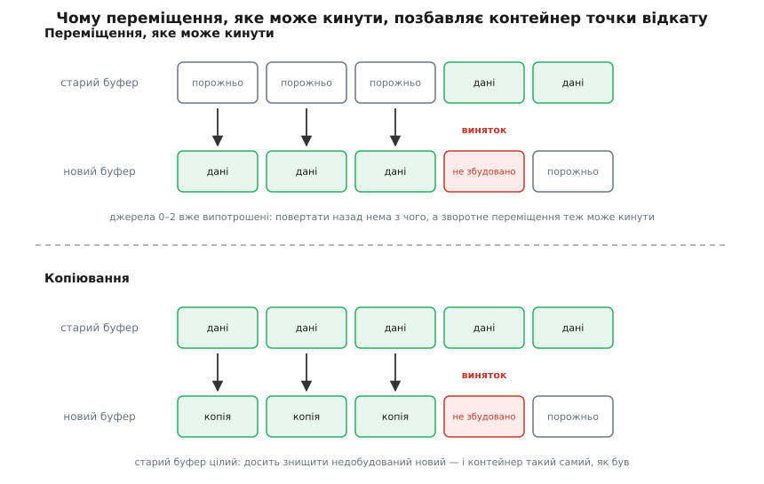
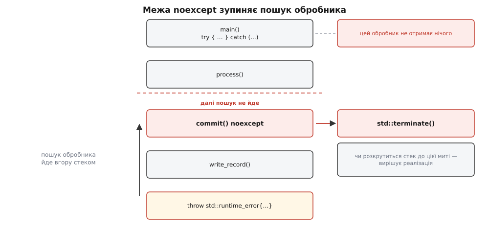
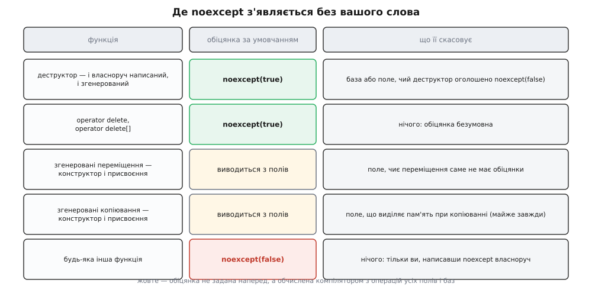

# noexcept: обіцянка й наслідки

<preknowlist>
- [Винятки: кидання, розкрутка стека, перехоплення](topic:cpp-standards/exceptions-mechanism) — як `throw` шукає обробник угору стеком і що при цьому руйнується дорогою.
- [Гарантії безпеки винятків: базова, сильна, nothrow](topic:cpp-standards/exception-safety-guarantees) — три рівні обіцянок про стан об'єкта після невдалої операції.
- [Семантика переміщення і rvalue-посилання](topic:cpp-standards/move-semantics) — забирання нутрощів у приреченого джерела замість копіювання.
- [RAII: ресурс прив'язаний до часу життя](topic:programming/raii) — деструктор звільняє ресурс рівно один раз, і саме на цьому тримається прибирання під час розкрутки.
- [Інваріант програми](topic:programming/invariants) — твердження, істинне в певних точках; його порушення означає, що модель програми розійшлася з дійсністю.
- [Шаблони: параметризація типом](topic:cpp-standards/templates-basics) — тіло пишеться тоді, коли тип ще невідомий.
</preknowlist>

## Питання, на яке нікому було відповісти

`std::vector` вичерпав місткість і мусить переїхати в більший буфер. Він виділяє нову ділянку і переносить туди п'ять елементів по одному. Перенесення третього кидає виняток.

Погляньмо, де в цю мить опинився контейнер. Якщо елементи **переміщували**, то нулевий, перший і другий у старому буфері вже випотрошені — їхні внутрішні вказівники забрали собі новостворені копії. У новому буфері збудовано три елементи з п'яти. Жоден із двох буферів не є правильним вектором: у старому бракує трьох значень, у новому — двох.

Виходу з цього стану немає. Щоб відновити старий буфер, треба перемістити три елементи назад — а зворотне переміщення так само може кинути, і тоді ми застрягнемо посеред відкату. Тому контейнер, який переміщує елементи операцією, здатною кинути, не може обіцяти, що після невдачі все лишиться як було.

Тепер замініть переміщення на **копіювання**. Копіювання не чіпає джерела: старий буфер лишається цілим до останнього байта. Виняток на третьому елементі означає лише «зруйнувати недобудований новий буфер і повернути пам'ять» — і вектор такий самий, яким був до спроби зрости.



*Ціна швидкого переїзду — знищена точка відкату: після перемішування половини елементів повертатися нема куди.*

Отже, для кожного типу елемента бібліотека стоїть перед розвилкою. Якщо переміщення цього типу **не може кинути** — переміщувати безпечно: виняток посеред циклу просто неможливий, і питання відкату не виникає. Якщо може — треба копіювати: повільно, зате старий буфер лишається точкою відкату.

Розвилку треба розв'язати **на етапі компіляції** (у машинному коді не має бути жодної перевірки) і **окремо для кожного типу елемента** — бо для `int` відповідь одна, для класу з власним буфером інша, а для чужого типу з незнайомої бібліотеки третя. Тобто бібліотеці потрібен спосіб **запитати в типу**: «твоє переміщення може кинути?»

До C++11 такого способу не існувало. Автор класу міг знати відповідь напевно, але в мові не було місця, куди її записати так, щоб інший код це прочитав. Була конструкція `throw()`, яка виглядала як відповідь, — і саме тому корисно знати, чому вона нею не була: [Як мова двічі намагалася описати винятки в сигнатурі](topic:cpp-standards/noexcept/hist-exception-specifications.md) розповідає про динамічні специфікації `throw(A, B)`, про перевірку в час виконання й `std::unexpected`, про перевірювані винятки Java як зразок і про те, за що комітет викреслив усе це з мови.

Коротко: `throw(A, B)` описувало **множину** типів, перевірялося **в час виконання** і коштувало зайвого коду — а бібліотеці треба було **двійкову** відповідь, доступну **в час компіляції** і безкоштовну в час виконання. Із цих трьох вимог і виросло `noexcept`: слово, яким функція оголошує двійкову обіцянку, і однойменний оператор, яким цю обіцянку читає інший код.

## Що саме обіцяє слово

```cpp
void commit() noexcept;
```

Обіцянка звучить так: **з цієї функції виняток не вийде назовні**. Не «всередині немає `throw`» і не «всередині не викликається нічого небезпечного» — а саме про межу.

Різниця не формальна. Ось абсолютно законна `noexcept`-функція:

```cpp
int parse_port(const std::string& s) noexcept {
    try {
        return std::stoi(s);          // stoi кидає при поганому вводі
    } catch (const std::exception&) {
        return -1;                    // виняток не перетнув межу — обіцянку дотримано
    }
}
```

Усередині виняток і кидається, і летить, і перехоплюється. Обіцянка стосується лише того, що перетинає межу функції назовні, — і тут не перетинає нічого.

Є й розгорнута форма з умовою:

```cpp
void f() noexcept(true);    // те саме, що просто noexcept
void g() noexcept(false);   // те саме, що нічого не написати
void h();                   // обіцянки немає — типове для функції умовчання
```

У дужках стоїть **константний булевий вираз**, обчислений на етапі компіляції. Порожнє `noexcept` — скорочення для `noexcept(true)`. Дужки тут не прикраса: у шаблоні обіцянка часто мусить залежати від типу, і без обчислюваного виразу її просто не було б чим записати.

## Ніхто цієї обіцянки не перевіряє

Найважливіше, що варто знати про `noexcept`, — це те, чого воно **не** робить. Компілятор не доводить, що функція справді безпечна. Ось код, який компілюється:

```cpp
void save(const Record& r) noexcept {
    std::string key = build_key(r);   // виділяє пам'ять — може кинути bad_alloc
    db_insert(key, r);                // чужа функція, обіцянки не давала
}
```

Жодної помилки. Компілятор бачить, що `build_key` і `db_insert` можуть кинути, — і все одно приймає `noexcept` на слово. Багато компіляторів попереджають (GCC і Clang — `-Wexceptions`, MSVC — попередження C4297), але лише там, де небезпека видна прямо в тілі; за викликом чужої функції ніхто не піде.

Чому мова не перевіряє? Бо чесна перевірка вимагала б знати **весь граф викликів**, а він недоступний: функція з іншої одиниці трансляції відома лише за оголошенням; віртуальний виклик розв'язується в час виконання; вказівник на функцію може вказувати куди завгодно. Щоб перевірка була можливою, довелося б вимагати обіцянку **від кожної функції в програмі** — тобто зробити її частиною сигнатури всюди, включно з чужими бібліотеками. Мова, що пішла цим шляхом, — Java з її перевірюваними винятками; C++ уже пробував щось подібне з `throw(A, B)` і відступив.

Тож `noexcept` — не перевірка, а **твердження програміста**. Такі твердження в C++ не рідкість: `const_cast`, `reinterpret_cast`, `[[assume]]` теж покладаються на слово людини. Особливість `noexcept` у тому, наскільки дорого коштує це слово порушити.

## Ціна порушення

Коли виняток таки намагається вийти за межу `noexcept`-функції, пошук обробника **зупиняється на цій межі**. Викликається `std::terminate`, який за умовчанням завершує процес через `std::abort`.



*Обробник вище по стеку не отримає нічого: рішення ухвалюється в тій рамці, де стоїть обіцянка, а не там, де стоїть `catch`.*

Дві деталі цієї картини помітно впливають на практику.

**Ніякий `catch` не рятує.** Навіть `catch (...)` навколо всього `main` не спрацює, бо пошук обробника до нього не дійде. Це принципово відрізняє порушення `noexcept` від звичайного винятку: звичайний можна перехопити де завгодно вище, порушену обіцянку — ніде.

**Стан пам'яті на момент завершення не визначений.** Стандарт лишає реалізації свободу: стек до межі `noexcept` може бути розкручений повністю, частково або не розкручений зовсім. Тому деструктори локальних об'єктів між точкою `throw` і межею обіцянки **можуть і не виконатися** — GCC і Clang поводяться тут по-різному, і покладатися на прибирання не можна. Практичний висновок: `noexcept`-функція не має тримати ресурсів, які мусить звільнити хтось інший, — на аварійному шляху їх ніхто не звільнить.

Різкість покарання зумисна. Обіцянка `noexcept` — це записаний у коді інваріант; порушений інваріант означає, що уявлення програми про себе розійшлося з дійсністю, і кожна наступна дія робиться наосліп. Мова обирає те саме, що обирає [assert](topic:programming/assert-panic): падати одразу й гучно, а не тягнути пошкоджений стан далі.

> 🔧 **Навіщо це.** З цього випливає єдине практичне правило вибору. Питати треба не «чи швидше буде з `noexcept`», а «чи згоден я, щоб програма вмерла тут, якщо я помилився». Для конструктора переміщення, який лише переписує вказівники, відповідь очевидна — там нема чому кидати. Для функції, що виділяє пам'ять, парсить ввід або йде в мережу, відповідь так само очевидна, тільки протилежна.

## Хто виграє від обіцянки

Обіцянка має сенс лише тому, що хтось нею користується. Користувачів двоє, і виграш у них дуже різного розміру.

**Компілятор** виграє небагато. У сучасному, табличному механізмі винятків звичайний шлях виконання вже нічого не платить: жодних прапорців і реєстрацій у час виконання немає, вся інформація для розкрутки лежить в окремих таблицях (докладніше — [розмотування стека: frame pointer і DWARF](topic:programming/stack-walking)). `noexcept` дозволяє прибрати самі ці таблиці й код прибирання для тіла функції — бінарник меншає, регістри звільняються, [оптимізаціям](topic:programming/compiler-optimizations) простіше вбудовувати виклик у місце вживання.

Але тут же ховається зворотний бік. Якщо тіло `noexcept`-функції **саме здатне кинути**, компілятор мусить **додати** обробник, який ловить усе й викликає `terminate`. Тобто `noexcept`, поставлене на функцію з викликами, що кидають, не робить код швидшим — воно додає йому шматок коду, який ніколи не мав би виконатися. Це ще один аргумент проти звички «ставити `noexcept` скрізь для швидкості».

**Стандартна бібліотека** виграє незрівнянно більше — і саме заради неї конструкцію придумали. Бібліотека не просто економить кілька інструкцій: вона **обирає інший алгоритм**. Той самий `vector`, з якого ми почали, дивиться на обіцянку типу й вирішує, переїжджати переміщенням чи копіюванням. Різниця між двома шляхами — не відсотки, а порядки на великих елементах.

## Оператор `noexcept`: як обіцянку прочитати

Щоб бібліотека могла запитати, потрібен другий бік конструкції — **оператор** `noexcept(вираз)`. Він дає `bool` на етапі компіляції: чи оголошено все, що робить цей вираз, як таке, що не кидає.

```cpp
void a() noexcept;
void b();

static_assert(noexcept(a()));       // true
static_assert(!noexcept(b()));      // false

std::string s;
static_assert(noexcept(s.size()));  // true: size() оголошено noexcept
static_assert(!noexcept(s + s));    // false: конкатенація виділяє пам'ять
```

Дві властивості оператора варто тримати в голові.

**Операнд не обчислюється.** `noexcept(f())` не викликає `f` — вираз потрібен лише для того, щоб компілятор подивився на його тип і на обіцянки задіяних функцій. Тому всередину можна безпечно писати `noexcept(std::declval<T>().resize(0))`, не маючи жодного справжнього об'єкта.

**Він читає оголошення, а не дійсність.** Функція, яка фізично не може кинути, але не позначена, дасть `false`:

```cpp
int add(int x, int y) { return x + y; }   // кинути тут нема чому
static_assert(!noexcept(add(1, 2)));      // однак — false
```

Це не вада, а прямий наслідок того, що обіцянка є заявою, а не висновком. Звідси й практичне: якщо ваш тип не позначений, бібліотека вважатиме його небезпечним і поводитиметься з ним обережно та повільно — навіть якщо ви точно знаєте, що небезпеки немає.

Однакове написання специфікації й оператора спершу плутає, але правило просте: **після сигнатури функції** `noexcept(…)` — специфікація й у дужках очікує `bool`; **у виразі** — оператор і в дужках очікує код, про який питають.

## Умовна обіцянка: коли відповідь залежить від типу

Ось де дужки специфікації стають необхідними. Напишімо обгортку, що зберігає значення й уміє мінятися вмістом з іншою такою ж:

```cpp
template <class T>
class Box {
    T value_;
public:
    void swap(Box& other);
};
```

Чи може `Box<T>::swap` дати обіцянку? Відповіді немає, доки невідомо `T`. Для `Box<int>` обмін — це два присвоєння, кинути нема чому. Для `Box<SomeType>`, чиє переміщення виділяє пам'ять, — може. Один шаблон породжує обидва випадки, і обіцянка мусить породжуватися разом із ними.

Саме для цього специфікація приймає вираз:

```cpp
template <class T>
void Box<T>::swap(Box& other)
    noexcept(std::is_nothrow_swappable_v<T>)
{
    using std::swap;
    swap(value_, other.value_);
}
```

Тепер `Box<int>::swap` виходить `noexcept`, а `Box<SomeType>::swap` — ні, і кожне інстанціювання несе правдиву обіцянку. Риса `is_nothrow_swappable_v` — одна з родини рис, що відповідають на такі питання (`is_nothrow_move_constructible_v`, `is_nothrow_destructible_v` і подібні); усі вони збудовані на тому самому операторі й описані серед [рис типів](topic:cpp-standards/type-traits).

Часто зручніше не шукати готової риси, а спитати прямо про той вираз, який ви збираєтеся виконати:

```cpp
template <class T>
auto forward_call(T&& x) noexcept(noexcept(process(std::forward<T>(x))))
    -> decltype(process(std::forward<T>(x)))
{
    return process(std::forward<T>(x));
}
```

Подвійне `noexcept(noexcept(…))` виглядає незграбно, але читається однозначно: зовнішнє — специфікація, внутрішнє — оператор. Дослівно: «ця функція не кидає рівно настільки, наскільки не кидає ось цей виклик». Обіцянка передається далі автоматично, як і сам аргумент при [ідеальному передаванні](topic:cpp-standards/perfect-forwarding), — і жодну з них не треба підтримувати руками, коли `T` зміниться.

## Контракт із бібліотекою: чому переміщення варте обіцянки

Повернімося до розвилки, з якої почалася тема, і подивімося, як бібліотека її розв'язує.

Перерозподіляючи буфер, `vector` не пише `std::move(elem)`. Він пише `std::move_if_noexcept(elem)` — функцію, яка дивиться на дві риси типу й повертає або rvalue (можна переміщувати), або константне lvalue-посилання (доведеться копіювати). Правило таке: переміщувати дозволено, якщо переміщення обіцяне безпечним **або** якщо тип узагалі не копіюється.

```cpp
// суть std::move_if_noexcept
template <class T>
constexpr std::conditional_t<
    !std::is_nothrow_move_constructible_v<T> && std::is_copy_constructible_v<T>,
    const T&, T&&>
move_if_noexcept(T& x) noexcept { return std::move(x); }
```

Друга умова важлива й часто дивує. Якщо тип **не має** конструктора копіювання, вибору в бібліотеки немає: вона переміщує навіть без обіцянки — і сильна гарантія при цьому знижується до базової. Тобто «мій тип лише переміщуваний» не рятує від проблеми, а лише прибирає можливість її обійти.

Наслідок для автора класу виходить різкий. Ось два класи, що відрізняються одним словом:

```cpp
class Slow {                              // без обіцянки
    std::vector<double> data_;
public:
    Slow(Slow&& o) : data_(std::move(o.data_)) {}
    Slow(const Slow&) = default;
};

class Fast {                              // з обіцянкою
    std::vector<double> data_;
public:
    Fast(Fast&& o) noexcept : data_(std::move(o.data_)) {}
    Fast(const Fast&) = default;
};
```

Тіла конструкторів переміщення однакові — обидва лише переставляють вказівники всередині `vector` і не звертаються до купи. Але `std::vector<Slow>`, доростаючи до мільйона елементів, **копіюватиме** кожен елемент при кожному перерозподілі, тобто виділятиме мільйон нових масивів `double` і переписуватиме їхній вміст, тоді як `std::vector<Fast>` обійдеться переписуванням вказівників.

**Скільки саме це коштує.** Вимірювання на конкретних числах — скільки викликів копіювання й переміщення робить `vector`, як росте час зростання контейнера, і що змінюється, коли додати одне слово: [ціна одного слова: вимір зростання vector](topic:cpp-standards/noexcept/proj-noexcept-vector-growth.md). Там же — лічильники операцій, які дозволяють перевірити поведінку своєї стандартної бібліотеки, і випадок типу без копіювання.

Ця історія пояснює, чому в C++ склалася звичка позначати конструктор переміщення й переміщувальне присвоєння `noexcept` мало не рефлекторно. Звичка не зайва: [правило п'яти](topic:cpp-standards/rule-of-five-zero) і вибір [контейнера під задачу](topic:cpp-standards/stl-containers-choice) працюють на повну лише тоді, коли типи чесно оголосили свої обіцянки.

## Де `noexcept` з'являється без вашого слова

Частина обіцянок у програмі стоїть уже зараз, хоч ви їх не писали.



*Жовтий рядок означає, що обіцянка не задана наперед, а обчислена компілятором з операцій усіх полів і баз.*

**Деструктори.** Від C++11 деструктор має неявну специфікацію `noexcept(true)` — і той, що згенерував компілятор, і той, що ви написали самі без жодної позначки. Скасувати це можна лише явним `noexcept(false)` або наявністю бази чи поля, чий деструктор оголошений таким, що кидає.

Це рішення лише зробило явним те, що й так було правдою. Розкрутка стека виконує деструктори локальних об'єктів; якщо деструктор кине під час розкрутки, у польоті опиниться другий виняток при живому першому — і мова однаково викличе `terminate`. Тобто деструктор, що кидає, був смертельним і до C++11; неявне `noexcept` просто перенесло смерть на перший же випадок, замість чекати, поки збіжаться обставини.

**Функції звільнення пам'яті.** `operator delete` і `operator delete[]` теж неявно `noexcept` — з тієї самої причини: звільнення викликається під час розкрутки.

**Згенеровані спеціальні функції-члени.** Тут обіцянка не задана наперед, а **обчислена**: компілятор дивиться на відповідні операції всіх баз і нестатичних полів і складає з них результат. Структура з кількох `int` дістає `noexcept`-переміщення й `noexcept`-копіювання даром. Структура з полем `std::string` дістає `noexcept`-переміщення (переміщення рядка обіцяне) — але не `noexcept`-копіювання (копія рядка виділяє пам'ять). Одне поле, чиє переміщення обіцянки не має, псує обіцянку всієї структури.

> 🔧 **Навіщо це.** Звідси випливає найдешевший спосіб отримати швидкі типи: не писати спеціальних функцій узагалі. Клас, зібраний із полів, які самі поводяться правильно, дістає всі п'ять операцій із правильними обіцянками автоматично — це і є [правило нуля](topic:cpp-standards/rule-of-five-zero) з боку винятків. Щойно ви напишете конструктор переміщення власноруч, відповідальність за слово `noexcept` переходить до вас, і забути його дуже легко.

## Частина типу — від C++17

До C++17 специфікація винятків жила осторонь системи типів: `void()` і `void() noexcept` вважалися одним типом, а обмеження діяли лише на присвоєння вказівників, і то з дірками. Папір P0012R1 зробив специфікацію **частиною типу функції**.

Практично це означає три речі.

**Перетворення вказівників іде лише в один бік.**

```cpp
void safe() noexcept;
void risky();

void (*p1)()          = safe;    // ок: обіцянку можна забути
void (*p2)() noexcept = risky;   // помилка: обіцянку не можна вигадати
```

Напрямок обраний правильно й очевидно: послабити обіцянку безпечно (той, хто чекав «може кинути», готовий до всього), а посилити — ні. Ця асиметрія тепер перевіряється компілятором, а не лишається на совісті програміста.

**Перевизначення віртуальної функції не має права послабити обіцянку.** Якщо базовий клас оголосив метод `noexcept`, похідний мусить лишити його таким. Інакше зруйнувалася б сама суть [динамічного зв'язування](topic:programming/polymorphism): викликач, що бачить лише базовий інтерфейс, покладається на його обіцянку, а виконуватиметься тіло похідного.

**Перевантажити за обіцянкою все одно не можна.** Специфікація входить у **тип** функції, але не в її **сигнатуру**, тож пара оголошень `int baz();` і `int baz() noexcept;` — помилка, а не два перевантаження. Різниця тонка, але послідовна: типом можна відрізняти вказівники й спеціалізації шаблонів, а вибір перевантаження лишається таким, як був.

Зауважмо мимохідь: оскільки специфікація стала частиною типу, зміна `noexcept` у публічному оголошенні тепер здатна змінити й типи вказівників, і вибір спеціалізацій — тобто це ще одна річ, що впливає на [стабільність ABI](topic:cpp-standards/abi-stability-cpp).

## Що з `throw()`

Стара форма `throw()` дожила до наших днів як синонім `noexcept(true)`: динамічні специфікації з переліком типів прибрали в C++17, а порожню лишили ще на один цикл, застарілою. У C++20 прибрали й її. Якщо в старому коді трапляється `throw()`, його заміна на `noexcept` — механічна й безпечна; заміна `throw(std::bad_alloc)` вимагає рішення людини, бо перелік типів більше не має куди подітися.

## Де ставити, а де не ставити

Правила зводяться до одного питання — «чи готовий я, щоб тут програма померла» — але корисно розписати наслідки.

**Ставити варто там, де обіцянку хтось питає:** конструктор і присвоєння переміщенням, `swap`, деструктор (там воно й так стоїть, явний запис — для читача), функції обміну й переставляння вказівників. Це саме ті операції, за якими бібліотека обирає алгоритм.

**Ставити доречно й там, де обіцянка беззаперечно правдива й дешева:** прості спостерігачі на кшталт `size()`, `empty()`, `data()`, доступ до поля, порівняння тривіальних даних, конструктор за умовчанням типу без ресурсів.

**Не ставити ніколи** на функцію, що виділяє пам'ять, будує рядок, парсить ввід, працює з файлом чи мережею, викликає чужий код невідомої природи або приймає користувацький колбек. Кожен із цих пунктів — джерело винятку, і `noexcept` перетворить звичайну помилку на зупинку процесу.

**Обіцянку не можна тихо відкликати.** Прибрати `noexcept` із опублікованого оголошення — ламка зміна: у викликачів могли стояти умовні специфікації, обчислені з вашої, могли зберігатися вказівники відповідного типу, могли бути обрані спеціалізації. Тому обіцянку дають один раз і назавжди — і саме тому її не варто роздавати щедро.

**Обіцянка не вимірюється, а обґрунтовується.** Побачити, що функція насправді кидає всупереч написаному, [статичний аналіз](topic:programming/static-analysis) допоможе лише почасти — за межу одиниці трансляції він рідко бачить далі. Основна перевірка тут — доведення в голові автора: перелічити все, що функція викликає, і переконатися, що кожен пункт або сам обіцяв, або фізично не має чим кинути.

Прикметно, чим ця конструкція виявилася в підсумку. Спроба описати винятки в сигнатурі повно — з переліком типів і перевіркою — провалилася двічі. Вціліло рівно те, що можна прочитати одним питанням і використати одним `if` на етапі компіляції. Коментар «ця функція не кидає» був у чужих заголовках завжди; `noexcept` — це той рідкісний випадок, коли коментар перетворили на конструкцію, за якою машина справді щось робить інакше.
