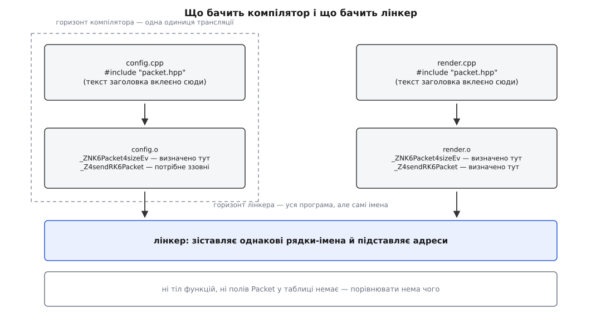
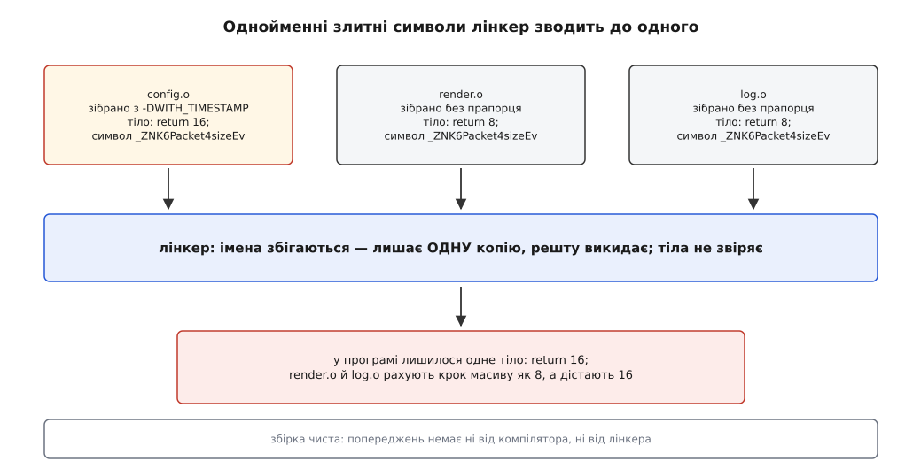
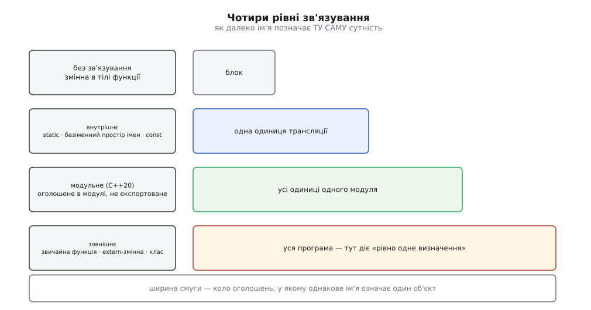

# Правило одного визначення й зв'язування імен

<preknowlist>
- [Компіляція](book:programming/compilation) — переклад тексту програми в машинний код; кожен `.cpp` компілятор обробляє окремим незалежним запуском.
- [Лінкування](book:programming/linking) — зшивання об'єктних файлів в одну програму за таблицею імен-символів.
- [Одиниця трансляції та зв'язування: static, extern, inline](book:programming/translation-unit) — що саме потрапляє в один прохід компілятора після підстановки заголовків.
- [Препроцесор і макроси](book:programming/preprocessor-macros) — `#include` вставляє текст заголовка дослівно, а `#ifdef` здатен змінити цей текст залежно від прапорців збірки.
- [Шаблони: параметризація типом](book:cpp-standards/templates-basics) — з одного тексту шаблону постає окремий код для кожного вжитого типу.
</preknowlist>

Опишіть у заголовку клас і вкладіть той заголовок у сорок файлів — збірка пройде. Напишіть у тому самому заголовку звичайну функцію на три рядки — і вже другий файл, що вкладе цей заголовок, зупинить збірку словами `multiple definition of send(Packet const&)`. Текст в обох випадках повторюється однаково: він фізично існує в сорока копіях. Різна лише реакція.

Ця різниця — не примха й не історична випадковість. Вона просто виводиться з того, хто в конвеєрі C++ що бачить.

## Двоє, і жоден не бачить усього

Компілятор запускають окремо на кожен `.cpp`. Перед його очима — файл, у який препроцесор уже вклеїв текст усіх заголовків; це і є **одиниця трансляції**. Сусідній `.cpp` тієї самої програми компілятор не читає ніколи: не тому, що не хоче, а тому, що роздільна компіляція саме на цьому й тримається — змінили один файл, перезібрали один файл.

На виході — об'єктний файл: машинний код плюс таблиця **символів** (лат. *symbolum* — умовний знак). Символ — це рядок-ім'я, з ним пов'язана адреса всередині файла (тут визначено) або позначка «потрібне ззовні» (тут лише вжито). Тіла функцій у таблиці немає, типів у ній немає, полів класу теж — самі імена, розміри й байти коду.

Лінкер бере набір таких таблиць і робить механічну роботу: для кожного «потрібне ззовні» знаходить однойменне «визначено тут» і підставляє адресу. Він не парсер C++ і не має жодного уявлення, що таке `Packet`.



*Ніхто в конвеєрі не тримає перед очима обидві одиниці трансляції одночасно: одному видно текст, але лише свій, другому видно всю програму, але лише як список імен.*

Тепер поставмо просте питання: чи означає `Packet` те саме в `config.cpp` і в `render.cpp`? Компілятор відповісти не може — він бачить один файл. Лінкер не може — у нього немає типів. Відповісти нема кому.

Мова мала тут дві дороги. Перша — вимагати від інструментів звіряти все з усім; тоді компіляція одного файла потребувала б читання решти, і роздільна компіляція зникла б. Друга — залишити відповідальність за узгодженість на програмістові, а від інструментів вимагати рівно того, що вони справді можуть перевірити. C++ пішов другою дорогою, і вимога до програміста, записана в стандарті, зветься **правилом одного визначення** (англ. *one definition rule*, ODR).

## Оголошення проти визначення

Правило говорить про визначення, тож спершу межа між ним і оголошенням.

**Оголошення** повідомляє, що така сутність існує і як вона виглядає: `int send(const Packet&);`. Цього досить, щоб компілятор перевірив виклик, порахував типи аргументів і залишив у об'єктному файлі запис «потрібне ззовні». **Визначення** дає тіло або пам'ять: власне код функції, власне байти змінної. Оголошень одного імені може бути скільки завгодно — вони лише повторюють ту саму обіцянку.

Звідси перші дві частини правила, і обидві очевидні до нудьги:

- в одній одиниці трансляції не більше одного визначення будь-якої сутності;
- у всій програмі — не більше одного визначення кожної не-`inline` функції та змінної, і щонайменше одне визначення для кожної, яку програма справді вживає.

Перше перевіряє компілятор і сварить одразу. Друге частково перевіряє лінкер: два однакові символи — `multiple definition`, жодного — `undefined reference`. З цієї пари й народжується звична дисципліна «оголошення в заголовку, визначення в `.cpp`».

## Що означає «вжите»

Слово «вживає» в другому пункті означає не «згадує в тексті», а дещо вужче — і саме тут ховається помилка, на яку натикаються всі. Стандарт називає це **odr-use**: змінна вжита так, що без справжнього об'єкта в пам'яті не обійтися. Взяти адресу, прив'язати посилання — вжито. А от прочитати значення сталої, яке компілятор і так знає на етапі компіляції, — не вжито: він підставить число прямо в код, і жодного об'єкта не знадобиться.

**Умова: стала-член класу, оголошена в заголовку, потрапляє у виклик `std::min`.**

```cpp
// limits.hpp
struct Limits {
    static constexpr int max_users = 128;   // оголошення і водночас ініціалізатор
};

// session.cpp
#include <algorithm>
#include "limits.hpp"

int clamp_users(int n) {
    if (n <= Limits::max_users)             // просто читаємо значення — не odr-use
        return n;
    return std::min(n, Limits::max_users);  // параметр std::min — const int&
}
```

`std::min` приймає аргументи через `const int&`. Прив'язати посилання можна лише до чогось, що має адресу, — отже, десь у програмі мусить лежати справжній об'єкт `Limits::max_users`. До C++17 запис у класі був **оголошенням**, а не визначенням: об'єкт треба було створити окремим рядком у якомусь `.cpp`:

```cpp
// limits.cpp — обов'язково до C++17
constexpr int Limits::max_users;
```

Без цього рядка перший виклик `std::min` давав `undefined reference to 'Limits::max_users'` — при тому, що сусідній рядок із простим читанням значення збирався роками й не вимагав нічого. C++17 закрив пастку: статичний `constexpr`-член класу став неявно `inline`, тобто оголошення в класі тепер саме є визначенням, а окремий рядок став зайвим повторенням (і його оголосили застарілим).

> 🔧 **Навіщо це.** Помилка «undefined reference на сталу, яку видно просто в заголовку» виникає не тоді, коли ви пишете сталу, а тоді, коли хтось інший уперше передає її у функцію з параметром-посиланням — часто через рік і в чужому модулі. Побачивши таке в коді, зібраному за старішим стандартом, шукайте не одруківку в імені, а відсутнє позакласове визначення.

## Те, що мусить повторюватися

Дисципліна «визначення в `.cpp`» розсипається на першому ж класі. Щоб скомпілювати `Packet p; p.size();`, компіляторові потрібен повний опис `Packet` — розмір, поля, тіла вбудованих методів. Опис мусить бути в **кожній** одиниці трансляції, яка з цим типом працює, тобто мусить лежати в заголовку й повторюватися сорок разів. Те саме зі шаблонами: код для `vector<Packet>` можна породити лише там, де відомі і шаблон, і тип.

Тому правило має третю частину — дозвільну. Клас, перелічення, `inline`-функція, `inline`-змінна й будь-яка шаблонна сутність можуть мати по одному визначенню в кожній одиниці трансляції. Але з умовою, і умова сформульована навмисне грубо: усі ці визначення мусять складатися **з тієї самої послідовності лексем**, а імена в них — після пошуку й розв'язання перевантажень — мусять позначати **ті самі сутності**.

Вимога дивна лише на перший погляд. «Однакові за змістом» ніхто не зміг би перевірити, а «однакова послідовність лексем» — це просто інший спосіб сказати «усі копії прийшли з одного тексту заголовка й читалися в однаковому оточенні». Саме так воно й буває, коли заголовок один і збирають його однаково.

Порушити цю умову можна двома способами, і обидва трапляються частіше, ніж хочеться. Перший — **різний текст**: макрос або прапорець збірки змінив тіло заголовка для частини файлів. Другий — **однаковий текст із різним значенням**: ім'я всередині копії розв'язалося в різні сутності, бо в різних одиницях трансляції видно різні перевантаження або різні локальні об'єкти.

Наслідок порушення стандарт формулює безжально: програма хибна, **діагностика не вимагається**. Тобто ніхто нікому нічого не винен: ні компілятор, ні лінкер не зобов'язані сказати ані слова.

## Чому ніхто й не свариться

Щоб зрозуміти цю мовчанку, треба подивитися, що робить компілятор із `inline`-функцією. Він не знає, хто ще її потребуватиме, тож просто кладе її тіло у **свій** об'єктний файл — але позначає символ як придатний до злиття (у ELF це слабкий символ у власній секції-COMDAT). Лінкер, побачивши сорок однойменних злитних символів, лишає один, а решту викидає. Це не оптимізація й не хитрощі — це єдина машинерія, завдяки якій заголовки взагалі працюють.

Порівнює він при цьому лише імена. Ім'я символу для функції несе не тільки її назву, а й закодовану сигнатуру — тому перевантаження не плутаються між собою; як саме сигнатура втискається в рядок, розбирає [Спотворення імен: як символ несе сигнатуру](book:cpp-standards/name-mangling), а сам механізм злиття однойменних визначень — [Слабкі символи](book:programming/weak-symbols). Головне тут одне: тіло за іменем ніхто не звіряє.

Отже, якщо два тіла під одним іменем **різні**, лінкер поводиться точно так само: лишає перше-ліпше, решту викидає. Мовчки.

```cpp
// packet.hpp
struct Packet {
    int id;
#ifdef WITH_TIMESTAMP
    long long ts;
#endif
    int size() const { return sizeof(Packet); }   // inline: копія в кожній одиниці
};
```

Зберіть `config.cpp` із `-DWITH_TIMESTAMP`, а `render.cpp` — без нього. Виходить два різні типи `Packet` (16 байтів із полем `ts` проти 8 без нього) і два різні тіла `Packet::size` під одним символом. Лінкер лишить одне з них — і обидва файли викликатимуть саме його. Гірше: масив, заповнений кодом із `config.cpp`, читатиметься кодом із `render.cpp` із іншим кроком між елементами. Збірка чиста, попереджень нуль, а падіння приходить за півгодини роботи й в іншому місці.



*Механізм, який дає заголовкам працювати, тим самим рухом ковтає розбіжність: обирається копія, а не істина.*

Зібрати таку програму, побачити її поведінку на власні очі й піймати порушення інструментами — окрема робота, розписана в [Зламати ODR навмисне і зловити злам інструментами](book:cpp-standards/odr-and-linkage/proj-odr-break.md): два файли, різні прапорці, зіпсований обхід масиву, а далі перевірка через `-flto -Wodr`, через `detect_odr_violation` у AddressSanitizer і через евристику лінкера gold.

## Наскільки далеко сягає ім'я

Правило вимагає, щоб сутність мала одне визначення. Але «сутність» треба ще окреслити: коли два однакові імені в різних файлах — це одна річ, а коли дві різні? Відповідає на це **зв'язування** (англ. *linkage*) — властивість імені, що каже, як далеко воно сягає, тобто в якому колі оголошень воно позначає той самий об'єкт.



*Зв'язування визначає не видимість у тексті, а межу, за якою однакове ім'я вже позначає іншу сутність.*

**Без зв'язування** — локальні змінні, параметри, типи, оголошені всередині функції. Ім'я живе в межах свого блока; два однойменні лічильники в двох функціях не мають між собою нічого спільного.

**Внутрішнє зв'язування** — ім'я сягає рівно однієї одиниці трансляції. Його дістають: `static` на рівні простору імен, члени безіменного простору імен і — тихцем, за замовчуванням — незмінна `const`-змінна на рівні простору імен, якщо її не оголосили `extern` чи `inline`.

Останнє варте окремої уваги, бо це прямий наслідок усього сказаного вище. Рядок `const double pi = 3.14159;` у заголовку — це визначення, і потрапляє воно в кожен файл, що вкладає заголовок. У C така змінна має зовнішнє зв'язування, і сорок копій дали б сорок конфліктних символів. C++ робить її внутрішньою: кожна одиниця трансляції дістає власний, нікому не видимий об'єкт — конфлікту немає, а частіше немає й самого об'єкта, бо значення просто вписується в код. Ціною того, що адреса цієї сталої в різних файлах різна. Коли потрібна саме спільна стала з єдиною адресою, C++17 дає точний засіб: `inline constexpr double pi = 3.14159;`.

**Модульне зв'язування** з'явилося в C++20: ім'я, оголошене всередині іменованого модуля й не експортоване, сягає всіх одиниць трансляції цього модуля — і жодної чужої. До модулів такого проміжного рівня не існувало: або весь файл, або вся програма. Що це змінює для заголовків і для самої діагностики, розбирає [Модулі C++20: інтерфейс замість заголовка](book:cpp-standards/cpp-modules).

**Зовнішнє зв'язування** — усе інше на рівні простору імен: звичайні функції, `extern`-змінні, класи. Ім'я сягає всієї програми, і саме до нього застосовується вимога «рівно одне визначення на програму».

Слово `static`, до речі, робить у мові три різні роботи: усередині функції продовжує час життя змінної до кінця програми, на рівні простору імен дає внутрішнє зв'язування, у класі робить член спільним для всіх об'єктів. Спільного між цими трьома значеннями немає нічого, крім написання, тож саме́ по собі `static` у коді не каже нічого — треба дивитися, де воно стоїть. Повний перелік форм оголошення з їхнім зв'язуванням, часом життя, виглядом у об'єктному файлі й версією стандарту, що це змінила, зібрано в [Форми оголошення: зв'язування, час життя, символ](book:cpp-standards/odr-and-linkage/api-linkage-table.md).

**Безіменний простір імен** — сучасний спосіб дістати внутрішнє зв'язування; на відміну від `static`, він працює і для типів. Але саме його властивість «кожна одиниця трансляції дістає власну сутність» перетворює його на пастку, щойно він опиняється в заголовку. Помічник із безіменного простору імен у заголовку існує в сорока різних примірниках; `inline`-функція з того самого заголовка, яка його викликає, має сорок копій із однаковим текстом, у яких те саме ім'я позначає **різні** сутності — умова третьої частини правила зламана, і зламана мовчки. Плюс сорок незалежних станів там, де очікували один. Тому безіменний простір імен живе в `.cpp` і тільки там.

> 🔧 **Навіщо це.** З цього виходить перевірка для будь-якого заголовка: усе, що в ньому визначено, мусить бути або класом, або шаблоном, або `inline` — і мусить давати той самий текст при будь-яких прапорцях збірки. Визначення, яке залежить від `#ifdef`, і безіменний простір імен у заголовку — два найчастіші джерела порушень, і обидва видно очима, без інструментів.

Окремо варто не плутати з усім цим **мовне зв'язування** — `extern "C"`. Воно не про сягання імені, а про те, як ім'я записується в об'єктному файлі й за якою угодою відбувається виклик; функція з `extern "C"` має звичайне зовнішнє зв'язування, просто її символ не несе сигнатури. Подробиці — у темі [extern "C" і сумісність із C-інтерфейсами](book:cpp-standards/extern-c-interop).

## Хто все-таки ловить порушення

«Діагностика не вимагається» означає лише, що стандарт нікого не зобов'язує. Інструменти тим часом ловлять частину випадків — кожен зі свого боку.

**Оптимізація на рівні всієї програми.** Із `-flto` компілятор нарешті бачить усі одиниці трансляції разом і може звірити типи; GCC саме тоді видає `-Wodr` про розбіжні визначення одного класу. Це найближче до справжньої перевірки правила, яке взагалі є в звичайній збірці.

**AddressSanitizer.** Він реєструє глобальні змінні з їхніми розмірами й на старті процесу порівнює одноіменні; розбіжність дає звіт `odr-violation`. Вмикається це прапорцем `detect_odr_violation`, і рівень 2 — стандартний.

**Лінкер gold** із `--detect-odr-violations` іде евристикою: шукає слабкі визначення одного спотвореного імені з різними розмірами й дивиться в налагоджувальну інформацію, чи прийшли вони з різних файлів. Дає і хибні спрацювання, і пропуски, зате коштує один прапорець.

**Модулі C++20** змінюють картину принциповіше за всі інструменти. Для сутності, прив'язаної до іменованого модуля, стандарт уже **вимагає** діагностики, коли друге визначення видно з місця першого. Уперше частина правила одного визначення перестала бути обіцянкою на чесне слово.

Але поки програма збирається із заголовків, справжнім охоронцем правила лишається не компілятор, а система збірки: однакові визначення макросів, однакові прапорці й одна версія стандарту для всіх цілей, що потраплять в один бінарник. Правило одного визначення перевіряється не там, де його порушують, — тому й ловити його доводиться конфігурацією, а не повідомленнями про помилку.
