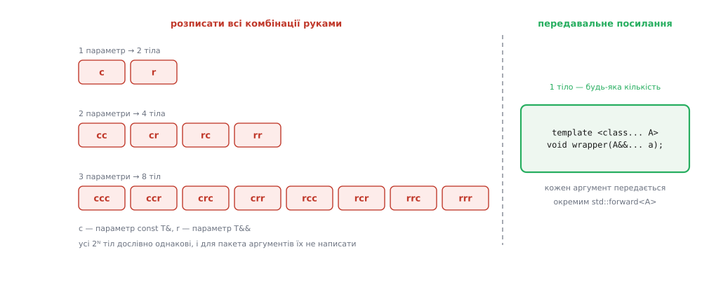
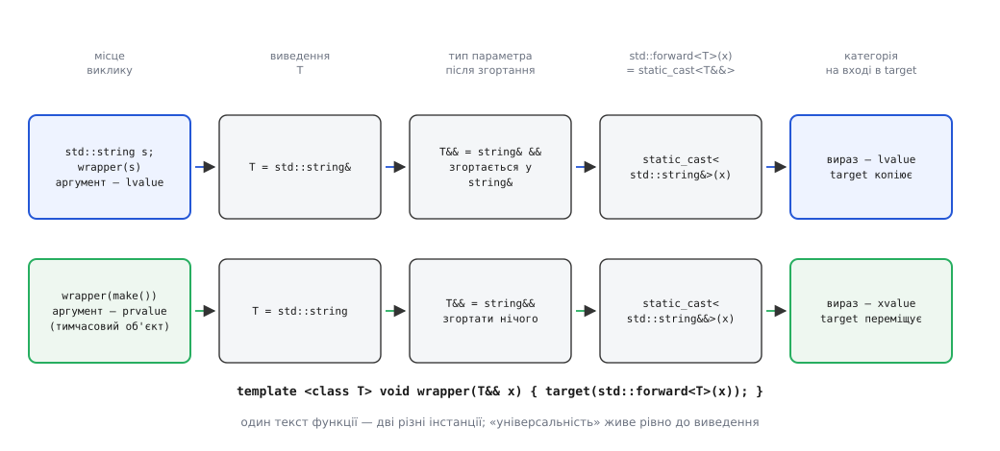
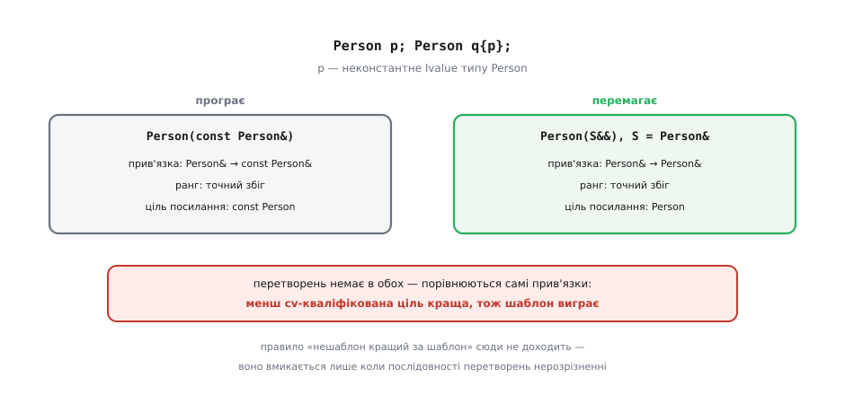

# Ідеальне передавання й універсальні посилання

<preknowlist>
- [Категорії значень](book:cpp-standards/value-categories) — чим lvalue відрізняється від prvalue і xvalue; категорія належить виразові, а не типові.
- [Посилання і правила зв'язування](book:cpp-standards/references-binding) — до чого прив'язується `T&`, `const T&` і `T&&`.
- [Семантика переміщення](book:cpp-standards/move-semantics) — що робить `std::move`, чому переміщення дешевше за копіювання і в якому стані лишається спустошений об'єкт.
- [Шаблони: параметризація типом](book:cpp-standards/templates-basics) — як з одного тексту шаблона постає функція під конкретний тип.
- [Виведення аргументів шаблону](book:cpp-standards/template-argument-deduction) — як компілятор добуває `T` з фактичного аргументу виклику.
- [Розв'язання перевантажень](book:cpp-standards/overload-resolution) — як із кількох однойменних функцій обирається одна і що таке точний збіг.
</preknowlist>

Найбанальніша функція в бібліотеці — та, що не робить нічого власного. Вона бере аргументи й віддає їх іншій функції: фабрика `make_unique` конструює об'єкт із того, що їй передали; `emplace_back` будує елемент прямо в буфері контейнера; обгортка з журналюванням дописує рядок у лог і викликає справжню операцію; конструктор `std::thread` приймає функцію з аргументами й запускає її в іншому потоці. Усі вони — труби. Крізь трубу має пройти те саме, що в неї влили.

І ось тут ховається задача, розв'язати яку мова не вміла перші двадцять років свого життя. Бо «те саме» означає більше, ніж однаковий тип.

## Що саме має вціліти в дорозі

Візьмімо конкретно. Ми хочемо написати `wrapper`, для якого виклик `wrapper(a, b)` поводиться точно так само, як `target(a, b)` — для будь-яких `a` і `b`, для будь-якого `target`. Що мусить вціліти?

Тип — очевидно. Але тип — це не все, бо перевантаження в C++ розрізняють ще одну властивість аргументу: **категорію значення**. Функція `target` цілком може мати два тіла:

```cpp
void target(const std::string& s);   // беремо на подивитися
void target(std::string&& s);        // забираємо собі
```

Тепер уявіть, що обгортка десь по дорозі загубила категорію. Наслідки несиметричні, і обидва погані.

Якщо rvalue перетворилося на lvalue — виклик потрапить у першу гілку. Замість того щоб забрати вже готовий буфер тимчасового рядка, `target` скопіює його байт за байтом. Помилки немає, програма правильна — просто виділення пам'яті й копіювання там, де мало бути присвоєння вказівника. Саме через це `v.emplace_back(std::string(1000, 'x'))` мусить донести rvalue аж до конструктора елемента: одна загублена категорія — одне зайве виділення на кожен виклик.

Якщо ж lvalue перетворилося на rvalue — гірше. `target` вирішить, що об'єкт нічий, і випатрає його. А він належав тому, хто викликав обгортку. Це вже не втрата швидкості, а тихе псування чужих даних: змінна в коді викликача раптом порожня, і жодного натяку в тексті на те, що її хтось спустошив.

Отже, обгортка мусить пронести крізь себе дві речі одночасно: **тип із його cv-кваліфікацією** (`const`, `volatile`) і **категорію значення**. Це і називають ідеальним передаванням (англ. *perfect forwarding* — «досконале пересилання»): аргумент має прибути до `target` таким, ніби обгортки взагалі не існувало.

## Чотири чесні спроби

Перш ніж дивитися на розв'язок, варто побачити, чому кожен природний варіант ламається. Це не історія помилок — це перелік вимог, які стягуються в одну точку.

**Брати за значенням.**

```cpp
template <class T>
void wrapper(T x) { target(std::move(x)); }
```

Працює й нічого не псує: копію ми зробили свою, її й віддаємо. Але за lvalue-аргумент платимо повним копіюванням, якого могло не бути, а `target`, що приймає `T&` і пише в аргумент (вихідний параметр), тепер напише в нашу копію, і викликач нічого не побачить. Труба, яка щоразу переливає воду в нове відро.

**Брати за неконстантним посиланням.**

```cpp
template <class T>
void wrapper(T& x) { target(x); }
```

Копії немає, писати в аргумент можна — але `wrapper(42)` і `wrapper(compute())` не скомпілюються: неконстантне lvalue-посилання не прив'язується до тимчасового об'єкта. Половина викликів відпадає.

**Брати за константним посиланням.**

```cpp
template <class T>
void wrapper(const T& x) { target(x); }
```

Прив'язується до всього — і до lvalue, і до rvalue. Саме тому цей варіант такий поширений. Але `const` тепер приклеєний назавжди: усередині `x` — константа, тож `target` не зможе ані змінити аргумент, ані переміститися з нього. Категорія розчавлена: усе, що зайшло, виходить як константне lvalue.

**Розписати всі комбінації.**

Кожен параметр буває або константним lvalue, або rvalue — отже, напишімо обидві перевантажені версії:

```cpp
template <class T> void wrapper(const T&  x) { target(x); }
template <class T> void wrapper(      T&& x) { target(std::move(x)); }
```

Для одного параметра — чесно й правильно. Для двох потрібні чотири функції, для трьох — вісім. Кількість тіл зростає як 2ᴺ, і всі вони — дослівні копії одне одного.



*Ціна «чесного» розв'язку в лоб: вісім однакових тіл уже на трьох параметрах — і жодного способу написати їх для функції зі змінною кількістю аргументів.*

Саме на цьому місці задача й була сформульована як окрема проблема мови: у документі комітету N1385 «The Forwarding Problem: Arguments» (Пітер Дімов, Говард Гіннант, Дейв Абрагамс, вересень 2002) підраховано ті самі 2ᴺ перевантажень і показано, що для шаблонів зі змінною кількістю аргументів такий підхід не годиться в принципі. [Як задачу помітили й закрили](book:cpp-standards/perfect-forwarding/hist-forwarding-problem.md) — окрема розповідь: вона починається з бібліотек Boost, де обгортки писали руками, і закінчується тим, що ту саму мовну рису двічі перейменували, поки не дійшли до теперішньої назви.

Отже, потрібен **один** параметр, що прив'язується і до lvalue, і до rvalue, і при цьому **запам'ятовує, що саме до нього прив'язалося**. Пам'ятати можна тільки в одному місці — у типі, бо тільки тип шаблону доживає до тіла функції.

## Правило виведення: категорія, зашита в тип

Механізм складається з двох правил, і кожне саме собою виглядає дрібницею.

Перше правило — виняток у виведенні аргументів шаблону. Якщо параметр функції оголошено як `T&&`, де `T` — параметр саме цього шаблону, який виводиться з цього виклику, то компілятор діє так:

```
аргумент — lvalue типу A   →   T = A&
аргумент — rvalue типу A   →   T = A
```

Зверніть увагу, що сталося: **категорія аргументу перетворилася на різницю в типі**. Для lvalue у `T` записується посилання, для rvalue — чистий тип. Одна й та сама змінна шаблону тепер несе відповідь на питання «як це було написано на місці виклику». Cv-кваліфікація їде разом: константне lvalue типу `int` дає `T = const int&`.

Але звідси випливає незручність. Якщо `T = int&`, то тип параметра — `int& &&`, посилання на посилання. Написати таке в коді не можна. А тут воно виникло само.

## Згортання посилань

Друге правило рятує перше. Мова забороняє **писати** посилання на посилання, але дозволяє йому **виникнути** — через виведення шаблону, через `auto`, через `typedef` чи `decltype` — і одразу згортає пару в одне посилання:

```
&   &    →  &
&   &&   →  &
&&  &    →  &
&&  &&   →  &&
```

Правило легко тримати в голові одним реченням: **lvalue-посилання заразне**. Якщо хоч одне з двох — `&`, результат `&`; тільки `&& &&` дає `&&`. Логіка тут не формальна, а змістовна: `&` означає «це чиясь іменована річ», і жодна обгортка не має права понизити чужу іменовану річ до тимчасової.

Тепер обидва правила працюють разом. Розберімо той самий шаблон на двох викликах.

**Дано:** `template <class T> void wrapper(T&& x);`, змінна `std::string s = "текст";`

```
wrapper(s)                 s — lvalue типу std::string
  виведення:      T     =  std::string&
  тип параметра:  T&&   =  std::string& &&
  згортання:            =  std::string&        ← прив'язалися до чужого об'єкта

wrapper(std::string("текст"))    аргумент — prvalue
  виведення:      T     =  std::string
  тип параметра:  T&&   =  std::string&&       ← прив'язалися до тимчасового
```

Один текст функції, два різні параметри після інстанціювання. Ніякого «універсального» типу в готовій функції немає: універсальність живе рівно до виведення, а після нього лишається звичайне lvalue- або rvalue-посилання.

Через цю двоїстість риса й отримала аж дві назви. Скотт Маєрс, пояснюючи її 2012 року, назвав таке оголошення **універсальним посиланням** (*universal reference*) — бо `&&` тут означає «або те, або те». Назва прижилася в спільноті, але комітет визнав її неточною: універсального типу немає, є конструкція з єдиним призначенням. Документ N4164 «Forwarding References» (Герб Саттер, Бʼярне Строуструп, Габріель Дос Рейс, 2014) закріпив у стандарті термін **передавальне посилання** (*forwarding reference*). Обидві назви живі, друга — офіційна.

## Чому всередині функції все знову lvalue

Здавалося б, справу зроблено: параметр має правильний тип, передавай далі. Але тут чекає найтонше місце всієї теми.

```cpp
template <class T>
void wrapper(T&& x) { target(x); }   // ← категорія втрачена
```

Навіть коли `x` має тип `std::string&&`, **вираз** `x` — це lvalue. Іменована річ завжди lvalue, незалежно від того, посилання якого ґатунку до неї приклеєне. Тому `target(x)` завжди піде в гілку `const std::string&`, і вся конструкція з виведенням і згортанням пропаде намарно.

Це не недогляд, а свідоме рішення. У змінної є ім'я, отже, її можна вжити двічі. Якби іменоване rvalue-посилання само собою було rvalue, то перше ж використання спустошило б об'єкт, а друге працювало б із порожнечею — і жодного знаку в тексті програми. Мова вимагає, щоб момент «усе, я його віддаю» стояв у коді явно й був видимий очима.

> 🔧 **Навіщо це.** Правило «іменоване — це lvalue» рятує найчастіший клас помилок у конструкторах переміщення. У тілі `Buffer(Buffer&& other)` вираз `other.data_` — lvalue, тож `data_(other.data_)` скопіює вказівник, а не «перемістить» його випадково двічі. Все, що справді забирається, доводиться позначити руками — і рев'ю бачить кожне таке місце.

Отже, категорію треба **відновити** — повернути виразові те, що збереглося в типі `T`. Потрібен каст до `T&&`, і згортання зробить решту:

```
T = std::string&    →   T&& = std::string& &&  =  std::string&    →  вираз lvalue
T = std::string     →   T&& = std::string&&                       →  вираз xvalue
```

Один і той самий каст дає різний результат залежно від того, що записано в `T`. Це і є `std::forward`.

## std::forward — умовний каст

```cpp
template <class T>
void wrapper(T&& x) { target(std::forward<T>(x)); }
```

По суті `std::forward<T>(x)` — це `static_cast<T&&>(x)`, тобто «зроби з `x` rvalue, **якщо** воно ним було на місці виклику». Порівняння з сусідою тут пояснює все: `std::move` кастує до rvalue **завжди й безумовно**, `std::forward` — **умовно**, і умова захована в типі `T`.

Реалізація в стандартній бібліотеці виглядає так (файл `<utility>`):

```cpp
template <class T>
constexpr T&& forward(std::remove_reference_t<T>& t) noexcept {
    return static_cast<T&&>(t);
}

template <class T>
constexpr T&& forward(std::remove_reference_t<T>&& t) noexcept {
    static_assert(!std::is_lvalue_reference_v<T>,
                  "не можна передати rvalue як lvalue");
    return static_cast<T&&>(t);
}
```

Дві деталі цієї сигнатури варті окремої уваги, бо в них — уся дисципліна прийому.

**Чому параметр оголошено `remove_reference_t<T>&`, а не просто `T&`.** Через `remove_reference_t` тип `T` опиняється **зліва від `::`** — у невивідному контексті. Компілятор не може добути `T` з аргументу й мусить дістати його з явних кутових дужок. Це не примха: вивести правильний `T` з `x` **неможливо в принципі**, бо `x` усередині функції завжди lvalue. Пам'ять про категорію лежить не в аргументі, а в типі, тож `std::forward` треба цей тип назвати. Через це запис `std::forward(x)` без дужок ніколи не скомпілюється — і добре, бо мовчки він робив би не те.

**Навіщо друге перевантаження зі `static_assert`.** Воно ловить безглузду комбінацію: аргумент — rvalue, а в дужках указано lvalue-посилання. Такий каст спробував би віддати тимчасовий об'єкт як чиюсь довговічну змінну; помилка спливає на етапі компіляції, а не в рантаймі.

Замість імені типу можна написати `std::forward<decltype(x)>(x)` — для параметра `T&& x` вираз `decltype(x)` дає `T&&`, а `T&& &&` згортається назад у `T&&`, тож результат той самий. Для параметра, оголошеного через `auto&&`, іншого шляху й немає: імені типу там просто нема.



*Уся механіка на одному малюнку: категорія аргументу перетворюється на різницю в типі `T`, доживає в ньому до тіла функції, і той самий каст `static_cast<T&&>` розгортає її назад.*

Разом ці шматки складаються в канонічну обгортку — шаблон зі змінною кількістю аргументів, де кожен параметр передається окремо:

```cpp
template <class F, class... Args>
decltype(auto) call_logged(F&& f, Args&&... args) {
    log("виклик");
    return std::forward<F>(f)(std::forward<Args>(args)...);
}
```

Розгортання пакета `std::forward<Args>(args)...` застосовує каст до кожного аргументу з його власним `Args`. Функціональний об'єкт `f` передається так само — бо в нього теж може бути перевантаження за категорією (лямбда з `mutable`, об'єкт із методом `operator()` та кваліфікатором `&&`).

> 🔧 **Навіщо це.** Різниця між `push_back` і `emplace_back` — саме тут. `push_back` бере готовий елемент і має рівно два перевантаження, `emplace_back` — шаблон із передавальними посиланнями, який доносить аргументи аж до конструктора елемента, тож для `std::map<std::string, std::vector<int>>` `emplace(key, std::move(vec))` будує пару на місці, без жодного проміжного об'єкта. Ця сама схема — під `make_unique`, `make_shared`, `std::thread`, `std::invoke` і будь-яким власним пулом об'єктів.

Робочий приклад із вимірюванням — [обгортка й фабрика, що рахують копії й переміщення](book:cpp-standards/perfect-forwarding/proj-forwarding-factory.md): типовий клас-лічильник, три версії обгортки поруч, вивід програми з кількістю копій у кожній та розбір, звідки взялося зайве.

## Коли `T&&` — не передавальне посилання

Синтаксис `&&` не означає передавального посилання сам собою. Умов рівно дві, і обидві мусять справдитися: тип параметра записаний **точно** як `T&&` (без `const`, без `volatile`, не всередині складнішого типу), і `T` — параметр **цього самого шаблону**, який **виводиться з цього виклику**.

```cpp
template <class T> void a(T&& x);                // так
template <class T> void b(const T&& x);          // ні: const псує форму — лише rvalue
template <class T> void c(std::vector<T>&& v);   // ні: T усередині типу — лише rvalue
template <class... A> void d(A&&... args);       // так, для кожного елемента пакета
auto&& r = make_thing();                         // так: auto виводиться

template <class T>
struct Box {
    void push(T&& v);                            // НІ: T зафіксований класом
    template <class U> void emplace(U&& v);      // так: U виводиться з виклику
};
```

Найважливіший тут передостанній рядок, і на ньому спотикаються постійно. У `std::vector<T>` метод `push_back(T&& v)` — **звичайне rvalue-посилання**: `T` уже відомий із типу контейнера, виводити нічого. Тому `push_back` приймає rvalue й нічого не передає далі, а `emplace_back` оголошено окремим шаблоном `template <class... Args>` — і тільки він уміє ідеально передавати.

Ще одна деталь: після виведення передавального посилання вже не існує. У готовій інстанції стоїть звичайне `A&` або `A&&`, і всі правила зв'язування для нього — найбуденніші.

## Пастка ненажерливого шаблона

Передавальне посилання прив'язується до **всього**. Це його сила — і причина найпідступнішої помилки, яку воно породжує.

```cpp
class Person {
public:
    template <class S>
    explicit Person(S&& name) : name_(std::forward<S>(name)) {}

    Person(const Person&) = default;
    Person(Person&&)      = default;
private:
    std::string name_;
};

Person p{"Леся"};
const Person c = p;
Person q{p};        // ← помилка компіляції в тілі шаблонного конструктора
```

Останній рядок виглядає як звичайне копіювання, а насправді викликає **шаблонний** конструктор, який намагається збудувати `std::string` із `Person`. Чому так — видно, якщо розписати відбір перевантажень для аргументу `p` (неконстантне lvalue типу `Person`):

```
кандидат 1:  Person(const Person&)          прив'язка Person& → const Person&
кандидат 2:  Person(S&&) із S = Person&     прив'язка Person& → Person&
```

Обидва — точний збіг, перетворення немає в жодному. Але серед двох прив'язок посилань стандарт віддає перевагу тій, де тип, на який посилаються, **менш cv-кваліфікований**. Кандидат 2 прив'язується до `Person`, кандидат 1 — до `const Person`, тож шаблон перемагає ще до того, як дійде до тай-брейку «нешаблон краще за шаблон»: те правило вмикається лише тоді, коли послідовності перетворень нерозрізненні. Для константного `c` шаблон дав би `S = const Person&`, прив'язки стали б однакові — і копіювальний конструктор виграв би як нешаблон. Звідси й характерна поведінка: копіювання константного об'єкта працює, неконстантного — ні. [Правила відбору перевантажень](book:cpp-standards/overload-resolution) варто знати саме через такі місця, де інтуїція «шаблон — запасний варіант» підводить.



*Ненажерливий шаблон виграє не через «шаблонність», а через звичайне правило порівняння прив'язок: менш cv-кваліфікована ціль краща. Для константного аргументу прив'язки зрівнюються — і виграє нешаблон.*

Те саме стосується спадкоємців: `Student` (похідний від `Person`) прив'яжеться до `S&&` точно, а до `const Person&` — через перетворення до бази, тож шаблон знову виграє, і конструктор копіювання бази не викличеться ніколи.

Лікування одне: **обмежити** шаблон, щоб він не претендував на власний тип і його нащадків.

```cpp
template <class S>
    requires (!std::is_base_of_v<Person, std::remove_cvref_t<S>>)
          && std::constructible_from<std::string, S>
explicit Person(S&& name) : name_(std::forward<S>(name)) {}
```

Друга умова тут не менш важлива за першу: вона прибирає конструктор із розгляду, коли з аргументу справді не збудувати рядка, тож помилка стає читанним повідомленням «немає відповідного конструктора» замість простирадла з нутрощів шаблона. До C++20 те саме роблять через `std::enable_if_t` у типі повернення чи в додатковому параметрі — механіка описана в темі про [SFINAE й enable_if](book:cpp-standards/sfinae-and-enable-if), а сучасний запис через `requires` — у темі про [концепти](book:cpp-standards/concepts-constraints).

## Передати рівно один раз

`std::forward` може виявитися переміщенням. Отже, після нього аргумент лишається в дійсному, але невизначеному стані — і працює те саме правило, що для `std::move`: спожити можна один раз.

```cpp
template <class T>
void addToAll(std::vector<Sink>& sinks, T&& value) {
    for (auto& s : sinks)
        s.add(std::forward<T>(value));   // ← після першої ітерації value порожнє
}
```

Помилка тиха й особливо гидка тим, що з lvalue-аргументом код працює бездоганно (там `forward` дає lvalue й нічого не забирає), а ламається лише тоді, коли викликач передав тимчасовий об'єкт. Перший приймач отримує дані, решта — порожні рядки. Правильно — передавати всередині циклу копію, а власне `forward` лишити на останню ітерацію або винести за цикл:

```cpp
template <class T>
void addToAll(std::vector<Sink>& sinks, T&& value) {
    if (sinks.empty()) return;
    for (std::size_t i = 0; i + 1 < sinks.size(); ++i)
        sinks[i].add(value);                     // всім, крім останнього, — копія
    sinks.back().add(std::forward<T>(value));    // останньому можна віддати
}
```

Правило запам'ятовується коротко: **на один аргумент — один `std::forward`, і той на останньому використанні**. Той самий підрахунок стосується двох аргументів одного виклику: `f(std::forward<T>(x), std::forward<T>(x))` — помилка, навіть якщо обидва параметри `f` різні.

> 🔧 **Навіщо це.** Такі баги не ловляться оглядом коду й не падають у тестах, де скрізь передають іменовані змінні. Ловлять їх двома способами: перевіркою `bugprone-use-after-move` у clang-tidy і типом-лічильником у тестах, який після переміщення виставляє прапорець і б'є на сполох при спробі скористатися ним знову.

## Що не передається ідеально

«Ідеальне» передавання ідеальне не в усьому. Виведення шаблону потребує **типу**, а деякі вирази типу не мають або мають не той, що очікує адресат. Кожен випадок тут — не примха, а прямий наслідок якогось іншого правила мови.

**Список у фігурних дужках.** Вираз `{1, 2, 3}` не має типу взагалі, тож `wrapper({1, 2, 3})` не компілюється, хоча `target({1, 2, 3})` працює: там параметр оголошено як `std::initializer_list<int>`, і список ініціалізує його напряму. Обхід — назвати список змінною: `auto il = {1, 2, 3}; wrapper(il);` (це один із небагатьох випадків, де `auto` виводить саме `std::initializer_list`).

**`0` і `NULL` замість `nullptr`.** Літерал `0` має тип `int`, і виведення чесно дає `T = int`. До `target(char*)` такий аргумент уже не підходить — перетворення «нульова константа → вказівник» стосується літерала, а не змінної типу `int`. Ліки очевидні: писати `nullptr`, у якого є власний тип.

**Бітове поле.** Неконстантне посилання не прив'язується до бітового поля, бо в нього немає адреси. Передавати доводиться копію: `wrapper(+bf)` або `wrapper(static_cast<unsigned>(bf))`.

**Ім'я перевантаженої функції чи шаблона функції.** `wrapper(process)` не вибере жодного `process`, бо вибирати немає з чого: параметр шаблона не задає цільового типу, а сам по собі набір перевантажень типу не має. Треба назвати потрібне явно — кастом до потрібної сигнатури або обгорнувши виклик у лямбду.

Спільний знаменник у всіх чотирьох випадків один: передавальне посилання переносить категорію й тип, але не переносить **контексту**, у якому вираз мав би тлумачитися. Там, де адресат надавав контекст своїм оголошенням параметра, обгортка цей контекст стирає.

## Повернути результат назад

Аргументи — половина задачі; N1385 так і називався «The Forwarding Problem: **Arguments**». Друга половина — повернути результат адресата викликачеві, теж нічого не змінивши. Якщо `target` віддає посилання на елемент контейнера, обгортка не має права перетворити його на копію.

```cpp
template <class F, class... Args>
decltype(auto) call(F&& f, Args&&... args) {
    return std::forward<F>(f)(std::forward<Args>(args)...);
}
```

`decltype(auto)` тут неспроста: `auto` відкинув би посилання й cv-кваліфікацію (це його штатна поведінка, [спільна з виведенням шаблонів](book:cpp-standards/auto-type-deduction)), а `decltype(auto)` бере тип виразу як є — разом із `&` чи `&&`. Тому обгортка над `std::vector::operator[]` теж повертає посилання, і `call(v, 0) = 5` працює.

Плата — знайомий ризик: якщо адресат повернув посилання на щось тимчасове, обгортка чесно поверне те саме висяче посилання, і слідів у її власному коді не лишиться. Це загальна властивість наскрізних посилань, [розібрана окремо](book:cpp-standards/dangling-references).

Так само крізь обгортку не проходить сама собою обіцянка `noexcept`: обгортка з порожньою специфікацією зведе нанівець оптимізації в адресата. Прокидають її через вираз, що дублює виклик:

```cpp
template <class F, class... Args>
decltype(auto) call(F&& f, Args&&... args)
    noexcept(noexcept(std::forward<F>(f)(std::forward<Args>(args)...)))
{
    return std::forward<F>(f)(std::forward<Args>(args)...);
}
```

Виклик записано двічі — усередині `noexcept(...)` він не обчислюється, а лише перевіряється на кидання. Незграбно, але іншого способу дізнатися, чи кидає адресат, у мові немає; що саме дає ця обіцянка й чому за неї варто боротися — у темі про [noexcept](book:cpp-standards/noexcept).

## Передати сам об'єкт

Досі йшлося про аргументи. Але метод класу має ще один прихований аргумент — сам об'єкт. І якщо метод віддає назовні своє поле, категорія об'єкта важить рівно так само:

```cpp
struct Holder {
    std::string value;
    const std::string& get() const&  { return value; }              // об'єкт живе далі — копія
    std::string        get()      && { return std::move(value); }   // об'єкт тимчасовий — забирай
};
```

Два тіла на один метод, а з `const&&`-варіантом і врахуванням `volatile` — до чотирьох. Це той самий комбінаторний вибух, тільки по осі об'єкта. C++23 закриває його явним параметром об'єкта: метод оголошує `this` як звичайний перший параметр, і той параметр можна зробити передавальним посиланням.

```cpp
struct Holder {
    std::string value;
    template <class Self>
    auto&& get(this Self&& self) {
        return std::forward<Self>(self).value;
    }
};
```

Один текст покриває всі чотири комбінації: звертання до нестатичного поля через xvalue дає xvalue, через lvalue — lvalue, тож категорія об'єкта автоматично переходить на поле. [Явний параметр об'єкта](book:cpp-standards/deducing-this) має й інші застосування — від рекурсивних лямбд до CRTP без шаблонної бази.

Коли ж потрібне не поле, а щось, до чого об'єкт лише має доступ (значення за розумним вказівником, елемент обгорнутого контейнера), звертання не дасть потрібної категорії саме, бо розіменування вказівника завжди дає lvalue. Для цього C++23 додав `std::forward_like<Self>(x)`: він накладає на `x` категорію **і** константність із `Self`. Обидві риси — і явний `this`, і `forward_like` — прийшли одним релізом, разом із рештою [нововведень C++23](book:cpp-standards/cpp23-features).

## Коли ідеальне передавання не потрібне

Механізм не безкоштовний, і найчастіша помилка тепер — не забути про нього, а натягнути його всюди.

Якщо функція **завжди** зберігає аргумент у себе, простіший і майже такий самий швидкий варіант — узяти за значенням і перемістити:

```cpp
class Widget {
public:
    explicit Widget(std::string name) : name_(std::move(name)) {}
private:
    std::string name_;
};
```

Ціна — рівно одне зайве переміщення проти ідеального передавання (за lvalue: копія + переміщення замість самої копії; за rvalue: два переміщення замість одного). Виграш — величезний: це не шаблон, тож він компілюється окремо в `.cpp`, дає людські повідомлення про помилки, не претендує на власний тип класу й не потребує обмежень. Для типів із дешевим переміщенням — рядків, векторів, розумних вказівників — це кращий вибір за замовчуванням. Він програє тільки там, де переміщення саме собою дороге: `std::array<char, 4096>` копіюється й «переміщується» однаково, тож зайвий крок відчутний.

Якщо функція аргумент **тільки читає** й нікуди не зберігає — `const T&` цілком достатньо, і жодні категорії їй не потрібні.

Ідеальне передавання виправдане там, де воно й народилося: у **наскрізних** обгортках, які самі не знають ані типу, ані того, що з аргументом зробить адресат, — фабрики, `emplace`-методи контейнерів, універсальні виклики функціональних об'єктів, адаптери. Там воно не оптимізація, а єдиний спосіб не збрехати про аргумент.

Є й ціна за компіляцією. Кожна комбінація типів і категорій породжує окрему інстанцію: `wrapper(s)` і `wrapper(std::move(s))` — дві різні функції в бінарнику. Для однієї обгортки це дрібниця, для шару обгорток над обгортками — помітний час збірки й розмір коду, про що йдеться в темі про [ціну інстанціювання](book:cpp-standards/instantiation-cost).

Ідеальне передавання — єдине місце в C++, де **тип несе пам'ять про синтаксис**. Звичайно тип каже, що це за річ; тут він додатково каже, як цю річ записали на місці виклику: іменованою змінною чи виразом, що зникне до наступної крапки з комою. Ця пам'ять живе рівно від виведення шаблону до `std::forward` — і тільки завдяки їй функція, що бачить свій аргумент виключно як lvalue з іменем, здатна віддати його далі точнісінько таким, яким його написав хтось інший.
