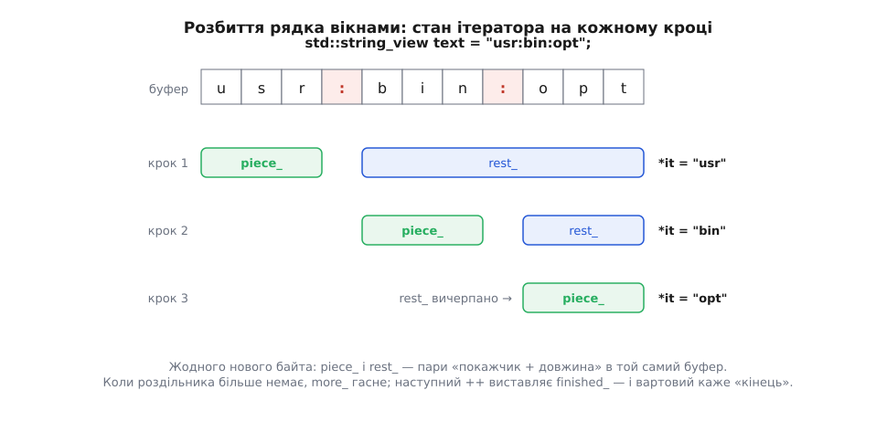

# ⚙️ Власний діапазон із вартовим: розбити рядок без жодного виділення

Тут ми пишемо тип, який видає циклу за діапазоном шматки тексту між роздільниками й не витрачає на це ані байта нової пам'яті — а кінцем діапазону в ньому служить не ітератор, а порожня структура-вартовий. Задача нудна до банальності: у змінній `PATH` теки розділені двокрапкою, у рядку CSV поля — комою, у заголовку HTTP значення — крапкою з комою. Звичний спосіб (`std::getline` з `std::istringstream` або `substr` у циклі) створює на кожен шматок окремий `std::string`, тобто окреме виділення пам'яті. Розбір рядка з десяти полів коштує десять маленьких запитів до купи. Для парсера, що читає мільйон рядків журналу, це і є вся вартість роботи.

## Ідея: не копіювати, а посувати вікно

Шматок тексту не конче копіювати. [`std::string_view`](book:cpp-standards/string-and-string-view) — пара «покажчик на перший символ плюс довжина», вікно в чужий буфер. Розбиття тоді не створює даних узагалі: воно лише посуває вікно вздовж уже наявного рядка.

Лишається під'єднати це до циклу. Цикл за діапазоном вимагає рівно трьох дій: розіменувати, зробити префіксний крок і порівняти з кінцем через `!=`. Про кінець він не знає нічого, крім того, що з ітератором його можна порівняти. Отже, кінцем не мусить бути ітератор.

Для нашої задачі це вирішальне. Де кінець розбиття? Він настає, коли в залишку більше нема чого брати, — а це властивість поточного стану, а не позиція в буфері. Позиції «за останнім шматком» просто не існує: останній шматок закінчується там само, де й увесь текст, тож відрізнити «щойно віддали останній» від «уже нічого немає» можна лише прапорцем усередині самого ітератора. Кінець тому робимо порожньою структурою — **вартовим**: його єдина робота полягає в тому, щоб дати ітераторові привід відповісти на порівняння.

## Робочий код

```cpp
#include <cstddef>
#include <string_view>

class split_by {
public:
    constexpr split_by(std::string_view text, char sep) noexcept
        : text_(text), sep_(sep) {}

    struct end_marker {};                      // вартовий: жодного поля

    class cursor {
    public:
        constexpr cursor(std::string_view text, char sep) noexcept
            : rest_(text), sep_(sep) { step(); }

        constexpr std::string_view operator*() const noexcept { return piece_; }

        constexpr cursor& operator++() noexcept { step(); return *this; }

        constexpr bool operator==(end_marker) const noexcept { return finished_; }

    private:
        constexpr void step() noexcept {
            if (!more_) { finished_ = true; return; }
            const std::size_t at = rest_.find(sep_);
            if (at == std::string_view::npos) {
                piece_ = rest_;
                more_  = false;                // цей шматок останній
            } else {
                piece_ = rest_.substr(0, at);
                rest_.remove_prefix(at + 1);
            }
        }

        std::string_view rest_;
        std::string_view piece_;
        char sep_;
        bool more_     = true;
        bool finished_ = false;
    };

    constexpr cursor     begin() const noexcept { return cursor{text_, sep_}; }
    constexpr end_marker end()   const noexcept { return {}; }

private:
    std::string_view text_;
    char sep_;
};
```

Ужиток:

```cpp
#include <cstdio>

int main() {
    std::string_view path = "usr:bin:opt";
    for (std::string_view part : split_by{path, ':'})
        std::printf("[%.*s]\n", static_cast<int>(part.size()), part.data());
}
```

```
[usr]
[bin]
[opt]
```

`printf` тут не примха: `%.*s` бере довжину явно, тож нетермінований нулем `string_view` виводиться без проміжного `std::string` — інакше ми повернули б виділення пам'яті через задні двері.



*Обидва поля ітератора — пари «покажчик плюс довжина» в буфер, який ми не змінюємо й не копіюємо. Крок уперед лише пересуває межі вікон.*

Прапорців два, і кожен потрібен. `more_` каже «у залишку ще є роздільник», `finished_` — «шматки скінчилися». Один прапорець тут не впорається: після того як `find` не знайшов роздільника, ми вже маємо готовий останній шматок і мусимо його віддати, і аж наступний виклик `step()` має право оголосити кінець. Порожній вхід за такою логікою дає один порожній шматок — це наша домовленість, і її треба тримати в голові, бо конвенції тут різняться.

Ціна всього обходу — один прохід буфером: `find` шукає від поточної межі й далі, тож сумарно кожен символ читають один раз, O(n) на весь рядок і жодного звернення до купи. Ітератор на 64-бітній машині займає 40 байтів (два вікна по 16 плюс роздільник і два прапорці з вирівнюванням), вартовий — порожня структура, яку компілятор передає задарма. Оскільки всі методи `constexpr`, розбір константного рядка можна зробити ще під час компіляції.

## Чому до C++17 такий тип не складався

У C++11 і C++14 розгортання циклу оголошувало обидві межі **одним** оголошенням: `auto __begin = begin-вираз, __end = end-вираз;`. Одне `auto` на два імені означає один тип на обидва, і компілятор одразу відповів би «inconsistent deduction for auto» — `cursor` і `end_marker` різні. Ерік Нібл (Eric Niebler) розбив це оголошення надвоє в P0184R0 (лютий 2016-го), і з C++17 кінець вільно має власний тип.

Викручувалися тоді так: удавали, ніби кінець — теж повноцінний ітератор.

```cpp
cursor() noexcept : sep_('\0'), more_(false), finished_(true) {}   // «кінець»

bool operator!=(const cursor& o) const noexcept {
    return finished_ != o.finished_
        || (!finished_ && piece_.data() != o.piece_.data());
}
```

Ціна видна одразу. Порівняння з дешевого «глянь на прапорець» перетворилося на розбір двох випадків. Тип кінця тепер тягне за собою всі поля ітератора, хоча жодне з них не значуще. А головне — сама конструкція нечесна: `end()` повертає об'єкт, який ніде не стоїть. Для рядка в стилі C розплата ще відчутніша: щоб дістати «ітератор на кінець», доводиться спершу пройти рядок до нуля й порахувати довжину — зайвий повний обхід заради одного обходу. Саме через це вартові й з'явилися в мові.

Ще одна дрібниця з тієї ж родини: наш `operator==(end_marker)` працює в циклі лише з C++20, бо саме там компілятор синтезує `a != b` з `!(a == b)`. Під C++17 треба написати рівно `operator!=(end_marker) const` — розгортання порівнює через `!=` і нічого не переписує.

## Пастки, на які тут наступають

**`const` на `begin` і `end`.** Обидва методи в нас `const`-ні, і це не оздоба. Напишіть їх без `const` — і `void dump(const split_by& s)` з циклом усередині перестане компілюватися, а разом із ним будь-яке передавання діапазону за `const`-посиланням. Для контейнера тут довелося б заводити дві пари методів, що повертають `iterator` і `const_iterator`, бо константність контейнера має переходити на елементи. У нас елемент — уже й так лише читання, тип ітератора один, тож самої `const`-версії досить. Загальне правило [константної коректності](book:cpp-standards/const-correctness) тут працює на нас: `split_by` нічого не володіє й нічого не змінює.

**`begin()` має бути повторюваним.** Наш `begin()` щоразу будує свіжий `cursor` із незмінного `text_`, тому два обходи того самого об'єкта дають однакові послідовності. Спокуса зробити інакше велика: винести `rest_` у сам `split_by`, а ітератор лишити тонким покажчиком назад на нього. Цикл за діапазоном такого не викриє — він кличе `begin()` рівно один раз. Викриє друге використання: другий цикл піде з того місця, де спинився перший, а `std::ranges::count` над таким «діапазоном» з'їсть його ще до того, як ви до нього дійдете. Стан обходу належить ітераторові, стан діапазону — діапазонові; змішувати їх — те саме, що поділити [модель ітераторів](book:cpp-standards/iterators-model) навпіл і сподіватися, що ніхто не помітить.

**Не повертати посилання на власне поле.** `operator*` віддає `std::string_view` **за значенням**. Хочеться інакше: `const std::string_view& operator*() const { return piece_; }` — мовляв, навіщо копіювати шістнадцять байтів. Наслідок такий: `for (auto& part : …)` починає компілюватися, і `part` стає посиланням на поле живого ітератора, тобто на **один і той самий об'єкт** на всіх ітераціях. Поки ви читаєте `part` усередині тіла, різниці немає. Але лямбда, що захопила `part` за посиланням, вектор із `std::reference_wrapper`, порівняння двох позицій — усе це після першого ж `++` дивиться на значення, яке вже поїхало далі. Повернення за значенням робить елемент prvalue, і тоді `auto&` чесно не компілюється, а на місці вживання пишуть `auto` або `auto&&` — рівно як для `std::vector<bool>`.

**Тимчасовий рядок після двокрапки.**

```cpp
for (auto part : split_by{read_line(), ':'})   // до C++23 — висяче посилання
```

`read_line()` повертає `std::string` за значенням. Цей тимчасовий рядок віддає своє вікно конструкторові `split_by`, а сам лишається **вкладеним** тимчасовим об'єктом усередині виразу-діапазону. Продовження життя до C++23 діставалося лише результатові всього виразу, тож `std::string` гинув на крапці з комою — ще до першої ітерації, і всі `string_view` показували в звільнену пам'ять. P2718R0 (ухвалено в листопаді 2022-го) поширив продовження на всі тимчасові об'єкти виразу-діапазону, і рядок став законним у C++23. Порятунок, що не залежить від версії, один: `auto line = read_line();` окремим рядком або в операторі ініціалізації циклу.

> 🔧 **Навіщо це.** Компілятор тут мовчить не з ліні: `split_by` бере `string_view` за значенням, і зв'язок «цей об'єкт живе, доки живий той рядок» у типах не записаний ніде. Clang уміє його побачити, якщо параметр конструктора позначити `[[clang::lifetimebound]]`, — тоді передавання тимчасового рядка дає попередження. Для будь-якого власного типу, що зберігає вікно в чужі дані, ця анотація коштує один рядок і закриває цілий клас [висячих посилань](book:cpp-standards/dangling-references), який інакше знаходять уже в продакшені.

## Коли брати готове

У [бібліотеці ranges](book:cpp-standards/ranges-pipelines) є `std::views::split`. Він з'явився в C++20, а нинішнього вигляду набув через P2210R2 Баррі Ревзіна (Barry Revzin) — виправлення, ухвалене як дефект-репорт проти C++20: початковий `split` був максимально лінивим і давав шматки, з яких неможливо було зробити ні `std::string`, ні виклик `from_chars`; ліниву версію перейменували на `lazy_split`, а `split` переробили так, щоб над суцільним діапазоном він видавав `subrange`. Роздільником може бути і символ, і цілий підрядок. У C++23 `std::string_view` дістав конструктор із діапазону (P1989R2), тож `std::string_view(part)` тепер працює прямо.

Різниця в дрібницях, які кусаються. За чинним формулюванням порожній вхід дає `std::views::split` **нуль** шматків, а не один порожній — визнана невідповідність, і LWG-питання 4017 (відкрите з листопада 2023-го) пропонує це змінити. Елемент там — `subrange`, не `string_view`, тож у коді до C++23 його ще треба перетворювати руками.

Отже: коли потрібне просто розбиття й проєкт уже на C++23 — беріть `std::views::split` і не пишіть нічого. Свій тип виправданий там, де конвенція має бути ваша й записана явно (порожні поля пропускати чи віддавати, лапки шанувати чи ні, кілька роздільників поспіль вважати одним), де елементом мусить бути саме `string_view` без перехідників, або де `<ranges>` у наявному тулчейні ще неповний. Механізм при цьому той самий, і коштує він, як видно, три методи й одну порожню структуру.
