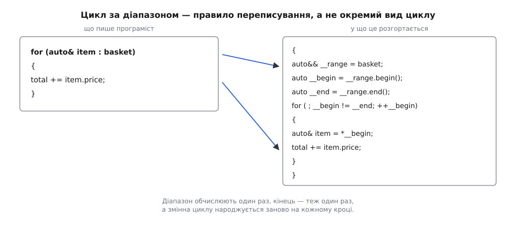
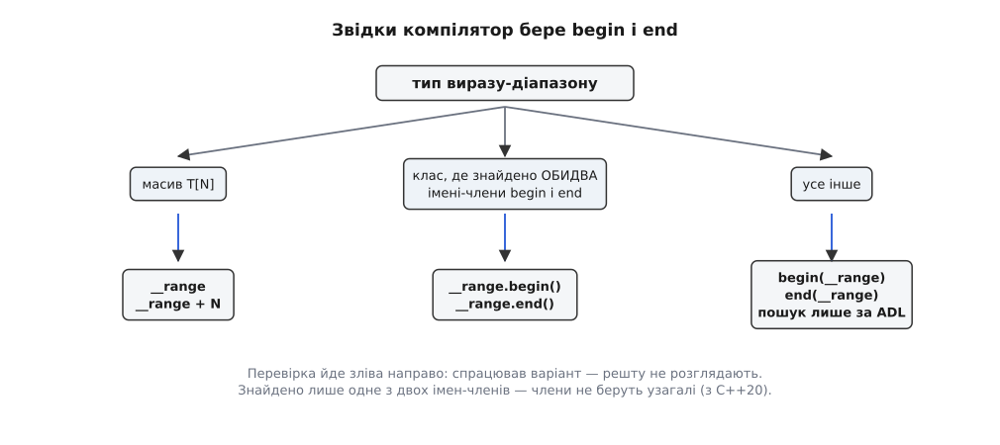
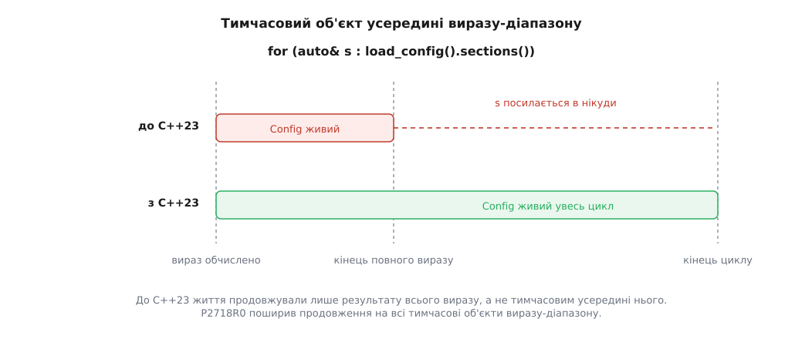

# Цикл for за діапазоном і в що він розгортається

<preknowlist>
- [Ітератор](book:programming/iterator) — об'єкт, який уміє дати поточний елемент, зробити крок уперед і порівнятися з позначкою кінця.
- [Категорії значень: lvalue, prvalue, xvalue](book:cpp-standards/value-categories) — чим іменований об'єкт відрізняється від тимчасового результату виразу.
- [Посилання і правила зв'язування](book:cpp-standards/references-binding) — що до чого зв'язується і як посилання продовжує життя тимчасовому об'єктові.
- [auto й виведення типу](book:cpp-standards/auto-type-deduction) — чому `auto`, `auto&` і `auto&&` дають різні типи з того самого виразу.
- [Час життя об'єкта](book:cpp-standards/object-lifetime) — коли об'єкт виникає і в яку саме мить його руйнують.
</preknowlist>

Пройтися всіма елементами контейнера — дія, яку програміст пише десятки разів на день. До C++11 кожен такий обхід виглядав так:

```cpp
for (std::vector<Item>::iterator it = basket.begin(); it != basket.end(); ++it)
    total += it->price;
```

Ім'я контейнера трапляється тут тричі, і кожне з трьох місць — окрема нагода схибити. Найпідступніша: переплутати контейнер у порівнянні, `it != cart.end()`. Типи збігаються, компілятор мовчить, а програма йде читати чужу пам'ять. Друга нагода дрібніша: `end()` стоїть в умові, тобто формально його обчислюють перед кожним кроком. Третя — сам тип ітератора, який доводиться виписувати повністю, хоч він і не несе жодної думки.

Жодна з трьох морок не походить із задачі. Задача звучить як «зроби це з кожним елементом», а все решта — обслуга механізму. Саме її прибрали:

```cpp
for (auto& item : basket)
    total += item.price;
```

Легко подумати, що це окремий вид циклу з власною семантикою. Насправді навпаки: компілятор переписує цей рядок у звичайний цикл з ітераторами й далі застосовує до нього ті самі правила мови, що й до тексту, написаного руками. Тож власної магії тут немає — але є точний текст розгортання, і кожна несподіванка конструкції читається просто з нього.

## Шість рядків, з яких випливає все інше

Стандарт задає цикл за діапазоном не описом поведінки, а еквівалентним кодом:

```cpp
{
    оператор-ініціалізації              // з C++20, необов'язковий
    auto&& __range = вираз-діапазону;
    auto __begin   = begin-вираз;
    auto __end     = end-вираз;
    for ( ; __begin != __end; ++__begin) {
        оголошення = *__begin;
        тіло
    }
}
```

Імена з подвійним підкресленням вигадує компілятор, у програмі їх не видно, і взяти їх не можна. Усе розгортання загорнуте у власну область видимості, тому три службові змінні зникають разом із циклом і не стикаються з іменами програми.



*Ліворуч — те, що пише програміст; праворуч — еквівалентний код зі стандарту. Стрілки показують, звідки береться діапазон і куди потрапляє тіло циклу.*

Три рядки заслуговують на окремий погляд, бо з них ростуть усі практичні наслідки.

`auto&& __range = вираз-діапазону;` — вираз після двокрапки обчислюють **рівно один раз**. Написати `for (auto& x : make_vector())` не означає викликати `make_vector()` на кожному кроці.

`auto __begin` і `auto __end` — обидві межі теж обчислюють один раз, до першого кроку. Кінець не перераховують ніколи.

`оголошення = *__begin;` стоїть **усередині** тіла циклу. Отже, змінна елемента народжується й гине на кожній ітерації заново, а знак `=` тут не присвоєння, а ініціалізація копіюванням — з усіма звичайними правилами ініціалізації, які до неї додаються.

Ця форма склалася не одразу. Перше формулювання, вже без концептів, написали Дуглас Ґреґор (Douglas Gregor) і Беман Доус (Beman Dawes) у липні 2009-го, і відтоді розгортання правили ще чотири рази — щоразу через конкретну хибу, на яку наступали люди: різнотипний кінець, зламаний пошук `begin`, тимчасові об'єкти, що вмирали зарано. [Історія цих правок](book:cpp-standards/range-based-for/hist-range-for-papers.md) показує, як комітет по одному закривав отвори в конструкції, що виглядала простою.

## Звідки компілятор бере begin і end

`begin-вираз` і `end-вираз` — не виклики якоїсь однієї функції. Компілятор обирає між трьома варіантами, і порядок перевірки фіксований.

**Масив.** Якщо `__range` — посилання на масив `T[N]`, то `begin-вираз` — це саме `__range`, а `end-вираз` — `__range + N`. Жодних функцій: масив носить свою довжину прямо в типі, тож питати нікого не треба. Це єдина причина, чому `for (int v : {1, 2, 3})` і обхід звичайного `int a[5]` працюють без бібліотеки.

**Клас із членами.** Якщо `__range` — посилання на клас і в цьому класі знайдено **обидва** імені, `begin` і `end`, то беруть `__range.begin()` і `__range.end()`. Саме цим шляхом ідуть усі стандартні контейнери.

**Усе інше.** Тоді `begin-вираз` і `end-вираз` — це `begin(__range)` і `end(__range)`, знайдені **лише** [пошуком, залежним від аргументів](book:cpp-standards/namespaces-and-adl). Звичайний некваліфікований пошук тут не виконують узагалі — і це не дрібниця. Написати власну вільну функцію `begin` у своєму просторі імен для чужого типу марно: компілятор її не побачить. Функції мусять жити в просторі імен самого типу.



*Порядок перевірки жорсткий: спрацював варіант — решту не розглядають. Слово «обидва» в середньому варіанті з'явилося не одразу.*

Вимога «обидва імені» — слід від справжньої аварії. Початкове формулювання брало члени, якщо знаходилося **хоч одне** з двох імен. А в стандартних потоках є член із назвою `end` — це навіть не функція, а елемент переліку `std::ios_base::seekdir` (той самий, що позначає кінець файлу при позиціюванні). Будь-який клас, успадкований від потоку, автоматично мав член `end`, тож компілятор ішов другим шляхом, натрапляв на `__range.end()`, який не є викликом, і зупинявся з помилкою — навіть коли поруч лежала цілком придатна пара вільних функцій. Ville Voutilainen подав P0962R1 (2018), і з C++20 правило звучить так: члени беруть лише тоді, коли знайдено обидва; знайдено одне — шукають пару через ADL.

## Що мусить уміти те, що повернули

З розгортання видно точний список вимог до `__begin` і `__end`. Потрібні рівно три дії: порівняння `__begin != __end`, префіксний `++__begin` і розіменування `*__begin`. Плюс сама можливість покласти результат у `auto`, тобто перемістити.

Це менше, ніж вимагає слово «ітератор» у бібліотечному значенні. Ані `iterator_traits`, ані категорії обходу цикл не потребує; йому байдуже, чи твій обхід придатний для алгоритмів STL. Класифікація ітераторів — [окрема тема](book:cpp-standards/iterators-model), і цикл за діапазоном лежить нижче за неї.

Умова записана саме як `!=`, а не як `<`, і це теж не смак. Порівняння «менше» має сенс лише там, де позиції впорядковані й віднімаються одна від одної, — у векторі так, у списку вже ні: два його вузли можна порівняти на тотожність, але не на «раніше». Вимагати `<` означало б відрізати від конструкції половину контейнерів, а разом із ними й будь-який вартовий, що взагалі не має позиції.

Але одна вимога довго була зайвою, і саме вона найцікавіша. У C++11 і C++14 обидві межі оголошували **одним** оголошенням:

```cpp
for (auto __begin = begin-вираз, __end = end-вираз; __begin != __end; ++__begin)
```

Одне `auto` на два імені — це один тип на обидва. Отже, кінець мусив бути таким самим повноцінним ітератором, як початок, навіть коли він не ніс жодної інформації. Показовий випадок — рядок у стилі C: його кінець позначено нулем, і щоб отримати «ітератор на кінець», доводиться спершу пройти весь рядок і порахувати довжину, тобто обійти дані двічі заради одного обходу.

Ерік Нібл (Eric Niebler) подав P0184R0 у лютому 2016-го й запропонував рівно одну зміну — розбити спільне оголошення на два окремі. З C++17 кінець може мати **інший тип**: це може бути **вартовий** (англ. *sentinel* — вартовий, чатовий) — об'єкт, єдина робота якого полягає в тому, щоб відповісти на `!=` «ще не кінець» або «вже кінець». Для рядка вартовий просто перевіряє, чи не нуль під поточним покажчиком, — і зайвий обхід зникає. Уся бібліотека [ranges](book:cpp-standards/ranges-pipelines) стоїть на цій можливості: ліниві види не знають свого кінця наперед і не мусять його знати.

Зробити власний тип придатним для обходу нескладно — треба лише не помилитися з `const`-версіями й не забути, що обхід має бути повторюваним. [Робочий приклад з вартовим](book:cpp-standards/range-based-for/proj-sentinel-range.md) — тип, який ділить текстовий рядок на шматки за роздільником і не виділяє при цьому жодного байта пам'яті.

## Чому перед діапазоном стоїть auto&&

Вибір форми `auto&&` для `__range` не декоративний: жодна інша форма не підійшла б. Після двокрапки може стояти і назва наявного контейнера, і виклик, що повертає новий. Проста `auto` копіювала б контейнер на кожному циклі. `auto&` не зв'язалася б із тимчасовим об'єктом, тож `for (int x : make_vector())` не компілювався б. `const auto&` зв'язалася б з обома, але зробила б неможливою зміну елементів. Лише `auto&&` приймає все й нічого не копіює.

Із зв'язуванням приходить і час життя. Коли посилання зв'язують **безпосередньо** з тимчасовим об'єктом, життя цього об'єкта продовжують до кінця життя посилання. `__range` живе до кінця циклу — тому `for (int x : make_vector())` цілком безпечний: вектор, створений викликом, доживе до останньої ітерації.

Слово «безпосередньо» тут головне, і саме на ньому конструкція десять років ламала програми:

```cpp
for (auto& s : load_config().sections())   // до C++23 — висяче посилання
```

Розгорнімо. `load_config()` створює тимчасовий `Config`. Далі викликають `sections()`, і той повертає посилання (або легкий вид) усередину цього `Config`. З результатом `sections()` і зв'язується `__range` — а `Config` для нього просто проміжний тимчасовий об'єкт усередині виразу. Продовження життя його не стосується: він гине наприкінці повного виразу, тобто на крапці з комою після ініціалізації `__range`, ще **до першої ітерації**. Далі цикл акуратно ходить по пам'яті, якої вже немає.



*Червона смуга — життя тимчасового `Config` у C++11–C++20: воно уривається на крапці з комою. Зелена — те саме після P2718R0, коли всі тимчасові об'єкти виразу-діапазону доживають до кінця циклу.*

Цю діру закривали двічі. Спершу — обхідним шляхом: Томас Кьоппе (Thomas Köppe) додав у цикл оператор ініціалізації (P0614R1, C++20), той самий, що вже був у `if`:

```cpp
for (auto cfg = load_config(); auto& s : cfg.sections())
```

Тепер `Config` — іменована змінна з областю видимості циклу, і жодних тимчасових об'єктів у виразі-діапазоні немає. Потім — по суті: Ніколай Йосуттіс (Nicolai Josuttis) з співавторами провів P2644R1, чиє формулювання ухвалили як P2718R0 у листопаді 2022-го. З C++23 **усі** тимчасові об'єкти, створені у виразі-діапазоні, живуть стільки ж, скільки `__range`. Наведений рядок з `load_config()` став законним.

Одна засторога: реалізації з'явилися помітно пізніше за сам стандарт, тож перед тим, як покластися на нову поведінку, варто звірити [підтримку стандартів компіляторами](book:cpp-standards/compiler-support).

> 🔧 **Навіщо це.** Правило, що не вимагає знати ні версії стандарту, ні версії компілятора: якщо у виразі після двокрапки є виклик, що повертає значення, а після нього — ще один виклик, винеси перший у власну змінну. `auto cfg = load_config();` окремим рядком (або в операторі ініціалізації циклу) прибирає цілий клас [висячих посилань](book:cpp-standards/dangling-references), який компілятор не діагностує й санітайзер ловить лише на тому запуску, де пам'ять устигли перезаписати.

## Що саме потрапляє у змінну циклу

Рядок `оголошення = *__begin;` — ініціалізація копіюванням із того, що дало розіменування. Звідси чотири вживані форми:

```cpp
for (auto e : c)         // копія кожного елемента
for (auto& e : c)        // сам елемент, можна міняти; з prvalue не зв'яжеться
for (const auto& e : c)  // сам елемент, без копії, лише читання
for (auto&& e : c)       // зв'яжеться з чим завгодно
```

Здебільшого це питання ціни: копіювати рядок на кожному кроці задарма не хочеться. Але є два випадки, де форма вирішує не швидкодію, а те, чи код узагалі складеться й чи зробить те, що написано.

**Перший — посередники.** `std::vector<bool>` не зберігає окремих `bool`, він пакує біти. Посилання на біт у C++ не існує, тож `*it` повертає не посилання, а маленький **об'єкт-посередник** `std::vector<bool>::reference` — за значенням, тобто prvalue:

```cpp
std::vector<bool> flags(8, false);

// for (auto& b : flags)      // помилка: неконстантне посилання й prvalue
for (auto&& b : flags)        // працює
    b = true;                 // і справді записує біт
```

Те саме стосується лінивих видів із `ranges`, які обчислюють елемент на льоту й повертають його значенням. Тому в шаблонному коді, який не знає, що йому дадуть, пишуть `auto&&`: ця форма однаково приймає і справжній елемент, і посередника.

**Другий — тихе перетворення типу.** Елемент `std::map<std::string, int>` має тип `std::pair<const std::string, int>` — з `const` у ключі:

```cpp
std::map<std::string, int> counts;

for (const std::pair<std::string, int>& p : counts)   // копія рядка на кожному кроці!
    use(p);
```

Типи не збігаються, але перетворення існує, тож на кожній ітерації створюється **тимчасова пара** з новим рядком і новим виділенням пам'яті, а `const`-посилання чіпляється вже за неї. Помилки немає, попередження немає, є мовчазне сповільнення обходу в кілька разів. Ліки прості: `const auto&` або [структуроване зв'язування](book:cpp-standards/structured-bindings) `for (const auto& [word, n] : counts)`, яке ще й дає іменам сенс.

**Третій — вкладені масиви.** Тут `auto` без посилання не просто дорожчий, він ламає код:

```cpp
int matrix[3][4] = {};

for (auto row : matrix)         // row має тип int*, а не int(&)[4]
    for (int cell : row)        // помилка: у покажчика немає ні begin, ні довжини

for (auto& row : matrix)        // row — посилання на int[4]
    for (int& cell : row)       // працює: довжина відома з типу
        cell = 0;
```

Причина знову в одному рядку розгортання. Елемент зовнішнього масиву має тип `int[4]`; ініціалізація копіюванням у змінну, оголошену як `auto`, перетворює масив на покажчик на його перший елемент — довжина при цьому губиться безповоротно. Внутрішній цикл дістає `int*`, для якого жоден із трьох шляхів пошуку `begin` не спрацьовує: це не масив, не клас, а вільних функцій для покажчика ніхто не оголошував. Посилання `auto&` перетворення не запускає, і тип разом із довжиною доживає до вкладеного циклу.

> 🔧 **Навіщо це.** Робочий порядок вибору: `const auto&` — коли елемент лише читають (не помиляється ніколи, зайвого не копіює); `auto&` — коли елемент міняють; `auto&&` — у шаблонах і при обході видів; проста копія `auto` — лише для дрібних типів на кшталт `int` чи покажчика, де посилання дорожче за значення. Явно виписаний тип елемента (`const std::pair<std::string, int>&`) не додає безпеки, зате додає ризик тихого перетворення — саме через це в цій конструкції майже завжди пишуть `auto`.

## Кінець рахують один раз

`__end` — звичайна локальна змінна, обчислена до першого кроку. З цього випливає дві речі протилежного знаку.

Погана: змінювати контейнер у тілі циклу не можна. `push_back` може перевиділити буфер вектора, і тоді `__begin` та `__end` вказують у звільнену пам'ять — цикл продовжує ходити по ній, бо перевірити цього нічим. Це не окреме правило конструкції, а звичайна [інвалідація ітераторів](book:cpp-standards/iterator-invalidation): рукописний цикл з ітераторами зламався б так само. Різниця лише в тому, що в розгорнутому вигляді проблему видно, а в `for (auto& x : v)` — ні.

Добра: індексний цикл `for (std::size_t i = 0; i < v.size(); ++i)` такої переваги не має. Якщо в тілі є виклик функції, яку компілятор не бачить наскрізь, він мусить перечитувати `v.size()` перед кожним кроком — той виклик міг дістатися до вектора й змінити його розмір. У розгортанні за діапазоном перечитувати нічого: межі вже лежать у локальних змінних. Виграш невеликий, але він дістається безкоштовно.

Чого конструкція не дає — це номера елемента. Коли індекс справді потрібен, є два чесні шляхи: власний лічильник поруч із циклом або `std::views::enumerate` з C++23, який робить елементом пару «індекс і значення».

Помилки компілятора в циклі за діапазоном майже ніколи не згадують самого циклу: у тексті стоїть `__range`, `__begin` або скарга на ініціалізацію змінної з незрозумілого типу. Це не незручність діагностики, а прямий наслідок того, що конструкція — правило переписування. Розгорни її подумки в ті самі шість рядків, і виявиться, що зламане місце завжди одне з трьох: вибір `begin` і `end`, час життя того, що стоїть після двокрапки, або форма оголошення елемента.
