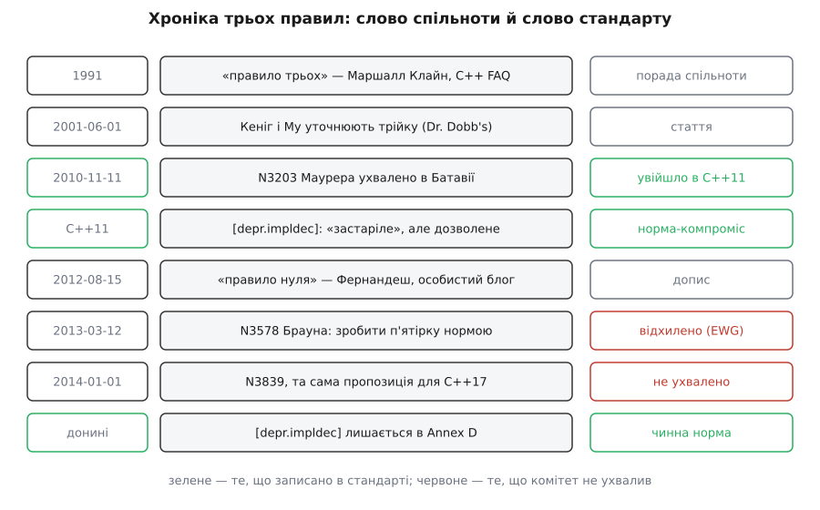

# 📜 Трійка, п'ятірка, нуль: хто назвав і що з цього стало нормою

Три найвідоміші поради про спеціальні функції С++ мають джерела дуже різної ваги: одна народилася у списку поширених питань, друга — у дописі в особистому блозі, третя була офіційно внесена до комітету й **не пройшла голосування**. Розрізняти ці ваги варто не з педантизму: компілятор виконує лише те, що записано в стандарті, а все інше живе рівно доти, доки його переказують одне одному.



*Зелене — те, що записано в стандарті; червоне — пропозиції, які комітет не ухвалив.*

## Ім'я, якого не було в жодному стандарті

Термін «rule of three» усталено приписують Маршаллові Клайну (Marshall Cline) і датують 1991 роком — тоді він почав вести C++ FAQ, збірку відповідей на питання з групи `comp.lang.c++`, яка потім розрослася до книжки «C++ FAQs» (Cline, Lomow, 1995). Доказовий статус тут варто назвати чесно: це **усталена вторинна атрибуція**. Її повторюють і Wikipedia, і документи комітету — зокрема Волтер Е. Браун (Walter E. Brown) у своєму папері пише дослівно: настанова «приписується Маршаллові Клайну, датована 1991 роком». Але ланцюжок посилань веде не до збереженого допису 1991 року, а до пізніших переказів. Ідея «якщо написав одну з трьох — напиши всі три» точно старша за будь-який стандарт С++ (перший, C++98, вийшов лише через сім років), і саме FAQ дав їй коротке ім'я, яке прижилося.

Важливо, чим ця настанова була за жанром. Не правилом мови, не діагностикою компілятора — **порадою в списку питань**. Формулювання «зазвичай», «імовірно», «майже завжди» в ній не пом'якшення, а точний опис ситуації: мова дозволяє написати одну з трьох функцій і мовчки згенерувати решту, а автор поради лише попереджає, що так робити майже ніколи не варто.

## Кеніг і Му: трійка — насправді два правила

1 червня 2001 року Ендрю Кеніг (Andrew Koenig) і Барбара Е. Му (Barbara E. Moo) опублікували в Dr. Dobb's Journal статтю «C++ Made Easier: The Rule of Three». Це первинне джерело, на яке потім посилатимуться папери комітету, і воно розщепило одну пораду на дві несиметричні:

- якщо клас має непорожній деструктор, йому майже завжди потрібні копіювальний конструктор і копіювальне присвоєння;
- якщо клас має нетривіальний копіювальний конструктор або присвоєння, йому зазвичай потрібні обидва ці члени **і** деструктор.

Різниця між «майже завжди» та «зазвичай» — не стилістика. Непорожній деструктор — це майже завжди звільнення ресурсу, а звільнення означає володіння, і почленне копіювання власника наперед хибне. Зворотний бік слабший: нетривіальне копіювання буває й там, де звільняти нічого — скажімо, клас, що веде лічильник створених екземплярів. Кеніг і Му першими проговорили, що трійка — не симетричний трикутник, а стрілка, у якої гострий кінець дивиться від деструктора.

## 2010, Батавія: комітет ледь не зробив пораду законом

Найцікавіше почалося, коли до мови додавали [переміщення](topic:cpp-standards/move-semantics) — передавання нутрощів об'єкта замість їх дублювання. Постало питання, за яких умов компілятор має сам породжувати переміщувальні функції, і воно виявилося вибухонебезпечним: якщо генерувати їх надто охоче, старий і правильний код C++03 почне мовчки поводитися інакше.

На нараду в Батавії (США, листопад 2010) винесли щонайменше чотири папери про це: «Implicit Move Must Go» Девіда Абрагамса (David Abrahams, N3153), «Removing Implicit Move Constructors and Move Assignment Operators» Ентоні Вільямса й Джейсона Мерріла (N3216) і дві роботи Б'ярне Стровструпа (Bjarne Stroustrup) — «To move or not to move» (N3174) та «Moving right along» (N3201). Ухвалили папір Єнса Маурера (Jens Maurer) «Tightening the conditions for generating implicit moves» (N3203, 2010-11-11) — саме він задав чинні умови генерації переміщень, а заразом переписав умови для копіювальних операцій. Наступної наради (Мадрид, 2011) формулювання ще підкрутили через остаточне вирішення проблеми CWG 1082.

Ось тут і був момент, коли трійка мало не стала нормою. Як згадує пізніше сам Браун, у ході тих обговорень комітет розглядав можливість **примусити** правило: оголосив одну з операцій — решту не генерувати взагалі. Перемогла обережність. Компроміс, який дожив до сьогодні, звучить так: генерація лишається, але позначається як застаріла. Ось цей уламок, розділ `[depr.impldec]` додатка D, у переказі:

> Неявне визначення копіювального конструктора як `= default` вважається застарілим, якщо клас має оголошене користувачем копіювальне присвоєння або оголошений користувачем деструктор. Те саме симетрично для копіювального присвоєння. У майбутній редакції цього стандарту такі неявні визначення можуть стати видаленими.

Тобто трійка потрапила в стандарт — але не як правило, а як **попередження про намір**. «Може стати видаленим» — і жодного зобов'язання. Про те, як узагалі влаштована ця машинерія паперів, нарад і голосувань, — окремо: [процес стандартизації](topic:cpp-standards/standardization-process).

## N3578: пропозиція перетворити пораду на норму

12 березня 2013 року Волтер Е. Браун вніс до WG21 папір **N3578 «Proposing the Rule of Five»** — коротку, на три сторінки, спробу закрити цю недомовку. Суть пропозиції в одному реченні з самого документа: *жодна копіювальна функція, переміщувальна функція чи деструктор не генерується компілятором, якщо бодай одна з цих функцій написана користувачем*.

Технічно зміна була крихітною. У двох абзацах стандарту (`[class.copy]/7` і `/18`) до переліку «якщо клас оголошує…» дописувалося «копіювальне присвоєння» й «деструктор», а речення про застарілість викреслювалося; розділ `[depr.impldec]` вилучався з додатка D цілком. Наслідок для програміста, однак, був радикальний: те, що доти було легальним із приміткою, ставало **помилкою компіляції**.

```cpp
struct Handle {
    ~Handle() { ::close(fd); }   // єдине, що написав автор класу
    int fd;
};

void f(Handle a) {
    Handle b = a;   // C++11 і донині: збирається (застаріле, але дозволене);
                    // за N3578: копіювальний конструктор ВИДАЛЕНО → помилка збирання
}                   // ~Handle двічі закриє той самий дескриптор
```

Різниця між «пригнічено» й «видалено» тут і є всім змістом паперу. Чинна мова цей код **приймає** — і платить за це подвійним закриттям дескриптора під час виконання. Пропозиція вимагала, щоб компілятор відмовився збирати його, поки автор не скаже вголос, чого хоче: `= delete`, `= default` чи власну реалізацію.

## Бристоль, 2013: чому проголосували проти

Пропозицію розглядала група еволюції мови (EWG) на нараді в Бристолі 2013 року й **проголосувала проти**. Це рідкісний випадок, коли протокол суперечки збережено детально: Браун переніс усі нотатки з вікі EWG у наступну редакцію свого паперу, тож видно не голий висновок, а самі аргументи.

Проти було, по суті, одне: **зламаний старий код**. Девід Вандевурде (Daveed Vandevoorde) з EDG зауважив, що їхній компілятор не може навіть *попереджати* про це застаріле правило — користувачі скаржаться, надто вже багато шуму. Вілле Воутілайнен (Ville Voutilainen) нагадав, що застарілість і вводили саме заради того, щоб нічого не ламати, — і що ламати зараз, мабуть, зарано. Вандевурде додав історичну міру: шлях від «застаріло» до «прибрано» для перетворення рядкових літералів у `char*` зайняв п'ятнадцять років, і люди все одно обурювалися. І найгостріше його заперечення: така зміна робить неправильними програми **валідні й добре спроєктовані** — лише тому, що дехто пише кепсько.

За були не менш вагомі голоси. Герб Саттер (Herb Sutter) наполягав, що випадкові копіювання — це не питання стилю, а **придатні для експлуатації діри в безпеці**, і що зміна полагодила б чимало поганого коду; водночас саме він турбувався про сторонні заголовки, які людина не має права правити. Й. К. ван Вінкел (J. C. van Winkel), який і доповідав папір, підсумував найточніше — і Вандевурде з ним погодився:

> Якби зламаний код не був міркуванням, ми б, найпевніше, мали ці правила.

Це і є справжня відповідь на питання «чому мова досі така». Не тому, що правило п'яти хибне, — а тому, що ціна переходу вища за виграш. Побічно тут виринає ще одна тема: чому зміна, яка додає класові оголошений деструктор, зачіпає не лише збирання, а й [двійкову сумісність](topic:cpp-standards/abi-stability-cpp) — Вандевурде згадав і це, щоправда сам же уточнив, що деструктори з `= default` проблем не створюють.

## Друга спроба й той самий результат

1 січня 2014 року Браун подав **N3839 «Proposing the Rule of Five, v2»** — той самий текст, ті самі два абзаци правок, тепер уже націлені на C++17. Нового в ньому три речі: анотація, повний протокол бристольської дискусії й пропозиція імені для макроса перевірки можливостей — `__cpp_rule_of_five`. Завершується папір не проханням, а закликом: нехай EWG вирішить, що для мови краще в довгій перспективі.

Не ухвалили й цього разу. Отже, у C++17, C++20, C++23 і в чинному робочому проєкті розділ `[depr.impldec]` стоїть на своєму місці в додатку D — так само застарілий і так само дозволений. Макроса `__cpp_rule_of_five` не існує. Правило п'яти лишилося тим, чим було правило трьох: **порадою, яку мова не змушує виконувати**. Єдиний слід у стандарті — примітка, що колись, можливо, це стане помилкою.

Практичну частину компроміс усе-таки виграв: попереджати навчилися компілятори, а не стандарт. MSVC має C5267 на цей самий випадок, Clang — `-Wdeprecated-copy`, GCC — те саме сімейство. Тобто рішення, від якого комітет відмовився, продавлюється через діагностику, яку кожен вмикає собі сам.

## Правило нуля: серпень 2012, особистий блог

Тим часом із зовсім іншого боку прийшла порада, яка виявилася впливовішою за обидва папери. 15 серпня 2012 року Р. Мартінью Фернандеш (R. Martinho Fernandes) опублікував у своєму блозі (flamingdangerzone.com; архівна копія — на `rmartinho.github.io`) допис «Rule of Zero». 22 листопада того самого року його передрукував офіційний блог isocpp.org — і це, попри назву сайту, теж не надало йому статусу норми: блог Standard C++ Foundation популяризує, а не ухвалює.

Формулювання Фернандеша ділить усі класи надвоє:

> Класи, що мають власні деструктори, копіювальні чи переміщувальні операції, повинні займатися **виключно володінням**. Усі інші класи не повинні мати власних деструкторів, копіювальних чи переміщувальних операцій.

Друга половина цього речення й була новиною. Перша — це переказ [RAII](topic:programming/raii), ідеї прив'язати звільнення ресурсу до деструктора, відомої з кінця 1980-х. А от вимога до **решти** класів мовчати — це вже висновок, який став можливим лише тоді, коли в стандартній бібліотеці з'явилися готові дрібні власники: `unique_ptr`, повноцінно переміщувані `vector` і `string`. До [C++11](topic:cpp-standards/cpp11-cpp14) правило нуля просто не мало на що спертися — писати п'ятірку доводилося кожному, хто тримав ресурс.

Хронологія тут промовиста, і саме як хронологія, без причинності: правило нуля сформульовано за пів року **до** паперу Брауна. Тобто поки комітет вагався, чи змушувати правильно писати п'ятірку, спільнота вже переказувала одне одному, як її здебільшого не писати взагалі. Стверджувати, що одне вплинуло на друге, підстав немає — N3578 на Фернандеша не посилається; це збіг, який добре показує, наскільки різні швидкості в блогу й у комітету. Про сам поділ типів на власників і спостерігачів — окремо: [семантика володіння](topic:cpp-standards/ownership-semantics).

## Заперечення Маєрса

13 березня 2014 року Скотт Маєрс (Scott Meyers) опублікував допис «A Concern about the Rule of Zero» — найвідоміше заперечення до правила нуля, і воно не про володіння, а про **тишу**. Візьміть клас, що чесно дотримується нуля. Додайте йому деструктор — навіть тимчасово, навіть заради одного рядка налагоджувального друку. Переміщувальні операції миттю перестають оголошуватися, і код, який раніше переміщував, починає копіювати. Мовчки, без жодного попередження, лише повільніше.

Маєрсова порада — писати п'ять `= default` явно замість того, щоб не писати нічого. Так поведінка класу перестає залежати від того, чи хтось не додав деструктора. Ця порада не витіснила правила нуля, але оголила його ціну: нуль — це не «нічого не думати», а «думати один раз, свідомо».

Своє місце в напівофіційних документах правила знайшли 2015 року, коли Стровструп і Саттер опублікували [C++ Core Guidelines](topic:cpp-standards/core-guidelines): C.20 «якщо можеш не визначати операцій за замовчуванням — не визначай» із приміткою «це відоме як правило нуля» і C.21 «якщо визначаєш або видаляєш одну з них — визнач або видали всі». Настанови теж не є частиною стандарту, зате їх виконують статичні аналізатори — і в цьому сенсі порада 1991 року нарешті отримала того, хто за нею стежить.

## Кому вірити на слово

Розкладемо джерела за вагою, бо в текстах їх постійно змішують:

- **Правило трьох, 1991, Клайн** — усталена вторинна атрибуція; ім'я безумовно прижилося, точна дата й формулювання походять із переказів, а не зі збереженого першоджерела.
- **Кеніг і Му, Dr. Dobb's, 2001-06-01** — первинне джерело, доступне й цитоване комітетом; саме звідти точне розщеплення трійки на два несиметричні правила.
- **N3203 Маурера, ухвалено в Батавії 2010** — норма: чинні умови генерації переміщень у C++11 узяті звідси.
- **`[depr.impldec]`** — норма, але слабка: позначка «застаріле» без жодних наслідків для збирання. Живе в додатку D від C++11 донині.
- **N3578 / N3839 Брауна, 2013 і 2014** — документи комітету, **відхилені**. Посилатися на них як на «стандарт вимагає» — помилка, що трапляється часто.
- **Правило нуля, Фернандеш, 2012-08-15** — авторський допис у блозі, передрук на isocpp.org 2012-11-22. Статусу норми не має й ніколи не мав.

Практичного висновку з цієї історії рівно один, зате твердий: якщо ваш клас оголошує деструктор і мовчки покладається на згенеровані копіювальні операції — компілятор вас пропустить, стандарт із C++11 вважає це застарілим, а комітет двічі відмовився зробити це помилкою. Відповідальність за цей код лежить не на мові.
