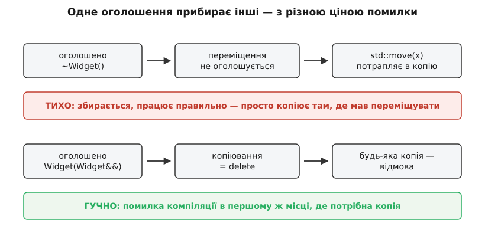
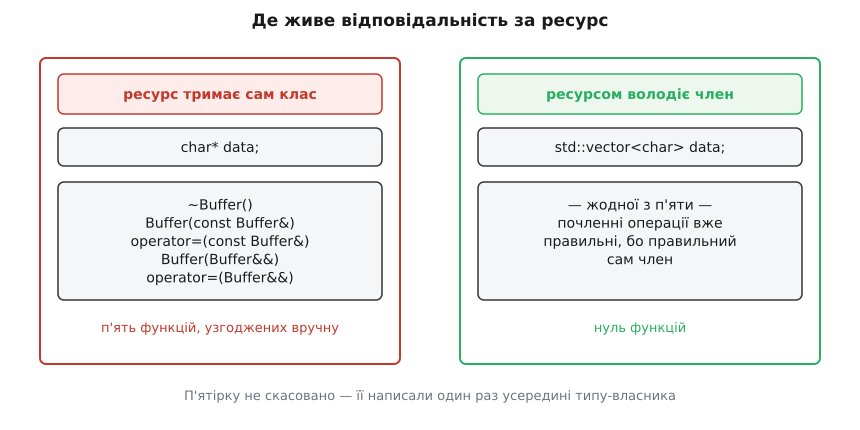

# Правило п'яти й правило нуля

<preknowlist>
- [Категорії значень: lvalue, prvalue, xvalue](topic:cpp-standards/value-categories) — чим вираз із іменем відрізняється від тимчасового; саме категорія аргументу вирішує, копію чи переміщення викличуть.
- [Семантика переміщення і rvalue-посилання](topic:cpp-standards/move-semantics) — що означає `T&&`, що насправді робить `std::move` і чому переміщення забирає нутрощі, а не дублює їх.
- [Час життя об'єкта](topic:cpp-standards/object-lifetime) — коли об'єкт народжується, коли гине і в який момент спрацьовує деструктор.
- [RAII: ресурс прив'язаний до часу життя](topic:programming/raii) — ідея довірити звільнення ресурсу деструкторові замість ручного виклику.
- [Купа](topic:programming/heap-dynamic-memory) — динамічна пам'ять, `new`/`delete` і те, чому повторне звільнення руйнує службові структури алокатора.
</preknowlist>

Ось клас на дванадцять рядків, у якому немає жодної помилки — і який ламає програму на другому ж рядку використання.

```cpp
class Buffer {
    char*  data;
    size_t size;
public:
    explicit Buffer(size_t n) : data(new char[n]), size(n) {}
    ~Buffer() { delete[] data; }
};

void demo() {
    Buffer a(4);
    Buffer b = a;      // ← ось тут усе вирішується
}                      // ← ось тут усе падає
```

Рядок `Buffer b = a;` компілюється без єдиного попередження. На виході з `demo()` гинуть обидва об'єкти, кожен виконує свій деструктор, кожен виконує `delete[] data` — і обидва передають алокаторові **одну й ту саму адресу**. Друге звільнення затирає службові структури купи; програма падає тут або, що гірше, через хвилину в зовсім іншому місці. Це [невизначена поведінка](topic:programming/undefined-behavior) в чистому вигляді.

![Два об'єкти Buffer із однаковим значенням data вказують на один блок у купі; обидва деструктори виконують delete[] за однією адресою](/reference/cpp-standards/language/rule-of-five-zero/img/shallow-copy.svg)
*Компілятор скопіював члени по одному: число `size` і число `data`. Друге число — адреса, і після копіювання на один блок купи претендують два об'єкти. Кожен чесно звільняє «свій» блок, але блок один.*

## Компілятор зробив рівно те, що обіцяв

Спокуса сказати «компілятор зіпсував мій клас» велика, але хибна. Коли в класі немає копіювального конструктора, мова оголошує його сама, і його тіло визначене абсолютно точно: **скопіювати кожен нестатичний член окремо, у порядку оголошення**. Це називають почленним копіюванням (англ. *memberwise copy*).

Для `size` таке копіювання ідеальне: число `4` перетворилося на число `4`, і другий об'єкт має рівно те саме, що перший. Для `data` воно теж ідеальне — **як для числа**. Адреса `0x1000` перетворилася на адресу `0x1000`; жодного правила не порушено.

Розходження не в механіці, а в сенсі. У типі `char*` **немає нічого**, що позначало б володіння. Той самий `char*` буває адресою блока, який об'єкт зобов'язаний звільнити; буває вказівником на чужий буфер, до якого об'єкт лише зазирає; буває позицією всередині рядка. Компілятор бачить машинну адресу й копіює машинну адресу — це все, що він може зробити, не читаючи ваших думок.

А ваші думки в цьому класі записані рівно в одному місці — у деструкторі. `delete[] data` — це і є заява: **цей об'єкт володіє блоком і відповідає за його звільнення**. Заява правдива, деструктор правильний. Неправильно те, що про неї не знає жодна інша операція над типом.

Звідси перший висновок, і він причинний, а не рекомендаційний: **володіння — властивість типу, а не окремої функції**. Якщо об'єкт володіє ресурсом, це стосується кожної операції, яка створює новий об'єкт із наявного або замінює вміст наявного. Написати одну таку операцію вручну, а решту лишити на почленному копіюванні — те саме, що змінити валюту в одній колонці таблиці, а решту лишити в старій.

## Три операції на одне питання

У класі, що володіє ресурсом, це питання ставлять три операції.

**Деструктор** — «як ресурс відпускають». **Копіювальний конструктор** — «що означає зробити другий об'єкт із наявного»: якщо володіння одноосібне, то новому об'єктові потрібен власний ресурс, отже блок треба продублювати. **Копіювальне присвоєння** — «що означає замінити вміст об'єкта, який уже живе»; воно найважче, бо мусить зробити дві речі одночасно: позбутися старого ресурсу й набути новий.

Це і є **правило трьох** (англ. *rule of three*): якщо класу знадобилася хоч одна з цих трьох функцій, майже напевно потрібні всі три. Логіка проста — потреба написати одну з них означає, що поведінка за замовчуванням для цього типу неправильна; а неправильна вона рівно з однієї причини — тип володіє чимось, чого не можна дублювати числом. Ця причина однакова для всіх трьох.

Копіювальне присвоєння варте окремої уваги, бо в ньому ховається пастка, яку не видно з логіки «звільнити старе, взяти нове»:

```cpp
Buffer& operator=(const Buffer& other) {
    delete[] data;                      // 1. позбулися старого
    data = new char[other.size];        // 2. взяли новий
    std::memcpy(data, other.data, other.size);
    size = other.size;
    return *this;
}
```

Виглядає правильно й у більшості випадків працює. Але спробуйте `a = a`. Крок 1 звільняє блок; крок 3 читає `other.data`, а `other` — це той самий `a`, у якого блок уже звільнений. Копіюємо зі звільненої пам'яті. Самоприсвоєння рідко пишуть буквально, зате воно легко виникає непрямо: `v[i] = v[j]` за рівних індексів, `*p = *q` за однакових вказівників, елементи в алгоритмі сортування. Класична латка — перевірка `if (this == &other) return *this;` на початку. Вона працює, але лікує симптом: надійніше побудувати присвоєння так, щоб самоприсвоєння взагалі не було окремим випадком.

## C++11 додає ще дві, і не заради швидкості

До 2011 року трьох було досить: створити новий об'єкт із наявного можна було рівно одним способом — скопіювати. C++11 додав другий: [переміщення](topic:cpp-standards/move-semantics) — «забрати нутрощі й лишити джерело порожнім, але справним».

Легко подумати, що переміщення — це просто швидша копія й тому необов'язкове. Насправді воно вирішує задачу, якої копіювання не вміє розв'язати взагалі. Візьміть тип із **одноосібним володінням**: [`unique_ptr`](topic:cpp-standards/unique-ptr), відкритий файловий дескриптор, захоплений м'ютекс, запущений потік. Скопіювати такий об'єкт неможливо не з міркувань швидкості, а за визначенням: другого такого ж дескриптора не існує. Але **передати** володіння — з функції назовні, всередину контейнера, з одного власника до іншого — потрібно постійно. Переміщення й є цією передачею; для одноосібних власників воно єдина операція, що взагалі має сенс.

Отже, операцій стає п'ять: деструктор, копіювальний конструктор, копіювальне присвоєння, переміщувальний конструктор, переміщувальне присвоєння. Їх називають **спеціальними функціями-членами** (англ. *special member functions*) — спеціальними саме тому, що компілятор оголошує їх сам, коли ви цього не зробили. **Правило п'яти** (англ. *rule of five*) каже те саме, що й правило трьох, лише про п'ятірку: узявшись за одну — розберіться з усіма.

Формально таких функцій шість: до п'ятірки додається конструктор за замовчуванням, який компілятор теж оголошує сам і теж перестає оголошувати, щойно ви напишете будь-який власний конструктор. Але в правило п'яти він не входить, і не випадково: він відповідає на інше питання — «як виглядає порожній об'єкт», а не «що означає володіти цим ресурсом». П'ятірка тримається купи саме тому, що відповідає на одне питання п'ять разів.

Як народилася ця вимога — від сформульованого 1991 року правила трьох до правила нуля 2012-го — і яку роль тут відіграла окрема пропозиція до комітету, яку так і не ухвалили, розказано в [історії правил трьох, п'яти й нуля](topic:cpp-standards/rule-of-five-zero/hist-three-five-zero.md).

## Головне: одне ваше оголошення прибирає інші

Правило п'яти легко сприйняти як пораду досвідченого колеги, якою в поспіху можна знехтувати. Правилом його робить механіка мови: **оголошення однієї спеціальної функції змінює те, які інші компілятор оголосить за вас**. Не тіло змінює — саму наявність.

Три ланцюжки, які треба знати напам'ять:

- **оголосили деструктор** → переміщувальний конструктор і переміщувальне присвоєння **не оголошуються зовсім**;
- **оголосили будь-яку копіювальну операцію** → переміщувальні знову ж таки не оголошуються;
- **оголосили будь-яку переміщувальну операцію** → копіювальні оголошуються **як видалені** (`= delete`).

Правило, за яким мова їх пригнічує, те саме, що й у правила п'яти, тільки застосоване компілятором: якщо ви подбали про якийсь із аспектів життєвого циклу самі, значить, тип нетривіальний, і вгадувати решту небезпечно.

Зверніть увагу на ключове слово — **оголосили**, не «написали тіло». `~Widget() = default;` у визначенні класу — це повноцінне оголошення, і воно глушить переміщення так само, як написаний вручну деструктор. Тонка, але дорога різниця: `= default` усередині класу робить функцію *оголошеною користувачем* (user-declared), і саме цей статус вимикає генерацію переміщень.

Тепер найважливіше — **наслідки цих двох пригнічень різні за гучністю**.


*Втрата переміщень непомітна: коли переміщувального конструктора немає, `std::move(x)` дає rvalue, яке чудово зв'язується з `const Widget&`, і виклик іде в копіювальний конструктор. Втрата копій, навпаки, зупиняє збірку в першому ж місці, де копія потрібна.*

Розберемо тиху половину до кінця, бо саме вона з'їдає швидкодію в реальних проєктах. `std::move(x)` не переміщує — він лише перетворює вираз на rvalue. Далі працює [розв'язання перевантажень](topic:cpp-standards/overload-resolution): серед доступних конструкторів шукають найкращий для rvalue-аргумента. Якщо `Widget(Widget&&)` є, виграє він. Якщо його немає — залишається `Widget(const Widget&)`, і rvalue прекрасно зв'язується з посиланням на `const`. Код збирається, поводиться правильно, тести проходять. Просто там, де мала статися передача вказівника, відбувається глибоке копіювання мегабайтного вектора.

Достатньо одного нешкідливого рядка:

```cpp
class Report {
    std::vector<Row> rows;      // мільйон рядків
    std::string      title;
public:
    ~Report() = default;        // «просто для симетрії» — і переміщень більше немає
};
```

Автор написав `= default`, щоб деструктор було видно в коді. Наслідок: `Report` втратив обидві переміщувальні операції, і кожне повернення такого об'єкта з функції, кожне `push_back` у вектор звітів, кожне складання їх у контейнер копіює мільйон рядків. Ніде жодної помилки, лише незрозуміло куди подітий час.

> 🔧 **Навіщо це.** Практичний висновок: **порожній деструктор у класі — це не нейтральний коментар, а зміна поведінки типу**. Якщо деструктор класу справді нічого не робить, його не треба оголошувати взагалі. Якщо оголошувати доводиться (віртуальний у базі, потреба сховати визначення в `.cpp`), то поруч мусять з'явитися всі чотири решта — хоч би й `= default`. Компілятори підказують: Clang і GCC мають попередження `-Wdeprecated-copy-dtor`, MSVC — `C5267`.

Є ще одна асиметрія, історично зумовлена. Оголошений деструктор **не** прибирає копіювальні операції — вони й далі генеруються, інакше зламалася б уся кодова база, написана до C++11. Проте стандарт позначив цю генерацію **застарілою** (англ. *deprecated*) ще в C++11 і не скасував донині: формально мова попереджає, що клас із власним деструктором майже напевно не має копіюватися почленно, але з сумісності копії все ще робить. Саме цей залишок і вбиває `Buffer` із початку статті: деструктор ми написали, копіювальний конструктор нам згенерували.

Повна таблиця — усі шість спеціальних функцій, що саме кожне оголошення вмикає, вимикає й видаляє, у чому різниця між «оголошено», «оголошено як `= default`» і «визначено користувачем» — винесена окремо: [таблиця генерації спеціальних функцій](topic:cpp-standards/rule-of-five-zero/api-special-members.md).

## П'ятірка, написана як слід

Тепер зберемо `Buffer` повністю. Це той рідкісний випадок, коли клас справді має право володіти сирим ресурсом: він і є тим самим типом-власником, за спиною якого потім ховатимуться всі інші.

**Клас із одноосібним володінням блоком пам'яті, усі п'ять операцій.**

```cpp
#include <algorithm>
#include <cstring>
#include <utility>

class Buffer {
    char*  data = nullptr;
    size_t size = 0;
public:
    explicit Buffer(size_t n) : data(new char[n]), size(n) {}

    // 1. деструктор: delete[] на nullptr — законна дія без наслідків
    ~Buffer() { delete[] data; }

    // 2. копіювальний конструктор: власний блок для нового об'єкта
    Buffer(const Buffer& other)
        : data(new char[other.size]), size(other.size) {
        std::memcpy(data, other.data, size);
    }

    // 3. копіювальне присвоєння: спершу здобути, потім віддати старе
    Buffer& operator=(const Buffer& other) {
        char* fresh = new char[other.size];      // якщо кине — стан незмінний
        std::memcpy(fresh, other.data, other.size);
        delete[] data;
        data = fresh;
        size = other.size;
        return *this;
    }

    // 4. переміщувальний конструктор: забрати й знеструмити джерело
    Buffer(Buffer&& other) noexcept
        : data(std::exchange(other.data, nullptr)),
          size(std::exchange(other.size, 0)) {}

    // 5. переміщувальне присвоєння
    Buffer& operator=(Buffer&& other) noexcept {
        if (this != &other) {
            delete[] data;
            data = std::exchange(other.data, nullptr);
            size = std::exchange(other.size, 0);
        }
        return *this;
    }
};
```

Тут кожен рядок відповідає на щось із сказаного вище, і варто пройтися по чотирьох неочевидних місцях.

**Порядок дій у копіювальному присвоєнні перевернуто.** Спершу виділяємо новий блок і лише потім звільняємо старий. Це не косметика: якщо `new` кине `std::bad_alloc`, об'єкт лишиться рівно таким, яким був, — цілим і придатним. Порядок «спершу звільнити» у разі виключення лишив би об'єкт із висячим вказівником. Заразом зникає й проблема самоприсвоєння: `a = a` спокійно скопіює блок у новий, звільнить старий і поставить новий — марна робота, але не катастрофа. Формально це [сильна гарантія безпеки винятків](topic:cpp-standards/exception-safety-guarantees): операція або відбулася повністю, або не змінила нічого.

**Джерело переміщення мусить лишитися придатним до знищення.** `std::exchange(other.data, nullptr)` повертає старе значення й кладе в член `nullptr` — джерело перестає володіти блоком. Це не ввічливість: деструктор джерела все одно виконається, і якщо не обнулити вказівник, ми повернемося до подвійного звільнення, лише хитріше замаскованого. Загальне правило переміщення — джерело лишається у **справному, але невизначеному стані**: його можна знищити й можна присвоїти йому нове значення, а от читати з нього щось осмислене не можна.

**Переміщувальне присвоєння перевіряє `this != &other`.** Самопереміщення `a = std::move(a)` виглядає безглуздо, проте виникає в узагальнених алгоритмах, які не знають, що обидва їхні аргументи посилаються на один об'єкт. Без перевірки ми б звільнили блок, а потім забрали в нього ж уже звільнену адресу.

**`noexcept` на переміщеннях — не прикраса, а умова, за якої їх узагалі використають.** `std::vector` під час зростання перерозподіляє елементи в новий блок. Якщо на середині цього перенесення переміщення кине виняток, вектор опиниться в безнадійному становищі: частина елементів уже вихолощена в старому блоці, повернути все як було неможливо. Тому реалізація перевіряє `std::move_if_noexcept`: переміщує елементи, лише якщо переміщувальний конструктор оголошено `noexcept`, а інакше **копіює** — повільно, зате з можливістю відкотитися. Забутий `noexcept` дає той самий тихий провал швидкодії, що й забуте оголошення переміщень; докладніше про сам механізм обіцянки — у [noexcept](topic:cpp-standards/noexcept).

Є й компактніша реалізація присвоєнь — прийом «копіюй і обмінюй», у якому копіювальне й переміщувальне присвоєння зводяться до однієї функції, самоприсвоєння стає безпечним за побудовою, а сильна гарантія випливає сама. У нього своя ціна й свої межі, тому він розібраний окремо, з кодом і пастками: [копіюй і обмінюй](topic:cpp-standards/rule-of-five-zero/proj-copy-and-swap.md).

## `= default` і `= delete`: сказати вголос те, що мала на увазі мова

C++11 дав спосіб оголосити спеціальну функцію, не пишучи тіла. `= default` каже: «оголошую цю функцію, а поведінку хочу стандартну, почленну». `= delete` каже: «функція існує, але викликати її не можна» — і будь-яка спроба стає помилкою компіляції, а не мовчазним вибором іншого перевантаження.

Разом із правилом п'яти це дає точний словник намірів:

```cpp
// тип, який можна лише переміщувати (одноосібне володіння)
class Connection {
public:
    ~Connection();
    Connection(const Connection&)            = delete;
    Connection& operator=(const Connection&) = delete;
    Connection(Connection&&) noexcept;
    Connection& operator=(Connection&&) noexcept;
};

// тип, який не рухається взагалі: ані копії, ані переміщення
class Registry {
public:
    Registry(const Registry&)            = delete;
    Registry& operator=(const Registry&) = delete;
};
```

Формально видаляти копії в `Connection` не обов'язково: оголошені переміщення видалили б їх і самі. Але явний `= delete` — це документація, яку перевіряє компілятор: читач бачить намір, а не мусить пригадувати ланцюжок пригнічень. Те саме з `= default`: коли ви пишете деструктор у базовому класі й одразу після нього чотири рядки `= default`, ви не «повторюєте очевидне» — ви повертаєте те, що вимкнув попередній рядок.

Одна засідка на цьому шляху існує. `= default` **у визначенні класу** й `= default` **у файлі реалізації** — не те саме. Перший варіант лишає функцію тривіальною, тобто тип може лишитися тривіально копійовним; другий рахується як **визначений користувачем** (user-provided), тривіальність зникає — а разом із нею й бібліотечні оптимізації, що підміняють поелементне копіювання суцільним `memmove`, та вигідніша передача такого типу через регістри за угодою про виклик. Виносити `= default` у `.cpp` є сенс лише тоді, коли це потрібно з іншої причини, — і така причина справді трапляється.

## Де правило п'яти виринає само

**Поліморфна база.** Клас, який видаляють через вказівник на базу, зобов'язаний мати віртуальний деструктор — інакше спрацює не той деструктор і похідна частина не звільниться (окрема тема: [віртуальний деструктор і поліморфне видалення](topic:cpp-standards/virtual-destructor)). Але `virtual ~Base() = default;` — це оголошений деструктор, отже переміщення бази щойно зникли. Тому база, задумана як «порожній інтерфейс», раптом потребує повного набору `= default`. Альтернатива, яку часто обирають, — зробити деструктор бази **захищеним і невіртуальним**: тоді видалити об'єкт через базовий вказівник просто не можна, а віртуальність не потрібна.

**PIMPL.** Ідіома [PIMPL](topic:cpp-standards/pimpl) ховає реалізацію за `std::unique_ptr<Impl>`, де `Impl` у заголовку лише оголошений. Деструктор `unique_ptr` мусить бачити повний тип, щоб знати, як знищити об'єкт, — а в заголовку його немає. Тому деструктор власника доводиться оголосити в заголовку й **визначити у `.cpp`**, після визначення `Impl`. Оголошення деструктора вимикає переміщення — і клас, який мав бути дешево переміщуваним (усередині ж один вказівник!), тихо стає таким, що копіюється. Точніше, він узагалі перестає копіюватися, бо `unique_ptr` некопійовний, і код просто не збереться. Лікується там само, де `.cpp`: оголосити переміщення в заголовку, визначити їх `= default` у файлі реалізації.

**Клас із посиланням на самого себе.** Якщо об'єкт зберігає вказівник на власний член — вбудований буфер, вузол у списку, кеш ітератора, — почленне копіювання переносить цей вказівник у копію без змін, і копія вказує на **чужий** буфер. Ніякий `unique_ptr` тут не рятує: інваріант порушує сама почленність. Такий клас мусить писати копіювання й переміщення вручну, полагоджуючи внутрішні вказівники.

## Правило нуля: перенести п'ятірку туди, де вона одна

Тепер погляньмо на все сказане з іншого боку. Написати п'ять узгоджених функцій нескладно — складно **тримати їх узгодженими роками**. Додали члену `std::string name` — і мусите згадати про нього в чотирьох місцях із п'яти. Забули в одному — дістали клас, який копіюється майже правильно.

Питання, яке варто поставити: а чому цих класів так багато? Погляньте на `Report` вище — у нього немає жодного сирого ресурсу. Вектор і рядок уміють копіюватися, переміщуватися й прибирати за собою самостійно. Почленне копіювання такого класу **правильне** — воно викличе копіювальний конструктор вектора, а той зробить усе як треба. Почленне переміщення так само правильне. Тобто автоматика компілятора помиляється не тому, що вона дурна, а рівно тоді, коли **хоч один член не вміє відповідати за себе сам**.


*Обидва класи роблять те саме. Різниця в тому, де записана відповідь на питання «що означає копіювати цей ресурс»: у першому — п'ять разів у кожному класі, що тримає буфер; у другому — один раз усередині `std::vector`, і всі його користувачі отримують правильну поведінку задарма.*

Звідси **правило нуля** (англ. *rule of zero*): клас, який не володіє ресурсом безпосередньо, **не повинен оголошувати жодної з п'яти операцій**. А клас, який володіє, має володіти **рівно одним** ресурсом і не робити більше нічого.

Друга половина формулювання не менш важлива за першу. Правило нуля не скасовує п'ятірки й не робить її непотрібною — воно **розділяє відповідальності**. Ресурси в програмі є, і хтось мусить написати для них деструктор і чотири супутні операції. Але цей хтось — маленький спеціалізований тип, у якого немає іншої роботи: `std::unique_ptr` з потрібним видалячем, `std::vector`, `std::string`, [`shared_ptr`](topic:cpp-standards/shared-weak-ptr) або власна обгортка на десять рядків для дескриптора чи хендла. Усі інші класи — а їх у проєкті переважна більшість — складаються з таких членів і не оголошують нічого.

Перепишімо `Buffer` за цим правилом:

```cpp
class Buffer {
    std::vector<char> data;
public:
    explicit Buffer(size_t n) : data(n) {}
    // жодної спеціальної функції: усі п'ять згенеровано, і всі п'ять правильні
};
```

Копіювання глибоке, переміщення дешеве й `noexcept`, звільнення автоматичне, самоприсвоєння безпечне, сильна гарантія на присвоєнні — усе те, що ми вручну складали з двадцяти рядків, тепер узято з `std::vector`, який пройшов через мільйони проєктів. І коли завтра до класу додадуть ще три члени, нічого правити не доведеться: почленні операції охоплять нові члени автоматично.

> 🔧 **Навіщо це.** У рев'ю коду це дає просте питання до будь-якого класу з написаною спеціальною функцією: **яким саме ресурсом ти володієш і чому не можеш віддати його готовому типові-власнику?** Якщо переконливої відповіді немає — клас треба переписати на членах-власниках і викинути всі п'ять функцій. Якщо відповідь є, клас має скоротитися до самого володіння: жодної бізнес-логіки поруч із `delete`.

## Межа правила нуля

Правило нуля описують так впевнено, що виникає враження, ніби п'ятірка потрібна лише авторам стандартної бібліотеки. Це не так, і межу варто окреслити чесно.

Правило нуля **не працює**, коли клас має бути поліморфною базою: деструктор там доводиться оголошувати, і разом із ним доводиться повертати решту. Не працює для PIMPL із неповним типом — з тієї ж причини. Не працює для класу з внутрішнім самопосиланням. Не працює, коли тип **навмисно** має бути некопійовним: тут потрібен явний `= delete`, а не мовчазна відсутність оголошень.

І окремий випадок, у якому нуль формально дотриманий, а помилка є: клас із **невласницьким** сирим вказівником. Оголошувати п'ятірку йому не треба — почленне копіювання адреси якраз і є правильною семантикою «дивитися на чуже». Але копія об'єкта тепер живе своїм життям, і ніщо не гарантує, що спостережуваний об'єкт переживе її; звідси [висячі посилання](topic:cpp-standards/dangling-references). Правило нуля прибирає роботу з ресурсами, а не питання часу життя.

## Що з цього виходить

Число «п'ять» у назві виглядає як довільний список, який треба вивчити. Насправді воно — наслідок одного факту: **володіння ресурсом неподільне**. Створення другого об'єкта, передача володіння, заміна вмісту й кінець життя — це чотири моменти, у яких доля ресурсу вирішується, плюс деструктор, який усе замикає; відповідь на всі має бути одна й та сама, інакше об'єкти домовляються між собою по-різному про той самий блок пам'яті. Компілятор пригнічує генерацію не з примхи, а тому, що ваша перша написана вручну функція — це сигнал: «тут звичайна відповідь неправильна», а мовчки вигадувати решту відповідей після такого сигналу небезпечно.

Тому обидва правила — це одне правило, сказане з двох боків. **Або п'ять, або жодної.** Класів другого роду в здоровому проєкті має бути дев'яносто дев'ять зі ста.
