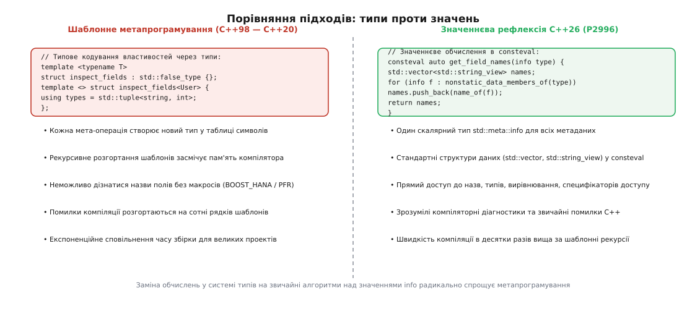
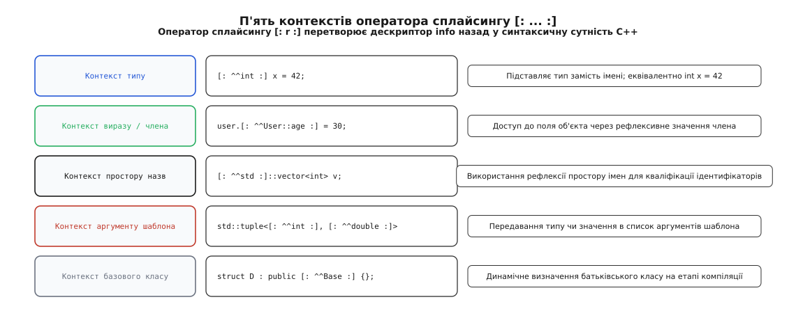
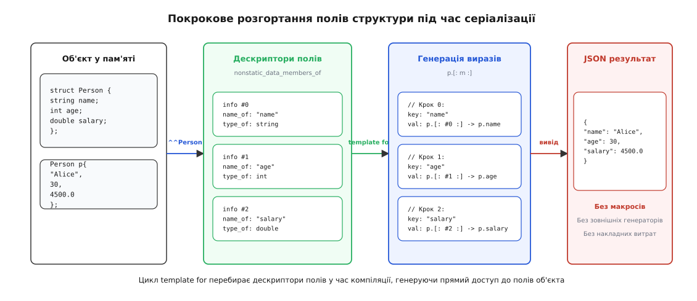

# Статична рефлексія C++26: оператор ^^, splice і consteval-метафункції

<preknowlist>
- [Обчислення під час компіляції: constexpr та consteval](book:cpp-standards/constexpr-and-consteval) — як працює обчислювач сталого часу в компіляторі та чому `consteval` гарантує виконання лише під час трансляції.
- [Шаблони: параметризація типом](book:cpp-standards/templates-basics) — як з одного узагальненого опису компілятор створює сімейство конкретних типів і функцій.
- [Шаблони змінної арності й вирази згортки](book:cpp-standards/variadic-and-folds) — пакети параметрів `Args...` та синтаксис розгортання згортки `(... + args)`.
- [if constexpr: гілка, якої не існує](book:cpp-standards/constexpr-if) — відсікання неактивних гілок коду на етапі компіляції на основі константних умов.
- [Структурне зв'язування](book:cpp-standards/structured-bindings) — декомпозиція кортежів та агрегатів через `auto [a, b]` і межі його застосовності для інтроспекції.
- [Динамічна ідентифікація типів (RTTI)](book:cpp-standards/rtti-and-dynamic-cast) — ціна рантайм-ідентифікації через `typeid` та `dynamic_cast`, відсутність інформації про поля та функції.
</preknowlist>

Коли компілятор C++ завершує синтаксичний і семантичний аналіз структури `struct User { std::string name; int age; double salary; };`, він знає про неї абсолютно все: точні імена полів, їхні типи, порядок оголошення, специфікатори доступу, вирівнювання та точні зміщення в байтах. Але в кінцевий машинний код потрапляє лише «сліпе» двійкове представлення: три зміщення від базового вказівника (0, 32, 40 байтів) і таблиця адрес. Якщо програмі потрібно перетворити цей об'єкт на JSON-рядок, записати в базу даних або серіалізувати в двійковий пакет, мова не надає розробникові жодного стандартного механізму запитати в компілятора: «які поля є в цій структурі й як вони називаються?».

Усі відомості про структуру програми, ретельно зібрані компілятором під час парсингу, просто знищуються перед фазою кодогенерації. У результаті програмісти десятиліттями були змушені дублювати цю інформацію вручну або винаходити дорогі обхідні шляхи, кожен із яких суперечив фундаментальним принципам чистоти та ефективності C++.

Статична рефлексія (від лат. *reflectere* — відображати, відбивати) стандарту C++26 розв'язує цю фундаментальну проблему: вона відкриває безпечний, типізований доступ до внутрішніх метаданих компілятора безпосередньо під час збірки програми без жодних накладних витрат у час виконання.

---

## Чотири сурогати: як жили без рефлексії 30 років

Неможливість дослідити структуру типів засобами самої мови породила чотири інженерні компроміси, на яких тримався весь код серіалізації, інтроспекції та об'єктно-реляційного відображення (ORM) у C++:

```cpp
struct Account {
    int id;
    std::string owner;
    double balance;
};
```

1. **Ручне копіювання полів (Boilerplate):**
   Розробник власноруч пише функції серіалізації `to_json` та `from_json`, перелічуючи кожне поле:
   ```cpp
   void to_json(json& j, const Account& a) {
       j["id"] = a.id;
       j["owner"] = a.owner;
       j["balance"] = a.balance;
   }
   ```
   Якщо до структури додають четверте поле (наприклад, `bool is_blocked`), але розробник забуває додати його у функцію `to_json`, код компілюється без жодного попередження. Виникає німа помилка розсинхронізації даних, яку неможливо виявити статичними аналізаторами.

2. **Макроси адаптації (X-Macros, Boost.Describe, nlohmann/json):**
   Поля структури дублюються у виклику макроса: `NLOHMANN_DEFINE_TYPE_NON_INTRUSIVE(Account, id, owner, balance)`. Препроцесор генерує потрібні перевантаження функцій. Проте макроси ламають автодоповнення та навігацію в IDE, не знають про простори назв, призводять до багатометрових повідомлень про помилки в разі синтаксичної помилки й не дозволяють адаптувати сторонні типи з приватними полями чи складними конструкторами.

3. **Зовнішні генератори коду (Qt moc, Protocol Buffers, FlatBuffers):**
   Опис структури виноситься в окремий файл схеми (`.proto`, `.fbs`) або розмічається макросами `Q_PROPERTY`, після чого зовнішня утиліта сканує файли й генерує додаткові `.cpp`-файли. Це ускладнює систему збірки (CMake), створює фальшиві проміжні файли, сповільнює процес компіляції та створює ризик розсинхронізації між схемою й вихідним кодом.

4. **Шаблонні хаки структурного зв'язування (Boost.PFR / magic_get):**
   За допомогою нетипізованого структурного зв'язування `auto [a, b, c] = obj` бібліотека деструктурує об'єкт у кортеж посилань. Але цей підхід працює виключно для простих відкритих агрегатів, взагалі не знає імен полів (повертає лише індекси 0, 1, 2), не бачить методів та атрибутів і створює гігантські глибини інстанціювання шаблонів, які перевантажують компілятор.

А що ж динамічна ідентифікація типів під час виконання — [RTTI](book:cpp-standards/rtti-and-dynamic-cast)? Оператор `typeid` та структури `std::type_info` містять лише зашифроване ім'я самого класу (*mangled name*). Вони не містять жодної інформації про поля, методи чи переліки, вимагають поліморфних класів із таблицями віртуальних методів (`vtable`) і створюють постійні накладні витрати на пам'ять.

Для C++ був потрібен принципово інший інструмент: повна інтроспекція (від лат. *introspicere* — дивитися всередину) структури коду, яка виконується виключно на етапі компіляції, не споживає жодного байта пам'яті в бінарному файлі й не уповільнює збірку мільйонами шаблонних типів.

---

## Анатомія компілятора: де губиться інформація про структуру

Щоб зрозуміти, чому рефлексія в C++ реалізована саме так, розглянемо внутрішній конвеєр трансляції. Компілятор проходить кілька послідовних фаз:

1. **Лексичний та синтаксичний аналіз:** Текст коду розбивається на токени та перетворюється на абстрактне синтаксичне дерево (AST). У цьому дереві кожен клас, поле, метод чи специфікатор представлені окремими вузлами з повними іменами та файловими координатами.
2. **Семантичний аналіз та інстанціювання шаблонів:** Компілятор перевіряє типи, обчислює розміри структур, розраховує вирівнювання полів та розміщує їх у пам'яті з урахуванням проміжних паддингів.
3. **Генерація проміжного представлення (IR):** На цьому етапі компілятор переводить AST у низькорівневе представлення (наприклад, LLVM IR або GCC GIMPLE). Саме тут імена полів відкидаються: звернення `acc.balance` перетворюється на безіменну інструкцію `load double, ptr %acc, offset 16`. Уся семантична інформація, потрібна людині, безповоротно стирається з пам'яті компілятора.
4. **Генерація машинного коду та оптимізація:** Процесор отримує лише адреси регістрів та байти зміщень.

Статична рефлексія C++26 перехоплює керування на другому етапі — під час семантичного аналізу. Вона дає розробникові програмний міст до вузлів AST компілятора безпосередньо перед тим, як вони будуть знищені генератором проміжного коду. Завдяки цьому компілятор стає активним партнером програми, генеруючи оптимальний код на основі власних знань про типи.

---

## Зміна парадигми: значеннєва рефлексія проти шаблонної

Ранні спроби стандартизувати рефлексію для C++ (пропозиції P0194, P0385, експериментальний простір `std::experimental::reflect`) намагалися реалізувати її через систему типів. Кожен елемент програми пропонувалося відображати у спеціальний тип:

```cpp
// Старий відкинутий підхід: рефлексія як типи (Type-based reflection)
using fields_tuple = std::reflect::get_data_members_t<Account>;
using first_field  = std::tuple_element_t<0, fields_tuple>;
constexpr auto name = std::reflect::get_name_v<first_field>;
```

Цей шлях виявився глухим кутом. Кожен запит до структури змушував компілятор створювати десятки проміжних типів у внутрішній таблиці символів. Для проекту з тисячами структур пам'ять компілятора Clang або GCC миттєво зростала до гігабайтів, а час компіляції збільшувався в рази. Шаблонний синтаксис був громіздким і нечитабельним.

Прорив стався в пропозиції **P2996R5 (Reflection for C++26)**, авторами якої виступили Ендрю Саттон, Дейвд Вандевурд, Баррі Ревзін, Майк Саркісян та Метт Калабрезе. Вони запропонували перевести рефлексію з простору типів у простір значень (**Value-based reflection**).



*Порівняння підходів до метапрограмування: шаблонна рекурсія в системі типів проти процедурних алгоритмів над значеннями `std::meta::info`.*

Замість генерації нових типів будь-яка сутність C++ (тип, поле, функція, простір назв, перелік) відображається в скалярне константне значення єдиного типу `std::meta::info`.

Оскільки `std::meta::info` — це звичайне значення, метапрограмування на C++26 перетворюється на звичайний імперативний код:
- Ми можемо викликати стандартні цикли `for` у функціях зі специфікатором `consteval`.
- Метадані зберігаються у звичайних контейнерах `std::vector<std::meta::info>` або масивах `std::array`.
- До списків дескрипторів застосовуються алгоритми `std::ranges` (фільтрація, трансформація, сортування).
- Помилки компіляції є зрозумілими діагностиками в конкретному рядку коду, а не кілометровими розгортаннями помилок інстанціювання шаблонів.

---

## Оператор рефлексії ^^: підйом коду в дескриптор info

Архітектура статичної рефлексії C++26 спирається на три взаємопов'язані складові: оператор підйому `^^`, стандартні метафункції простору `std::meta` та оператор сплайсингу `[: :]`.

![Три складові життєвого циклу рефлексії: підйом сутності через оператор ^^ у дескриптор info, опрацювання в consteval за допомогою функцій std::meta та зворотне розгортання в код через оператор сплайсингу [: :].](/reference/cpp-standards/language/static-reflection/img/reflection-pipeline.svg)

*Життєвий цикл рефлексії: підйом через оператор `^^`, обробка в `consteval` та зворотне розгортання в код через оператор сплайсингу `[: :].`*

Оператор `^^` (англ. *lift operator* / оператор підйому) є унарним префіксним оператором мови C++. Його завдання — прийняти синтаксичну сутність програми й повернути відповідне значення типу `std::meta::info`.

```cpp
// Підйом типів
constexpr std::meta::info int_info   = ^^int;
constexpr std::meta::info acc_info   = ^^Account;

// Підйом членів структури
constexpr std::meta::info field_info = ^^Account::owner;

// Підйом просторів назв та шаблонів
constexpr std::meta::info ns_info    = ^^std;
constexpr std::meta::info tmpl_info  = ^^std::vector;

// Підйом елементів переліку
enum class Status { Ok, Error };
constexpr std::meta::info enum_info  = ^^Status::Ok;
```

### Що саме являє собою std::meta::info

Усередині компілятора `std::meta::info` — це компактний непрозорий скаляр (фактично захищений типізований покажчик або індекс у внутрішній таблиці вузлів AST компілятора). Він має такі фундаментальні властивості:

1. **Літеральний тип (Literal Type):** Може передаватися за значенням, зберігатися у змінних `constexpr`, виступати нетиповим аргументом шаблона (NTTP) та оброблятися вільними функціями.
2. **Константний час життя:** Дескриптор існує тільки під час трансляції вихідного коду. У готовому бінарному файлі немає об'єктів чи змінних типу `info`.
3. **Оператори порівняння:** `==`, `!=` та `<=>` дозволяють перевіряти, чи посилаються два дескриптори на одну й ту саму сутність коду.
4. **Хешування:** Для типу спеціалізовано `std::hash<std::meta::info>`, завдяки чому дескриптори можна використовувати як ключі в асоціативних контейнерах часу компіляції.

---

## Рефлексія над виразами та категоріями значень

Оператор рефлексії підтримує підйом не лише іменованих сутностей, а й довільних виразів у круглих дужках: `^^(expr)`.

При рефлексії виразу дескриптор `info` фіксує дві фундаментальні характеристики:
1. Тип результату виразу.
2. Категорію значення (англ. *value category*): `lvalue`, `prvalue` або `xvalue`.

```cpp
int x = 10;
constexpr auto lval_ref = ^^(x);      // дескриптор виразу lvalue типу int
constexpr auto rval_ref = ^^(x + 5);  // дескриптор виразу prvalue типу int
```

Завдяки функціям `std::meta::is_lvalue` та `std::meta::is_rvalue` узагальнений код може виконувати точну інспекцію семантики передачі значень, що критично для реалізації бібліотек ідеальної прямої передачі (*perfect forwarding*) без складних конструкцій на базі `std::forward<T>`.

---

## Інспекція множини перевантажень функцій

Якщо функція має кілька перевантажених сигнатур, підйом імені `^^print` повертає дескриптор множини перевантажень (англ. *overload set*). Бібліотека `std::meta` дозволяє перебрати всі доступні варіанти через `std::meta::overloads_of`:

```cpp
void print(int);
void print(std::string_view);
void print(double, int);

consteval auto find_unary_int_overload(std::meta::info fn_name) -> std::meta::info {
    for (auto candidate : std::meta::overloads_of(fn_name)) {
        auto params = std::meta::parameters_of(candidate);
        if (params.size() == 1 && std::meta::type_of(params[0]) == ^^int) {
            return candidate;
        }
    }
    return ^^void;
}
```

Це уможливлює створення автоматичних обгорток (декораторів, проксі та логерів), які точно підбирають потрібну версію функції на основі типів переданих аргументів.

---

## Оператор сплайсингу [: ... :]: розгортання значень у код

Отримавши дескриптор `std::meta::info` та виконавши над ним обчислення, програміст повинен мати можливість повернути результат назад у синтаксис C++ — використати тип, звернутися до поля за його дескриптором чи підставити простір імен. Цю операцію виконує оператор сплайсингу `[: expr :]` (англ. *splice* — сплітати, вклеювати кінці каната).

Оператор сплайсингу приймає константний вираз типу `std::meta::info` і перетворює його на відповідний синтаксичний елемент безпосередньо в точці виклику.



*П'ять граматичних контекстів оператора сплайсингу `[: r :]`: тип, вираз члена, простір назв, аргумент шаблона та базовий клас.*

Стандарт виділяє п'ять фундаментальних контекстів, де може стояти вираз `[: r :]`:

1. **Контекст типу (Type Splice):**
   ```cpp
   constexpr std::meta::info type_ref = ^^double;
   [: type_ref :] temperature = 36.6; // еквівалентно: double temperature = 36.6;
   ```
2. **Контекст доступу до члена об'єкта (Member Access Splice):**
   ```cpp
   Account acc{1, "Alice", 1500.0};
   constexpr std::meta::info field_ref = ^^Account::owner;
   acc.[: field_ref :] = "Bob"; // еквівалентно: acc.owner = "Bob";
   ```
3. **Контекст простору назв (Namespace Splice):**
   ```cpp
   constexpr std::meta::info ns_ref = ^^std;
   [: ns_ref :]::vector<int> numbers{1, 2, 3};
   ```
4. **Контекст аргументу шаблона (Template Argument Splice):**
   ```cpp
   constexpr std::meta::info elem_type = ^^int;
   std::vector<[: elem_type :]> items; // створює std::vector<int>
   ```
5. **Контекст специфікатора базового класу (Base Class Splice):**
   ```cpp
   constexpr std::meta::info base_ref = ^^std::enable_shared_from_this<Account>;
   struct ManagedAccount : public [: base_ref :] {
       // тіло класу
   };
   ```

### Синтаксичні нюанси у залежних контекстах

Коли сплайсер використовується всередині шаблонів, компілятор повинен однозначно знати граматичну категорію конструкції до початку інстанціювання. Якщо дескриптор залежить від параметра шаблона і підставляється як тип, перед сплайсером ставиться ключове слово `typename`:

```cpp
template <auto TypeDescriptor>
void instantiate_buffer() {
    typename[: TypeDescriptor :] local_var{};
}
```

Аналогічно, якщо сплайсер повертає дескриптор шаблону, перед ним використовується ключове слово `template`: `[: tmpl_desc :]<int> container;`.

Детальний опис правил граматики, контекстів підстановки та специфікації функцій наведено в [довіднику інтерфейсу std::meta](book:cpp-standards/static-reflection/api-meta-functions.md).

---

## Бібліотека std::meta: алгоритми та інтроспекція

Стандартна бібліотека C++26 надає заголовочний файл `<meta>`, у якому зосереджено функції для аналізу дескрипторів `info`. Усі функції простору `std::meta` є `consteval`-функціями — вони можуть викликатися виключно під час компіляції.

### Селектори структури класів та переліків

```cpp
namespace std::meta {
    // Отримання всіх членів (поля, методи, типи, псевдоніми)
    consteval auto members_of(info type_or_ns) -> std::vector<info>;

    // Отримання лише нестатичних полів даних екземпляра
    consteval auto nonstatic_data_members_of(info class_type) -> std::vector<info>;

    // Отримання констант переліку
    consteval auto enumerators_of(info enum_type) -> std::vector<info>;

    // Отримання базових класів
    consteval auto bases_of(info class_type) -> std::vector<info>;
}
```

### Запити імен та властивостей

```cpp
namespace std::meta {
    // Символьне ім'я сутності без простору назв
    consteval auto name_of(info entity) -> std::string_view;

    // Дескриптор типу змінної, поля або функції
    consteval auto type_of(info entity) -> info;

    // Предикати класифікації
    consteval auto is_public(info member) -> bool;
    consteval auto is_private(info member) -> bool;
    consteval auto is_static(info entity) -> bool;
    consteval auto is_enum(info type) -> bool;
    consteval auto is_class(info type) -> bool;
    consteval auto is_complete_type(info type) -> bool;

    // Зняття шарів псевдонімів using та typedef до канонічного типу
    consteval auto dealias(info entity) -> info;
}
```

### Розкриття псевдонімів через dealias

У багатьох проектах типи даних маскуються псевдонімами `using Identifier = uint64_t;` або `typedef double Coordinate;`. Функція `std::meta::dealias` дозволяє зняти всі проміжні шари псевдонімів і отримати дескриптор вихідного канонічного типу. Це усуває небезпеку розбіжності типів у шаблонних зіставленнях, коли два псевдоніми вказують на один базовий тип, але формально мають різні дескриптори оголошення.

### Фільтрація членів за допомогою звичайного коду C++

Оскільки селектори повертають звичайний `std::vector<std::meta::info>`, фільтрація полів записується звичайним циклом `for` або алгоритмами `std::ranges`:

```cpp
consteval auto get_public_field_names(std::meta::info class_info) -> std::vector<std::string_view> {
    std::vector<std::string_view> names;
    for (auto member : std::meta::nonstatic_data_members_of(class_info)) {
        if (std::meta::is_public(member)) {
            names.push_back(std::meta::name_of(member));
        }
    }
    return names;
}
```

Жодного рекурсивного розгортання `std::conditional_t` чи викликів SFINAE: чистий процедурний код, який компілятор виконує в режимі константного інтерпретатора.

---

## Інспекція ієрархій успадкування та методів класів

У складних об'єктно-орієнтованих архітектурах моделі даних часто будуються через успадкування. Функція `std::meta::bases_of` повертає список дескрипторів базових класів, дозволяючи рекурсивно обходити все дерево предків:

```cpp
consteval auto get_all_fields_recursive(std::meta::info class_info) -> std::vector<std::meta::info> {
    std::vector<std::meta::info> all_fields;

    // Рекурсивний збір полів батьківських класів
    for (auto base_spec : std::meta::bases_of(class_info)) {
        auto base_type = std::meta::type_of(base_spec);
        auto base_fields = get_all_fields_recursive(base_type);
        all_fields.insert(all_fields.end(), base_fields.begin(), base_fields.end());
    }

    // Додавання власних нестатичних полів
    auto local_fields = std::meta::nonstatic_data_members_of(class_info);
    all_fields.insert(all_fields.end(), local_fields.begin(), local_fields.end());

    return all_fields;
}
```

### Дослідження методів та генерація RPC-диспетчерів

Окрім полів даних, рефлексія дозволяє аналізувати функції-члени класу через `std::meta::member_functions_of`. Для кожного методу можна отримати список параметрів `parameters_of` та тип повертаного значення `return_type_of`.

Це уможливлює створення автоматичних маршрутизаторів RPC (Remote Procedure Call): серверний рушій приймає назву методу та JSON-масив аргументів і викликає відповідний C++-метод без ручної реєстрації диспетчерів.

---

## Інспекція розміщення пам'яті та оптимізація вирівнювання

Рефлексія C++26 надає повний доступ до низькорівневих геометричних характеристик структури даних: `std::meta::size_of`, `std::meta::alignment_of` та `std::meta::offset_of`.

Це дозволяє автоматично виявляти наявність невикористаних проміжних байтів (*padding bytes*), які компілятор вставляє для вирівнювання:

```cpp
struct BadLayout {
    char a;     // 1 байт + 7 байтів padding
    double b;   // 8 байтів
    char c;     // 1 байт + 7 байтів padding
}; // Загальний розмір: 24 байти

consteval auto calculate_wasted_padding(std::meta::info class_info) -> size_t {
    size_t fields_total_size = 0;
    for (auto field : std::meta::nonstatic_data_members_of(class_info)) {
        fields_total_size += std::meta::size_of(std::meta::type_of(field));
    }
    return std::meta::size_of(class_info) - fields_total_size;
}

static_assert(calculate_wasted_padding(^^BadLayout) == 14);
```

За допомогою таких метафункцій розробники можуть створювати `static_assert`-валідатори для критичних за пам'яттю систем (вбудовані системи, драйвери, високонавантажені ігрові рушії), які блокують збірку, якщо розмір структури перевищує очікуваний ліміт або містить зайвий padding.

---

## Інспекція бітових полів та робота з апаратними регістрами

Низькорівневе програмування мікроконтролерів, мережевих протоколів та драйверів операційних систем часто вимагає роботи з бітовими полями. У класичному C++ бітові поля не дозволяли дізнатися свою довжину або зміщення без складних бітових масок.

Бібліотека рефлексії C++26 надає спеціалізовані метафункції `std::meta::is_bit_field` та `std::meta::bit_size_of`:

```cpp
struct Ipv4Header {
    uint8_t version : 4;
    uint8_t ihl     : 4;
    uint8_t dscp    : 6;
    uint8_t ecn     : 2;
};

consteval auto verify_bitfield_layout(std::meta::info header_type) -> bool {
    size_t total_bits = 0;
    for (auto member : std::meta::nonstatic_data_members_of(header_type)) {
        if (std::meta::is_bit_field(member)) {
            total_bits += std::meta::bit_size_of(member);
        }
    }
    return total_bits == 16;
}

static_assert(verify_bitfield_layout(^^Ipv4Header));
```

Важливо пам'ятати фундаментальне правило: до бітового поля неможливо застосувати оператор взяття адреси `&obj.[: member :]` або зв'язати його з неконстантним посиланням `T&`. При роботі з бітовими полями узагальнені алгоритми повинні передавати їх за значенням або використовувати оператор присвоєння.

---

## Інспекція шаблонів та динамічна підстановка substitute

Статична рефлексія відкриває можливість досліджувати не лише типи, а й самі шаблони: функція `template_of` повертає дескриптор первинного шаблону, а `template_arguments_of` — список переданих параметрів.

Метафункція `std::meta::substitute` дозволяє процедурно сконструювати новий інстанційований тип шляхом заміни списку аргументів:

```cpp
// Функція замінює тип елемента в довільному контейнері STL
consteval auto rebind_container_type(std::meta::info container_type, std::meta::info new_element_type) -> std::meta::info {
    auto primary_tmpl = std::meta::template_of(container_type);
    auto args = std::meta::template_arguments_of(container_type);
    args[0] = new_element_type; // підставляємо новий тип першого параметра
    return std::meta::substitute(primary_tmpl, args);
}

// Приклад використання
using OriginalList = std::vector<int>;
using ReboundList  = [: rebind_container_type(^^OriginalList, ^^double) :];
static_assert(std::same_as<ReboundList, std::vector<double>>);
```

Ця можливість повністю замінює громіздкі шаблонні структури `rebind_alloc` та допоміжні метафункції, перетворюючи маніпуляцію типами на просту операцію над масивом дескрипторів.

---

## Генерація людинозрозумілих діагностик: report_error

Однією з найбільших проблем шаблонного метапрограмування C++ були нечитабельні повідомлення компілятора при виникненні помилок. Якщо концепт чи SFINAE-вираз не спрацьвував, компілятор виводив десятки сторінок внутрішніх стеків інстанціювання.

Бібліотека `std::meta` містить функцію `std::meta::report_error`, яка дозволяє зупинити компіляцію з точним текстовим повідомленням безпосередньо в точці виклику:

```cpp
template <typename T>
consteval void enforce_no_pointers() {
    for (auto field : std::meta::nonstatic_data_members_of(^^T)) {
        if (std::meta::is_pointer(std::meta::type_of(field))) {
            std::meta::report_error("Структура містить сирий вказівник, що заборонено політикою безпеки проекту");
        }
    }
}
```

Виклик `enforce_no_pointers<T>()` зупиняє компілятор із чистим, однозначним повідомленням про помилку, точно вказуючи на некоректне поле без жодного шаблонного шуму.

---

## Розгортання коду: цикл template for та обхід полів

Коли метапрограма отримує вектор дескрипторів полів `std::vector<std::meta::info>`, виникає ключове питання: як обійти ці поля для конкретного екземпляра об'єкта під час виконання?

Звичайний цикл часу виконання `for (auto f : fields)` не підходить: кожне поле структури може мати інший тип (`int`, `std::string`, `double`), а оператор сплайсингу `obj.[: f :]` вимагає, щоб вираз `f` був константою часу компіляції.

Для розв'язання цієї задачі C++26 вводить компіляційний цикл **`template for`** (або розгортання пакетів параметрів через згортку):

```cpp
template <typename T>
void print_all_fields(const T& obj) {
    constexpr auto type_info = ^^T;
    constexpr auto fields = std::meta::nonstatic_data_members_of(type_info);

    template for (constexpr auto field : fields) {
        std::println("{}: {}", std::meta::name_of(field), obj.[: field :]);
    }
}
```



*Покрокове розгортання полів структури в час компіляції під час автоматичної генерації коду серіалізації.*

### Що робить компілятор під час розгортання template for:

1. На етапі компіляції обчислюється `constexpr auto fields`. Для структури `Account` це масив із трьох дескрипторів: `[^^Account::id, ^^Account::owner, ^^Account::balance]`.
2. Компілятор повністю розгортає тіло циклу на три окремі оператори:
   ```cpp
   std::println("{}: {}", "id", obj.id);
   std::println("{}: {}", "owner", obj.owner);
   std::println("{}: {}", "balance", obj.balance);
   ```
3. Для кожного рядка вираз `obj.[: field :]` перетворюється на пряме звернення до конкретного поля відповідного типу.
4. Готовий машинний код не містить жодного циклу, умовних переходів чи перевірок типів у рантаймі: процесор виконує три послідовні виклики виводу з прямим доступом до полів пам'яті.

---

## Сплайсинг у викликах функцій та деструктуруванні

Окрім прямого доступу до полів об'єкта, оператор сплайсингу дозволяє передавати поля структури як аргументи функцій у стилі сучасного `std::apply`. За допомогою розгортання пакетів параметрів `[: fields :]...` будь-яка структура може бути розгорнута в прямий виклик функції за одну операцію:

```cpp
template <typename Func, typename Struct>
void apply_to_struct(Func&& f, Struct&& s) {
    constexpr auto fields = std::meta::nonstatic_data_members_of(^^std::remove_cvref_t<Struct>);
    // Пряме розгортання всіх полів у список аргументів функції
    f(s.[: fields :]...);
}
```

Цей синтаксис повністю усуває потребу в заголовку `<tuple>`, допоміжних індексах `std::index_sequence` та шаблонних інстанціаціях, генеруючи прямий виклик функції з мінімальним часом збірки.

---

## Призначені для користувача анотації (Annotations)

Стандарт C++26 інтегрує статичну рефлексію із системою атрибутів, дозволяючи прикріплювати структуровані літеральні об'єкти безпосередньо до оголошень типів, полів та методів за допомогою синтаксису `[[=value]]`:

```cpp
struct ValidationRule {
    int min_value;
    int max_value;
};

struct SerializedName {
    std::string_view key;
};

struct RegistrationForm {
    [[=SerializedName{"user_login"}]]
    std::string login;

    [[=ValidationRule{18, 120}]]
    int age;
};
```

Під час аналізу полів структури метапрограма зчитує ці анотації за допомогою функцій `std::meta::annotations_of` та `std::meta::get_annotation<T>`:

```cpp
template <typename T>
void validate_object(const T& obj) {
    template for (constexpr auto field : std::meta::nonstatic_data_members_of(^^T)) {
        if constexpr (std::meta::has_annotation<ValidationRule>(field)) {
            constexpr auto rule = *std::meta::get_annotation<ValidationRule>(field);
            auto val = obj.[: field :];
            if (val < rule.min_value || val > rule.max_value) {
                throw std::runtime_error("Валідація не пройдена");
            }
        }
    }
}
```

Анотації повністю усувають необхідність у зовнішніх конфігураційних файлах, об'єднуючи правила бізнес-логіки та опис структури даних у єдиному місці вихідного коду.

---

## Практичні застосування статичної рефлексії

> 🔧 **Навіщо це.**
> Статична рефлексія перетворює C++ на високорівневу метапрограмну платформу, зберігаючи максимальну системну швидкодію. Вона автоматизує всі рутинні задачі, які раніше вимагали сторонніх кодогенераторів, макросів або ручного копіювання полів.

### 1. Автоматична серіалізація в JSON без макросів

За допомогою рефлексії універсальний серіалізатор для будь-якої структури записується в кілька десятків рядків коду:

```cpp
template <typename T>
    requires std::is_class_v<T>
auto to_json(const T& obj) -> std::string {
    constexpr auto type_info = ^^T;
    constexpr auto members = std::meta::nonstatic_data_members_of(type_info);

    std::string result = "{";
    bool first = true;

    template for (constexpr auto member : members) {
        if (!first) result += ", ";
        result += std::format("\"{}\": {}", std::meta::name_of(member), serialize_val(obj.[: member :]));
        first = false;
    }

    result += "}";
    return result;
}
```

Повну реалізацію двостороннього JSON-серіалізатора та парсера з підтримкою вкладених структур, контейнерів та анотацій розібрано в [практичному проекті серіалізації](book:cpp-standards/static-reflection/proj-json-serializer.md).

### 2. Універсальний enum-to-string та string-to-enum

Конвертація переліків у текстові константи більше не потребує зовнішніх бібліотек:

```cpp
template <typename E>
    requires std::is_enum_v<E>
constexpr auto enum_to_string(E val) -> std::string_view {
    template for (constexpr auto e : std::meta::enumerators_of(^^E)) {
        if (val == [: e :]) {
            return std::meta::name_of(e);
        }
    }
    return "Unknown";
}
```

Оптимізатор компілятора автоматично згортає цей цикл у пряму таблицю переходів (`jump table`), забезпечуючи швидкість `O(1)` при виконанні.

### 3. Автоматичне ORM та генерація SQL-схем

Один і той самий опис структури даних C++ дозволяє згенерувати SQL-інструкцію створення таблиці без необхідності синхронізувати схеми вручну:

```cpp
template <typename T>
auto generate_ddl() -> std::string {
    std::string sql = std::format("CREATE TABLE {} (\n", std::meta::name_of(^^T));
    bool first = true;

    template for (constexpr auto field : std::meta::nonstatic_data_members_of(^^T)) {
        if (!first) sql += ",\n";
        constexpr auto ft = std::meta::type_of(field);
        std::string_view type_name = (ft == ^^int) ? "INTEGER" :
                                     (ft == ^^double) ? "REAL" : "TEXT";
        sql += std::format("    {} {}", std::meta::name_of(field), type_name);
        first = false;
    }

    sql += "\n);";
    return sql;
}
```

### 4. Автоматична генерація тричленного порівняння та хешування

Якщо структура містить поля, для яких визначено хешування, обчислення хешу для всієї структури зводиться до комбінування хешів її полів у циклі `template for`, усуваючи необхідність підтримувати функцію хешування вручну при кожній зміні структури:

```cpp
template <typename T>
auto compute_hash(const T& obj) -> size_t {
    size_t seed = 0;
    template for (constexpr auto f : std::meta::nonstatic_data_members_of(^^T)) {
        seed ^= std::hash<[: std::meta::type_of(f) :]>{}(obj.[: f :]) + 0x9e3779b9 + (seed << 6) + (seed >> 2);
    }
    return seed;
}
```

---

## Генерація коду та синтетичні типи: define_class

Статична рефлексія C++26 не обмежується пасивною інтроспекцією вже написаного коду. Розширення специфікації (пропозиції P2996 та P3294 щодо генерації коду) вводять механізм синтезу нових типів під час компіляції.

За допомогою структури `std::meta::data_member_spec` та функції `std::meta::define_class` метапрограма може створювати нові типи на льоту:

```cpp
// Динамічне створення структури, яка містить лише числові поля вихідного класу
consteval auto make_numeric_subset(std::meta::info source_type) -> std::meta::info {
    std::vector<std::meta::data_member_spec> specs;

    for (auto f : std::meta::nonstatic_data_members_of(source_type)) {
        auto field_type = std::meta::type_of(f);
        if (field_type == ^^int || field_type == ^^double || field_type == ^^float) {
            specs.push_back({
                .type = field_type,
                .name = std::meta::name_of(f)
            });
        }
    }

    return std::meta::define_class(specs);
}
```

Використовуючи оператор сплайсингу `using NumericAccount = [: make_numeric_subset(^^Account) :];`, програміст отримує повноцінний новий тип C++, який містить лише поля `id` та `balance`, без необхідності писати його вручну.

Це відкриває шлях до таких оптимізацій, як автоматична трансформація масивів структур у структури масивів (AoS в SoA) для SIMD-векторизації, автоматична генерація DTO-об'єктів для мережевих рівнів та створення мок-класів для модульного тестування.

---

## Майбутній розвиток: метакласи та гігієнічна ін'єкція токенів

Статична рефлексія на базі дескрипторів `std::meta::info` слугує фундаментом для наступних еволюційних кроків мови C++. На її основі розробляються стандартизовані метакласи (пропозиція Герба Саттера) та механізм гігієнічної ін'єкції токенів (англ. *hygienic token injection*, P3294).

Ці розширення дозволять не лише досліджувати та генерувати класи на основі специфікаторів полів, а й створювати цілі родини архітектурних шаблонів (інтерфейси, синглтони, актори, DTO) за допомогою ключових слів `constexpr class` або спеціальних інтерцепторів, які компілятор перевірятиме на відповідність архітектурним правилам на етапі збірки.

---

## Взаємодія з концептами, обмеженнями та правилом SFINAE

Важливим аспектом проектування узагальнених бібліотек на базі рефлексії є розуміння поведінки компілятора при виникненні помилок.

У класичному C++ помилка підстановки типу всередині сигнатури функції відкидала кандидат без зупинки компіляції за правилом SFINAE (*Substitution Failure Is Not An Error*).

У статичній рефлексії C++26 діє суворіше правило: помилка обчислення всередині `consteval`-метафункції є **жорсткою помилкою компіляції** (*hard compilation error*). Якщо функція `members_of(^^int)` викликається для скалярного типу, компіляція негайно зупиняється.

Щоб зробити рефлексивну функцію безпечною для перевантаження, розробник повинен обмежувати її виклик за допомогою концептів C++20 або предикатів `std::meta`:

```cpp
// Коректне використання концептуальних обмежень над рефлексією
template <typename T>
    requires (std::meta::is_class(^^T) && std::meta::is_complete_type(^^T))
void process_struct_safely(const T& obj) {
    constexpr auto fields = std::meta::nonstatic_data_members_of(^^T);
    // Безпечна ітерація полях
}
```

Такий підхід запобігає передачі некоректних дескрипторів у функції інтроспекції та гарантує чисту фільтрацію перевантажень без аварійних зупинок компілятора.

---

## Контроль доступу та безпека інкапсуляції

Рефлексія в C++26 поважає фундаментальні правила інкапсуляції об'єктно-орієнтованого програмування:

1. **Інтроспекція без порушення приватності:** Функція `nonstatic_data_members_of` повертає дескриптори всіх полів, включаючи `private` та `protected`. Проте спроба виконати сплайсинг `obj.[: private_member :]` за межами класу чи дружніх функцій призводить до жорсткої помилки компіляції "access violation".
2. **Контекстна доступність:** Функція `std::meta::is_accessible(member, context)` дозволяє перевірити, чи має поточна область видимості право звертатися до зазначеного члена, що унеможливлює випадкові помилки збірки в узагальнених бібліотеках.

Це гарантує, що рефлексія не стає засобом зламу захисту внутрішніх інваріантів класів, зберігаючи повну безпеку архітектури проекту.

---

## Порівняння з іншими мовами програмування

Рефлексія існує в багатьох сучасних мовах, але архітектурний вибір C++26 є унікальним:

| Мова | Тип рефлексії | Накладні витрати (Runtime) | Вплив на час збірки | Механізм кодогенерації |
| :--- | :--- | :--- | :--- | :--- |
| **C++26** | Статична значеннєва | Нульові (0 байтів, прямий машинний код) | Мінімальний (швидкий consteval) | Прямий сплайсинг AST `[: :]` |
| **Rust** | Процедурні макроси (`syn`/`quote`) | Нульові | Помірний (окрема компіляція макро-крейтів) | Маніпуляція токенами тексту |
| **D** | Статична інтроспекція (`__traits`) | Нульові | Низький | Рядкові міксини (`mixin`) |
| **C# / Java** | Динамічна | Високі (RTTI, виділення пам'яті, деоптимізація) | Відсутній | Байткод / Емісія під час виконання |
| **Go** | Динамічна (`reflect`) | Високі (інтерфейсні обгортки, виділення купи) | Відсутній | Робота з runtime-дескрипторами |

C++26 уникнув недоліків динамічних мов (де рефлексія вбиває швидкість виконання) і водночас відмовився від небезпечного текстового маніпулювання токенами (як у Rust або D), обравши типізовану роботу з вузлами AST у пам'яті компілятора.

---

## Продуктивність та принцип нульових витрат

Головний критерій прийняття будь-якої нової можливості в ядро C++ — дотримання принципу нульових витрат (англ. *zero-overhead principle*): те, що ви не використовуєте, не повинно коштувати нічого, а те, що використовуєте, не можна написати вручну більш ефективно.

Статична рефлексія C++26 повністю задовольняє цей принцип:

1. **Машинний код:** Доступ до поля через оператор сплайсингу `obj.[: field :]` транслюється компілятором у ту саму інструкцію `MOV [RAX + offset], RDX`, що й пряме звернення `obj.field`. Жодних непрямих викликів, додаткових бар'єрів пам'яті чи вказівників на члени в машинному коді не створюється. Оптимізатор компілятора розглядає сплайсинг як звичайне звернення до пам'яті, повністю зберігаючи можливості для автовекторизації та інлайнінгу.
2. **Швидкість компіляції:** Завдяки відмові від генерації допоміжних типів у таблиці символів метапрограми на базі `std::meta::info` компілюються в 5–15 разів швидше за аналогічні конструкції на базі `Boost.Hana`, `Boost.Describe` чи важких шаблонів C++14/20.
3. **Обсяг пам'яті:** Дескриптори `info` зникають одразу після завершення трансляції одиниці компіляції. Розмір виконуваного файлу не збільшується ні на байт службовими метаданими.

Статична рефлексія усуває останню велику прогалину в дизайні мови C++, об'єднуючи виразність динамічних мов із неперевершеною швидкістю та типобезпекою статично компільованого C++.
