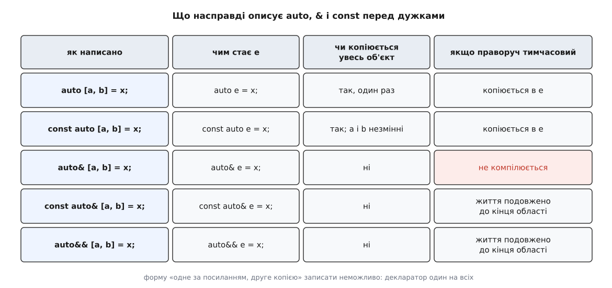
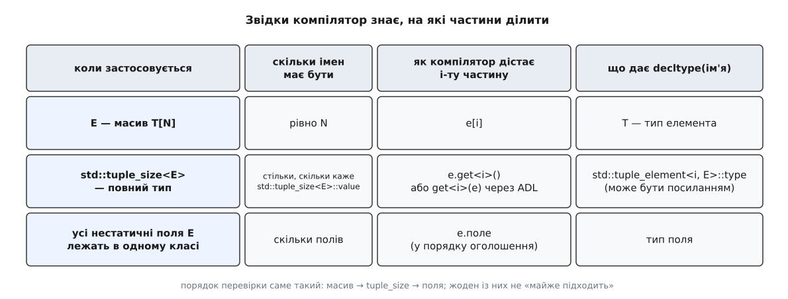

# Структуровані зв'язування: auto [a, b]

<preknowlist>
- [Категорії значень: lvalue, prvalue, xvalue](topic:cpp-standards/value-categories) — вираз має не лише тип, а й категорію: чи має він ім'я і чи можна забрати його нутрощі.
- [Посилання і правила зв'язування](topic:cpp-standards/references-binding) — до чого зв'язується `T&`, `const T&` і `T&&` та як посилання подовжує життя тимчасовому об'єктові.
- [auto й виведення типу](topic:cpp-standards/auto-type-deduction) — за якими правилами компілятор добирає тип на місце заповнювача `auto`.
- [decltype: тип виразу разом із його категорією](topic:cpp-standards/decltype) — чим питання «якого типу ця сутність» відрізняється від «якого типу копія з неї».
- [tuple і pair: кортеж значень різних типів](topic:cpp-standards/tuple-and-pair) — що таке `std::pair` і `std::tuple` та як дістають їхні елементи.
- [Простори імен і пошук, залежний від аргументів](topic:cpp-standards/namespaces-and-adl) — як компілятор шукає вільну функцію в просторі імен її аргументів.
- [Шаблони: параметризація типом](topic:cpp-standards/templates-basics) — що таке шаблон і його спеціалізація для конкретного типу.
- [Час життя об'єкта](topic:cpp-standards/object-lifetime) — коли об'єкт народжується, коли гине і що таке тимчасовий об'єкт.
</preknowlist>

Функція, яка повертає два значення, — не екзотика, а буденність: вставка в асоціативний контейнер повертає ітератор і ознаку «чи справді вставили», розбір числа з рядка — результат і код помилки, обхід словника віддає ключ разом зі значенням. У C++ такий результат пакують в одну структуру, і на боці виклику виходить ось що:

```cpp
auto result = counts.insert({"ключ", 1});
if (result.second) {
    use(result.first);
}
```

`result.second` — це «вставили» чи «уже було»? Доводиться пригадувати. Імена `first` і `second` стандартна бібліотека дає саме тоді, коли їй нічого сказати про зміст: пара знає, що елементів двоє, і більше нічого. Зміст знає той, хто викликав функцію, — але місця вписати його немає.

До C++17 обхідні шляхи були, і кожен щось псував. Перший — `std::tie`:

```cpp
std::map<std::string, int>::iterator it;
bool ok;
std::tie(it, ok) = counts.insert({"ключ", 1});
```

Тут імена є, але змінні спершу створюються порожніми і лише потім отримують значення. Для ітератора це зайвий шум; для типу без конструктора за замовчуванням це неможливо взагалі; для типу, який лише переміщується, `tie` теж не працює, бо він присвоює. Саме такі змінні — ті, що якийсь час живуть неініціалізованими, — Герб Саттер, Б'ярне Страуструп і Ґабріель Дос Реїс і виділили як окреме джерело помилок, коли працювали над C++ Core Guidelines; звідти й виросла пропозиція, з якої постала ця можливість.

Другий шлях — залишити цілий об'єкт і навісити на його частини посилання:

```cpp
auto r = counts.insert({"ключ", 1});
auto& it = r.first;
bool ok = r.second;
```

Правильно, але три рядки замість одного і зайве ім'я `r`, яке нічого не означає й далі маячить в області видимості.

Придивімося, чого насправді бракує. Значення вже існують — вони лежать усередині повернутого об'єкта. Не треба їх створювати, не треба копіювати, не треба заводити нових змінних. Треба єдиного: дати цим готовим частинам власні імена. Механізм, який робить рівно це, і називається структурованим зв'язуванням (англ. *binding* — прив'язування): ім'я прив'язують до вже наявної частини.

```cpp
auto [it, inserted] = counts.insert({"ключ", 1});
```

## Одна прихована змінна, а не дві нові

Найприродніше прочитання цього рядка — «оголосили дві змінні, `it` та `inserted`» — хибне. Варто побачити, чому воно й не могло бути правдивим.

Якби це були дві незалежні змінні, компілятор мусив би витягти кожну частину з повернутої пари окремо. Для `pair<iterator, bool>` це нешкідливо. Але той самий запис має працювати й для структури, у якій одне з полів — масив на кілька кілобайтів, і для типу, чиї частини взагалі не копіюються поодинці, і для звичайного масиву. Розбирати об'єкт по шматках означало б або зробити зайву роботу, або не змогти зробити її взагалі. Та й сам об'єкт, поки його розбирають, десь мусив би жити — а він тимчасовий і гине наприкінці виразу.

Тому мова робить найпростішу чесну річ: створюється **рівно один** об'єкт — той, що стоїть у правій частині, — а імена в дужках стають іменами його частин. У стандарті це записано як введення змінної з унікальним іменем, яке ніде не видно; називатимемо її `e`.

```cpp
auto e = counts.insert({"ключ", 1});   // справжня змінна; імені в неї немає
// it       — інше ім'я для e.first
// inserted — інше ім'я для e.second
```

![Рядок auto& [k, v] = *it перетворюється на приховану змінну e, а імена k і v стають іменами її частин](/reference/cpp-standards/language/structured-bindings/img/binding-machine.svg)

*Компілятор створює одну справжню змінну без імені; імена в дужках лише вказують на її частини.*

Одразу видно і приємний бік цього устрою: `e` — звичайна змінна зі звичайною областю видимості, тож усе оголошення вкладається туди, де змінній і місце.

```cpp
if (auto [it, inserted] = counts.try_emplace(key, 1); !inserted) {
    ++it->second;
}
```

Пара живе рівно стільки, скільки триває `if`, а імена замість `first` і `second` нарешті кажуть, що саме сталося.

`it` та `inserted` — не змінні. Вони не займають власної пам'яті, не ініціалізуються окремо, до них не можна застосувати різні кваліфікатори. Уся дивна поведінка структурованих зв'язувань росте з цього одного кореня.

## Декларатор описує `e`, а не імена

Слова `auto`, `const`, `&` і `&&` перед квадратними дужками стосуються прихованої змінної. Тип для неї компілятор добирає звичайними правилами виведення для `auto` — тими самими, що й для будь-якого іншого оголошення з цим заповнювачем. Це пояснює найчастішу помилку в коді:

```cpp
std::map<std::string, Config> settings = load();

for (auto [name, cfg] : settings) { … }    // кожен елемент копіюється цілком
for (auto& [name, cfg] : settings) { … }   // жодних копій
```

У першому рядку копіюється не `name` і не `cfg` окремо — копіюється весь елемент словника, разом із рядком-ключем, у приховану `e`. У другому `e` стає посиланням на елемент контейнера, і копії не виникає. Різниця між рядками — не в тому, «наскільки посилальними» вийшли `name` і `cfg`: в обох випадках вони однаково лишаються іменами частин. Різниця в тому, **чиї** це частини — копії чи оригіналу.



*Форму «одне ім'я за посиланням, друге копією» записати неможливо: декларатор один на всю дужку.*

Звідси й обмеження, яке спершу дратує: `auto [a, &b] = x;` — не синтаксис. Немає способу взяти першу частину копією, а другу за посиланням, бо взагалі немає окремих рішень для окремих імен; рішення одне, і воно про `e`. Коли потрібні різні режими для різних частин — це задача не для структурованого зв'язування.

Так само зрозумілим стає й подовження життя:

```cpp
const auto& [n, s] = make_pair_by_value();
```

Функція повернула тимчасовий об'єкт, а `e` — справжня змінна-посилання; отже спрацьовує звичайне правило зв'язування, і тимчасовий живе до кінця області видимості. Імена `n` та `s` увесь цей час указують на його частини. Жодної окремої магії для дужок тут немає — працює те саме правило, що й для будь-якого `const T&`.

> 🔧 **Навіщо це.** Найчастіша форма в живому коді — `for (const auto& [k, v] : map)`. Якщо помилково написати `auto`, компілятор не скаже нічого: обидва варіанти правильні, просто один щоразу копіює рядок-ключ і все значення. Розуміння, що декларатор описує `e`, перетворює цей вибір із запам'ятовування форми на одне свідоме рішення: копію я тут хочу чи вид на оригінал.

## Три способи поділити об'єкт на частини

Щоб розкласти `e`, компілятор мусить відповісти на два питання: скільки в ній частин і як дістати i-ту. Відповідей рівно три, і перевіряються вони саме в такому порядку.



*Кожен випадок дає компіляторові і кількість частин, і спосіб дістати кожну.*

**Масив.** Кількість записана в самому типі, i-та частина — це `e[i]`, а імен має бути рівно стільки, скільки елементів. Тут ховається приємна несподіванка: у звичайному оголошенні `auto e = arr;` масив розпався б на вказівник, але для структурованого зв'язування стандарт робить окремий виняток — `e` має тип масиву, і його елементи копіюються поелементно.

```cpp
int coords[3] = {1, 2, 3};
auto [x, y, z] = coords;   // e — це int[3], скопійований поелементно
```

**Протокол `tuple_size`.** Якщо `std::tuple_size<E>` — повний тип, компілятор бере кількість частин із його `::value`, тип i-тої частини — з `std::tuple_element<i, E>::type`, а саме значення — викликом `e.get<i>()`, коли в класі є **шаблонний** член `get`, або вільної `get<i>(e)`, знайденої пошуком за аргументом. Вимога саме шаблонного члена з'явилася в C++20: доти будь-який член на ім'я `get` перекривав шлях до вільної функції, і типи, що успадковували чужий `get()` — розумні вказівники, обгортки над `future` — розібрати було неможливо.

Цей випадок єдиний, де справді народжуються посилання, і причина проста. У двох інших випадках частина — це підоб'єкт самої `e`: вона вже існує за відомою адресою, і компіляторові досить дати їй ім'я. А `get` — звичайна функція: вона повертає що завгодно, і те, що вона повернула, підоб'єктом `e` не є. Іменувати нічого, тож компілятор заводить приховану посилальну змінну й прив'язує її до результату. Наслідок практичний: якщо `get` повертає значення, а не посилання, виникає тимчасовий об'єкт — і саме це приховане посилання подовжує йому життя до кінця області.

**Нестатичні поля.** Найзвичніший випадок — власна структура. Умови жорсткі: усі поля мають належати або самому `E`, або одному-єдиному базовому класові (компілятор не вигадуватиме порядок між кількома базами), серед них не має бути анонімних об'єднань, і всі вони мають бути доступні в цьому місці коду. У C++17 вимагалося саме `public`; C++20 послабив правило до звичайної доступності, тож метод або дружня функція тепер розбирає клас із закритими полями.

Порядок частин — це порядок оголошення полів, і ніщо не пов'язує ваше ім'я `name` із полем, яке теж зветься `name`: зіставлення суто позиційне.

## Що показує `decltype`

Тепер найгостріший наслідок того, що імена не є змінними.

```cpp
std::pair<int, std::string> p{1, "два"};
auto& [n, s] = p;

n = 5;                  // змінює p.first
static_assert(std::is_same_v<decltype(n), int>);   // не int&
```

Присвоєння працює: `n` у виразі — це lvalue, що позначає справжній підоб'єкт `p`. А `decltype(n)` дає `int`, без жодного посилання. Суперечності немає: `decltype` для структурованого зв'язування повертає **тип частини**, а не тип якогось посилання на неї. Питання «а це зв'язування посилальне?» просто не має змісту, бо зв'язування — не змінна, у нього немає власного типу; посилальність, яку ви написали перед дужками, належить прихованій `e`.

У випадку з полями й масивом цим типом є тип підоб'єкта (або оголошений тип поля, якщо саме поле оголошене посиланням). У випадку `tuple_size` — рівно те, що каже `std::tuple_element<i, E>::type`, а воно цілком може бути посиланням: у `std::tuple<int&>` перша частина має тип `int&`, і `decltype` це чесно покаже.

Одна дрібниця з тієї самої логіки: `decltype((n))` — з подвійними дужками — дає `int&`, бо в дужках уже не ім'я сутності, а вираз, і працює загальне правило `decltype` для lvalue-виразів.

У шаблонному коді на цьому спотикаються найчастіше. Звичний прийом «передати далі рівно з тією категорією, з якою прийшло» тут не працює:

```cpp
auto&& [a, b] = make_thing();
sink(std::forward<decltype(a)>(a));   // decltype(a) — тип частини, не посилання
```

`std::forward` вирішує, переміщувати чи ні, за своїм параметром шаблону: посилальний тип означає «лишити lvalue», непосилальний — «зробити rvalue». А `decltype(a)` для поля чи елемента масиву посилальним не буває ніколи, хоч би до чого прив'язалася `e`. Тому цей рядок не «передає як прийшло», а **завжди переміщує** — навіть коли `make_thing()` замінити на іменований об'єкт, який ще знадобиться. Свідомий вибір між `a` та `std::move(a)` надійніший за спробу вирахувати категорію з імені, у якого її немає.

Забрати частину переміщенням можна звичайним способом:

```cpp
auto [id, payload] = build_message();
send(std::move(payload));      // переміщуємо з підоб'єкта прихованої e
```

Тут `e` — власна копія, тому переміщення безпечне. А от у формі `auto& [id, payload] = msg;` те саме `std::move(payload)` випотрошить чужий об'єкт, на який лише дивилися. Правило те саме, що й скрізь: переміщувати можна з того, чим володієш, — просто тепер володіння визначається декларатором перед дужками, а не самим іменем.

## Чого імена не вміли і коли навчилися

Оскільки зв'язування — не змінна, у C++17 йому було відмовлено в усьому, що прописане для змінних. Не можна було ні написати `static` чи `thread_local`, ні захопити ім'я в лямбду — формально захоплювати нічого, хоча компілятори на практиці часто це дозволяли. C++20 закрив цю прогалину двома паперами: один дозволив специфікатори зберігання й захоплення за значенням, другий — захоплення за посиланням (крім бітових полів, у яких немає адреси).

Решту прогалин закриває C++26 — усе вже ухвалене в чернетку, хоч підтримка компіляторами станом на кінець 2025 року була нерівною. Найвідчутніша — `constexpr`: досі зв'язування не могло бути сталою часу компіляції, тож після `auto [w, h] = size();` записати `std::array<int, w>` не вдавалося навіть тоді, коли `size()` цілком обчислюється під час компіляції. Друга — `_` як ім'я-заповнювач, яке дозволено повторювати в одній області: імен має бути рівно стільки, скільки частин, і зайві доводилося якось називати, ловлячи попередження про невживану змінну. До того ж набору ввійшли атрибути на окремих іменах, зв'язування як умова в `if`, і найцікавіше — можливість ввести пакет: `auto [head, ...rest] = t;`.

Бітові поля розбираються, але ім'я такого поля успадковує його обмеження: адреси в нього немає, тож ні `&`, ні захоплення за посиланням із ним не працюють.

## Свій тип, який можна розбирати

Протокол `tuple_size` відкритий: спеціалізувавши `std::tuple_size` й `std::tuple_element` для власного класу та додавши `get`, ви робите його придатним до розбирання. Це єдиний із трьох випадків, яким керуєте ви, — і єдиний, де частини не зобов'язані бути полями: `get<0>` може щось обчислювати, віддавати частину закритого стану або взагалі перевпорядковувати те, що бачить читач. [Як це написати правильно](topic:cpp-standards/structured-bindings/proj-tuple-like.md) — окрема робота: потрібні перевантаження для `&`, `const&` і `&&`, узгоджені `tuple_element`, і розуміння, чому саме шаблонний член `get` знаходиться інакше, ніж вільна функція.

## Пастки, що лишилися

**Порядок замість імен.** Зв'язування зіставляє імена з частинами за позицією. Додайте нове поле в середину структури — і всі імена зсунуться. Якщо типи сусідніх полів сумісні, код скомпілюється й мовчки почне означати інше. Це ціна того, що імена ваші, а порядок — чужий.

**Тимчасовий, що зник по дорозі.** Класика — обхід за діапазоном:

```cpp
for (const auto& [k, v] : load_config().entries()) { … }
```

`load_config()` повернула тимчасовий об'єкт, `entries()` віддала посилання всередину нього. До C++23 цей проміжний тимчасовий гинув ще до першої ітерації, і цикл ходив по звільненій пам'яті; [подовження життя всіх тимчасових у виразі діапазону](topic:cpp-standards/range-based-for) з'явилося тільки в C++23. Само по собі зв'язування тут ні до чого — воно лише робить помилку менш помітною, бо в рядку не видно жодного посилання. Ширший розбір таких випадків — у темі про [висячі посилання](topic:cpp-standards/dangling-references).

**Ім'я, що переживає своє джерело.** `const auto& [a, b] = f();` цілком безпечне всередині функції, бо `e` подовжує життя тимчасовому. Але повернути `a` з функції за посиланням — те саме, що повернути посилання на локальну змінну: `e` локальна, і після виходу її вже немає.

## Чому «зв'язування», а не «розкладання»

Перша редакція пропозиції, поданої в жовтні 2015 року, мала інший синтаксис — `auto {x, y, z} = f();` — і фігурні дужки замінили на квадратні лише в березні 2016-го, бо фігурні вже несли значення ініціалізації. Змінилася й назва: якийсь час у робочому проєкті стандарту й у діагностиці компіляторів фігурувало «оголошення-розкладання» (англ. *decomposition declaration*), і його свідомо замінили на «структуроване зв'язування». Заміна не косметична: нічого не розкладається й нічого не оголошується — об'єкт лишається цілим і єдиним, а з'являються тільки нові імена над його частинами. Назва — найкоротший правильний опис механізму. [Як саме йшла ця дискусія](topic:cpp-standards/structured-bindings/hist-structured-bindings.md), від зауваження про неініціалізовані змінні до паперів C++26, — окрема історія.
