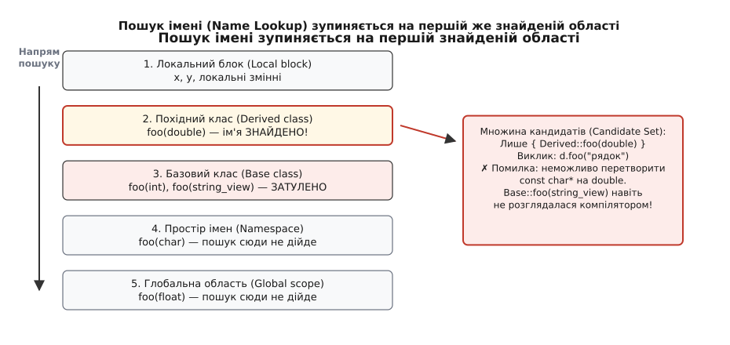
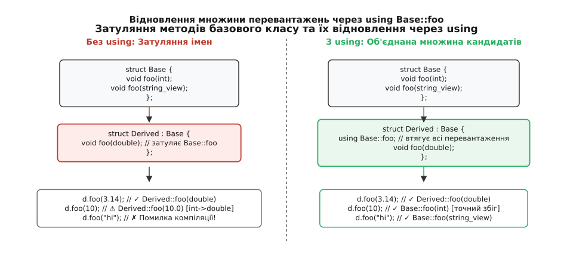
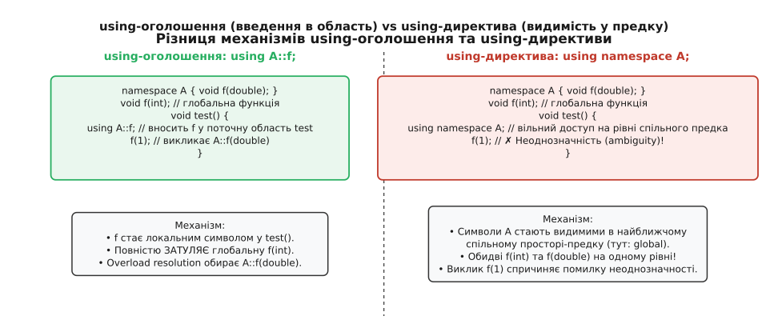
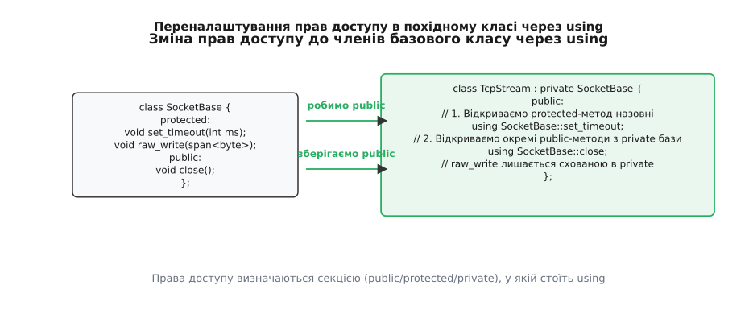

# Затуляння імен і using-оголошення

<preknowlist>
- [Розв'язання перевантажень: як обирається функція](book:cpp-standards/overload-resolution) — як компілятор обирає найкращого кандидата серед функцій з однаковим іменем за типами аргументів.
- [Простори імен і пошук, залежний від аргументів](book:cpp-standards/namespaces-and-adl) — вкладені області видимості, кваліфікований та некваліфікований пошук і робота ADL.
- [Множинне й віртуальне успадкування](book:cpp-standards/multiple-and-virtual-inheritance) — як класи об'єднують кілька базових гілок і чому виникають колізії імен між незв'язаними предками.
- [Ініціалізація та конструктори](book:cpp-standards/initialization-forms) — форми створення об'єктів, порядок виклику конструкторів базових і похідних класів.
- [Лямбда-вирази та замикання](book:cpp-standards/lambdas-and-captures) — функціональні об'єкти з перевантаженим `operator()` та їхня композиція.
</preknowlist>

У базовому класі `SensorReader` оголошено три методи збирання даних: `read(int channel)`, `read(double frequency)` та `read(std::string_view sensor_name)`. Похідний клас `CalibratedSensor` додає власне каліброване опитування для цілих каналів: `void read(int channel)`. У старій частині програми стоїть виклик `sensor.read(100.5)`, розрахований на метод із дробовою частотою. Після успадкування компілятор не викликає `read(double)` із базового класу, а неявно обрізає число `100.5` до цілого `100` і викликає `CalibratedSensor::read(int)`, спотворюючи вимірювання; а виклик `sensor.read("temp_1")` узагалі зупиняє компіляцію з помилкою несумісності типів.

Ніхто не робив помилки в типах аргументів. Проблема виникає через фундаментальне правило мови: **пошук імені (Name Lookup) відбувається строго до того, як компілятор почне аналізувати типи аргументів і розв'язання перевантажень (Overload Resolution)**. Щойно компілятор знаходить потрібне символьне ім'я в найближчій області видимості, він негайно припиняє рух угору ієрархією. Усі однойменні функції із зовнішніх областей та базових класів виявляються повністю затуленими (англ. *name hiding* або *shadowing*).

Головним інструментом тонкого керування видимістю, відновлення перевантажень, створення псевдонімів та налаштування інтерфейсів у C++ є ключове слово `using`.

## Фази обробки виклику: чому пошук сліпий до типів

Коли компілятор бачить виклик `obj.action(42)`, він виконує три послідовні фази, кожна з яких працює лише з результатом попередньої:

1. **Пошук імені (Name Lookup)**. За одним лише ідентифікатором `action` компілятор шукає декларації в областях видимості. Він починає з локального блоку, переходить до похідного класу, потім до базових класів, охопних просторів імен і нарешті глобальної області. Щойно в якійсь області знайдено хоча б одну декларацію з назвою `action`, пошук **зупиняється**. Знайдені декларації формують *множину кандидатів* (англ. *candidate set*).
2. **Розв'язання перевантажень (Overload Resolution)**. Компілятор бере виключно множину кандидатів, отриману на першій фазі, і зіставляє типи переданих аргументів (`42` -> `int`) із типами параметрів кожного кандидата. Якщо кандидатів немає або жоден не підходить — видається помилка. Зовнішні області на цій фазі вже недоступні.
3. **Контроль доступу (Access Control)**. Лише після того, як обрано єдину найкращу функцію, компілятор перевіряє, чи є вона `public`, `protected` або `private`.



*Пошук імені рухається зсередини назовні й зупиняється на першій же області, де є хоча б одне оголошення шуканого символу. Типи аргументів на етапі пошуку не перевіряються, тому однойменний метод у похідному класі робить базові методи невидимими для розв'язання перевантажень.*

Такий порядок може здаватися незручним, але за ним стоїть захист від значно небезпечнішої проблеми — «викрадення викликів» (англ. *function hijacking*). Якщо б компілятор збирав кандидатів з усіх предків одночасно, додавання нового методу `void Base::process(long)` у далекий бібліотечний заголовок могло б непомітно перехопити виклик `d.process(10)` у похідному класі, де раніше викликався локальний `Derived::process(int)` або метод з неявним перетворенням. Історичні дебати навколо цього вибору описано у вставці [📜 Історія затуляння імен і еволюція using у C++](book:cpp-standards/using-and-name-hiding/hist-name-lookup-evolution.md).

## Механізм таблиць символів у компіляторі

Щоб чітко розуміти, чому затуляння відбувається саме так, варто поглянути на внутрішню структуру компілятора (наприклад, Clang або GCC). Під час синтаксичного розбору компілятор підтримує стек контекстів оголошень (у Clang це класи `Scope` та `DeclContext`).

Коли компілятор зустрічає ідентифікатор `read`, він запускає функцію некваліфікованого пошуку (Unqualified Lookup):
1. Компілятор звертається до поточного `DeclContext` (наприклад, тіла методу або класу `CalibratedSensor`).
2. Якщо в таблиці символів цього контексту є хоча б один запис із ключем `read`, пошук повертає результат `LookupResult` і завершується.
3. Пошук взагалі не виконує ітерацій по батьківських класах `Base`, якщо в поточному класі знайдено хоча б один символ. Батьківський контекст переглядається лише тоді, коли поточний повернув порожній результат.

Це означає, що затуляються не окремі сигнатури, а **ідентифікатор як рядок символів**. Якщо в похідному класі оголошено навіть змінну `int read;` замість функції, вона так само успішно затулить усі методи `read(...)` базового класу, перетворивши спробу виклику `sensor.read(10)` на помилку компіляції: `error: called object type 'int' is not a function`.

## Затуляння методів у похідних класах

Похідний клас утворює власну область видимості, яка вкладена в область видимості базового класу. Затуляння виникає в той момент, коли в похідному класі з'являється функція з такою самою назвою, навіть якщо її параметри зовсім інші:

```cpp
#include <iostream>
#include <string_view>

struct Base {
    void print(int value) {
        std::cout << "Base::print(int): " << value << '\n';
    }
    void print(std::string_view text) {
        std::cout << "Base::print(string_view): " << text << '\n';
    }
};

struct Derived : public Base {
    // Оголошення print(double) затуляє ВСІ перевантаження print у Base!
    void print(double value) {
        std::cout << "Derived::print(double): " << value << '\n';
    }
};

int main() {
    Derived d;
    d.print(3.14);    // ✓ Викликає Derived::print(double)
    d.print(42);      // ⚠ Неявно перетворює int на double -> Derived::print(42.0)
    // d.print("hi"); // ✗ ПОМИЛКА КОМПІЛЯЦІЇ: const char* не можна перетворити на double!
}
```

У виклику `d.print("hi")` пошук імені знайшов `Derived::print(double)` у класі `Derived` і зупинився. На фазі розв'язання перевантажень єдиний кандидат — функція з аргументом `double`. Оскільки рядок `"hi"` не приводиться до числа з рухомою комою, компілятор зупиняє збирання, незважаючи на те, що в `Base` є ідеальний метод `print(std::string_view)`.

### Затуляння віртуальних функцій

Затуляння працює однаково для звичайних і для віртуальних методів. Якщо базовий клас має кілька перевантажень віртуального методу, а похідний клас перевизначає (`override`) лише один із них, решта перевантажень стають затуленими для некваліфікованого доступу через об'єкт похідного типу:

```cpp
struct BaseRenderer {
    virtual ~BaseRenderer() = default;
    virtual void render(int width, int height) = 0;
    virtual void render(double scale_factor) = 0;
};

struct SvgRenderer : public BaseRenderer {
    // Перевизначаємо лише один віртуальний метод:
    void render(int width, int height) override {
        std::cout << "SvgRenderer: " << width << "x" << height << '\n';
    }
    // render(double) з базового класу тепер ЗАТУЛЕНО для SvgRenderer
};

void run() {
    SvgRenderer svg;
    svg.render(800, 600); // ✓ Працює: точний збіг із SvgRenderer::render(int, int)
    
    // svg.render(1.5);   // ⚠ НЕ викликає render(double)! 
                          // 1.5 обрізається до int 1, викликаючи render(int, int) зі спотворенням!
    
    // Проте через покажчик на Base віртуальність працює повністю:
    BaseRenderer* base_ptr = &svg;
    // base_ptr->render(1.5); // Викличе чистий віртуальний метод Base (UB / runtime error), 
                              // бо SvgRenderer його не реалізував!
}
```

Якщо клас не реалізував друге перевантаження, компілятор дозволить виклик через неявне приведення аргументів до першого перевантаження, що є джерелом важковловимих помилок часу виконання.

## Затуляння полів, типів та констант

Затуляння стосується не лише методів, а й змінних-членів (полів), констант та вкладених типів базового класу.

### Затуляння змінних-членів
Якщо похідний клас оголошує поле з тим самим ім'ям, що й базовий клас:

```cpp
struct BaseNode {
    int id{100};
};

struct DerivedNode : public BaseNode {
    double id{3.14}; // затуляє BaseNode::id
};
```

Обидва поля `BaseNode::id` (4 байти) та `DerivedNode::id` (8 байтів) **фізично існують у пам'яті** об'єкта `DerivedNode` одне за одним. Проте будь-яке пряме звернення `node.id` повертає `DerivedNode::id`, оскільки пошук імені знаходить поле в похідному класі. Щоб звернутися до базового поля, доводиться використовувати явну кваліфікацію: `node.BaseNode::id`.

### Затуляння вкладених типів і переліків
Якщо базовий клас визначає тип або перелік `using ValueType = int;`, а похідний клас оголошує власне поле або метод із назвою `ValueType`, ім'я типу стає затуленим:

```cpp
struct BaseContainer {
    using ValueType = int;
    static constexpr int DefaultCapacity = 64;
};

struct DerivedContainer : public BaseContainer {
    double ValueType{0.0}; // затуляє тип BaseContainer::ValueType!
    static constexpr int DefaultCapacity = 128; // затуляє константу бази
};
```

Щоб відновити доступ до типу або константи предка в похідному класі без багатослівного префікса `BaseContainer::`, використовують using-оголошення:
```cpp
using BaseContainer::DefaultCapacity;
using typename BaseContainer::ValueType;
```

Також існує особливий випадок затуляння типів іменами змінних (відомий як *struct tag hiding*): якщо ім'я структури або класу збігається з ім'ям змінної чи функції в тій самій області видимості, некваліфіковане ім'я вказує на змінну/функцію. Щоб звернутися до типу, необхідно писати `struct Name` або `class Name`.

## Затуляння операторів перетворення типів

Оператори перетворення типів (`operator bool()`, `operator int()`) мають унікальну особливість: їхнє ім'я включає тип, до якого здійснюється приведення.

Якщо базовий клас оголошує `operator int() const`, а похідний клас оголошує `operator double() const`, вони не затуляють один одного, оскільки їхні ідентифікатори в таблиці символів різняться. Проте якщо похідний клас оголошує `operator int()`, він затуляє базовий `operator int()`.

Якщо базовий оператор перетворення був явним (`explicit operator bool()`), а похідний клас бажає зробити його неявним (або навпаки), у похідному класі визначають власний оператор або керують видимістю за допомогою using-оголошень.

## Пастка приватних перевантажень (Private Overload Trap)

Одна з найбільш неочевидних пасток у C++ виникає на стику між розв'язанням перевантажень і контролем доступу. Згадаймо: **контроль доступу виконується лише ПІСЛЯ того, як перевантаження остаточно розв'язано**.

Розглянемо такий приклад:

```cpp
class BaseService {
public:
    void execute(double value) {
        std::cout << "BaseService::execute(double)\n";
    }
};

class CustomService : public BaseService {
public:
    using BaseService::execute; // втягнули public execute(double)

private:
    void execute(int value) {   // закритий внутрішній помічник
        std::cout << "CustomService::execute(int) [private]\n";
    }
};

int main() {
    CustomService service;
    // service.execute(10); // ✗ ПОМИЛКА КОМПІЛЯЦІЇ!
}
```

Що тут відбувається?
1. Пошук імені формує множину кандидатів: `BaseService::execute(double)` (відкритий через using) та `CustomService::execute(int)` (приватний).
2. Розв'язання перевантажень аналізує типи: для аргументу `10` (`int`) функція `execute(int)` є точним збігом (*Exact Match*), тоді як `execute(double)` вимагає стандартного перетворення (*Standard Conversion*). Перемагає `CustomService::execute(int)`.
3. Контроль доступу перевіряє права виклику переможця: функція виявляється `private`! Компілятор зупиняється з помилкою: `error: 'execute' is a private member of 'CustomService'`.

Компілятор не має права повернутися назад і викликати відкритий `execute(double)`. Приватний точний збіг блокує виклик відкритого методу з менш точним збігом типів.

## Відновлення множини перевантажень через using Base::method;

Щоб повернути затулені функції базового класу в область видимості похідного класу, застосовують `using`-оголошення (англ. *using-declaration*). Воно втягує всі однойменні перевантаження з базового класу безпосередньо в поточний клас:

```cpp
struct DerivedWithUsing : public Base {
    // Вносимо всі перевантаження print з Base у область видимості DerivedWithUsing:
    using Base::print;

    // Додаємо власне перевантаження:
    void print(double value) {
        std::cout << "DerivedWithUsing::print(double): " << value << '\n';
    }
};

int main() {
    DerivedWithUsing d;
    d.print(3.14);  // ✓ DerivedWithUsing::print(double)
    d.print(42);    // ✓ Base::print(int) — точний збіг!
    d.print("hi");  // ✓ Base::print(string_view) — точний збіг!
}
```



*Без using-оголошення похідний клас приховує методи предка. Запис `using Base::print;` об'єднує всі перевантаження базового та похідного класів в єдину відкриту множину кандидатів.*

### Внутрішня механіка UsingShadowDecl

На рівні компіляторного абстрактного синтаксичного дерева (AST) рядок `using Base::print;` створює спеціальні вузли — `UsingShadowDecl`. Кожен такий вузол слугує дзеркальним відображенням конкретного методу з базового класу всередині таблиці символів похідного класу.

Коли пошук імені звертається до `DerivedWithUsing`, він знаходить як рідний метод `DerivedWithUsing::print(double)`, так і всі тіньові декларації `Base::print(int)` та `Base::print(std::string_view)`. Усі три функції потрапляють до множини кандидатів на абсолютно рівних правах. Після цього фаза розв'язання перевантажень обирає точний збіг за стандартними правилами ранжування перетворень типів.

### Правило точного збігу сигнатур

Якщо сигнатура методу в похідному класі повністю збігається із сигнатурою методу з `Base` (однакові типи параметрів, константність і `ref`-кваліфікатори), метод похідного класу перемагає й заміщує базовий:

```cpp
struct BaseCalculator {
    int compute(int x) { return x * 2; }
    double compute(double x) { return x * 2.0; }
};

struct AdvancedCalculator : public BaseCalculator {
    using BaseCalculator::compute;

    // Точний збіг сигнатури з BaseCalculator::compute(int):
    int compute(int x) { return x * 3; }
};

int main() {
    AdvancedCalculator calc;
    std::cout << calc.compute(10);   // Виведе 30 (AdvancedCalculator::compute)
    std::cout << calc.compute(2.5);  // Виведе 5.0 (BaseCalculator::compute)
}
```

Метод `AdvancedCalculator::compute(int)` повністю приховує `BaseCalculator::compute(int)`, але `BaseCalculator::compute(double)` залишається доступним завдяки `using`.

## Покроковий життєвий цикл розв'язання імені в 5-рівневій системі

Щоб побачити повну взаємодію всіх рівнів пошуку імен, розглянемо комплексну ієрархію з п'яти областей видимості:

```cpp
// Рівень 1: Глобальний простір
void log_event(long x) { std::cout << "Global long: " << x << '\n'; }

// Рівень 2: Простір імен сервісів
namespace SystemServices {
    void log_event(const char* s) { std::cout << "SystemServices string: " << s << '\n'; }

    // Рівень 3: Базовий клас
    struct BaseHandler {
        void log_event(double d) { std::cout << "Base double: " << d << '\n'; }
    };

    // Рівень 4: Похідний клас
    struct CustomHandler : public BaseHandler {
        using BaseHandler::log_event; // втягуємо BaseHandler::log_event(double)
        void log_event(std::string_view sv) { std::cout << "Custom string_view: " << sv << '\n'; }

        // Рівень 5: Локальний метод
        void run() {
            log_event("hello"); // Виклик А
            log_event(3.14);    // Виклик Б
            log_event(100L);    // Виклик В
        }
    };
}
```

Простежимо роботу компілятора для кожного виклику:

1. **Виклик А (`log_event("hello")`)**:
   - Пошук імені стартує з методу `run()`, переходить до класу `CustomHandler` і знаходить кандидати `CustomHandler::log_event(std::string_view)` та `BaseHandler::log_event(double)` (через `UsingShadowDecl`). Пошук негайно **зупиняється**. Простір `SystemServices` та глобальна область взагалі не переглядаються!
   - Розв'язання перевантажень обирає `CustomHandler::log_event(string_view)`.
2. **Виклик Б (`log_event(3.14)`)**:
   - Пошук знаходить ту саму множину кандидатів у `CustomHandler`.
   - Розв'язання перевантажень обирає `BaseHandler::log_event(double)` як точний збіг для аргументу `double`.
3. **Виклик В (`log_event(100L)`)**:
   - Аргумент має тип `long`. У глобальному просторі є точний збіг `::log_event(long)`.
   - Проте пошук імені зупинився на класі `CustomHandler` і знайшов лише `log_event(double)` та `log_event(string_view)`. Глобальна функція виявилася **повністю затуленою**!
   - Розв'язання перевантажень змушене виконати неявне стандартне приведення `long -> double` і викликати `BaseHandler::log_event(double)`.

Цей приклад доводить: компілятор ніколи не виходить у зовнішні простори імен, якщо символ збігся за назвою на рівні поточного класу, навіть якщо у зовнішньому просторі існує ідеальний збіг за типами параметрів.

## Взаємодія з концептами C++20 (Concepts & SFINAE)

Коли using-оголошення відновлює шаблонні методи з базового класу, вони беруть участь у впорядкуванні перевантажень за обмеженнями (англ. *Partial Ordering of Constraints*):

```cpp
#include <concepts>

struct GenericBase {
    template <typename T>
    void process(T val) {
        std::cout << "GenericBase::process(загальний шаблон)\n";
    }
};

struct ConstrainedDerived : public GenericBase {
    using GenericBase::process;

    // Спеціалізоване перевантаження з концептом:
    template <std::integral T>
    void process(T val) {
        std::cout << "ConstrainedDerived::process(цілочисельний концепт)\n";
    }
};

void test_constraints() {
    ConstrainedDerived d;
    d.process(42);   // Викликає ConstrainedDerived::process (більш обмежений кандидат!)
    d.process(3.14); // Викликає GenericBase::process (обмеження integral не виконано)
}
```

Компілятор обирає найбільш обмеженого кандидата серед усіх доступних функцій у відновленій множині перевантажень, дозволяючи будувати гнучкі шари статичної валідації.

## Дружні функції та неможливість using Base::friend_func

Особливим правилом мови є взаємодія з дружніми функціями (`friend`). Якщо всередині класу `Base` визначено дружню функцію (наприклад, `friend void helper(Base&);`), вона не є членом класу. Вона належить до охопного простору імен, але є прихованою від звичайного пошуку.

Спроба написати `using Base::helper;` у похідному класі є **синтаксичною помилкою**. Оскільки `helper` не є функцією-членом `Base`, компілятор забороняє її імпорт через синтаксис членів класу. Дружні функції викликаються виключно через механізм ADL, коли аргумент виклику має тип базового або похідного класу.

## Ідіома канонічного Swap та ADL

Класичним прикладом взаємодії `using`-оголошення та пошуку, залежного від аргументів (ADL), є канонічний виклик функції `swap`:

```cpp
template <typename T>
void custom_algorithm(T& a, T& b) {
    using std::swap; // 1. Робимо std::swap доступним для некваліфікованого пошуку
    swap(a, b);      // 2. Викликаємо без префікса std::
}
```

Цей патерн працює за двома взаємодоповнювальними сценаріями:
1. Якщо для типу `T` реалізовано спеціалізовану оптимізовану функцію `swap` у його власному просторі імен або як прихованого друга (*Hidden Friend*), компілятор знайде її через ADL. Оскільки спеціалізована функція є точнішим збігом, вона виграє перевантаження у шаблонного `std::swap`.
2. Якщо тип `T` не має власної функції `swap`, пошук ADL не знаходить кандидатів, але завдяки рядку `using std::swap;` компілятор успішно застосовує загальний `std::swap` зі стандартної бібліотеки.

Прямий виклик `std::swap(a, b);` є грубою помилкою проєктування, оскільки він повністю блокує ADL і позбавляє користувацькі типи можливості надати швидкий обмін даними без копіювання.

## using-оголошення проти using-директиви

У роботі з просторами імен ключове слово `using` використовується у двох синтаксичних формах, які мають принципово різну семантику:

1. **`using`-оголошення (Using-declaration):** `using Namespace::Symbol;`
2. **`using`-директива (Using-directive):** `using namespace Namespace;`

### Різниця в точці розміщення символів

* **`using Namespace::Symbol;`** фізично імпортує символ у ту саму область видимості, де написано цей рядок (локальний блок чи простір імен). Символ поводиться так, ніби його щойно оголосили тут, і він **затуляє** всі однойменні символи із зовнішніх охопних областей.
* **`using namespace Namespace;`** **не вносить** символи в поточну область! Натомість вона робить їх видимими так, ніби вони були оголошені в **найближчому спільному предку** поточного простору та імпортованого простору.

```cpp
namespace LibA {
    void process(double x) {
        std::cout << "LibA::process(double): " << x << '\n';
    }
}

// Глобальна функція:
void process(int x) {
    std::cout << "::process(int): " << x << '\n';
}

void test_using_declaration() {
    using LibA::process; // Вводить process(double) безпосередньо в область функції test_using_declaration
    process(10);         // Викликає LibA::process(10.0)! Глобальна process(int) ЗАТУЛЕНА.
}

void test_using_directive() {
    using namespace LibA; // Робить символи LibA видимими на рівні глобального простору (спільний предок)
    // process(10);       // ✗ ПОМИЛКА: неоднозначність (Ambiguity)!
                          // ::process(int) і LibA::process(double) змагаються на одному рівні!
}
```



*Using-оголошення ізолює імпортоване ім'я в локальному блоці й приховує зовнішні сутності. Using-директива піднімає всі імена на рівень найближчого спільного простору-предка, змушуючи їх конкурувати з локальними символами.*

### Вплив на продуктивність компіляції та час збирання

Директива `using namespace` створює значне навантаження на синтаксичний аналізатор компілятора. Коли компілятор зустрічає директиву, він змушений підтримувати зв'язки з усім деревом простору імен. Будь-який некваліфікований виклик функції змушує компілятор лінійно сканувати таблиці символів усіх підключених просторів.

Навпаки, точкове using-оголошення (`using Namespace::Symbol;`) додає рівно один конкретний запис до поточної хеш-таблиці символів, скорочуючи час розбору складних файлів у великих кодових базах у кілька разів.

### Статичний аналіз та правила Clang-Tidy

Сучасні інструменти статичного аналізу коду містять набір спеціальних правил для контролю використання `using`:
- `google-build-using-namespace` — забороняє `using namespace` у глобальній області видимості заголовних файлів;
- `misc-unused-using-decls` — виявляє using-оголошення, які імпортують символи, що жодного разу не використовуються в поточному файлі;
- `bugprone-virtual-near-miss` — виявляє випадки, коли назва або сигнатура методу в похідному класі незначно відрізняється від віртуального методу базового класу, що призводить до випадкового затуляння замість перевизначення.

### Вбудовані простори імен (Inline Namespaces) та версіонування ABI

У C++11 з'явилися вбудовані простори імен (`inline namespace`). Усі ідентифікатори з вбудованого простору розглядаються так, ніби вони оголошені безпосередньо в батьківському просторі:

```cpp
namespace Engine {
    inline namespace v2 {
        void render_scene(); // видимий як Engine::render_scene()
    }
    namespace v1 {
        void render_scene(); // застаріла версія Engine::v1::render_scene()
    }
}
```

Це дозволяє бібліотекам оновлювати ABI та алгоритми за замовчуванням, зберігаючи зворотну сумісність для клієнтів, які явно посилаються на версіоновані простори `Engine::v1::`. Повний звід правил синтаксису зібрано у вставці [📋 Довідник синтаксису using та правил пошуку імен](book:cpp-standards/using-and-name-hiding/api-using-syntax-reference.md).

## Псевдоніми типів та шаблонні псевдоніми (Alias Templates)

У C++11 синтаксис `using` отримав можливість створювати псевдоніми типів (англ. *type aliases*), замінивши застарілий `typedef` із мови C:

```cpp
// Традиційний typedef (незручний для складних типів):
typedef void (*LegacyCallback)(int, double);

// Сучасний type alias через using (читається зліва направо):
using ModernCallback = void (*)(int, double);
```

Синтаксис `using Name = Type;` будується за принципом оператора присвоєння: ліворуч стоїть нове ім'я, праворуч — тип, який йому відповідає.

### Шаблонні псевдоніми: межа можливостей typedef

Головна перевага `using` над `typedef` — підтримка шаблонів (англ. *alias templates*). У C++98 не існувало способу створити «шаблонний typedef». Доводилося створювати допоміжну структуру з внутрішнім псевдонімом:

```cpp
// Підхід C++98 / C++03:
template <typename T>
struct StringMapOld {
    typedef std::map<std::string, T, std::less<>> type;
};

// Використання вимагало громіздкого синтаксису з typename:
typename StringMapOld<int>::type my_map_old;
```

У C++11 шаблонний псевдонім став першокласною конструкцією мови:

```cpp
// Підхід C++11 і новіших:
template <typename T>
using StringMap = std::map<std::string, T, std::less<>>;

// Пряме й чисте використання:
StringMap<int> my_map;
```

Шаблонні псевдоніми є фундаментальною основою стандартної бібліотеки метапрограмування C++14. Усі трейти типів із суфіксом `_t` (наприклад, `std::decay_t<T>`, `std::remove_reference_t<T>`, `std::underlying_type_t<T>`) реалізовані саме як аліаси:

```cpp
template <typename T>
using remove_reference_t = typename std::remove_reference<T>::type;
```

### Спеціалізація та заборона прямої спеціалізації аліасів

Важливе обмеження мови: **шаблонний псевдонім не можна спеціалізувати напряму**. Запис `template<> using MyAlias<int> = double;` є синтаксичною помилкою. 

Щоб створити спеціалізовану поведінку, використовують класичний ідіоматичний патерн: спеціалізують допоміжну структуру, а назовні надають універсальний аліас:

```cpp
template <typename T>
struct StorageTraits {
    using type = T;
};

template <>
struct StorageTraits<bool> {
    using type = uint8_t; // оптимізація бітового представлення
};

template <typename T>
using StorageType = typename StorageTraits<T>::type;
```

### Слабкі псевдоніми проти строгої типізації (Strong Typedef)

Важливо пам'ятати, що псевдонім `using Meter = double;` та `using Second = double;` не створює двох різних типів у системі типів C++. Компілятор розглядає обидва як звичайний `double`, що дозволяє помилково виконати присвоєння `Meter m = 10.0; Second s = m;` без жодних попереджень.

Коли потрібна справжня ізоляція типів, створюють окрему структуру-обгортку (Strong Typedef) і використовують `using` для вибіркового відновлення операторів:

```cpp
template <typename Tag, typename Underlying>
struct StrongType {
    Underlying value;
    explicit StrongType(Underlying v) : value(v) {}
};

struct MeterTag {};
using Distance = StrongType<MeterTag, double>;
```

### Виведення аргументів шаблону для аліасів (CTAD у C++20)

У C++17 виведення аргументів конструктора класу (CTAD) працювало лише для безпосередніх шаблонів класів. У C++20 (пропозиція P1814R0) компілятор навчився автоматично виводити типи й для шаблонних псевдонімів:

```cpp
template <typename T>
using CountedVec = std::vector<T>;

CountedVec v = {1, 2, 3}; // У C++20 виводить CountedVec<int>!
```

> 🔧 **Навіщо це.** Псевдоніми через `using` не створюють новий окремий тип (це не сильна типізація / *strong typedef*), а лише дають синонім. Проте вони дають колосальний виграш у читабельності та супроводі: змінюючи алокатор чи внутрішній контейнер в одному місці (`using Buffer = std::vector<std::byte, FastAlloc>;`), ви оновлюєте сигнатури десятків функцій по всьому коду без рефакторингу кожної одиниці.

## Керування правами доступу через using

Специфікатор доступу (`public`, `protected`, `private`), у секції якого розміщено `using`-оголошення в похідному класі, визначає права доступу до імпортованого члена для зовнішнього коду. Це дозволяє гнучко адаптувати інтерфейс.

### Зміна захищеного доступу на відкритий

Якщо базовий клас надає метод як `protected` (доступний лише спадкоємцям), похідний клас може відкрити його публічно для всіх користувачів:

```cpp
class DeviceDriver {
protected:
    void reset_hardware_registers() {
        std::cout << "Апаратне скидання регістрів виконано.\n";
    }
};

class AdminDeviceController : public DeviceDriver {
public:
    // Відкриваємо protected-метод базового класу назовні:
    using DeviceDriver::reset_hardware_registers;
};

int main() {
    AdminDeviceController admin;
    admin.reset_hardware_registers(); // ✓ Дозволено: метод став public у похідному класі
}
```

### Вибірковий експорт при приватному успадкуванні

Приватно успадкований базовий клас (`class Stack : private std::vector<int>`) ховає всі свої методи від клієнтів `Stack`. За допомогою `using` можна відкрити лише окремі безпечні операції без написання ручних функцій-делегатів:

```cpp
template <typename T>
class SafeStack : private std::vector<T> {
public:
    // Робимо публічними лише ті операції vector, які потрібні стеку:
    using std::vector<T>::empty;
    using std::vector<T>::size;

    void push(const T& value) {
        this->push_back(value);
    }

    void pop() {
        if (!empty()) {
            this->pop_back();
        }
    }

    const T& top() const {
        return this->back();
    }
    // Операції insert, erase, operator[] залишаються схованими в private!
};
```



*Using-оголошення підпорядковується секції похідного класу, у якій воно стоїть. Це дає змогу вибірково відкривати методи приватної бази або розширювати protected-методи до public.*

### Обмеження: неможливість відкрити private-члени бази

`using`-оголошення не може порушити інкапсуляцію самого базового класу. Спроба написати `using Base::private_field;` у похідному класі завжди призводить до помилки компіляції, оскільки сам похідний клас не має прав звернення до закритих членів предка.

## Успадкування конструкторів: using Base::Base;

До стандарту C++11, якщо базовий клас мав кілька конструкторів, похідний клас мусив явно продублювати кожен із них:

```cpp
struct BaseWidget {
    BaseWidget(std::string name, int width, int height);
    BaseWidget(int width, int height);
    explicit BaseWidget(int id);
};

// До C++11: рутинне перенаправлення
struct DerivedWidgetOld : public BaseWidget {
    DerivedWidgetOld(std::string name, int w, int h) : BaseWidget(std::move(name), w, h) {}
    DerivedWidgetOld(int w, int h) : BaseWidget(w, h) {}
    explicit DerivedWidgetOld(int id) : BaseWidget(id) {}
};
```

У C++11 з'явилася конструкція `using Base::Base;`, яка автоматично генерує всі конструктори базового класу для похідного:

```cpp
struct DerivedWidget : public BaseWidget {
    using BaseWidget::BaseWidget; // Успадковує всі 3 конструктори BaseWidget!

    // Можна додати власні специфічні конструктори:
    DerivedWidget(double scale) : BaseWidget(static_cast<int>(scale * 100)) {}
};
```

### Тонкощі та крайові випадки успадкування конструкторів

1. **Конструктори за замовчуванням, копіювання та переміщення НЕ успадковуються через `using Base::Base;`**. Вони генеруються компілятором за стандартними правилами C++ для самого похідного класу.
2. **Параметри за замовчуванням у конструкторах**: якщо базовий клас має конструктор `Base(int a, double b = 1.0, std::string c = "def")`, у C++17 конструкція `using Base::Base;` робить доступними всі можливі форми виклику (`Derived(10)`, `Derived(10, 2.5)`, `Derived(10, 2.5, "test")`), безпосередньо підставляючи аргументи за замовчуванням у точці виклику без генерації синтетичних функцій.
3. **Ініціалізація полів похідного класу**: якщо в похідному класі є власні поля без ініціалізаторів за замовчуванням, виклик успадкованого конструктора залишить їх неініціалізованими:
   ```cpp
   struct FaultyDerived : public BaseWidget {
       using BaseWidget::BaseWidget;
       int extra_flag_; // ⚠ УВАГА: залишиться зі сміттям при виклику конструктора бази!
       int safe_flag_{0}; // ✓ Правильно: ініціалізація в місці оголошення
   };
   ```
4. **Конфлікт однакових конструкторів при множинному успадкуванні**:
   ```cpp
   struct BaseA { BaseA(int); };
   struct BaseB { BaseB(int); };

   struct MultiDerived : public BaseA, public BaseB {
       using BaseA::BaseA;
       using BaseB::BaseB;

       // ПОМИЛКА: MultiDerived(int) неоднозначний!
       // Щоб виправити, похідний клас мусить явно визначити власний конструктор:
       MultiDerived(int v) : BaseA(v), BaseB(v) {}
   };
   ```
5. **Віртуальне успадкування та успадковані конструктори**: якщо базовий клас є віртуальним (`struct Derived : virtual Base`), виклик конструктора `Derived(...)` вимагає прямої ініціалізації віртуальної бази найпохіднішим класом ієрархії, навіть якщо проміжні класи успадковують конструктори через `using`.

## Варіативні using-оголошення та патерн Overload у C++17

У C++17 з'явилася можливість розгортати пакети параметрів шаблону (*parameter pack*) безпосередньо всередині `using`-оголошень: `using Ts::member...;`.

Це уможливило створення компактного та елегантного патерну **Overload** для диспетчеризації `std::visit` над `std::variant`:

```cpp
#include <variant>
#include <iostream>

template <typename... Ts>
struct Overload : Ts... {
    using Ts::operator()...; // Розгортає operator() для кожного типу в пакеті Ts
};

// Deduction guide (автоматичне виведення типів аргументів конструктора):
template <typename... Ts>
Overload(Ts...) -> Overload<Ts...>;

void dispatch(const std::variant<int, double, std::string>& val) {
    std::visit(Overload{
        [](int v) { std::cout << "Ціле число: " << v << '\n'; },
        [](double v) { std::cout << "Дробове число: " << v << '\n'; },
        [](const std::string& v) { std::cout << "Рядок: " << v << '\n'; }
    }, val);
}
```

Без `using Ts::operator()...;` кожен базовий функціональний об'єкт мав би свій `operator()`, але виклик `overload(10)` завершився б помилкою через неоднозначність пошуку імені між кількома базами. `using` зливає всі оператори в єдину відкриту множину перевантажень. Практичні приклади композиції міксинів та побудови відвідувачів реалізовано у вставці [⚙️ Практика побудови множин перевантажень та інтерфейсів через using](book:cpp-standards/using-and-name-hiding/proj-overload-set-builder.md).

## using enum у C++20

Строго типізовані переліки `enum class` усувають конфлікти імен, але змушують повторювати назву переліку перед кожним значенням. У C++20 конструкція `using enum` дозволяє імпортувати всі перелічувачі в локальний блок або клас:

```cpp
enum class HttpCode {
    Ok = 200,
    NotFound = 404,
    InternalError = 500
};

std::string_view get_status_message(HttpCode code) {
    switch (code) {
        using enum HttpCode; // Усі елементи HttpCode доступні без префікса
        case Ok:            return "200 OK";
        case NotFound:      return "404 Not Found";
        case InternalError: return "500 Internal Server Error";
    }
    return "Unknown";
}
```

Директива `using enum` підтримує і вибірковий імпорт окремих значень: `using HttpCode::Ok;`.

## Пастка залежних базових класів у шаблонах (Two-Phase Lookup)

У шаблонних класах пошук імен відбувається у дві фази. На першій фазі (до інстанціювання шаблону конкретним типом `T`) компілятор не знає точної структури базового класу, оскільки для `Base<T>` може існувати повна спеціалізація шаблону.

Через це некваліфіковані імена в залежних базових класах **ігноруються** компілятором:

```cpp
template <typename T>
struct BaseProcessor {
    void process_data() {
        std::cout << "Базова обробка даних\n";
    }
};

template <typename T>
struct DerivedProcessor : public BaseProcessor<T> {
    void execute() {
        // process_data(); // ✗ ПОМИЛКА: 'process_data' was not declared in this scope!
        
        // Спосіб 1: виклик через this-> (робить ім'я залежним від T)
        this->process_data(); // ✓ Працює
        
        // Спосіб 2: кваліфікований виклик (вимикає віртуальність!)
        BaseProcessor<T>::process_data(); // ✓ Працює, але без динамічного поліморфізму
    }

    // Спосіб 3 (найбільш ідіоматичний): явне using-оголошення
    using BaseProcessor<T>::process_data;

    void execute_clean() {
        process_data(); // ✓ Працює природно й зберігає віртуальність!
    }
};
```

Використання `using BaseProcessor<T>::process_data;` у тілі класу вказує компілятору, що ім'я існує в залежному базовому класі, дозволяючи писати природний код без надлишкових `this->`.

## Множинне успадкування та колізії імен

Коли клас успадковує кілька базових класів одночасно (наприклад, `struct Worker : public Serializable, public Loggable`), кожна базова гілка може містити власні методи з однаковими назвами. Наприклад, обидва класи можуть мати метод `void dump()`.

Якщо в `Worker` немає власного оголошення `dump`, спроба викликати `worker.dump()` призводить до помилки компіляції:
`error: request for member 'dump' is ambiguous`.

Компілятор бачить два символи `dump` на одному рівні пошуку імені й не може обрати жоден із них, навіть якщо їхні аргументи різні. Розв'язання перевантажень на цьому етапі ще не запускається, оскільки пошук імені завершився неоднозначністю (Ambiguous Lookup).

Для усунення цієї неоднозначності розробник має два шляхи:
1. **Явна кваліфікація виклику**: `worker.Serializable::dump()`. Цей підхід громіздкий і вимикає механізм віртуальних викликів для методу.
2. **Об'єднання через using у похідному класі**:
   ```cpp
   struct Worker : public Serializable, public Loggable {
       using Serializable::dump;
       using Loggable::dump;
   };
   ```
   У цьому випадку обидва методи `dump` вводяться в область видимості `Worker`, об'єднуючись у спільну множину перевантажень. Тепер виклик `worker.dump(stream)` вибере метод із `Serializable`, а `worker.dump(log_level)` — метод із `Loggable`, якщо їхні типи параметрів відрізняються.

Якщо ж методи мають абсолютно тотожні сигнатури (`void dump()`), то навіть після `using` некваліфікований виклик `worker.dump()` залишиться неоднозначним. У такому випадку похідний клас зобов'язаний надати власне явне перевизначення методу `void dump()`, яке затулить обидва базові методи й усуне конфлікт.

## Взаємодія з модулями C++20 (Modules & Export Using)

Перехід від традиційної текстової моделі заголовних файлів (`#include`) до модулів C++20 істотно змінює поведінку просторів імен та видимості символів. Модулі не діляться внутрішніми макросами та не експортують неявні using-директиви за межі свого інтерфейсу.

За допомогою комбінації `export using` інтерфейсний файл модуля може контрольовано надавати клієнтам доступ до вибраних сутностей:

```cpp
export module MathEngine;

namespace internal {
    export struct Vector3D { double x, y, z; };
    export Vector3D add(Vector3D a, Vector3D b);
}

// Експортуємо функціонал у відкритий кореневий простір модуля:
export using internal::Vector3D;
export using internal::add;
```

Коли клієнтська програма імпортує модуль `import MathEngine;`, некваліфікований пошук імені негайно знаходить `Vector3D` та `add`, тоді як простір `internal` та його приватні деталі реалізації залишаються ізольованими.

## Зведена порівняльна таблиця механізмів using

| Форма | Контекст використання | Що робить | Вплив на пошук імен |
| :--- | :--- | :--- | :--- |
| `using Base::func;` | Тіло похідного класу | Втягує всі перевантаження `func` із `Base` | Скасовує затуляння, об'єднує кандидатів у набір перевантажень |
| `using Base::Base;` | Тіло похідного класу | Успадковує конструктори `Base` | Додає конструктори базового класу до множини ініціалізаторів |
| `using Ns::func;` | Блок / Простір імен | Імпортує конкретний символ | Затуляє однойменні символи зовнішніх просторів |
| `using namespace Ns;` | Блок / Простір імен | Робить видимими всі символи простору | Робить символи видимими на рівні найближчого спільного предка |
| `using T = Type;` | Будь-яка область | Створює синонім типу | Вводить нове ім'я типу в поточну область |
| `template<..> using T = ..` | Простір імен / Клас | Створює шаблонний псевдонім | Створює параметризований синонім типу |
| `using Ts::func...;` | Тіло класу (C++17) | Розгортає пакет `using` | Зливає функції з багатьох типів в один набір перевантажень |
| `using enum Enum;` | Блок / Клас (C++20) | Імпортує всі елементи переліку | Вводить значення переліку без префікса типу |
| `export using Ns::sym;` | Інтерфейс модуля (C++20) | Експортує символ назовні | Робить символ доступним для імпортерів модуля |

Затуляння імен у C++ — це не помилка архітектури, а навмисний захист від неконтрольованого зв'язування функцій у глибоких ієрархіях. Ключове слово `using` повертає програмісту повний і вибірковий контроль над тим, які саме імена, типи та конструктори мають стати частиною інтерфейсу його класу.
