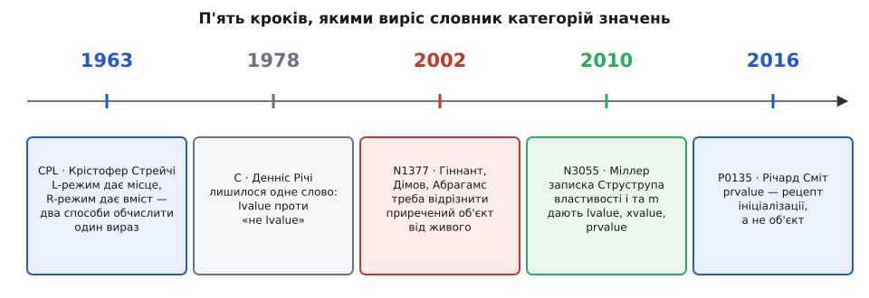

# 📜 Як народився словник lvalue, xvalue, prvalue

Слова, якими C++ описує вирази, збиралися понад півстоліття й аж три рази міняли зміст, не міняючи вигляду. Ця історія варта прочитання не заради дат: кожен її поворот показує, що категорія значення — не термінологічна прикраса, а те місце, куди комітет ішов правити мову, коли інші місця не допомагали.



*П'ять документів, між якими словник категорій виріс із двох слів до п'яти — і двічі змінив значення старих.*

## L-режим і R-режим: Крістофер Стрейчі

На початку 1960-х у Кембриджі й Лондонському університеті робили мову CPL (Combined Programming Language) — амбітну спробу зібрати в одне ціле все, що тоді вміли про програмування. Головним її ідеологом був Крістофер Стрейчі (Christopher Strachey), а перший публічний опис — стаття «The Main Features of CPL» (Barron, Buxton, Hartley, Nixon, Strachey) у *The Computer Journal* за 1963 рік. CPL так і не запрацювала як слід, зате від неї пішла BCPL, від BCPL — B, а від B — C. Разом із цією лінією передалися й два слова.

Стрейчі помітив ось що. Присвоєння `x := y` виглядає симетрично, але робота з лівим і правим боком цілком різна. Праворуч треба **вміст**: обчислити, дістати число й забути, звідки воно. Ліворуч треба **місце**: не число, що зараз лежить у `x`, а адреса комірки, куди покласти нове. Тож Стрейчі не став ділити вирази на два сорти — він розділив **обчислення** на два режими. Один і той самий вираз можна обчислити «у L-режимі» (*left-hand value*, результат — місце) або «у R-режимі» (*right-hand value*, результат — вміст). Компілятор дивиться на контекст і сам вирішує, який режим потрібен.

```
x := y

  ліворуч: обчислити x у L-режимі  →  адреса комірки
  праворуч: обчислити y у R-режимі →  вміст комірки
```

Витонченість цієї ідеї в тому, що вона нічого не забороняє наперед. Не «є вирази лівого сорту й вирази правого», а «є два питання до виразу, і не на кожне питання кожен вираз має відповідь». Число 7 у L-режимі обчислити просто нема як — у сімки немає комірки. Звідси й уся подальша плутанина: те, що починалося як **питання до виразу**, згодом стало **властивістю виразу**, і слова перестали означати те, що означали.

**Про статус фактів.** Авторство термінів за Стрейчі — усталене й засвідчене, зокрема Мартіном Річардсом (Martin Richards), автором BCPL, у його спогадах про роботу над CPL. А от найраніший **друкований** текст, де L-value і R-value визначено докладно, — це лекційні нотатки Стрейчі «Fundamental Concepts in Programming Languages» для літньої школи в Копенгагені (серпень 1967). Через редакційні затримки вони так і лишилися неопублікованими за життя автора й розійшлися приблизно у двох з половиною сотнях примірників; друком вийшли аж 2000 року, у пам'ятному випуску *Higher-Order and Symbolic Computation*. Тож «Стрейчі придумав ці слова для CPL» — це переказ, добре обґрунтований, але датований документ, на який спираються, старший за CPL на чотири роки.

## Річі: одного слова досить

У C від пари лишилося одне слово. Денніс Річі (Dennis Ritchie) узяв *lvalue*, а решту виразів назвав просто «не lvalue» — окремого імені їм не дав. Для мови, де об'єкт — це шматок пам'яті й нічого більше, цього справді вистачало: єдине питання, яке C ставить до виразу, — «чи є за ним місце». Є місце — можна присвоювати, можна брати `&`. Немає — не можна нічого.

Але вже в C буквальне пояснення «lvalue = те, що ліворуч» перестало працювати, і стандарт це визнав відкрито. У примітці до C99 (розділ про перетворення lvalue) сказано: назва пішла від виразу присвоєння `E1 = E2`, де ліворуч потрібен модифікований lvalue, проте краще розуміти її як **object locator value** — «значення, що вказує на об'єкт». Констатація промовиста: терміну ще й тридцяти років не було, а комітет уже пояснював, що читати його дослівно не варто.

Причина проста. Місце й дозвіл писати — різні речі. У `const int c = 5;` ім'я `c` має найсправжніше місце (можна взяти `&c`), але ліворуч від присвоєння стояти не може. Тобто «l» у назві вже тоді вказувало не туди. Слово лишилося, значення поїхало.

## 2002: N1377 і біда, якої не лікує бібліотека

Наступні двадцять років слова стояли непорушно, бо не було потреби ставити третє питання. Потреба з'явилася разом із коштом копіювання.

Розгляньмо `std::vector`, що дорощує буфер. Він виділяє більший шматок пам'яті й мусить перенести туди старі елементи. Якщо елемент — `std::string`, кожне «перенесення» насправді означає: виділити новий буфер у купі, побайтово переписати символи, звільнити старий. І так для кожного з тисяч елементів — при тому, що старі рядки одразу після цього помруть. Уся ця робота витрачається на копії, які проживуть мікросекунду.

Зарадити цьому можна одним прийомом: не переливати вміст, а **переставити покажчик** на вже виділений буфер, занулити його в джерелі — і деструктор джерела не звільнить нічого чужого. Прийом старий і очевидний. Питання лише в тому, як дати компіляторові право його застосувати: спустошити джерело законно рівно тоді, коли на джерело вже ніхто не подивиться.

У вересні 2002 року Говард Гіннант (Howard E. Hinnant), Петер Дімов (Peter Dimov) і Дейв Абрагамс (Dave Abrahams) подали до WG21 папір **N1377=02-0035, «A Proposal to Add Move Semantics Support to the C++ Language»**. Автори прямо називають переміщення оптимізацією швидкодії: перенести дорогий об'єкт з однієї адреси в іншу, обібравши ресурси джерела, щоб побудувати ціль якнайдешевше. Серед прикладів — саме дорощення вектора (де зиск оцінено в кілька разів і аж до вісімдесяти), узагальнений `swap`, що після цього стає майже таким самим швидким, як спеціалізований, і ланцюжок конкатенацій рядків, який вдається звести до одного виділення пам'яті замість багатьох.

Найцікавіше в N1377 — не сам механізм, а аргумент, **чому цього не можна зробити бібліотекою**. Спокуса очевидна: написати функцію `move_from(dst, src)` і кликати її там, де джерело приречене. Але бібліотечна функція не бачить того, що бачить компілятор. Мова C++03 давала рівно один спосіб прив'язатися до тимчасового об'єкта — `const T&`; біда в тому, що `const T&` однаково радо прив'язується й до звичайної константної змінної, яка житиме ще довго. Одна й та сама сигнатура, два цілком різні випадки — і в тілі функції їх ніяк не розрізнити. Автори формулюють це як подвійну вимогу: переміщувати з тимчасових треба, а переміщувати з `const`-об'єктів (навіть тимчасових) треба заборонити, — і в тодішній мові ці дві вимоги не роз'їжджалися.

Отже, механізм довелося вбудувати в **перевантаження**: нова форма посилання `T&&`, що прив'язується до тимчасових і не прив'язується до звичайних змінних, — і компілятор сам вибирає переміщувальну версію там, де джерело приречене. А щойно вибір перевантаження залежить від того, «якого сорту» вираз, — це вже не бібліотечна дрібниця, а зміна в класифікації виразів. Питань до виразу стало два, і старі два слова їх більше не покривали.

У тому ж N1377 з'явилося й правило, яке досі щороку ловить тисячі людей: іменоване rvalue-посилання при вживанні поводиться як lvalue. Не як недогляд, а свідомо — параметр має ім'я, назвати його можна двічі, тож мовчки грабувати його при першій згадці не можна. Правило народилося одночасно з самим механізмом, а не приросло до нього згодом.

## 2010: таксономія Міллера й дві букви Струструпа

До 2010 року в чернетці C++0x механізм уже був, а от опис виразів тріщав. Слова «lvalue» і «rvalue» тепер мусили нести два незалежні смисли — «за виразом стоїть об'єкт» і «в об'єкта можна забрати нутрощі», — і деякі вирази вимагали то одного, то другого. Формулювання стандарту доводилося писати перифразами, а це надійна ознака, що бракує імені.

12 березня 2010 року Вільям Міллер (William M. Miller) подав папір **N3055 = 10-0045, «A Taxonomy of Expression Value Categories»**, де класифікацію нарешті виписано системно. Тоді ж по комітету розійшлася коротка записка Бʼярне Струструпа (Bjarne Stroustrup) «"New" Value Terminology», що пояснювала логіку іменування; Струструп згадує, що мав нагоду розтлумачити її на зустрічі в Пітсбурзі.

Хід міркування в записці рівно такий, як його переказують донині. Є дві незалежні двійкові властивості виразу:

```
i (has identity)      — за виразом стоїть конкретний об'єкт,
                        до якого можна повернутися й упізнати його

m (can be moved from) — нутрощі об'єкта дозволено забрати,
                        бо позаду вже ніхто не дивиться

  i,  m  →  xvalue    (eXpiring value — той, що згасає)
  i, !m  →  lvalue
 !i,  m  →  prvalue   (pure rvalue — «чистий» rvalue)
 !i, !m  →  такої комбінації в мові не треба
```

Далі — найважливіший крок, і саме він робить систему зручною. Старі слова не викинули, а **переозначили як збірні**: `glvalue` (*generalized lvalue*) — це просто «i», тобто lvalue плюс xvalue; `rvalue` — це просто «m», тобто prvalue плюс xvalue. Кожна властивість дістала своє ім'я, а xvalue опинилося в обох множинах одразу — не через хитрість, а тому, що в нього обидві властивості. Звідси й характерна форма схеми, яку сам Струструп малює літерою W.

Іменування теж не випадкове. «pr» у prvalue — від *pure*: це те первісне, «чисте» rvalue, яке не має тотожності й тому не може бути назване вдруге. Літера «x» в xvalue — від *eXpiring*, «той, що згасає»; у записці Струструп жартує, що «x» водночас годиться на «незвідане, дивне, лише для експертів». Так у C++11 і закріпилася система, де слова 1960-х лишилися на місці, але означають вже не «ліворуч/праворуч від присвоєння», а відповіді на два цілком інші питання.

## 2016: P0135 забирає в prvalue об'єкт

Третя зміна значення прийшла з несподіваного боку — з оптимізації.

Довгі роки усунення копій (*copy elision*) було в стандарті **дозволом**: коли функція повертає тимчасовий об'єкт, компіляторові *дозволено* побудувати його одразу на місці призначення й не кликати копіювальний конструктор. Дозвіл — не обіцянка, і з нього виростали три різні неприємності. Перша: неможливо (або дуже важко) написати фабричну функцію, що повертає тип, який не вміє ні копіюватися, ні переміщуватися, — навіть якщо копія однаково буде усунута, стандарт вимагає, щоб придатний конструктор **існував** і був доступний. Друга: різниця між усуненою копією й викликом переміщувального конструктора не завжди мізерна, а переносний код не мав права на неї розраховувати. Третя, найглибша: коли семантика виконання залежить від вибору реалізації, страждає і переносність, і сама здатність міркувати про код.

У вересні 2015 року Річард Сміт (Richard Smith) подав **P0135R0, «Guaranteed copy elision through simplified value categories»** (редакція з формулюваннями, P0135R1, — червень 2016; увійшло до C++17). Назва містить усю суть: гарантія досягається **не** тим, що копію дозволено викинути, а тим, що копії просто нема звідки взятися.

Механізм такий. Раніше prvalue означало «тимчасовий об'єкт»: вважалося, що `T()` **створює** об'єкт, а далі його або копіюють у ціль, або (з ласки компілятора) не копіюють. P0135 переозначує prvalue як вираз, обчислення якого **ініціалізує** об'єкт, бітове поле чи операнд — той, що його задає контекст, у якому prvalue стоїть. Тобто prvalue більше не є об'єктом; це **рецепт ініціалізації**, який чекає, поки йому вкажуть, що саме ініціалізувати. Коротке правило, яким папір це підсумовує: prvalue виконують ініціалізацію, glvalue дають місця.

Наслідок виходить сам собою. У `T x = make();` контекст каже: ініціалізуй `x`. Рецепт застосовується просто до `x` — жодного проміжного об'єкта не виникає, отже, нема чого копіювати, отже, копіювальний і переміщувальний конструктори не потрібні навіть як формальність. А там, де об'єкт таки потрібен (скажімо, треба прив'язати посилання або звернутися до члена), стандарт запроваджує окремий крок — **матеріалізацію тимчасового**: prvalue перетворюється на xvalue, і об'єкт нарешті виникає. З'явився й новий термін для цілі рецепта — *result object*, об'єкт-результат.

І тут видно, чому це була зміна саме в категоріях, а не в оптимізаторі. Оптимізатор має право прибирати лише те, чого програма не може помітити; поки копія була частиною семантики, вона мусила лишатися перевіреною — з доступним конструктором, з `explicit`-правилами, з усім, що з цим пов'язано. Стандарт же описує не машинний код, а поведінку **абстрактної машини**. Щоб копія перестала бути обов'язковою на папері, її треба було прибрати з опису мови — а вона сиділа рівно в означенні prvalue. Комітет зробив те саме, що й 2010 року: пішов правити класифікацію виразів, бо решта інструментів до цієї шестерні не дотягувалася.

Три великі зміни за півстоліття — і жодного разу не міняли самі слова. Мінялися питання, на які вони відповідають: спершу «яким режимом обчислювати», потім «чи є за виразом місце», далі «чи є місце й чи можна його обібрати», нарешті — «місце це чи інструкція, як місце заповнити». Тому спроба вивести сучасне значення `prvalue` з букв «p» і «r» приречена: букви лишилися з мови, якою більше ніхто не пише.

**Що читати в архіві.** Усі згадані документи відкриті на `open-std.org`: [N1377](https://www.open-std.org/jtc1/sc22/wg21/docs/papers/2002/n1377.htm) (2002), [N3055](https://www.open-std.org/jtc1/sc22/wg21/docs/papers/2010/n3055.pdf) (2010), [P0135R0](https://www.open-std.org/jtc1/sc22/wg21/docs/papers/2015/p0135r0.html) і [P0135R1](https://www.open-std.org/jtc1/sc22/wg21/docs/papers/2016/p0135r1.html). Записка Струструпа — на його власному сайті, поза нумерацією WG21. Як влаштований сам цей потік паперів і хто з ким про них домовляється, розказано окремо: [Як робиться стандарт C++](book:cpp-standards/standardization-process) — комітет, робочі групи, нумеровані документи й трирічний цикл випуску. Механізм, задля якого все затівалося, розібрано в темі [Семантика переміщення і rvalue-посилання](book:cpp-standards/move-semantics), а те, чим скінчилася історія P0135 у сьогоднішній мові, — у темі [Усунення копій і гарантований RVO](book:cpp-standards/copy-elision).
