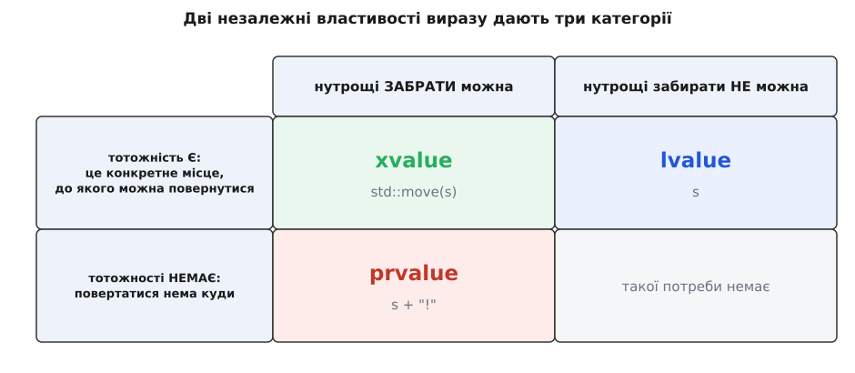
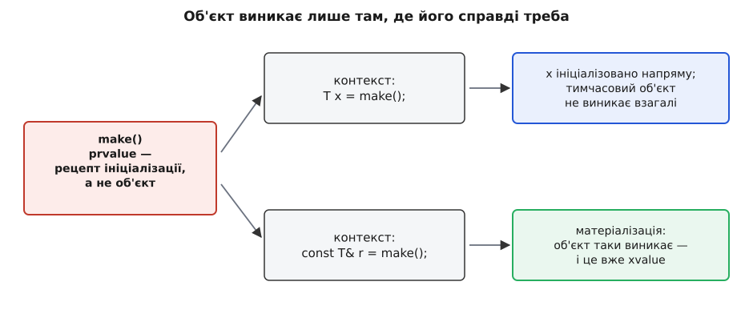
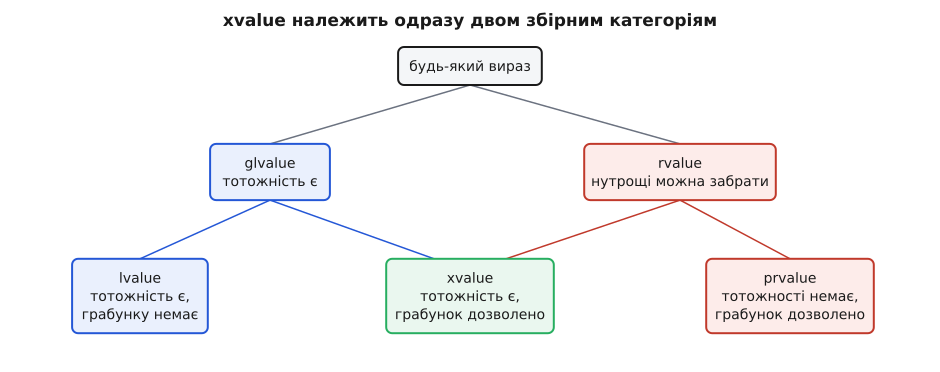

# Категорії значень: lvalue, prvalue, xvalue

<preknowlist>
- [Адреси й покажчики](topic:programming/addresses-pointers) — об'єкт займає місце в пам'яті, і на це місце можна вказати адресою.
- [Стек](topic:programming/stack-lifo) — автоматичні об'єкти живуть до кінця свого блоку й там же зникають.
- [Глибока й поверхнева копія](topic:programming/deep-shallow-copy) — різниця між копіюванням буфера і копіюванням покажчика на нього.
- [Рівність значень і тотожність посилань](topic:programming/value-equality-identity) — коли два імені позначають той самий об'єкт, а коли лише однакові дані.
</preknowlist>

Компілятор C++ дивиться на кожен вираз у програмі й мусить знати про нього дві речі. Перша очевидна — якого він типу. Друга не така очевидна, але без неї не працює половина мови: **що це за штука** — місце в пам'яті, до якого можна повернутися, чи мимобіжний результат, який зараз обчислився й одразу зникне. Відповідь на друге питання й називають категорією значення.

Легко подумати, що це формальність зі стандарту, яку знати не обов'язково. Але саме з неї виростають найпрактичніші правила мови: чому `std::move` нічого не переміщує; чому всередині функції, що приймає `T&&`, параметр раптом поводиться як звичайна змінна; чому `const std::string& s = f();` не залишає висячого посилання, а `const char* p = f().c_str();` залишає. Усі ці правила — наслідки однієї маленької класифікації, і коли її бачиш, вони перестають бути набором заклинань.

## Питання, з яким усе почалося

Найдавніший привід розрізняти вирази — присвоєння. У рядку `a = b;` два вирази стоять поруч, але робота з ними цілком різна. Від правого потрібне **число** — компілятор його обчислює й забуває, звідки воно взялося. Від лівого потрібне **місце** — адреса комірки, куди це число покласти. Написати `b = 7` можна, написати `7 = b` — ні: у сімки немає місця, у неї є тільки значення.

Звідси й старі назви. Термін *lvalue* (від англ. *left* — лівий) означав «те, що годиться зліва від присвоєння», *rvalue* (*right* — правий) — «те, що годиться тільки справа». Придумав їх Крістофер Стрейчі (Christopher Strachey) для мови CPL на початку 1960-х; від CPL пішла BCPL, від неї — B, а вже від B — C. У Стрейчі це були не так категорії виразів, як два режими обчислення: обчислити вираз «у L-режимі» означало здобути місце, «у R-режимі» — здобути вміст. Денніс Річі (Dennis Ritchie) переніс у C лише слово *lvalue*, вважаючи, що «lvalue» і «не lvalue» вистачить.

Назви прижилися, а от їхнє буквальне пояснення розсипалося майже одразу. Ось константа:

```cpp
const int c = 5;
c = 7;                 // помилка: присвоїти не можна
const int* p = &c;     // а адресу взяти можна — місце в неї є
```

`c` не годиться зліва від присвоєння, але це безсумнівне lvalue: у нього є адреса, до нього можна повернутися. А ось зворотний випадок:

```cpp
struct S { int v; };
S{1} = S{2};        // компілюється!
```

Тимчасовий об'єкт `S{1}` — класичний rvalue, проте зліва він стоїть цілком законно, бо в нього є неявний оператор присвоєння. Тобто «лівий/правий» уже давно нічого не пояснює. Що ж тоді насправді розрізняють ці слова?

## Дві незалежні властивості

Розділити вирази треба не за місцем у рядку, а за тим, що з ними **дозволено робити**. Питань, які має сенс ставити, рівно два — і вони незалежні одне від одного.

**Питання перше: чи має вираз тотожність?** Тобто чи позначає він конкретний об'єкт, до якого можна звернутися ще раз і впізнати, що це той самий. Ознака проста: за виразом стоїть реальне місце в пам'яті — до нього можна прив'язати посилання, і адреса цього місця існує. Змінна `s` має тотожність: можна написати `&s`, передати цю адресу кудись і через тиждень повернутися до тих самих байтів. Вираз `a + b` тотожності не має: він обчислив число, і питання «а де воно лежить?» безглузде — компілятор має право тримати його хоч у регістрі, хоч ніде, якщо результат нікому не знадобився.

**Питання друге: чи вільно забрати в об'єкта нутрощі?** Не скопіювати, а саме **забрати** — вкрасти буфер, лишивши позаду порожню шкаралупу. Це законно рівно тоді, коли позаду вже ніхто не дивиться: об'єкт от-от помре, і його спустошення ніхто не помітить.

Друге питання молодше за перше на півстоліття, і не випадково. До 2011 року знати, що об'єкт зараз помре, не було жодного зиску: копіювання лишалося копіюванням. Подивімося, скільки коштувала ця необізнаність:

```cpp
std::string build_name();

std::string name = build_name();
```

Функція всередині виділила буфер у купі, наповнила його символами й повернула рядок. Далі копіювальний конструктор чесно виділяв **другий** буфер, побайтово переливав туди символи — і повертався до першого, щоб його звільнити. Виділення, копіювання, звільнення — і все це заради буфера, який мав померти наступною мікросекундою. Ідея переміщення виросла саме з цієї безглуздості: якщо джерело однаково приречене, замість переливання можна просто **переставити покажчик** на буфер, а в джерелі занулити його, щоб деструктор не звільнив чуже. Але щоб компілятор мав право так вчинити, він мусить бути певен, що джерело справді приречене. Ця певність і є другою властивістю виразу.

Кожне з двох питань має відповідь «так» або «ні», тож комбінацій виходить чотири — а змістовних із них три.



*Тотожність і право на грабунок — незалежні питання; комбінація «ні тотожності, ні права» нікому не потрібна, тож категорій виходить три.*

Саме так цю систему й описав Бʼярне Струструп (Bjarne Stroustrup) у записці до комітету 2010 року, позначивши властивості буквами `i` (*has identity*) і `m` (*can be moved from*): комбінацій чотири, але четверта — «тотожності немає й забрати нічого не можна» — у мові ні до чого, бо вираз без тотожності однаково нікому не належить, і забороняти щодо нього нічого. Формальний опис таксономії ухвалили тоді ж, за працею Вільяма Міллера (William M. Miller) «A Taxonomy of Expression Value Categories» (документ N3055, 2010) — вона й лягла в C++11.

## lvalue: місце, до якого повернуться

Вираз має тотожність, і забирати в нього нутрощі не можна. Це найзвичніший випадок: ім'я змінної, розіменування покажчика `*p`, елемент масиву `arr[i]`, поле `obj.field`, виклик функції, що повертає `T&`. Сюди ж належать і два вирази, які часто дивують: ім'я функції (у неї є адреса, її можна взяти) і **рядковий літерал** `"hello"` — це не число, а справжній масив `const char[6]` (п'ять символів плюс завершальний нуль), який лежить у статичній пам'яті програми й має адресу.

> 🔧 **Навіщо це.** Саме тому `sizeof("hello")` дає 6, а не розмір покажчика: літерал — це масив, а не адреса. Побачити в ньому lvalue — значить перестати дивуватися такому результату (і не намагатися передати літерал туди, де чекають `char*` без `const`).

Найважливіше про lvalue — не перелік, а одне правило, яке ламає інтуїцію більшості новачків. Розгляньмо функцію, що обіцяє приймати тільки приречені об'єкти:

```cpp
void consume(std::string&& text) {
    log(text);                // ① просто читаємо
    storage.push_back(text);  // ② а тут — копія, не переміщення!
}
```

Тип параметра — `std::string&&`, посилання на rvalue. Здавалося б, усередині функції `text` теж має бути rvalue. Але ні: **вираз `text` — це lvalue**, і в рядку ② відбудеться повноцінне копіювання буфера.

Чому так — видно, якщо уявити протилежне. Хай би `text` було rvalue. Тоді рядок ① не просто прочитав би рядок, а вже міг би його спустошити — і рядок ② дістав би порожнечу. Параметр має **ім'я**; усе, що має ім'я, можна назвати вдруге, втретє, у циклі. Отже, грабувати його мовчки не можна: наступне звертання побачило б понівечений об'єкт. Звідси й правило, коротке й безвинятково точне: **іменований об'єкт — завжди lvalue, хоч би якого типу було його оголошення.** Тип змінної й категорія виразу — різні речі: `std::string&& text` — це тип, що описує, **звідки прийшов** аргумент; а `text` як вираз описує, **як із ним поводитися тут**.

Наслідок цього правила бачать усі, хто писав переміщувальний конструктор: усередині доводиться писати `std::move` навіть над тим, що вже прийшло як `&&`.

```cpp
Parcel::Parcel(Parcel&& other)
    : payload(std::move(other.payload))   // без move тут була б копія
{}
```

## prvalue: значення, для якого ще немає місця

Друга комбінація — тотожності немає, забрати можна. Стандарт зве її *prvalue*, «чисте rvalue» (*pure rvalue*). Сюди належать літерали `42` і `true`, результат арифметики `a + b`, виклик функції, що повертає **за значенням**, конструювання `std::string{"текст"}`, вираз `&x` (адреса — це число, у самого числа адреси немає), лямбда-вираз і навіть `this`.

І тут починається найцікавіше, бо саме з prvalue пов'язана найглибша зміна в цій системі — та, що сталася в C++17.

До C++17 prvalue означало «тимчасовий об'єкт». Вираз `build_name()` створював десь у пам'яті безіменний `std::string`, а далі його копіювали (або переміщували) в `name`. Компіляторам **дозволяли** цю копію пропустити — оптимізація звалася copy elision, — але саме дозволяли, а не вимагали: копіювальний конструктор мусив існувати й бути доступним, навіть якщо його ніхто не викличе.

C++17 переставив акцент. Тепер prvalue — **не об'єкт**, а *рецепт*: опис того, як ініціалізувати об'єкт, коли (і якщо) той знадобиться. Формулювання зі стандарту звучить саме так: prvalue — це вираз, обчислення якого **ініціалізує об'єкт**. Не «створює тимчасовий і копіює», а прямо ініціалізує той об'єкт, який вимагає контекст.



*Prvalue лишається рецептом, поки контекст не змусить об'єкт справді виникнути.*

У рядку `std::string name = build_name();` рецепт застосовується безпосередньо до `name`. Ніякого тимчасового об'єкта не виникає — не «виникає й усувається», а не виникає взагалі. Тому цей код тепер працює навіть для типу, який неможливо ні копіювати, ні переміщувати:

```cpp
struct Lock {
    Lock() = default;
    Lock(const Lock&) = delete;
    Lock(Lock&&)      = delete;
};

Lock make_lock() { return Lock{}; }

Lock lk = make_lock();   // C++17: працює; C++14: помилка компіляції
```

А якщо об'єкт таки потрібен — скажімо, до prvalue треба прив'язати посилання чи взяти в нього поле, — вмикається окреме перетворення, **матеріалізація тимчасового** (*temporary materialization conversion*): рецепт виконується, з'являється справжній тимчасовий об'єкт, і вираз стає… xvalue. Тобто prvalue перетворюється на xvalue рівно в ту мить, коли отримує місце в пам'яті, а разом із місцем — тотожність.

> 🔧 **Навіщо це.** Фабрична функція тепер може повертати за значенням тип, що взагалі не рухається — м'ютекс усередині, самопосилання, `atomic`. Раніше доводилося або віддавати `unique_ptr`, або вигадувати двофазну ініціалізацію. Гарантія C++17 прибирає цей клас обхідних рішень цілком.

Механіку гарантованого усунення копій — які саме випадки гарантовані, чим вони відрізняються від давнішої необов'язкової оптимізації повернення іменованого об'єкта і де вона досі не працює — розбирає окрема тема [усунення копій](topic:cpp-standards/copy-elision).

## xvalue: об'єкт, який уже нікому не потрібен

Третя комбінація — тотожність є, і грабувати дозволено. Назва *xvalue* — від *eXpiring value*, «згасаюче значення»: об'єкт існує, у нього є адреса, але його доля вже вирішена.

Звідки такі вирази беруться? Джерел кілька, і всі вони зводяться до одного: хтось явно заявив, що об'єкт більше не потрібен.

- `std::move(x)` — найчастіше джерело;
- виклик функції, оголошеної як `T&& f();`;
- звертання до поля xvalue: якщо `a` — xvalue, то й `a.m` — xvalue;
- матеріалізація prvalue, як щойно описано;
- `static_cast<T&&>(x)` — власне те, чим `std::move` і є всередині.

Останній пункт вартий окремого наголосу, бо навколо `std::move` наросло непорозуміння, яке коштує людям годин відлагоджування. **`std::move` нічого не переміщує.** Це шаблонна функція, у тілі якої — одне-єдине зведення типу:

```cpp
template <typename T>
constexpr std::remove_reference_t<T>&& move(T&& arg) noexcept {
    return static_cast<std::remove_reference_t<T>&&>(arg);
}
```

Жодного байта не переставлено. Змінилася тільки **категорія виразу**: те, що було lvalue, стало xvalue. Далі за цю зміну чіпляється перевантаження — компілятор бачить xvalue й обирає конструктор `Parcel(Parcel&&)` замість `Parcel(const Parcel&)`. Переміщення робить **той конструктор**, а `move` лише дав йому дозвіл спрацювати. Точніша назва для цієї функції була б «дозволити пограбувати», але історично прижилася коротша.

Із цього одразу випливає пастка, від якої не рятує ані компілятор, ані попередження:

```cpp
const std::string source = "довгий текст";
std::string copy = std::move(source);   // тихо КОПІЮЄ
```

`std::move` над `const std::string` дає `const std::string&&`. Це справді xvalue — але **константне**. Переміщувальний конструктор приймає `std::string&&` без `const`, бо він мусить понівечити джерело, а нівечити константу не можна. Отже, він не підходить, і перевантаження мовчки з'їжджає на копіювальний конструктор `std::string(const std::string&)`. Код компілюється, працює, дає правильний результат і рівно нічого не пришвидшує.

> 🔧 **Навіщо це.** Коли профіль показує копії там, де ви «точно поставили move», найперше перевірте `const` на джерелі — і на полях класу теж. Одне зайве `const` на члені перетворює весь переміщувальний конструктор типу на копіювальний, і жодне попередження компілятора про це не скаже.

Ширшу картину — які операції утворюють пару з переміщенням, що лишається в пограбованому об'єкті й чому стандарт вимагає від нього бути «дійсним, але невизначеним», — розгортає тема [семантика переміщення](topic:cpp-standards/move-semantics).

## Дві збірні категорії й чому дерево саме таке

Три основні категорії — це листя. Але правила мови зручніше формулювати не про кожну окремо, а про **одну властивість за раз**, бо саме за властивостями вони й влаштовані. Тому стандарт має ще дві збірні назви:

- **glvalue** (*generalized lvalue*) — усе, що має тотожність: lvalue плюс xvalue;
- **rvalue** — усе, що дозволено грабувати: prvalue плюс xvalue.



*xvalue має обидві властивості одразу, тому потрапляє і в glvalue, і в rvalue — це не дефект схеми, а її суть.*

Схема виглядає дивно рівно доти, доки читаєш її як «класифікацію на види». Це не класифікація, а **дві накладені одна на одну відповіді**, і xvalue лежить на їхньому перетині. Кожна збірна назва існує тому, що є правила, яким байдужа друга властивість.

«Прочитати значення можна з glvalue» — байдуже, приречений об'єкт чи ні, важливо лише, що місце є й у ньому щось лежить. (Перетворення «взяти вміст із місця» стандарт так і зве — *lvalue-to-rvalue conversion*; prvalue йому не підлягає, бо prvalue **сам є** значенням, брати з нього нічого.) Так само `typeid` над glvalue поліморфного типу дає **справжній** тип об'єкта, а не оголошений: питати про динамічний тип є в кого лише тоді, коли об'єкт існує. І навпаки: «`T&&` прив'язується до rvalue» — байдуже, є вже місце чи ще ні, важливий лише дозвіл на грабунок.

Зауважте, що не кожне правило формулюється через збірні категорії: узяти адресу оператором `&` можна тільки в **lvalue**. Тому `&std::move(x)` не компілюється, хоч об'єкт і існує. Мова навмисне не дає взяти адресу того, що ви щойно оголосили приреченим: збережений покажчик пережив би сам об'єкт.

## Правила зв'язування як прямий наслідок

Тепер таблиця, яку зазвичай зубрять, читається сама собою. Знак ✓ означає «прив'язується».

| посилання | lvalue | xvalue | prvalue |
|---|---|---|---|
| `T&` | ✓ | — | — |
| `const T&` | ✓ | ✓ | ✓ |
| `T&&` | — | ✓ | ✓ |
| `const T&&` | — | ✓ | ✓ |

Розберімо кожен рядок причинно, а не як факт.

`T&` — це «я збираюся сюди писати, і запис має бути помітним ззовні». Записати в приречений об'єкт технічно можливо, але безглуздо: запис помре разом із ним. Майже завжди це описка, тож мова її забороняє. Саме тому `void modify(std::string& s)` не приймає виклику `modify("текст")` — і це рятує від класичної помилки «функція старанно змінила тимчасову копію».

`const T&` бере все. Читати з приреченого об'єкта безпечно, а щоб не читати з уже мертвого, мова додає окрему підпору: **тимчасовий, прив'язаний до константного посилання, живе стільки ж, скільки саме посилання**. Отже, `const std::string& s = build_name();` цілком коректний — тимчасовий доживе до кінця блоку.

`T&&` — навпаки, «я збираюся тут грабувати». Тому годиться лише те, чиї нутрощі належать нікому: prvalue й xvalue, тобто rvalue. Це і є причина, чому категорії взагалі знадобилося робити частиною системи типів: без них не було б чим відрізнити «сюди можна» від «сюди не можна».

`const T&&` — комбінація майже безглузда (грабувати, не змінюючи?), і в реальному коді трапляється хіба як спосіб **заборонити** щось: оголошення `void f(const T&&) = delete;` відсікає виклики з тимчасовими, залишаючи дозволеними тільки виклики з іменованими об'єктами.

Коли перевантажень кілька, працює звичайне впорядкування за точністю збігу: для rvalue-аргумента `f(T&&)` точніша за `f(const T&)`, тому виграє вона; для lvalue-аргумента `f(T&&)` взагалі не розглядається, і лишається `f(const T&)`. Ця пара — типовий спосіб написати функцію, яка копіює з довговічного джерела й переміщує з приреченого. Тонкощі зв'язування — які ще бувають посилання, як поводяться посилання на масиви й функції, як згортаються посилання на посилання — у темі [посилання й правила зв'язування](topic:cpp-standards/references-binding).

Окремо варто знати межі продовження часу життя, бо вони не інтуїтивні. Продовження працює **тільки** тоді, коли посилання прив'язується до тимчасового **безпосередньо**. Щойно між ними стає функція — усе ламається:

```cpp
const std::string& pass_through(const std::string& s) { return s; }

const std::string& bad = pass_through(std::string{"текст"});
// тимчасовий помер наприкінці ЦЬОГО рядка; bad — висяче посилання
```

Функція повернула посилання, а не тимчасовий; прив'язування сталося не до тимчасового напряму, і продовжувати нічому. Так само не рятує ініціалізація посилального **члена** класу в списку ініціалізації: тимчасовий помре після виходу з конструктора. Довго й прикро жила ще одна діра — тимчасові у виразі-діапазоні циклу `for`:

```cpp
for (auto& item : make_wrapper().items()) { /* ... */ }
```

Тут `make_wrapper()` — тимчасовий, до якого посилання не прив'язується напряму, тож до C++23 він помирав ще до першої ітерації. Папір P2718R0 («Wording for P2644R1 Fix for Range-based for Loop»), ухвалений у C++23, продовжив час життя **всіх** тимчасових з виразу-діапазону на весь цикл; GCC і Clang цю поведінку реалізували. У старіших стандартах єдиний надійний засіб — завести іменовану змінну для обгортки перед циклом. Ширше про те, як саме об'єкт помирає й що вважається зверненням до мертвого, — у темах [час життя об'єкта](topic:cpp-standards/object-lifetime) і [висячі посилання](topic:cpp-standards/dangling-references).

## Як побачити категорію на власні очі

Категорію виразу можна не вгадувати, а виміряти — у мові є на це готовий інструмент, і працює він завдяки одній навмисній дивовижі в правилах `decltype`.

`decltype` має дві різні поведінки, і вибір між ними залежить від **дужок**:

- `decltype(expr)`, де `expr` — просте ім'я або звертання до члена: віддає **оголошений тип** цієї сутності, категорію ігнорує;
- `decltype((expr))` — тобто будь-що інше, зокрема те саме ім'я в зайвих дужках: віддає тип, **закодований категорією**: `T` для prvalue, `T&` для lvalue, `T&&` для xvalue.

Друга форма — це рівно те, що нам потрібно: категорія, переведена в тип, з яким уже вміють працювати риси типів. Ось повний вимірювач:

```cpp
#include <iostream>
#include <string>
#include <type_traits>

// Категорію ЗАКОДОВАНО у вигляді типу: T& → lvalue, T&& → xvalue, T → prvalue
template <typename T> struct Category      { static constexpr auto name = "prvalue"; };
template <typename T> struct Category<T&>  { static constexpr auto name = "lvalue";  };
template <typename T> struct Category<T&&> { static constexpr auto name = "xvalue";  };

#define VALUE_CATEGORY(expr) (Category<decltype((expr))>::name)

std::string make();            // повертає за значенням
std::string& ref();            // повертає посилання на lvalue
std::string&& expiring();      // повертає посилання на rvalue

int main() {
    std::string s = "текст";
    std::string&& r = make();   // r — ЗМІННА типу «посилання на rvalue»

    std::cout << VALUE_CATEGORY(s)            << '\n';   // lvalue
    std::cout << VALUE_CATEGORY(r)            << '\n';   // lvalue  ← має ім'я!
    std::cout << VALUE_CATEGORY(std::move(s)) << '\n';   // xvalue
    std::cout << VALUE_CATEGORY(make())       << '\n';   // prvalue
    std::cout << VALUE_CATEGORY(ref())        << '\n';   // lvalue
    std::cout << VALUE_CATEGORY(expiring())   << '\n';   // xvalue
    std::cout << VALUE_CATEGORY(s + "!")      << '\n';   // prvalue
    std::cout << VALUE_CATEGORY(s[0])         << '\n';   // lvalue
    std::cout << VALUE_CATEGORY("літерал")    << '\n';   // lvalue
    std::cout << VALUE_CATEGORY(42)           << '\n';   // prvalue
}
```

Другий рядок виводу — той самий, що ламає інтуїцію: змінна оголошена як `std::string&&`, а вираз із її іменем дає `std::string&`, тобто lvalue. Це не домовленість опису, а те, що компілятор справді підставляє в `decltype`.

Побудову такого вимірювача крок за кроком — від наївної спроби через `std::is_reference` до варіанта, що переживає `const`, бітові поля й вирази з комами, — а також перелік виразів, на яких інтуїція найчастіше промахується, розібрано у [вставці про вимірювач категорій](topic:cpp-standards/value-categories/proj-category-probe.md). Там же — чому макрос неминучий і чому функція для цього не годиться.

Сам `decltype` як засіб — окрема тема з власними тонкощами (`decltype(auto)`, поведінка на викликах функцій, взаємодія з шаблонами): [decltype](topic:cpp-standards/decltype).

## Де категорії проступають у щоденному коді

**`auto` губить категорію.** Виведення типу для `auto` працює як для параметра шаблону: посилання й `const` верхнього рівня відкидаються. Тому `auto x = ref();` мовчки копіює, хоч функція повернула посилання. Хочете посилання — пишіть `auto&` чи `decltype(auto)`. Докладніше — у темі [auto й виведення типу](topic:cpp-standards/auto-type-deduction).

**`return std::move(local);` шкодить.** Здається, що це «допомога компілятору», а насправді — перешкода. Повернення локальної змінної й так розглядається як переміщення (правила повернення спершу пробують трактувати вираз як rvalue), а до того ж дозволяє оптимізацію, за якої локальна змінна одразу будується на місці результату. `std::move` перетворює вираз на xvalue, і ця оптимізація стає неможливою: замість «нуль дій» виходить «одне переміщення».

**Універсальні посилання — не rvalue-посилання.** Параметр `T&&` у шаблоні, де `T` виводиться, прив'язується і до lvalue, і до rvalue; яку категорію мав аргумент, зберігається у виведеному `T`. Щоб не втратити її при передаванні далі, потрібен `std::forward`, а не `std::move`. Це окрема механіка, побудована прямо на категоріях: [ідеальне передавання](topic:cpp-standards/perfect-forwarding).

**Ключове слово `const` міняє картину зв'язування цілком.** Константність джерела вимикає переміщення тихо, без діагностики, і це найчастіша причина «move, що не працює»; те саме стосується `const`-полів усередині класу. Системний погляд на те, де `const` доречний, а де шкодить, — у темі [коректність за const](topic:cpp-standards/const-correctness).

## Одне речення, з якого все виводиться

Усю таксономію можна стиснути в правило, яке легко тримати в голові: **у виразу є ім'я — значить, до нього повернуться, значить, грабувати не можна.**

Змінна має ім'я — lvalue. Параметр `std::string&& text` має ім'я — теж lvalue, попри тип. `std::move(x)` імені не має (це вираз, а не сутність), зате має адресу об'єкта — xvalue. Виклик `make()` не має ні імені, ні поки що місця — prvalue. `T&` вимагає довговічного об'єкта — отже, тільки іменоване. `T&&` обіцяє грабунок — отже, тільки безіменне.

І звідси ж — найважливіше практичне уточнення: **категорія належить виразу, а не об'єктові й не типу.** Один і той самий рядок у пам'яті може виступати то як lvalue (`s`), то як xvalue (`std::move(s)`) — залежно від того, як ви на нього щойно послалися. Компілятор класифікує не речі, а **способи про них сказати**; переміщення чи копіювання обирається за тим, як ви назвали об'єкт у конкретному місці коду, а не за тим, що він таке.

Історію того, як мова дійшла до цієї системи — від L-режиму й R-режиму Стрейчі через пропозицію переміщення 2002 року до перевизначення prvalue в C++17, — розібрано у [вставці з історією категорій](topic:cpp-standards/value-categories/hist-value-categories.md).
