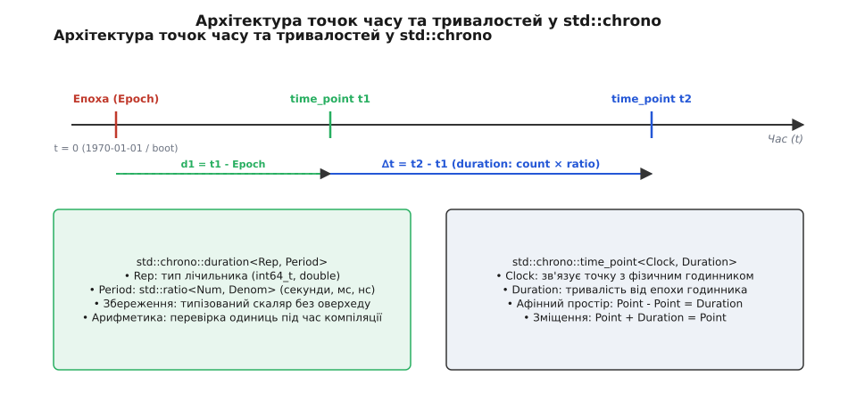
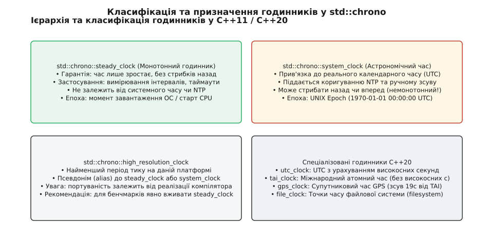

# Типізований вимір часу: механіка та архітектура бібліотеки std::chrono

<preknowlist>
- [Історія та системний час C](topic:cpp-standards/chrono/hist-chrono-evolution.md) — типи `time_t`, `struct timespec` та системні виклики `clock_gettime`.
- [Специфікація типів та інтерфейсів](topic:cpp-standards/chrono/api-chrono-type-system.md) — повний довідник шаблонів `duration`, `time_point` та годинників.
- [Високоточний хронометр](topic:cpp-standards/chrono/proj-high-res-timer.md) — практичний розрахунок затримок та бенчмаркінг.
</preknowlist>

25 лютого 1991 року під час війни в Перській затоці американська зенітно-ракетна батарея Patriot у місті Дхахран не змогла перехопити іракську балістичну ракету Scud. Ракетний комплекс промазав на 600 метрів, внаслідок чого ракета влучила у казарми і загинуло 28 військовослужбовців. Причиною катастрофи виявилася похибка обчислення часу у внутрішньому таймері системи керування вогнем.

Обчислювальний комп'ютер батареї відраховував час у десятих частках секунди (інтервал 0.1 секунди) через цілочисельний лічильник тиків. Для отримання часу в секундах значення лічильника множилося на число `1/10`, яке було представлене в двійковій системі з плаваючою точкою як нескінченний періодичний дріб `0.00011001100110011001100..._2`. Оскільки регістр обчислювального блоку мав обмежену розрядність у 24 біти, двійкове значення усікалося з відносною похибкою приблизно `0.000000095` секунди на кожну десяту секунди.

За 100 годин безперервної роботи системи лічильник тиків досяг значення `3 600 000` (360 000 секунд). Множення цього великого числа на усічену константу `1/10` накопичило абсолютну похибку у `0.34` секунди. Для ракети Scud, яка рухається з надзвуковою швидкістю понад 1600 метрів на секунду, ця третина секунди розсинхронізації між радаром обчислення траєкторії та стартовою позицією означала зміщення зони перехоплення на 600 метрів.

Подібні катастрофи ставалися і в інших критичних сферах: у 1999 році через розбіжність між англійськими та метричними одиницями вимірювання було втрачено космічний апарат Mars Climate Orbiter вартістю 125 мільйонів доларів. Ці трагічні факти переконують розробників у важливості суворого типізування фізичних величин у реальному часі. Безпека програмного забезпечення залежить від точності типізації на етапі компіляції.

Ці катастрофи є класичним прикладом того, що відбувається, коли програміст оперує часом та фізичними величинами як «просто числом» без строгого типізованого опису одиниць виміру, автоматичного контролю розрядності та перевірки точних конверсій на рівні компілятора.

## 1. Проблема нетипізованого часу та витоки системних багів

У традиційній системній розробці на мовах C та C++03 тривалість затримок, таймаути мережевих викликів та інтервали виконання описувалися звичайними скалярними типами даних: `int`, `unsigned long` або `double`.

```cpp
// Нетипізована сигнатура у C/C++03: у чому вимірюється timeout?
void configure_network_timeout(int timeout);
```

У такій сигнатурі виникає фундаментальна амбівалентність програмного інтерфейсу:
- Розробник модуля А припускає, що аргумент `timeout` вимірюється в секундах.
- Розробник клієнтського коду Б передає значення `500`, маючи на увазі мілісекунди.
- В результаті мережеве з'єднання очікує відповіді 500 секунд (понад 8 хвилин) замість пів секунди, блокуючи системний потік виконання.

Аналогічні пастки виникають у системних C-функціях затримки потоку: виклик `sleep(5)` приймає секунди, виклик `usleep(500000)` очікує мікросекунди, системний виклик `poll(fds, nfds, 500)` приймає мілісекунди, а функція `select()` вимагає заповнення структури `struct timeval` із мікросекундним полем. Плутанина між цими інтерфейсами у великих програмних комплексах є постійним джерелом багів у runtime, які виявляються лише під час промислової експлуатації.

Спроби вирішити цю проблему за допомогою угод про найменування змінних (`timeout_ms`, `delay_us`) або макросів не рятували великі проєкти від помилок: компілятор сприймає `timeout_ms` і `timeout_sec` як один і той самий тип `int`. Компілятор не здатний зупинити неявне присвоєння секунд у мікросекунди без явно прописаної системи типів.

Іншою вагомою проблемою є проблема переповнення 32-бітного часу (Y2K38 Problem). Тип `time_t` у 32-бітних системах описується як 32-бітне ціле число зі знаком. 19 січня 2038 року о 03:14:07 UTC значення лічильника переповниться і перейде від `2 147 483 647` до від'ємного значення `-2 147 483 648`, що сприйметься системою як 13 грудня 1901 року.

Крім того, накопичення тривалостей через `double` призводить до поступової втрати точності молодших розрядів (втрата точності мантиси `double`, яка зберігає лише 53 біти значущих цифр). Через кілька діб роботи системи додавання 1 наносекунди до великого значення секунд у `double` перестає змінювати число взагалі, оскільки 1 наносекунда виходить за межі роздільної здатності мантиси.

Для усунення цих проблем у C++11 було розроблено модуль `<chrono>`, який переніс перевірку фізичної розмірності часу з етапу виконання у чистий етап компіляції без додавання жодних накладних витрат (zero-overhead abstraction). Детальний огляд історичного шляху від C-структур `time_t` та `gettimeofday` до стандарту C++11 наведено у вставці [Еволюція вимірювання часу в C та C++](topic:cpp-standards/chrono/hist-chrono-evolution.md).

## 2. Три стовпи моделі std::chrono: Тривалість, Точка часу, Годинник

В основі бібліотеки `<chrono>` лежить математична концепція **афінного простору** (affine space). У фізиці та математиці напрямлений часовий простір розрізняє дві принципово різні категорії величин:
1. **Точки часу (Time Points):** позиції на часовій осі відносно фіксованого початку відліку (епохи).
2. **Вектори тривалості (Durations):** зміщення між двома точками часу.

Математично афінний простір часу визначається як множина точок `P` та пов'язаний із нею векторний простір `V` тривалостей, для яких виконуються такі аксіоми:
1. Для будь-якої точки `p` з множини `P` та вектора тривалості `v` з простору `V` існує єдина точка `q = p + v` у множині `P`.
2. Для будь-яких двох точок `p` та `q` з множини `P` існує єдиний вектор тривалості `v = q - p` у просторі `V`.
3. Виконується асоціативність: `(p + v1) + v2 = p + (v1 + v2)`.

Модель `std::chrono` розділяє вимірювання часу на три фундаментальні абстракції, що точно відображають аксіоми афінного простору:

- **Тривалість (duration, від лат. *durare* — тривати):** це скалярний інтервал, що описує різницю між двома моментами часу. Вона складається з кількості тиків (значення `Rep`) та фіксованої тривалості одного тику (`Period`).
- **Точка часу (time_point, від лат. *tempus* — час та *punctum* — точка):** це момент часу, виражений як тривалість (зсув), відрахована від початку відліку (епохи, від грец. *ἐпоχή* — зупинка, точка відліку) конкретного годинника.
- **Годинник (Clock, від старофр. *cloche* — дзвін):** це тип, який зв'язує точки часу з фізичною реальністю. Він визначає початкову епоху, роздільну здатність тиків та властивість монотонності (`is_steady`).


*Архітектура точок часу, епох та тривалостей в афінному просторі std::chrono.*

Алгебра афінного простору `std::chrono` забороняє некоректні з фізичної точки зору операції на етапі компіляції:

```
Point - Point = Duration   [Віднімання точок часу повертає інтервал]
Point + Duration = Point   [Додавання інтервалу до точки повертає нову точку]
Point - Duration = Point   [Зсув точки часу назад у минуле]
Duration + Duration = Duration [Додавання двох інтервалів часу]

Point + Point = ПОМИЛКА КОМПІЛЯЦІЇ [Додавання двох точок часу позбавлене фізичного сенсу!]
```

Якщо розробник спробує скласти дві точки часу `tp1 + tp2`, компілятор згенерує помилку синтаксису. Це виключає цілий клас логічних помилок при розрахунку таймаутів.

## 3. Анатомія std::chrono::duration та статична арифметика std::ratio

Класовий шаблон `std::chrono::duration` описує тривалість і приймає два параметри шаблону:

```cpp
template <class Rep, class Period = std::ratio<1>>
class duration;
```

### Числовий тип лічильника (Rep) та період тику (Period)

Параметр `Rep` визначає числовий тип, у якому зберігається лічильник тиків (наприклад, `int64_t`, `int32_t` або `double`).

Параметр `Period` описує тривалість одного тику у секундах за допомогою статичного меташаблону раціональних чисел `std::ratio<Num, Denom>`. Описувач `std::ratio<1, 1000>` вказує, що один тик становить `1/1000` секунди (мілісекунду). Для мікросекунд використовується `std::ratio<1, 1000000>`, а для хвилин — `std::ratio<60, 1>`.

Меташаблон `std::ratio` виконує скорочення дробів на етапі компіляції за допомогою алгоритму Евкліда для пошуку найбільшого спільного дільника (НСД/GCD). Наприклад, `std::ratio<60, 1000>` автоматично згортається у `std::ratio<3, 50>`.

### Метапрограмування раціональних чисел std::ratio

Класовий шаблон `std::ratio` реалізований як метапрограмувальний комплекс на етапі компіляції. Для двох раціональних чисел `std::ratio<R1_num, R1_den>` та `std::ratio<R2_num, R2_den>` стандарт надає статичні операції метаарифметики:
- `std::ratio_add`: додавання раціональних чисел.
- `std::ratio_subtract`: віднімання раціональних чисел.
- `std::ratio_multiply`: множення раціональних чисел.
- `std::ratio_divide`: ділення раціональних чисел.

На етапі компіляції шаблон `std::ratio_add` розраховує спільний знаменник через НСК (найменше спільне кратне) та НСД, згортаючи математичний вираз до незвідного дробу. Для запобігання цілочисельному переповненню при множенні великих чисельників та знаменників стандартні бібліотеки під час метаобчислень використовують 128-бітну цілочисельну арифметику (`__int128_t` на GCC/Clang).

```cpp
// Визначення кастомної тривалості: 1 тик = 1/90000 секунди (частота відео-кадрів RTP)
using rtp_timestamp_duration = std::chrono::duration<int64_t, std::ratio<1, 90000>>;

// Визначення кастомної тривалості для ігрового рушія: 1 тик = 1/60 секунди (60 FPS)
using game_tick_duration = std::chrono::duration<int64_t, std::ratio<1, 60>>;

// Тривалість для аудіо-семплів: 1 тик = 1/48000 секунди (48 кГц аудіо-потік)
using audio_sample_duration = std::chrono::duration<int64_t, std::ratio<1, 48000>>;
```

### Суворі правила неявного приведення типів

Система типів C++ регулює неявне перетворення між різними тривалостями. Перетворення є **неявним і безпечним** тоді й лише тоді, коли цільовий тип тривалості має дрібніший період (вищу роздільну здатність), ніж джерельний тип.

```cpp
using namespace std::chrono;

seconds sec(5);
milliseconds ms = sec; // НЕЯВНЕ ПЕРЕТВОРЕННЯ: 5000 ms (компілюється без оверхеду)
```

Тут 1 секунда є точно кратною 1000 мілісекундам. Компілятор помножує 5 на 1000 на етапі компіляції або генерує одну інструкцію множення в машинному коді.

Якщо ж розробник намагається виконати небезпечне перетворення з дрібнішого періоду у більший (з втратою точності цілочисельного ділення), компілятор **забороняє** неявне приведення:

```cpp
milliseconds ms(1500);
// seconds sec = ms; // ПОМИЛКА КОМПІЛЯЦІЇ! Втрата 500 мілісекунд при цілочисельному діленні

// Явне перетворення через duration_cast відтинає дробову частину
seconds sec = duration_cast<seconds>(ms); // Отримуємо 1 секунду (усічення)
```

Для обчислення бінарних арифметичних операцій між тривалостями з різними періодами (наприклад, `seconds(2) + milliseconds(500)`) стандарт використовує меташаблон `std::common_type`. Для двох тривалостей `duration<R1, P1>` та `duration<R2, P2>` результат автоматично приводиться до спільного типу `duration<std::common_type_t<R1, R2>, std::ratio<GCD(P1::num, P2::num), LCM(P1::den, P2::den)>>`. Завдяки цьому результатом додавання 2 секунд та 500 мілісекунд стає `milliseconds(2500)`, що виключає втрату дробової частини.

Для точного керування округленням у C++17 додано явні функції:
- `std::chrono::floor`: округлення донизу (до мінус нескінченності). Наприклад, `floor<seconds>(-1500ms)` повертає `-2s`.
- `std::chrono::ceil`: округлення догори (до плюс нескінченності). Використовується при розрахунку затримок таймерів, щоб потік гарантовано проспав не менше вказаного часу.
- `std::chrono::round`: округлення до найближчого парного значення.
- `std::chrono::abs`: абсолютне значення тривалості.

```cpp
milliseconds ms_neg{-1500};
seconds s_floor = floor<seconds>(ms_neg); // -2 секунди
seconds s_trunc = duration_cast<seconds>(ms_neg); // -1 секунда (усічення до нуля)
```

### Зручні суфікси літералів (C++14)

З стандарту C++14 додано користувальницькі літерали (User-defined literals) у простір імен `std::chrono_literals`:

```cpp
using namespace std::chrono_literals;

auto timeout = 500ms; // std::chrono::milliseconds
auto delay   = 2s;    // std::chrono::seconds
auto total   = delay + timeout; // std::chrono::milliseconds (2500 ms)
```

Двома рядочками коду розробник виражає точну намір, а компілятор самостійно обчислює спільний тип `std::common_type_t` для додавання `seconds` та `milliseconds`.

## 4. Точки часу std::chrono::time_point та фізичні годинники

Класовий шаблон `std::chrono::time_point` зв'язує тривалість з конкретним джерелом часу (годинником):

```cpp
template <class Clock, class Duration = typename Clock::duration>
class time_point;
```

### Три фундаментальні годинники C++11

Стандарт C++11 визначає три базові класи годинників у просторі імен `std::chrono`:

1. **`std::chrono::system_clock` (Астрономічний стінний час):**
   Вимірює реальний календарний час. За стандартом C++20 епоха `system_clock` чітко прив'язана до 1 січня 1970 року 00:00:00 UTC (UNIX Epoch).
   *Особливість:* `system_clock` **не є монотонним** (`is_steady == false`). Якщо системний годинник ОС коригується утилітою NTP або користувачем уручну, значення `system_clock::now()` може стрибнути назад чи вперед. Тому `system_clock` категорично заборонено використовувати для вимірювання інтервалів та затримок виконання коду!
   Надає методи `to_time_t()` та `from_time_t()` для сумісності з C-бібліотеками.

2. **`std::chrono::steady_clock` (Монотонний інтервальний годинник):**
   Призначений виключно для вимірювання інтервалів часу, розрахунку затримок та таймаутів.
   *Особливість:* `steady_clock` є **суворо монотонним** (`is_steady == true`). Значення `steady_clock::now()` ніколи не зменшується і просувається з постійною швидкістю незалежно від зсувів системного часу ОС. Початкова епоха `steady_clock` є невизначеною за стандартом і зазвичай відповідає моменту старту процесора або завантаження ОС.

3. **`std::chrono::high_resolution_clock` (Годинник найвищої роздільної здатності):**
   Представляє годинник з мінімально можливим періодом тику на даній платформі.
   *Особливість:* за стандартом `high_resolution_clock` є псевдонімом (`type alias`) до `system_clock` або `steady_clock`. Через це вказівка `high_resolution_clock` може виявитися немонотонним годинником на деяких застарілих компіляторах MSVC. Для портабельного вимірювання часу продуктивності слід завжди явно використовувати `steady_clock`.


*Класифікація системних, монотонних та спеціалізованих годинників.*

### Нульова вартість абстракції (Zero-Overhead Abstraction)

Об'єкт `std::chrono::time_point<std::chrono::steady_clock, std::chrono::nanoseconds>` у пам'яті комп'ютера є звичайним 64-бітним цілим числом (`int64_t`).

Компілятор оптимізує всі обгортки типів `time_point` та `duration`. Машинний код, згенерований для виразу `auto end = steady_clock::now();`, абсолютно тотожний прямому системному виклику `clock_gettime(CLOCK_MONOTONIC)` у мові C. Розробник отримує повну безпеку типів без втрати жодного такту процесорного часу.

## 5. Календарна революція C++20: Дати, Календарі та Декомпозиція hh_mm_ss

Стандарт C++20 здійснив грандіозну революцію в модулі `<chrono>`, інтегрувавши бібліотеку `date` Говарда Гіннанта. До C++20 робота з датами вимагала конвертації в C-структуру `struct tm` та виклику неефективних функцій `mktime()` чи `localtime()`.

### Календарні типи та дати

C++20 ввів типи для прямої маніпуляції календарними об'єктами:
- `day`, `month`, `year`: фундаментальні типи дня, місяця та року.
- `year_month_day`: повноцінна дата.
- `weekday`: день тижня (`Sunday`, `Monday`, ...).

Математична основа арифметики дат у C++20 спирається на O(1) календарний алгоритм Гіннанта. Алгоритм перетворює календарну дату `year_month_day` у безперервний порядковий номер дня `sys_days` (кількість днів від 1970-01-01) за допомогою цілочисельної арифметики без використання циклів чи таблиць пошуку в пам'яті:

```cpp
using namespace std::chrono;

// Створення дати: 14 серпня 2026 року
year_month_day date1 = 2026y / August / 14d;
year_month_day date2 = 14d / August / 2026y;

// Перевірка коректності дати (наприклад, 29 лютого)
if (date1.ok()) {
    // Дата є дійсною
}

// Перетворення дати у точку часу системного годинника за O(1)
sys_days tp = sys_days(date1); // time_point<system_clock, days>
```

### Декомпозиція тривалостей через hh_mm_ss (C++20)

Для розділення часового інтервалу на компоненти годин, хвилин, секунд та дробових часток у C++20 введено тип `std::chrono::hh_mm_ss`:

```cpp
using namespace std::chrono;

auto duration = 3723004ms; // 1 година, 2 хвилини, 3 секунди і 4 мілісекунди
hh_mm_ss hms{duration};

std::cout << hms.hours().count() << " год "
          << hms.minutes().count() << " хв "
          << hms.seconds().count() << " с "
          << hms.subseconds().count() << " мс\n";
```

Цей шаблон позбавляє розробника необхідності ручного математичного відтирання залишків від ділення на `3600` та `60`.

### Супутникові та атомні годинники C++20 (tai_clock, gps_clock, utc_clock)

Для аерокосмічних та високоефективних телекомунікаційних систем C++20 ввів підтримку специфічних часових шкал:

1. **`tai_clock` (Міжнародний атомний час):** спирається на показання сотень атомних цезієвих годинників по всьому світу. TAI не містить високосних секунд і просувається суворо рівномірно.
2. **`utc_clock` (Всесвітній координований час):** додає до TAI високосні секунди (leap seconds) для синхронізації з обертанням Землі. При настанні високосної секунди `utc_clock` додає секунду `23:59:60`.
3. **`gps_clock` (Супутниковий час GPS):** час супутникової системи навігації. Початкова епоха — 6 січня 1980 року. Зсув від відносно TAI дорівнює фіксованим -19 секундам.

Для перетворення точок часу між цими годинниками використовується універсальна функція `std::chrono::clock_cast`:

```cpp
auto sys_tp = std::chrono::system_clock::now();
auto utc_tp = std::chrono::clock_cast<std::chrono::utc_clock>(sys_tp);
auto tai_tp = std::chrono::clock_cast<std::chrono::tai_clock>(sys_tp);
```

Службовий клас `std::chrono::get_leap_second_info(utc_time_point)` повертає структуру `leap_second_info`, яка повідомляє, чи знаходиться дана точка часу всередині вставки високосної секунди та яку загальну кількість секунд розходження накопичено між UTC та TAI.

## 6. База даних часових поясів IANA та zoned_time (C++20)

C++20 додає повну підтримку бази даних часових поясів IANA Time Zone Database (TZDB).

### Парсинг та робота з time_zone

Операційна система або стандартна бібліотека завантажує таблиці переходів часу IANA з системного шляху (наприклад, `/usr/share/zoneinfo/` на Linux). За допомогою функції `std::chrono::locate_zone` розробник отримує вказівник на об'єкт `std::chrono::time_zone`:

```cpp
using namespace std::chrono;

// Отримання вказівника на часовий пояс Києва
const time_zone* zone = locate_zone("Europe/Kyiv");

// Створення об'єкта zoned_time для зв'язування точки часу UTC із часовим поясом
zoned_time kyiv_time{zone, system_clock::now()};

// Вивід форматованого часу з урахуванням зсуву EEST (+03:00)
std::cout << std::format("Поточний місцевий час: {:%F %T %Z}\n", kyiv_time);
```

### Крайові випадки перехода годинників (DST Transition Collisions)

Під час переведення стрілок годинника на літній або зимовий час виникають два крайові випадки при конвертації місцевого часу `local_time` у системний `sys_time`:
1. **Неіснуючий місцевий час (Nonexistent local time):** навесні при переведенні стрілок з 03:00 на 04:00 година між 03:00 та 03:59 випадає з календаря. При спробі створити `local_time` у цьому інтервалі виникає виняток `std::chrono::nonexistent_local_time`.
2. **Двозначний місцевий час (Ambiguous local time):** восени при переведенні стрілок з 04:00 назад на 03:00 година між 03:00 та 03:59 повторюється двічі. Виникає виняток `std::chrono::ambiguous_local_time`.

Для вирішення цих колізій без винятоків розробник передає аргумент `choose::earliest` або `choose::latest`:

```cpp
// Примусовий вибір раннього або пізнього часу при колізії DST
zoned_time zt_earliest{zone, local_tp, choose::earliest};
zoned_time zt_latest{zone, local_tp, choose::latest};
```

## 7. Форматування та парсинг часових типів у C++20 / C++23

Інтеграція `std::chrono` з бібліотекою `std::format` (C++20) та `std::print` (C++23) забезпечує безпечне форматування точок часу без ризику буферного переповнення класичної функції C `strftime()`.

### Керовані послідовності специфікаторів формату

```cpp
auto now = std::chrono::system_clock::now();

// Вивід у стандартному формати ISO 8601
std::string iso_str = std::format("{:%Y-%m-%dT%H:%M:%S%z}", now);
```

Популярні керуючі символи:
- `%Y`: чотиризначний рік.
- `%m`: двозначний номер місяця `[01, 12]`.
- `%d`: день місяця `[01, 31]`.
- `%H`: година в 24-годинному форматі `[00, 23]`.
- `%M`: хвилини `[00, 59]`.
- `%S`: секунди з дробовою частиною.
- `%F`: скорочення для `%Y-%m-%d`.
- `%T`: скорочення для `%H:%M:%S`.
- `%Z`: назва або абревіатура часового поясу.

Парсинг рядкових даних здійснюється за допомогою функції `std::chrono::parse`, що зчитує вхідні потоки даних у відповідні календарні структури.

## 8. Серіалізація часових міток у JSON, Protobuf, SQL та операційні системи

У промислових розподілених системах обмін часовими мітками між сервісами різними мовами вимагає строго визначених форматів серіалізації:

1. **Серіалізація в JSON:** часові мітки серіалізують або як ISO-8601 рядки (`"2026-08-14T19:30:00.000Z"`), або як ціле число наносекунд від UNIX епохи. Використання `std::chrono::system_clock::time_point` разом з `std::format("{:%FT%TZ}", tp)` виключає помилки формування часових поясів.
2. **Протокол Google Protocol Buffers:** тип `google.protobuf.Timestamp` описує час через два поля — `int64 seconds` та `int32 nanos`. Перетворення у `std::chrono::system_clock::time_point` виконується через `duration_cast`:

```cpp
// Конвертація з protobuf Timestamp у std::chrono::system_clock::time_point
system_clock::time_point tp = system_clock::from_time_t(pb_timestamp.seconds()) 
    + std::chrono::nanoseconds(pb_timestamp.nanos());
```

3. **Взаємодія з базами даних (PostgreSQL та SQLite):**
   При роботі з СУБД точки часу `system_clock::time_point` зберігаються у полях `TIMESTAMP WITH TIME ZONE` (PostgreSQL) або у вигляді цілочисельного лічильника мілісекунд (SQLite `INTEGER`). Бібліотеки доступу до даних (наприклад, libpqxx або SQLite3) виконують пряме приведення значення `time_since_epoch().count()` у бінарний потік бази даних без проміжних конверсій у текстові рядки.
4. **Взаємодія з Windows API (FILETIME та QPC):**
   У Windows API час `FILETIME` вимірюється в 100-наносекундних інтервалах від 1 січня 1601 року. Для перетворення у `std::chrono::system_clock` розраховують фіксований зсув у 11 644 473 600 секунд (зсув між 1601 та 1970 роками):

```cpp
using filetime_duration = std::chrono::duration<int64_t, std::ratio<1, 10000000>>; // 100 нс
```

## 9. Синхронізація часу через NTP та технологія Leap Smearing

У великих хмарних інфраструктурах (AWS, Google Cloud, Cloudflare) для захисту розподілених баз даних від дискретних стрибків часу при вставці високосної секунди використовується методика Leap Smearing (розмивання високосної секунди).

Замість одномоментного додавання секунди `23:59:60`, NTP-сервери штучно сповільнюють або прискорюють системний годинник ОС на невеликий відсоток (наприклад, на `11.57` мікросекунд за секунду) протягом 24-годинного вікна.

Для `std::chrono::steady_clock` технологія Leap Smearing є абсолютно прозорою: монотонність годинника не порушується. Проте для `std::chrono::utc_clock`, який розраховує точні астрономічні високосні секунди, системний час ОС під час Leap Smearing може відрізнятися від реального TAI на кілька мілісекунд, що необхідно враховувати при розробці систем фінансового трейдингу високої частоти (HFT).

## 10. Порівняльний аналіз типізованого часу в сучасних мовах програмування

Концепція строго типізованого часу, започаткована у C++11 `std::chrono`, стала еталоном для проектирування стандартних бібліотек у багатьох сучасних мовах:

1. **Rust (`std::time`):** Мова Rust копіює концепцію розподілу на точки часу (`Instant`, `SystemTime`) та тривалості (`Duration`). Проте, на відміну від C++, де роздільна здатність визначається статично через `std::ratio` на етапі компіляції, у Rust `Duration` узагальнено зберігається як 64-бітне число секунд та 32-бітне число наносекунд у runtime (12 байт у пам'яті).
2. **Go (`time`):** У мові Go тип `time.Duration` представляє собою звичайний `int64` у наносекундах. Сруктура `time.Time` об'єднує в собі як стінний астрономічний час, так і монотонний лічильник (Monotonic Reading) у межах одного об'єкта, що запобігає негативним затримкам при зміні NTP, але збільшує розмір об'єкта в пам'яті до 24 байт.
3. **Java (`java.time` JSR-310):** Введена в Java 8 бібліотека спирається на класи `Instant`, `Duration` та `Period`. Об'єкти Java розмиваються у динамічній купі (heap memory) і викликають оверхед Garbage Collector, на відміну від C++ `std::chrono`, де `duration` та `time_point` вирівнюються в скалярні регістри CPU без динамічної пам'яті.

## 11. Синхронізація потоків, інфракструктура kernels hrtimer та атомарні типи

Типи `std::chrono` тісно інтегровані з бібліотекою багатопотоковості C++ та системними планивальниками ядер операційних систем.

### Затримка потоків та умовні змінні (sleep_for / sleep_until)

Засоби затримки потоків надають дві фундаментальні функції у просторі імен `std::this_thread`:

```cpp
using namespace std::chrono_literals;

// Відносна затримка потоку на 100 мілісекунд
std::this_thread::sleep_for(100ms);

// Абсолютна затримка потоку до досягнення точки часу на steady_clock
auto wakeup_tp = std::chrono::steady_clock::now() + 500ms;
std::this_thread::sleep_until(wakeup_tp);
```

Використання `sleep_until` з `steady_clock` є суворо рекомендованим для періодичних циклів (Periodic Task Loops), оскільки воно компенсує час, витрачений на виконання самого тіла циклу, запобігаючи накопиченню фазового зсуву затримок.

Під капотом операційна система Linux перетворює виклик `sleep_until` у системний виклик `clock_nanosleep` з прапорцем `TIMER_ABSTIME`. На рівні ядра очікування обробляється високоточною підсистемою таймерів `hrtimer` (High-Resolution Timers), яка спирається на переривання апаратних таймерів APIC або HPET, забезпечуючи точність розблокування потоку до мікросекунд.

### Атомарні типи часу (C++20)

З стандарту C++20 дозволено повну спеціалізацію `std::atomic` для типів `duration` та `time_point`. Це дозволяє безпечно обмінюватися часовими мітками між потоками виконання без використання моноексклюзивних блокувань (м'ютексів):

```cpp
// Атомарна часова мітка останнього Heartbeat вказівника
std::atomic<std::chrono::steady_clock::time_point> last_seen{std::chrono::steady_clock::now()};

// Оновлення у робочому потоці без м'ютекса
last_seen.store(std::chrono::steady_clock::now(), std::memory_order_release);
```

## 12. Архітектурні шаблони: Впровадження залежностей годинника для юніт-тестування

Прямий виклик `std::chrono::system_clock::now()` або `steady_clock::now()` усередині бізнес-логіки є антишаблоном, оскільки він робить юніт-тестування недетермінованим і вимагає реальних затримок `sleep_for` під час прогону тестів.

Для забезпечення тестувальності системний годинник обгортають у шаблонний параметр або інтерфейс генератора точок часу (Clock Dependency Injection):

```cpp
// Шаблонний клас бізнес-логіки з можливістю підміни годинника в тестах
template <typename Clock = std::chrono::steady_clock>
class SessionTracker {
public:
    void touch() {
        last_activity_ = Clock::now();
    }

    bool is_expired(typename Clock::duration timeout) const {
        return (Clock::now() - last_activity_) > timeout;
    }
private:
    typename Clock::time_point last_activity_{Clock::now()};
};

// Мок-годинник для миттєвого підроблення часу в юніт-тестах без реальних затримок
struct MockClock {
    using rep = int64_t;
    using period = std::milli;
    using duration = std::chrono::duration<rep, period>;
    using time_point = std::chrono::time_point<MockClock, duration>;
    static inline time_point current_time{duration(0)};

    static time_point now() noexcept {
        return current_time;
    }

    static void advance(duration d) {
        current_time += d;
    }
};
```

Використання `MockClock` дозволяє симулювати проходження годин і днів у юніт-тестах за частки мілісекунди без реального виклику `sleep_for`.

## 13. Повна технічна специфікація типів та викликів

Повний перелік типів, сигнатур методів, таблицій перетворення, керуючих символів форматування `std::format` та функцій округлення наведено в окремому довідниковому файлі [Специфікація типів та інтерфейсу std::chrono](topic:cpp-standards/chrono/api-chrono-type-system.md).

## 14. Практична реалізація хронометра та бенчмаркінгу

Готовий до використання приклад створення високоточного інструменту вимірювання затримок коду (`ScopedTimer`) із розрахунком статистичних перцентилів P50/P90/P99 та порівняльним аналізом коду мовами C та C++ наведено у практичному файлі [Високоточний хронометр та профільувальник викликів](topic:cpp-standards/chrono/proj-high-res-timer.md).

## 15. Продуктивність, апаратна ціна та системні пастки

Застосування `std::chrono` у реальних високопродуктивних системах вимагає розуміння апаратних та системних пасток:

### Анатомія vDSO в ядрі Linux

На сучасних системних архітектурах Linux системний виклик `clock_gettime(CLOCK_MONOTONIC)` оптимізовано за допомогою сторінки vDSO (virtual Dynamic Shared Object). Ядро проєктує сторінку пам'яті у простір адрес користувацького процесу з атрибутом read-only. Ця сторінка містить поточну базову точку часу та коефіцієнт масштабування частоти процесора.

Коли застосунок викликає `steady_clock::now()`, код із vDSO зчитує апаратний регістр `RDTSC` (на x86_64) чи `CNTVCT_EL0` (на ARM64) і виконує математичний розрахунок:

```
nanoseconds = (tsc_current - tsc_base) · mult >> shift
```

Ця операція виконується повністю у просторі користувача за 15–20 наносекунд без перемикання контексту ядра (syscall overhead), що робить вимірювання часу виключно дешевим.

### Вплив віртуалізації, контейнеризації cgroups та синхронізація TSC

На багатопроцесорних серверах (NUMA-архітектури) та у середовищах віртуалізації (KVM, Xen, Hyper-V) лічильники TSC на різних фізичних процесорах можуть мати невелику розсинхронізацію. Для вирішення цієї проблеми сучасні CPU підтримують функцію Invariant TSC (прапорець `invtsc` у CPUID), а гіпервізори вирівнюють значення TSC за допомогою спец-регістрів `TSC_OFFSET` у структурі VMCS.

У контейнеризованих середовищах (Docker, Kubernetes / Linux cgroups) обмеження квот процесорного часу (`cpu.cfs_quota_us`) можуть призупиняти виконання контейнера на десятки мілісекунд (CFS throttling). При цьому `steady_clock` продовжує відраховувати фізичний час, що може призводити до штучних спайків затримок P99 у бенчмарках, які виконуються всередині обноважуваних контейнерів.

### Пастка спину в циклах очікування

Не викликайте `steady_clock::now()` у щільній нескінченній петлі очікування (`while(now() < end)`). Це викликає перезавантаження шини пам'яті та розігрів процесора. Використовуйте утиліти очікування потоків `std::this_thread::sleep_until(end_tp)` або умовні змінні `std::condition_variable::wait_until()`.

### Вибір годинника за призначенням

1. Для розрахунку затримок, бенчмаркінгу, таймаутів та вимірювання продуктивності — **тільки `steady_clock`**.
2. Для календарних дат, логування подій, збереження метрик у БД та взаємодії з користувачем — **`system_clock` або `zoned_time`**.
3. У системах наднизької затримки (HFT) — прямо чисту вставку `RDTSC` з налаштуванням оффсетів ядра або `steady_clock` через vDSO.
4. У мережевих обробниках подій (Event Loops) — зберігайте `time_point` у мінімальній купі (Min-Heap) та використовуйте `duration_cast<milliseconds>` для передачі таймаутів у системний виклик `epoll_wait`.

Використання `std::chrono` перетворює час із небезпечного числового хаосу на строгу математичну систему типів, захищаючи складні програмні комплекси від аерокосмічних та системних помилок.
