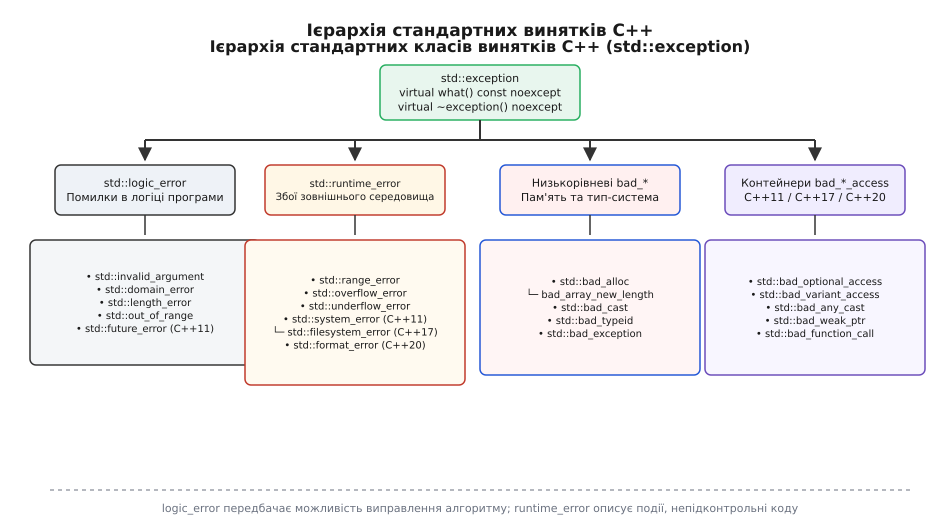
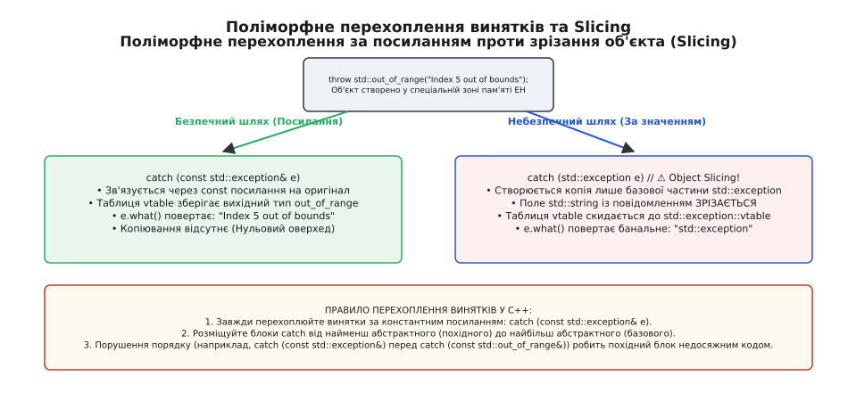
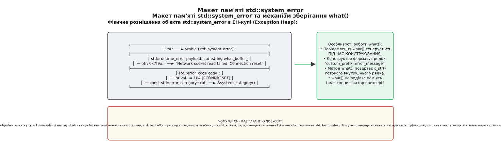

# Ієрархія стандартних винятків у C++: архітектура std::exception, семантичний поділ та гарантії виняткобезпеки

<preknowlist>
- [Механізм винятків C++](topic:cpp-standards/exceptions-mechanism) — фундаментальні оператори `throw`, `try` та `catch`, механіка розгортання стеку.
- [RTTI та динамічне приведення типів](topic:cpp-standards/rtti-and-dynamic-cast) — інспекція типів під час виконання, RTTI та `dynamic_cast`.
- [Семантика володіння](topic:cpp-standards/ownership-semantics) — управління ресурсами та гарантії очищення в деструкторах.
- [Специфікатор noexcept](topic:cpp-standards/noexcept) — бінарна гарантія неможливості генерації винятків функцією.
</preknowlist>

Коли високочастотний сервер обробки мережевих запитів отримує зіпсований бінарний кадр даних із сокета і генерує текстовий виняток у вигляді сирого рядка `throw "Invalid frame header"` замість об'єкта зі структурованого типу, верхній обробник `catch (const std::exception& e)` мовчки пропускає цей збій. Вхідний потік виконання переривається, обробка поточного з'єднання аварійно виходить без виконання логіки закриття сесії, а м'ютекси залишаються заблокованими у проміжних станах. Базовий клас `std::exception` був введений у стандарт C++98 саме для того, щоб усунути подібну фрагментацію, створивши єдиний поліморфний контракт для всіх помилок стандартної бібліотеки та користувацького коду. Про еволюційний шлях формування ієрархії винятків від стандарту C++98 до C++23 детальніше читайте у вставці ([історичний екскурс](topic:cpp-standards/std-exception-hierarchy/hist-exception-hierarchy.md)).

---

## 1. Базовий клас std::exception: внутрішня анатомія, vtable та контракт відсутності винятків

Поліморфним коренем усіх стандартних винятків мови C++ є клас `std::exception`, оголошений у заголовочному файлі `<exception>`. Його мінімалістичний інтерфейсний контракт визначає два віртуальні методи, які формують основоположні гарантії безпеки обробки помилок у runtime.

### Фізичний макет та розмір об'єкта в пам'яті

Об'єкт `std::exception` у більшості сучасних реалізацій стандартних бібліотек (GCC libstdc++, LLVM libc++, MSVC STL) не містить власних користувацьких полів даних, окрім вказівника на таблицю віртуальних функцій (`vptr`).


*Графічне зображення ієрархії стандартних винятків C++: базовий клас std::exception, гілки logic_error та runtime_error, а також системні та середовищні винятки.*

На 64-бітних архітектурах (x86-64, AArch64) розмір базового об'єкта визначається виключно розміром вказівника `vptr`: `sizeof(std::exception)` становить рівно 8 байтів, а вирівнювання `alignof(std::exception)` дорівнює 8 байтам. Вказана компактність гарантує, що створення базового екземпляра винятку має мінімальні накладні витрати на виділення пам'яті та кешування у процесорних регістрах.

### Контекст ABI та середовище виконання винятків (Exception Handling Heap)

Згідно з специфікацією Itanium C++ ABI, яка є загальноприйнятим стандартом для компіляторів GCC та Clang на операційних системах Linux, FreeBSD та macOS, процес створення об'єкта винятку при виконанні інструкції `throw` суттєво відрізняється від звичайного створення об'єктів на автоматичному стеку чи в динамічній купі через оператор `new`.

Коли програма виконує інструкцію `throw expr`, компілятор перетворює її на виклик низькорівневої системної функції runtime-середовища `__cxa_allocate_exception(sizeof(T))`. Ця функція здійснює виділення пам'яті у спеціалізованій зоні операційної пам'яті, що називається Exception Handling Heap (EH Heap). Пам'ять під об'єкт винятку виділяється у цій зоні для того, щоб об'єкт залишався повністю дійсним та недоторканим протягом усього розгортання стеку, коли локальні фрейми функцій та їхні автоматичні змінні послідовно знищуються.

Об'єкт винятку живе у EH-купі доти, доки не буде повністю завершено відповідний блок `catch`. Знищення об'єкта винятку та вивільнення пам'яті EH-купи здійснюється середовищем виконання C++ шляхом автоматичного виклику системної функції `__cxa_free_exception()` після виходу з обробника.

У випадку, якщо звичайна операція виділення пам'яті для `__cxa_allocate_exception` зазнає збою через критичний брак операційної пам'яті в системі, реалізація бібліотеки libstdc++ перемикається на статичний аварійний резервний буфер (Emergency Exception Buffer) розміром 64 КіБ. Це гарантує, що фундаментальні винятки браку пам'яті, такі як `std::bad_alloc`, зможуть успішно сконструюватися та передатися обробнику навіть тоді, коли в системі не залишилося жодного вільного байта в купі.

### Контракт методу what() та безпека виділення пам'яті

Ключовим віртуальним методом базового класу `std::exception` є функція `what()`, яка має сигнатуру `virtual const char* what() const noexcept;`.

Вибір сигнатури, яка повертає сирий вказівник на символ `const char*` замість високорівневого об'єкта `std::string`, є принциповим і свідомим архітектурним рішенням розробників стандарту C++. Якщо б метод `what()` повертав об'єкт `std::string`, кожний виклик опису помилки потенційно вимагав би динамічного виділення пам'яті в купі для буферизації та копіювання символів.

Якщо програма кидає виняток у стані вичерпання системної пам'яті (наприклад, `std::bad_alloc`), спроба виділити пам'ять усередині самого методу `what()` призвела б до виникнення вторинного винятку. Згідно зі специфікацією мови C++, якщо під час розгортання стеку (stack unwinding) генерується другий виняток, який виходить за межі деструктора або обробника, середовище виконання C++ негайно викликає системну функцію `std::terminate()`, що призводить до миттєвого аварійного завершення усієї програми без очищення ресурсів.

Саме тому метод `what()` оголошений із суворим специфікатором `noexcept` і повертає вказівник на нуль-термінований рядок символів, який або зберігається у статичній пам'яті програми (`.rodata`), або був повністю сформований та забуферизований заздалегідь під час конструювання об'єкта винятку.

---

## 2. Фундаментальна дихотомія: std::logic_error проти std::runtime_error

Усі винятки загального призначення у мові C++ розділені між двома основними гілками, оголошеними у заголовочному файлі `<stdexcept>`: `std::logic_error` та `std::runtime_error`. Цей поділ являє собою фундаментальне архітектурне розмежування відповідальності між розробником коду та зовнішнім середовищем виконання.

### 2.1. Гілка std::logic_error: дефекти алгоритмів та порушення інваріантів

Класи, успадковані від `std::logic_error`, сигналізують про помилки в логіці програми, які теоретично могли бути повністю відвернені на етапі розробки, проведення коду-рев'ю або покриття юніт-тестами. Логічна помилка означає порушення прекондицій функції або внутрішніх інваріантів класу.

До гілки `std::logic_error` належать п'ять стандартних класів:

1. **`std::invalid_argument`**: Виникає при передачі у функцію аргументу, значення якого не відповідає вимогам контракту. Наприклад, це може бути передача від'ємного розміру буфера у функцію виділення пам'яті, передача порожнього рядка туди, де очікується ідентифікатор, або передача некоректного значення прапорця.
2. **`std::domain_error`**: Сигналізує про порушення математичної області визначення аргументів функції. Прикладом є спроба обчислити квадратний корінь або логарифм від від'ємного числа у галузі дійсних чисел.
3. **`std::length_error`**: Виникає при спробі перевищити максимально допустимий розмір контейнера або масиву, визначений методом `max_size()`. Наприклад, спроба змінити розмір `std::string` або `std::vector` до значення, що перевищує адресовний простір.
4. **`std::out_of_range`**: Свідчить про спробу доступу до елемента за межами допустимого індексу. Наприклад, це виклик методу `at()` у контейнерах `std::vector`, `std::string`, `std::deque` або `std::array` з індексом, що дорівнює або перевищує `size()`.
5. **`std::future_error` (C++11)**: Оголошений у заголовочному файлі `<future>`. Сигналізує про спробу виконання некоректної операції з асинхронним об'єктом `std::future` або `std::promise`, наприклад, повторний запит результату через `get()` з одноразового `future`.

#### Детальний розбір механізму зберігання рядків у logic_error

Конструктори класу `std::logic_error` приймають текстовий рядок опису: `explicit logic_error(const std::string& what_arg);` або `explicit logic_error(const char* what_arg);`. Під час виконання конструктора об'єкт `std::logic_error` копіює передане повідомлення у внутрішній буфер `std::string`.

Важливо підкреслити: це динамічне виділення пам'яті під рядок відбувається у момент виконання інструкції `throw`, тобто **до початку процесів розгортання стеку**. Якщо при виконанні конструктора `logic_error` виникає `std::bad_alloc`, то розгортання стеку ще не розпочато, і програма безпечно обробляє виняток виділення пам'яті. Метод `what()` згодом просто повертає вказівник на створений буфер через `c_str()`.

### 2.2. Гілка std::runtime_error: збої зовнішнього середовища

Класи гілки `std::runtime_error` сигналізують про події та збої, які виникають під час виконання програми і залежать від зовнішніх чинників, неподконтрольних безпосередній логіці алгоритму. Навіть ідеально написана програма без жодного бага у коді зобов'язана обробляти помилки середовища виконання.

До гілки `std::runtime_error` належать такі класи:

1. **`std::range_error`**: Виникає при обчисленні результату математичної функції, який виходить за межі допустимого діапазону результатів (range error у обчислювальних алгоритмах).
2. **`std::overflow_error`**: Сигналізує про математичне арифметичне переповнення верхньої межі типу даних (arithmetic overflow у цілочисельних або плаваючих обчисленнях).
3. **`std::underflow_error`**: Сигналізує про втрату значущості числа з плаваючою крапкою під нижню межу (arithmetic underflow).
4. **`std::system_error` (C++11)**: Оголошений у `<system_error>`. Використовується для трансляції числових кодів помилок операційної системи (`errno`, Win32 API) у об'єкти винятків C++.
5. **`std::filesystem_error` (C++17)**: Оголошений у `<filesystem>`. Спеціалізація `std::system_error` для операцій з файловою системою, яка додатково зберігає шляхи до файлів `path1()` та `path2()`.
6. **`std::format_error` (C++20)**: Оголошений у `<format>`. Виникає при помилках форматування рядків через `std::format` або `std::print` при передачі некоректного специфікатора форматування.

### Порівняльна матриця гілок logic_error та runtime_error

| Характеристика | `std::logic_error` | `std::runtime_error` |
| :--- | :--- | :--- |
| **Джерело помилки** | Помилки у коді, помилкові алгоритми | Зовнішнє середовище, ОС, мережа, диски |
| **Можливість відвернення** | Можна повністю усунути виправленням коду | Неможливо усунути у коді, лише обробити |
| **Типова реакція** | Баг-репорт, assert у debug, термінація | Відновлення, retry, фалбек, повтор запиту |
| **Зберігання рядка** | Приймає `std::string` / `const char*` | Приймає `std::string` / `const char*` |
| **Момент виділення пам'яті** | Під час конструювання об'єкта | Під час конструювання об'єкта |

---

## 3. Низькорівневі винятки середовища: bad_* та контейнерні обмеження

Окрему групу в ієрархії винятків становлять класи із префіксом `bad_*`. Вони успадковуються безпосередньо від `std::exception` (оминаючи `logic_error` та `runtime_error`) і генеруються безпосередньо операторами мови або фундаментальними компонентами стандартної бібліотеки.

### 3.1. Винятки управління пам'яттю: std::bad_alloc та new_handler

Клас `std::bad_alloc`, оголошений у заголовочному файлі `<new>`, кидається глобальним оператором `operator new`, коли система не здатна виділити запитуваний блок динамічної пам'яті в купі.

Низькорівневий ланцюжок системних викликів розширення адресної області процесу на Linux-системах виглядає так:

```
new T[N] -> operator new() -> malloc() -> brk() / mmap() -> ENOMEM -> std::bad_alloc
```

Якщо системний виклик `mmap` повертає помилку брак пам'яті `ENOMEM`, оператор `operator new` не повертає `nullptr`, а викликає користувацьку функцію обробки `std::new_handler`, встановлену через `std::set_new_handler()`. Якщо `new_handler` здатен вивільнити частину зарезервованого буфера, операція виділення повторюється у циклі. Якщо `new_handler` не встановлено або він не зміг вивільнити пам'ять, кидається `std::bad_alloc`.

На відміну від `std::logic_error`, клас `std::bad_alloc` не зберігає додаткового рядка повідомлення `std::string`. Його метод `what()` повертає статичний рядок `"std::bad_alloc"`. Це вимога абсолютного розгортання: коли у системи закінчилася пам'ять, конструювання об'єкта винятку не повинно вимагати жодного нового байта в купі.

У C++11 було додано похідний клас `std::bad_array_new_length`, який виникає при виділенні пам'яті під масив `new T[N]`, якщо розмір `N` є від'ємним або перевищує ліміт реалізації.

### 3.2. Винятки системи типів та RTTI: std::bad_cast та std::bad_typeid

Заголовочний файл `<typeinfo>` визначає винятки, пов'язані з динамічною інспекцією типів під час виконання (Run-Time Type Information):

- **`std::bad_cast`**: Виникає при невдалій спробі явного приведення типів за допомогою посилання `dynamic_cast<Target&>(source_ref)`. Якщо для вказівника `dynamic_cast` повертає `nullptr`, то для посилань повернення `nullptr` неможливе, тому система кидає `std::bad_cast`.
- **`std::bad_typeid`**: Виникає при спробі застосування оператора `typeid` до розіменованого нульового вказівника на поліморфний тип: `typeid(*ptr)`, де `ptr == nullptr`.

### 3.3. Винятки типів-обгорток (Vocabulary Types) та стан valueless_by_exception

Починаючи з C++11, введення нових безпечних типів даних супроводжувалося додаванням відповідних винятків доступу:

1. **`std::bad_optional_access` (C++17, `<optional>`)**: Кидається методом `value()` при спробі прочитати значення з порожнього `std::optional`.
2. **`std::bad_variant_access` (C++17, `<variant>`)**: Виникає при зверненні до значення `std::variant` через `std::get<T>` або `std::visit`, якщо поточний активний тип альтернативи не збігається з запитуваним `T`.
3. **`std::bad_any_cast` (C++17, `<any>`)**: Сигналізує про некоректне приведення типів при виклику `std::any_cast<T>()`.
4. **`std::bad_weak_ptr` (C++11, `<memory>`)**: Виникає при конструюванні `std::shared_ptr` з простроченого `std::weak_ptr`.
5. **`std::bad_function_call` (C++11, `<functional>`)**: Виникає при спробі виклику порожньої обгортки `std::function`, яка не містить цільової функції.

Особливої уваги заслуговує стан `valueless_by_exception` у `std::variant`. Якщо під час виконання операції присвоєння нового типу у `std::variant` конструктор нового значення кидає виняток, а старе значення вже було знищено, об'єкт `std::variant` переходить у стан `valueless_by_exception() == true`. Будь-яка наступна спроба доступу до такого об'єкта через `std::get` неминуче кидає `std::bad_variant_access`.

Повний перелік сигнатур та методів усіх стандартних винятків зібрано у вставці ([інтерфейсна довідка](topic:cpp-standards/std-exception-hierarchy/api-exception-classes.md)).

---

## 4. Розгортання стеку, механіка перехоплення та розв'язання проблеми slicing

Процес обробки винятку в C++ складається з трьох послідовних фаз: створення об'єкта винятку в спеціалізованій зоні пам'яті (Exception Handling Heap), розгортання стеку (stack unwinding) з послідовним викликом деструкторів локальних змінних, та пошук відповідного блоку `catch`.


*Схема проходження типу винятку крізь каскад catch-блоків: порівняння безпечного поліморфного перехоплення за посиланням та деструктивного зрізання об'єкта (slicing).*

### Внутрішній механізм DWARF .eh_frame та таблиці LSDA

У сучасних Linux-системах на базі GCC та Clang механізм розгортання стеку не створює жодних накладних витрат часу CPU під час нормального виконання коду ("щасливого шляху"). Це підхід з нульовою вартістю виконання (Zero-Cost Exceptions). Компілятор проектує у бінарний файл спеціальні секції метаданих:

- **`.eh_frame`**: Містить структури Frame Description Entry (FDE), які описують стан регістрів процесора та покажчика стеку `RSP` для кожної адреси інструкцій.
- **LSDA (Language-Specific Data Area)**: Містить таблиці дій (Action Tables) та таблиці діапазонів `try-catch` блоків.

Коли виконується `throw`, системна бібліотека unwinder (наприклад, `libgcc_s` або `libc++abi`) читає таблиці `.eh_frame` у двофазному режимі:
1. **Phase 1 (Search Phase)**: Unwinder проходить вгору по стеку викликів без виконання деструкторів і шукає відповідний блок `catch`, порівнюючи RTTI тип винятку через `__cxa_type_match`.
2. **Phase 2 (Unwind Phase)**: Unwinder повторно проходить стек від точки `throw` до знайденого обробника `catch`, послідовно викликаючи деструктори всіх автоматичних об'єктів (RAII).

### Помилки асинхронних сигналів операційної системи (SIGSEGV / SIGFPE)

Важливим технічним розмежуванням є відмінність між винятками мови C++ та асинхронними сигналами операційної системи (POSIX signals). Помилки доступу до недійсної пам'яті (Segmentation Fault, `SIGSEGV`), ділення на нуль у цілочисельній арифметиці (`SIGFPE`) або невірно сформована інструкція процесора (`SIGILL`) **не є винятками C++**.

Асинхронні сигнали генеруються безпосередньо апаратною переривальною системою CPU та обробляються ядерним табличним вектором OS. Блок `catch (...)` у стандартній мові C++ не може перехопити `SIGSEGV` чи ділення цілого числа на нуль. Спроба обгорнути ділення на нуль у блок `try-catch` у C++ призводить не до генерації винятку, а до негайної передачі сигналу `SIGFPE` процесу, який за замовчуванням аварійно завершує виконання через core dump.

### Правило сортування блоків catch

Компілятор здійснює пошук відповідного обробника `catch` зверху вниз у порядку їх оголошення у тексті програми. Перший блок `catch`, тип якого є базовим класом для згенерованого винятку, перехоплює управління.

Оскільки `std::exception` є базовим класом для всієї ієрархії, блок `catch (const std::exception& e)` здатен перехопити будь-який стандартний виняток (наприклад, `std::out_of_range`). Порушення порядку оголошення обробників робить похідні блоки недосяжним кодом:

```cpp
// ⚠️ НЕКОРЕКТНИЙ ПОРЯДОК: Похідний блок недосяжний!
try {
    std::vector<int> v;
    v.at(10); // Кидає std::out_of_range
} catch (const std::exception& e) {
    // Перехоплює ВСІ винятки сюди, включно з out_of_range!
} catch (const std::out_of_range& e) {
    // ✖️ Недосяжний код (Unreachable code)
}
```

Правильна організація ланцюжка обробки вимагає розташування блоків від найменш абстрактного (похідного) до найбільш абстрактного (базового):

```cpp
// ✓ КОРЕКТНИЙ ПОРЯДОК: Спеціалізовані обробники попереду
try {
    std::vector<int> v;
    v.at(10);
} catch (const std::out_of_range& e) {
    // Обробка конкретно виходу за межі діапазону
} catch (const std::runtime_error& e) {
    // Обробка помилок виконання
} catch (const std::exception& e) {
    // Базовий обробник для всіх інших стандартних винятків
}
```

### Проблема зрізання об'єкта (Object Slicing)

Фундаментальною помилкою початківців є перехоплення винятків за значенням `catch (std::exception e)` замість посилання `catch (const std::exception& e)`.

Перехоплення за значенням створює новий об'єкт базового класу `std::exception` шляхом виклику конструктора копіювання `std::exception::exception(const exception&)`. При цьому відбуваються дві деструктивні зміни:

1. **Зрізання полів даних (Slicing)**: Усі додаткові поля похідного класу (наприклад, рядок повідомлення у `std::out_of_range` або код помилки у `std::system_error`) не копіюються і відсікаються.
2. **Скидання vtable**: Таблиця віртуальних методів скопійованого об'єкта перемикається на `std::exception::vtable`. У результаті виклик `e.what()` повертає банальне значення `"std::exception"`, а не оригінальний текст помилки.

:::tabs
```cpp
#include <iostream>
#include <stdexcept>
#include <string>

// Функція обробки файлового контейнера
void parse_config_file(const std::string& path) {
    if (path.empty()) {
        throw std::invalid_argument("Конфігураційний шлях не може бути порожнім");
    }
}

void execute_safe_operation() {
    try {
        parse_config_file("");
    } catch (const std::exception& e) { // ✓ Безпечне поліморфне посилання
        std::cout << "Успішно перехоплено: " << e.what() << std::endl;
    }
}
```
```c
#include <stdio.h>
#include <stdlib.h>
#include <string.h>

// Еквівалентна C-модель обробки помилок через статусний код
typedef struct {
    int is_error;
    char message[128];
} c_status_t;

c_status_t parse_config_file_c(const char* path) {
    c_status_t status = {0, ""};
    if (path == NULL || strlen(path) == 0) {
        status.is_error = 1;
        strncpy(status.message, "Конфігураційний шлях порожній", sizeof(status.message) - 1);
    }
    return status;
}

void execute_safe_operation_c(void) {
    c_status_t res = parse_config_file_c("");
    if (res.is_error) {
        printf("C-style помилка: %s\n", res.message);
    }
}
:::

---

## 5. Інтеграція системних помилок операційної системи: std::system_error, std::error_code та std::error_category

До появу стандарту C++11 розробники системного коду були змушені вручну форматувати числові коди системних помилок (POSIX `errno` або Windows `GetLastError()`) у текстові рядки перед створенням винятку `std::runtime_error`. Це призводило до витоків пам'яті та унеможливлювало програмну перевірку типів помилок у блоках `catch`.

Стандарт C++11 розв'язав цю проблему через запровадження винятку `std::system_error`, який поєднує поліморфізм C++ із детермінованими кодами помилок операційної системи.


*Анатомія std::system_error: поєднання коду помилки, статичної категорії та динамічно сформованого повідомлення what().*

### Структура std::error_code та категорій помилок

Об'єкт `std::system_error` містить всередині легковаговий екземпляр `std::error_code`, який складається з двох елементів:

```cpp
class error_code {
    int val_;                         // Числове значення помилки (наприклад, 104 ECONNRESET)
    const error_category* cat_;       // Вказівник на статичну категорію помилки
};
```

Абстракція `std::error_category` реалізує патерн Одинак (Singleton) і відповідає за трансляцію числового коду `val_` у текстове повідомлення операційної системи. Стандартна бібліотека надає чотири базові категорії:

1. **`std::system_category()`**: Повертає текстові описи системних помилок операційної системи (`errno` у POSIX, Win32 error codes у Windows).
2. **`std::generic_category()`**: Повертає описи загальних помилок стандарту POSIX (значення `std::errc`).
3. **`std::iostream_category()`**: Категорія помилок потоків введення-виведення `<iostream>`.
4. **`std::future_category()`**: Категорія помилок асинхронних операцій `<future>`.

Конструктор `std::system_error` автоматично формує підсумковий рядок `what()`, об'єднуючи користувацький префікс із текстовим описом категорії помилки:

```cpp
// Автоматично сформований what(): "Read network packet failed: Connection reset by peer"
throw std::system_error(
    std::error_code(104, std::system_category()), 
    "Read network packet failed"
);
```

---

## 6. Механізми вкладених винятків, міжпотокова передача та C++23 stacktrace

Сучасні високоархітектурні C++ системи вимагають збереження повного контексту збою при передачі помилки між шарами абстракції та межами виконання потоків.

### 6.1. Вкладені винятки: std::nested_exception та Cause Chains

При будівництві багатошарових систем (наприклад, СУБД) низькорівневий виняток дискового I/O `std::filesystem_error` при спробі запису сторінки даних повиннен перехоплюватися транзакційним менеджером і перегортатися у високорівневу помилку `TransactionAbortedException`.

Для збереження початкової причини збою C++11 надає механізм вкладених винятків:

```cpp
#include <exception>
#include <stdexcept>

void save_db_record() {
    try {
        // Низькорівнева операція, що кидає std::system_error
        throw std::system_error(EIO, std::generic_category(), "Disk write failed");
    } catch (...) {
        // Автоматично обгортає поточний активний виняток у std::nested_exception
        std::throw_with_nested(std::runtime_error("Transaction commit failed"));
    }
}
```

Для витягування та розбору ланцюжка причин застосовується функція `std::rethrow_if_nested()`:

```cpp
void handle_exception_chain(const std::exception& e) {
    std::cout << "Високорівнева помилка: " << e.what() << std::endl;
    try {
        std::rethrow_if_nested(e);
    } catch (const std::system_error& nested) {
        std::cout << "  └─ Первинна системна причина: " << nested.code().message() << std::endl;
    } catch (...) {
        std::cout << "  └─ Невідома вкладена причина." << std::endl;
    }
}
```

### 6.2. Передача винятків між потоками: std::exception_ptr

За замовчуванням виняток, згенерований у фоновому потоці `std::thread`, не може бути перехоплений блоком `try-catch` у головному потоці виконання — це призводить до виклику `std::terminate()`.

Для безпечної передачі об'єктів винятків між потоками C++11 надає розумний вказівник `std::exception_ptr`:

- `std::current_exception()`: Захоплює поточний активний виняток у блоці `catch` і повертає `std::exception_ptr`, який підтримує лічильник посилань на об'єкт в EH-купі.
- `std::rethrow_exception(std::exception_ptr p)`: Повторно кидає збережений виняток у контексті поточного потоку.

Маршрутизація винятків у пулах потоків (Thread Pools) реалізується через заповнення об'єкта `std::promise<T>`: якщо фонова функція кидає виняток, `std::promise::set_exception(std::current_exception())` фіксує його, а виклик `std::future::get()` у головному потоці повторно кидає цей виняток через `std::rethrow_exception`.

### 6.3. Інтеграція зі стектрейсом C++23 (std::stacktrace)

Найбільшим недоліком стандартних винятків C++ тривалий час була відсутність інформації про трасування стеку викликів (call stack frames). Розробники були змушені підключати операційно-залежні бібліотеки `libunwind` або `boost::stacktrace`.

У C++23 введено стандартний заголовочний файл `<stacktrace>` та клас `std::stacktrace`. Інтеграція `std::stacktrace` у користувацькі винятки дозволяє зберігати точний знімок фреймів виклику на момент конструювання об'єкта. Практичну реалізацію доменної ієрархії із захопленням стектрейсу та кодами помилок наведено у вставці ([проєктний приклад](topic:cpp-standards/std-exception-hierarchy/proj-custom-exception-tree.md)).

---

## 7. Чотири рівні гарантій виняткобезпеки (Exception Safety Guarantees) та інженерний регламент

Проєктування класів та методів у C++ вимагає чіткого визначення поведінки системи у випадку виникнення винятків. Усі функції розрізняють за чотирма фундаментальними рівнями гарантій виняткобезпеки, сформульованими Девідом Абрагамсом.

### 7.1. Класифікація гарантій виняткобезпеки

1. **Гарантія відсутності винятків (Nothrow / Nofail Guarantee)**:
   Функція стверджує, що вона ніколи за жодних обставин не випустить виняток назовні. Усі можливі збої обробляються всередині, або операція є тривіальною. Оголошується специфікатором `noexcept`. Обов'язкова для деструкторів, операторів переміщення (`move constructors`), операцій `swap()` та викликів очищення ресурсів у RAII.

2. **Строга гарантія (Strong Guarantee / Commit-or-Rollback)**:
   Якщо при виконанні функції виникає виняток, стан програми повертається до точного стану, який передував виклику функції. Операція або завершується повністю успішно, або не залишає жодних побічних ефектів чи зіпсованих даних. Зазвичай реалізується за допомогою ідіоми Copy-and-Swap (`std::vector::push_back`).

3. **Базова гарантія (Basic Guarantee)**:
   Якщо виникає виняток, програма залишається у цілісному, але невідомому стані. Жодні системні ресурси (пам'ять, файли, м'ютекси) не витікають, усі інваріанти об'єктів збережені, і об'єкти перебувають у дійсному стані, при придатному для знищення або присвоєння.

4. **Відсутність гарантії (No Guarantee)**:
   При виникненні винятку виникають витоки пам'яті, незакриті ресурси, зіпсовані інваріанти або неокреслена поведінка (Undefined Behavior). Такий код є неприпустимим у промисловій розробці.

### Вплив специфікатора noexcept на алгоритми STL (std::move_if_noexcept)

Реалізація стандартного контейнера `std::vector` демонструє прямий зв'язок між гарантіями виняткобезпеки та продуктивністю. При реалокації внутрішнього буфера `std::vector::reserve(new_cap)` контейнер повинен перенести існуючі елементи у новий буфер.

Щоб забезпечити **строгу гарантію** (якщо під час копіювання `N`-го елемента виникає виняток, вектор зобов'язаний зберегти старий буфер недоторканим), вектор перевіряє типову властивість `std::is_nothrow_move_constructible<T>::value`. Якщо конструктор переміщення типу `T` НЕ помічений як `noexcept`, `std::vector` вимушений здійснювати повільне глибоке копіювання елементів замість швидкого переміщення через `std::move_if_noexcept`. Відсутність `noexcept` у користувацьких класах може сповільнити роботу алгоритмів повторного виділення у 5-10 разів.

### Порівняльний аналіз швидкодії: throw/catch проти std::expected та кодами повернення

Важливим практичним аспектом є порівняння часової складності викликів при застосуванні різних підходів до обробки помилок у C++:

- **Звичайний виклик функції з поверненням C-коду (або std::expected)**: Виконує перевірку регістру `test eax, eax` та умовний перехід `jz`. Накладні витрати на виконання становлять від **1 до 3 тактів CPU** (менше 1 наносекунди).
- **Створення та генерація винятку (throw/catch)**: Під час виклику `throw` система призупиняє звичайне виконання, здійснює пошук FDE у секції `.eh_frame`, виклики `__cxa_allocate_exception`, запити до RTTI та двофазний прохід стеку. Сукупні накладні витрати на обробку винятку становлять від **1000 до 5000 наносекунд** (від 3000 до 15000 тактів CPU).

Це підтверджує ключове архітектурне правило: винятки у C++ призначені виключно для **виняткових, рідкісних подій** (нечасті збої мережі, брак пам'яті, відсутність файлу). Вони не повинні використовуватися як стандартний механізм керування потоком виконання (Control Flow) у гарячих обчислювальних циклах.

### Інженерний чекліст для проєктування класів винятків

Для створення надійної та продуктивної системи обробки помилок дотримуйтесь п'яти суворих правил:

- [x] **Успадковуйтеся від std::runtime_error або std::logic_error**: Не успадковуйте власні винятки безпосередньо від `std::exception`, оскільки базовий клас у бібліотеках STL не містить полів зберігання рядків.
- [x] **Завжди перехоплюйте винятки за константним посиланням**: Завжди використовуйте `catch (const MyException& e)`, щоб запобігти Object Slicing та зрізанню таблиці віртуальних методів.
- [x] **Помічайте деструктори та конструктори переміщення як noexcept**: Генерація винятку всередині деструктора під час активного розгортання стеку призводить до виклику `std::terminate()`.
- [x] **Не виділяйте пам'ять у нових методах what()**: Метод `what()` повинен повертати заздалегідь сформований `const char*` або використовувати ледаче кешування з розробкою захисного блоку `try-catch`.
- [x] **Розташовуйте блоки catch від конкретних до загальних**: Розміщуйте похідні класи винятків у блоках `catch` перед базовими типами.
