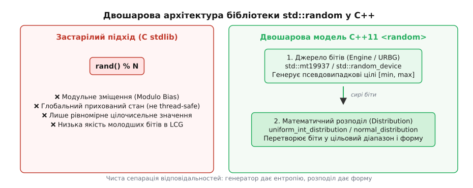
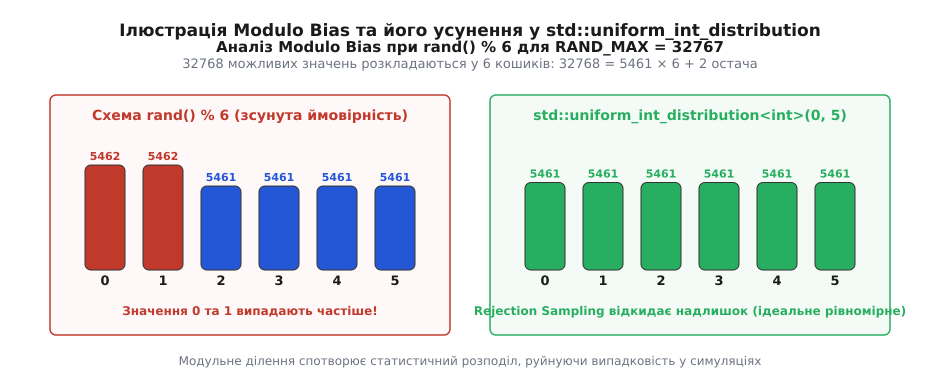
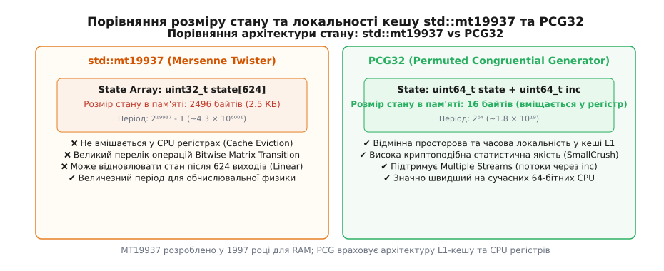
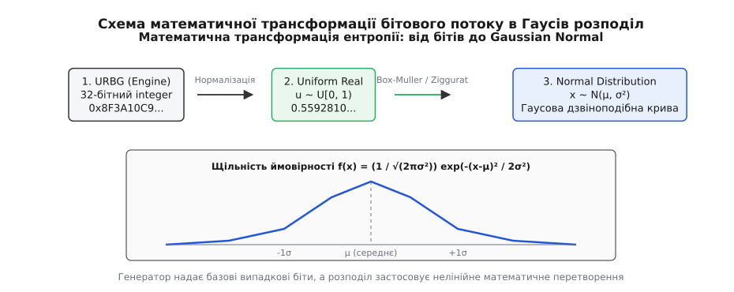

<preknowlist>
- [Ідеальне передавання й універсальні посилання](book:cpp-standards/perfect-forwarding)
- [Семантика переміщення і rvalue-посилання](book:cpp-standards/move-semantics)
</preknowlist>

# 🎲 Генерація псевдовипадкових чисел та розподілів: Бібліотека <random>

Виклик успадкованої з мови C функції `std::rand() % 6` для моделювання шестигранного грального кубика при `RAND_MAX = 32767` створює математичне спотворення: грані 1 та 2 випадають з ймовірністю 5462 / 32768 (приблизно 0.166692), тоді як грані 3, 4, 5 та 6 випадають з ймовірністю 5461 / 32768 (приблизно 0.166662). Якщо програма запускає цей виклик паралельно з 16 потоків виконання, єдине глобальне число початкового стану (Seed), збережене у статичній змінній `unsigned long next`, зазнає стану гонитви (Data Race). Виклики потоків перезаписують стан один одного без жодного блокування, спричиняючи дублювання послідовностей та падіння пропускної здатності процесора.

Стандарт C++11 повністю відмовився від наївного монолітного підходу `std::rand()`, запровадивши заголовочний файл `<random>` із суворим математичним розділенням генерації випадкових бітів від їхньої імовірнісної трансформації.

---

## 1. Анатомія краху C-стилю: Modulo Bias, спектральні дефекти та порушення потокобезпеки

Для глибокого розуміння причин появу заголовочного файла `<random>` необхідно розібрати механізм роботи класичного лінійного конгруентного генератора (Linear Congruential Generator, LCG), який традиційно використовувався в системних бібліотеках POSIX та C Runtime (CRT).

Стандартна реалізація `std::rand()` оновлює внутрішнє 32-бітне число `X` за рекурентною формулою `X[n+1] = (a * X[n] + c) mod m`, де для багатьох реалізацій C-CRT (зокрема MSVC) використовуються константи `a = 214013`, `c = 2531011`, `m = 2^32`. Згенероване число потім зсувається праворуч на 16 бітів для повернення 15-бітного значення у діапазоні `[0, RAND_MAX]`, де `RAND_MAX = 32767 = 2^15 - 1`.

### 1.1. Математичне виведення модульного зміщення (Modulo Bias)
Коли розробник пише `rand() % N`, він намагається відобразити множину з `R = RAND_MAX + 1` можливих цілих чисел на множину з `N` залишкових класів. 

За теоремою про ділення з остачею зв'язок виражається як `R = q * N + r`, де остача задовольняє умову `0 <= r < N`.

Якщо остача не дорівнює нулю (`r != 0`), то перші `r` кошиків (залишки `0, 1, ..., r-1`) отримають по `q + 1` сприятливих початкових значень, тоді як решта `N - r` кошиків (залишки `r, r+1, ..., N-1`) отримають лише по `q` варіантів.

Ймовірність випадання перших `r` варіантів обчислюється як `P(X = k) = (q + 1) / R` для всіх `0 <= k < r`, а ймовірність для решти варіантів становить `P(X = k) = q / R` для всіх `r <= k < N`.

При `R = 32768` та `N = 6` отримуємо розклад `32768 = 5461 * 6 + 2`. Звідси `q = 5461`, `r = 2`.
- Ймовірність випадання граней 1 та 2 дорівнює `P = 5462 / 32768`, що становить приблизно 0.16669189.
- Ймовірність випадання граней 3, 4, 5 та 6 дорівнює `P = 5461 / 32768`, що становить приблизно 0.16666158.

Це спотворення здається незначним для одного кидка, але у симуляціях Монте-Карло з мільярдами вибірок воно повністю фальсифікує статистичні результати, зміщуючи середнє значення та дисперсію.

### 1.2. Спектральний тест та кореляція послідовних значень
Другим фундаментальним дефектом LCG є гіперплощинне групування значень, описане Джорджем Марсальєю у 1968 році у праці *"Random Numbers Fall Mainly in the Planes"*. 

Якщо побудувати точки з координатами `(X[n], X[n+1], X[n+2])` у тривимірному просторі, виявиться, що всі точки розміщуються на невеликій кількості паралельних площин. Для 32-бітного LCG кількість таких площин у 3D-просторі не перевищує 1600, що робить цей генератор непридатним для фізичного моделювання.

Крім того, молодші біти LCG мають дуже короткий період повторення. Значення `X[n] mod 2^k` володіє періодом не більшим ніж `2^k`. Зокрема, виклик `rand() % 2` повертає строгу послідовність чергування `0, 1, 0, 1, 0, 1, ...`, позбавлену будь-якої випадковості.

### 1.3. Стан гонитви у статичному контексті
Згідно зі стандартом C, функція `std::rand()` зберігає поточний стан у статичній змінній. Коли кілька потоків виконання одночасно викликають `rand()`, вони виконують читання та запис у спільну комірку пам'яті `next` без атомарних операцій або м'ютексів. Це викликає Data Race: процесорні ядра скасовують результати обчислень один одного, а випадкова послідовність втрачає будь-які статистичні властивості.

:::tabs
@tab c
```c
static unsigned long next = 1;

// Типова C-реалізація rand() у C Runtime (MSVC)
int rand(void) {
    next = next * 1103515245 + 12345;
    return (unsigned int)(next / 65536) % 32768;
}
```

@tab cpp
```cpp
#include <random>

// Ідіоматична C++ альтернатива через власний клас-генератор LCG
class LcgEngine {
public:
    using result_type = uint32_t;

    explicit LcgEngine(uint32_t seed = 1) : state_(seed) {}

    static constexpr result_type min() { return 0; }
    static constexpr result_type max() { return 32767; }

    result_type operator()() {
        state_ = state_ * 1103515245U + 12345U;
        return (state_ / 65536U) % 32768U;
    }

private:
    uint32_t state_;
};
```
:::

---

## 2. Двохрівнева архітектура Modern C++: URBG проти Distribution

Бібліотека `<random>` вирішує проблеми модульного зміщення, спектральних дефектів та потокобезпеки шляхом жорсткого розділення задачі на два незалежні шари:
1. **Генератор випадкових бітів (Uniform Random Bit Generator, URBG)**: Відповідає виключно за генерування рівномірно розподіленого потоку бітів у фіксованому діапазоні `[g.min(), g.max()]`.
2. **Математичний розподіл (Probability Distribution)**: Приймає генератор бітів як параметр, перетворює його вихідний потік і масштабує результати відповідно до заданого закону ймовірностей.


*Рис. 1. Двохрівнева архітектура бібліотеки std::random: розділення апаратної/алгоритмічної ентропії та математичних розподілів.*

### 2.1. Механізм відсікання надлишку (Rejection Sampling)
Для усунення модульного зміщення клас `std::uniform_int_distribution<IntType>` використовує алгоритм відсікання надлишку.

Припускаємо, що URBG генератор генерує цілі числа у діапазоні `[0, M]`, а нам необхідно отримати число в інтервалі `[0, N-1]`, де `N <= M`.

1. Обчислюється найбільша межа за формулою `L = M - ((M + 1) mod N)`.
2. Генератор бітів викликається для отримання значення `y = g()`.
3. Якщо `y > L`, значення відкидається (Reject), і генератор викликається заново.
4. Якщо `y <= L`, повертається значення `y mod N`.


*Рис. 2. Математична різниця між некоректним зрізанням за залишком (Modulo Bias) та алгоритмом відсікання надлишку (Rejection Sampling).*

Оскільки діапазон `[0, L]` ділиться на `N` без остачі, кожне значення від `0` до `N-1` повертається з абсолютно однаковою ймовірністю `P = 1 / N`.

### 2.2. Оптимізований алгоритм Леміра для безділильної генерації (Fast Dice Roller)
Операція ділення цілих чисел `idiv` на x86_64 займає 10–25 тактів процесора, що робить обчислення `(M + 1) % N` у Rejection Sampling суттєвим вузьким місцем. 

У 2019 році Даніель Лемір запропонував безділильний алгоритм беззсувної генерації (Fast Random Integer Generation without Division), який активно впроваджується у сучасні реалізації C++ стандартної бібліотеки.

Алгоритм базується на множенні двох 32-бітних чисел з отриманні 64-бітного результату:

```cpp
uint32_t fast_bounded_rand(uint32_t range, uint32_t (*random_src)()) {
    uint64_t multiresult = static_cast<uint64_t>(random_src()) * static_cast<uint64_t>(range);
    uint32_t leftover = static_cast<uint32_t>(multiresult); // Молодші 32 біти

    if (leftover < range) {
        uint32_t threshold = -range % range; // Поріг обчислюється лише у 0.1% випадків
        while (leftover < threshold) {
            multiresult = static_cast<uint64_t>(random_src()) * static_cast<uint64_t>(range);
            leftover = static_cast<uint32_t>(multiresult);
        }
    }
    return static_cast<uint32_t>(multiresult >> 32); // Старші 32 біти є цільовим числом
}
```

Завдяки цьому операція `idiv` виконується лише тоді, коли дробова частина потрапляє у невелику порогову зону, що прискорює генерацію у 3 рази.

### 2.3. Точна канонічна нормалізація `std::generate_canonical`
Для задач обчислювальної фізики стандарт C++ надає шаблоновану функцію `std::generate_canonical<RealType, Bits, URBG>(g)`.

Якщо генератор `g` має розрядність `R = g.max() - g.min() + 1`, а розробник вимагає `B` бітів мантиси (наприклад, 53 біти для типу `double`), функція розраховує необхідну кількість викликів за формулою `k = max(1, ceil(B / log2(R)))` і підсумовує виклики за формулою дробового розкладу.

Після цього отримане значення ділиться на `R^k`, що гарантує точне заповнення `B` бітів у напіввідкритому інтервалі `[0.0, 1.0)` без найменших прогалин у сітці чисел плаваючої крапки.

---

## 3. Джерела випадковості: Псевдовипадкові рушії та апаратна ентропія

Бібліотека `<random>` розрізняє детерміновані псевдовипадкові генератори (PRNG) та недетерміноване апаратне джерело ентропії (TRNG).

Детальний історичний опис еволюції генераторів від ранніх LCG до сучасної вихорної математики Mersenne Twister та PCG винесено у вставку [📜 Історія генераторів: Від POSIX rand() до MT19937 та PCG](book:cpp-standards/std-random/hist-pcg-mersenne.md).

### 3.1. Генератор Вихору Мерсенна (`std::mt19937` та `std::mt19937_64`)
Основна робоча конячка сучасного C++ — алгоритм Mersenne Twister, розроблений Макото Мацумото та Такудзі Нісімурою у 1997 році.

Його математичний фундамент базується на матричній рекурентній послідовності над скінченним полем Galois Field GF(2).

Ключові характеристики MT19937:
- **Астрономічний період**: `2^19937 - 1`, що становить приблизно 4.3 * 10^6001 операцій.
- **Еквірозподіленість у 623 вимірах**: Гарантує відсутність спектрального групування при побудові багатовимірних векторів.
- **Розмір стану у пам'яті**: 624 елементи типу `uint32_t` (загалом 2496 байтів пам'яті плюс додаткові лічильники).


*Рис. 3. Порівняльна структура внутрішнього стану генераторів MT19937 (2500 байтів) та PCG32 (16 байтів).*

#### Механіка загартування бітів (Tempering Transform) у MT19937
Перед видачею 32-бітного результату MT19937 обробляє поточне значення вектору стану через чотири кроці побітового зсуву та маскування (Tempering), що розсіює можливі лінійні залежності у векторі:

```cpp
uint32_t y = state[index];
y ^= (y >> 11);
y ^= (y << 7)  & 0x9d2c5680U;
y ^= (y << 15) & 0xefc60000U;
y ^= (y >> 18);
return y;
```

Ці бітові операції є повністю оборотними (Invertible). З точки зору криптографічного аналізу, спостереження за 624 послідовними виходами `mt19937` дозволяє повністю відновити внутрішній стан генератора і передбачити всі наступні випадкові числа. Тому **MT19937 категорично заборонено використовувати для завдань безпеки та криптографії**.

---

### 3.2. Генератор PCG32: Компактна та кеш-дружелюбна альтернатива
Хоча `std::mt19937` є стандартом де-факто у багатьох обчислювальних пакетах, його великий стан (2.5 КБ) спричиняє витіснення L1-кешу процесора під час роботи з багатьма об'єктами (наприклад, у багатовузлових симуляціях агентів або частинок).

Алгоритм PCG (Permuted Congruential Generator), розроблений Меліссою О'Ніл у 2014 році, об'єднує 64-бітний LCG для оновлення стану з нелінійною перестановкою на виході (`XSH-RR` — Xorshift High / Random Rotate):

```cpp
// Крок оновлення стану LCG
state = state * 6364136223846793005ULL + inc;

// Нелінійна вихідна перестановка XSH-RR
uint32_t xorshifted = static_cast<uint32_t>(((oldstate >> 18u) ^ oldstate) >> 27u);
uint32_t rot = static_cast<uint32_t>(oldstate >> 59u);
return (xorshifted >> rot) | (xorshifted << ((-rot) & 31));
```

Завдяки розміру стану усього 16 байтів (`uint64_t state_` та `uint64_t inc_`), PCG32 повністю зберігається у двох реєстрах процесора `RAX`/`RDX`. Це гарантує нульовий рівень пропущення кеш-ліній L1 і дозволяє проходити найсуворіші статистичні тести з пакету BigCrush (TestU01).

---

### 3.3. Простеження `std::random_device` через sysfs/procfs та системні виклики Linux
Клас `std::random_device` є єдиним недетермінованим джерелом випадковості у стандартній бібліотеці C++. Він звертається до операційної системи (`/dev/urandom` у Linux або `ProcessPrng` у Windows) чи фізичних процесорних інструкцій (`RDRAND`/`RDSEED` у x86) для отримання справжньої ентропії.

Простеження викликів `std::random_device` у Linux за допомогою інструменту `strace` показує наступну послідовність системних викликів:

```bash
# Простеження відкриття файла ентропії при створенні std::random_device
openat(AT_FDCWD, "/dev/urandom", O_RDONLY|O_CLOEXEC) = 3
read(3, "\x8a\x3f\x91\xc4", 4)           = 4
close(3)                                 = 0

# У сучасних ядрах Linux (>= 3.17) використовується системний виклик getrandom(2)
getrandom("\x8a\x3f\x91\xc4", 4, 0)      = 4
```

Перевірити обсяг доступної апаратної ентропії в системі можна через простеження інструментів `procfs`:

```bash
cat /proc/sys/kernel/random/entropy_avail
# Значення 256..4096 вказує на високу якість накопиченої ентропії у пулі ядра
```

Якщо ядерний пул ентропії не встиг ініціалізуватися при старті системи (наприклад, при ранньому завантаженні ембеддед-пристрою), системний виклик `getrandom(..., GRND_NONBLOCK)` повертає помилку `EAGAIN`, що у C++ викликає викидання винятку `std::system_error`.

---

### 3.4. Обчислення під час компіляції (`constexpr`) у C++20
Починаючи з C++20, оператор виклику `operator()()` для класів `std::linear_congruential_engine` та `std::mersenne_twister_engine` отримав специфікатор `constexpr`.

Це відкрило можливість будувати таблиці lookup-констант, процедурно згенеровані текстури або карти ігрових рівнів під час компіляції програми. Компілятор повністю виконує алгоритм розгортання стану у бінарному коміляційному контесті, розміщуючи згенерований масив значень у константній секції пам'яті `.rodata` виконавчого файлу.

---

### 3.5. Криптографічна безпека та CSPRNG
У задачах захисту інформації, згенерованих сесійних ключів та генерації токенів скидання паролів використання стандартних псевдовипадкових генераторів `std::mt19937` або `std::minstd_rand` є серйозною уразливістю.

Криптографічно стійкі генератори (Cryptographically Secure Pseudo-Random Number Generators, CSPRNG) володіють властивістю непередбачуваності: за знанням попередніх `N` вигенерованих бітів неможливо обчислити наступний біт за час, менший за перебір ключів.

Для криптографічних задач розробники C++ повинні використовувати безпосередньо клас `std::random_device` (який під капотом звертається до системного CSPRNG ядра OS, базованого на потоковому шифрі ChaCha20 або AES-CTR) або виклики бібліотек OpenSSL / libsodium.

---

## 4. Математичні розподіли та трансформація ймовірностей

Після отримання безперервного потоку випадкових бітів розподіл перетворює їх у цільовий закон ймовірностей.

Виведення математичних формул та алгоритмічні деталі методів (Inverse Transform Sampling, трансформація Бокса — Мюллера, алгоритм Ціккурат та метод псевдонімів Волкера) розкрито у вставці [🧮 Математична механіка трансформації розподілів](book:cpp-standards/std-random/math-distributions.md).


*Рис. 4. Математичні класи трансформації рівномірного бітового потоку у цільові розподіли ймовірностей.*

### 4.1. Нормальний розподіл та алгоритм Ціккурат
Для генерування нормального розподілу `N(m, s^2)` класичний метод Бокса — Мюллера обчислює квадратний корінь та тригонометричні функції: `Z0 = sqrt(-2 * ln(U1)) * cos(2 * pi * U2)` та `Z1 = sqrt(-2 * ln(U1)) * sin(2 * pi * U2)`.

Оскільки обчислення `std::log` та `std::cos` вимагає 30–50 тактів CPU, сучасні реалізації C++ стандартної бібліотеки (GCC libstdc++, LLVM libc++) застосовують **алгоритм Ціккурат (Ziggurat Algorithm)** Марсальї та Цана. 

Алгоритм розділяє область під функцією щільності ймовірності `f(x) = exp(-x^2 / 2)` на 128 або 256 прямокутних шарів одинакової площі. У 98% випадків вибір випадає всередину прямокутника і обчислюється за 1 такт CPU через просте порівняння цілих чисел без використання обчислення плаваючої крапки.

### 4.2. Нормалізація у плаваючу крапку у `std::uniform_real_distribution`
Генерація дійснозначного числа у напіввідкритому інтервалі `[0.0, 1.0)` з мантисою IEEE 754 `double` вимагає створення 53 випадкових бітів. 

Стандартне ділення `double(g()) / double(g.max() + 1)` може приводити до втрати точності через округлення. Оптимізована реалізація генерує 64-бітне беззнакове ціле `U`, виділяє 53 біти для мантиси і побітово поєднує їх із експонентою `1.0` (значення `0x3ff0000000000000`), після чого віднімає `1.0`:

```cpp
uint64_t random_53_bits = (engine() >> 11);
double val = reinterpret_bits_to_double(random_53_bits | 0x3ff0000000000000ULL) - 1.0;
```
Це гарантує, що кожне із 2^53 можливих чисел у мантисі випадає з рівною ймовірністю без жодних системних відхилень.

### 4.3. Алгоритмічний розбір методу псевдонімів Волкера у `std::discrete_distribution`
При моделюванні дискретних категорій із різними ймовірностями (наприклад, вибір рідкісного предмета в іграх) наївний алгоритм лінійного пошуку за кумулятивною сумою вимагає часу `O(N)`.

Клас `std::discrete_distribution` будує таблицю псевдонімів (Alias Table) за алгоритмом Воуза у двох фазах за час `O(N)`:
1. Імовірності масштабуються так, щоб середня висота дорівнювала `1.0`.
2. Категорії розділяються на два стеки: `Small` (ймовірність `< 1.0`) та `Large` (ймовірність `>= 1.0`).
3. Недостатність з елементів `Small` доповнюється надлишком із `Large`, утворюючи у кожному з `N` кошиків прямокутник висотою `1.0`, який складається з основного елемента та одного псевдоніма.

При виклику `operator()()` вибір виконується за сталий час `O(1)`:
- Генерується випадковий індекс кошика `i` у діапазоні `[0, N-1]`.
- Генерується дійснозначна монета `U` у діапазоні `[0.0, 1.0)`.
- Якщо `U < Prob[i]`, повертається `i`; інакше повертається `Alias[i]`.

### 4.4. Пуассонівський та Експоненційний розподіли у фізичних модельних задачах
Клас `std::poisson_distribution<IntType>` моделює кількість подій, що відбуваються за фіксований часовий інтервал при відомій середній інтенсивності `lambda > 0`.

Для малих значеннях `lambda < 10` реалізація застосовує прямий метод Кнута, послідовно помножуючи рівномірні вибірки `U_i` у діапазоні `(0, 1)` до падіння добутку нижче порога `exp(-lambda)`.

Для великих значеннях `lambda >= 10` алгоритм Кнута стає занадто повільним, тому бібліотека переключається на відсікальну вибірку (Rejection Method) з використанням лоренцівської огинаючої функції (Lorentzian Envelope), яка гарантує константну кількість викликів URBG незалежно від величини `lambda`.

Клас `std::exponential_distribution<RealType>` реалізує метод оберненої функції розподілу (Inverse Transform Sampling) за формулою `X = -ln(1 - U) / lambda`.

Оскільки `1 - U` розподілено ідентично до `U`, формула спрощується до вида `X = -ln(U) / lambda`. Завдяки властивості відсутності пам'яті (Memoryless Property) експоненційний розподіл є основним інструментом для моделювання часу між запитами у мережевих серверах.

### 4.5. Гамма-розподіл, біноміальний та кусочно-постійний розподіли
Клас `std::gamma_distribution<RealType>` із параметрами формоутворення `alpha` та масштабу `beta` моделює тривалість очікування сум декількох подій. Для `alpha >= 1` використовується оптимізований метод Марсальї та Цана, який конвертує одну кубічну вибірку нормального розподілу у гамма-величину.

Клас `std::binomial_distribution<IntType>` моделює суму випробувань Бернуллі і для великих серій спроб застосовує гаусове апроксимування для збереження швидкодії.

Класи `std::piecewise_constant_distribution<RealType>` та `std::piecewise_linear_distribution<RealType>` дозволяють задавати довільні гістограми або нелінійні функції щільності ймовірностей у вигляді набору інтервалів і висот.

Ці математичні моделі є фундаментальними для симуляцій стійкості розподілених систем, фінансового аналізу ризиків та фізичних експериментів.

---

## 5. Порівняльний код: Успадкований C-стиль проти Modern C++

Нижче наведено порівняння створення випадкових чисел старим способом C та ідіоматичним шляхом Modern C++.

:::tabs
@tab c
```c
#include <stdio.h>
#include <stdlib.h>
#include <time.h>

// Старий C-підхід (з присутнім Modulo Bias та небезпекою глобального стану)
int roll_dice_c(void) {
    // 1. Поганий посів через час у секундах (time_t)
    // Якщо програма перезапускається двічі за секунду, послідовність буде тотожною
    // 2. Modulo bias при діленні на 6
    return (rand() % 6) + 1;
}

int main(void) {
    // Ініціалізація глобального стану LCG
    srand((unsigned int)time(NULL));

    for (int i = 0; i < 5; ++i) {
        printf("C Dice Roll: %d\n", roll_dice_c());
    }
    return 0;
}
```

@tab cpp
```cpp
#include <iostream>
#include <random>

// Сучасний C++11/C++20 підхід (Беззсувний, об'єктно-орієнтований, потокобезпечний)
class DiceRoller {
public:
    DiceRoller() 
        // 1. Ініціалізація апаратною ентропією
        : rng_(rd_())
        // 2. Діапазон [1, 6] без модульного зміщення
        , dist_(1, 6) {}

    int roll() {
        return dist_(rng_);
    }

private:
    std::random_device rd_;
    std::mt19937 rng_;
    std::uniform_int_distribution<int> dist_;
};

int main() {
    DiceRoller roller;

    for (int i = 0; i < 5; ++i) {
        std::cout << "C++ Dice Roll: " << roller.roll() << "\n";
    }
    return 0;
}
```
:::

Переваги C++ реалізації:
- Вся внутрішня математична логіка прихована в екземплярах `rng_` та `dist_`.
- Взаємодія з глобальним статичним станом `rand()` відсутня.
- Відсутність бітового спотворення (Modulo Bias) гарантується стандартною бібліотекою C++.

---

## 6. Ініціалізація та посів: `std::seed_seq` проти одночисельних посівів

Спрощена ініціалізація `std::mt19937` за допомогою одного 32-бітного цілого числа `mt19937(42)` покриває лише 2^32 початкових станів із можливих 2^19937. Це означає, що мільярди потенційних комбінацій внутрішнього масиву виявиться неможливо досягти.

Для вирішення цієї проблеми стандарт C++ надає клас `std::seed_seq`. Він збирає кілька слів апаратної ентропії і перемішує їх через нелінійне хешування, розсіюючи біти по всьому вектору стану генератора:

```cpp
#include <random>
#include <array>
#include <iostream>

std::mt19937 create_robust_engine() {
    std::random_device rd;

    // Збираємо 8 32-бітних слів апаратної ентропії (256 бітів)
    std::array<std::uint32_t, 8> seeds;
    for (auto& s : seeds) {
        s = rd();
    }

    // seed_seq розширює 256 бітів ентропії на всі 624 елементи стану MT19937
    std::seed_seq seq(seeds.begin(), seeds.end());
    return std::mt19937(seq);
}

int main() {
    std::mt19937 rng = create_robust_engine();
    std::cout << "Якісно ініціалізоване число: " << rng() << "\n";
    return 0;
}
```

### Механіка двофазного розсіювання у `std::seed_seq`
Клас `std::seed_seq` застосовує наступний алгоритм перемішування бітів:
1. **Ініціалізація буфера**: Масив стану заповнюється лінійною послідовністю констант `i + 0x8b8b8b8b`.
2. **Прямий прохід (Forward Pass)**: Кожен елемент змішується з попереднім за допомогою побітового виключального АБО (`^`), зсуву та множення на нелінійний коефіцієнт `1664525`.
3. **Зворотний прохід (Backward Pass)**: Елементи обробляються від кінця до початку з коефіцієнтом `1566083941`.

Це гарантує, що навіть якщо два вхідні масиви відрізняються лише одним бітом у першому слові, вихідний вектор `std::seed_seq` отримає повністю незалежну комбінацію бітів (Лавинний ефект, Avalanche Effect).

---

## 7. Багатопотокові обчислення, `thread_local` та відтворюваність

У високопродуктивних багатопотокових серверах передача одного генератора між потоками через `std::mutex` спричиняє блокування конвеєра CPU та падіння продуктивності.

Ідіоматичним розв'язком у modern C++ є використання специфікатора `thread_local`. Кожен потік отримує власний ізольований екземпляр генератора, виділений у пам'яті Thread Local Storage (TLS):

```cpp
#include <iostream>
#include <random>
#include <thread>
#include <vector>

void worker_thread(int thread_id) {
    // thread_local ініціалізується один раз при старті кожного потоку
    thread_local std::mt19937 rng([]() {
        std::random_device rd;
        return std::mt19937(rd());
    }());

    std::uniform_int_distribution<int> dist(100, 999);
    std::cout << "Thread " << thread_id << " generated: " << dist(rng) << "\n";
}

int main() {
    std::vector<std::thread> threads;
    for (int i = 0; i < 4; ++i) {
        threads.emplace_back(worker_thread, i);
    }
    for (auto& t : threads) {
        t.join();
    }
    return 0;
}
```

### 7.1. Вплив вирівнювання пам'яті та уникнення False Sharing
При розміщенні масивів генераторів у багатопотокових структурах виникає ризик явища **помилкового розділення пам'яті (False Sharing)**. 

Якщо дві структури генераторів для двох різних потоків потрапляють на одну 64-байтну кеш-лінію (L1 Cache Line), ядра процесора змушені постійно інвалідувати кеш один одного через кеш-когерентний протокол (MESI).

Для виключення False Sharing об'єкти генераторів вирівнюють за межею кеш-лінії за допомогою специфікатора `alignas`:

```cpp
struct alignas(64) ThreadRngState {
    std::mt19937 engine;
    uint8_t padding[64 - (sizeof(std::mt19937) % 64)];
};
```

---

### 7.2. Забезпечення детермінованості та відтворюваності (Reproducibility)
При зневадженні складних систем або під час наукового моделювання критичноважно вміти точно повторити послідовність випадкових подій. Для цього зафіксовують однакові значення початкового посіву:

```cpp
#include <iostream>
#include <random>
#include <cassert>

void verify_reproducibility() {
    std::mt19937 rng1(1337);
    std::mt19937 rng2(1337);

    std::uniform_real_distribution<double> dist(0.0, 1.0);

    for (int i = 0; i < 1000; ++i) {
        // Обидві послідовності збігаються біт-в-біт
        assert(dist(rng1) == dist(rng2));
    }
    std::cout << "✔ Відтворюваність повністю підтверджена!\n";
}
```

### 7.3. Текстова потокова серіалізація та міжплатформні відмінності
Оператори `operator<<` та `operator>>` забезпечують збереження та відновлення внутрішнього стану генераторів. Для `std::mt19937` стан серіалізується у вигляді 624 десяткових чисел, розділених пробілами.

Проте при кросплатформній пересілці збереженого стану між MSVC та GCC розробникам слід враховувати, що форматування внутрішніх параметрів деяких розподілів (наприклад, збережене значення кешу у `std::normal_distribution`) стандарт не регламентує. Для безумовної кросплатформної відтворюваності рекомендується зберігати стан самого генератора `std::mt19937`, а об'єкти розподілів перестворювати з нуля.

---

### 7.4. Патерни ізоляції стану у пулах потоків (Thread Pools) та Task-Based паралелізмі
При використанні заснованого на завданнях паралелізму (`std::async`, Intel TBB або крадіжка задач у Task-Stealing пулах) зв'язувати стан генератора з викликом `thread_local` виявляється недостатньо, оскільки одне й те саме завдання може починати виконання в одному потоці і завершуватися в іншому.

Для створення повністю статистично незалежних послідовностей у задачних пулах рекомендується перегукувати ідентифікатор завдання (Task ID) з унікальним потоковим посівом через клас `std::seed_seq`. Це гарантує, що кожен обчислитений вектор даних буде абсолютно детермінованим незалежно від того, якому саме робочому потоці алокатор визначив виконання даної задачі.

---

## 8. Оцінка якості генераторів у тестових пакетах (TestU01 & BigCrush)

У науковому середовищі якості генераторів псевдовипадкових чисел оцінюють за допомогою спеціальних батарей статистичних випробувань. Найбільш авторитетним набором є **TestU01** (автори П'єр Л'Екюайє та Річард Сімар), який містить три рівні складності: `SmallCrush` (10 тестувань), `Crush` (96 тестувань) та `BigCrush` (160 тестувань, обробка 10^13 бітів).

### Результати тестування стандартних генераторів:
1. **`std::rand()` (LCG 32-bit)**: Відхиляється на перших двох секундах у `SmallCrush`. Падає на десятках тестів на лінійну складність, спектральне групування та автокореляцію.
2. **`std::mt19937` (Mersenne Twister)**: Проходить `SmallCrush` та більшість тестів `Crush`. Проте він з тріском відхиляється у тесті `LinearComp` (Linear Complexity Test) у `BigCrush` через те, що його вихід базується на лінійній рекуренті над GF(2).
3. **`pcg32` (Permuted LCG)**: Проходить усі 160 тестів `BigCrush` без жодного відхилення, володіючи при цьому у 150 разів меншим розміром стану, ніж `std::mt19937`.

Тести на колізії (Collision Test) та народження братів (Birthday Spacings Test) у BigCrush миттєво підтверджують статистичну вирядженість старих алгоритмів LCG, роблячи PCG32 та новіші генератори родини Xoshiro256** найкращими кандидатами для високоточних фізичних обчислень.

---

## 9. Практичний бенчмаркінг та порівняльні заміри

Повний код лабораторії бенчмаркінгу, що вимірює пропускну здатність (MOps/s) генераторів `std::mt19937`, `pcg32`, `std::random_device`, ціну трансформації розподілів та виконує статистичний тест Пірсона (Хі-квадрат), винесено у вставку [⚙️ Практикум: Бенчмаркінг та якісний аналіз генераторів псевдовипадкових чисел](book:cpp-standards/std-random/proj-random-benchmarks.md).

Зведена підсумкова таблиця швидкодії та розмірів стану за результатами бенчмаркінгу:

| Генератор / Розподіл | Тип / Алгоритм | Розмір стану | Швидкодія (MOps/s) | Призначення |
| :--- | :--- | :--- | :--- | :--- |
| `std::minstd_rand` | LCG Engine | O(1) | 4 байти | ~1120 MOps/s | Легкий бейзлайн |
| `std::mt19937` | Mersenne Twister 32-bit | 2496 байтів | ~464 MOps/s | Загальні симуляції Монте-Карло |
| `std::mt19937_64` | Mersenne Twister 64-bit | 2496 байтів | ~779 MOps/s | 64-бітне обчислювальне середовище |
| `pcg32` | Permuted LCG (XSH-RR) | 16 байтів | ~1460 MOps/s | Кеш-дружелюбні симуляції та ігри |
| `std::random_device` | HW Entropy (Kernel/RDRAND) | N/A | ~2.4 MOps/s | Одноразовий посів PRNG |
| `uniform_int_distribution` | Rejection Sampling | 16 байтів | ~410 MOps/s | Рівномірні цілі числа |
| `normal_distribution` | Ziggurat / Box-Muller | 24 байти | ~120 MOps/s | Гаусівський розподіл |
| `discrete_distribution` | Walker Alias Method | O(N) table | ~380 MOps/s | Категоріальні шанси |

---

## 10. Повний довідник інтерфейсу бібліотеки

Вичерпний аналіз класів, концепту `UniformRandomBitGenerator`, контрактів усіх розподілів, допоміжних функцій `std::generate_canonical`, `std::shuffle`, `std::sample`, параметрів `param_type` та операторів потокової серіалізації наведено у вставку [📋 Довідник інтерфейсу бібліотеки <random>](book:cpp-standards/std-random/api-random-toolbox.md).

---

## 11. Крайові випадки та виняткові інваріанти

Під час роботи з заголовочним файлом `<random>` розробникам слід враховувати кілька специфічних крайових випадків:
1. **Одноточковий діапазон `[a, a]`**: Конструкція `std::uniform_int_distribution<int> dist(5, 5)` є цілком коректною. Вона повертає константу 5 без здійснення викликів генератора `g()`.
2. **Нульова ширина `std::uniform_real_distribution<double> dist(1.0, 1.0)`**: Викликає повернення значення 1.0 без ділення на нуль.
3. **Дискретний розподіл з нульовими вагами**: Передача списку вагових коефіцієнтів `{0, 0, 0}` у `std::discrete_distribution` призводить до Невизначеної Поведінки (Undefined Behavior), оскільки сума ваг дорівнює нулю і побудова Alias Table стає неможливою.
4. **Відсутність апаратного пристрою у системі**: У мінімалістичних Docker-контейнерах без монтування `/dev/urandom` конструктор `std::random_device` кидає виняток `std::system_error`. Програми повинні перехоплювати цей виняток або надавати детермінований посів-фолбек.
5. **Збій потокової серіалізації**: Спроба прочитати з потоку `is >> rng` зіпсовані дані викликає встановлення прапорця `std::ios_base::failbit` на потоці `is`, а сам стан генератора залишається незмінним.
6. **Некоректні параметри розподілів**: Передача від'ємного стандартного відхилення у `std::normal_distribution(0.0, -1.0)` або ймовірності `p > 1.0` у `std::bernoulli_distribution` викликає Невизначену поведінку (Undefined Behavior) або спрацювання `assert` у відлагоджувальній збірці.

---

## 12. Майбутнє випадковості у C++: Перспективи WG21

Робоча група WG21 активно обговорює пропозиції щодо стандартизації новіших, швидших та більш кеш-дружелюбних генераторів у майбутніх стандартах C++ (C++26).

Зокрема, пропозиція P0952 пропонує включити алгоритми PCG32 та Xoshiro256** до стандартної бібліотеки, що дозволить розробникам отримувати максимальну швидкодію без необхідності реалізації власних класів-генераторів.

Також обговорюється стандартизація векторизованих SIMD-інтерфейсів для генерації випадкових масивів значень за один виклик, що забезпечить пряму інтеграцію з паралельними алгоритмами C++26. Впровадження нових генераторів суттєво розширить можливості стандарту C++, роблячи мову ще потужнішою.

---

## 13. Підсумкові інженерні висновки

1. **Відмова від `std::rand()`**: Використання успадкованого C-виклику `std::rand() % N` у сучасних проектах є дефектом коду через наявність модульного зміщення (Modulo Bias) та небезпеку стану гонитви при багатопотоковому виконанні.
2. **Двохрівнева розділеність**: Бібліотека `<random>` надає чітке розділення між генератором бітів (URBG) та математичним розподілом. Генератор відповідає за ентропію, а розподіл — за закон ймовірностей.
3. **Правильний вибір генератора**: Для загальних обчислювальних задач стандартним вибором є `std::mt19937_64`. Для задач з мільйонами об'єктів у пам'яті (Agent-Based Models) безальтернативним вибором є `PCG32` через 16-байтний стан та видатну кеш-локальність.
4. **Криптографічна застереженість**: Жоден алгоритм з бібліотеки `<random>` (включаючи `std::mt19937` та `PCG32`) **не є криптографічно стійким**. Для генерації паролів, токенів та ключів шифрування слід використовувати виключно системний `std::random_device` або спеціалізовані бібліотеки (OpenSSL, Sodium).

Глибокі знання принципів функціонування бібліотеки `<random>` дозволяють будувати якісні, відтворювані та високонадійні обчислювальні системи будь-якого рівня складності.
