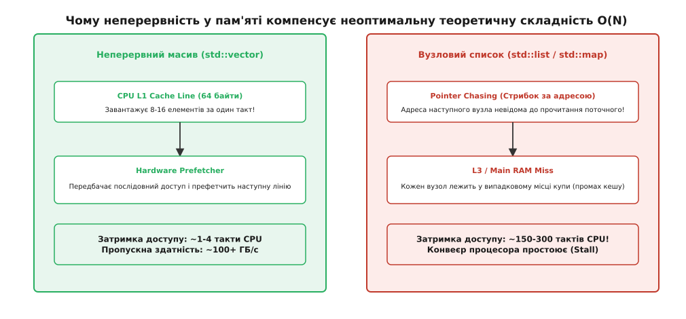
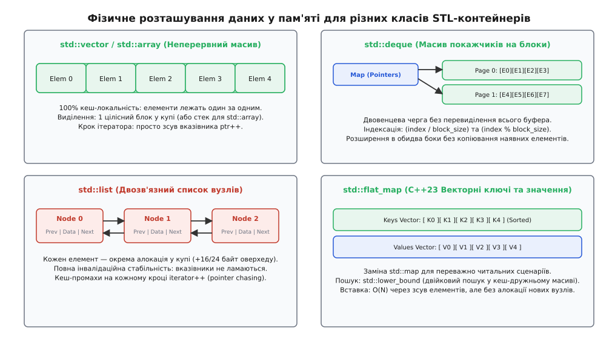
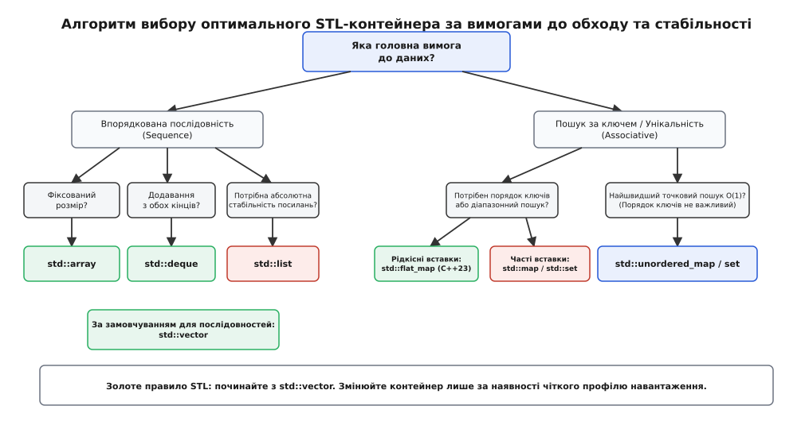

# Вибір контейнерів STL: механіки пам'яті, інвалідація та ціна доступу

<preknowlist>
- [Складність алгоритмів і O-нотація](book:algorithms/asymptotic-complexity) — чому O(1) і O(log N) описують асимптотику, але не враховують константу і кеш.
- [Адреси й покажчики](book:programming/addresses-pointers) — як пам'ять адресується в системі і чому перехід за вказівником коштує дорожче за зсув індексу.
- [Семантика переміщення](book:cpp-standards/move-semantics) — як reallocation у контейнерах переносить об'єкти без копіювання за наявності noexcept-конструктора.
- [Ітератори та категорія обходу](book:cpp-standards/iterators-model) — загальний інтерфейс обходу послідовностей та категорії ітераторів.
- [Купа та виділення пам'яті](book:programming/heap-dynamic-memory) — ціна алокації, фрагментація та локальність посилань.
</preknowlist>

Сервер обробки телеметрії отримує 100 000 подій на секунду й додає їх до внутрішньої черги. Розробник обрав `std::list<Event>`, аргументуючи це тим, що вставка в кінець і видалення з початку списку мають теоретичну складність `O(1)` і не потребують реалокації буфера. Під підвищеним навантаженням профілювальник показав, що 70% часу процесора витрачається не на обробку бізнес-логіки, а на простої в очікуванні пам'яті (CPU Stalls). Кожен новий елемент `std::list` виділявся в купі окремим викликом алокатора, розкидаючи вузли по всій оперативній пам'яті. Заміна `std::list` на `std::deque<Event>` або `std::vector<Event>` із попередньо зарезервованою ємністю зменшила час обробки пакета з 42 мс до 2.8 мс, вивільнивши 93% процесорних тактів без зміни жодного алгоритму.

Цей випадок ілюструє головний парадокс сучасного обчислювального заліза: контейнер із гіршою теоретичною асимптотикою нерідко випереджає «ідеальний» алгоритмічний контейнер у десятки разів. Причина полягає у фізичному влаштуванні системної пам'яті, ієрархії кешів процесора та механіці інвалідації посилань.

---

## 1. Парадокс асимптотики: чому O(1) програє O(N)

У класичній теорії алгоритмів оцінка складності за нотацією `O(...)` розглядає арифметичні операції та доступ до пам'яті як величини з однаковою та постійною ціною. Для абстрактної машини Тюрінга або RAM-машини перехід за покажчиком у зв'язаному списку займає стільки ж часу, скільки індексація елемента в масиві. На реальному кремнії це припущення більше не справджується.

Сучасний центральний процесор працює на частоті 3–5 ГГц, здійснюючи декілька тактових операцій за одну наносекунду. Натомість оперативна пам'ять (DRAM) володіє фізичною затримкою (latency) у 50–100 наносекунд. Це означає, що коли процесор запитує дані, яких немає в його локальному кеші, він вимушений простоювати від 150 до 300 тактів в очікуванні відповіді шини пам'яті.


*Чому неперервність у пам'яті компенсує неоптимальну теоретичну складність O(N).*

Щоб компенсувати цю прірву, процесори оснащуються кристалами надшвидкої пам'яті — кешами L1, L2 та L3. Зчитування даних із пам'яті відбувається не окремими байтами, а кеш-лініями (Cache Lines) фіксованого розміру 64 байти. Коли програма звертається до однієї змінної, контролер пам'яті завантажує в L1-кеш увесь 64-байтний блок, у якому вона лежить.

Тут вступають у дію дві механіки:
1. **Просторова локальність (Spatial Locality)**: Якщо елементи структури лежать у пам'яті послідовно один за одним (як у `std::vector` або `std::array`), зчитування елемента `array[0]` автоматично завантажує в кеш елементи від `array[1]` до `array[15]` (для 4-байтних цілих чисел). Наступні 15 звернень виконуються за 1–3 такти процесора без жодного звернення до RAM.
2. **Апаратна передвибірка (Hardware Prefetcher)**: Процесорний контролер аналізує паттерни доступу. Якщо він бачить лінійний обхід за зростаючими адресами, він заздалегідь завантажує наступну кеш-лінію з оперативної пам'яті до того, як програма вимагатиме її в коді.

У вузлових структурах (`std::list`, `std::set`, `std::map`, `std::unordered_map`) кожен елемент виділяється алокатором у довільному місці динамічної купи (Heap). Вузол списку містить вказівник на наступну копію (`node = node->next`). Така схема спричиняє ефект «гонитви за покажчиками» (Pointer Chasing): процесор не може дізнатися адресу наступного вузла доти, доки не зчитає поточний вузол із пам'яті. Апаратний prefetcher не здатний передбачити випадкові адреси у купі, тому кожен крок ітерації спричиняє промах кешу (Cache Miss) і зупиняє конвеєр процесора.

> 🔧 **Навіщо це.** Завжди обирайте `std::vector` як контейнер за замовчуванням. Навіть коли алгоритм вимагає вставки елементів у середину послідовності зі складністю `O(N)`, копіювання або переміщення блоку пам'яті у суцільному кеш-рядку на обсягах у тисячі елементів виконується швидше, ніж стрибки по окремих вузлах у списку `std::list` з теорією `O(1)`.

Детальний аналіз того, як міркування про кеш-стіну змінили бачення самого автора STL Олександра Степанова, викладено у вставці [історія проектування STL-контейнерів: від узагальненого програмування до кеш-стіни](book:cpp-standards/stl-containers-choice/hist-stl-design.md).

---

## 2. Анатомія послідовних контейнерів: пам'ять, індексація та розширення

Послідовні контейнери (Sequence Containers) зберігають елементи у порядку, який визначається часом і місцем їх додавання, а не їхніми значеннями.


*Фізичне розташування даних у пам'яті для різних класів STL-контейнерів.*

### `std::vector<T>`: Динамічний суцільний масив

`std::vector` представляє собою єдиний безперервний блок пам'яті в купі. Об'єкт контейнера на стек займає зазвичай 24 байти (на 64-бітних системах) і складається з трьох вказівників:
- `begin_` — вказівник на перший елемент буфера.
- `end_` — вказівник на позицію за останнім дійсним елементом (`size = end_ - begin_`).
- `capacity_` — вказівник на кінець виділеного блоку пам'яті (`capacity = capacity_ - begin_`).

```cpp
// Концептуальна структура реалізації std::vector
template <typename T>
class vector {
    T* begin_ = nullptr;
    T* end_ = nullptr;
    T* capacity_ = nullptr;
};
```

Коли програма викликає `push_back()` і `size() == capacity()`, вектор виконує операцію перевиділення (Reallocation):
1. Алокується новий буфер збільшеного розміру. Коефіцієнт зростання (Growth Factor) становить `1.5x` у реалізації MSVC STL або `2.0x` у GCC libstdc++ та Clang libc++.
2. Елементи переносяться зі старого буфера в новий. Якщо тип `T` має конструктор переміщення, позначений як `noexcept`, вектор використовує `std::move_if_noexcept` для ефективного переміщення за допомогою сирих вказівників або `memcpy`. Якщо конструктор переміщення може кинути виняток, вектор вимушений копіювати елементи, щоб зберегти гарантію суворої виняткобезпеки (Strong Exception Guarantee).
3. Старий буфер звільняється через алокатор.

Геометричне зростання місткості забезпечує **амортизовану складність O(1)** для додавання елементів у кінець. Це означає, що поодинока вставка може вимагати `O(N)` часу на копіювання, але проведена серія з `N` вставок виконує сумарно близько `2N` операцій, що дає в середньому `O(1)` на кожен елемент.

Метод `reserve(n)` дозволяє заздалегідь виділити буфер потрібного розміру, повністю усуваючи проміжні реалокації та інвалідацію ітераторів.

#### Роль специфікатора `noexcept` при розширенні вектора
Багато розробників забувають позначати конструктор переміщення власного класу специфікатором `noexcept`.
```cpp
class CustomData {
public:
    CustomData(CustomData&& other) noexcept; // КРИТИЧНО для ефективності std::vector!
};
```
Якщо конструктор переміщення не позначено як `noexcept`, метод `std::vector::push_back()` не має права викликати переміщення під час реалокації буфера. Якщо виняток виникне посередині перенесення елементів, вектор не зможе відновити старий стан, що порушило б сувору гарантію виняткобезпеки. З міркувань безпеки компілятор відкочується до повного копіювання кожного елемента. Додавання одного слова `noexcept` у конструктор переміщення користувальницького класу прискорює реалокацію вектора у 5–10 разів!

#### Небезпека специфічної спеціалізації `std::vector<bool>`
Стандарт C++ містить історичну спеціалізацію `std::vector<bool>`, яка пакує булеві значення побітово (1 біт на один `bool`), зменшуючи обсяг пам'яті у 8 разів.
Однак ця оптимізація порушує концепцію стандартного контейнера:
- `operator[]` повертає не справжнє посилання `bool&`, а проксі-об'єкт `std::vector<bool>::reference`.
- Взяти пряму адресу елемента `&vec[i]` неможливо, бо біти не мають окремих байтових адрес у мові C++.
- Паралельний запис у різні індекси з різних потоків `vec[0] = true` та `vec[1] = false` спричиняє стан гонитви даних (Data Race), оскільки процесор модифікує весь 8-бітний байт цілком через маскування.

Якісна альтернатива: використовувати `std::vector<uint8_t>` (де 1 байт = 1 значення без побітового проксі) або `std::deque<bool>`.

---

### `std::array<T, N>`: Статичний масив без оверхеду

`std::array` — це тонка обгортка навколо звичайного C-масиву `T data[N]`. Його розмір `N` є константою часу компіляції. `std::array` не зберігає жодних вказівників на купу, розміщуючи всі елементи безпосередньо у місці свого оголошення (на стеку, всередині іншої структури або в секції глобальних даних).

Накладні витрати пам'яті (Memory Overhead) дорівнюють рівно 0 байт. Доступ за індексом `operator[]` транслюється компілятором у прямий інструкційний зсув адреси без розпакування вказівників.

---

### `std::deque<T>`: Двовенцева черга сегментованих блоків

`std::deque` (double-ended queue) вирішує головну проблему `std::vector`: швидке додавання та видалення елементів як у кінець (`push_back`), так і в початок (`push_front`) за амортизований час `O(1)` без реалокації всього масиву.

Замість одного суцільного буфера `std::deque` зберігає масив покажчиків (Map) на окремі кванти або сторінки пам'яті фіксованого розміру (зазвичай 512 байт або `N` елементів).

Індексація елемента `deque[i]` здійснюється за дві операції ділення та зсуву адреси:
```cpp
size_t block_index = (start_offset + i) / BLOCK_SIZE;
size_t element_index = (start_offset + i) % BLOCK_SIZE;
T& element = map[block_index][element_index];
```

Завдяки такій структурі при розширенні контейнера спереду або ззаду `std::deque` виділяє лише нову сторінку на 512 байт і додає вказівник у масив Map. Наявні елементи у старих блоках **не змінюють своїх адрес у пам'яті**. Це гарантує, що посилання та вказівники на існуючі елементи залишаються дійсними при додаванні елементів по краях.

---

### `std::list<T>` та `std::forward_list<T>`: Двозв'язний та однозв'язний списки

`std::list` реалізує класичний двозв'язний список. Кожен вузол містить корисне значення `T` та два вказівники: `prev` і `next`.

```cpp
template <typename T>
struct list_node {
    list_node* prev;
    list_node* next;
    T value;
};
```

Оверхед пам'яті на 64-бітній системі складає **16 байт на кожен елемент** лише для збереження системних покажчиків, не враховуючи заголовка алокатора купи (який додає ще 8–16 байт на рівні `malloc`).

`std::forward_list` (C++11) — це однозв'язний список, де кожен вузол містить лише один вказівник `next`. Він не зберігає розмір `size()` (щоб не витрачати 8 байт на лічильник) і не підтримує ітерацію у зворотному напрямку. Обсяг оверхеду зменшено до 8 байт на вузол.

Головна перевага списків — **абсолютна стабільність ітераторів** та можливість передачі вузлів між різними екземплярами списків за допомогою методу `splice()` за час `O(1)` без виділення або копіювання пам'яті.

---

## 3. Асоціативні контейнери: впорядковані дерева, геш-таблиці та flat-моделі

Асоціативні контейнери забезпечують швидкий пошук, вставку та видалення елементів за ключем.

### Впорядковані контейнери: `std::map`, `std::set`, `std::multimap`, `std::multiset`

Контейнери `std::map` та `std::set` збудовані на основі збалансованого червоно-чорного дерева (Red-Black Tree). Кожен елемент зберігається в окремому вузлі купи, який додатково до даних містить:
- Вказівник на батьківський вузол (`parent`).
- Вказівники на ліве та праве дочірні дерева (`left`, `right`).
- Прапор кольору вузла (1 біт, кодований у молодший біт одного з вказівників).

Оверхед структурних вказівників становить **24 байти на вузол**.

Ключові властивості:
- Пошук, вставка та видалення мають гарантовану складність **O(log N)** у найгіршому випадку.
- Елементи завжди зберігаються у відсортованому порядку відповідно до компаратора `std::less<Key>`.
- Підтримуються діапазонні запити: `lower_bound()`, `upper_bound()`, `equal_range()`.
- Ітератори та посилання на елементи не інвалідуються при додаванні або видаленні інших вузлів.

#### Прозорий гетерогенний пошук (Heterogeneous Lookup, C++14)
У C++98 виклик `map.find("key")` для `std::map<std::string, int>` створював тимчасовий об'єкт `std::string("key")` з алокацією пам'яті у купі лише для виконання порівняння.
Починаючи з C++14, використання прозорого компаратора `std::less<void>` (або `std::less<>`) дозволяє шукати елементи за допомогою `std::string_view` або `const char*` без жодних тимчасових алокацій:

```cpp
std::map<std::string, int, std::less<>> transparent_map;
// Пошук за const char* без створення тимчасового std::string!
auto it = transparent_map.find("fast_lookup_key");
```

---

### Геш-контейнери: `std::unordered_map`, `std::unordered_set`

З'явившись у C++11, геш-контейнери реалізують геш-таблицю з методом роздільного зв'язування колізій (Separate Chaining). Контейнер складається з:
1. Масиву кошиків (Buckets array), що містить вказівники на початок зв'язаних списків.
2. Вузлів купи, які об'єднані в однозв'язний список.

```cpp
// Концептуальний вузол геш-таблиці
template <typename Key, typename Value>
struct unordered_map_node {
    unordered_map_node* next;
    size_t hash_value;
    std::pair<const Key, Value> value;
};
```

Пошук виконується за два кроці: обчислення геш-функції `std::hash<Key>() % bucket_count()` та обхід однозв'язного списку колізій у відповідному кошику.
- Середня складність операцій — **O(1)**.
- Найгірша складність — **O(N)** (при виродженні геш-функції, коли всі ключі потрапляють в один кошик).

Коли коефіцієнт заповнення `load_factor() = size() / bucket_count()` перевищує `max_load_factor()` (за замовчуванням 1.0), відбуваються автоматична операція `rehash()`: створюється новий масив кошиків більшого розміру, і всі вузли перерозподіляються. При цьому **усі ітератори інвалідуються**, проте посилання на сам об'єкт дані у купі залишаються дійсними.

#### Обмеження стандарту: чому `std::unordered_map` повільніший за сторонні геш-таблиці?
Стандарт C++ вимагає від `std::unordered_map` гарантії того, що посилання на елементи не інвалідуються при додаванні нових ключів. Через цю вимогу стандартні геш-таблиці змушені використовувати метод відокремлених ланцюжків (Separate Chaining) із вузлами у купі.

Сучасні відкриті геш-таблиці з відкритою адресацією (Open Addressing, Flat Hash Maps, такі як `boost::unordered_flat_map` або `absl::flat_hash_map`) зберігають ключі та значення у суцільному масиві. Вони працюють у **2–3 рази швидше** за `std::unordered_map`, але інвалідують посилання при кожному гешуванні.

---

### C++23 Flat-контейнери: `std::flat_map` та `std::flat_set`

Стандарт C++23 ввів адаптери `std::flat_map` та `std::flat_set` (заголовок `<flat_map>`), покликані усунути проблеми кеш-недружності класичних дерев `std::map`.

Замість вузлів у купі `std::flat_map` зберігає дані у двох паралельних суцільних векторах:
```cpp
template <typename Key, typename T, typename Compare = std::less<Key>,
          typename KeyContainer = std::vector<Key>,
          typename MappedContainer = std::vector<T>>
class flat_map;
```

Перший вектор містить суворо відсортовані ключі, другий — відповідні значення за тими самими індексами.

Пошук виконується за допомогою двійкового пошуку `std::lower_bound` по неперервному масиву ключів.
- Складність пошуку: **O(log N)**.
- Завдяки 100% локальності кешу `std::flat_map` шукає елементи у **3–5 разів швидше** за `std::map` для контейнерів обсягом до 100,000 елементів.
- Недолік: Вставка та видалення вимагають зсуву елементів у масиві за час **O(N)**.

`std::flat_map` є ідеальним вибором для сценаріїв **Read-Heavy**: коли дані один раз завантажуються й сортуються під час старте системи, а далі виконуються мільйони запитів читання.

---

## 4. Контейнерні адаптери та неволодіючі уявлення

C++ надає два додаткові класи структур: адаптери інтерфейсу та неволодіючі посилання на пам'ять.

### Контейнерні адаптери: `std::stack`, `std::queue`, `std::priority_queue`
Адаптери не реалізують власних структур збереження пам'яті, а лише обмежують інтерфейс базового контейнера:
- **`std::stack<T, Container>`**: Обмежує доступ до принципу LIFO (Last-In, First-Out). За замовчуванням використовує `std::deque<T>`.
- **`std::queue<T, Container>`**: Обмежує доступ до FIFO (First-In, First-Out). За замовчуванням використовує `std::deque<T>`.
- **`std::priority_queue<T, Container, Compare>`**: Черга з пріоритетом на основі двоічної піраміди (Binary Heap). За замовчуванням використовує `std::vector<T>` та алгоритми `std::push_heap()` / `std::pop_heap()`. Забезпечує доступ до максимального елемента за `O(1)` та вставку/вилучення за `O(log N)`.

### Неволодіючі уявлення (Views): `std::string_view` (C++17) та `std::span` (C++20)
Контейнери володіють пам'яттю і відповідають за її звільнення у деструкторі. Передача `const std::vector<T>&` у функцію вимагає прив'язки до конкретного контейнера.

`std::span<T>` та `std::string_view` — це неволодіючі обгортки, що складаються з двох полів: вказівника `T* ptr` та довжини `size_t len` (16 байт на стеку):
```cpp
// Функція приймає будь-яку суцільну послідовність (vector, array, C-array) без копіювання
void process_bytes(std::span<const uint8_t> data) {
    for (uint8_t byte : data) {
        // Обробка без алокацій!
    }
}
```

---

## 5. Поліморфні ресурси пам'яті `std::pmr` (C++17)

Одним із головних недоліків вузлових контейнерів (`std::list`, `std::map`, `std::unordered_map`) є виклик системної функції `malloc` для кожного нового елемента. Це створює накладні витрати часу і призводить до фрагментації динамічної купи.

У C++17 введено простір імен `std::pmr` (Polymorphic Memory Resources). Він дозволяє міняти стратегію виділення пам'яті для контейнера без зміни його типу:

```cpp
#include <memory_resource>
#include <vector>
#include <string>

void pmr_example() {
    // Виділяємо арену на 64 КіБ прямо на стеку
    std::array<std::byte, 65536> stack_buffer;
    std::pmr::monotonic_buffer_resource pool(stack_buffer.data(), stack_buffer.size());

    // Вектор використовує арений алокатор: ЖОДНОГО виклику malloc!
    std::pmr::vector<std::pmr::string> vec(&pool);
    vec.push_back("Hello, PMR Arena Allocation!");
}
```

Основні ресурси пам'яті в `std::pmr`:
1. `monotonic_buffer_resource`: Арений алокатор. Пам'ять виділяється зсувом покажчика вперід за наносекунду. Пам'ять не повертається системі до знищення всієї арени. Ідеально підходить для обробки короткоживучих пакетів або запитів у мережевих серверах.
2. `unsynchronized_pool_resource`: Пул фіксованих блоків (Chunk Pools). Прискорює додавання й видалення вузлів однакового розміру для `std::pmr::list` та `std::pmr::unordered_map` в однопотоковому контексті.
3. `synchronized_pool_resource`: Потокобезпечний варіант пулу блоків.

---

## 6. Багатопотоковість та гарантії безпеки доступу (Thread Safety)

Усі стандартні контейнери STL надають суворі правила щодо паралельного доступу з кількох потоків (Thread Safety Guarantees):

1. **Одночасне читання (`const` операції)**:
   Будь-яка кількість потоків може одночасно викликати `const`-методи контейнера (`size()`, `operator[]`, `find()`, ітерація `begin()`...`end()`) без додаткової синхронізації та без виникнення гонитви даних (Data Race).
2. **Одночасний запис або модифікація**:
   Якщо хоча б один потік викликає мутуючий метод (`push_back()`, `erase()`, `operator[]` у map, `clear()`), розробник зобов'язаний захистити контейнер за допомогою зовнішнього механізму синхронізації (`std::mutex`, `std::shared_mutex` або `std::scoped_lock`).
3. **Елементи контейнера**:
   Паралельна модифікація різних елементів у неперервному контейнері (наприклад `vec[0] = 1;` у першому потоці та `vec[1] = 2;` у другому) є безпечною, **за винятком `std::vector<bool>`**, де побітове пакування призводить до Data Race на спільному байті.

В мові C++ немає «атомарних контейнерів». Якщо програмі потрібна лок-фрі черга або таблиця (Lock-Free Queue / Map), використовуються спеціалізовані бібліотеки (наприклад `boost::lockfree` або Intel TBB).

---

## 7. Механіка інвалідації ітераторів, вказівників та посилань

Розробка на C++ вимагає чіткого розуміння того, які операції над контейнером роблять існуючі ітератори та покажчики некоректними. Звернення за інвалідованим ітератором або посиланням є невизначеною поведінкою (Undefined Behavior) і призводить до витоків пам'яті або збоїв по сегментації (Segmentation Fault).

Нижче наведено фундаментальні правила інвалідації.

```cpp
std::vector<int> vec = {10, 20, 30, 40};
int* ptr = &vec[0];         // Зберегли вказівник на перший елемент
vec.push_back(50);          // УВАГА: якщо розмір перевищить capacity(), 
                            // відбудеться reallocation і ptr стане висячим (Dangling Pointer)!
```

### Матриця інвалідації

1. **`std::vector`**:
   - Вставка/`push_back()` зі зміною `capacity()`: **Інвалідуються всі** ітератори, посилання та вказівники.
   - Вставка/`push_back()` без зміни `capacity()`: Інвалідуються ітератори та посилання **від точки вставки до кінця** вектора. До точки вставки — залишаються дійсними.
   - Видалення (`erase`/`pop_back`): Інвалідуються ітератори та посилання **від першого видаленого елемента і до кінця**.

2. **`std::deque`**:
   - Вставка спереду (`push_front`) або ззаду (`push_back`): **Інвалідуються всі ітератори**, але **посилання та вказівники на наявні елементи залишаються ДІЙСНИМИ**!
   - Вставка або видалення у середині: **Інвалідуються всі** ітератори та посилання.
   - Видалення спереду або ззаду: Інвалідуються лише ітератори та посилання на **видалений** елемент.

3. **`std::list` / `std::forward_list`**:
   - Вставка: **Нічого не інвалідується**.
   - Видалення: Інвалідуються лише ітератори та посилання на **видалений** елемент.
   - `splice()`: **Нічого не інвалідується**, ітератори переходять разом із вузлом в інший список.

4. **`std::map` / `std::set` / `std::unordered_map`**:
   - Вставка: **Нічого не інвалідується** (у геш-таблицях при `rehash()` інвалідуються ітератори, але посилання на об'єкти залишаються дійсними).
   - Видалення: Інвалідуються лише ітератори та посилання на **видалений** елемент.

Повний звід нормативних гарантій стандарту для всіх контейнерів наведено у вставці [правила інвалідації та таблиця складності STL-контейнерів](book:cpp-standards/stl-containers-choice/api-invalidation-rules.md).

---

## 8. Інженерна матриця та алгоритм вибору контейнера

Діаграма нижче підсумовує практичний алгоритм прийняття рішення під час розробки архітектури програмного забезпечення.


*Алгоритм вибору оптимального STL-контейнера за вимогами до обходу та стабільності.*

Для вибору контейнера орієнтуйтеся на наступні три запитання:

1. **Чи відомий розмір даних під час компіляції?**
   - Так -> **`std::array<T, N>`**.

2. **Чи потрібен пошук за ключем або унікальність елементів?**
   - Порядок ключів не важливий, потрібен швидкісний точковий доступ -> **`std::unordered_map` / `std::unordered_set`**.
   - Потрібен відсортований порядок, але дані записуються один раз і лише читаються -> **`std::flat_map`** (C++23) або відсортований **`std::vector`** із `std::lower_bound`.
   - Потрібен відсортований порядок і постійні вставки/видалення у довільному порядку -> **`std::map` / `std::set`**.

3. **Які вимоги до послідовності елементів?**
   - Потрібне додавання в обидва кінці (черга/дек) без інвалідації посилань -> **`std::deque`**.
   - Потрібна гарантія того, що посилання на елементи ніколи не зламаються при вставках у середину, або потрібен забіг вузлів за `O(1)` методом `splice()` -> **`std::list`**.
   - У всіх інших випадках -> **`std::vector`**.

Приклад реалізації двох підходів до табличного пошуку (впорядкований вектор проти геш-таблиці) та їх порівняльний аналіз наведено у вставці [бенчмарки контейнерів та кеш-локальності](book:cpp-standards/stl-containers-choice/proj-container-benchmarks.md).

### Сводна таблиця характеристик

| Контейнер | Кеш-локальність | Вставка в кінець | Вставка в середину | Пошук за значенням | Оверхед пам'яті на елемент |
| :--- | :--- | :--- | :--- | :--- | :--- |
| `std::vector` | Відмінна (100%) | `O(1)` аморт. | `O(N)` | `O(N)` / `O(log N)` (якщо відсортований) | 0 байт |
| `std::array` | Відмінна (100%) | N/A | N/A | `O(N)` | 0 байт |
| `std::deque` | Добра (~90%) | `O(1)` | `O(N)` | `O(N)` | ~0.2 байти |
| `std::list` | Низька (0%) | `O(1)` | `O(1)` (з ітератором) | `O(N)` | 16–24 байти |
| `std::map` | Низька (0%) | `O(log N)` | `O(log N)` | `O(log N)` | 24–32 байти |
| `std::unordered_map` | Низька (0%) | `O(1)` аморт. | `O(1)` аморт. | `O(1)` аморт. | 16–32 байти |
| `std::flat_map` | Відмінна (100%) | `O(1)` аморт.* | `O(N)` | `O(log N)` | 0 байт |

Практичний досвід підтверджує: у 90% реальних задач розробки C++ контейнер `std::vector` виявляється найбільш ефективним вибором. Відхилятися від цього правила варто лише тоді, коли інструменти профілювання (такі як `perf`, `valgrind --tool=cachegrind` або Visual Studio Profiler) чітко вказують на проблему з реалокацією пам'яті або потребу в інвалідаційній стабільності посилань.
