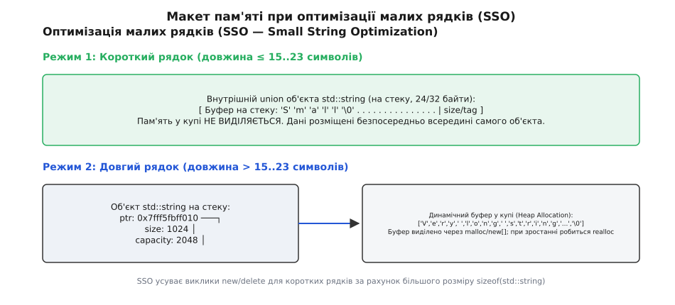
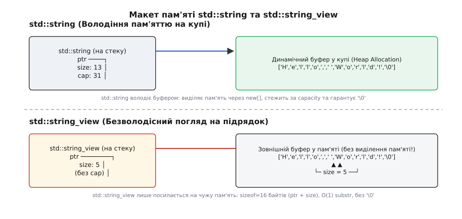
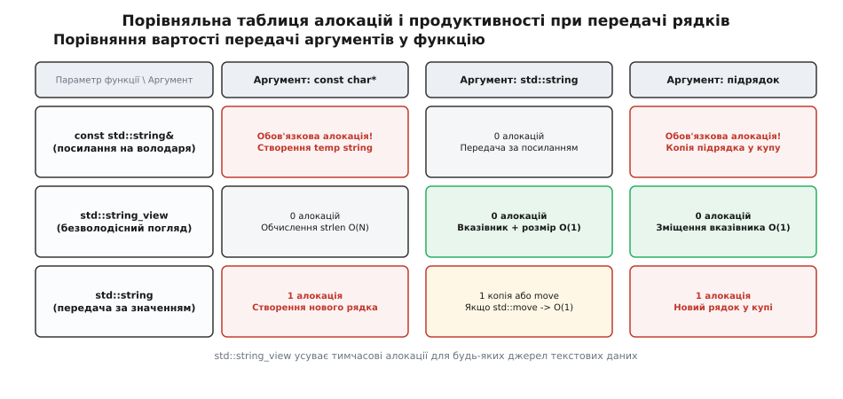
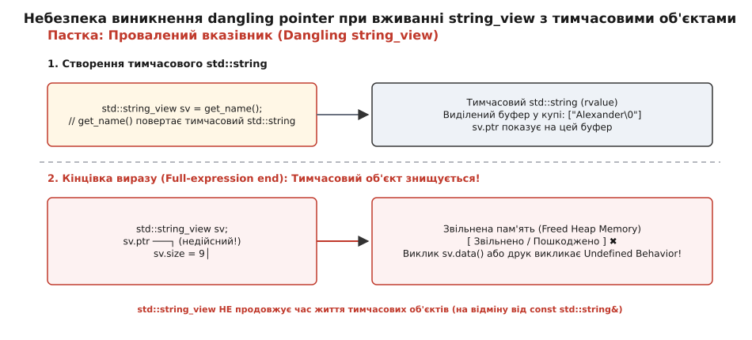

# std::string та std::string_view: володіння, посилання та нульові витрати

<preknowlist>
- [Динамічна пам'ять і купа](book:programming/heap-dynamic-memory) — як працює виділення пам'яті через malloc/new, чому виклики аллокатора повільні та що таке фрагментація.
- [RAII та час життя об'єктів](book:programming/raii) — зв'язування системних ресурсів із часом життя об'єкта на стеку.
- [Семантика переміщення](book:cpp-standards/move-semantics) — як rvalue-посилання дозволяють передавати володіння буфером за постійний час O(1).
- [Адреси та вказівники](book:programming/addresses-pointers) — арифметика вказівників, суцільний масив байтів та зміщення в пам'яті.
</preknowlist>

## Ціна володіння: чому стандартний рядок не завжди пасує

Обробка тексту у високонавантажених сервісах або системних утилітах приховує пастку, яка непомітно виїдає продуктивність процесора. Коли функція приймає рядок за константним посиланням `const std::string&`, викликач змушений надати саме об'єкт `std::string`. Якщо ж у місці виклику знаходиться C-рядок `const char*` (наприклад, строковий літерал `"HTTP/1.1"` або підрядок у системному буфері), компілятор не має іншого виходу, окрім як створити тимчасовий об'єкт `std::string`.

Створення `std::string` вимагає виділення динамічної пам'яті у купі через `malloc` або `operator new[]`, побайтового копіювання символів та подальшого звільнення буфера при виході з області видимості. Навіть якщо функція лише читає два символи статус-коду, програма платить повну ціну системного виклику алокатора.

Причина полягає в семантиці самого типу `std::string`. Цей клас є **володарем** (англ. *owner*) свого ресурсу. Він гарантує неперервність масиву символів у пам'яті, стежить за його розміром (`size`), виділеною ємністю (`capacity`) та контролює наявність нульового термінатора `\0` у кінці буфера. Володіння дає безпеку й автоматичне управління часом життя, але за це доводиться платити монопольним контролем над динамічним буфером.

```cpp
void parse_header(const std::string& header);

// Передача строкового літералу змушує компілятор виділити купу:
parse_header("Content-Type: application/json"); // 1 алокація + 1 деалокація
```

Коли програма розбирає мережевий пакет розміром у кілька мегабайтів або обробляє файловий лог на мільйони рядків, створення тимчасових об'єктів-володарів для кожного знайденого слова чи токена перетворює обчислення на нескінченне очікування відповідей від алокатора пам'яті. 

Алокатор пам'яті операційної системи — це складний механізм, що змушений шукати вільний блок у таблицях купи, брати м'ютекси у багатопотоковому середовищі та проводити фрагментацію пам'яті. Виклик `malloc` зазвичай займає від десятків до сотень тактів процесора, тоді як сама операція порівняння двох коротких рядків може вимагати лише кількох тактів. У результаті програма витрачає понад 90% свого робочого часу не на аналіз тексту, а на обслуговування служебних структур даних купи.

Крім того, виділення буфера у купі призводить до погіршення локальності даних у кеші процесора. Об'єкт `std::string` живе на стеку, але його вказівник показує на далеку адресу в купі. Процесор змушений виконувати додаткове розіменування вказівника (`pointer chasing`), що спричиняє промахи кешу першого та другого рівнів (L1/L2 cache misses).

## Оптимізація малих рядків (SSO — Small String Optimization)

Щоб пом'якшити накладні витрати для коротких текстових фрагментів, усі сучасні реалізації стандартної бібліотеки C++ (libstdc++, libc++, MSVC STL) застосовують оптимізацію малих рядків (англ. *Small String Optimization*, SSO).

Ідея SSO полягає у відмові від виділення пам'яті в купі, якщо довжина рядка не перевищує розміру самого внутрішнього буфера, розміщеного безпосередньо у внутрішніх полях об'єкта `std::string` на стеку.


*Оптимізація малих рядків (SSO): короткі рядки зберігаються безпосередньо у внутрішньому буфері об'єкта std::string на стеку.*

Усередині об'єкта `std::string` розташовується анонімне об'єднання (`union`), яке суміщає три слова стану для довгого рядка (покажчик `data`, розмір `size`, ємність `capacity`) з фіксованим масивом байтів для короткого рядка:

```cpp
// Концептуальна структура std::string у 64-бітній системі (sizeof = 32 байти)
class string {
    union {
        struct {
            char*       ptr;
            std::size_t size;
            std::size_t capacity;
        } heap;

        struct {
            char        buf[23];
            unsigned char sso_size; // Або прапорець у старшому байті
        } sso;
    };
};
```

Межа довжини SSO залежить від реалізації стандартної бібліотеки:
- **libstdc++ (GCC)**: 15 символів (при `sizeof(std::string) = 32` байти);
- **libc++ (Clang)**: 22 символи на 64-бітних архітектурах (завдяки упаковці прапорця у найменший біт);
- **MSVC STL**: 15 символів (при `sizeof(std::string) = 32` байти).

Розберемо детальніше анатомію дизайну SSO у трьох головних компіляторах:

У **libstdc++ (GCC)** об'єкт `std::string` містить 32 байти. Вони розподілені між вказівником на дані, розміром рядка та внутрішнім буфером з 16 байтів. Якщо рядок містить 15 або менше символів, вказівник спрямовується на власний внутрішній масив `_M_local_buf`, розташований у тому ж об'єкті. Вісімнадцятий байт зберігає нульовий термінатор, а розмір контролюється лічильником `_M_string_length`.

У **libc++ (LLVM/Clang)** розробники застосували ще витонченішу схему бітового кодування. Усі 24 байти об'єкта `std::string` використовуються як єдиний розширюваний буфер. Найменший біт останнього байта слугує дискримінантом (прапорцем): якщо біт дорівнює нулю, рядок вважається довгим і містить повноцінні поля `ptr`, `size`, `capacity`. Якщо ж біт дорівнює одиниці, увесь 24-байтовий блок розглядається як масив символів, а решта 7 бітів останнього байта зберігають вільний обсяг. Це дозволяє упаковувати до 22 символів без виділення купи на 64-бітних платформах.

У **MSVC STL** об'єкт рядка завжди займає 32 байти і використовує фіксований `union` із буфером на 16 символів. Якщо ємність перевищує 15 символів, пам'ять виділяється у купі, а при зменшенні буфер може повертатися назад у стековий масив.

Якщо рядок коротший за межу SSO, динамічна пам'ять не виділяється. Проте за SSO доводиться платити збільшеним розміром самого об'єкта `std::string` на стеку (24 або 32 байти замість 16). Крім того, SSO змінює семантику переміщення: при переміщенні SSO-рядка символи копіюються між стековими буферами за `O(N)`, а вказівники на елементи малого рядка інвалідуються, що відрізняється від гарантій `O(1)` для рядків у купі.

При використанні семантики переміщення `std::move` для великого рядка, що лежить у купі, відбувається лише обмін трьох вказівників (`ptr`, `size`, `capacity`) за постійний час `O(1)`. Вказівники на елементи рядка у купі залишаються валидними. Проте для малогабаритного SSO-рядка переміщення змушене копіювати вміст внутрішнього масиву байт-за-байтом. Оскільки масив розміщений безпосередньо всередині об'єкта-джерела, адреса символів змінюється, і всі існуючі вказівники чи ітератори на внутрішні символи стають недійсними.

Також слід враховувати геометричне зростання ємності `capacity()` при викликах `append()` або `operator+=`. Більшість реалізацій збільшують ємність у 1.5 або 2 рази при перевищенні поточного буфера. Це забезпечує амортизовану складність `O(1)` для додавання символів, але може призводити до тимчасового подвоєння обсягу пам'яті під час перерозподілу.

## Алокатори та шаблонне розширення std::basic_string

Для глибшого розуміння системи типів C++ важливо бачити, що `std::string` не є самостійним класом. Це лише псевдонім типів (typedef/using) для шаблонного класу `std::basic_string`:

```cpp
namespace std {
    template <typename CharT, 
              typename Traits = std::char_traits<CharT>, 
              typename Allocator = std::allocator<CharT>>
    class basic_string;

    using string = basic_string<char>;
    using u16string = basic_string<char16_t>;
    using u32string = basic_string<char32_t>;
    using wstring = basic_string<wchar_t>;
}
```

Параметр `Traits` визначає низку низькорівневих операцій над символами: порівняння (`eq`, `lt`), копіювання (`copy`), переміщення (`move`) та пошук нульового термінатора (`length`). Це дозволяє створювати, наприклад, рядки, які ігнорують регістр символів при порівнянні (case-insensitive strings), просто замінивши `Traits`.

Параметр `Allocator` відповідає за отримання та повернення пам'яті. У критичних до швидкодії системах (авіоніка, високочастотний трейдинг) стандартний `std::allocator` замінюють на аренований алокатор (Arena Allocator) або монотонний буферний алокатор (`std::pmr::monotonic_buffer_resource` із C++17), що усуває системні виклики `malloc`.

Проте застосування кастомних алокаторів створює бар'єр несумісності типів: `std::basic_string<char, std::char_traits<char>, MyAlloc>` та `std::string` є двома абсолютно різними типами для компілятора. Функція, що приймає `const std::string&`, не зможе прийняти рядок з іншим алокатором без повного копіювання буфера.

## Безволодісний погляд: концепція std::string_view

Оптимізація SSO вирішує проблему коротких рядків, але лишає невирішеною проблему зрізання (нарізання підрядків). Виклик `s.substr(7, 5)` для об'єкта `std::string` завжди створює новий рядок і знову запускає копіювання байтів.

C++17 ввів фундаментальне розділення концепцій **володіння текстом** та **спостереження за текстом**, додавши тип `std::string_view` (з заголовного файлу `<string_view>`).


*Макет пам'яті: std::string володіє буфером у купі, тоді як std::string_view зберігає вказівник і розмір без виділення нової пам'яті.*

`std::string_view` не володіє пам'яттю і не намагається її звільняти. Структурно це легковажна пара з двох полів:

```cpp
// Концептуальний устрій std::string_view (sizeof = 16 байтів на 64-бітній системі)
class string_view {
    const char* ptr_ = nullptr;
    std::size_t size_ = 0;
public:
    constexpr string_view(const char* data, std::size_t len) 
        : ptr_(data), size_(len) {}
    
    constexpr const char* data() const noexcept { return ptr_; }
    constexpr std::size_t size() const noexcept { return size_; }
};
```

Зверніть увагу на важливу деталізацію: `std::string_view` є шаблоном `std::basic_string_view<CharT, Traits>`, але він **не має параметра Allocator**!

Це робить `std::string_view` універсальним містком між будь-якими джерелами даних. Він може без жодних копіювань та без зміни типів спостерігати за символами у `std::string`, у масиві на стеку, у C-рядку, у статичному пам'ятному сегменті програми, у mmap-файлі або у `std::pmr::string` з унікальним алокатором.

Оскільки `std::string_view` складається лише з вказівника на початок масиву та його довжини, передача цього об'єкта у функцію за значенням (`by value`) коштує стільки ж, скільки передача двох регістрів процесора (наприклад, `RDI` та `RSI` у System V ABI на Linux x86_64).

Створення підрядка через `sv.substr(start, length)` має часову складність `O(1)`. Воно виконує лише арифметику вказівників: новий об'єкт отримує вказівник `ptr_ + start` та розмір `length`. Жоден байт тексту не копіюється, і жоден виклик алокатора не здійснюється.

Шлях розробки цього інструменту від небезпечних C-вказівників до стандартного типу описано у висвітленні [Як виникла потреба в std::string_view](book:cpp-standards/string-and-string-view/hist-string-view.md).

## Параметри функцій: три різні філософії прийому рядків

До появи `std::string_view` вибір типу параметра для функції розбору або читання тексту завжди був компромісом. Завдяки C++17 виділяються три чіткі паттерни:


*Порівняння алокацій пам'яті для різних типів параметрів і аргументів.*

### 1. Передача за значенням `std::string_view` (для читання)

Коли функція лише читає текст, шукає в ньому символи, перевіряє префікси або розбиває на лексеми, вона повинна приймати `std::string_view` за значенням:

```cpp
void process_log(std::string_view entry) {
    if (entry.starts_with("[ERROR]")) {
        // Обробка без жодного копіювання
    }
}
```

Така функція однаково ефективно приймає `std::string`, `const char*`, `std::vector<char>`, `std::array<char, N>` або строковий литерал `"literal"sv`. Всі вони неявно перетворюються на `std::string_view` за `O(1)` (для `const char*` виконується `strlen`, що є `O(N)`).

Передача `std::string_view` за константним посиланням `const std::string_view&` є не лише надлишковою, а й шкідливою для продуктивності. Посилання змушує компілятор зберігати об'єкт у пам'яті та передавати його адресу, що додає непрямий доступ через розіменування вказівника у машиному коді. Передача за значенням дозволяє розмістити два 64-бітних числа безпосередньо у регістрах процесора.

### 2. Передача за значенням `std::string` + `std::move` (коли потрібна власна копія)

Якщо функція **мусить зберегти володіння** рядком (наприклад, у записати в поле структури або в контейнер), приймайте `std::string` за значенням і переміщуйте його всередині:

```cpp
class User {
    std::string name_;
public:
    // Оптимально для lvalue та rvalue аргументів
    explicit User(std::string name) : name_(std::move(name)) {}
};
```

Якщо викликач передає тимчасовий рядок (`rvalue`), відбудеться лише одне переміщення буфера. Якщо викликач передає lvalue, відбудеться одна копія. Приймати `std::string_view` у такому випадку гірше, бо це гарантує додаткову алокацію при створенні `std::string` з погляду.

Розглянемо випадок, коли аргументом конструктора `User` є строковий літерал `"Alexander"`. Якщо конструктор приймає `std::string_view`, компілятор створює `string_view` (0 алокацій), а потім у тілі конструктора викликає `name_(name)`, що створює `std::string` з погляду (1 алокація). Якщо ж конструктор приймає `std::string` за значенням, створюється аргумент `name` (1 алокація), а потім `name_` отримує ресурс через `std::move` (0 алокацій). Загальна кількість алокацій в обох випадках дорівнює 1, але при передачі `std::string` конструктор виявляється універсальним і для rvalue-рядків!

### 3. Передача за константним посиланням `const std::string&` (застарілий паттерн)

Вживати `const std::string&` як параметр варто лише у двох випадках:
- Старий код (C++11/C++14), де `std::string_view` ще недоступний;
- Коли API вимагає передавати рядок у сторонню C-бібліотеку, якій обов'язково потрібен нульовий термінатор `\0` (через `s.c_str()`).

Порівняльна таблиця характеристик типів параметрів:

| Характеристика | `const std::string&` | `std::string_view` | `std::string` (by value) |
| :--- | :--- | :--- | :--- |
| **Семантика** | Посилання на володаря | Безволодісний погляд | Отримання володіння |
| **Розмір аргументу** | 8 байтів (посилання) | 16 байтів (значення) | 24-32 байти + купа |
| **Сумісність з `const char*`** | Створює temp `std::string` | Конвертує за `O(N)` | Створює новий `std::string` |
| **Накладні витрати substr()** | `O(N)` копіювання у купу | `O(1)` арифметика вказівників | `O(N)` копіювання у купу |
| **Гарантія `\0` (null-term)** | Завжди є (`c_str()`) | **Відсутня** (`data()`) | Завжди є (`c_str()`) |

> 🔧 **Навіщо це.** Заміна `const std::string&` на `std::string_view` у парсерах та роутерах файлових шляхів усуває до 90% неявних викликів `malloc` у критичних гарячих циклах програми.

## Пастки та підводні камені: час життя та нульовий термінатор

Попри зручність, `std::string_view` є одним із найнебезпечніших типів у сучасному C++, якщо не розуміти його обмежень.

### Пастка 1: Висячий вказівник (Dangling string_view)

Оскільки `std::string_view` не володіє пам'яттю, він опирається на припущення, що джерело даних житиме довше за самий погляд.


*Небезпека виникнення dangling pointer при прив'язці string_view до тимчасового значення std::string.*

Спроба зберегти `std::string_view`, що посилається на тимчасовий об'єкт, призводить до невизначеної поведінки (Undefined Behavior):

```cpp
std::string get_filename() {
    return "data_2026.log";
}

// КАТАСТРОФА: get_filename() повертає тимчасовий std::string.
// Після завершення ініціалізації sv тимчасовий рядок знищується!
std::string_view sv = get_filename(); 

// Помилка під час виконання: читання звільненої пам'яті (Use-After-Free)
std::cout << sv; // UB!
```

На відміну від `const std::string&`, константне посилання **подовжує час життя** тимчасового rvalue-об'єкта до кінця блоку. Об'єкт `std::string_view` **не є посиланням для мови C++** — це звичайна структура за значенням, тому подовження часу життя для неї не працює.

Розглянемо п'ять класичних сценаріїв, де виникає висячий вказівник у `std::string_view`:

1. **Повернення `string_view` із функції**: Функція створює локальний `std::string` або виконує конкатенацію `s1 + s2` і повертає `std::string_view`. Локальний об'єкт руйнується при виході з функції, залишаючи повернений погляд порожнім покажчиком на мертвий стек або купу.
2. **Збереження погляду у полях класів**: Клас зберігає `std::string_view` як поле, а конструктор приймає `const std::string&`. Якщо викликач передає тимчасовий рядок або строковий літерал, створиться тимчасовий `std::string`, який помре одразу після завершення виклику конструктора.
3. **Ланцюжки операторів конкатенації**: Вираз `std::string_view sv = (s1 + s2);` створює тимчасовий рядок у дужках. Погляд `sv` отримує вказівник на його буфер, але в точці з комою `;` (кінець повного виразу, full-expression) тимчасовий рядок знищується.
4. **Реалокація контейнерів**: Якщо погляд посилається на елемент у `std::vector<std::string>`, то виклик `vector.push_back()` або `vector.resize()` може спричинити перевиділення пам'яті вектора. Старі рядки переміщуються на нову адресу, роблячи існуючі `string_view` висячими.
5. **Модифікація вихідного рядка**: Навіть без реалокації, виклик `str.clear()` або `str.erase()` змінює вміст буфера, через що погляд показуватиме на некоректний або застарілий текст.

:::tabs
```cpp
// C++: Пастка часу життя та висячого погляду
#include <iostream>
#include <string>
#include <string_view>

std::string_view create_dangling_view() {
    std::string local_str = "Тимчасові дані в локальній змінній";
    return local_str; // Небезпека: local_str знищиться при виході з функції!
}

void dangling_demo() {
    std::string_view bad_sv = create_dangling_view();
    // bad_sv.data() тепер вказує на сміття у стековому кадрі
}
```
```c
// C: Аналогічна помилка при поверненні вказівника на локальний масив
#include <stdio.h>

const char* create_dangling_pointer(void) {
    char local_buf[64] = "Тимчасові дані в локальній змінній";
    return local_buf; // Небезпека: повернення вказівника на стековий буфер!
}

void dangling_demo_c(void) {
    const char* bad_ptr = create_dangling_pointer();
    // bad_ptr вказує на вивільнений стековий кадр
}
```
:::

Сучасні статичні аналізатори (Clang-Tidy, MSVC Code Analysis) та прапорці компілятора (`-Wdangling-gsl` у Clang) вміють знаходити більшість цих помилок ще на етапі компіляції. Також у C++20 додано атрибути `[[clang::lifetimebound]]`, які дозволяють позначати параметри функцій для відстеження зв'язку часу життя між аргументом та поверненим поглядом.

### Пастка 2: Відсутність нульового термінатора (`\0`)

C-рядки обов'язково завершуються нульовим байтом `\0`. Системні виклики POSIX (`open`, `stat`, `printf("%s")`) та традиційні C-функції (`atoi`, `strlen`, `strcpy`) шукають `\0` для зупинки обробки.

Об'єкт `std::string_view` **не гарантує наявності `\0`** у кінці свого діапазону.

```cpp
std::string text = "Hello World";
std::string_view sv(text.data(), 5); // Погляд на "Hello"

// data() повертає "Hello World", оскільки нульового байта після 'o' немає!
printf("%s\n", sv.data()); // Надрукує "Hello World", бо шукає '\0' у вихідному рядку!
```

Якщо ж підрядок утворено з середини масиву, виклик C-функції з `sv.data()` прочитає дані за межами підрядка і може спричинити вихід за межі масиву (Buffer Overread).

```cpp
void open_file(std::string_view path) {
    // ПОМИЛКА: path.data() не має '\0' на кінці, якщо це sv.substr(...)
    FILE* f = fopen(path.data(), "r"); // Небезпека!
}

// Правильно: явне створення об'єкта std::string з нульовим термінатором
void open_file_safe(std::string_view path) {
    std::string null_terminated_path(path);
    FILE* f = fopen(null_terminated_path.c_str(), "r"); // Безпечно
}
```

Для безпечної роботи з системними викликами POSIX та C-бібліотеками рекомендується застосовувати один із двох підходів:

1. **Явне перетворення у `std::string`**: Якщо системний виклик виконується рідко (наприклад, відкриття файлу конфігурації один раз при старті), створити тимчасовий `std::string(sv)` є найпростішим і найбезпечнішим шляхом.
2. **Локальний стековий буфер із `\0`**: У гарячих циклах можна скористатися невеликим масивом на стеку (наприклад, `char buf[256]`), скопіювати туди символи з `string_view` за допомогою `sv.copy(buf, sv.size())` і вручну приписати `buf[sv.size()] = '\0'`. Це зберігає гарантію нульового алокатора і забезпечує сумісність із C-API.

## Розвиток у C++20 та C++23: від constexpr до розширених інтерфейсів

З виходом нових стандартів C++ використання рядків та поглядів отримало потужні доповнення.

### C++20: constexpr std::string та розширений пошук

У C++20 `std::string` отримав підтримку `constexpr`. Це означає, що відтепер рядки можна створювати, змінювати та конкатенувати безпосередньо під час компіляції. Динамічна пам'ять, виділена у `constexpr`-контексті, повинна бути звільнена до завершення компіляції.

Також у C++20 для `std::string_view` додано зручні методи перевірки префіксів та суфіксів:
- `sv.starts_with("prefix")` — перевіряє, чи починається погляд із вказаного підрядка;
- `sv.ends_with(".png")` — перевіряє закінчення рядка.

 Крім того, C++20 запровадив гетерогенний пошук у асоціативних контейнерах (`std::unordered_map`, `std::map`). Якщо компаратор або хеш-функція позначені тегом `is_transparent`, пошук елемента `map.find("key"sv)` з ключем `std::string` виконується без створення тимчасового `std::string`.

Гетерогенний пошук є величезним кроком уперед для асоціативних контейнерів. У C++11 при спробі виконати `map.find("my_key_literal")` для `std::unordered_map<std::string, int>` компілятор змушений був конструювати тимчасовий `std::string("my_key_literal")` для розрахунку хешу та виклику оператора порівняння. Завдяки C++20 та прозорим компараторам (`std::hash<std::string_view>`, `std::less<>`) контейнер обчислює хеш безпосередньо від `std::string_view` і порівнює байти без створення жодного об'єкта-володаря.

### C++23: Метод contains та конструктор з діапазонів

C++23 додав метод `sv.contains()` для `std::string` та `std::string_view`:

```cpp
if (sv.contains("DEBUG")) {
    // Значно виразніше за (sv.find("DEBUG") != std::string_view::npos)
}
```

Також C++23 дозволяє неявно конструювати `std::string_view` з будь-якого неперервного діапазону символів (`std::ranges::contiguous_range`), такого як `std::vector<char>` або `std::span<const char>`.

Ще одним важливим нововведенням C++23 стала заборона конструювання `std::string_view` з нульового вказівника `nullptr`. Конструктор `std::string_view(std::nullptr_t) = delete;` оголошено видаленим. Це переносить випадкову передачу `nullptr` із категорії невизначеної поведінки у час виконання (UB) до категорії помилки компіляції під час збирання проєкту.

Детальний систематичний виклад усіх методів, алгоритмів пошуку та складності операцій містить [Повний довідник операцій та застережень API](book:cpp-standards/string-and-string-view/api-string-view-ops.md).

## Системне застосування та реальний приклад

Поєднання `std::string` як володаря даних і `std::string_view` як інструменту аналізу формує ідеальний каркас для високопродуктивних систем. Завантаження файлу або мережевого пакета відбувається один раз у монолітний буфер `std::string` (або `std::vector<char>`), після чого увесь синтаксичний аналіз, токенізація та витяг полів виконуються виключно через `std::string_view`.

При проектуванні архітектури обробки даних слід дотримуватися чіткого розподілу ролей:

1. **Шар вводу-виводу (I/O Layer)**: Завантажує сирий блок байтів із мережевого сокета, файлу або бази даних. Тут створюється єдиний володар пам'яті `std::string` або `std::vector<char>`. Буфер виділяється один раз із необхідним запасом ємності (`reserve`).
2. **Шар синтаксичного аналізу (Parsing Layer)**: Приймає `std::string_view` на створений буфер. Сканує текст, виділяє токени, перевіряє заголовки та розбиває структуру на поля без жодного виклику алокатора. Всі проміжні структури даних (AST-вузли, таблиці ключів, розібрані параметри) зберігають `std::string_view`.
3. **Шар бізнес-логіки та збереження (Storage Layer)**: Якщо розібраний об'єкт має залишитися у пам'яті системи надовго (наприклад, збережений у базі даних сесій користувачів), відповідні поля конвертуються з `std::string_view` у власні об'єкти `std::string`. Якщо ж об'єкт потрібен лише на час обробки запиту, він повністю залишається у вигляді набору поглядів `std::string_view`.

Демонстрацію такого підходу з вимірами швидкості ви знайдете у статті [Парсер системних логів з нульовими алокаціями](book:cpp-standards/string-and-string-view/proj-custom-parser.md).

Розуміння меж володіння пам'яттю дозволяє будувати системи, які працюють із граничною швидкістю апаратного забезпечення, усуваючи марнотратні виклики алокатора.
